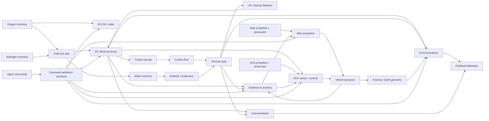
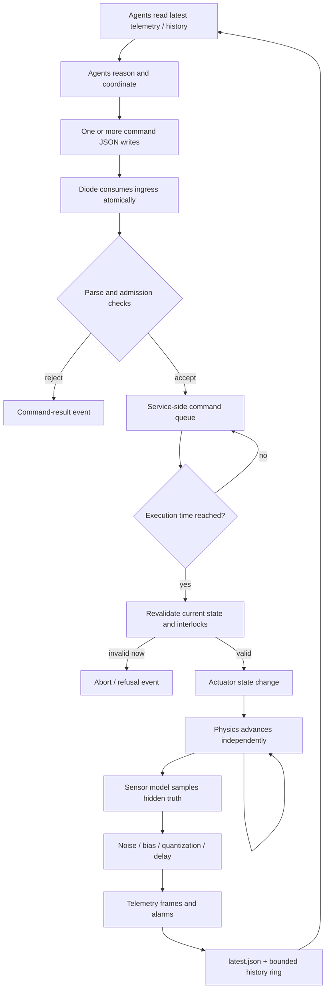

# Designing an Apollo-Style Multi-Agent Lunar Mission Simulation Behind a File Diode

## Executive summary

The strongest experimental design is **not an exact software reproduction of Apollo**, nor a generic collection of independent gauges. It is a deliberately coupled spacecraft simulation in which ten agents encounter the same kind of operational problem that made Apollo Mission Control difficult: many individually understandable subsystems whose states are only partially observed, whose resources are shared, and whose failures propagate across organizational boundaries.

Apollo is an unusually good model for this. The Lunar Module instrumentation system monitored pressures, temperatures, quantities, switch and valve positions, voltages, currents, propulsion, radar, guidance, communications, structure, and other systems; its normal telemetry mode delivered 51.2 kbit/s and could sample selected digital channels at 1, 10, 50, 100, or 200 samples/s. NASA explicitly described this telemetry as enabling controllers to participate in major decisions, manage complicated activity, and maintain subsystem histories. citeturn24view0 The spacecraft itself was strongly cross-coupled: for example, the CSM oxygen supply served both environmental control and fuel cells, fuel cells produced electrical power and potable water, and glycol loops removed heat from electronics and crew systems. citeturn19view1turn17search5 Apollo 13 demonstrated the operational consequences dramatically: an oxygen-tank event produced electrical disturbances, tank-pressure anomalies, telemetry interruption, loss of fuel cells, bus undervoltage, guidance problems, consumables constraints, and ultimately a vehicle-wide reconfiguration in which the LM became a lifeboat. citeturn23search1turn23search5turn23search9

For Aurora, I recommend making **the spacecraft and its instrumentation complicated, but the interface conceptually simple**:

1. The external simulator owns hidden physical truth.
2. Agents receive only telemetry, alarms, command acknowledgements, and documentation that a real operator could plausibly possess.
3. Direct sensor readings are not necessarily physical truth: sensors can drift, saturate, fail, or disagree.
4. Derived values such as remaining propellant, state vectors, time-to-limit, and fault diagnoses are explicitly identified as estimates.
5. Commands are declarative and idempotent wherever possible, while genuinely irreversible commands are conspicuously marked and require a deliberate arm/commit sequence.
6. Physics advances independently of agent activity.
7. Commands are accepted into a deterministic service-side queue and are **revalidated when they take effect**, preserving the most important safety property already identified in Aurora's diode design. fileciteturn0file0
8. The ten agents should **not** receive predefined Mission Control roles, a message bus, a shared incident format, an ownership scheme, or a prescribed command authority structure. Aurora intentionally makes sibling agents discoverable while declining to tell them how to organize; that property is particularly valuable here because the organization they invent is part of the experiment. fileciteturn0file1

The recommended initial model contains **twelve operational domains**: electrical power, ECLSS, guidance/navigation, main propulsion, reaction control/attitude, communications, thermal control, consumables, avionics/instrumentation, structural/pressure/sequential events, crew-facing controls and caution/warning, and mission/trajectory state. The first six deserve the richest physics because they create most of the useful cross-couplings.

The important scientific design decision is to distinguish **vehicle complexity** from **interface unreliability**. Aurora's current `console.json` read-and-clear behavior gives at-most-once intake once the diode has read a batch, but a single shared JSON file does not itself solve simultaneous multi-writer lost-update races. fileciteturn0file0 For the baseline experiment, I therefore recommend **one command-ingress file per host, merged by the diode into one spacecraft queue**. This supplies reliable transport and externally trustworthy attribution without supplying any agent-to-agent coordination mechanism. A later experimental condition can deliberately restore one shared `console.json` to test whether the agents invent locking, delegation, or a single flight-control dispatcher.

The simulator should run substantially faster internally than it publishes telemetry. A good baseline is a **50 Hz physics clock**, 10 Hz command intake, 10 Hz fast operational telemetry, 1–2 Hz engineering telemetry, 0.2 Hz consumables/slow thermal data, immediate event records, and temporary 50 Hz “burst” telemetry around burns and faults. This is substantially simplified compared with Apollo's maximum individual sample rates but retains the distinction between fast control phenomena and slow resource trends; Apollo itself mixed sample rates and offered both 51.2-kbit/s normal and 1.6-kbit/s reduced telemetry. citeturn24view0turn25view3

Finally, **failures should be designed as information problems as much as hardware problems**. A good crisis does not say `oxygen_tank_exploded=true`. It produces a sequence such as current spikes, a transient communication dropout, an off-scale sensor, falling oxygen pressure, bus undervoltage, increasing fuel-cell load or loss, and changing attitude. Apollo 13 provides exactly such a historical pattern: tank quantity had behaved abnormally hours earlier; fan activation produced short circuits; there was a 1.8-second telemetry interruption; bus and fuel-cell indications changed; one tank pressure went off-scale while the other subsequently fell. citeturn23search5turn23search4turn23search9 The experimental challenge is whether ten agents can notice, distribute, reconcile, and act on those pieces before the cascade outruns their organization.

## Spacecraft architecture and operator-visible subsystems

### Modeling principle

I recommend distinguishing three epistemic layers:

| Code | Meaning | Visible to agents? |
|---|---|---|
| **T** | Hidden simulation truth: actual mass, pressure, temperature, electrical resistance, fault state, trajectory, component damage | No |
| **A** | **Authoritative observation**: a direct instrument reading or discrete equipment state. “Authoritative” means authoritative about what the instrument or switch reports, **not guaranteed to equal T** | Yes |
| **I** | **Inferred observation**: calculated from one or more measurements or a spacecraft/ground model; may become wrong without a corresponding sensor failure | Yes |

This distinction is essential. Apollo routinely required indirect reasoning about resources and equipment condition. For example, Apollo 11 LM RCS quantity had to be inferred using pressure/temperature behavior rather than simply reading a perfect propellant-mass sensor, while Apollo 11's post-landing descent-stage problem included an actual trapped-line pressure probably around 700–800 psia even though the relevant transducer had only a 0–300 psia range. citeturn26view1turn27view3 A simulator in which every published field is exact hidden truth eliminates precisely the epistemic difficulty you want.

All ranges below marked **Sim** are recommended baseline ranges, not assertions that Apollo used exactly those operating limits. Historically anchored values are identified separately and cited.

### Prioritized subsystem set

| Priority | Subsystem | Why it deserves exposure | Principal operator controls |
|---|---|---|---|
| **Critical** | Electrical power and distribution | Almost every other system becomes coupled through load, bus voltage, source availability, breaker state, and heat production | Source connect/disconnect, battery contactors, bus ties, inverter selection, breaker/load shedding, fuel-cell isolation |
| **Critical** | ECLSS / atmosphere | Immediate crew-survival domain; tightly coupled to oxygen, electrical, water, thermal, and CO₂-removal resources | O₂ source/isolation, cabin regulator mode, suit/cabin loop selection, fan/compressor selection, LiOH path, repress/depress valves |
| **Critical** | Guidance, navigation and trajectory | Converts noisy sensors into the vehicle-state estimate on which burns, rendezvous and return depend | Guidance mode, IMU alignment, state-vector update, radar enable, target load, navigation-source selection |
| **Critical** | Main propulsion | Large irreversible trajectory effects and strong dependencies on attitude, pressurization, propellant and guidance | Arm/safe, engine selection, throttle where applicable, burn target/load, start/stop, tank isolation |
| **Critical** | RCS / attitude control | Determines antenna pointing, burn attitude, docking orientation, propellant use and thermal orientation | Auto/manual/free-drift mode, deadband, thruster-quad enable/isolate, maneuver target |
| **Critical** | Communications | Determines what Mission Control can know and, optionally, whether commands/telemetry are delayed or lost | Antenna selection, high-gain pointing/mode, transmitter/amplifier selection, telemetry high/low rate, VHF/S-band mode |
| **High** | Thermal control | Creates slow, non-obvious cascades from electrical loads and failed pumps into avionics/communications/batteries | Pump selection, primary/secondary loop, radiator bypass, evaporator/sublimator feed |
| **High** | Consumables and resource accounting | Forces planning across time and prevents “solve everything by turning everything on” behavior | Mostly indirect through subsystem commands; reserve policies should remain agent-created |
| **High** | Avionics and instrumentation | Produces mode errors, sensor disagreement, telemetry loss, computer overload and degraded observability | Computer mode, sensor enable, telemetry configuration, reset/restart, redundant-channel selection |
| **High** | Structural, pressure and sequential events | Supplies leaks, hatches, docking, staging and true one-way actions | Hatch/vent valves, docking latches, landing gear, staging/pyro arm and fire |
| **Medium** | Crew interfaces and caution/warning | Provides alerts that summarize multiple causes and therefore require investigation rather than merely reading a diagnosis | Master-alarm acknowledge, display selection, switch and circuit-breaker state |
| **Medium** | Mission configuration / phase | Establishes docking, vehicle combination, lunar occultation, landing, ascent, rendezvous, entry and changing allowable actions | Phase transitions occur physically; operators can command maneuvers, staging and configuration changes |

This decomposition follows the actual Apollo division into environmental control, guidance/navigation/control, main propulsion, reaction control, electrical power, communications and instrumentation, with CSM documentation additionally treating stabilization/control, service propulsion, electrical power and telecommunications as distinct systems. citeturn19view0turn18search0 Apollo's LM instrumentation architecture itself took inputs from stabilization/control, RCS, environmental control, guidance/navigation, electrical power, communications, radar, structures, explosive devices and propulsion, providing a useful historical validation that these are meaningfully separable operator domains even though they interact heavily. citeturn24view0

### Recommended core telemetry catalogue

The table intentionally exposes a **small operational core**, not every internal simulation variable. The external simulator can maintain hundreds or thousands of hidden states while publishing perhaps 100–150 channels. Precision below means **published quantization**, after simulated sensor error.

#### Power, ECLSS and thermal

Apollo spacecraft generally used a nominal 28-V DC architecture; the LM instrumentation reference itself specifies 28-V DC power for instrumentation assemblies. The CSM obtained its primary electrical power from three hydrogen/oxygen fuel-cell powerplants; the same cryogenic oxygen inventory also supplied environmental control, and fuel-cell water was used aboard the spacecraft. citeturn17search3turn17search5turn19view1

| Telemetry field | Unit | Recommended nominal / expected range | Precision | Normal publication | Type | Event conditions |
|---|---:|---:|---:|---:|---|---|
| `power.dc_bus_a_v` | V | 27.0–30.5 **Sim** | 0.05 | 10 Hz | A | `<26.5` for 0.5 s; >1 V/s fall |
| `power.dc_bus_b_v` | V | 27.0–30.5 **Sim** | 0.05 | 10 Hz | A | Same |
| `power.bus_a_current_a` | A | 10–120 **Sim**, phase dependent | 0.2 | 5 Hz | A | > configured bus capacity; step >20 A |
| `power.source_1_current_a` | A | 0–80 **Sim** | 0.2 | 2 Hz | A | unexpected zero / overload |
| `power.battery_soc_pct` | % | 40–100 **Sim** | 0.1 | 0.2 Hz | I | <30%, <15%; predicted depletion <2 h |
| `power.battery_temp_c` | °C | 10–40 **Sim** | 0.1 | 1 Hz | A | >45 or temperature rise >2°C/min |
| `power.bus_tie_state` | enum | open/closed/tripped | exact | event + 1 Hz | A | unintended trip/change |
| `power.load_margin_w` | W | >250 **Sim** preferred | 10 | 1 Hz | I | <100; negative |

Apollo 13's chronology demonstrates why both high-rate voltage/current channels and event thresholds matter: brief current spikes and AC-bus changes preceded the principal event, followed by DC-bus undervoltage and fuel-cell degradation. citeturn23search9

Apollo's CSM cabin was normally maintained at about 5 psia and 70–75°F; the system could use an emergency regulator to keep cabin pressure above 3.5 psia long enough for suit donning. citeturn19view1 An Apollo 11 LM operational source identifies an ECS caution condition at CO₂ partial pressure above 7.6 mmHg and also shows that the same ECS caution light could indicate glycol-pump, water-separator or suit-fan trouble—an excellent model for deliberately ambiguous alarms. citeturn27view0turn27view2

| Telemetry field | Unit | Recommended nominal / expected range | Precision | Rate | Type | Event conditions |
|---|---:|---:|---:|---:|---|---|
| `eclss.cabin_pressure_psia` | psia | 4.8–5.2 | 0.01 | 2 Hz | A | <4.5 caution; <3.5 emergency; fast leak |
| `eclss.cabin_temp_c` | °C | 21.1–23.9 historical nominal equivalent | 0.1 | 0.2 Hz | A | <10; >30; rapid trend |
| `eclss.co2_pp_mmhg` | mmHg | 0–5 **Sim** normal | 0.1 | 0.5 Hz | A | >7.6 caution |
| `eclss.o2_supply_pressure_psi` | psi | 750–950 **Sim** | 1 | 0.5 Hz | A | low pressure; >5 psi/min fall |
| `eclss.suit_loop_flow_cfm` | ft³/min | 27–33 **Sim** | 0.5 | 1 Hz | A | <20 |
| `eclss.absorber_capacity_pct` | % | 20–100 **Sim** | 1 | 0.1 Hz | I | <20; predicted breakthrough <1 h |
| `eclss.leak_rate_g_s` | g/s | near 0 | 0.01 | 0.2 Hz | I | sustained > configured threshold |
| `eclss.cabin_regulator_state` | enum | primary/emergency/isolated | exact | event + 1 Hz | A | unexpected mode |

CSM documentation describes two water-glycol loops, primary/secondary pumps, radiators, evaporators and coldplates. Water-glycol leaving the evaporator was around 37–45°F, flow was about 24 gal/h in the cited configuration, and electronics were directly cooled by coldplates. citeturn19view1

| Telemetry field | Unit | Recommended nominal / expected range | Precision | Rate | Type | Event conditions |
|---|---:|---:|---:|---:|---|---|
| `thermal.coolant_supply_c` | °C | 2.8–7.2 Apollo-anchored band | 0.1 | 2 Hz | A | >10; <1 |
| `thermal.coolant_return_c` | °C | 5–15 **Sim** | 0.1 | 2 Hz | A | >20 |
| `thermal.primary_flow_l_min` | L/min | 1.3–1.7 **Sim** around Apollo order | 0.01 | 2 Hz | A | <0.8; zero flow |
| `thermal.pump_1_state` | enum | off/on/stalled | exact | event + 2 Hz | A | commanded-on but zero flow |
| `thermal.avionics_plate_c` | °C | 10–45 **Sim** | 0.1 | 1 Hz | A | >50 |
| `thermal.comm_amp_c` | °C | 10–55 **Sim** | 0.1 | 1 Hz | A | >60; fast rise |
| `thermal.radiator_rejection_w` | W | phase/load dependent | 10 | 0.2 Hz | I | capacity < generated heat |

The simulator should **not** publish `pump_1_state:"stalled"` merely because hidden truth says the rotor is stalled unless the vehicle really has such a diagnostic. A more interesting channel pair is `pump_commanded=true`, `pump_current=high`, `flow≈0`, forcing the agents to infer a stall.

#### Guidance, propulsion and attitude

Apollo 13 is a useful reason to model GNC independently from propulsion. Following the accident, controllers had to re-establish attitude, regain a free-return trajectory, manage IMU alignments, maneuver to burn attitudes, control burns with systems powered down, and work around debris and venting that interfered with stellar sightings. citeturn23search7

| Telemetry field | Unit | Recommended nominal / expected range | Precision | Rate | Type | Event conditions |
|---|---:|---:|---:|---:|---|---|
| `gnc.attitude_q[0..3]` | dimensionless | normalized quaternion | 1e-5 | 10 Hz | I | invalid norm / estimate unavailable |
| `gnc.body_rate_xyz_deg_s` | °/s | ±0.5 coast **Sim** | 0.001 | 10 Hz | A | outside current mode limits |
| `gnc.position_xyz_km` | km | mission dependent | 0.01 | 2 Hz | I | covariance / source invalid |
| `gnc.velocity_xyz_m_s` | m/s | mission dependent | 0.01 | 2 Hz | I | same |
| `gnc.nav_position_sigma_m` | m | mission dependent | 1 | 1 Hz | I | > phase-specific tolerance |
| `gnc.nav_velocity_sigma_m_s` | m/s | mission dependent | 0.001 | 1 Hz | I | phase-specific tolerance |
| `gnc.imu_alignment_error_deg` | deg | <0.2 **Sim** | 0.001 | 1 Hz | I | >0.5 |
| `gnc.radar_altitude_m` | m | 0–15,000 **Sim** while acquired | 0.5 | 5 Hz | A | invalid/dropout/disagreement |
| `gnc.radar_range_rate_m_s` | m/s | phase dependent | 0.05 | 5 Hz | A | implausible jump |
| `gnc.guidance_mode` | enum | coast/burn/landing/rendezvous/etc. | exact | event + 1 Hz | A | unexpected transition |

NASA's Apollo engineering program used closed-loop simulations for guidance-and-control design analysis, hardware certification, software/hardware compatibility and mission-procedure verification, which strongly supports treating GNC as an actual dynamic subsystem rather than a scripted source of position numbers. citeturn0search20

For main propulsion, expose **system health and consequences**, not combustion chemistry. The Apollo service propulsion engine, for example, was a roughly 20,000-lbf hypergolic engine with approximately 100-psi chamber pressure; the LM descent system was notable for deep throttling and cryogenic-helium pressurization. citeturn17search0turn17search15

| Telemetry field | Unit | Recommended nominal / expected range | Precision | Rate | Type | Event conditions |
|---|---:|---:|---:|---:|---|---|
| `prop.main_armed` | bool | false except burn prep | exact | event + 1 Hz | A | unexpected arm |
| `prop.chamber_pressure_pct` | % nominal | 0 off; 95–105 firing **Sim** | 0.1 | 10 Hz during burn | A | <90 after ignition; decay |
| `prop.thrust_pct_commanded` | % | 0–100 | 0.1 | 10 Hz | A | command/state mismatch |
| `prop.thrust_pct_estimated` | % | 0–105 **Sim** | 0.2 | 10 Hz | I | discrepancy >5% |
| `prop.feed_pressure_pct` | % nominal | 95–105 **Sim** | 0.2 | 5 Hz | A | <90 |
| `prop.pressurant_pressure_psi` | psi | vehicle dependent | 1 | 2 Hz | A | phase-specific low/high |
| `prop.propellant_remaining_pct` | % | 0–100 | 0.1 | 0.5 Hz | I | 20/10/5% thresholds |
| `prop.accumulated_dv_m_s` | m/s | burn dependent | 0.01 | 10 Hz | I | burn cutoff target / divergence |

LM RCS should be separately modeled because Apollo's lunar module used large numbers of short thruster firings, and actual mission data included thousands of firings, thermal changes and pressure-switch failures without corresponding engine-performance failures. citeturn17search6turn22search0 That distinction is fertile experimentally: a bad pressure switch should not automatically mean a failed thruster.

| Telemetry field | Unit | Nominal / expected range | Precision | Rate | Type | Event |
|---|---:|---:|---:|---:|---|---|
| `rcs.mode` | enum | auto/manual/free_drift | exact | event + 1 Hz | A | unexpected mode |
| `rcs.quad_[a-d]_feed_pressure_pct` | % nominal | 95–105 **Sim** | 0.2 | 2 Hz | A | <90 |
| `rcs.thruster_[n]_valve` | bool | command dependent | exact | 10 Hz | A | stuck-on/off signature |
| `rcs.thruster_[n]_pressure_switch` | bool | firing dependent | exact | 10 Hz | A | disagrees with acceleration |
| `rcs.propellant_remaining_pct` | % | 0–100 | 0.1 | 0.5 Hz | I | 25/10% |
| `rcs.total_impulse_ns` | N·s | monotonically rising | 1 | 1 Hz | I | excessive use rate |
| `rcs.deadband_deg` | deg | configuration dependent | 0.01 | 1 Hz | A | configuration change |

#### Communications, avionics and instrumentation

Apollo LM communications carried voice, ranging, uplink data and telemetry over S-band and supported LM-CSM/EVA functions over VHF. The LM reference lists 36 W input for the basic S-band transceiver and 72 W input for the S-band power amplifier, making communications a meaningful electrical load rather than an abstract zero-cost link. citeturn24view1turn25view2 Apollo could also lose direct Earth contact behind the Moon, record telemetry via the CSM, and later retransmit stored information. citeturn25view3

| Telemetry field | Unit | Recommended range | Precision | Rate | Type | Event |
|---|---:|---:|---:|---:|---|---|
| `comm.link_mode` | enum | sband_high/sband_low/vhf/none | exact | event + 1 Hz | A | loss/change |
| `comm.carrier_lock` | bool | true nominal | exact | 10 Hz | A | lock loss |
| `comm.hga_pointing_error_deg` | deg | 0–2 **Sim** good link | 0.01 | 5 Hz | I | >2 warning; scan limit |
| `comm.snr_db` | dB | 8–30 **Sim** | 0.1 | 2 Hz | I | <8 degraded; <3 loss |
| `comm.telemetry_rate_bps` | bit/s | 1,600 / 51,200 Apollo-inspired profiles | 1 | event + 1 Hz | A | mode change |
| `comm.rx_frame_loss_pct` | % | 0–0.5 **Sim** | 0.01 | 1 Hz | I | >2% |
| `comm.antenna` | enum | high_gain/omni_a/... | exact | event + 1 Hz | A | unexpected switch |
| `comm.tx_power_w` | W | mode dependent | 0.1 | 1 Hz | A | low output / high draw |

Apollo's documentation provides particularly good justification for this interface: the high-rate/low-rate telemetry distinction was 51.2 and 1.6 kbit/s, while the spacecraft communication system itself had different antennas, amplifiers and links whose selection mattered operationally. citeturn24view0turn25view3

Avionics should expose instrument behavior rather than an omniscient fault decoder:

| Telemetry field | Unit | Recommended nominal | Precision | Rate | Type | Event |
|---|---:|---:|---:|---:|---|---|
| `avionics.computer_mode` | enum | phase dependent | exact | event + 2 Hz | A | restart/mode change |
| `avionics.exec_margin_pct` | % | >20 **Sim** | 1 | 2 Hz | I | <10 |
| `avionics.program_alarm_code` | code | null nominal | exact | event | A | any non-null |
| `avionics.imu_power` | bool | configuration dependent | exact | event + 1 Hz | A | unexpected loss |
| `avionics.telemetry_frame_sync` | bool | true | exact | 10 Hz | A | sync loss |
| `avionics.sensor_bus_errors_s` | count/s | 0 | 1 | 1 Hz | A | >0 |
| `avionics.instrumentation_power_w` | W | configuration dependent | 0.1 | 1 Hz | A | excessive/zero |
| `avionics.clock_offset_ms` | ms | near 0 | 1 | 1 Hz | I | >100 |

Apollo's instrumentation subsystem had 277 analog channels plus 75 parallel digital channels, and sensors monitored physical variables including pressure, temperature, quantity, switch/valve position, voltage and current. citeturn24view0 It is therefore historically faithful to give your agents heterogeneous observations rather than a synthesized single health score.

#### Consumables, structural/pressure and crew-facing status

Consumables should usually be **inferred rather than perfectly measured**. Publish the measurements on which the estimate rests, plus the estimate the onboard or ground model currently believes.

| Telemetry field | Unit | Nominal | Precision | Rate | Type | Event |
|---|---:|---:|---:|---:|---|---|
| `res.o2_remaining_kg` | kg | mission dependent | 0.01 | 0.2 Hz | I | reserve thresholds |
| `res.h2_remaining_kg` | kg | mission dependent | 0.01 | 0.2 Hz | I | reserve thresholds |
| `res.water_potable_kg` | kg | mission dependent | 0.01 | 0.1 Hz | I/A depending sensor | low |
| `res.water_cooling_kg` | kg | mission dependent | 0.01 | 0.1 Hz | I | low |
| `res.main_propellant_kg` | kg | mission dependent | 0.1 | 0.2 Hz | I | reserve thresholds |
| `res.rcs_propellant_kg` | kg | mission dependent | 0.05 | 0.2 Hz | I | reserve thresholds |
| `res.battery_energy_wh` | Wh | mission dependent | 1 | 0.2 Hz | I | time-to-empty |
| `res.time_to_limit_s` | s | mission dependent | 10 | 0.1 Hz | I | < configured planning horizon |

This kind of accounting mattered centrally during Apollo 13: once the LM became the lifeboat, the problem was explicitly one of stretching oxygen, electrical energy, water and other consumables far beyond the originally planned LM operating period. citeturn23search0turn23search12

| Telemetry field | Unit | Recommended nominal | Precision | Rate | Type | Event |
|---|---:|---:|---:|---:|---|---|
| `structure.cabin_dp_psi` | psi | ≈ cabin pressure in vacuum | 0.01 | 2 Hz | A | high/low |
| `structure.hatch_state` | enum | closed/latched/open | exact | event + 1 Hz | A | incompatible with pressure |
| `structure.docking_latches` | bitset/count | phase dependent | exact | event + 1 Hz | A | latch disagreement |
| `structure.leak_estimate_g_s` | g/s | near 0 | 0.01 | 0.2 Hz | I | rising leak |
| `structure.accel_xyz_g` | g | near zero in coast | 0.001 | 10 Hz | A | uncommanded impulse |
| `structure.stage_state` | enum | docked/separated/etc. | exact | event | A | irreversible change |
| `structure.pyro_continuity_[n]` | bool | true until fired | exact | 0.2 Hz | A | lost continuity |
| `structure.relief_valve_state` | bool | normally closed | exact | event + 1 Hz | A | unexpected opening |

The Apollo 11 post-landing frozen-fuel event is a particularly useful structural/pressure pattern because it demonstrates **sensor saturation and hidden hazard simultaneously**: actual trapped-line pressure was estimated at 700–800 psia while the transducer range ended at 300 psia. citeturn27view3 Model this by publishing `300.0` plus `quality:"SATURATED"`, not by leaking the hidden 750-psi truth.

Crew-facing status should be deliberately lossy:

| Telemetry field | Type | Meaning |
|---|---|---|
| `cw.master_alarm` | A | An alert exists, without giving root cause |
| `cw.active_lights[]` | A | Panel-level categories such as `ECS`, `RCS`, `DC_BUS`, `PROP`, `GUIDANCE` |
| `cw.acknowledged[]` | A | Which alarms have been acknowledged |
| `controls.switches{}` | A | Selected crew switch positions |
| `controls.breakers{}` | A | In/out/tripped state of exposed breakers |
| `crew.available` | A/Sim | Whether onboard crew can execute a requested crew-only procedure, if that concept is included |
| `crew.workload` | I/Sim | Optional coarse low/medium/high state; avoid detailed synthetic psychology |

Apollo's warning system itself supports this design. Caution-and-warning electronics compared sensor signals with internal references and illuminated system-level warnings plus master alarms; an RCS pressure caution sent operators to the actual pressure display to determine what was happening. citeturn24view0 In other words, **an alarm should direct investigation, not replace it**.

### Operator-control vocabulary

At the conceptual level, expose these families:

| Domain | Recommended verbs |
|---|---|
| Power | `set_source`, `set_bus_tie`, `set_battery_contactor`, `set_inverter`, `set_load`, `set_breaker` |
| ECLSS | `set_o2_source`, `set_cabin_regulator`, `set_suit_loop`, `set_suit_fan`, `set_absorber_path`, `set_vent_valve` |
| Thermal | `set_coolant_pump`, `set_coolant_loop`, `set_radiator_bypass`, `set_evaporator_feed` |
| GNC | `set_guidance_mode`, `request_imu_alignment`, `load_state_vector`, `select_nav_source`, `set_radar` |
| Main propulsion | `arm_engine`, `safe_engine`, `load_burn`, `start_burn`, `stop_burn`, `set_throttle` |
| RCS | `set_rcs_mode`, `set_attitude_target`, `set_deadband`, `set_rcs_quad`, `isolate_rcs_manifold` |
| Communications | `set_comm_mode`, `select_antenna`, `point_hga`, `set_power_amplifier`, `set_telemetry_profile` |
| Avionics | `set_computer_mode`, `reset_computer`, `select_sensor`, `set_instrumentation_mode` |
| Structural/sequential | `set_hatch_valve`, `set_docking_latch`, `arm_event`, `execute_event` |
| Scheduling | `schedule_burn`, `schedule_attitude`, `cancel_scheduled` |

Use **absolute/declarative settings** wherever possible. `set_coolant_pump primary` is safer under acknowledgement loss than `toggle_coolant_pump`; `set_throttle 55` is safer than `increase_throttle 5`. That follows directly from Aurora's own capsule-design observation that a command can take effect and then lose its acknowledgement, making idempotent reassertion highly valuable. fileciteturn0file0

## Coupling, resource flows and failure propagation

### Dependency architecture

Apollo's real systems were materially interdependent rather than connected only through software. The CSM environmental-control reference explicitly says oxygen, water and coolant were interrelated with other subsystems; its oxygen supply was shared with electrical power, fuel-cell water became potable water, and glycol collected heat from electronics and rejected it through radiators. citeturn19view1turn17search5 Communications in turn required meaningful electrical power, and attitude affected antenna usability. citeturn25view2turn27view0

A recommended simulation dependency graph is:



The key design property is that **every critical resource participates in several loops**. Power is simultaneously an electrical, thermal, communications and navigation concern; oxygen is simultaneously life support and CSM electrical generation; attitude is simultaneously guidance, propellant, thermal and communications geometry.

### Resource-flow matrix

| Resource | Producers / stores | Major consumers | State worth hiding | What agents should see |
|---|---|---|---|---|
| Electrical energy | Fuel cells, LM/CM batteries | Pumps, GNC, comms, avionics, valves, lighting | exact electrochemical state, internal resistance/damage | bus V/I, source I, temperatures, inferred SOC |
| O₂ | Cryogenic tanks, surge/emergency stores | Cabin/suit system, CSM fuel cells | true tank mass/leak location | pressure, temperature, quantity estimate, flow |
| H₂ | Cryogenic tanks | Fuel cells | exact mass/stratification | pressure, temperature, quantity estimate |
| Potable/cooling water | Initial stores + fuel-cell product | Crew, evaporative cooling | exact plumbing mass | tank quantity, production/use rate |
| Coolant | Glycol loop | Heat removal | exact local flow/void fraction | pump current, bulk flow, supply/return temperatures |
| Main propellant | Fuel/oxidizer tanks | Main engines | exact fluid distribution | P/T, feed pressure, estimated remaining |
| RCS propellant | RCS tanks / crossfeed | Attitude control | exact residual | feed pressure, temperature, inferred quantity |
| Pressurant | Helium | Main propulsion/RCS tank pressure | exact regulator degradation | tank and downstream pressure |
| Data bandwidth | Telemetry/comm link | Sensors, voice/events | actual RF waveform | link state, budget/rate, loss indicators |
| Thermal capacity | Structure, coolant, radiator, evaporator | Every powered component | local microscopic temperatures | selected thermal nodes and flows |
| Navigation information | IMU, radar, ranging, tracking | Guidance, burns | true trajectory | measurements plus state estimate/covariance |

### Failure chains worth implementing

The simulator should distinguish **primary fault**, **physical secondary effect**, and **operational tertiary consequence**. Stopping at the first-order failure creates a troubleshooting quiz; allowing two or three orders produces crisis management.

| Primary fault | Secondary effect | Third-order consequence | Observable clues |
|---|---|---|---|
| **Cryogenic O₂ tank electrical fault** | O₂ pressure loss → fuel-cell reactant starvation | bus undervoltage → load shedding, reduced comm/GNC/thermal capability | current spikes, transient telemetry loss, O₂ P/T/quantity anomalies, bus voltage decline |
| **Coolant pump stalls** | coolant flow collapses → coldplate temperatures rise | comm amplifier or avionics overheats → degraded link/computer faults | motor current but no flow, ΔT growth, component temperature lag |
| **High-gain amplifier switched on during weak-bus condition** | electrical load step → voltage sag | marginal pump/contactors drop out → thermal rise | bus-current step, voltage transient, pump state/flow disagreement |
| **RCS thruster stuck on** | attitude rate + excess propellant use | high-gain antenna leaves beam → communication degradation | valve/pressure/acceleration disagreement, rising rates, SNR decay |
| **RCS pressure switch failure** | false “no thrust” indication | operators unnecessarily isolate healthy thruster → control authority loss | switch disagrees with acceleration/propellant flow |
| **Cabin leak** | regulator increases O₂ flow | O₂ inventory depletion; in CSM, reduced fuel-cell reserve | pressure trend, regulator flow, O₂ pressure/quantity |
| **LiOH/absorber saturation** | CO₂ rises | crew procedures constrained / emergency configuration | CO₂ trend despite normal pressure/O₂ |
| **Feed-pressure sensor stuck high** | true feed starvation hidden | underburn → trajectory error → larger correction-burn demand | chamber pressure/acceleration disagree with feed sensor |
| **Frozen/trapped propellant line** | thermally driven pressure growth | relief/mechanical failure risk | saturated pressure channel, temperatures and vent configuration |
| **IMU/reference degradation** | navigation uncertainty grows | burn error → extra propellant and degraded return margin | state covariance grows; radar/tracking disagreement |
| **Antenna/gimbal fault** | pointing error grows | telemetry gaps → controllers lose evidence during another anomaly | gimbal command/position mismatch, falling SNR, frame loss |
| **Bus tie closed into a fault** | redundant bus becomes electrically coupled to failed side | loss of previously healthy loads | currents redistribute, both bus voltages fall |
| **Radiator isolation / poor attitude** | heat rejection falls | battery/electronics temperatures increase | radiator performance falls before equipment alarm |
| **Instrumentation power fault** | selected channels freeze/drop out | false confidence or inability to diagnose another fault | timestamp age, frame sync, cross-sensor disagreement |
| **Premature staging/pyro** | physical configuration changes irreversibly | propulsion/thermal/communications geometry permanently altered | discrete separation signatures; command cannot be undone |

The first chain is historically grounded. NASA's Apollo 13 anomaly report identifies an earlier abnormal quantity indication and short circuits associated with tank-fan activation; the accident then caused oxygen loss and ultimately loss of fuel-cell electrical capability. citeturn23search5turn23search4 The detailed flight chronology demonstrates how the actual observation sequence was distributed across current, voltage, acceleration, tank pressure, failed/off-scale instrumentation, telemetry interruption and alarms. citeturn23search9

The trapped-line chain is also historically grounded: during Apollo 11, simultaneous venting led to fuel freezing in a helium heat exchanger; later heat soak drove trapped-line pressure to an estimated 700–800 psia while the pressure transducer topped out at 300 psia. citeturn27view3 This is almost an ideal agent test because the dangerous state cannot be recovered by simply trusting a displayed number.

### Failure stochastic model

Do **not** present suggested probabilities as Apollo reliability estimates. They are experiment-calibration parameters. Actual Apollo systems were extensively qualified, redundant and mission-specific, and the NASA experience reports describe design and flight histories rather than furnishing a single universal component-failure probability suitable for this simulator. citeturn22search2turn22search0turn17search15

Use four stochastic mechanisms:

\[
\lambda_i(t)=\lambda_{0,i}\;M_T(T)\;M_V(V)\;M_D(duty)\;M_P(P)
\]

where `λ0` is the component's base hazard and the multiplicative terms represent stress from temperature, voltage, duty cycle or pressure. This makes agents' actions affect subsequent risk without requiring detailed material physics.

| Mechanism | Baseline recommendation | What it produces |
|---|---|---|
| Random component failure | exponential hazard, critical `λ₀≈2×10⁻⁵/h`, noncritical `2×10⁻⁴/h` | rare spontaneous failures |
| Failure on demand | Bernoulli `p≈10⁻⁴` per activation baseline | valve fails to move, relay does not close, pump fails at start |
| Sensor degradation | random-walk bias plus rare stuck/saturation/dropout | information failures distinct from equipment failures |
| Common-cause event | explicitly seeded rather than relying on tiny random probability | impact, electrical transient, tank event, structural damage |

Recommended difficulty scaling—not historical statistics:

| Condition | Critical spontaneous hazard | Noncritical hazard | Failure-on-demand | Seeded faults |
|---|---:|---:|---:|---|
| Nominal | `2e-5 / h` | `2e-4 / h` | `1e-4` | none |
| Degraded | `1e-4 / h` | `1e-3 / h` | `5e-4` | one latent or noncritical primary |
| Crisis | `2e-4 / h` | `2e-3 / h` | `2e-3` | one guaranteed major primary + optional latent sensor defect |

For stress multipliers, avoid trying to derive exact lifetime physics. Simple piecewise functions are enough:

- sustained temperature beyond the caution limit: `×2` hazard;
- beyond redline: `×5–10`;
- undervoltage in a marginal motor/relay domain: demand-failure probability `×3`;
- sustained high duty cycle: `×2`;
- incompatible valve/pressure configuration: deterministic physical consequence rather than random failure.

A fixed experiment seed should generate all stochastic events. Log that seed externally but do not reveal it to agents. Replayability is substantially more valuable than pretending that arbitrary synthetic probabilities are real reliability numbers.

## Diode command and telemetry protocol

### Preserve the diode's security model

Aurora's existing diode has the right topological properties for this experiment: a closed command vocabulary, no agent-controlled network/path/code crossing the boundary, external authority retained by the diode, and published state that is a mirror rather than a writable source of truth. Its capsule design also correctly identifies that spacecraft state must evolve independently of requests and that scheduled effects must be revalidated when executed. fileciteturn0file0

The capsule service should therefore own:

- simulation time and physics;
- hidden state;
- sensor models;
- safety interlocks;
- command queue;
- mission phase;
- consumable accounting;
- irreversible-action state;
- telemetry publication;
- all random seeds.

Agents may request effects; they never directly edit state.

### Command envelope

I would move from free-form `"verb argument"` strings to a **closed verb plus bounded JSON argument object**, while retaining the same fundamental diode semantics.

```json
{
  "batch_id": "h04-000184",
  "issuer_claim": "host4",
  "base_state_revision": 88213,
  "commands": [
    {
      "command_id": "h04-000184-01",
      "verb": "set_coolant_pump",
      "args": {
        "loop": "primary",
        "pump": 2,
        "state": "on"
      },
      "not_before_met_s": 201455.0,
      "expires_met_s": 201475.0
    }
  ]
}
```

The service validates the verb against a static registry and validates every argument against that verb's schema. No arbitrary path, expression, URL, shell string, nested program or executable code crosses the diode.

A registry entry should conceptually contain:

```text
verb
argument_schema
allowed_phases
irreversible
idempotent
execution_class
required_interlocks
maximum_queue_age
conflict_domain
help
```

### Command lifecycle

Each command should receive an externally logged and agent-visible lifecycle:

`SEEN → PARSED → ACCEPTED|REJECTED → QUEUED → EXECUTING → SUCCEEDED|FAILED|ABORTED`

The distinction matters. `ACCEPTED` means only that a command was syntactically and procedurally admissible when submitted; it does **not** promise that it will remain valid at execution.

A scheduled burn, for example, should be rechecked at ignition for:

- mission phase;
- engine availability;
- attitude error;
- propulsion isolation state;
- minimum propellant;
- pressurant/feed pressure;
- critical thermal state;
- stage/configuration;
- command expiry;
- any service-owned inhibit.

This is the spacecraft version of Aurora's existing “re-dispatch at delivery” property. fileciteturn0file0

### Safety and irreversible commands

Irreversible actions should be explicit rather than merely dangerous parameter values. Aurora's diode design already recommends marking such verbs as irreversible. fileciteturn0file0

Use a two-stage pattern:

```json
{
  "verb": "arm_event",
  "args": {
    "event": "lm_ascent_stage_separation"
  }
}
```

Successful arming returns a short-lived service-generated token:

```json
{
  "event": "lm_ascent_stage_separation",
  "arm_token": "E7Z4K2",
  "expires_met_s": 351205.0
}
```

Execution then requires:

```json
{
  "verb": "execute_event",
  "args": {
    "event": "lm_ascent_stage_separation",
    "arm_token": "E7Z4K2"
  }
}
```

The token is **not** a security credential; it is an operational forcing function that makes accidental or ambiguous irreversible commands less likely. The service still owns all physical interlocks. A successful staging/jettison/pyro event increments the vehicle configuration permanently and can never be undone by another command.

### Latency

Recommended baseline:

| Stage | Baseline |
|---|---:|
| Physics integration | 50 Hz / 20 ms |
| Command ingress polling | 10 Hz / ≤100 ms |
| Command queue dispatch | next physics tick |
| Normal actuator electrical delay | 20–200 ms depending device |
| Valve/motor mechanical transit | modeled per actuator, typically 0.1–several seconds |
| Telemetry fast frame | 10 Hz |
| General engineering frame | 1–2 Hz |
| Slow-resource frame | every 5 s |
| Alarm publication | next telemetry tick, ≤100 ms |
| Optional Earth-link delay | approximately 1–2 s one way **as a simulation setting**, plus configured jitter |

The **effect should occur before the acknowledgement when physically appropriate**. That creates a realistic ambiguity if the return path fails after actuation.

### Atomicity and conflicts

The current Aurora diode clears `console.json` using atomic replacement before executing a consumed batch, giving at-most-once execution after intake. fileciteturn0file0 That does **not** solve the separate problem of two agents concurrently reading/writing the one command file before the service consumes it.

This matters scientifically. Suppose host 2 writes command A while host 7 independently rewrites the file with command B. Depending on timing, A may disappear before the service ever observes it. The service cannot reconstruct information that never reached it.

I recommend two modes.

**Baseline research mode: per-host ingress.**

```text
/diode/command/host1.json
/diode/command/host2.json
...
/diode/command/host10.json
```

Each uses the existing destructive atomic intake pattern. The diode merges consumed commands into one authoritative queue, stamps each with the ingress identity, and orders them by service receipt time plus a monotonically increasing intake sequence.

This does **not** give the agents an organizational mechanism. It merely makes transport reliable enough that failure to coordinate commands means “the agents gave incompatible orders,” rather than “one JSON rewrite happened to erase another.”

It also resolves Aurora's currently documented outward attribution gap: the multi-host design notes that shared diode output presently carries no authoritative host identity, so a viewer cannot reliably assign an effect to the agent that caused it. fileciteturn0file1 The ingress path gives the researcher trustworthy source attribution independent of whatever `issuer_claim` an agent writes.

**Contention experiment mode: one shared `console.json`.**

Retain exact current behavior and let the agents discover that they need locking, a dispatcher, a designated command authority, or some other coordination mechanism. Treat this as an **experimental manipulation**, not the default spacecraft transport layer. In particular, report lost-write incidence separately from operational mistakes.

If the shared file absolutely must be the only command input, add:

```json
{
  "base_console_generation": 12344,
  "batch_id": "...",
  "commands": [...]
}
```

and have the service publish a generation number. This detects some stale submissions but cannot make an inherently concurrent read-modify-write operation lossless. True lossless multiwriter intake needs separate slots, append semantics, a kernel primitive, or an agent-created locking protocol.

### Spacecraft-level conflict policy

After transport, there is still the genuine problem of conflicting commands.

Recommended default:

1. Commands receive monotonic `intake_seq`.
2. Each command declares or is statically assigned a `conflict_domain`, such as `thermal.primary_pump`, `comm.antenna`, `rcs.mode`.
3. Commands affecting different domains can execute in the same physics tick.
4. Within one conflict domain, **first valid command received wins for that tick**.
5. Later commands are not silently discarded: they receive `CONFLICT_SUPERSEDED`.
6. Commands carrying `base_state_revision` can receive `STALE_STATE` when the affected state has materially changed.
7. Safety actions owned by the simulator outrank all agent commands.
8. Irreversible-event conflicts cause rejection, not automatic prioritization.
9. Every attempted conflict remains in the external experiment log.

Avoid a hidden “smart” resolver that decides which agent is correct. Conflict resolution itself is one of the coordination behaviors you want to observe.

### Telemetry shape

Use three read-only surfaces rather than a single continuously overwritten snapshot:

```text
/telemetry/latest.json
/telemetry/history/0000.json ... fixed ring ...
/telemetry/events/0000.json  ... fixed ring ...
```

This closely follows Aurora's own conclusion that a capsule needs trend history because an agent that returns after a long model turn cannot infer whether a value is stable, falling, oscillating or recovering from a single current snapshot. fileciteturn0file0

A frame should look roughly like:

```json
{
  "schema": "aurora.capsule.telemetry.v1",
  "seq": 194283,
  "sim_step": 27591022,
  "met_s": 55182.440,
  "sensor_time_s": 55182.400,
  "publish_time_s": 55182.441,
  "state_revision": 88213,
  "vehicle": "CSM",
  "phase": "translunar_coast",
  "values": {
    "power.dc_bus_a_v": 28.55,
    "power.dc_bus_b_v": 28.93,
    "eclss.cabin_pressure_psia": 5.01,
    "thermal.primary_flow_l_min": 1.48,
    "comm.carrier_lock": true
  },
  "quality": {
    "power.dc_bus_a_v": "GOOD",
    "power.dc_bus_b_v": "GOOD",
    "eclss.cabin_pressure_psia": "GOOD",
    "thermal.primary_flow_l_min": "GOOD",
    "comm.carrier_lock": "GOOD"
  }
}
```

For inferred values:

```json
{
  "res.rcs_propellant_kg": {
    "value": 53.8,
    "kind": "INFERRED",
    "sigma": 2.4
  }
}
```

Do not supply uncertainty for everything merely because the simulator knows it. Only expose uncertainty that an onboard/ground estimator plausibly computes.

### Sensor noise, quantization and failure

Recommended baseline sensor model:

\[
y_k = Q\left(x_k + b_k + n_k\right)
\]

with

\[
b_{k+1}=b_k+w_k
\]

where `n` is zero-mean measurement noise, `b` is slowly varying bias, `w` is bias random walk, and `Q` is output quantization.

Then independently support:

- hard bias;
- gain error;
- stuck value;
- intermittent dropout;
- saturation;
- spike;
- increased noise;
- delayed value;
- stale timestamp;
- reversed/discrete indication;
- complete channel loss.

Recommended *simulation* noise magnitudes:

| Variable class | Baseline random noise | Quantization |
|---|---:|---:|
| DC voltage | σ 0.03 V | 0.05 V |
| Current | σ 0.1–0.2 A | 0.2 A |
| Pressure | σ 0.2–0.5% of span | table-specific |
| Temperature | σ 0.05–0.15°C | 0.1°C |
| Flow | σ 0.5–1% | 0.01–0.1 unit |
| Body rate | σ 0.002°/s | 0.001°/s |
| Radar range | max(0.5 m, 0.05%) **Sim** | 0.5 m |
| SNR | σ 0.1 dB | 0.1 dB |

These are experiment parameters, not Apollo calibration specifications.

Crucially, a faulty sensor should only acquire `quality:"SUSPECT"` or `INVALID` when some spacecraft diagnostic would detect that fact. A silently biased sensor remains `"GOOD"` until another mechanism exposes the disagreement.

### Timing, jitter and bandwidth

Each telemetry value conceptually has three times:

- **physical time**: when hidden state existed;
- **sensor time**: when measurement was sampled;
- **publication time**: when the agents received it.

Recommended baseline sensor-to-publication jitter:

- fast channels: 0–100 ms;
- engineering channels: 0–250 ms;
- slow channels: 0–500 ms.

Degraded communications can increase this to seconds, reorder low-priority engineering frames, or drop frames entirely.

This lets the agents encounter an important distinction: two fields appearing in the same JSON file need not describe exactly the same physical instant.

A command/telemetry cycle should therefore behave as follows:



The simulator should continue from `L` regardless of whether any agent is currently thinking. A crisis should therefore worsen while the organization debates.

## Fidelity, dynamics and telemetry-budget guidance

### What deserves high fidelity

“High fidelity” here means **high enough that physically meaningful cross-system inference works**, not microscopic reproduction.

| Domain | Fidelity | Model |
|---|---|---|
| Vehicle translational/rotational dynamics | **High** | rigid-body 6-DOF, finite-duration thrust, mass depletion, Earth/Moon gravity; optional solar perturbation |
| Guidance/state estimation | **High** | separate true state, sensors, estimator, uncertainty; alignment errors and sensor disagreement |
| Electrical network | **High** | sources, internal resistance, buses, ties, breakers, loads, voltage sag, transient load changes |
| Consumables | **High** | conserved stocks with actual flow accounting |
| Main/RCS propulsion | **High-medium** | tank/pressurant/feed states, thrust response, valve state, mass depletion; no combustion CFD |
| ECLSS atmosphere | **High-medium** | lumped gas masses, cabin pressure, O₂/CO₂, leak/repressurization, absorber capacity |
| Thermal | **Medium-high** | lumped RC thermal network plus coolant flow/heat rejection |
| Communications | **Medium-high** | geometry, pointing, antenna selection, link budget/SNR, bandwidth, dropout/delay |
| Sensors/instrumentation | **High** | independent sensor state, noise/bias/saturation/dropout |
| Avionics | **Medium** | state machines, power dependency, compute-margin/program alarms; not instruction-cycle AGC emulation |
| Structure | **Medium** | pressure vessel, leaks, latches, docking/staging/pyro states; not finite-element structural mechanics |
| Crew physiology | **Low** | preferably omitted; at most simple workload/availability and atmosphere consequences |

NASA's own Apollo guidance/control engineering simulation work emphasized closed-loop behavior, hardware/software compatibility and procedure verification, reinforcing the value of accurate *system interactions* rather than merely precise orbital numbers. citeturn0search20

### Dynamics to include through second and third order

These are the effects that make the experiment worthwhile.

**Electrical:**

`load change → bus voltage → motor/avionics behavior → thermal/communication consequence`

Include source internal resistance, bus ties, load shedding, contactor/breaker state, transient starting load, battery SOC and temperature effects. Do not simulate semiconductor junction physics.

**Thermal:**

`electrical load → heat generation → coolant/radiator temperature → equipment reliability/performance`

Include thermal inertia. A pump failure should not instantaneously overheat a transmitter; the delay is what gives agents time to notice the trend.

**ECLSS:**

`leak/regulator/crew metabolism → pressure/O₂/CO₂ → consumable depletion → operating constraint`

Include CO₂ absorber breakthrough and emergency repressurization. Apollo ECS design tied atmosphere, water and coolant together, and Apollo hardware had operationally meaningful CO₂ and pump alarms. citeturn19view1turn27view0

**Power–life-support coupling:**

`O₂ inventory → fuel-cell capability → power → ECLSS pumps/comms/GNC`

This is a particularly important Apollo-specific interaction; the CSM documentation explicitly states the oxygen supply was shared with electrical power. citeturn19view1

**Attitude–communications coupling:**

`RCS/GNC → spacecraft attitude → antenna pointing → SNR/bandwidth → telemetry availability`

Apollo high-gain antenna geometry and scan limits had real operational importance, and Apollo 13's accident included an HGA disturbance and temporary telemetry interruption. citeturn27view0turn23search4

**Propulsion–navigation coupling:**

`feed/thrust behavior → achieved Δv → trajectory estimate → correction requirement → remaining propellant`

This should be fully closed loop.

**Thermal–propellant plumbing coupling:**

`venting/cooling configuration → freezing → trapped fluid → heat soak → pressure growth`

This directly mirrors the Apollo 11 post-landing anomaly and is exactly the kind of second/third-order physics worth retaining. citeturn27view3

**Information coupling:**

`sensor failure → wrong state estimate → inappropriate operator action → genuine physical problem`

This is arguably the most important third-order mechanism for your experiment because it tests whether agents cross-check sources.

### Dynamics to simplify

Do not spend complexity on:

- detailed hypergolic combustion chemistry;
- flexible-body structural modes unless a scenario specifically needs them;
- detailed RF modulation/demodulation waveforms;
- fluid computational dynamics inside cryogenic tanks;
- detailed human physiology;
- individual computer instructions;
- microscopic battery/fuel-cell electrochemistry;
- complete Apollo switch-panel replication;
- exact lunar regolith interaction unless landing itself is under test.

A multi-node thermal model, simple electrical network and realistic instrument faults will challenge ten agents much more effectively than CFD.

### Consumables and irreversibility

Every consumable should be a true conserved hidden state:

\[
m_{t+\Delta t}=m_t-\dot m_{\text{use}}\Delta t+\dot m_{\text{production}}\Delta t-\dot m_{\text{leak}}\Delta t
\]

Do not let a reset, agent restart or telemetry rewrite replenish it.

Recommended conserved stocks:

- CSM O₂ and H₂;
- LM O₂;
- potable water;
- cooling/evaporator water;
- battery energy/charge;
- main propulsion fuel and oxidizer separately;
- RCS fuel and oxidizer separately;
- pressurant;
- CO₂ absorber capacity;
- optionally recording/data storage.

Fuel cells create an especially useful three-resource transformation:

`O₂ + H₂ → electrical energy + water + heat`

NASA's Apollo fuel-cell description confirms that the cells converted cryogenic hydrogen/oxygen to DC power, supplied produced water for spacecraft use, and rejected waste heat through the coolant/radiator system. citeturn17search5

Thus a decision to preserve electrical generation has consequences for oxygen/hydrogen stocks, water production and thermal load.

### Telemetry rates and expected JSON volume

Apollo's LM telemetry provides a useful scale reference: normal PCM telemetry was 51.2 kbit/s, reduced telemetry was 1.6 kbit/s, and individual digital channels could be sampled at 1, 10, 50, 100 or 200 samples/s. citeturn24view0turn25view3 Because human-readable JSON has much greater framing/key overhead than Apollo PCM, you should not attempt literal byte-for-byte equivalence.

Recommended baseline:

| Class | Approx. channels | Rate | Typical contents | Approx. JSON/frame | Approx. stream |
|---|---:|---:|---|---:|---:|
| Fast control | 24 | 10 Hz | bus V/I, attitude/rates, propulsion/RCS active states | 1.2–1.8 KB | 12–18 KB/s |
| Engineering | 48 | 2 Hz | pressures, flows, temperatures, comm metrics | 2.5–3.5 KB | 5–7 KB/s |
| Slow resources | 48 | 0.2 Hz | consumables, long thermal estimates, derived margins | 2.5–3.5 KB | 0.5–0.7 KB/s |
| Full `latest.json` | ~120 | 1 Hz rewrite | most currently exposed variables | ~7 KB | ~7 KB/s written |
| Events | variable | event-driven | alarms, mode changes, command results | 0.2–1 KB | normally negligible |
| Crisis burst | 8–16 | 50 Hz, temporary | affected electrical/propulsion/GNC channels | 0.5–1 KB | +25–50 KB/s |

For a verbose but reasonably compact JSON representation, **roughly 25–35 KB/s of baseline filesystem writes** is a sensible expectation, rising temporarily toward 75 KB/s during a burst. A 15-minute fast-history ring at roughly 20–25 KB/s requires on the order of 18–23 MB. Those are engineering estimates based on the proposed schema, not Apollo data rates.

Recommended history retention:

| History product | Retention |
|---|---:|
| Fast 10 Hz | 10–15 minutes |
| Engineering 2 Hz | 60 minutes |
| Slow 0.2 Hz | entire current mission phase or 24 h |
| Events/alerts | entire mission, externally; last 1,000–5,000 visible to agents |
| Command results | entire mission externally; bounded visible ring |
| 50 Hz burst | 2–5 minutes before/after trigger, then downsample/archive |

An excellent implementation is a **multiresolution ring**: recent history remains high resolution; older history is downsampled. This ensures a model returning from a long turn can reconstruct trends without allowing telemetry storage to grow indefinitely.

### Telemetry profiles as an operational resource

Give agents control over telemetry mode.

For example:

| Profile | Behavior |
|---|---|
| `emergency` | event/alarm channels plus essential power/ECLSS/GNC at low rate |
| `low` | ~1 Hz critical subset, Apollo-inspired reduced mode |
| `normal` | recommended multirate baseline |
| `high` | more engineering channels and fast GNC |
| `burst` | temporary high-rate selected channels, bandwidth expensive |

When communications degrade, the simulator should actually have to choose which data arrives. Do not merely set `comm.degraded=true` while delivering every telemetry field normally.

This recreates an important Apollo property: behind the Moon there was no direct LM-Earth contact; telemetry could be routed/stored through other links and later replayed. citeturn24view1turn25view3 In harder scenarios, therefore, the agents may need to decide what data deserves scarce bandwidth.

## Experimental instrumentation and coordination measurement

### External truth log

Researchers need a completely separate observer plane that agents cannot inspect.

At every physics tick—or enough information for deterministic replay—record:

```text
experiment_id
run_seed
sim_time
physics_step
hidden spacecraft truth
fault states
fault-onset events
sensor pre-noise values
sensor post-noise values
published telemetry
command-ingress writes
command lifecycle
actuator effects
mission events
resource balances
agent/session lifecycle
```

The external log should be append-only and independent of the agent-visible filesystem.

Most importantly, distinguish:

1. **fault onset time**;
2. **first physical consequence**;
3. **first measurable consequence**;
4. **first published telemetry evidence**;
5. **first agent observation/read** where instrumentable;
6. **first correct diagnosis/artifact**;
7. **first proposed response**;
8. **first command**;
9. **command execution**;
10. **system recovery or loss**.

Without those timestamps you cannot distinguish “agents were slow” from “the sensor did not reveal the problem yet.”

### Command provenance

Record two identities:

```json
{
  "transport_source": "host4",
  "issuer_claim": "guidance-team",
  "command_id": "h04-184-01"
}
```

`transport_source` is trustworthy and comes from the diode ingress mechanism. `issuer_claim` is merely content written by an agent.

This is preferable to requiring agents to identify themselves correctly. The existing Aurora multi-host specification already flags the inability to attribute a shared diode action reliably to a host as an unresolved problem. fileciteturn0file1

Keep provenance **out of ordinary shared telemetry unless you deliberately want agents to know it**. Researcher observability and agent observability are separate design questions.

### Instrumenting agent-to-agent information flow

Aurora deliberately gives agents shared `/state`, shared development space, visibility of sibling worktrees/processes and other potential channels while prescribing no protocol. fileciteturn0file1 That is ideal experimentally.

Externally capture, at minimum:

- creation/modification/deletion of shared artifacts;
- file path, host identity, timestamp and hash;
- explicit agent-created messages or queues;
- reads of shared coordination artifacts where practical;
- commands;
- model-turn boundaries;
- resets/incarnation changes.

For richer analysis, snapshot shared textual coordination artifacts on every modification. That lets you reconstruct whether information propagated through a log, dashboard, database, issue queue, files, process IPC, or some unexpected structure the agents invented.

Do **not** create `/state/mission_control_protocol.md` for them. Do **not** seed a roles table. Do **not** tell one agent to be Flight Director. Aurora's own design explicitly treats discovery of siblings as a fact but leaves their use unexplained. fileciteturn0file1 Preserving that distinction is central to the experiment.

### Privacy and attribution modes

A useful research harness can support three collection levels:

| Mode | Stored externally | Use |
|---|---|---|
| Full provenance | complete model transcripts, filesystem mutations, commands, telemetry and hidden truth | mechanistic research / debugging |
| Pseudonymized | host IDs replaced with stable random IDs; content retained | comparative coordination studies |
| Content-minimal | command/event metadata and hashes/timestamps of agent artifacts; no private workspace content | studies where coordination outcomes matter more than reasoning text |

For published datasets, distinguish **private workspace**, **shared agent-created infrastructure**, **spacecraft interaction**, and **researcher truth**. An agent's private scratch material need not be exposed merely because the experiment needs command provenance.

### Core coordination metrics

A single “mission survived” score is inadequate. Use outcome, information and organizational measures.

| Metric | Definition |
|---|---|
| **Detection latency** | first published evidence → first correct agent recognition |
| **Propagation latency** | first recognition → information present in artifacts accessible to 50%, 80%, 100% of active agents |
| **Action latency** | recognized actionable state → first appropriate command |
| **Recovery latency** | fault onset → return inside recovery envelope |
| **Command collision rate** | mutually incompatible commands / total commands |
| **Stale-command rate** | commands rejected or harmful because based on superseded state |
| **Duplicate-work ratio** | repeated independent analyses relative to unique useful work |
| **Coverage** | fraction of critical subsystems actively monitored during relevant windows |
| **False-diagnosis rate** | asserted fault hypotheses contradicted by later evidence |
| **Evidence fidelity** | important claims accompanied by accurate observations/source references |
| **Consensus latency** | first conflicting proposals → stable selected course of action |
| **Consensus reversal count** | number of course reversals before execution |
| **Information loss** | important observations discovered by one agent but never reaching decision-making artifacts |
| **Role emergence time** | time until stable differentiated responsibilities can be inferred |
| **Role stability** | persistence of subsystem responsibility across mission phases |
| **Centralization** | how strongly decision/information flow depends on one agent |
| **Single-agent fragility** | performance degradation when the most central agent disappears |
| **Resource efficiency** | mission objective achieved per power/propellant/water/comm reserve spent |
| **Irreversible-action error** | unnecessary, mistimed or unsafe one-way commands |
| **Outcome margin** | trajectory, power, oxygen, thermal, propellant and entry margins at mission end |

A particularly useful information-propagation metric for ten agents is:

\[
L_{80}=t(\text{evidence available to 8 agents})-t(\text{first correct recognition})
\]

but “available” should mean genuinely written to a channel the other agents can access, not merely produced in one private model turn.

Another is **decision provenance completeness**: for each critical command, can the external evaluator reconstruct which observations and hypotheses were actually present in the shared organizational state before it was issued?

### Organizational emergence

Because Aurora lets siblings see each other without prescribing how to collaborate, you can measure whether they spontaneously create familiar Mission-Control-like structures. fileciteturn0file1

Examples of emergent phenomena worth coding after the fact—not suggesting beforehand—include:

- subsystem specialization;
- a dispatcher or flight-director equivalent;
- common status boards;
- incident channels;
- command-review procedures;
- explicit authority boundaries;
- handoffs;
- watch schedules;
- shared databases;
- monitoring daemons;
- alarm triage;
- independent verification;
- reservation/accounting systems;
- consensus or voting;
- single-writer command ownership.

NASA's actual Mission Control environment depended on specialization and real-time subsystem monitoring, and Apollo's instrumentation was deliberately designed so ground controllers could use spacecraft telemetry for mission decisions and detailed performance history. citeturn24view0 The experiment becomes interesting when similar structures emerge because the task demands them rather than because the prompt named them.

## Baseline configuration and scenario ladder

### Recommended initial mission

For the first scientifically interpretable run, avoid starting at launch. Begin **after translunar injection with the CSM and LM docked**, then include:

`translunar coast → lunar orbit → LM separation/descent → surface stay → ascent/rendezvous → CSM return → entry preparation`

This gives the system changing configurations and resource dependencies without requiring a Saturn V launch simulation.

Use a phase-aware CSM/LM distinction:

- **CSM:** fuel cells plus entry batteries, main SPS, CSM RCS, cabin/ECS, S-band;
- **LM:** battery power, descent/ascent propulsion, LM RCS, separate ECLSS, radar, S-band/VHF;
- when docked, permit only historically/plausibly meaningful resource and data transfers you deliberately choose to model.

Apollo's actual mission architecture had separate CSM and LM systems with distinct electrical, environmental, propulsion, communications and guidance arrangements, and Apollo 13 demonstrated that one vehicle could serve as an emergency lifeboat for the other. citeturn18search0turn19view0turn23search1

### Initial simulator settings

| Setting | Recommended baseline |
|---|---|
| Agents | 10 independent Aurora hosts |
| Preassigned roles | **None** |
| Shared coordination protocol | **None** |
| Command transport | per-host command ingress → one service queue |
| Physics clock | 50 Hz |
| Command polling | 10 Hz |
| Normal fast telemetry | 10 Hz |
| Normal engineering telemetry | 2 Hz |
| Slow/resources | 0.2 Hz |
| Full snapshot | 1 Hz |
| Burst telemetry | 50 Hz selected fields |
| Fast history | 15 min |
| Engineering history | 60 min |
| Event log visible | 2,000 events |
| Hidden-truth logging | complete externally |
| Sensor faults | enabled |
| Random component faults | very low baseline hazard |
| Command latency | ~0.1–0.5 s local system + modeled actuator delay |
| Spacecraft/ground link latency | separately configurable |
| Safety authority | service-owned, inaccessible to agents |
| Irreversible commands | arm + short-lived commit token |
| Consumables | strictly conserved |
| Stochastic seed | fixed and externally logged |

The most important baseline choice is **not to preload organizational structure**. Siblings already exist and are discoverable in Aurora, while their collaboration mechanism is intentionally absent. fileciteturn0file1

### Nominal scenario

**Purpose:** establish whether the agents create useful organization when no spectacular failure forces them to.

Give them a real lunar mission with:

- routine trajectory corrections;
- power-budget changes;
- attitude changes for communications and thermal control;
- descent/ascent preparation;
- antenna selection;
- telemetry-profile changes;
- consumables planning;
- expected valve/pump mode changes;
- several benign sensor disagreements;
- minor transient warnings;
- predictable lunar communication outages.

There should be **no guaranteed major hardware failure**.

The challenge is coordination itself: Can ten agents avoid duplicating every calculation? Do they establish responsibility? Does somebody maintain an authoritative current state? Do they create a command dispatcher? Can information survive agent incarnations?

Success criteria should include mission completion, resource margin, low command-conflict rate and evidence that the invented information infrastructure improves over the course of the run.

### Degraded scenario

**Purpose:** force cross-domain information exchange without immediately threatening total mission loss.

Seed one primary degradation chosen before the run, such as:

**Cooling variant**

`primary glycol pump weak/stalling → flow intermittently low → avionics/comm temperatures slowly rise`

At the same time, schedule ordinary high-gain antenna operations. Its amplifier adds a real electrical and thermal load; Apollo LM documentation shows the S-band amplifier itself drew tens of watts, so communication configuration is naturally coupled to the power/thermal domains. citeturn25view2

The resulting pattern can be:

```text
antenna / amplifier ON
        ↓
bus load rises
        ↓
marginal pump voltage + existing degradation
        ↓
coolant flow intermittently falls
        ↓
coldplate and transmitter temperature rise
        ↓
SNR and avionics margins deteriorate
```

Do not make the high-gain antenna the root fault. Let it be the **triggering load that exposes a latent problem**. This creates exactly the ambiguity in your original example: one agent may see “pump trouble,” another “communications power-up,” another “bus transient,” another “temperature drift.” Their success depends on joining the evidence.

Add one silent sensor bias or intermittent channel so straightforward alarm-following is insufficient.

Suggested outcome envelope: they have tens of simulated minutes to understand the problem before permanent equipment damage, allowing organization rather than reflexes to determine success.

### Crisis scenario

**Purpose:** test crisis command, information propagation, competing priorities and reconfiguration under continuously worsening conditions.

Use an Apollo-13-inspired event without copying the exact accident script:

**Latent oxygen/electrical fault**

Before the crisis:

- one cryogenic quantity sensor occasionally reads suspiciously high;
- tank-mixing cycles produce very small current anomalies;
- nothing definitively identifies the root cause.

At event time:

```text
tank mixing / heater command
      ↓
electrical short
      ↓
brief bus disturbance + telemetry gap
      ↓
tank pressure abnormal / sensor saturates
      ↓
oxygen leak
      ↓
fuel-cell degradation
      ↓
bus undervoltage
      ↓
power shedding
      ↓
cooling + comm + GNC constraints
      ↓
navigation and return-maneuver problem
```

This structure closely follows the *information topology* of Apollo 13 without requiring an exact historical replay. NASA's anomaly report records an earlier full-scale quantity indication, fan-associated short circuits and insulation ignition; the actual event chronology contains power transients, a brief telemetry interruption, bus undervoltage, pressure indications, failed/off-scale sensors and progressive loss of fuel-cell capability. citeturn23search5turn23search9 Apollo 13 then required a major operational reconfiguration, using the LM for power and life support and devising altered navigation and return procedures. citeturn23search1turn23search7

Make the crisis solvable by several strategies rather than one hidden correct command. Examples include isolating damaged resources, powering down selected loads, moving control to the LM, changing telemetry bandwidth, re-establishing a return trajectory, conserving batteries, and accepting degraded thermal conditions in exchange for electrical survival.

The important experimental outcome is not whether an agent recognizes “this is Apollo 13.” In fact, avoid matching all historical labels closely enough to permit that shortcut. The test should be whether the organization infers:

**resource loss → electrical consequence → mission impossibility under current configuration → alternate vehicle/configuration → new trajectory and consumables plan.**

### What makes the three conditions scientifically useful

The scenario ladder holds the spacecraft ontology mostly constant while increasing the **organizational demand**:

| Dimension | Nominal | Degraded | Crisis |
|---|---|---|---|
| Major faults | none | one slow primary | one major cascading primary |
| Sensor ambiguity | low | moderate | high |
| Cross-subsystem coupling | routine | 2nd order | 2nd + 3rd order |
| Time pressure | low | moderate | high |
| Telemetry degradation | scheduled | intermittent | fault-driven |
| Conflicting goals | mild | moderate | severe |
| Irversible decisions | planned mission events | possibly avoidable | likely necessary |
| Need for specialization | useful | important | critical |
| Need for shared situation model | useful | important | mission-critical |
| Need for command governance | beneficial | strongly beneficial | essential |

The progression should make it possible to answer more than “did ten LLMs save a spacecraft?” You can instead ask:

**Did ten independent agents discover that they needed an organization? What representation of shared truth did they create? How quickly did observations move between specialists? How did authority emerge? Did they learn to distinguish sensor evidence from inference? Did their infrastructure survive disagreement, missing data, time pressure and irreversible decisions? And when the simulated spacecraft began to fail across subsystem boundaries, did the information architecture they had invented make the group more capable than ten agents independently looking at the same JSON?**

That is the experiment Aurora is unusually well positioned to run.