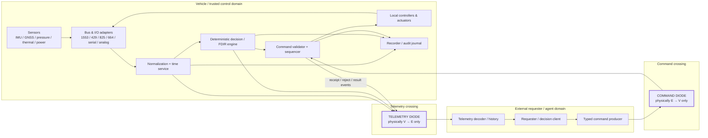
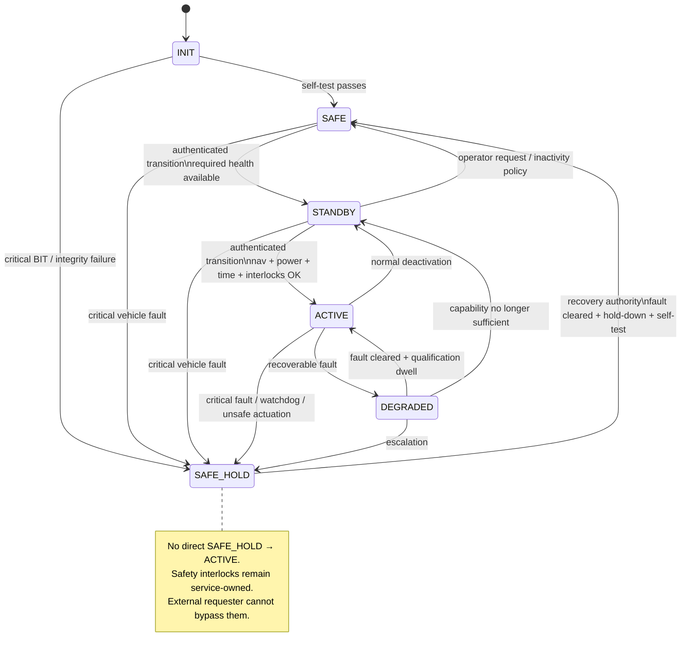

# Executable Avionics and Instrumentation Telemetry / Diode Decision Interface

## Executive summary

This report defines a **reference architecture and executable interface contract** for mapping an avionics and instrumentation subsystem into telemetry, deterministic decision logic, and constrained command execution. Because no particular vehicle, processor, sensor set, operating system, or mission is specified, the rates, ranges, thresholds, queue depths, and resource budgets below are **implementation baselines to be frozen in the vehicle Interface Control Document (ICD)** rather than universal values.

The architecture deliberately separates four concerns:

1. **Acquisition and control** remain local to the vehicle and use avionics-native interfaces such as MIL-STD-1553, ARINC 429, ARINC 825, ARINC 664/AFDX, deterministic Ethernet, discrete/analog I/O, and serial instrumentation. MIL-STD-1553 remains an active command/response time-division avionics-bus standard; ARINC 429 defines widely deployed avionics data-transfer formats and electrical characteristics; ARINC 825 defines airborne CAN/CAN-FD use; and ARINC 664 Part 7 defines deterministic AFDX networking. citeturn0search0turn3search10turn3search2turn4search0
2. **Normalization and recording** translate device-specific values into one typed telemetry dictionary. IRIG 106 is the preferred reference for flight-test/instrumentation recording because its current standard covers PCM, packet telemetry, data-bus acquisition, recorder formats and metadata/TMATS, including data such as MIL-STD-1553, ARINC 429, analog, discrete, UART and Ethernet. citeturn2search0turn2search6turn2search10
3. **Command execution** exposes only a closed, typed vocabulary. No arbitrary shell command, code, path, URL, raw bus transaction, memory write, or user-authored program crosses into the flight domain. This preserves the central property of the supplied diode specification: explicitly implemented verbs, service-owned interlocks, destructive/atomic intake, re-evaluation at the time of effect, inert hidden verbs, and published state that is never accepted back as authoritative input. fileciteturn0file0
4. **Boundary enforcement** distinguishes a *logical diode pattern* from a *physical data diode*. NIST defines a data diode as permitting data to travel in only one direction and describes a unidirectional gateway's hardware as physically incapable of sending information back to the source network. citeturn13search0turn13search2 The supplied shared-volume architecture has commands flowing one way and state/results flowing the other way over the same shared object; it therefore provides valuable sandbox isolation but is **not, by itself, a physically unidirectional data diode**. fileciteturn0file0

Accordingly, the production profile specified here uses **two independent one-way crossings**:

- a **Command Diode**, requester/controller → vehicle; and
- a **Telemetry Diode**, vehicle → requester/controller.

Command receipts, rejections, execution results and actuator responses **never reverse the Command Diode**. They are ordinary telemetry events carried through the separate Telemetry Diode. A simulation may emulate both with filesystem spools, but it must be labelled a *logical diode emulation*, not credited with hardware-diode assurance. This interpretation directly follows the NIST unidirectional definition. citeturn13search0turn13search10



For a spacecraft profile, the recommended external packet stack is CCSDS Space Packets over the applicable Telemetry/Telecommand data-link protocols, with CCSDS Space Data Link Security where data-link security is appropriate. CCSDS 355.0-B-2 provides security headers/trailers and procedures for authentication and/or confidentiality on TM, TC and AOS data links; its extended procedures cover key management, Security Association management, and monitoring/control. citeturn13search1turn13search4 For an airborne profile, ARINC/MIL-STD vehicle buses remain the native side of the gateway and the diode envelope is an application/boundary protocol rather than a replacement for those buses.

The implementation should preserve a small set of non-negotiable invariants:

\[
\text{Execute}(c)\Rightarrow
\text{Authentic}(c)\land
\text{Fresh}(c)\land
\text{NonReplay}(c)\land
\text{SchemaValid}(c)\land
\text{ModeAllowed}(c)\land
\text{InterlocksOK}(c)
\]

\[
\text{PublishedTelemetry}\not\Rightarrow\text{CommandAuthority}
\]

\[
\text{SafetyAuthority} > \text{RequesterAuthority}
\]

\[
\text{ScheduledCommandExecute}(t)
\Rightarrow
\text{RevalidateEntireCommandAt}(t)
\]

\[
\text{IrreversibleAction}\Rightarrow
\text{NoAutomaticRetryAfterAmbiguousOutcome}
\]

The last two invariants are particularly important. The supplied specification correctly requires deferred work to be re-dispatched through current gates at the moment of effect and observes that a crash after an effect but before its acknowledgement creates an ambiguous result. fileciteturn0file0 Declarative operations such as `SET_MODE SAFE` or `SET_ACTUATOR_TARGET 0.25` are therefore preferred to imperative operations such as `INCREMENT_ACTUATOR`, while irreversible effects require a stronger prepare/commit discipline.

## Reference architecture and functional inventory

The standards should be treated as a **stack of responsibilities rather than alternatives**. MIL-STD-1553, ARINC 429/825/664 and deterministic Ethernet specify onboard communications appropriate to different installations; ARINC 653 provides an operating-system/application partitioning interface for integrated modular avionics; CCSDS supplies packet, link, timing and security standards especially suitable for spacecraft; and IRIG 106 supplies an instrumentation/recording framework. The current ARINC 653 family defines the APEX interface between core software and applications for scheduling, communication and status, while SAE AS6802 covers fault-tolerant Time-Triggered Ethernet synchronization and AS6675 profiles TSN and IEEE 802.1 security mechanisms for aerospace onboard Ethernet. citeturn4search2turn4search4turn11search10turn4search14

A practical implementation can use NASA's Core Flight System as one reference implementation model when spacecraft software is appropriate. NASA describes cFS as a reusable platform-independent embedded flight-software framework composed of cFE, OSAL and PSP; cFE provides functions including scheduling, interprocess communication and error management. NASA also publishes applications for health/safety, housekeeping, limit checking and cross-processor software-bus networking, and has CCSDS Electronic Data Sheet work for typed command/telemetry/configuration integration. citeturn7search1turn7search3turn7search11turn7search12 This report does **not** require cFS: an ARINC 653 implementation, RTOS-native application, or equivalent deterministic middleware can implement the same contracts.

| Functional area | Required functions | Principal inputs | Principal outputs | Recommended internal interfaces |
|---|---|---|---|---|
| Navigation | Inertial propagation; GNSS/radio aiding where fitted; position/velocity/attitude estimate; covariance/quality | IMU, GNSS, magnetometer, star/air-data/radio-nav sensors as fitted, time | Position, velocity, attitude, rates, validity, uncertainty | Local sensor I/O; ARINC 429/825/664 or 1553 depending LRU; typed internal software bus |
| Guidance | Generate trajectory, attitude, velocity or pointing setpoints from mission phase and constraints | Navigation solution, mission plan, vehicle mode, constraints | Guidance targets and validity window | In-process or partition messaging; ARINC 653 port/cFS-style software bus where applicable |
| Flight control | Stabilization, control allocation, limit enforcement, local control loops | Guidance target, navigation state, actuator feedback | Actuator demand | Hard real-time local partition; actuator bus; no dependence on external telemetry path |
| Power | Bus monitoring, battery state, switch/load management, load shedding | Voltage/current/temp/SOC sensors, switch feedback | Power telemetry, switch states, permitted-load mask | Discrete/analog, CAN/ARINC 825, 1553 or platform bus |
| Communications | Link management, packetization, counters, RF/modem/LRU health | Command stream, RF/link metrics, packet queues | Telemetry stream, command stream, link status | CCSDS for spacecraft external links; ARINC/MIL interfaces where installed internally |
| Health monitoring / FDIR | Limit checks, freshness, cross-sensor comparison, watchdog monitoring, fault containment and safe-state control | All critical telemetry and task-watchdog data | Fault events, inhibit masks, mode-transition requests | Independent safety/health partition with read access to required state |
| Instrumentation acquisition | Sampling, calibration, time-tagging, anti-aliasing, conversion to engineering units | Analog/discrete/sensor data, bus-monitor data | Typed samples and recording frames | ADC/discrete, serial, bus monitor; IRIG 106-compatible recording profile |
| Sensors | Acquire physical/environmental states and self-test/status | Physical inputs | Raw/processed measurements and BIT | Native electrical interface isolated behind device adapter |
| Actuators | Accept bounded demand, enforce actuator-local limits, return feedback/status | Validated command/setpoint | Position/thrust/switch output, current/position/status feedback | Dedicated I/O, CAN/ARINC 825, 1553, serial/discrete as fitted |
| Time service | Maintain monotonic time, mission/UTC/TAI correlation, quality and synchronization status | Oscillator, GNSS/PPS, PTP/grandmaster, mission epoch | Source timestamp, monotonic timestamp, time quality | Hardware timer; IEEE 1588 on Ethernet; CCSDS time representation externally |
| Command/data handling | Decode packets, authenticate, reject replay, apply command registry, schedule, journal | Command Diode input | Validated operations and telemetry result events | Strictly bounded command API; persistent replay/execution journal |
| Security/boundary service | Key/SA handling, authentication, audit, rate limiting, diode health | Security material and envelopes | Accept/reject decision, security events | Separate privileged process/partition; no keys exposed to requester |

The interface-selection rule should be simple: **do not tunnel an arbitrary native bus command through the diode merely because the vehicle bus supports it**. A `RAW_1553_WRITE`, `ARINC429_INJECT`, or unrestricted CAN frame command would turn the bus protocol into a hidden programming language and violate the supplied specification's closed-vocabulary property. fileciteturn0file0 Instead, a vehicle-specific typed verb such as `SET_HEATER_STATE` is validated and then translated locally into the required 1553, 429, CAN or discrete operation.

The relevant standards baseline is:

| Layer | Preferred references | Architectural use |
|---|---|---|
| Military avionics bus | MIL-STD-1553 active ASSIST record | Deterministic command/response LRU and subsystem communication. citeturn0search0 |
| Commercial avionics parameter bus | ARINC 429 Part 1 | Established avionics data formats/electrical transfer interface. citeturn3search10 |
| CAN-class avionics | ARINC 825-4 | Airborne CAN/CAN-FD profile; current revision includes CAN FD and security considerations. citeturn3search2 |
| Deterministic aircraft Ethernet | ARINC 664 Part 7; SAE AS6675 where TSN is selected | AFDX or aerospace TSN network profile. citeturn4search0turn4search14 |
| Partitioned airborne software | ARINC 653 | Time/space-partitioned application interface, scheduling, communications and status. citeturn4search2turn4search4 |
| Instrumentation/recording | IRIG 106 | Flight-test telemetry, recorder packets, channel metadata/TMATS. citeturn2search0turn2search6 |
| Space telemetry/telecommand | CCSDS 132.0, 133.0, 232.0 families | TM data link, Space Packets and TC data link. CCSDS's current publications list these standards as active. citeturn6search1turn1search0 |
| Link security | CCSDS 352.0, 355.0, 355.1 | Standard algorithm profile and SDLS authentication/confidentiality/SA procedures. citeturn13search6turn13search1turn13search4 |
| Time representation/synchronization | CCSDS 301.0; IEEE 1588-2019 | Mission time representation and packet-network clock synchronization. citeturn11search6turn11search0 |

IEEE 1588-2019 specifically defines precision clock synchronization for packet measurement/control systems and provides profiles for particular applications. citeturn11search0 For this design, **all safety timers should nevertheless use a local monotonic clock**; externally synchronized time is metadata and a condition for time-tagged commands, not a dependency for watchdog expiration or control-loop stability.

## Telemetry contract and channel map

The channel table below is an **ICD seed**, not a claim that a particular avionics standard mandates these sampling frequencies or engineering ranges. The standards define transport/representation behavior; final rates and ranges must come from the actual sensor data sheets, control bandwidth, aliasing analysis, hazard assessment and instrumentation objectives. For every physical device instance, instantiate the applicable channel-class row with a unique identifier; for example, `THERM.TANK_A.T01`, `FCTL.ELEVON_L.POS`, and `PWR.BUS_MAIN.VOLTAGE`.

**Priority semantics:** `P0` is safing/security/command-outcome; `P1` is flight/control critical; `P2` is vehicle health; `P3` is engineering/high-volume instrumentation. A lower-priority telemetry failure must never delay a higher-priority control computation.

| Channel class | Example value type | Baseline rate | Unit / wire precision | Baseline engineering range | Sampling and aggregation | Timestamp | Priority |
|---|---|---:|---|---|---|---|---|
| `NAV.IMU.GYRO.*` | `vec3<int32>` | 200 Hz | rad/s, \(10^{-5}\) | ±35 rad/s | Every calibrated sample; no averaging in control feed | Hardware/source + monotonic | P1 |
| `NAV.IMU.ACCEL.*` | `vec3<int32>` | 200 Hz | m/s², \(10^{-4}\) | ±200 m/s² | Every sample; separately expose clipping/BIT | Hardware/source + monotonic | P1 |
| `NAV.MAG.*` | `vec3<int32>` | 20 Hz | nT, 1 nT | ±200,000 nT | Every sample; validity flag | Source | P2 |
| `NAV.GNSS.PVT` | structured fixed-point | 10 Hz | lat/lon \(10^{-7}\) deg; altitude/velocity mm-based | Earth-valid coordinate domains | Latest solution plus fix type, satellite/quality fields | Receiver time + ingest time | P1 |
| `NAV.ATTITUDE` | `quat<float32>` + covariance | 50 Hz | dimensionless | normalized quaternion | Every estimator solution; reject non-normalized input internally | Estimator epoch | P1 |
| `NAV.POS_VEL_EST` | `float64[6]` or fixed-point | 20 Hz | m, m/s | mission profile | Every estimator output; publish covariance/quality separately | Estimator epoch | P1 |
| `NAV.EST_INNOVATION` | `float32[n]` | measurement rate | normalized residual | profile | Store raw residual for critical sensors; summary statistics for P2 | Estimator epoch | P2 |
| `GNC.GUIDANCE_TARGET` | typed target | 10–20 Hz | target-specific | mission envelope | Latest target; event on target change | Computation epoch | P1 |
| `FCTL.DEMAND.<actuator>` | `float32`/fixed-point | 100 Hz baseline | rad, %, N or device unit | actuator-rated | Every locally issued control demand | Control tick | P1 |
| `FCTL.FEEDBACK.<actuator>` | struct | 100 Hz | position/current/rate | actuator-rated | Position/current/status together where practical | Device/source | P1 |
| `PROP.THRUSTER.<id>` | bitset + counters | 20 Hz + edge event | on/off; ms; count | device-rated | Every transition plus periodic snapshot | Local hardware time | P1 |
| `PWR.BUS.<id>` | struct `V,I,P` | 10 Hz | V/A/W, float32 or scaled integer | platform profile; e.g. 0–100 V, ±500 A envelope | Latest + 1 s min/max/mean for engineering feed | ADC/source | P1/P2 |
| `PWR.BATTERY.<id>` | struct | 1–10 Hz | V, A, °C, %, Wh | battery profile | Latest; slow trend min/max/mean | Source | P2 |
| `PWR.SWITCH.<id>` | enum/bit | edge + 1 Hz | state | finite enum | Every transition + 1 Hz reconciliation snapshot | Local time | P1/P2 |
| `COMMS.LINK.<id>` | struct | 1–10 Hz | dB/dBm, counts, enums | modem-specific | Latest; 1 s error deltas; cumulative counters | Source/ingest | P2 |
| `THERM.<sensor>` | `int16`/`int32` | 1 Hz nominal | °C, 0.01 °C | configurable; seed −100…+250 °C | Latest + 10 s min/max/mean for engineering display | Source | P2 |
| `PRESS.<sensor>` | `uint32` | 10 Hz | Pa | device-rated; seed 0…100 MPa | Latest; optional 1 s min/max/mean | Source | P1/P2 |
| `STRUCT.ACCEL.<sensor>` | `int16`/`int24` raw | 1–10 kHz local | m/s² or counts | transducer-rated | Raw ring locally; publish RMS/peak/crest at 10 Hz; retain triggered burst | Hardware | P3, trigger P1/P2 |
| `CDH.CPU.<node>` | struct | 1 Hz | %, bytes, °C, counts | bounded scalar domains | Latest + high-water marks | Monotonic | P2 |
| `CDH.QUEUE.<id>` | struct | 1 Hz + overflow event | depth, drops | 0…configured depth | High-water/drop counters | Monotonic | P2; overflow P0 |
| `TIME.STATUS` | struct | 1 Hz + transition | ns, ppb, enum | signed offset/drift | Latest source/offset/uncertainty/holdover state | Both clocks | P0 |
| `SEC.DIODE_HEALTH` | struct | 1 Hz + event | counts, queue depth | nonnegative | Counters as deltas + cumulative; immediate auth/replay event | Monotonic + synchronized | P0 |
| `CMD.RESULT` | event record | on event | enum/reason code | finite enums | One record per validation/execution transition | Monotonic + synchronized | P0 |
| `FDIR.EVENT` | event record | on event | severity/code | finite enums | Never averaged; duplicate coalescing permitted only with count | Monotonic + synchronized | P0 |

ARINC 429/1553/other native-bus data should be converted at the adapter boundary into this engineering representation; the original bus words should optionally be retained as diagnostic/raw channels rather than leaked into the command API. IRIG 106's recorder architecture is particularly suited to retaining both engineering channels and native bus acquisition because its Chapter 10 packetization covers MIL-STD-1553, ARINC 429, analog, discrete, message, UART and Ethernet data. citeturn2search6 Commercial instrumentation hardware also demonstrates this multi-bus pattern: Curtiss-Wright acquisition equipment supports monitoring formats including ARINC 429, MIL-STD-1553 and ARINC 664, while Alta products combine 1553/429 monitoring and external time synchronization. citeturn10search16turn10search0

The aggregation rules are deliberately asymmetric. **Control-relevant channels are not averaged before the controller or FDIR consumes them.** Aggregates are an additional telemetry product. Slow housekeeping may publish latest/min/max/mean; high-rate structural channels should retain a short raw pre-trigger/post-trigger ring and expose low-bandwidth RMS/peak/crest summaries continuously. Discrete state is edge-triggered **and** periodically reconciled so that a lost edge does not leave the consumer permanently wrong.

Every telemetry sample should carry at least:

| Timing / quality field | Purpose |
|---|---|
| `source_time_ns` | Measurement or computation epoch in the synchronized mission timescale |
| `monotonic_time_ns` | Vehicle boot-relative clock for ordering and deterministic dwell timers |
| `ingest_time_ns` | Optional adapter arrival time for latency diagnostics |
| `boot_id` | Distinguishes sequence/time restart after reboot |
| `sequence` | Monotonic per source/channel stream; detects loss, duplicates and reordering |
| `time_quality` | `UNSYNC`, `HOLDOVER`, `SYNC`, `DEGRADED` |
| `quality_flags` | stale, saturated, estimated, substituted, BIT-fail, range-fail, etc. |
| `sample_count` | Number of source samples represented by an aggregate |
| `age_limit_ms` | ICD-defined freshness contract for consumers |

CCSDS 301.0-B-4 defines time-code formats including CCSDS Unsegmented Time Code, while IEEE 1588-2019 supplies precision packet-network synchronization. citeturn11search6turn11search0 The implementation should store both synchronized and monotonic time because a GNSS/PTP discontinuity must not make a five-second safety dwell become negative, extremely long, or instantaneously expire.

A bounded storage architecture resolves the open history question in the supplied diode specification: use a **ring for telemetry plus an append-oriented protected journal for command/security/FDIR events**. The supplied specification already identifies a bounded frame ring as preferable when an agent must reconstruct a trend across periods during which it was not reading telemetry. fileciteturn0file0 Sizing should be computed, not guessed:

\[
Q_i \ge \left\lceil r_i \, T_{\text{outage}} \, B_i \right\rceil
\]

where \(Q_i\) is queue depth, \(r_i\) source rate, \(T_{\text{outage}}\) tolerated downstream stall, and \(B_i\) burst factor.

\[
S_{\text{retention}}
\ge
\sum_i r_i\,b_i\,T_i
\]

where \(b_i\) is encoded bytes/sample and \(T_i\) the required retention interval. Reserve capacity for P0/P1 before admitting P2/P3 bursts; telemetry saturation must shed or aggregate lower-priority products rather than block the vehicle's flight-control tasks.

## Diode, command, and decision specification

**Physical and logical separation.** A production installation should have a telemetry transmitter attached only to the vehicle side of the Telemetry Diode and a telemetry receiver attached only to the external side; the opposite direction should be physically absent. The Command Diode is the inverse arrangement. This is the assurance distinction NIST makes when it describes a unidirectional gateway as physically unable to communicate back toward the source. citeturn13search2 Firewall rules, container namespaces and filesystem permissions remain worthwhile defense-in-depth, but they do not substitute for the physical property when hardware-diode assurance is claimed.

For simulation and software-in-the-loop testing, the supplied volume protocol can be retained with stronger separation:

```text
/requester
    command-out/       write only to requester
    telemetry-in/      read only to requester

/vehicle
    command-in/        read only to vehicle
    telemetry-out/     write only to vehicle
```

The bridge between each pair should be a separately instantiated one-way copying service. Published telemetry is never parsed as a control file. The supplied specification's destructive/atomic command intake, clear-before-run posture, service-owned operator limits and “exceptions become output” behavior should remain, while the original single `state.json` evolves into typed telemetry frames. fileciteturn0file0

**Envelope.** The command and telemetry envelopes should carry the following security/transport metadata regardless of whether the underlying link is CCSDS, Ethernet or a test filesystem:

| Envelope property | Telemetry | Command | Enforcement |
|---|---|---|---|
| Schema/version | Required | Required | Reject unsupported major version |
| Source/destination IDs | Required | Required | Whitelist; requester cannot select arbitrary internal endpoint |
| `boot_id` / security epoch | Required | Required | Prevent sequence-reset ambiguity |
| Sequence | Required | Required | Loss/replay detection |
| Message/command ID | Optional message ID | Mandatory 128-bit command ID | Persistent deduplication |
| Source/issue time | Required | Required | Audit/freshness |
| Earliest execution | — | Optional | Scheduling |
| Expiration | — | Required except explicitly timeless safe operations | Fail closed if time is trusted and command expired |
| Priority | Required | Required | Bounded finite enum; sender cannot exceed authorization |
| Payload length/type | Required | Required | Preallocation and strict parsing |
| Authentication/security association ID | Recommended | Mandatory | Select approved verification state |
| Authentication tag/signature | Profile-dependent | Mandatory | Verify before semantic processing |
| CRC/link check | Transport-dependent | Transport-dependent | Detect accidental transport corruption, not an authenticity substitute |

Where CCSDS links are used, SDLS supplies a standardized security header/trailer mechanism for applying data authentication and/or confidentiality and should be preferred over a bespoke link-security protocol. citeturn13search1 CCSDS 352.0-B-2 defines CCSDS cryptographic algorithm recommendations, while SDLS Extended Procedures cover key/SA management; CCSDS also publishes a dedicated symmetric key-management recommendation and authentication-credential specifications. citeturn13search6turn13search4turn6search2turn12search7

**Replay protection.** Maintain `highest_sequence`, a replay bitmap/window where reordering is permitted, `security_epoch`, and a durable set/cache of command IDs covering at least the maximum command validity interval. A valid cryptographic tag does not make an old command valid. The acceptance predicate is:

\[
A(c)=
Auth(c)
\land Epoch(c)=Epoch_{\text{current}}
\land SeqAcceptable(c)
\land ID_{\!c}\notin Executed
\land Fresh(c)
\]

Persist replay/execution state before an irreversible effect wherever transactional hardware semantics permit it. There is no general way to manufacture true distributed “exactly once” behavior across a crash between a physical actuator effect and journal/acknowledgement; the practical strategy is **at-most-once admission plus idempotent declarative commands**, and special no-retry handling for irreversible actions. That preserves rather than hides the ambiguity already identified in the supplied specification. fileciteturn0file0

**Allowed command classes.**

| Command class | Example | Baseline rate limit | Required validation | Retry semantics |
|---|---|---:|---|---|
| Safety/mode declaration | `SET_MODE SAFE` | 1/s, burst 1 | Auth, state-transition table, interlocks | Idempotent |
| Reversible setpoint | `SET_TARGET ATTITUDE …` | ≤20/s baseline or control-specific profile | Auth, freshness, numeric bounds, slew/envelope, state | Reassert same target safely |
| Configuration selection | `SELECT_PROFILE profile_03` | 1/10 s | Preinstalled ID only, compatible mode/version | Idempotent |
| Switch/load command | `SET_LOAD PAYLOAD_1 OFF` | 2/s per target | Power state, target whitelist, min on/off dwell | Idempotent |
| Component recovery | `RESET_COMPONENT GNSS_A` | 1/60 s/component baseline | Fault present, mode permits, reset budget | Bounded; no reset storm |
| Scheduled operation | typed command + execution time | Profile-specific | Full validation at receipt **and again at execution** | Cancel/expire explicitly |
| Irreversible operation | `EXECUTE_LATCH …` | Very low; mission profile | Strong authorization, prepare token, state, all interlocks, resource check | **Never auto-retry ambiguous result** |
| Safing request | `SET_MODE SAFE` / dedicated typed inhibit | Reserved bandwidth | Authentication/replay still required; narrowest useful preconditions | Idempotent |

Those numerical rate limits are starting profiles, not vehicle requirements. Final values must be tighter than any rate capable of destabilizing a controlled process, exhausting consumables, cycling hardware destructively or starving command processing.

The following must **not** be accepted command types:

```text
EXEC(code)
SHELL(string)
WRITE_MEMORY(address, bytes)
RAW_BUS_FRAME(bus, bytes)
FETCH_URL(url)
OPEN_PATH(path)
LOAD_PLUGIN(name supplied from external storage)
SET_INTERLOCK_BYPASS(true)
SET_OPERATOR_CEILING(...)
```

This is a direct application of the supplied diode rule that only deliberately implemented names and bounded arguments cross the boundary, never code, arbitrary paths, URLs or programs. fileciteturn0file0

The command validator executes in this exact order:

```text
decode bounded envelope
→ verify version and encoded length
→ authenticate envelope
→ verify security epoch and anti-replay state
→ check command ID/deduplication
→ verify target and command vocabulary
→ check freshness / execute window
→ apply issuer authorization
→ apply command-class rate limit
→ validate parameter types and ranges
→ validate current vehicle mode
→ validate safety interlocks and resource margins
→ journal ACCEPTED/PREPARED
→ sequence or execute locally
→ journal result
→ emit CMD.RESULT through TELEMETRY diode
```

Payload data should not reach complex vehicle-specific parsing before authentication and global length bounds are checked. NIST's OT guidance emphasizes that OT security must account for the technology's unique performance, reliability and safety requirements rather than treating it as a conventional IT system. citeturn5search1turn5search10

**Safe-state model.**



The precise meaning of “safe” is vehicle-specific: it may be powered-down, thermally managed, attitude-safe, propulsion-inhibited, control-surface neutral, or another hazard-derived configuration. The state must therefore be defined by the system safety assessment rather than by telemetry software. For airborne development, ARP4754B and ARP4761A are the current SAE system-development/safety-assessment references; FAA AC 20-115D recognizes DO-178C for airborne software and AC 20-152A recognizes DO-254 for airborne electronic hardware. citeturn9search12turn9search3turn9search1turn9search4

**Deterministic health and decision rules.** Threshold values below are profile parameters named explicitly rather than hidden constants. The important requirement is that each rule has unambiguous inputs, dwell/hysteresis, result codes and actions.

| Rule | Deterministic predicate | Escalation |
|---|---|---|
| Freshness/plausibility | finite AND engineering range AND `age ≤ stale_limit` | Mark sample invalid; substitute/reconfigure where authorized; fault after configured persistence |
| Redundant-sensor disagreement | deviation from healthy-set median exceeds absolute/statistical tolerance for `M` cycles | Isolate one outlier if redundancy permits; otherwise `DEGRADED` |
| Estimator residual | normalized innovation statistic exceeds configured confidence threshold for `K-of-M` updates | Sensor suspect → isolate → degraded estimator |
| Slow bias/drift | one-sided/two-sided CUSUM crosses `h` | Warn, then fault after persistence |
| Actuator tracking | `|command-feedback| > tolerance` after settle deadline | Inhibit affected output/reconfigure; safe hold if required authority lost |
| Power quality | bus V/I exceeds warning/critical band for configured dwell | Shed noncritical loads; critical persistence → safe hold |
| Thermal | warning/critical threshold plus hysteresis | Reduce load; inhibit component; safe hold for critical thermal hazard |
| Time integrity | synchronization error/uncertainty exceeds profile | Mark `TIME_DEGRADED`; reject new scheduled commands |
| Command security | authentication/replay failures exceed event threshold | Reject individually; then security lockout/epoch rollover policy |
| Queue/recorder health | occupancy high-water or dropped P0/P1 frame | Shed P3 first; P0/P1 loss is a system fault |
| Watchdog | safety-critical task misses deadline/heartbeat | Restart isolated app where permitted or enter safe hold |
| Diode health | command receiver/telemetry transmitter heartbeat or journal inconsistent | Command path fail-closed; never bypass authentication |

The estimator-residual approach is grounded in the innovation structure of state estimation; Kalman's original 1960 paper established the modern linear filtering/prediction framework. citeturn8search0 CUSUM provides a deterministic mechanism for accumulating small persistent deviations; Page's original 1954 paper introduced continuous inspection schemes of this type. citeturn8search2 Neither source supplies a universal flight threshold—the false-alarm/detection trade must be allocated in the vehicle's own validation plan.

Executable reference logic:

```python
def sensor_health(s, now_mono):
    # Rule: finite, in-range, and fresh.
    plausible = (
        s.is_finite
        and s.eng_min <= s.value <= s.eng_max
        and (now_mono - s.sample_mono) <= s.stale_limit
        and not s.bit_failed
    )

    s.bad_count = 0 if plausible else s.bad_count + 1

    if s.bad_count >= s.trip_count:
        return "FAULT"
    if not plausible:
        return "SUSPECT"
    return "GOOD"


def redundant_vote(samples, abs_tol, sigma_factor, trip_cycles):
    healthy = [x for x in samples if x.health == "GOOD"]
    if len(healthy) < 2:
        return {"status": "DEGRADED", "isolated": []}

    med = median(x.value for x in healthy)
    isolated = []

    for x in healthy:
        threshold = max(abs_tol, sigma_factor * x.sigma)
        if abs(x.value - med) > threshold:
            x.disagree_count += 1
        else:
            x.disagree_count = 0

        if x.disagree_count >= trip_cycles:
            isolated.append(x.id)

    return {
        "status": "GOOD" if len(healthy) - len(isolated) >= 2 else "DEGRADED",
        "isolated": isolated,
    }


def estimator_innovation_rule(nu, S_inv, warn_threshold, trip_threshold, k_of_m_history):
    # Normalized Innovation Squared.
    nis = transpose(nu) @ S_inv @ nu
    k_of_m_history.push(nis >= warn_threshold)

    if nis >= trip_threshold:
        return "FAULT"
    if k_of_m_history.count_true() >= k_of_m_history.k:
        return "SUSPECT"
    return "GOOD"


def cusum_rule(z, state, allowance_k, decision_h):
    # Run positive and negative accumulators for deterministic bias detection.
    state.pos = max(0.0, state.pos + z - allowance_k)
    state.neg = min(0.0, state.neg + z + allowance_k)

    if state.pos > decision_h or abs(state.neg) > decision_h:
        return "DRIFT_DETECTED"
    return "GOOD"


def actuator_tracking(cmd, fb, now_mono, cfg):
    err = abs(cmd.target - fb.position)

    if now_mono < cmd.settle_deadline:
        return "TRANSIENT"

    if err > cfg.track_error_critical:
        return "FAULT"
    if err > cfg.track_error_warn:
        return "SUSPECT"
    return "GOOD"


def power_rule(v, cfg, dwell):
    if v < cfg.v_critical_low or v > cfg.v_critical_high:
        if dwell.critical_elapsed(cfg.critical_dwell):
            return "CRITICAL_SHED_AND_SAFE"
        return "CRITICAL_PENDING"

    dwell.clear_critical()

    if v < cfg.v_warn_low or v > cfg.v_warn_high:
        return "WARN"

    return "GOOD"


def thermal_rule(temp, state, cfg):
    # Hysteresis prevents chatter.
    if temp >= cfg.critical_high:
        return "CRITICAL"
    if temp >= cfg.warn_high:
        return "WARN"

    if state in ("WARN", "CRITICAL") and temp > cfg.warn_high - cfg.hysteresis:
        return state

    return "GOOD"


def time_health(sync, cfg):
    if not sync.source_valid:
        return "UNSYNC"
    if abs(sync.offset_ns) > cfg.max_offset_ns:
        return "DEGRADED"
    if sync.uncertainty_ns > cfg.max_uncertainty_ns:
        return "DEGRADED"
    return "SYNC"


def authorize_command(c, vehicle):
    # Order is intentional. No actuator-side effect can occur before all gates.
    require(c.schema_supported, "SCHEMA")
    require(verify_auth(c), "AUTH")
    require(replay_window_accepts(c), "REPLAY")
    require(not command_id_seen(c.command_id), "DUPLICATE")
    require(command_fresh(c, vehicle.time_quality), "TIME")
    require(issuer_may_execute(c.issuer, c.kind), "AUTHZ")
    require(rate_limit_allows(c), "RATE")
    require(parameters_valid(c), "RANGE")
    require(c.kind in commands_allowed_in(vehicle.mode), "MODE")
    require(interlocks_ok(c, vehicle), "INTERLOCK")

    if c.irreversible:
        require(c.prepare_token_valid, "NOT_PREPARED")
        require(vehicle.time_quality == "SYNC", "TIME_UNTRUSTED")

    journal_accept(c)

    if c.execute_not_before is not None:
        schedule_for_redispatch(c)  # full authorize_command() runs again later
        return "SCHEDULED"

    return execute_and_journal(c)
```

Scheduled work is intentionally re-fed through `authorize_command()` rather than invoking an already-authorized closure. This preserves the supplied design's strongest scheduling property: authority and vehicle safety are evaluated **at delivery/effect time**, not merely when the requester originally asked. fileciteturn0file0

Escalation should use a small finite taxonomy:

`INFO → WARNING → FAULT → CRITICAL`

An `INFO` records a condition; `WARNING` exposes it and may reduce performance; `FAULT` isolates/reconfigures an affected function; `CRITICAL` invokes the hazard-derived safe response without requiring an external requester. Safety authority remains inside the trusted vehicle partition.

## Message schemas and implementation profile

Protocol Buffers are a reasonable implementation encoding for a typed internal/diode interface because the official project defines them as a language- and platform-neutral structured-data serialization mechanism and provides generated implementations in multiple languages. citeturn13search3 The protobuf binary encoding should be the executable form; a JSON representation is useful for debugging, test vectors and human-readable simulation artifacts. The Protobuf documentation itself recommends the binary wire format for systems using Protocol Buffers and defines a JSON mapping for interoperability. citeturn13search15

One important security caveat is that **ordinary Protobuf deterministic serialization is not a permanent canonical byte representation**; the official documentation warns that deterministic is not canonical and serialized output may change with schemas, applications or libraries. citeturn13search11 Therefore, do not define a long-lived signature as “hash whatever this library happens to serialize.” Prefer transport/security-layer authentication such as SDLS, or define an explicitly versioned authentication input with fixed canonical field encoding.

| Attribute | JSON profile | Protobuf profile | Decision |
|---|---|---|---|
| Primary use | Human-readable test/simulation/audit export | Executable vehicle/diode interface | Protobuf preferred in runtime |
| Type enforcement | Schema validator required | Generated schema/types | Protobuf |
| Compactness | Lower | Higher binary efficiency | Protobuf |
| Inspection | Excellent | Requires decoder/schema | JSON mirror |
| Unknown/version fields | Must define strict policy | Native field evolution mechanisms | Both still require version policy |
| Numeric ambiguity | Must prohibit NaN/Infinity and constrain integer widths explicitly | Explicit scalar widths available | Protobuf |
| Authentication bytes | Requires a specified canonical JSON form | Still **not inherently canonical** | Authenticate a separately specified canonical envelope or SDLS |
| Certification/assurance | Parser and generator need project assurance | Generator/runtime likewise need assurance | Selection does not replace assurance process |

A JSON Schema-style telemetry definition is:

```json
{
  "$id": "urn:avionics:telemetry-envelope:v1",
  "type": "object",
  "additionalProperties": false,
  "required": [
    "schema_version",
    "mission_id",
    "source_id",
    "boot_id",
    "sequence",
    "source_time_ns",
    "monotonic_time_ns",
    "time_quality",
    "priority",
    "channel_id",
    "quality",
    "value"
  ],
  "properties": {
    "schema_version": { "const": 1 },
    "mission_id":     { "type": "string", "maxLength": 32 },
    "source_id":      { "type": "string", "maxLength": 32 },
    "boot_id":        { "type": "string", "pattern": "^[0-9a-fA-F]{32}$" },
    "sequence":       { "type": "integer", "minimum": 0 },
    "source_time_ns": { "type": "integer" },
    "monotonic_time_ns": { "type": "integer", "minimum": 0 },
    "time_quality": {
      "enum": ["UNSYNC", "HOLDOVER", "SYNC", "DEGRADED"]
    },
    "priority": {
      "enum": ["P0", "P1", "P2", "P3"]
    },
    "channel_id":     { "type": "string", "maxLength": 64 },
    "unit":           { "type": "string", "maxLength": 16 },
    "quality": {
      "type": "object",
      "additionalProperties": false,
      "required": ["valid", "flags"],
      "properties": {
        "valid": { "type": "boolean" },
        "flags": {
          "type": "array",
          "maxItems": 16,
          "items": {
            "enum": [
              "STALE",
              "SATURATED",
              "RANGE_FAIL",
              "BIT_FAIL",
              "ESTIMATED",
              "SUBSTITUTED",
              "TIME_UNCERTAIN"
            ]
          }
        }
      }
    },
    "sample_count": { "type": "integer", "minimum": 1 },
    "value": {
      "oneOf": [
        { "type": "number" },
        {
          "type": "array",
          "maxItems": 16,
          "items": { "type": "number" }
        },
        { "type": "integer" },
        { "type": "boolean" },
        { "type": "string", "maxLength": 64 }
      ]
    }
  }
}
```

The corresponding command schema keeps security metadata separate from the semantic command:

```json
{
  "$id": "urn:avionics:command-envelope:v1",
  "type": "object",
  "additionalProperties": false,
  "required": ["signed", "security"],
  "properties": {
    "signed": {
      "type": "object",
      "additionalProperties": false,
      "required": [
        "schema_version",
        "issuer_id",
        "target_id",
        "security_epoch",
        "sequence",
        "command_id",
        "issued_time_ns",
        "expires_at_ns",
        "command"
      ],
      "properties": {
        "schema_version": { "const": 1 },
        "issuer_id":      { "type": "string", "maxLength": 32 },
        "target_id":      { "type": "string", "maxLength": 32 },
        "security_epoch": { "type": "integer", "minimum": 0 },
        "sequence":       { "type": "integer", "minimum": 0 },
        "command_id": {
          "type": "string",
          "pattern": "^[0-9a-fA-F]{32}$"
        },
        "issued_time_ns": { "type": "integer" },
        "execute_not_before_ns": { "type": "integer" },
        "expires_at_ns":  { "type": "integer" },
        "priority": {
          "enum": ["NORMAL", "HIGH", "SAFETY"]
        },
        "command": {
          "oneOf": [
            {
              "type": "object",
              "required": ["type", "mode"],
              "properties": {
                "type": { "const": "SET_MODE" },
                "mode": {
                  "enum": ["SAFE", "STANDBY", "ACTIVE"]
                }
              },
              "additionalProperties": false
            },
            {
              "type": "object",
              "required": ["type", "target_name", "value"],
              "properties": {
                "type": { "const": "SET_TARGET" },
                "target_name": {
                  "type": "string",
                  "maxLength": 32
                },
                "value": { "type": "number" }
              },
              "additionalProperties": false
            },
            {
              "type": "object",
              "required": ["type", "component_id"],
              "properties": {
                "type": { "const": "RESET_COMPONENT" },
                "component_id": {
                  "type": "string",
                  "maxLength": 32
                }
              },
              "additionalProperties": false
            }
          ]
        }
      }
    },
    "security": {
      "type": "object",
      "additionalProperties": false,
      "required": ["association_id", "algorithm_id", "auth_value"],
      "properties": {
        "association_id": { "type": "integer", "minimum": 0 },
        "algorithm_id":   { "type": "string", "maxLength": 32 },
        "auth_value":     { "type": "string", "maxLength": 256 }
      }
    }
  }
}
```

A runtime Protobuf profile could be:

```protobuf
syntax = "proto3";

package avionics.diode.v1;

enum Priority {
  PRIORITY_UNSPECIFIED = 0;
  P0 = 1;
  P1 = 2;
  P2 = 3;
  P3 = 4;
}

enum TimeQuality {
  TIME_UNSPECIFIED = 0;
  UNSYNC = 1;
  HOLDOVER = 2;
  SYNC = 3;
  DEGRADED = 4;
}

enum VehicleMode {
  MODE_UNSPECIFIED = 0;
  SAFE = 1;
  STANDBY = 2;
  ACTIVE = 3;
}

message Vector {
  repeated double element = 1; // Runtime enforces channel-specific max length.
}

message TelemetryValue {
  oneof kind {
    sint64 integer_value = 1;
    double real_value = 2;
    bool boolean_value = 3;
    string enum_value = 4;
    Vector vector_value = 5;
    bytes bitset_value = 6;
  }
}

message Quality {
  bool valid = 1;
  uint32 flags = 2;       // ICD-defined bit assignments.
  uint32 sample_count = 3;
}

message TelemetrySample {
  uint32 schema_version = 1;
  string mission_id = 2;
  string source_id = 3;
  bytes boot_id = 4;      // Exactly 16 bytes.
  uint64 sequence = 5;

  sint64 source_time_ns = 6;
  uint64 monotonic_time_ns = 7;
  TimeQuality time_quality = 8;

  Priority priority = 9;
  string channel_id = 10;
  string unit_code = 11;
  Quality quality = 12;
  TelemetryValue value = 13;
}

message SetMode {
  VehicleMode mode = 1;
}

message SetTarget {
  string target_id = 1;
  double value = 2;
  string unit_code = 3;
}

message SelectProfile {
  uint32 profile_id = 1;  // Pre-provisioned profile only.
}

message ResetComponent {
  string component_id = 1;
}

message PrepareIrreversible {
  string operation_id = 1;
  bytes parameter_digest = 2;
}

message CommitIrreversible {
  string operation_id = 1;
  bytes prepare_token = 2;
}

message CommandBody {
  oneof operation {
    SetMode set_mode = 1;
    SetTarget set_target = 2;
    SelectProfile select_profile = 3;
    ResetComponent reset_component = 4;
    PrepareIrreversible prepare_irreversible = 5;
    CommitIrreversible commit_irreversible = 6;
  }
}

message SignedCommandData {
  uint32 schema_version = 1;
  string issuer_id = 2;
  string target_id = 3;

  uint64 security_epoch = 4;
  uint64 sequence = 5;
  bytes command_id = 6;   // Exactly 16 bytes.

  sint64 issued_time_ns = 7;
  sint64 execute_not_before_ns = 8;
  sint64 expires_at_ns = 9;

  Priority priority = 10;
  CommandBody body = 11;
}

message SecurityTrailer {
  uint32 association_id = 1;
  uint32 algorithm_id = 2;
  bytes auth_value = 3;
}

message CommandEnvelope {
  SignedCommandData signed_data = 1;
  SecurityTrailer security = 2;
}

enum CommandStatus {
  CMD_STATUS_UNSPECIFIED = 0;
  RECEIVED = 1;
  ACCEPTED = 2;
  SCHEDULED = 3;
  EXECUTING = 4;
  COMPLETED = 5;
  REJECTED = 6;
  FAILED = 7;
  OUTCOME_AMBIGUOUS = 8;
}

message CommandResult {
  bytes command_id = 1;
  uint64 sequence = 2;
  CommandStatus status = 3;
  uint32 reason_code = 4;
  VehicleMode mode_after = 5;
  uint64 monotonic_time_ns = 6;
  sint64 event_time_ns = 7;
}
```

`CommandResult` is **telemetry**. It is never a reverse packet through the Command Diode.

The core field semantics are:

| Field | Telemetry | Command | Definition |
|---|---:|---:|---|
| `schema_version` | ✓ | ✓ | Semantic schema version; unsupported major version fails closed |
| `boot_id` | ✓ | indirect via epoch | Random/unique per vehicle boot; prevents sequence ambiguity |
| `security_epoch` | — | ✓ | Key/SA/replay epoch |
| `sequence` | ✓ | ✓ | Monotonic stream or issuer sequence |
| `command_id` | result events | ✓ | Stable command identity for deduplication/audit |
| `source_time_ns` | ✓ | — | Measurement epoch |
| `monotonic_time_ns` | ✓ | result event | Boot-relative deterministic ordering |
| `issued_time_ns` | — | ✓ | Command creation time |
| `execute_not_before_ns` | — | optional | Earliest permitted execution |
| `expires_at_ns` | — | ✓ | No execution after validity period |
| `channel_id` | ✓ | — | Registered telemetry dictionary identifier |
| `quality` | ✓ | — | Validity plus explicit diagnostic flags |
| `association_id` | envelope/profile | ✓ | Security Association/key context |
| `auth_value` | profile-dependent | ✓ | Cryptographic authentication output; excluded from authenticated input itself |

**Transport and middleware profile.** MIL-STD-1553 should remain a native command/response bus where installed; ARINC 429 for appropriate established LRU interfaces; ARINC 825 for CAN/CAN-FD devices; and ARINC 664/AS6675 for deterministic Ethernet designs. citeturn0search0turn3search10turn3search2turn4search0turn4search14 The normalized application layer should communicate through bounded queues or ports, using ARINC 653 APEX services, cFS/cFE Software Bus, or an equivalent RTOS mechanism rather than having telemetry consumers directly manipulate device drivers. ARINC 653 explicitly standardizes the application/core-software scheduling and communication boundary. citeturn4search4

For spacecraft, a conventional layering is:

```text
Typed application message
        ↓
CCSDS Space Packet
        ↓
TM or TC Space Data Link
        ↓
SDLS security where selected
        ↓
mission physical/link transport
```

CCSDS publishes active Space Packet, Telemetry and Telecommand data-link standards, and SDLS is specifically designed for those CCSDS links. citeturn6search1turn1search0turn13search1 JPL's F Prime is an implementation reference demonstrating CCSDS Space Packet framing with APIDs and sequence counts for tracking dropped or out-of-order packets, although the system specified here is not dependent on F Prime. citeturn1search6turn1search14

For recording and post-test reconstruction, write normalized telemetry and, where required, raw bus acquisitions into an IRIG 106-compatible recorder stream plus its machine-readable metadata. IRIG 106/TMATS exists specifically to describe the configuration needed to interpret telemetry/acquisition data. citeturn2search10turn2search6

**Runtime scheduling.** Do not retain the prior five-second diode loop as the control cadence. The supplied specification itself identifies this as unsuitable once the simulated capsule evolves autonomously. fileciteturn0file0 Use independent schedulers:

```text
hard real-time control / sensor processing: device- and control-law specific
navigation estimator:                 configured periodic/event schedule
FDIR rules:                           at source rate or deterministic decimation
command receiver:                     event-driven or short bounded polling
telemetry packager:                   per channel contract
housekeeping:                         1 Hz class
storage writer:                       asynchronous bounded consumer
external visualization/requester:     never in a flight-control deadline chain
```

The command validator's maximum execution time must be bounded. Dynamic memory allocation should be avoided in critical execution paths where it compromises timing determinism; preallocated message pools and bounded queues are the safer reference design. Resource requirements should be expressed as measurable budgets rather than assumed processor sizes:

\[
WCET_{\text{task}} + Jitter_{\text{task}} < Deadline_{\text{task}}
\]

\[
CPU_{\text{critical set}} < CPU_{\text{budget}}
\quad\text{under worst validated telemetry load}
\]

\[
Memory =
M_{\text{static}}
+M_{\text{queues}}
+M_{\text{telemetry ring}}
+M_{\text{crypto}}
+M_{\text{margin}}
\]

A flight acceptance test should demonstrate that saturating P3 telemetry, recorder output and external command attempts produces **no missed P0/P1 control deadline**.

## Safety, security, and validation

The threat model assumes that the external requester can be confused, compromised or deliberately malicious; that messages can be lost, duplicated, reordered, modified or replayed; that a vehicle-side process can fail; that clocks and sensors can be wrong; and that storage/bandwidth can be exhausted. This is consistent with treating the command/telemetry boundary as an OT security boundary, where safety, availability and deterministic behavior remain primary design constraints. NIST SP 800-82r3 provides current OT-security guidance, and NIST's OT control overlay has continued to be updated for applying SP 800-53 controls in OT environments. citeturn5search1turn5search19 CCSDS separately publishes a current threat-oriented space-mission security reference. citeturn6search15

| Threat / failure | Required mitigation | Required observable evidence |
|---|---|---|
| Forged command | Cryptographic authentication; issuer authorization; security association | `AUTH_FAIL` event without semantic effect |
| Replayed valid command | Epoch + sequence/replay window + command-ID dedupe | `REPLAY`/`DUPLICATE` event |
| Tampered command | Authenticated envelope | Zero execution; integrity-failure counter |
| Compromised requester | Closed vocabulary; range/state/interlock validation; rate limits | Commands remain within service-owned safety envelope |
| Reverse-channel attack | Physical unidirectional crossings; separate command and telemetry hardware | Reverse-direction test demonstrates no physical return channel |
| Raw bus injection | No generic bus-frame command | Registry inspection/test |
| Parser/resource attack | Maximum lengths/counts; bounded decoding; preallocation | Malformed corpus cannot exhaust runtime |
| Command flood | Per-issuer/class/target token buckets; reserved safety processing | Valid safety command still admitted within deadline |
| Telemetry flood | Priority queues; P3 shed/aggregate first | P0/P1 deadlines and telemetry retained |
| Sensor stuck/bias/spoof | freshness, range, redundancy, residual and CUSUM checks | Deterministic isolation/escalation |
| Actuator jam | command-feedback tracking and timeout | Fault/isolation and state transition |
| Clock spoof/loss | monotonic timers; time quality; reject scheduled operations when untrusted | `TIME_DEGRADED` event |
| Storage exhaustion | bounded telemetry ring; protected critical-log reserve | P0/security journal preserved |
| Key compromise | key separation, epoch rollover, revocation | New epoch rejects old-key messages |
| Software crash after effect | declarative/idempotent commands; execution journal | Duplicate does not produce additional effect |
| Ambiguous irreversible effect | prepare/commit + physical-state reconciliation; no auto-retry | `OUTCOME_AMBIGUOUS`, operator/recovery logic required |
| Safety-process failure | independent watchdog/safing authority | Hardware/software fault injection enters defined safe state |

The key hierarchy should never expose operational secrets to the requester/agent. Provision root trust through an offline or otherwise protected process; keep operational keys in a secure element/HSM/TPM or a privileged security partition where platform capabilities allow; separate command and telemetry keys and roles; associate every key with a security epoch; permit controlled overlap only during rotation; reject retired epochs; zeroize expired secrets; and never write key material into telemetry or ordinary debug logs. CCSDS SDLS Extended Procedures explicitly cover key management and Security Association management, while CCSDS publishes dedicated symmetric-key-management and authentication-credential standards. citeturn13search4turn6search2turn12search7 The supplied diode specification's simpler rule—credentials belong only to the service side and never appear in the agent container—must remain true. fileciteturn0file0

The audit record should include:

```text
audit_seq
previous_record_digest
boot_id
security_epoch
command_id
issuer_id
command_type
parameter_digest
validation_decision
reason_code
state_before
state_after
monotonic_time
synchronized_time + quality
execution_outcome
software/configuration version
```

A hash chain helps make deletion/reordering evident, but should not be described as intrinsically tamper-proof: periodic authenticated anchors or protected storage are still required. Security events, command results and FDIR transitions should occupy reserved P0 storage and transmission capacity.

The following fault-injection vectors form the minimum validation campaign:

| Test vector / injected fault | Expected behavior | Acceptance criterion |
|---|---|---|
| Valid `SET_MODE SAFE`, fresh sequence | Validate, execute once, telemetry result | One state transition; one terminal result |
| Same authenticated command replayed | Reject before execution | Zero additional actuator/state effect |
| Old sequence with new command ID | Reject replay/stale | Zero effect |
| Payload bit changed without valid new authenticator | Authentication failure | Zero semantic execution |
| Unknown command discriminant | Schema/vocabulary rejection | No native bus output |
| Out-of-range numeric setpoint | Range failure | No actuator demand produced |
| Valid setpoint above permitted slew/envelope | Safety validation reject/clip only if clipping is explicitly specified | Exact ICD behavior |
| Flood valid low-priority commands | Rate limit | Safety/critical receiver deadline remains met |
| Future command accepted while healthy, interlock closes before execution | Full execution-time revalidation rejects it | **No execution** |
| Future command accepted, security epoch changes | Old command rejected when redispatched | No execution |
| Command accepted; process crashes before ACK | Restart reconciles journal; declarative reassert safe | No duplicate physical effect beyond specified semantics |
| Same scenario with irreversible action | No automatic retry | `OUTCOME_AMBIGUOUS` or reconciled physical status |
| Scheduled command while `TIME_DEGRADED` | Reject/hold according to explicit profile; default reject | Deterministic result |
| GNSS/PTP time jumps | Monotonic control timing unchanged | No watchdog/dwell misfire |
| One redundant sensor stuck | Detect disagreement and isolate if redundancy permits | Correct source isolation |
| Slow sensor bias | CUSUM/residual trigger at validated detection bound | Meets detection/false-alarm requirements |
| Sensor out-of-range/NaN/stale | Mark invalid | Invalid value cannot enter control fusion as healthy |
| Actuator feedback frozen while command changes | Tracking failure | Isolation/degraded/safe response within FTTI |
| Main-bus undervoltage | Warning then load shedding/critical state per dwell | Exact transition sequence |
| Overtemperature crossing then recovering near threshold | Hysteresis | No transition chatter |
| P3 vibration burst saturates telemetry | Drop/limit P3 first | Zero P0/P1 loss |
| Recorder disk/full partition | Evict/stop noncritical recording | Critical audit reserve remains usable |
| Telemetry Diode reverse probe | No electrical/network path vehicle-ward | No received bytes/frames |
| Command Diode reverse “ACK” attempt | Impossible on command crossing | ACK only appears on Telemetry Diode |
| Malformed maximum/deep message corpus | Bounded rejection | No crash, unbounded allocation or deadline failure |
| Security association/key rollover | New epoch accepted, retired epoch rejected | Exact rollover behavior |
| FDIR process failure/watchdog timeout | Independent safety reaction | Safe-state requirement satisfied |

Acceptance is not merely “tests pass.” The implementation should satisfy these release gates:

- Every executable command has a requirements/ICD identifier, typed schema, authorization policy, allowed-state set, rate limit, parameter domain, timeout behavior, idempotency classification and safety classification.
- Every actuator effect is reachable through **at least one** explicit command/FDIR requirement and through **no** arbitrary-code/raw-bus escape hatch.
- Every critical telemetry consumer has freshness and invalid-data behavior defined.
- All P0/P1 channels meet their loss, latency, timestamp and deadline requirements under maximum validated P2/P3 load.
- Every scheduled command is fully revalidated at the time of execution.
- Every replayed, unauthenticated, malformed, expired or prohibited command causes zero commanded effect.
- All irreversible operations have a documented ambiguous-outcome recovery procedure and no automatic retry path.
- The control system meets its flight-safety timing requirements while either external diode path is unavailable.
- Diode reverse-direction tests demonstrate the claimed physical property where hardware-diode assurance is required.
- Every safety transition is covered by requirements-based test plus appropriate software/hardware integration or HIL fault injection.
- Configuration, code, schema and test artifacts are traceable to the system safety/security analysis.

For airborne certification programs, those verification artifacts must be integrated into the applicable ARP4754B/ARP4761A system process and DO-178C/DO-254 assurance activities rather than treated as a separate telemetry exercise. FAA AC 20-115D and AC 20-152A identify DO-178C and DO-254 as recognized means for their respective airborne software and hardware domains. citeturn9search1turn9search4 For a spacecraft, the assurance mechanism will instead be mission/program specific, while the CCSDS packet, timing and security standards remain directly applicable where selected.

## Changes, deliverables, and integration timeline

The following are the recommended modifications to the prior diode specification. They retain its strongest properties while making the architecture appropriate for avionics state, actuation and telemetry.

| Prior specification | Revised avionics/instrumentation specification | Reason |
|---|---|---|
| One shared filesystem carries requests outward and results/state back | Production profile uses **two separately enforced one-way crossings**; shared-volume version is explicitly “logical diode emulation” | Align “data diode” terminology with the actual NIST one-direction property. citeturn13search0turn13search2 |
| Five-second service poll | Independent control/physics scheduler, telemetry scheduler and command ingress task | Vehicle state evolves autonomously and control latency cannot be tied to a general-purpose poll. This need is already identified in the supplied capsule extension. fileciteturn0file0 |
| `state.json` primarily mirrors permissions | Typed telemetry messages plus latest-state index | Avionics state needs timestamps, sequences, quality and historical trend |
| No bounded state history | Bounded telemetry ring plus protected append-oriented command/FDIR/security journal | Gives agents trend history while preserving authoritative forensic events |
| Result file flows directly back from a command | `CMD.RESULT` event returns only through Telemetry Diode | Prevents accidental reverse channel across production Command Diode |
| Registry: `gate`, `help`, `hidden`, `credentialed` | Add `safety_class`, `irreversible`, `allowed_modes`, `auth_role`, `parameter_schema`, `rate_limit`, `freshness`, `idempotency`, `resource_preconditions` | Makes command safety machine-checkable |
| Hidden verbs bypass listing/gating but must be inert | Retain, preferably eliminate hidden verbs from vehicle build | The supplied spec correctly makes hidden effectful commands unacceptable. fileciteturn0file0 |
| Console variables can influence ordinary gates | Vehicle-safety interlocks, ceilings and mission-state gates are service-owned only | Requester may reduce optional authority but cannot grant itself additional safety authority |
| Rolling network fetch budget | Separate rate-limit objects and physical consumable/resource models | Energy, propellant and thermal margin are stocks, not merely replenishing quotas, as the supplied capsule analysis notes. fileciteturn0file0 |
| Deferred work re-dispatched through handler | **Retain unchanged and make safety-critical requirement** | Revalidates health, security, state and resources at actual execution time |
| At-most-once destructive intake | Retain at ingress; add durable command ID/replay journal and declarative semantics | Addresses crash/effect/ack ambiguity without pretending distributed exactly-once semantics |
| Basic result/refusal text | Structured finite `reason_code` plus human diagnostic text | Enables deterministic automation and test assertions |
| No cryptographic envelope specified | Add security epoch, sequence, command ID, SA/key ID and authentication | Protects command origin/integrity/replay independently of physical directionality |
| Operator budget names `used`/`limit` | Use explicit names such as `used_this_window`, `limit_per_window`, `remaining_resource` | Carries forward the prior spec's observed field-confusion lesson. fileciteturn0file0 |
| Published state is never input | **Retain as invariant** | Prevents requester modification of a telemetry mirror from becoming vehicle state |
| Service holds abort/safing authority | **Retain and strengthen as independent FDIR authority** | Establishes a safety floor under an erroneous requester |

The prior design's most valuable choices therefore survive: closed vocabulary, no requester credentials, no requester-authored host/path/code, atomic bounded ingress, inert hidden functions, service-owned safety authority, publication that is never read back as authority, and complete revalidation of delayed effects. fileciteturn0file0 The most significant change is semantic: **“diode pattern” and “physical data diode” are now explicitly separate assurance claims.**

The implementation checklist is:

- [ ] Freeze the **device and channel registry**: one stable ID for every physical sensor, actuator, computed quantity, command result and FDIR event, including units, ranges, rates, source clock, precision, quality flags and priority.
- [ ] Freeze the **command registry**: parameter schema, allowed modes, issuer roles, interlocks, rate limits, freshness, retry/idempotency category and irreversible classification.
- [ ] Select native **ARINC/MIL-STD/serial/discrete interfaces** and document each conversion into the normalized data model.
- [ ] Implement two separate production crossings—Command Diode and Telemetry Diode—or explicitly mark the deployment as simulation/logical isolation only.
- [ ] Generate and version the **Protobuf executable schemas** and JSON test/debug representations; establish compatibility rules and maximum encoded sizes.
- [ ] Implement the **time service**, with monotonic control timing and explicit synchronized-time quality.
- [ ] Implement command authentication, key/SA management, replay protection, command-ID journal, validation pipeline and execution-time redispatch.
- [ ] Implement telemetry priority queues, bounded history ring, critical audit reserve and deterministic lower-priority shedding.
- [ ] Implement FDIR/state-machine rules with configuration-controlled thresholds, hysteresis, dwell times and reason codes.
- [ ] Run requirements-based unit, SIL, bus-integration, overload, cryptographic-negative, crash/restart, clock-fault, sensor/actuator fault and HIL campaigns.
- [ ] Produce the final ICD, telemetry dictionary, command dictionary, threat model, safety trace matrix, key-management plan, timing/WCET report and validation evidence before operational release.

A no-calendar-date integration timeline is:

| Integration phase | Primary work | Exit criterion |
|---|---|---|
| **Architecture baseline** | Freeze trust boundaries, physical/logical diode profile, mission modes, standards profile and safety authority | Approved interface/safety architecture; no unresolved reverse-channel path |
| **ICD and data dictionary** | Enumerate sensors/actuators; assign channel and command IDs; define units/rates/ranges/freshness/quality | Machine-readable telemetry and command dictionaries under configuration control |
| **Schema and adapter build** | Implement Protobuf/JSON schemas and native 1553/429/825/664/serial/analog adapters | Recorded source data round-trips to normalized messages with known timing/error behavior |
| **Boundary and security build** | Implement command/telemetry crossings, key/SA provisioning, replay journal and audit chain | Negative command-security suite passes; requester has no secret or arbitrary bus access |
| **Control and FDIR integration** | Connect validator, state machine, health rules and service-owned safing to local vehicle functions | All state transitions and interlock truth tables have executable tests |
| **Telemetry/recorder integration** | Priority queues, history ring, IRIG 106/test recording where required, time correlation | End-to-end loss/latency/retention measurements satisfy ICD |
| **Software-in-the-loop qualification** | Load, malformed input, clock faults, replay, crash/recovery, sensor/actuator simulation | Determinism and fail-closed behavior demonstrated across the fault matrix |
| **Hardware-in-the-loop qualification** | Real buses/devices, actuator feedback, timing, power/thermal fault injection and diode reverse testing | Physical effects and failure transitions match requirements; no reverse data path |
| **Independent verification / assurance closure** | Requirements traceability, coverage, security/safety evidence, configuration audit | No open safety/security discrepancy above release threshold |
| **Operational acceptance** | Key ceremony/provisioning, approved configuration, recovery procedures, telemetry decoding and operator/agent contract | Reproducible release baseline with validated safe/recovery configuration |

The resulting design keeps the external requester capable of **observing richly and commanding narrowly**. Telemetry is broad, typed and historically useful; command authority is small, declarative, authenticated, replay-resistant and state-dependent; the command receiver re-evaluates vehicle conditions at the instant an effect would occur; and the vehicle retains an independent authority that can refuse, inhibit, degrade or safe itself regardless of requester intent. That is the appropriate mapping of the supplied diode concept into an avionics/instrumentation architecture: preserve its closed vocabulary and asymmetric authority, but make the data-direction claim physically precise and move all time-critical control and safety decisions inside the trusted vehicle boundary. fileciteturn0file0