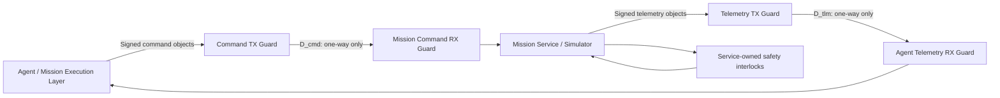
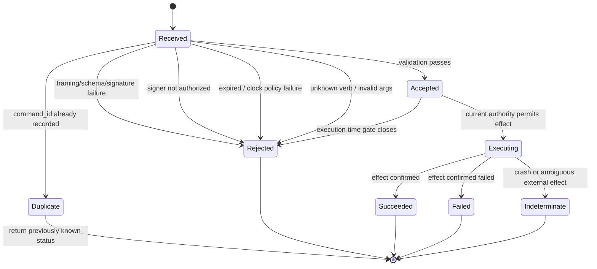
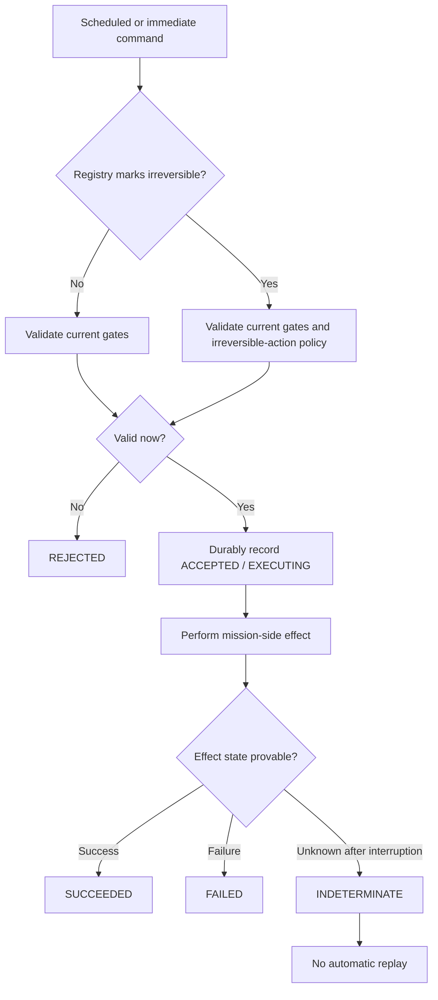
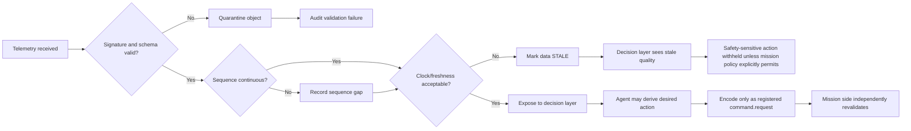

# Communications Subsystem Specification for a Diode-Patterned Mission System

## Executive summary

The existing diode specification establishes a strong application-level pattern: a closed command vocabulary, asymmetric reach, service-held credentials, published state that is never trusted as input, re-evaluation of authority at the moment of effect, at-most-once command intake, inert hidden verbs, and a service-owned safety floor. Its capsule extension also correctly identifies the major new requirements for a mission system: independently evolving physics, telemetry history, irreversible commands, consumable resources, service-owned mission gates, and execution-time revalidation of scheduled actions. fileciteturn0file0

The most important architectural finding is that the current shared-volume pattern and a physical **data diode** are not the same security primitive. NIST defines a data diode as a device that permits data to travel in only one direction. The present pattern carries commands agent→service and state/results service→agent through the same shared storage substrate; it is therefore best understood as an **application-enforced asymmetric guard**, not as a physically unidirectional link. citeturn0search16turn5search0 This distinction matters because a useful mission control loop inherently needs both telemetry and command flow.

The recommended mission architecture is consequently a **dual-diode architecture**:



Each physical or logical diode remains one-way; together they form a deliberately constrained bidirectional **mission application**. No transport handshake crosses either diode. An asynchronous `command.status` emitted over the telemetry diode may refer to a `command_id`, but that is an application event, not a TCP/TLS/QUIC-style reverse-channel acknowledgement.

For the executable wire contract, this report specifies **deterministically encoded CBOR**, described with CDDL, wrapped in **COSE_Sign1**. CBOR is standardized in RFC 8949, CDDL in RFC 8610, and COSE signing in RFC 9052; RFC 8949 defines deterministic encoding requirements, while COSE_Sign1 provides a standard single-signer signed object. citeturn1search2turn7search19turn1search1 A JSON projection is defined for debugging and agent tooling, but the signed bytes are the deterministic CBOR representation.

The design deliberately does **not** invent mission parameters. Sensor rates, required end-to-end latency, bandwidth, queue capacity, blackout duration, telemetry retention, safety thresholds, time accuracy, physical diode model, link bitrate, command expiry ceiling, cryptographic algorithm profile, key-rotation period, forensic-retention period, and mission-specific actuator vocabulary are all **UNSPECIFIED**. They appear as mandatory deployment configuration items rather than guessed defaults.

The principal changes from the prior specification are:

| Area | Prior specification | Mission communications specification |
|---|---|---|
| Physical/logical channels | One shared `/diode` volume carries both directions | Two disjoint one-way channels: `D_cmd` and `D_tlm` |
| Command intake | Mutable `console.json`, destructive clear-before-run | Immutable, individually identified signed command objects |
| At-most-once | Achieved by clearing the batch before effect | Persistent command-ID acceptance ledger; executing commands never replay after uncertain crash |
| Results | One human-readable text file per command | Structured `command.status` event over telemetry; optional human-readable rendering |
| Telemetry | Snapshot plus proposed bounded ring | Signed, sequenced frames plus mandatory telemetry dictionary and bounded spool |
| Schema | String verb plus first-whitespace argument parsing | Typed argument schema per verb |
| Integrity | Filesystem/topology dependent | Object-level cryptographic signature and payload digest |
| Provenance | Limited | Source, boot ID, build digest, config digest, signer key ID |
| Health | Basic published state | Queue, sequence, clock, signing, tamper, attestation, guard state |
| Backpressure | Shared volume semantics | Never propagated backward through a diode; bounded source-side queues and explicit loss |
| Safety | Service-owned abort/gates | Preserved and strengthened; agent-derived signals can never directly overwrite safety gates |

These modifications preserve the prior specification's strongest rule: **authorization is checked when an effect occurs, not merely when it is requested or scheduled**. fileciteturn0file0

NIST's current final OT guidance remains SP 800-82 Rev. 3; NIST began a Rev. 4 revision process in January 2026, but Rev. 4 is presently an initial preliminary draft rather than the final baseline. SP 800-82 explicitly addresses programmable systems that monitor or directly affect physical processes and emphasizes that cybersecurity controls must coexist with safety, reliability, and performance requirements. citeturn9search0turn9search1turn9search3

## Design basis, objectives, constraints, and prior-spec changes

**Normative terminology.** In this report, **MUST**, **MUST NOT**, **SHOULD**, and **MAY** denote requirements for the mission-diode profile. “UNSPECIFIED” means that neither the uploaded prior specification nor the request supplies a safe mission-specific value. Such a field must be resolved by operator configuration before deployment if it is required by the selected profile.

The subsystem has two independently enforceable flows:

- `D_cmd`: agent/control side → mission side.
- `D_tlm`: mission side → agent/control side.

There is no generic third direction.

NIST's definition of a data diode as a one-direction device is the reason for splitting these paths. A single physical diode cannot simultaneously carry both agent→mission command traffic and mission→agent telemetry while retaining the literal one-way property. citeturn0search16

**Objectives and constraints**

| Requirement | Diode specification |
|---|---|
| Safety | Mission-side interlocks, safing logic, resource limits, abort authority, and irreversible-action checks MUST be locally authoritative. The agent may observe safety state but MUST NOT write safety state directly. Actual safety conditions and limits: **UNSPECIFIED**. |
| One-way enforcement | `D_cmd` MUST expose no mission→agent data path. `D_tlm` MUST expose no agent→mission data path. A physical implementation SHOULD make prohibited direction impossible below the application layer. |
| Latency | End-to-end limits: **UNSPECIFIED**. Every implementation MUST measure source-to-receiver latency and queue residence time. The prior five-second polling loop is therefore not retained as a mission default. |
| Bandwidth | Required average, burst, and minimum guaranteed bandwidth: **UNSPECIFIED**. |
| Reliability | Commands use persistent deduplication and at-most-once effect semantics. Telemetry exposes losses through sequences; end-to-end receiver-driven retransmission is forbidden because it would introduce reverse-flow dependence. |
| Availability | Queue overflow and receiver outages must not disable local mission safing. Maximum tolerated outage: **UNSPECIFIED**. |
| Security | Objects MUST be authenticated and integrity protected. Confidentiality requirement: **UNSPECIFIED**. No private keys, credentials, gate secrets, environment values, arbitrary paths, URLs, hostnames, executable code, or shell fragments cross either diode. |
| Auditability | Every accepted/rejected command, safety decision, sequence discontinuity, schema failure, signature failure, key event, restart, time-status change, and tamper event MUST be auditable. Retention period: **UNSPECIFIED**. |
| Determinism | The same accepted command and mission state should lead to deterministic command-validation behavior. Simulation physics determinism itself: **UNSPECIFIED**. |
| Fail-safe behavior | Invalid, unverifiable, stale, unauthorized, malformed, or indeterminate commands fail closed. Telemetry signing failure MUST NOT cause unsigned telemetry to be substituted. |
| Agent autonomy | Agents may derive decisions from telemetry, but all physical effects remain expressible only through the mission command registry. |
| Compatibility | CCSDS mapping is optional rather than intrinsic to the internal diode protocol. |

These principles align with NIST OT guidance's emphasis on safety, performance, and reliability in systems that interact with physical processes, and with NIST's security-control families for information-flow enforcement, boundary protection, audit, integrity, fail-known-state behavior, and input validation. citeturn5search0turn0search18turn8search0

**Requirements retained unchanged from the prior diode specification.** The mission profile retains the closed command vocabulary; service-only credentials; prohibition on agent-authored code, URLs, hosts, and paths; inert hidden commands; operator ceilings that the agent cannot raise; read-only published state semantics; execution-time re-evaluation of gates; and a mission-side abort/safety authority the agent cannot override. fileciteturn0file0

**Required prior-spec changes.**

First, the single shared volume should be split. For the software-only profile, the recommended mounts are:

```text
agent                             mission service
────────────────────────────────────────────────────────────

/diode-cmd/inbox/   ───────────► /rx/commands/
 agent: write                    mission: read only

/diode-tlm/ring/    ◄─────────── /tx/telemetry/
 agent: read only                mission: write only
```

The mission service should not modify the agent's command files. This is deliberately different from `consume_batch()`, whose destructive rewrite requires the receiver to write into the sender-owned channel. Instead, commands are immutable objects identified by `command_id`; the receiver records consumption in a private durable acceptance ledger. Command completion appears on `D_tlm`. This provides a cleaner mapping to an eventual hardware diode.

Second, the command grammar changes from:

```text
"<verb> <untyped remainder>"
```

to:

```text
verb + typed arguments + unique command_id + timestamps + authenticated provenance
```

This remains a closed vocabulary: typed structure is not an invitation for arbitrary programs. The registry still defines every permitted effect.

Third, `output/*.txt` is no longer the authoritative command result. The authoritative output is a `command.status` object. Human-readable files MAY be generated from structured status objects, but must not be independently parsed for mission decisions.

Fourth, the proposed telemetry ring in the capsule section becomes mandatory. Its exact depth is **UNSPECIFIED**. Ring sizing should be derived from:

\[
N_{\text{slots}} \ge \left\lceil\frac{T_{\text{agent blackout to tolerate}}}{T_{\text{publish}}}\right\rceil
\]

Both quantities are presently **UNSPECIFIED**.

**Open-parameter register**

| Parameter | Status |
|---|---|
| Mission telemetry point list | **UNSPECIFIED** |
| Per-point units | **UNSPECIFIED**, defined in telemetry dictionary |
| Per-point sampling rate | **UNSPECIFIED**, defined in telemetry dictionary |
| Per-point maximum decision age | **UNSPECIFIED** |
| Physics tick | **UNSPECIFIED** |
| Telemetry publication cadence | **UNSPECIFIED** |
| Command processing deadline | **UNSPECIFIED** |
| Command maximum age / expiry ceiling | **UNSPECIFIED** |
| End-to-end latency requirement | **UNSPECIFIED** |
| Nominal/burst bandwidth | **UNSPECIFIED** |
| Maximum message size | **UNSPECIFIED** |
| Command queue entries/bytes | **UNSPECIFIED** |
| Telemetry queue entries/bytes | **UNSPECIFIED** |
| Telemetry ring depth | **UNSPECIFIED** |
| Maximum tolerated receiver outage | **UNSPECIFIED** |
| Physical/electrical/optical diode model | **UNSPECIFIED** |
| Physical line rate | **UNSPECIFIED** |
| UDP/EtherType/serial framing, if used | **UNSPECIFIED** |
| Network ports | **UNSPECIFIED**; none in filesystem profile |
| Clock source | **UNSPECIFIED** |
| Required clock uncertainty | **UNSPECIFIED** |
| Signature algorithm | **UNSPECIFIED**, operator security profile must choose |
| Confidentiality requirement | **UNSPECIFIED** |
| Key rotation interval | **UNSPECIFIED** |
| Audit/telemetry retention period | **UNSPECIFIED** |
| Tamper sensor technology | **UNSPECIFIED** |
| Tamper-triggered vehicle behavior | **UNSPECIFIED** |
| Mission safety thresholds | **UNSPECIFIED** |
| Mission actuator and irreversible-command vocabulary | **UNSPECIFIED** |

## Telemetry data model and executable interface contract

The canonical wire representation is deterministic CBOR. RFC 8949 was specifically designed for compact representation and defines core deterministic encoding requirements; CDDL is standardized to describe CBOR and JSON data structures. COSE_Sign1 places a payload and single cryptographic signature in a standardized CBOR structure. citeturn1search2turn7search19turn1search1

The signed form is:

```text
COSE_Sign1(
    protected = {
        alg: <deployment-selected algorithm>,
        kid: <signing-key identifier>,
        content-type: "application/mission-diode+cbor"
    },
    payload = deterministic-CBOR(diode-message),
    signature = ...
)
```

The exact signature algorithm is **UNSPECIFIED**. FIPS 186-5 standardizes RSA, ECDSA, and EdDSA signature techniques; COSE defines algorithm identifiers including EdDSA. An organization subject to U.S. federal cryptographic requirements should select the algorithm and implementation consistently with its approved cryptographic profile and validated module requirements rather than having the diode protocol invent one. citeturn7search0turn7search8turn7search11turn6search10

**Canonical CDDL**

```cddl
diode-message = {
  "v": 2,
  "type": message-type,
  "mission_id": tstr,
  "source_id": tstr,
  "boot_id": bstr .size 16,
  "stream_id": tstr,
  "seq": uint,
  "emitted_at": rfc3339-time,
  "clock": clock-status,
  "provenance": provenance,
  "payload_sha256": bstr .size 32,
  "payload": payload
}

message-type =
    "telemetry.frame" /
    "command.request" /
    "command.status" /
    "capability.snapshot" /
    "health.status" /
    "attestation.evidence" /
    "audit.event"

rfc3339-time = tstr

clock-status = {
  "state": "synchronized" / "holdover" / "unsynchronized",
  "uncertainty_us": uint / null,
  "source": tstr / null
}

provenance = {
  "software_sha256": bstr .size 32,
  "config_sha256": bstr .size 32,
  "signer_kid": bstr,
  ? "sim_run_id": tstr
}

payload =
    telemetry-frame /
    command-request /
    command-status /
    capability-snapshot /
    health-status /
    attestation-evidence /
    audit-event
```

RFC 3339 supplies an interoperable UTC-related timestamp syntax. The specification additionally carries a sequence counter because synchronized wall clocks alone should never be relied upon for ordering or loss detection. citeturn4search1

`seq` is an unsigned monotonic sequence scoped to:

```text
(source_id, boot_id, stream_id)
```

It MUST increase by exactly one for each emitted object in that stream. It MUST NOT silently reset. A restart generates a new `boot_id`. Receivers therefore distinguish packet loss from process reboot without trusting wall-clock order.

`payload_sha256` is SHA-256 over the deterministic-CBOR encoding of `payload`. The COSE signature authenticates the full message; the digest provides stable payload identity for indexing, deduplication, auditing, and forensic correlation. FIPS 180-4 specifies the SHA-2 hash family and describes message digests as a means to detect message changes. citeturn7search2

Lower-layer CRC/FCS is recommended for accidental transmission error detection if the selected physical framing does not already provide one; the particular framing code and polynomial are **UNSPECIFIED**. CRC is not a substitute for COSE authentication.

**Telemetry dictionary.** Telemetry point metadata MUST live in a versioned dictionary; units, types, sampling policy, and staleness limits must not be inferred from point names.

```cddl
telemetry-dictionary = {
  "dictionary_id": tstr,
  "dictionary_sha256": bstr .size 32,
  "points": [* point-definition]
}

point-definition = {
  "point": tstr,
  "description": tstr,
  "type": "int64" / "uint64" / "float64" /
          "bool" / "enum" / "string" / "bytes",
  "unit": tstr / null,
  "update_mode": "periodic" / "event",
  "nominal_period_us": uint / null,
  "max_decision_age_us": uint / null,
  ? "engineering_min": int / float,
  ? "engineering_max": int / float,
  ? "enum_values": { * tstr => int },
  "source": tstr,
  "safety_relevant": bool
}
```

Every mission-specific `point`, unit, engineering range, sampling period, and maximum decision age is presently **UNSPECIFIED**.

A periodic point has a non-null `nominal_period_us`. An event-driven point uses `null`. `max_decision_age_us` is the maximum age at which an agent is permitted to treat a sample as current for decision logic. For points that do not participate in decisions, it may be `null`.

**Telemetry frame**

```cddl
telemetry-frame = {
  "dictionary_sha256": bstr .size 32,
  "samples": [* telemetry-sample]
}

telemetry-sample = {
  "point": tstr,
  "observed_at": rfc3339-time,
  "value": int / float / bool / tstr / bstr,
  "quality": "GOOD" / "DEGRADED" / "INVALID" /
             "STALE" / "SIMULATED",
  ? "point_seq": uint
}
```

`NaN` and infinity SHOULD be rejected unless a point definition explicitly makes them meaningful. Missing data is represented by absence or an invalid-quality sample, not by an undocumented magic numeric value.

An illustrative JSON diagnostic projection—not the bytes that are signed—is:

```json
{
  "v": 2,
  "type": "telemetry.frame",
  "mission_id": "mission-demo",
  "source_id": "capsule-sim",
  "boot_id": "7c2f1d2a-1d73-4d61-9587-02f9eb8546c8",
  "stream_id": "vehicle-state",
  "seq": 1842,
  "emitted_at": "2026-09-11T23:14:08.441Z",
  "clock": {
    "state": "synchronized",
    "uncertainty_us": 250,
    "source": "example-clock"
  },
  "provenance": {
    "software_sha256": "<32-byte-digest>",
    "config_sha256": "<32-byte-digest>",
    "signer_kid": "telemetry-key-example"
  },
  "payload_sha256": "<32-byte-digest>",
  "payload": {
    "dictionary_sha256": "<32-byte-digest>",
    "samples": [
      {
        "point": "vehicle.power.bus_voltage",
        "observed_at": "2026-09-11T23:14:08.437Z",
        "value": 28.1,
        "quality": "SIMULATED",
        "point_seq": 1842
      }
    ]
  }
}
```

The values above are **illustrative only**; they do not specify a bus voltage, sample rate, time accuracy, or mission requirement.

**Command request**

```cddl
command-request = {
  "command_id": bstr .size 16,
  "verb": tstr,
  "args": { * tstr => any },
  "issued_at": rfc3339-time,
  "expires_at": rfc3339-time / null,
  ? "schedule_for": rfc3339-time,
  ? "expected_state_sha256": bstr .size 32
}
```

`verb` MUST exactly match a registry entry. `args` MUST validate against the registry's schema for that verb. Unknown keys MUST be rejected unless that verb's schema explicitly permits extensions.

The sender never gets to assert that a command is safe, reversible, irreversible, authorized, or gated. Those properties come from the mission-side registry.

```json
{
  "v": 2,
  "type": "command.request",
  "mission_id": "mission-demo",
  "source_id": "agent-control",
  "boot_id": "12345678-1234-4234-8234-123456789abc",
  "stream_id": "commands",
  "seq": 91,
  "emitted_at": "2026-09-11T23:14:09.000Z",
  "clock": {
    "state": "synchronized",
    "uncertainty_us": 500,
    "source": "example-clock"
  },
  "provenance": {
    "software_sha256": "<32-byte-digest>",
    "config_sha256": "<32-byte-digest>",
    "signer_kid": "agent-command-key-example"
  },
  "payload_sha256": "<32-byte-digest>",
  "payload": {
    "command_id": "13bbc623-05aa-4c22-812f-47edbcdbb1a9",
    "verb": "set_mode",
    "args": {
      "mode": "standby"
    },
    "issued_at": "2026-09-11T23:14:09.000Z",
    "expires_at": "2026-09-11T23:14:19.000Z"
  }
}
```

`set_mode standby` is inherited as an illustrative declarative shape from the prior specification, not a declaration that this mission has such a mode. fileciteturn0file0

**Command status**

```cddl
command-status = {
  "command_id": bstr .size 16,
  "state":
      "RECEIVED" /
      "ACCEPTED" /
      "REJECTED" /
      "EXECUTING" /
      "SUCCEEDED" /
      "FAILED" /
      "EXPIRED" /
      "INDETERMINATE",
  "reason_code": tstr / null,
  "effective_at": rfc3339-time,
  ? "result": { * tstr => any },
  ? "post_state_sha256": bstr .size 32
}
```

`INDETERMINATE` has a precise meaning: the system knows the command reached an execution boundary but cannot safely prove whether the external effect completed. An irreversible command in this state MUST NOT be automatically retried.

Example:

```json
{
  "type": "command.status",
  "stream_id": "command-status",
  "seq": 322,
  "payload": {
    "command_id": "13bbc623-05aa-4c22-812f-47edbcdbb1a9",
    "state": "SUCCEEDED",
    "reason_code": null,
    "effective_at": "2026-09-11T23:14:09.024Z",
    "result": {
      "mode": "standby"
    },
    "post_state_sha256": "<32-byte-digest>"
  }
}
```

**Capability snapshot**

```cddl
capability-snapshot = {
  "registry_version": tstr,
  "commands": [* command-capability]
}

command-capability = {
  "verb": tstr,
  "available": bool,
  "irreversible": bool,
  "deferrable": bool,
  "argument_schema": any,
  ? "availability_reason": tstr
}
```

This is a machine-readable successor to `HELP.md` and the prior `available_commands` state. `HELP.md` MAY continue as a rendering of this registry. Hidden verbs remain excluded, and under the prior invariant hidden verbs must remain inert. fileciteturn0file0

**Health status**

```cddl
health-status = {
  "command_guard": "OK" / "DEGRADED" / "FAILED",
  "telemetry_guard": "OK" / "DEGRADED" / "FAILED",
  "command_queue_depth": uint,
  "telemetry_queue_depth": uint,
  "telemetry_dropped_total": uint,
  "invalid_command_total": uint,
  "signature_failure_total": uint,
  "sequence_gap_total": uint,
  "clock_state": "synchronized" / "holdover" / "unsynchronized",
  "tamper_state": "CLEAR" / "ASSERTED" / "UNKNOWN",
  "attestation_state": "PASS" / "FAIL" / "UNKNOWN",
  "uptime_us": uint
}
```

All queue maximums and health-publication cadence are **UNSPECIFIED**.

**Attestation and audit**

```cddl
attestation-evidence = {
  "evidence_format": tstr,
  "evidence": bstr,
  "freshness_basis": "timestamp" / "epoch" / "counter",
  "generated_at": rfc3339-time
}

audit-event = {
  "event_id": bstr .size 16,
  "event_type": tstr,
  "severity": "INFO" / "WARN" / "ERROR" / "CRITICAL",
  "subject": tstr,
  "details": { * tstr => any },
  ? "previous_event_sha256": bstr .size 32
}
```

The IETF RATS architecture distinguishes an Attester that produces Evidence, a Verifier that evaluates that Evidence against policy/reference values, and a Relying Party that consumes an attestation result. It also explicitly discusses freshness through timestamps, nonces, and epoch mechanisms and notes that nonce approaches add round trips. That makes timestamp/epoch/counter-based evidence preferable for a strict one-way telemetry path unless a separate challenge path is intentionally designed. citeturn4search0

For real space-system interoperability, this internal envelope can be mapped at a gateway rather than being forced to impersonate a spacecraft link protocol. The active CCSDS catalog identifies Space Packet Protocol CCSDS 133.0-B-2, TM Space Data Link Protocol CCSDS 132.0-B-3, and Space Data Link Security Protocol CCSDS 355.0-B-2; SDLS provides standardized authentication/confidentiality mechanisms at CCSDS data-link level. citeturn2search0turn2search8turn1search0

## Diode enforcement, permitted flows, and decision semantics

**Enforcement must be layered.** No one mechanism should carry the entire claim.

| Layer | Command diode `D_cmd` | Telemetry diode `D_tlm` |
|---|---|---|
| Physical | TX on agent side, RX on mission side only | TX on mission side, RX on agent side only |
| Network | No route/interface for prohibited direction | No route/interface for prohibited direction |
| OS/filesystem profile | Agent write-only exposure; mission read-only exposure | Mission write-only exposure; agent read-only exposure |
| Guard | Accept only signed `command.request` | Accept only allowlisted outbound telemetry types |
| Schema | Registry-defined typed arguments | Telemetry dictionary and message schema |
| Crypto | Verify command signer and object integrity | Agent verifies mission telemetry signer |
| Application | Re-evaluate gates at execution | Published telemetry never read back as mission state |
| Safety | Mission safety logic has final veto | No telemetry value itself authorizes an actuator |

A hardware diode should use a medium in which the prohibited direction is absent or disabled by construction—for example a one-way optical transmitter/receiver arrangement or an electrical/FPGA implementation with physically asymmetric signal paths. Exact device technology, manufacturer, environmental rating, and line coding are **UNSPECIFIED**. NIST's data-diode definition supports the property being sought; NIST SP 800-82 provides the broader OT security context in which boundary protections must also respect reliability and safety. citeturn0search16turn5search0

For the software-only simulation profile, physical assurance is necessarily lower. Separate namespaces, separate mounts, `network_mode: none` on the agent where applicable, least-privilege service accounts, read-only filesystems except explicit spools, and syscall/network policy should be used as defense in depth. This does not justify claiming physical one-way assurance.

**Permitted and forbidden protocols**

| Protocol/interaction | Across a diode? | Rationale |
|---|---:|---|
| Deterministic CBOR datagram/object stream | Allowed | Self-contained message |
| COSE_Sign1 object | Allowed | Object authentication independent of reverse flow |
| Raw Ethernet one-way framing | Allowed if selected | No reverse response required |
| UDP-style unidirectional datagrams | Allowed if selected | Does not intrinsically require reverse ACK |
| Unidirectional serial framing | Allowed if selected | Compatible with physical one-way path |
| File/object spool | Allowed | Suitable for software simulation |
| End-to-end TCP across one diode | Forbidden | Connection setup, acknowledgements, flow control require reverse traffic |
| QUIC across one diode | Forbidden | Bidirectional handshake/ACK behavior |
| End-to-end TLS session across one diode | Forbidden | Handshake is bidirectional |
| SSH | Forbidden | Interactive bidirectional transport |
| HTTP request/response across one diode | Forbidden | Request-response semantics span both directions |
| Receiver-generated transport ACK/NACK | Forbidden | Creates reverse dependency |
| Remote receiver backpressure | Forbidden | Violates strict one-way model |
| Asynchronous `command.status` on opposite diode | Allowed | Independent application message on separately controlled one-way path |
| Agent command derived from telemetry | Allowed only as registry verb | Cannot bypass mission-side policy |

This does not prohibit a local proxy on each side from speaking TCP to its same-side application. It prohibits representing that local proxying as an end-to-end TCP connection through the physical diode.

**Command state machine**



The transition from `Accepted` to `Executing` MUST redo all mission-side authorization relevant to the action: availability gate, safing state, consumables, actuator availability, mission phase, scheduling constraints, and other applicable local conditions. Which conditions apply to which verbs is **UNSPECIFIED** because the actuator vocabulary and mission safety model were not supplied. This preserves the prior specification's execution-time re-dispatch principle. fileciteturn0file0

For a scheduled command, acceptance means only “stored for later consideration.” It does **not** reserve authority. At execution time it re-enters validation.

**Irreversible action handling**



A durable ledger entry must precede an irreversible effect. After restart, an entry left `EXECUTING` MUST be treated as `INDETERMINATE` unless the mission service has an authoritative way to establish the postcondition. This prevents blind replay after a crash.

**Decision triggers.** The diode spec defines what an execution layer may *observe*, but not mission thresholds it has not been given.

| Derived decision signal | Derived from | May cross `D_tlm`? | May cross `D_cmd`? | Rule |
|---|---|---:|---:|---|
| `telemetry_fresh` | sample age + point `max_decision_age` | Yes, as health or can be locally derived | No as an authority bit | Threshold **UNSPECIFIED** |
| `link_healthy` | gaps, latency, queue/drop metrics | Yes | No direct override | Advisory |
| `clock_valid` | clock state/uncertainty | Yes | No direct override | Time-sensitive commands fail according to operator policy |
| `command_available` | service-owned registry/gate | Yes | No override | Command may still be rejected at execution |
| `safety_interlock_ok` | mission safety state | Yes | Never writable directly | Service remains authoritative |
| `resource_margin_ok` | telemetry + mission threshold | Yes | Only indirectly through a defined verb | Threshold **UNSPECIFIED** |
| `actuator_ready` | mission hardware/sim state | Yes | Never writable directly | Rechecked at effect |
| `fault_present` | mission diagnostic state | Yes | Acknowledgement only if explicit verb exists | Fault-clearing authority **UNSPECIFIED** |
| `attestation_trusted` | verifier policy | Yes | May be a prerequisite for commands | Freshness policy **UNSPECIFIED** |
| Agent's desired action | arbitrary agent reasoning | No need | Only as named typed verb | Raw decision structures/programs blocked |

In particular, the following MUST be blocked from `D_cmd` unless a future operator specification explicitly defines a safe narrow substitute:

```text
shell commands
source code
scripts
executable binaries
filesystem paths
URLs
hostnames/IP addresses
arbitrary SQL/query expressions
dynamic module names
environment-variable assignments
credential material
private keys
raw memory addresses
register-write primitives
safety-gate mutation
operator-ceiling mutation
arbitrary "execute" or "eval" verbs
```

The prior specification already establishes the corresponding prohibition on agent-authored paths, hosts, URLs, code, and service credentials. fileciteturn0file0

**Error and stale-data flow**



The agent's interpretation of telemetry can never create a stronger permission than the mission service already possesses.

## Implementation profile, queueing, timing, and design alternatives

**Reference component set**

| Component | Responsibility | Exact product |
|---|---|---|
| Command Encoder | Typed command construction, schema validation | **UNSPECIFIED** |
| Command Signer | COSE_Sign1 generation; private key stays agent side | **UNSPECIFIED** |
| Command TX Guard | Allows only `command.request` | **UNSPECIFIED** |
| Command diode | Physical/logical agent→mission enforcement | **UNSPECIFIED** |
| Command RX Guard | Parsing, signature verification, size/schema checks | **UNSPECIFIED** |
| Deduplication Ledger | Persistent state per `command_id` | **UNSPECIFIED** storage engine |
| Command Registry | Verbs, typed arguments, gates, irreversible flag | Mission vocabulary **UNSPECIFIED** |
| Safety Kernel | Mission-owned veto/interlock logic | Conditions **UNSPECIFIED** |
| Mission/Physics Service | State evolution and effects | Agent execution layer not part of this deliverable |
| Telemetry Dictionary | Point metadata and rates | Mission contents **UNSPECIFIED** |
| Telemetry Publisher | Frames, command status, health, audit | Implementation **UNSPECIFIED** |
| Telemetry Signer | Mission-side COSE signing | **UNSPECIFIED** |
| Telemetry diode | Mission→agent one-way enforcement | **UNSPECIFIED** |
| Telemetry RX Validator | Signature, schema, freshness and sequence checks | **UNSPECIFIED** |
| Trusted Time Source | Wall-clock/time quality | **UNSPECIFIED** |
| Secure Key Store | Protect private signing/attestation keys | HSM/TPM/secure element choice **UNSPECIFIED** |
| Attestation Root | Boot/software measurements | Hardware/firmware mechanism **UNSPECIFIED** |
| Tamper Sensors | Physical tamper indication | **UNSPECIFIED** |
| Audit Store | Append-only forensic records | Retention/storage **UNSPECIFIED** |

NIST SP 800-193 recommends resilience mechanisms that protect platform firmware against unauthorized changes, detect unauthorized changes, and support secure recovery; the RATS architecture provides a standardized conceptual model for conveying evidence about operating state. citeturn4search2turn4search0

**Filesystem profile.** For simulation or CI, no TCP or UDP ports are required.

```text
/diode-cmd/
    inbox/
        <command_id>.cose

/diode-tlm/
    ring/
        000000.cose
        000001.cose
        ...
    latest.cose              # optional convenience mirror
    dictionary.cose
    capability.cose
```

Command publication should use:

```text
1. Encode complete COSE object to a temporary file.
2. fsync temporary object if crash durability is required.
3. Atomically rename into inbox/<command_id>.cose.
4. Never mutate that file afterward.
```

The mission receiver:

```text
1. Observes new immutable object.
2. Applies maximum-file-size check.
3. Parses COSE and CBOR.
4. Verifies signature and authorized signer.
5. Validates schema.
6. Checks command_id ledger.
7. Checks expiry/time policy.
8. Validates verb/args.
9. Writes durable ACCEPTED or REJECTED record.
10. Re-evaluates mission gates immediately before effect.
11. Executes at most once.
12. Emits command.status through D_tlm.
```

The command file need not be deleted by the mission receiver. Agent-side garbage collection can remove it after the agent has received terminal status or after an operator-configured retention interval. That interval is **UNSPECIFIED**.

**Queueing and backpressure.** A strict one-way link cannot make receiver-generated backpressure part of its protocol. Consequently, every queue is bounded at the sender or same-side guard.

For commands:

\[
B_{\text{cmd}} \ge
R_{\text{cmd,burst}} \times
T_{\text{outage}} \times
S_{\text{command,max}}
\]

where command burst rate, outage interval, and maximum command size are all **UNSPECIFIED**.

For telemetry:

\[
B_{\text{tlm}} \ge
R_{\text{tlm,bytes/sec}} \times
T_{\text{outage buffered}}
\]

Both are **UNSPECIFIED**.

The queue classes should be ordered semantically:

```text
highest retention importance
    safety/fault events
    command status
    diode/security health
    core state telemetry
    bulk/history telemetry
lowest retention importance
```

The exact mission priority mapping is **UNSPECIFIED**. A deployment may alter this order only by explicit configuration and review.

When the telemetry queue fills, the producer cannot ask the receiver to slow down. It must apply a local bounded policy. Recommended behavior is to preserve safety/fault and command-status events where capacity permits while dropping or coalescing lower-priority periodic telemetry. Every dropped object or coalesced sample increments explicit counters.

When the command-side receive queue is exhausted, the service MUST NOT overwrite an already accepted command. New arrivals are rejected or left unconsumed according to the selected spool semantics; if a command can be parsed, a rejection status SHOULD subsequently be telemetered.

**Retries.**

For telemetry, there is no receiver-triggered retransmission protocol.

For commands, the source MAY resend the *identical signed object with the same `command_id`*. The mission receiver deduplicates it. It MUST NOT treat retransmission as a new effect.

A new `command_id` represents a new request.

Automatic retries of irreversible commands with new IDs are prohibited.

For a declarative idempotent command, an agent may issue a new command only according to the command's documented semantics and observed mission state. The prior specification already favors declarative `set_x(value)` commands because a lost result can otherwise make recovery ambiguous. fileciteturn0file0

**Timeouts.**

| Timeout | Value |
|---|---|
| Maximum command age | **UNSPECIFIED** |
| Maximum future scheduling horizon | **UNSPECIFIED** |
| Command execution timeout | **UNSPECIFIED per verb** |
| Telemetry stale threshold | **UNSPECIFIED per telemetry point** |
| Heartbeat/health timeout | **UNSPECIFIED** |
| Attestation freshness threshold | **UNSPECIFIED** |
| Filesystem polling interval in software profile | **UNSPECIFIED** |
| Physical receive-frame timeout | **UNSPECIFIED** |

The prior network diode's five-second poll interval must therefore not be copied as a mission assumption. The capsule extension itself recognizes that polling becomes control latency and may be too slow. fileciteturn0file0

**Fail-safe modes**

| Failure | Required posture |
|---|---|
| Command signature invalid | Reject; no effect |
| Schema invalid | Reject entire command object |
| Unknown command | Reject |
| Command expired | Reject |
| Duplicate command ID | No re-execution; report known status |
| Mission safety condition fails | Reject/defer according to registry; never override |
| Command guard failure | Stop accepting external commands |
| Telemetry signer failure | Do not emit unsigned replacement |
| Telemetry loss | Mission local safety continues independently |
| Clock untrustworthy | Mark telemetry clock state; time-sensitive command handling fails closed according to operator-defined safe-command policy |
| Audit storage failure | Raise health/fault; mission behavior beyond that is **UNSPECIFIED** |
| Queue saturation | Bounded local loss/rejection; never synthesize reverse backpressure |
| Physical tamper | Raise tamper condition; physical inhibit/safing response is **UNSPECIFIED** |
| Crash during irreversible effect | Mark `INDETERMINATE`; no automatic replay |

NIST SP 800-53 includes controls covering information flow enforcement, boundary protection, transmission integrity, key management, cryptography, fail-in-known-state behavior, time stamps, audit protection/retention, integrity checking, input validation, and error handling; the exact organizational control baseline still depends on system categorization and policy. citeturn0search18turn8search0

**Alternative designs**

| Design | One-way assurance | Command/telemetry latency | Throughput | Complexity | Failure visibility | Best use |
|---|---|---|---|---|---|---|
| Existing single shared-volume diode | Application only | Poll dependent | Host storage dependent | Low | Good | Existing harness, low-assurance simulation |
| Split two-volume software profile | OS/application separation | Poll/event-watch dependent | Host storage dependent | Low–medium | Very good | CI, simulation, agent development |
| Dual electrical/FPGA unidirectional links | Stronger physical directionality | Device/framing dependent | Hardware dependent | Medium–high | Requires explicit monitoring | Embedded testbeds |
| Dual optical data diodes plus guards | Strongest physical directionality of options shown | Product/link dependent | Product dependent | High | Requires dedicated TX/RX health | High-assurance mission boundary |
| Standard network firewalls only | Policy-enforced, not inherently unidirectional | Generally low | Generally high | Medium | Mature monitoring | Not sufficient when deterministic one-way enforcement is the requirement |

The exact latency and bandwidth figures cannot responsibly be populated without hardware and workload selections, which are **UNSPECIFIED**. NIST's terminology reserves “data diode” for the actual one-direction device, which is why firewall-only enforcement should not be described as equivalent. citeturn0search16

## Test, validation, fault injection, and operational monitoring

The validation program should explicitly test the security property rather than merely test successful telemetry. NIST SP 800-53A provides procedures and a methodology for assessing whether implemented security controls are effective; SP 800-82 frames this kind of system in a safety/reliability-sensitive OT context. citeturn0search12turn5search0

**Required integration scenarios**

| Test | Injection/action | Required observation |
|---|---|---|
| Nominal telemetry | Stream valid frames | No gaps; signatures validate; correct dictionary |
| Nominal command | Valid signed command | One effect maximum; complete status sequence |
| Unknown verb | Signed but nonexistent verb | `REJECTED`; zero effect |
| Wrong argument type | Valid signature, invalid schema | `REJECTED`; zero effect |
| Extra unrecognized field | Inject schema extension | Rejected unless explicitly permitted |
| Oversized object | Exceed configured size | Dropped/rejected before allocation-heavy parse |
| Corrupt CBOR | Bit/truncation corruption | Parser rejects |
| Corrupt COSE signature | Modify signed bytes | Signature verification fails |
| Unauthorized signer | Valid signature from untrusted key | Reject |
| Replay telemetry | Re-send old signed frame | Integrity may validate, but freshness/replay logic marks it non-current |
| Telemetry deletion | Drop sequence range | Gap detected exactly |
| Telemetry reordering | Swap frames | Sequence anomaly detected |
| Command duplication | Deliver same `command_id` repeatedly | One effect maximum |
| Command file replay after reboot | Replay accepted ID | No effect replay |
| Crash before execution | Kill after durable acceptance | Recovery does not blindly repeat irreversible command |
| Crash during effect | Interrupt at effect boundary | `INDETERMINATE` if postcondition cannot be proved |
| Gate closes after scheduling | Schedule while allowed; close gate | Reject when due |
| Resource threshold crossed | Exhaust simulated resource before scheduled action | Mission-side gate prevents effect |
| Clock rollback | Move clock backward | Health/freshness anomaly |
| Clock loss | Mark source unsynchronized | Timestamp-sensitive policy fails safely |
| Telemetry queue overflow | Artificially block transmitter | Explicit drop/coalescing counters |
| Command queue overflow | Saturate receiver | No overwrite of accepted command |
| Storage exhaustion | Fill spool/audit partition | Defined fault; no uncontrolled overwrite |
| Tamper sensor | Assert tamper input | Signed health/audit event; local response per operator policy |
| Software measurement mismatch | Alter measured component | Attestation fails |
| Key rotation | Introduce new trusted key | Controlled transition; old key handling matches policy |
| Key compromise simulation | Revoke signer | Subsequent messages rejected according to revocation policy |
| Reverse-flow network probe | Attempt prohibited Ethernet/IP traffic | Zero prohibited frames cross physical diode |
| Reverse electrical/optical test | Stimulate receiver side | No data path appears in prohibited direction |
| Parser fuzzing | Random/structured CBOR and COSE corpus | No crash, hang, or unintended command |
| Path/traversal payload | Place path-like text in args | Schema rejects unless ordinary text is explicitly legal |
| Hidden command regression | Dispatch all hidden verbs | No external effect/network/spend, preserving prior invariant |

The hidden-verb test directly continues the uploaded specification's requirement that hidden verbs remain inert. fileciteturn0file0

**Telemetry replay harness.** A validation tool should record the original signed bytes, not reconstruct telemetry from decoded JSON. This ensures parser, signature, deterministic encoding, sequence, timing, and provenance behavior can all be replayed faithfully.

Recommended replay modes are:

```text
1x real-time
accelerated time
single-step
selected sequence range
duplicate selected frames
drop selected frames
reorder selected frames
corrupt selected bytes
replace dictionary
clock-offset injection
boot-boundary injection
```

**One-way enforcement acceptance criteria.** The most important metric has an absolute target:

```text
forbidden_direction_frames = 0
forbidden_direction_payload_bytes = 0
```

That should be measured below the protocol guard where possible—packet capture on each network segment and, for high-assurance hardware, physical/electrical/optical instrumentation appropriate to the medium. A failed attempt does not count as a security violation; a bit successfully conveyed in the prohibited data direction does.

Other required verification metrics are:

| Metric | Acceptance |
|---|---|
| Duplicate command effects for same `command_id` | `0` |
| Unknown-verb effects | `0` |
| Invalid-signature effects | `0` |
| Expired-command effects | `0` |
| Automatic replay of `INDETERMINATE` irreversible actions | `0` |
| Undetected injected sequence gaps | `0` in test corpus |
| Undetected known signature corruptions | `0` |
| Unsigned telemetry substituted after signing failure | `0` |
| Parser crashes from malformed test corpus | `0` |
| Command latency target | **UNSPECIFIED** |
| Telemetry latency target | **UNSPECIFIED** |
| Allowed telemetry loss rate | **UNSPECIFIED** |
| Maximum queue occupancy target | **UNSPECIFIED** |
| Clock-error limit | **UNSPECIFIED** |
| Availability objective | **UNSPECIFIED** |

**Required monitoring dashboard.** Because actual operational data is not supplied, producing empirical charts here would fabricate results. The deployed system should generate at least these visualizations:

1. **Telemetry end-to-end latency over time**, with p50/p95/p99 bands and the configured decision-age limits overlaid.
2. **Sequence-gap heat map** by `stream_id` and time.
3. **Command outcome timeline**, separated into accepted, rejected, failed, succeeded, expired, and indeterminate.
4. **Queue-depth chart** for command and telemetry spools with high-water marks.
5. **Telemetry throughput and drop chart**, split by priority class.
6. **Clock uncertainty/time-state chart**, showing synchronized, holdover, and unsynchronized intervals.
7. **Cryptographic-health panel**, including signature failures, untrusted key IDs, key age, and last successful attestation.
8. **Diode-enforcement panel**, prominently showing forbidden-direction frame/byte counters; both should remain zero.
9. **Tamper and reboot timeline**, correlated with `boot_id` changes and attestation state.
10. **Mission-point freshness matrix**, with each decision-critical telemetry point showing last observation age versus its configured `max_decision_age_us`.

NIST log-management guidance treats log management as the generation, transmission, storage, access, analysis, and eventual disposal of event records for operational and security purposes. SP 800-92 remains the final publication while Rev. 1 remains draft on NIST's current log-management publication page. citeturn6search0turn6search3turn6search9

## Security, compliance, configuration, and implementation deliverables

**Cryptographic architecture.** Command and telemetry signing keys should be distinct. Compromise of an agent command key should not permit forgery of mission telemetry, and compromise of a telemetry signing key should not confer command authority.

A minimal trust layout is:

```text
Operator / provisioning authority
        |
        +--> command-signer trust policy
        |       |
        |       +--> authorized agent command public keys
        |
        +--> mission telemetry trust policy
                |
                +--> mission telemetry signing public keys
                +--> attestation verifier/reference values
```

Private command keys remain on the agent/control side. Private telemetry and attestation keys remain on the mission side. Neither appears in telemetry, `HELP.md`, published state, logs intended for agents, environment dumps, error strings, or command results.

NIST SP 800-57 Part 1 Rev. 5 remains the current final general key-management recommendation; NIST published an initial Rev. 6 draft in December 2025 that adds, among other changes, discussion of newer post-quantum algorithms. Because Rev. 6 is a draft, this specification uses Rev. 5 as the final baseline and treats future cryptographic migration as a deployment decision. citeturn0search2turn0search3turn0search7

For environments requiring FIPS validation, cryptography should be supplied by an appropriate active FIPS 140-3 validated cryptographic module rather than merely by an implementation that happens to use the same algorithms. FIPS 140-3 defines requirements across module interfaces, authentication, software/firmware security, physical security, sensitive-security-parameter management, self-tests, and lifecycle assurance. citeturn6search7turn6search10

**Key lifecycle fields that must be configuration-controlled**

```yaml
crypto:
  command_signing:
    algorithm: UNSPECIFIED
    trusted_key_ids: UNSPECIFIED
    rotation_period: UNSPECIFIED
    revocation_source: UNSPECIFIED

  telemetry_signing:
    algorithm: UNSPECIFIED
    key_id: UNSPECIFIED
    rotation_period: UNSPECIFIED

  attestation:
    mechanism: UNSPECIFIED
    reference_values: UNSPECIFIED
    freshness_limit: UNSPECIFIED

  confidentiality:
    required: UNSPECIFIED
    mechanism: UNSPECIFIED
```

An unresolved `UNSPECIFIED` value for a field required by the selected deployment profile should cause configuration validation to fail before startup.

**Audit and forensic requirements.** At minimum, the protected audit record should preserve:

```text
raw signed command bytes
raw signed telemetry/status bytes where relevant
command_id and command state transitions
registry version and registry digest
telemetry dictionary digest
software build digest
configuration digest
boot_id and reboot cause where available
signing key ID and verification result
attestation evidence/result
sequence gaps and duplicate events
clock source/state/uncertainty changes
queue overflow/drop events
tamper events
safety-gate rejection reason codes
irreversible-action acceptance/execution state
operator configuration changes
key provision/rotation/revocation events
```

Logs should not retain secret/private key material. Audit retention time, immutable-storage technology, replication count, and legal hold policy are all **UNSPECIFIED**. NIST SP 800-53 includes audit-generation, timestamp, audit-protection, and audit-retention controls, while NIST SP 800-92 provides the overarching log-management guidance. citeturn8search0turn6search0

A useful audit-integrity mechanism is an append-only chain in which each event references the SHA-256 digest of its predecessor, with periodic signed checkpoints exported through `D_tlm`. This does not make deletions impossible, but it makes missing/reordered history detectable when trusted checkpoints are retained separately. The underlying SHA-256 digest is standardized by FIPS 180-4. citeturn7search2

**Attestation.** The attester should measure at least the diode guard, mission service executable/image, security-relevant configuration, and command registry. The exact measurement root and hardware mechanism are **UNSPECIFIED**. NIST SP 800-193's protection/detection/recovery model and the IETF RATS separation of Attester, Verifier, and Relying Party provide appropriate conceptual baselines. citeturn4search2turn4search0

**Compliance mapping**

| Diode property | Primary standards/control mapping |
|---|---|
| One-way information flow | NIST data-diode definition; SP 800-53 AC-4 Information Flow Enforcement |
| Boundary isolation | SP 800-53 SC-7 Boundary Protection |
| Message integrity | SC-8; SI-7; COSE/RFC 9052 |
| Key management | SC-12; SP 800-57 |
| Approved cryptography | SC-13; FIPS 140-3; FIPS 186-5 |
| Fail closed / known state | SC-24 |
| Input/schema validation | SI-10 |
| Error handling | SI-11 |
| Time correlation | AU-8; RFC 3339 |
| Audit generation | AU-2/AU-3/AU-12 |
| Audit protection | AU-9 |
| Audit retention | AU-11 |
| Configuration baseline/change control | CM-2/CM-3/CM-6 |
| Physical boundary/tamper monitoring | PE family as applicable |
| Platform resilience | NIST SP 800-193 |
| Runtime attestation | IETF RFC 9334 RATS |
| Space-packet interoperability, if needed | CCSDS 133.0-B-2 |
| CCSDS telemetry link, if needed | CCSDS 132.0-B-3 |
| CCSDS data-link authentication/confidentiality, if needed | CCSDS 355.0-B-2 |

The NIST control catalog is intended to be tailored to mission/business risk rather than used as an undifferentiated checklist, and SP 800-82 supplies OT-specific context for systems that interact with physical processes. citeturn0search18turn5search0

**Reference deployment configuration**

```yaml
spec_version: 2

mission:
  mission_id: UNSPECIFIED
  simulator_or_vehicle_id: UNSPECIFIED

command_diode:
  profile: split-filesystem   # or physical-hardware
  path: /diode-cmd/inbox
  max_object_bytes: UNSPECIFIED
  queue_entries: UNSPECIFIED
  queue_bytes: UNSPECIFIED
  poll_interval_ms: UNSPECIFIED
  maximum_command_age_ms: UNSPECIFIED
  maximum_schedule_horizon_ms: UNSPECIFIED

  allowed_message_types:
    - command.request

  forbidden_payload_classes:
    - executable_code
    - shell
    - path
    - url
    - hostname
    - credential
    - private_key
    - safety_override
    - operator_ceiling_override

telemetry_diode:
  profile: split-filesystem
  path: /diode-tlm/ring
  max_object_bytes: UNSPECIFIED
  queue_entries: UNSPECIFIED
  queue_bytes: UNSPECIFIED
  ring_slots: UNSPECIFIED

  allowed_message_types:
    - telemetry.frame
    - command.status
    - capability.snapshot
    - health.status
    - attestation.evidence
    - audit.event

encoding:
  canonical: cbor
  deterministic: true
  schema: cddl
  debug_projection: json

integrity:
  object_signature: COSE_Sign1
  signature_algorithm: UNSPECIFIED
  payload_digest: SHA-256

time:
  source: UNSPECIFIED
  maximum_uncertainty_us: UNSPECIFIED

safety:
  service_owned_interlocks: true
  external_override_allowed: false
  safe_commands_when_clock_invalid: UNSPECIFIED

audit:
  retention: UNSPECIFIED
  append_only: true
  hash_chain: SHA-256

attestation:
  enabled: UNSPECIFIED
  mechanism: UNSPECIFIED
  freshness_limit: UNSPECIFIED
```

**Parser/validator pseudocode**

```text
function receive_command(raw_bytes):

    # Hard bound must run before complex decoding.
    require len(raw_bytes) <= CONFIG.command.max_object_bytes

    cose = parse_cose_sign1(raw_bytes)
        or reject("BAD_COSE")

    kid = cose.protected_header.key_id
    alg = cose.protected_header.algorithm

    require kid in TRUSTED_COMMAND_KEYS
        or reject("UNTRUSTED_SIGNER")

    require alg == policy.algorithm_for(kid)
        or reject("ALGORITHM_POLICY")

    verify_cose_signature(cose, TRUSTED_COMMAND_KEYS[kid])
        or reject("BAD_SIGNATURE")

    msg = decode_deterministic_cbor(cose.payload)
        or reject("BAD_CBOR")

    validate_envelope_schema(msg)
        or reject("BAD_ENVELOPE")

    require msg.type == "command.request"
        or reject("WRONG_DIRECTION_OR_TYPE")

    verify_sha256(
        deterministic_cbor(msg.payload),
        msg.payload_sha256
    ) or reject("PAYLOAD_DIGEST_MISMATCH")

    require sequence_policy.accept(
        msg.source_id,
        msg.boot_id,
        msg.stream_id,
        msg.seq
    ) or reject("SEQUENCE_POLICY")

    cmd = msg.payload

    # Durable deduplication is checked before effect.
    prior = command_ledger.lookup(cmd.command_id)

    if prior exists:
        emit_status(prior.current_status)
        return

    validate_time_policy(cmd, msg.clock)
        or durable_reject(cmd, "STALE_OR_CLOCK_INVALID")

    definition = REGISTRY.lookup(cmd.verb)
        or durable_reject(cmd, "UNKNOWN_VERB")

    validate_against_schema(cmd.args, definition.argument_schema)
        or durable_reject(cmd, "BAD_ARGUMENTS")

    durable_record(cmd.command_id, state="ACCEPTED")

    if cmd.schedule_for is not null:
        schedule_reference(cmd.command_id, cmd.schedule_for)
        return

    dispatch(cmd.command_id)
```

Execution is deliberately separate:

```text
function dispatch(command_id):

    record = command_ledger.load(command_id)
    definition = REGISTRY.lookup(record.verb)

    # Re-evaluate everything that protects the vehicle here.
    if not definition.available_now():
        terminal(command_id, "REJECTED", "GATE_CLOSED")
        return

    if not SAFETY_KERNEL.authorizes(definition, record.args):
        terminal(command_id, "REJECTED", "SAFETY_INTERLOCK")
        return

    if not resource_policy_allows(definition, record.args):
        terminal(command_id, "REJECTED", "RESOURCE_LIMIT")
        return

    durable_update(command_id, "EXECUTING")

    try:
        result = perform_effect(definition, record.args)
        terminal(command_id, "SUCCEEDED", result=result)

    except ConfirmedNoEffect as e:
        terminal(command_id, "FAILED", reason=e.code)

    except AmbiguousEffect as e:
        # Critical property: never auto-replay this command.
        terminal(command_id, "INDETERMINATE", reason=e.code)
```

Telemetry validation mirrors the same structure:

```text
function receive_telemetry(raw_bytes):

    require len(raw_bytes) <= CONFIG.telemetry.max_object_bytes

    cose = parse_cose_sign1(raw_bytes)
    verify_authorized_telemetry_signature(cose)

    msg = decode_deterministic_cbor(cose.payload)
    validate_envelope_schema(msg)

    require msg.type in ALLOWED_TELEMETRY_TYPES

    verify_payload_digest(msg)

    seq_result = track_sequence(
        msg.source_id,
        msg.boot_id,
        msg.stream_id,
        msg.seq
    )

    if seq_result.has_gap:
        audit("TELEMETRY_GAP", seq_result)

    freshness = evaluate_freshness(msg)

    persist_raw_signed_object(raw_bytes)

    expose_to_agent(
        decoded=msg,
        signature_valid=true,
        sequence_status=seq_result,
        freshness=freshness
    )
```

The validator must make trust metadata inseparable from decoded values. An agent should not receive simply:

```text
bus_voltage = 28.1
```

but logically:

```text
value            = 28.1
signature_valid  = true
source            = capsule-sim
boot_id           = ...
sequence           = 1842
freshness          = CURRENT
quality            = SIMULATED
dictionary_hash    = ...
software_hash      = ...
config_hash        = ...
```

That is the central requirement for “executable telemetry”: the decision layer receives not merely numbers but enough **type, time, quality, ordering, identity, provenance, and integrity context** to decide whether those numbers are admissible inputs to a mission action.

**Concise diode-spec document structure for implementation**

```text
MISSION-DIODE-SPEC.md

Purpose and threat model
    trust boundaries
    D_cmd and D_tlm definitions
    safety ownership

Protocol profile
    CBOR encoding
    COSE signing
    versioning
    sequence semantics
    time semantics

Telemetry dictionary
    point IDs
    types
    units
    sample rates
    staleness limits
    engineering ranges

Command registry
    verbs
    argument schemas
    reversibility
    scheduling policy
    mission-side gates

Message schemas
    telemetry.frame
    command.request
    command.status
    capability.snapshot
    health.status
    attestation.evidence
    audit.event

Diode enforcement
    software profile
    hardware profile
    permitted protocols
    forbidden protocols
    tamper response

Reliability
    queues
    ring sizing
    overflow policy
    retry/deduplication rules
    crash semantics

Security
    trust roots
    key lifecycle
    attestation
    audit integrity
    retention

Verification
    integration tests
    replay tests
    fault injection
    reverse-flow validation
    acceptance metrics

Deployment parameters
    every UNSPECIFIED item resolved and approved
```

The resulting specification preserves the prior diode pattern's strongest safety properties while removing the places where its original shared-file mechanics would prevent a credible claim of one-way communications enforcement. It also cleanly separates responsibilities: **the diode specification determines what information may cross, how its authenticity and provenance are established, how loss and ambiguity are represented, and what can never cross; the agents remain free to implement mission reasoning above that boundary, while the mission service retains final authority over effects.** fileciteturn0file0