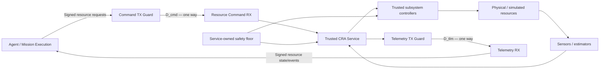
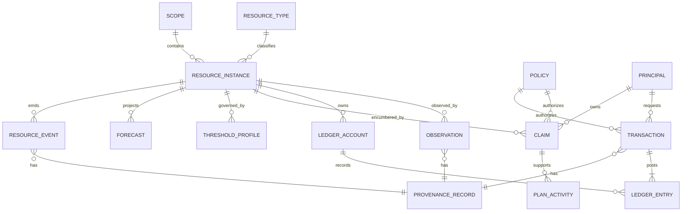
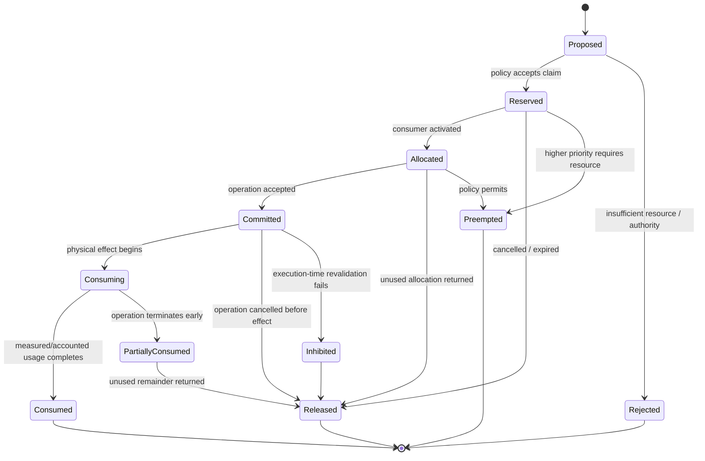
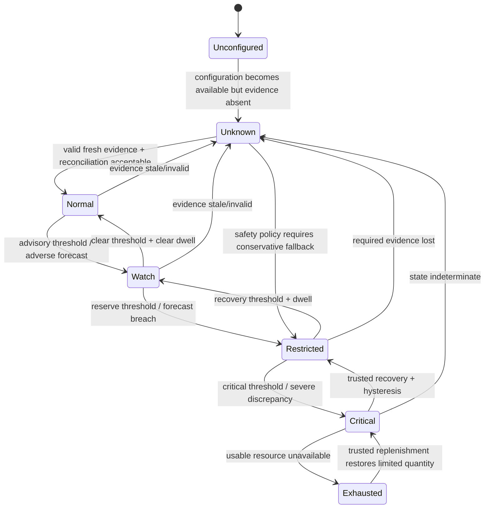
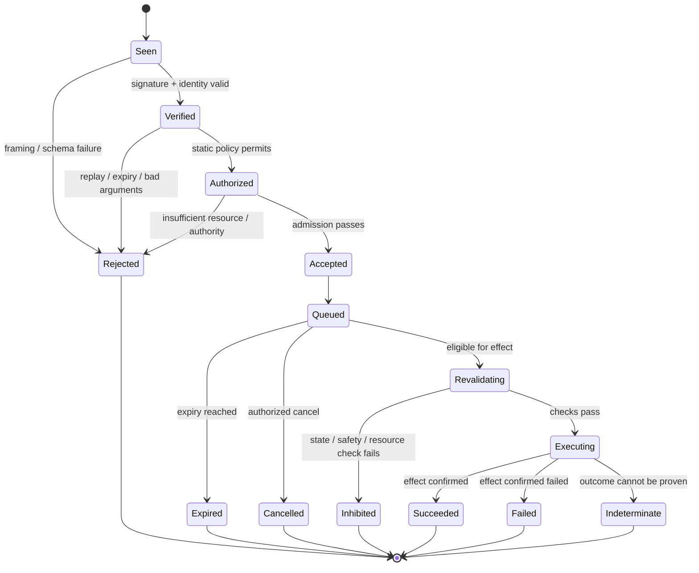

# Consumables and Resource Accounting Subsystem for Executable Telemetry and Diode-Pattern Decisioning

## Executive summary

This report defines a mission- and platform-neutral **Consumables and Resource Accounting subsystem (CRA)** suitable for implementation as executable telemetry, an authoritative resource ledger, deterministic decision logic, and a diode-pattern mission interface.

The central architectural conclusion is that consumables should not be modeled as a loose set of “remaining” gauges. They should be modeled as a **versioned resource ledger connected to physical observations, estimates, reservations, commitments, allocations, losses, replenishments, forecasts, and policy constraints**. NASA systems engineering treats margins on resources such as weight, power, and memory as explicit allowances for uncertainty and risk, and Technical Performance Measures compare achieved and anticipated values to expose deficiencies before they jeopardize requirements. NASA/JPL work generalizes the resource-margin concept to power, energy, propellant, computer performance, and other parameters with an explicitly defined margin. citeturn9view9turn9view10turn2search3

The subsystem should therefore distinguish at least five fundamentally different things:

1. **Physical or logical quantity** — for example, 312 kg of propellant, 1.8 GJ of stored battery energy, 140 GiB of free storage, 17 spare filters, or four concurrent software-license seats.
2. **Observed or estimated quantity** — what instrumentation or an estimator currently believes exists, with quality, uncertainty, and provenance.
3. **Claims against quantity** — reservations, allocations, and committed future use.
4. **Operational margin** — the amount of usable resource left after constraints and claims; for non-stock quantities this may be headroom rather than inventory.
5. **Forecasted sufficiency** — time to threshold, probability/confidence of a shortfall, and resources required by approved future plans.

This preserves the epistemic separation already established by the supplied spacecraft work: agents receive measurements and estimates rather than simulator omniscience; propellant remaining, battery energy, scrubber life, thermal margin, and similar quantities may be inferred rather than directly measured. fileciteturn0file7 The main-propulsion specification similarly treats propellant quantity as estimated evidence rather than hidden physical truth, while the ECLSS specification distinguishes `DIRECT`, `DISCRETE`, `ESTIMATED`, and `SERVICE_STATE` telemetry. fileciteturn0file3 fileciteturn0file5

The accounting engine should support seven abstract resource behaviors:

| Resource behavior | Examples | Accounting model |
|---|---|---|
| **Stock** | Propellant, oxygen, water, food, battery energy | Conserved quantity with inflows, outflows, loss, and adjustment |
| **Rate/capacity** | Electrical power, downlink rate, cooling capacity, CPU throughput | Instantaneous capacity minus demand and reserve |
| **Buffer** | Recorder storage, telemetry queues, command queues | Finite capacity with occupancy, ingress, egress, drops |
| **Inventory** | Spares, filters, cartridges, replacement units | Discrete serialized or fungible items with condition |
| **Entitlement** | Software licenses, concurrent seats, cryptographic-use quotas | Limited rights with scope, expiry, checkout, and release |
| **Margin** | Thermal margin, memory margin, timing slack, ΔV margin | Derived distance to a configured limit; generally not conserved |
| **Opportunity** | Communication window, maintenance opportunity, charging interval | Time-bounded availability that cannot necessarily be stored |

This classification allows power, propellant, data, spares, thermal margin, compute, licenses, crew consumables, and future resource types to share one accounting model without pretending that all of them behave like kilograms in a tank.

The principal accounting invariant should be:

\[
Q_{\mathrm{closing,ledger}}
=
Q_{\mathrm{opening}}
+
Q_{\mathrm{replenished}}
+
Q_{\mathrm{transferred\ in}}
+
Q_{\mathrm{authorized\ adjustments}}
-
Q_{\mathrm{consumed}}
-
Q_{\mathrm{transferred\ out}}
-
Q_{\mathrm{leaked/lost}}
-
Q_{\mathrm{decayed/discarded}}
\]

A separately obtained observation or estimator result is then compared with the ledger prediction:

\[
\Delta_{\mathrm{recon}}
=
Q_{\mathrm{observed/estimated}}
-
Q_{\mathrm{closing,ledger}}.
\]

A mismatch is **evidence**, not permission to silently rewrite the ledger. Reconciliation beyond configured uncertainty/tolerance must generate an explicit, auditable `RECONCILIATION_MISMATCH`; any correction must be an authorized `ADJUSTMENT` transaction carrying evidence, reason, signer, policy revision, and before/after values.

Reservations, allocations, and commitments are accounting claims and must not alter the physical quantity. The recommended lifecycle is:

`FREE → RESERVED → ALLOCATED → COMMITTED → CONSUMED/RELEASED`

so the same quantity cannot accidentally be counted simultaneously as both reserved and committed.

The most important diode conclusion is equally strict. NIST defines a data diode as allowing data to move in only one direction, and defines a unidirectional gateway as physically unable to send information back toward the source network. citeturn8view0turn8view1 Consequently, an external mission-execution agent that both **observes CRA telemetry and requests resource-management actions** needs two independent one-way paths:



This is the logical successor to the supplied diode design. The original pattern correctly establishes closed vocabulary, service-owned authority, published state that is never read back as input, operator ceilings that agents cannot raise, declarative/idempotent commands, and effect-time revalidation. fileciteturn0file0 The supplied communications study strengthens that pattern for a literal physical diode by separating command and telemetry into independent one-way paths and replacing mutable free-form commands with immutable typed messages, command IDs, sequencing, signing, and structured status. fileciteturn0file2

For signed transport, the recommended default is **deterministically encoded CBOR inside COSE_Sign1**. RFC 8949 specifies deterministic CBOR encoding requirements; RFC 9052 defines `COSE_Sign1` as a signed CBOR structure carrying headers, payload, and signature. citeturn9view6turn9view7 JSON Schema, Avro, and Protocol Buffers are still valuable projections of the same semantic model: JSON is recommended for diagnostics/configuration, Protobuf for strongly typed runtime integration, and Avro for archival/event streams. Raw serialized Protobuf should not itself be the cryptographic canonical form because the official Protobuf documentation explicitly states that deterministic serialization is not canonical and serialized hashes can change across schemas, builds, or library versions. citeturn9view0turn9view1

The recommended implementation baseline is therefore:

| Area | Recommended default |
|---|---|
| Authority | Trusted CRA service owns authoritative ledger and safety reserves |
| Quantity representation | Fixed-point integer mantissa + decimal exponent + unit code |
| Units | SI/mission canonical units; UCUM-compatible machine-readable unit strings where useful |
| Physical evidence | Direct readings remain distinct from estimates and service state |
| Ledger model | Event-sourced journal + periodic signed snapshots |
| Claims | Explicit reservation → allocation → commitment lifecycle |
| Resource aggregation | Type-specific aggregation, never generic summation |
| Sampling | Multi-rate adaptive profile; slow stocks low-rate, fast margins/buffers higher-rate |
| Alarms | Threshold + dwell + hysteresis + quality/freshness qualification |
| Forecasting | Rate-based and plan-based forecasts with uncertainty and model revision |
| Reconciliation | Explicit discrepancy records; no silent reset-to-sensor |
| Audit | Append-only transaction/event IDs with hash linkage and signatures |
| Diode topology | Independent `D_cmd` and `D_tlm` for external closed-loop agents |
| Signed representation | Deterministic CBOR + COSE_Sign1 |
| Runtime projection | Protobuf |
| Archive/event projection | Avro |
| Human/debug projection | JSON validated by JSON Schema 2020-12 |
| Commands | Closed typed vocabulary; no arbitrary expression, code, path, URL, or ledger write |
| Decisioning | Deterministic snapshot evaluation with service-side effect-time revalidation |
| Unknown configuration | `UNCONFIGURED`/`UNKNOWN`; never silently substitute a “typical spacecraft” value |

The numerical cadence and threshold examples below are **CRA-REF software integration defaults**, not flight requirements. Actual capacities, reserves, sample frequencies, alarm thresholds, uncertainty envelopes, authority policy, key profile, retention periods, and resource priorities remain mission configuration unless explicitly supplied.

## Scope, assumptions, and architecture

The CRA subsystem sits above component-specific sensing and below mission planning. It is not intended to replace the propulsion estimator, battery-management system, thermal controller, ECLSS controller, recorder manager, operating-system scheduler, or license server. Instead, it provides a common **resource truth-and-claims layer** to which those systems publish evidence and through which higher-level mission execution obtains a coherent, auditable resource picture.

This follows the separation used throughout the supplied subsystem specifications. Propulsion owns its sequencing and safety constraints; EPDS owns destructive electrical protection; thermal owns local heater/pump protection; GNC retains its fast closed loops; ECLSS owns life-protection actions. The CRA service may account for their resources, forecast shortages, and request bounded changes, but it does not become a replacement low-level controller. fileciteturn0file1 fileciteturn0file3 fileciteturn0file4 fileciteturn0file5 fileciteturn0file6

NASA's systems-engineering definition of margin explicitly includes budget allowances for technical parameters such as power and memory, and NASA Technical Performance Measures track current and anticipated parameter values to identify deficiencies requiring evaluation or corrective action. That is the conceptual basis for treating “margin” as a first-class CRA object rather than only reporting raw inventory. citeturn9view9turn9view10

**Explicitly unspecified assumptions**

| Item | Status | CRA consequence |
|---|---|---|
| Spacecraft, habitat, vehicle, or terrestrial platform | **UNSPECIFIED** | No fixed capacity or limit is embedded |
| Mission duration and phases | **UNSPECIFIED** | Forecast horizons and reserves are configuration |
| Crewed/uncrewed status | **UNSPECIFIED** | Crew-resource categories are optional; life-safety priority remains configurable |
| Propulsion technology | **UNSPECIFIED** | Propellant may be mass, moles, electrical propellant inventory, or another technology-specific model |
| Power architecture | **UNSPECIFIED** | CRA represents energy/power abstractly; EPDS determines real electrical limits |
| Battery chemistry | **UNSPECIFIED** | Usable-energy and derating models are supplied externally |
| Thermal architecture | **UNSPECIFIED** | CRA accounts for thermal margin but does not invent temperature limits |
| Data storage and downlink topology | **UNSPECIFIED** | Buffer and bandwidth resource instances are configured |
| Processor/RTOS/accelerators | **UNSPECIFIED** | Compute is represented through platform-declared quotas and measured consumption |
| Spare-parts catalogue | **UNSPECIFIED** | Part identity, interchangeability, life, and condition come from configuration |
| Software license agreements | **UNSPECIFIED** | CRA records entitlement metadata but does not infer legal rights |
| Fleet topology | **UNSPECIFIED** | Fleet sharing is allowed only for explicitly transferable resources |
| Reliability/assurance class | **UNSPECIFIED** | Verification depth is mission-selected |
| Cryptographic algorithms | **UNSPECIFIED** | Signing semantics are fixed; algorithm/key profile is operator-selected |
| Data-diode hardware | **UNSPECIFIED** | Logical interface works with filesystem, serial, Ethernet-like simplex, or other one-way transport |
| Clock source and correlation | **UNSPECIFIED** | Monotonic mission time is required; wall-clock correlation is optional |
| Retention depth | **UNSPECIFIED** | Event/snapshot storage sizing is a deployment decision |
| Resource thresholds and reserves | **UNSPECIFIED** | Missing safety-critical values produce `UNCONFIGURED`, not a guessed default |

A version-controlled data dictionary should be the authoritative source for resource IDs, types, units, scale, range, sampling profile, provenance expectations, transfer eligibility, aggregation method, alarm policy, and command capabilities. NASA work on command/telemetry dictionaries describes the dictionary as central to information exchanged among space and ground systems and notes that centralized data definitions reduce duplication and potential errors; NASA's CCDD work likewise uses central message definitions to generate or automate flight-software artifacts. citeturn10search0turn10search8

The recommended logical components are:

| Component | Trusted responsibility |
|---|---|
| **Resource Registry** | Defines resource IDs, units, accounting behavior, parent scope, limits, transfer rules, and policy references |
| **Observation Ingest** | Accepts authenticated sensor/estimator evidence; checks schema, time, identity, range, and quality |
| **Physical-State Estimator Interface** | Imports resource estimates and their uncertainty without allowing the estimator to rewrite accounting history |
| **Ledger Engine** | Applies valid accounting transactions and enforces conservation/claim invariants |
| **Reservation Manager** | Creates, converts, expires, releases, or preempts resource claims |
| **Forecast Engine** | Projects depletion, replenishment, saturation, and plan sufficiency |
| **Threshold/Alarm Engine** | Evaluates threshold, dwell, hysteresis, derivative, forecast, and discrepancy rules |
| **Reconciliation Engine** | Compares ledger prediction with independent observations and opens discrepancies |
| **Policy Engine** | Applies authority, priorities, reserve floors, sharing, transfer, and replenishment rules |
| **Audit Journal** | Persists every accepted/rejected transaction, observation, rule evaluation, adjustment, command, and policy revision |
| **Telemetry Publisher** | Emits immutable resource states, events, capabilities, audit references, and command status |
| **Command Executive** | Validates signed typed requests and revalidates them immediately before effect |
| **Safety Kernel Interface** | Receives service-owned non-bypassable constraints from propulsion, ECLSS, EPDS, thermal, GNC, and platform safety functions |

The entity relationships should be explicit rather than implicit in point names:



**Authority domains should remain separate.** The CRA ledger may say a burn has 42 kg of propellant reserved; it must not thereby force propulsion to ignite. Propulsion still rechecks pressure, health, thermal readiness, attitude permissions, and all other interlocks at execution. Likewise, an energy reservation does not force EPDS to supply a load if electrical protection has isolated that branch. The supplied subsystem studies converge on this rule: acceptance or scheduling does not constitute permanent authorization, and safety must be re-evaluated at the moment of effect. fileciteturn0file0 fileciteturn0file3 fileciteturn0file4 fileciteturn0file6

A useful authority hierarchy is:

| Level | Owner | CRA role |
|---|---|---|
| `S0` | Trusted safety kernel | Non-bypassable survival reserve, emergency inhibit, local protection |
| `A0` | Observer | Read telemetry, capabilities, events |
| `A1` | Mission execution | Ordinary reservation/release, tighter self-imposed budget, low-risk transfer requests |
| `A2` | Safety-significant mission authority | Preempt lower-priority claims, major transfer/replenishment requests, reserve-policy transitions |
| `A3` | Ground/test/maintenance | Reconciliation adjustments, entitlement/configuration maintenance, exceptional manual accounting |
| Operator configuration | Mission authority | Hard ceilings/floors, trust anchors, resource definitions, safety-reserve rules |

An agent can always impose a **stricter** local budget on itself but must not be able to lower a trusted reserve floor or raise an operator-owned ceiling. That is the generalized form of the supplied diode's `min(agent allowance, operator ceiling)` pattern. fileciteturn0file0

## Resource ontology and accounting model

### Consumable and resource catalogue

A single `category` is insufficient because “battery energy” and “available bus power” are both power resources but have different mathematics. Each resource therefore has both a **domain category** and an **accounting behavior**.

| Domain category | Typical resource instances | Primary metrics | Canonical unit examples | Behavior | Important derived state |
|---|---|---|---|---|---|
| **Main propellant** | Fuel, oxidizer, monopropellant, pressurant | mass, estimated usable mass, consumption rate | `kg`, `kg/s` | STOCK | burn reserve, leak rate, ΔV-supported estimate |
| **Attitude-control propellant** | RCS tanks/strings | mass, impulse-equivalent remaining | `kg`, `N·s` | STOCK | maneuver budget, minimum reserve |
| **Electrical energy** | Batteries, fuel cells, regenerative stores | usable energy, state of charge, charge/discharge rate | `J`, optionally Wh presentation | STOCK | time to reserve, energy margin |
| **Electrical power** | Bus/source/converter capacity | available generation, demand, reserve | `W` | CAPACITY | instantaneous headroom |
| **Crew gases** | O₂, N₂/diluent, breathing mixtures | mass/moles, pressure-derived inventory | `kg`, `mol` | STOCK | person-hours/days at forecast load |
| **Water and food** | potable water, process water, meals/food mass | mass/volume/item count | `kg`, `m³`, `count` | STOCK/INVENTORY | crew-days supported |
| **Scrubbers/filters/sorbents** | CO₂ beds, filters, trace-contaminant media | capacity remaining, loading, units available | `kg-equivalent`, `%`, `count` | STOCK/INVENTORY | time to breakthrough/replacement |
| **Cooling consumables** | evaporant, sublimator water, refrigerant makeup | mass and flow | `kg`, `kg/s` | STOCK | thermal-support duration |
| **Thermal margin** | hot/cold zone margin, radiator capacity | distance to limit, rejection headroom | `K`, `W` | MARGIN/CAPACITY | time to thermal boundary |
| **Data storage** | recorder, SSD partition, event spool | bytes total/free/used | `byte` | BUFFER | time to saturation |
| **Communications capacity** | downlink/uplink opportunity | available/allocated rate, window duration | `bit/s`, `s`, `bit` | CAPACITY/OPPORTUNITY | backlog clearance time |
| **Compute** | CPU quota, accelerator time, real-time budget | CPU time, cycles, utilization, deadline slack | `s`, `cycle`, `ns`, `%` | CAPACITY/BUDGET | schedulability margin |
| **Memory** | RAM, heap, pools | bytes total/committed/free | `byte` | CAPACITY | allocation headroom |
| **Spares** | pumps, sensors, boards, valves, filters | count, condition, shelf/use life | `count`, `s`, cycles | INVENTORY | coverage against failure set |
| **Software entitlement** | licensed modules, solver seats, feature tokens | seats/tokens total, active, reserved, expiry | `count`, timestamp | ENTITLEMENT | free seats, time to expiry |
| **Pyro/one-shot devices** | initiators, cutters, latches | unused/used state | `count` | INVENTORY | remaining one-shot capability |
| **Mechanism life** | valve cycles, bearing rotations, engine starts | accumulated cycles/time | `count`, `s` | DEPLETING-LIFE | life margin |
| **Radiation/exposure budget** | crew/electronics operational allocation | accumulated dose vs limit | mission-selected dose unit | ACCUMULATOR/MARGIN | exposure margin |
| **Maintenance opportunity** | crew time, servicing window | available task-hours/window | `s` | OPPORTUNITY | tasks feasible before close |
| **Cryptographic/key quota** | use-limited keys/HSM operations, if applicable | remaining authorized operations/time | `count`, `s` | ENTITLEMENT | expiry/use limit |

The machine-readable unit vocabulary should be constrained. UCUM provides a grammar and semantics for unit strings, including SI-derived and information-technology units, and is a useful implementation option for human-independent unit interpretation. citeturn8view13 For flight-critical arithmetic, however, the wire dictionary should preferably map resource fields to compact enumerated unit IDs so a spelling error cannot change dimensions.

For software licensing, SPDX provides standardized short identifiers and license-expression machinery for identifying license terms. SPDX can therefore populate the **license identity** portion of a CRA entitlement record, but it does not establish the commercial entitlement itself; seat counts, feature rights, expiry, host restrictions, or concurrent-use rules remain operator-supplied entitlement metadata. citeturn9view5

### Core resource state

Each `ResourceInstance` should expose at least:

| State variable | Meaning |
|---|---|
| `resource_id` | Immutable unique resource identifier |
| `resource_type_id` | Dictionary entry describing semantics |
| `category` | Propellant, power, data, crew consumable, etc. |
| `behavior` | `STOCK`, `CAPACITY`, `BUFFER`, `INVENTORY`, `ENTITLEMENT`, `MARGIN`, `OPPORTUNITY` |
| `scope_level` | `COMPONENT`, `SUBSYSTEM`, `VEHICLE`, `FLEET` |
| `scope_id` | Owning component/subsystem/vehicle/fleet object |
| `capacity_nominal` | Configuration/reference capacity |
| `capacity_current` | Currently usable capacity after derating |
| `observed_quantity` | Direct measurement if one exists |
| `estimated_quantity` | Trusted estimator's best current estimate |
| `uncertainty` | Uncertainty associated with the estimate |
| `usable_quantity` | Portion considered usable under current conditions |
| `unavailable_quantity` | Physically present but inaccessible/unusable |
| `quarantined_quantity` | Held out because of fault, contamination, uncertainty, or policy |
| `reserved_quantity` | Accepted reservation claims |
| `allocated_quantity` | Quantity currently granted to consumers but not yet committed |
| `committed_quantity` | Quantity tied to authorized pending work |
| `available_to_new` | Unencumbered quantity available for new allocations |
| `consumption_rate` | Current or estimated depletion rate |
| `replenishment_rate` | Current replenishment/regeneration rate |
| `loss_rate` | Leak, evaporation, corruption, decay, or equivalent loss |
| `net_rate` | Replenishment minus consumption/loss |
| `forecast_at_horizon` | Projected usable/available quantity at specified time |
| `time_to_warn` | Projected time to warning threshold |
| `time_to_critical` | Projected time to critical threshold |
| `margin` | Distance to active limiting boundary |
| `status` | `NORMAL`, `WATCH`, `RESTRICTED`, `CRITICAL`, `EXHAUSTED`, `UNKNOWN`, `UNCONFIGURED` |
| `quality` | Evidence quality |
| `state_revision` | Monotonic revision of coherent CRA state |
| `policy_revision` | Policy used to derive claims/status |
| `config_revision` | Resource-dictionary/configuration revision |

The generic availability equation is:

\[
Q_{\mathrm{usable}}
=
Q_{\mathrm{estimated}}
-
Q_{\mathrm{inaccessible}}
-
Q_{\mathrm{quarantined}}
\]

and, where claims represent mutually exclusive lifecycle buckets,

\[
Q_{\mathrm{available\ to\ new}}
=
Q_{\mathrm{usable}}
-
Q_{\mathrm{reserved}}
-
Q_{\mathrm{allocated}}
-
Q_{\mathrm{committed}}.
\]

A claim must move between reservation, allocation, and commitment states rather than appearing in more than one of them.

For an instantaneous capacity such as electrical power:

\[
P_{\mathrm{margin}}
=
P_{\mathrm{available}}
-
P_{\mathrm{active\ demand}}
-
P_{\mathrm{held\ reserve}}.
\]

For a buffer:

\[
B_{\mathrm{free}}
=
B_{\mathrm{capacity}}
-
B_{\mathrm{occupied}}
-
B_{\mathrm{reserved}}.
\]

For thermal hot-side margin:

\[
M_{\mathrm{hot}}=T_{\mathrm{high\ limit}}-T_{\mathrm{estimated}},
\]

and cold-side margin:

\[
M_{\mathrm{cold}}=T_{\mathrm{estimated}}-T_{\mathrm{low\ limit}}.
\]

Thermal margin is deliberately **not** posted as if it were a conserved stock. The supplied thermal specification similarly treats thermal state, trend, and margin as dynamic quantities governed by trusted local control rather than inventing a fictitious consumable container. fileciteturn0file1

For compute, CRA should separate three different resources:

\[
C_{\mathrm{capacity}} = \text{available CPU/accelerator service per interval},
\]

\[
C_{\mathrm{budget}} = \text{service time or cycles allocated to a workload},
\]

\[
M_{\mathrm{deadline}} = t_{\mathrm{deadline}}-t_{\mathrm{predicted\ completion}}.
\]

CPU percentage alone is not a sufficient accounting unit because its meaning depends on processor count, frequency scaling, and scheduling. A platform-neutral ledger should therefore use CPU time, cycles, accelerator milliseconds, or another explicit platform-defined unit, with utilization retained as derived telemetry.

### Aggregation rules

Resource roll-up must be resource-type aware. “Sum everything” is unsafe.

| Resource form | Component → subsystem → vehicle aggregation | Fleet aggregation |
|---|---|---|
| Homogeneous fungible stock | Sum usable quantities; eliminate internal transfers | Sum only where physical transfer is feasible and quality/specification matches |
| Propellant in isolated tanks | Report total plus per-tank accessibility; do not hide trapped/unreachable stock | Usually not fungible between vehicles unless transfer capability exists |
| Electrical stored energy | Sum usable energy only if sources can actually support the relevant load topology | Fleet sum is planning information, not vehicle-available energy |
| Electrical power | Sum simultaneously available sources subject to topology/converter constraints | Generally do not call fleet sum “available vehicle power” |
| Thermal margin | **Minimum/worst relevant margin**, not sum | Report distribution/minimum, not sum |
| Buffer storage | Sum only pools available to the same consumer or explicitly migratable | Fleet total plus per-node locality |
| Bandwidth | Path/topology calculation; not blind sum of links | Aggregate by route/window |
| Spare parts | Sum interchangeable, serviceable items by part family/condition | Fleet pool only if logistics transfer can occur |
| Licenses | Union/count according to entitlement scope and concurrency rules | Do not double-count node-locked or vehicle-bound rights |
| Compute | Sum only schedulable capacity in a common execution pool | Preserve locality, architecture, deadline class |
| Opportunity windows | Union/intersection by task requirement | Preserve temporal/geometric constraints |
| Margin quantities | Usually min, max-risk, percentile, or vector | Never generic arithmetic sum |

Internal transfers must cancel at the next aggregation layer. Moving 20 kg from tank A to tank B is two component-level entries but zero vehicle-level replenishment or consumption.

The fleet layer should therefore publish both `aggregate_quantity` and `transferable_quantity`. A resource existing somewhere in a fleet is not equivalent to a resource available to a stranded vehicle.

## Telemetry, events, thresholds, and aggregation

### Common telemetry envelope

Every CRA telemetry object should be immutable after publication and carry enough metadata to answer **what, where, when, from whom, under which configuration, and with what confidence**. The supplied communications, ECLSS, GNC, propulsion, thermal, and EPDS studies already converge on source identity, sequence, sample time, publication time, state revision, quality, and provenance as first-class fields. fileciteturn0file1 fileciteturn0file2 fileciteturn0file3 fileciteturn0file4 fileciteturn0file5 fileciteturn0file6

| Field | Type | Required | Semantics |
|---|---|---:|---|
| `schema_version` | `uint32` | yes | Message-schema version |
| `message_type` | enum | yes | `RESOURCE_STATE`, `RESOURCE_EVENT`, `LEDGER_SNAPSHOT`, etc. |
| `message_id` | 128-bit ID | yes | Globally/mission unique object identifier |
| `mission_id` | bounded string/ID | yes | Mission/domain namespace |
| `source_id` | bounded ID | yes | Trusted publisher |
| `boot_id` | 128-bit ID | yes | Distinguishes producer restarts |
| `stream_id` | bounded ID | yes | Logical sequence domain |
| `sequence` | `uint64` | yes | Monotonic within source/boot/stream |
| `sample_time_ns` | `uint64` | yes | Time physical/logical state was evaluated |
| `publish_time_ns` | `uint64` | yes | Time message was assembled/published |
| `mission_time_ns` | `uint64` | yes | Monotonic mission clock |
| `utc_time` | string/time type | optional | Correlation/display, not ordering authority |
| `clock_quality` | enum | yes | `SYNC`, `HOLDOVER`, `UNSYNC`, `UNKNOWN` |
| `clock_uncertainty_ns` | `uint64?` | optional | Declared uncertainty |
| `state_revision` | `uint64` | yes | Coherent authoritative CRA state revision |
| `config_revision` | `uint64` | yes | Resource dictionary revision |
| `policy_revision` | `uint64` | yes | Policy revision |
| `schema_hash` | 32-byte digest | recommended | Exact schema identity |
| `payload_hash` | 32-byte digest | recommended | Stable payload identity in signed profile |
| `resource_id` | bounded ID | resource messages | Resource instance |
| `scope_level` | enum | resource messages | Component/subsystem/vehicle/fleet |
| `scope_id` | bounded ID | resource messages | Scope instance |
| `quality` | enum | yes | Overall data quality |
| `provenance` | structure | yes | Evidence lineage |
| `payload` | typed object | yes | Resource-specific content |

`sample_time` and `publish_time` must remain distinct. A delayed record can otherwise look current merely because it was published recently. This distinction is carried explicitly in the supplied ECLSS and thermal specifications. fileciteturn0file1 fileciteturn0file5

**Quantity representation.** The preferred executable form avoids unqualified floating-point values:

```text
Quantity {
    mantissa: sint64
    exponent10: sint32
    unit_code: enum/string
}
```

with

\[
Q = \mathrm{mantissa}\times10^{\mathrm{exponent10}}.
\]

For example, `{mantissa: 123456, exponent10: -3, unit: "kg"}` represents `123.456 kg`. This supports deterministic comparisons, exact threshold values, and stable serialization without NaN, infinity, negative-zero, or floating-point rounding ambiguities. RFC 8949 specifically notes that deterministic protocols need explicit rules for alternate numerical and floating-point representations, which is another reason to keep safety-rule operands fixed-point where practicable. citeturn9view6

### Evidence quality and provenance classes

The recommended CRA vocabulary is:

| Evidence class | Meaning | Example |
|---|---|---|
| `DIRECT` | Physical instrument observation | Tank pressure, battery current, recorder byte count |
| `DISCRETE` | Sensed or trusted discrete state | Valve closed limit, spare installed flag |
| `ESTIMATED` | Model/estimator result | Propellant remaining, battery energy, scrubber life |
| `DERIVED` | Deterministic calculation from evidence | Power margin, time-to-limit |
| `SERVICE_STATE` | Authoritative software/accounting state | Accepted reservation, ledger balance |
| `EXTERNAL_PLAN` | Agent/mission planning assertion | Predicted burn need |
| `SIMULATED` | Explicit test/simulation evidence | Fault-injected quantity |

Quality is orthogonal:

`GOOD`, `DEGRADED`, `SUSPECT`, `STALE`, `SATURATED`, `OUT_OF_RANGE`, `INVALID`, `UNKNOWN`.

An `ESTIMATED` value can be `GOOD`; a `DIRECT` sensor can be `SUSPECT`. This preserves the useful distinction made by the supplied simulation and subsystem work. fileciteturn0file5 fileciteturn0file7

W3C PROV defines provenance in terms of entities, activities, and responsible agents and explicitly positions provenance as information that supports assessment of quality, reliability, or trustworthiness. CRA does not need to serialize full PROV-O, but its identifiers should make those relationships reconstructable. citeturn7search0

A minimal provenance record is:

```text
Provenance {
    producer_id
    producer_role
    producer_build_hash
    config_hash
    estimator_model_id?
    estimator_model_revision?
    sensor_ids[]
    calibration_ids[]
    source_message_ids[]
    derived_by_rule_id?
    derived_by_rule_revision?
    principal_id?
    signer_key_id
}
```

### Sampling and publication profile

Sampling rate must follow the physical or logical phenomenon, not the fact that every item is called a “resource.” Propulsion transients and electrical margins can change much faster than food inventory or a spare-parts manifest. The supplied Apollo-style simulation already uses a multi-rate concept—fast physics and operational telemetry, slower consumables, and event-triggered bursts—while the propulsion and EPDS studies separate fast local acquisition from slower agent publication. fileciteturn0file7 fileciteturn0file3 fileciteturn0file6

The following is the recommended **CRA-REF** integration profile:

| Resource class | Trusted local acquisition/input | CRA state evaluation | Normal publication | Burst/event profile |
|---|---:|---:|---:|---:|
| Electrical power margin | 100 Hz–kHz in EPDS as required | 10–100 Hz | **10 Hz** | 20–50 Hz summary around faults |
| Stored electrical energy | 1–10 Hz | 1–10 Hz | **1 Hz** | 5–10 Hz during high-rate discharge |
| Main/RCS propellant, coast | subsystem dependent | 1 Hz | **0.2–1 Hz** | — |
| Main/RCS propellant, firing | high-rate local propulsion data | 10–50 Hz ledger integration | **10 Hz** | Event/fault recorder retains faster source |
| Crew gas/water/food | 0.1–2 Hz as sensed | 0.2–1 Hz | **0.2 Hz** | 1–5 Hz during leak/repress events |
| Thermal margin | 1–10 Hz | 1–10 Hz | **1 Hz** | 10 Hz near thermal boundary |
| Recorder/storage occupancy | 1–10 Hz | 1–10 Hz | **1 Hz** | 10 Hz near saturation |
| Link/data-rate margin | 1–10 Hz | 1–10 Hz | **1 Hz** | event + 5–10 Hz at link changes |
| Compute/deadline margin | scheduler dependent, often ≥10 Hz | 10–100 Hz | **10 Hz** for critical workloads | event on missed deadline |
| Memory/pool margin | allocation events + periodic | 1–10 Hz | **1 Hz** | event on threshold crossing |
| Spares inventory | event-driven | event-driven | **event + 0.01 Hz heartbeat** | immediate |
| Software entitlement | checkout/release/expiry events | event-driven | **event + 0.01 Hz heartbeat** | immediate |
| Fleet aggregates | inputs at vehicle rate | 0.1–1 Hz | **1/minute planning view** plus events | immediate safety/logistics exception |

These are software reference defaults, not universal spacecraft requirements. Local subsystem protection must use whatever rate its hazard and control analysis requires; CRA publication rate is not permission to slow a safety-critical inner loop. That boundary is emphasized in the supplied GNC, propulsion, thermal, and EPDS architectures. fileciteturn0file1 fileciteturn0file3 fileciteturn0file4 fileciteturn0file6

### Aggregation windows

Raw samples and planning roll-ups serve different purposes. The recommended default windows are:

| Window | Default purpose | Recommended fields |
|---|---|---|
| **1 second** | Fast operational resource margin | first/last/min/max/mean, integral, sample count, quality worst-case |
| **10 seconds** | Noise reduction and short anomaly detection | mean, min/max, net consumption, trend |
| **60 seconds** | Mission-execution planning | consumed, replenished, lost, net rate, projected TTE |
| **15 minutes** | Resource trending | totals, percentile/worst margin, forecast residual |
| **1 hour** | Long-horizon consumable trend | cumulative usage, leak/decay residuals, plan variance |
| **Mission cumulative** | Audit/accounting | opening/inflow/outflow/loss/adjustment/closing |

Windows should align to mission time rather than receiver wall-clock time, and every aggregate should include `window_start`, `window_end`, `sample_count`, `missing_count`, and `quality_summary`.

Averages alone are insufficient for critical resources. A one-second undervoltage, data-buffer saturation, or thermal-limit excursion can disappear in a 15-minute mean; retain extrema and discrete events.

### Event taxonomy

All state changes relevant to the ledger should be represented as events rather than inferred later from two snapshots.

| Event type | Required semantics |
|---|---|
| `CONSUME` | Quantity irreversibly used by an identified consumer/activity |
| `REPLENISH` | Resource added/generated/recovered |
| `TRANSFER` | Resource moves between accounts/locations; paired debit/credit |
| `RESERVE` | Future claim accepted |
| `RELEASE_RESERVATION` | Reservation removed without physical consumption |
| `ALLOCATE` | Reserved/free resource granted for active use |
| `DEALLOCATE` | Active allocation released |
| `COMMIT` | Allocation attached to authorized pending effect |
| `CANCEL_COMMITMENT` | Commitment cancelled before physical use |
| `LEAK_SUSPECTED` | Evidence indicates unexplained physical loss |
| `LEAK_CONFIRMED` | Trusted logic confirms configured leak criterion |
| `LOSS` | Resource destroyed, vented, corrupted, dropped, expired, or otherwise unavailable |
| `DECAY` | Predictable deterioration, boil-off, self-discharge, expiration, degradation |
| `CAPACITY_DERATE` | Usable capacity reduced without equivalent physical consumption |
| `CAPACITY_RESTORE` | Previously derated capacity restored |
| `QUARANTINE` | Quantity withheld from use |
| `UNQUARANTINE` | Quantity returned to usable pool |
| `ADJUSTMENT` | Authorized accounting correction |
| `RECONCILIATION_MISMATCH` | Independent observation differs from ledger outside tolerance |
| `THRESHOLD_ENTER` | State crosses a configured threshold after dwell |
| `THRESHOLD_EXIT` | Threshold clears after hysteresis/dwell |
| `FORECAST_BREACH` | Current plan predicts future threshold violation |
| `SENSOR_ANOMALY` | Evidence quality/consistency failure |
| `DATA_DROP` | Data resource lost due buffer or link saturation |
| `LICENSE_CHECKOUT` | Entitlement allocated |
| `LICENSE_RELEASE` | Entitlement returned |
| `LICENSE_EXPIRY` | Entitlement becomes unusable |
| `SPARE_INSTALL` | Inventory item installed/consumed into configuration |
| `SPARE_REMOVE` | Item removed; condition must be declared |
| `PRIORITY_PREEMPT` | Lower-priority claim displaced under policy |
| `POLICY_CHANGE` | Resource-accounting policy revision becomes active |

Every event should carry `event_id`, `transaction_id` where applicable, source and destination accounts, quantity, evidence references, principal/authority, sample/effective/publish times, `state_revision_before`, `state_revision_after`, policy revision, reason code, and signature provenance.

### Thresholds, alarms, dwell, and hysteresis

Thresholds are configuration objects, not hard-coded percentages. A threshold profile should support:

```text
threshold_id
resource_id / resource_type_id
metric
direction: LOW | HIGH | RATE_LOW | RATE_HIGH | FORECAST
enter_value
clear_value
enter_dwell_ms
clear_dwell_ms
min_valid_samples
max_sample_age_ms
required_quality
severity
priority_effect
allowed_automatic_actions[]
profile_revision
```

For a low-resource condition:

\[
\text{ENTER LOW when }
x \le T_{\mathrm{enter}}
\text{ continuously for } D_{\mathrm{enter}},
\]

but clear only when

\[
x \ge T_{\mathrm{clear}},
\qquad
T_{\mathrm{clear}} > T_{\mathrm{enter}},
\]

for `D_clear`.

For high/saturation conditions the inequalities reverse.

Rather than prescribing a universal hysteresis percentage, the reference linter should require the clear threshold to exceed both the enter threshold and a mission-configured minimum separation based on measurement resolution/noise. As a software starting point:

\[
H_{\mathrm{recommended}}
\ge
\max(
2\,R_{\mathrm{measurement}},
N_{\mathrm{configured}},
H_{\mathrm{engineering\ minimum}}
)
\]

where `R_measurement` is the channel's quantization/resolution and the other values come from configuration. Safety hazard analysis may require substantially different values.

Recommended severity semantics are:

| State | Meaning | Decision implication |
|---|---|---|
| `NORMAL` | Resource satisfies configured operating/reserve policy | Normal allocations allowed |
| `WATCH` | Early-warning threshold or adverse trend | New discretionary use may be challenged |
| `RESTRICTED` | Reserve or forecast constraint active | Lower-priority allocation inhibited/preemptible |
| `CRITICAL` | Safety/mission-critical threshold or imminent forecast breach | Only authorized essential uses allowed |
| `EXHAUSTED` | No usable quantity/capacity for normal use | New use fails closed |
| `UNKNOWN` | Evidence insufficient/stale/contradictory | Do not assume resource exists |
| `UNCONFIGURED` | Required policy/limit absent | Autonomous state-changing use inhibited |

For a depleting resource, a basic deterministic forecast is:

\[
TTE =
\frac{Q_{\mathrm{available}}-Q_{\mathrm{protected\ floor}}}
{\max(R_{\mathrm{consumption}}-R_{\mathrm{replenishment}},\epsilon)}
\]

when net depletion is positive. If net depletion is zero or negative, `time_to_limit` should be `null/not-currently-depleting`, not a magic large number. More sophisticated estimators may incorporate scheduled activities and uncertainty, but must publish their model revision and confidence.

A resource should raise a forecast event even while current quantity is nominal when already-authorized future work causes:

\[
Q_{\mathrm{projected}}(t)
<
Q_{\mathrm{required\ floor}}(t).
\]

This makes the subsystem useful to mission execution rather than merely reactive.

## Accounting policies, reconciliation, and provenance

### Allocation, reservation, commitment, and priority

The accounting model should separate **physical resource state** from **claims**.

A reservation says: “do not promise this quantity elsewhere.”

An allocation says: “this consumer currently owns a spending budget.”

A commitment says: “an accepted pending operation is expected to consume this quantity.”

Consumption says: “the quantity has actually left the usable resource pool.”

This leads to the claim state machine:



Resource priority should be explicit and relatively coarse:

| Priority | Intended use |
|---|---|
| `P0_SURVIVAL` | Service-owned life/safety/fault-protection reserve |
| `P1_CRITICAL` | Essential vehicle functions and approved emergency activity |
| `P2_MISSION_CRITICAL` | Committed maneuver, navigation, communications, or recovery operations |
| `P3_NORMAL` | Nominal mission operations |
| `P4_DISCRETIONARY` | Science/payload/convenience activities |
| `P5_BEST_EFFORT` | Opportunistic work |

`P0` should generally be service-owned and non-preemptible by agents. An external agent may request more conservative protection but should not be able to release a hard reserve established by the trusted mission policy. This follows the operator-ceiling/safety-floor principle in the supplied diode and subsystem specifications. fileciteturn0file0 fileciteturn0file6

A reservation request should contain:

```text
reservation_id
resource_id
quantity
priority
owner_principal
purpose_code
plan_id
earliest_use
latest_use
expires_at
release_policy
preemptible
base_state_revision
```

The service—not the requesting agent—determines whether the priority and `preemptible` status are authorized.

### Sharing and transfers

Resource sharing requires four checks:

\[
\text{shareable}
=
\text{compatible}
\land
\text{reachable}
\land
\text{authorized}
\land
\text{sufficient after transfer}.
\]

A transfer policy therefore identifies:

- source and destination resources;
- compatibility class;
- conversion/transfer efficiency;
- transfer capacity;
- transfer time;
- transfer losses;
- fault-domain constraints;
- minimum source reserve;
- destination capacity;
- authority;
- whether simultaneous use is possible.

For a lossy transfer:

\[
Q_{\mathrm{destination}}
=
Q_{\mathrm{source\ withdrawn}}
\cdot \eta_{\mathrm{transfer}}
-
Q_{\mathrm{fixed\ loss}}.
\]

The loss must be accounted separately, not hidden by writing only the destination quantity.

Fleet-level sharing additionally requires actual logistics or transfer capability. Ten kilograms of oxygen on vehicle B does not belong in vehicle A's `available_to_new` quantity merely because fleet aggregation can see it.

### Leakage, decay, degradation, and derating

CRA should distinguish predictable decay from anomalous loss:

- `DECAY` represents an expected model: battery self-discharge, shelf-life expiry, consumable aging, predictable boil-off, media capacity degradation.
- `LEAK_SUSPECTED/CONFIRMED` represents unexplained physical loss.
- `CAPACITY_DERATE` represents capacity becoming unusable while still physically present, for example battery temperature limiting usable energy or a recorder partition becoming unavailable.
- `LOSS` covers irreversible destruction, venting, dropped data, expired entitlement, or other domain-specific removal.

A model-predicted loss should carry `model_id` and `model_revision`. This prevents an erroneous model from being indistinguishable from an instrumented leak.

### Replenishment policies

The policy engine should support four generic modes:

| Policy | Example |
|---|---|
| **Scheduled** | Planned charging period, logistics refill |
| **Threshold-triggered request** | Ask to recharge below configured energy level |
| **Opportunity-driven** | Downlink backlog when a communication window opens |
| **Regenerative/continuous** | Solar generation, oxygen generation, water recovery |

A threshold crossing may authorize the CRA service to issue a **request** to the relevant subsystem, but it must not bypass that subsystem's own authority. For example, `REQUEST_RECHARGE` cannot command a battery converter around EPDS protection; `REQUEST_O2_GENERATION` cannot override ECLSS process interlocks. The supplied subsystem architecture consistently keeps such physical authority local. fileciteturn0file5 fileciteturn0file6

### Reconciliation

Reconciliation should operate independently of ordinary accounting transactions.

For each reconcilable stock:

\[
Q_{\mathrm{ledger}}(t_1)
=
Q_{\mathrm{ledger}}(t_0)
+
\Sigma \mathrm{inflows}
-
\Sigma \mathrm{outflows}
-
\Sigma \mathrm{losses}
+
\Sigma \mathrm{adjustments}.
\]

An independent measurement or trusted estimator produces:

\[
Q_{\mathrm{evidence}}(t_1)
\pm U_{\mathrm{evidence}}.
\]

The reconciliation residual is:

\[
R =
Q_{\mathrm{evidence}} - Q_{\mathrm{ledger}}.
\]

The configured test is:

\[
|R|
>
T_{\mathrm{reconciliation}}
\Rightarrow
\texttt{RECONCILIATION\_MISMATCH}.
\]

`T_reconciliation` should incorporate sensor/estimator uncertainty and an engineering accounting tolerance. No universal numerical tolerance is appropriate.

Required response sequence:

1. Freeze the evidence IDs and ledger revision used for comparison.
2. Emit the mismatch event.
3. Mark the resource `SUSPECT` or reduce allocation authority if policy requires it.
4. Run configured diagnostics—for example, unaccounted consumption, leak model, sensor disagreement, stale transactions.
5. Preserve both values.
6. Only an authorized adjustment may change the accounting baseline.
7. Link the adjustment to the mismatch and all evidence used to justify it.

The adjustment record must contain:

```text
adjustment_id
resource_id
quantity_delta
old_ledger_quantity
new_ledger_quantity
reason_code
evidence_message_ids[]
reconciliation_event_id
authorizing_principal
authority_class
policy_revision
effective_time
signature
```

This ensures an estimator reset or manual inventory correction does not erase the forensic history of why the ledger changed.

### Double-entry resource journaling

A useful implementation pattern is resource-oriented double-entry accounting.

For a transfer of 5 kg between tanks:

```text
CREDIT tank_A.physical_stock  5 kg
DEBIT  tank_B.physical_stock  5 kg
```

For consumption:

```text
CREDIT battery_A.energy_stock      250 kJ
DEBIT  activity_burn_42.energy_use 250 kJ
```

For a leak:

```text
CREDIT oxygen_A.physical_stock  0.015 kg
DEBIT  vehicle.loss.leak        0.015 kg
```

Here “debit” and “credit” need not inherit financial sign conventions; what matters is that every transaction balances under a documented CRA convention.

For non-conserved quantities such as thermal margin, no artificial counter-account should be invented. Instead, record a `MARGIN_CHANGE`/state event linked to the observations and model that caused it.

### Provenance and trust model

The trusted system should never collapse “who said this” into a single `source` string. W3C PROV's entity/activity/agent distinctions provide a useful conceptual model for data lineage and responsibility. citeturn7search0

Recommended trust classes are:

| Trust class | Typical producer | May update authoritative physical estimate? | May update ledger? |
|---|---|---:|---:|
| `T0_OPERATOR_CONFIG` | Signed mission configuration authority | Defines limits/models | Defines policy, not transactions |
| `T1_TRUSTED_SENSOR` | Qualified sensor interface | Evidence input | No |
| `T2_TRUSTED_ESTIMATOR` | Propellant/SOC/resource estimator | Yes, as estimate | No direct journal rewrite |
| `T3_TRUSTED_CRA` | Ledger/policy engine | Derived/accounting state | Yes through validated transactions |
| `T4_SUBSYSTEM_CONTROLLER` | Propulsion, EPDS, ECLSS, thermal, etc. | Publishes usage/results | May initiate authorized transactions |
| `T5_AUTHENTICATED_AGENT` | Mission execution agent | Planning hypothesis only | May request transactions |
| `T6_UNTRUSTED_EXTERNAL` | Imported analysis/data | Advisory only | No |

An agent-generated forecast must never overwrite a trusted estimator merely by using the same field name. Agent forecasts should live in a separate namespace and can become decision inputs only through explicit policy.

### Audit requirements

The authoritative journal should record:

- every accepted and rejected resource transaction;
- reservation lifecycle transitions;
- observation/estimator inputs used for reconciliation;
- threshold entries and exits;
- resource-policy decisions;
- preemption;
- leak and anomaly declarations;
- adjustments;
- capacity derates/restorations;
- command lifecycle;
- signer/key identity;
- schema/config/policy changes;
- sequence gaps and clock-quality changes.

Periodic signed snapshots make restart/recovery efficient, but snapshots do not replace the event journal. A snapshot states the current result; the journal explains how it was reached.

A tamper-evident journal can additionally carry:

```text
previous_record_hash
record_hash
journal_sequence
```

and be periodically signed/checkpointed. Hash linkage aids detection of deletion/reordering, while the digital signature supplies origin/integrity assurance according to the deployment's key-management policy.

## Diode security and message transport

### Literal diode constraints

NIST's current definition is unambiguous: a data diode permits data to travel only one direction, while its unidirectional-gateway definition describes hardware physically incapable of sending information back to the source network. citeturn8view0turn8view1

The original supplied file diode is therefore best understood as an **application-level asymmetric service pattern**: it correctly isolates credentials and processes and constrains the command vocabulary, but its shared filesystem carries requests one way and results/state the other. fileciteturn0file0 The supplied communications specification already makes this distinction and recommends a dual-diode architecture for a mission system that requires both observation and control. fileciteturn0file2

For CRA:

| Channel | Direction | Allowed objects |
|---|---|---|
| `D_tlm` | Trusted mission → agent | Resource state, events, snapshots, capabilities, command status, health, public audit references |
| `D_cmd` | Agent → trusted mission | Signed typed command requests only |

There is no transport ACK/NACK or backpressure across the same diode. A command result is a new `command.status` message emitted asynchronously through `D_tlm`.

A strict single outward data diode is also possible, but then the resource decision engine that influences the vehicle must reside **inside the trusted boundary**; external agents become observers only.

### Recommended software/file implementation

For a simulator or file-backed implementation:

```text
agent / mission-execution side        trusted CRA side
────────────────────────────────────────────────────────────────

/cra-cmd/outbox/       ───────────►   /rx/resource-commands/
 sender write                         receiver read

/cra-tlm/ring/         ◄───────────   /tx/resource-telemetry/
 receiver read                        sender write

/cra-schema/           ◄───────────   published schema mirror
/cra-capabilities/     ◄───────────   closed command vocabulary
```

Commands should be immutable. The receiver should not clear or rewrite sender-owned command objects as part of consumption; instead it keeps a private persistent acceptance/deduplication ledger. This is the stronger hardware-diode-compatible pattern developed in the supplied communications study. fileciteturn0file2

The original diode's most important invariant must be retained: **authority is re-evaluated at effect time**. A replenishment, transfer, load shed, reserve release, or budget change scheduled earlier must be rechecked against current state, policy, safety floors, resource quantity, and subsystem health when it is actually about to take effect. fileciteturn0file0

### Allowed command vocabulary

The normal agent-facing CRA vocabulary should be deliberately narrow:

| Command | Effect |
|---|---|
| `RESERVE_RESOURCE` | Request a bounded resource reservation |
| `RELEASE_RESERVATION` | Release own authorized reservation |
| `REQUEST_ALLOCATION` | Convert free/reserved resource into an active allocation |
| `RELEASE_ALLOCATION` | Return unused allocation |
| `REQUEST_TRANSFER` | Request a configured source→destination transfer |
| `REQUEST_REPLENISHMENT` | Ask responsible subsystem to replenish/recover |
| `SET_AGENT_BUDGET_CAP` | Tighten caller's own spending ceiling |
| `REQUEST_LOAD_SHED` | Ask EPDS/mission service to shed an authorized load class |
| `REQUEST_DATA_PURGE` | Request a defined recorder/data-retention action |
| `SET_TELEMETRY_PROFILE` | Request one of predeclared publication profiles |
| `CANCEL_PENDING_RESOURCE_ACTION` | Cancel caller-owned work if still cancellable |
| `ACK_RESOURCE_EVENT` | Record acknowledgement, no physical effect |
| `REQUEST_RECONCILIATION` | Ask trusted service to perform/re-run reconciliation |
| `SUBMIT_PLAN_DEMAND` | Submit non-authoritative future demand for feasibility checking |

Normal agents must **not** receive commands equivalent to:

```text
SET_PROPELLANT_REMAINING
SET_BATTERY_SOC
SET_THERMAL_MARGIN
MARK_SENSOR_GOOD
WRITE_LEDGER_BALANCE
CLEAR_LEAK
DELETE_AUDIT_RECORD
LOWER_SURVIVAL_RESERVE
RAISE_OPERATOR_BUDGET
SET_MY_AUTHORITY
EVAL_EXPRESSION
EXEC_CODE
FETCH_URL
OPEN_PATH
SIGN_AS_OTHER_PRINCIPAL
```

This preserves the closed-vocabulary and published-state-is-never-input rules of the base diode. fileciteturn0file0

### Canonical signed message

The recommended signed object is:

```text
COSE_Sign1(
    protected = {
        alg,
        kid,
        content-type = "application/mission-cra+cbor",
        schema-id
    },
    payload = deterministic-CBOR(cra-message),
    signature
)
```

RFC 9052 defines `COSE_Sign1` as the structure carrying headers, payload, and a single signature; RFC 8949 provides deterministic CBOR encoding rules suitable for protocols that require repeatable bytes. citeturn9view7turn9view6

The exact signature algorithm and key-management policy are deployment-specific. Verification must establish not only that the signature is mathematically valid, but that the key is authorized for the asserted source, role, message type, mission, and current policy.

### Receive-side verification pipeline

The command receiver should evaluate, in this order:

```text
1. Physical/link framing and hard size bound
2. COSE/encoding structural validity
3. Allowed schema/message type
4. Signature validity
5. Signer key status and role authorization
6. mission_id / source_id / principal binding
7. boot_id + sequence anti-replay policy
8. command_id deduplication
9. issued/not_before/expires time validity
10. typed argument validation
11. units and representable-domain validation
12. base_state_revision / policy_revision requirements
13. static authorization
14. admission/rate-limit/resource-claim checks
15. queue acceptance
16. effect-time state and safety revalidation
17. local subsystem execution
18. asynchronous status emission on D_tlm
```

Any uncertainty in signature, schema, authority, replay state, or a safety-relevant required input fails closed for state-changing commands.

Loss of telemetry must not cause the vehicle to relax resource constraints. Loss of command ingress must not defeat service-owned safety reservations or local subsystem protection.

### Message-format trade study

JSON Schema Draft 2020-12 is the current published 2020-12 specification and defines machinery for describing and validating JSON structures. citeturn8view2 Apache Avro 1.12.0 supports binary and JSON encodings and explicit schema resolution; its binary form omits field names/type metadata and therefore depends on the corresponding writer schema. citeturn9view2turn9view3turn9view4 Protocol Buffers provides a compact typed wire format, but Google's documentation explicitly warns that deterministic Protobuf serialization is not a canonical representation suitable for stable long-term hashes. citeturn8view3turn9view0

| Format | Strengths | Weaknesses | CRA recommendation |
|---|---|---|---|
| **JSON + JSON Schema** | Human-readable; easy diagnostics; broad tooling; strong validation model | Verbose; textual numeric ambiguity must be controlled; inefficient high-rate wire form | **Configuration, diagnostics, test vectors** |
| **Avro binary** | Compact; mature schema resolution; good event/archive tooling | Reader needs writer schema; less natural for embedded command paths | **Audit/event archive and analytics** |
| **Protobuf** | Compact; strongly typed; broad code generation; good embedded/runtime support | Serialized bytes are not canonical across time/toolchains; schema discipline required | **Runtime projection / intra-system integration** |
| **Deterministic CBOR** | Compact; self-describing core representation; deterministic encoding rules | Less code-generation-centric than Protobuf | **Canonical diode payload** |
| **CBOR + COSE_Sign1** | Deterministic payload plus standardized object signature | Requires crypto/key management | **Default signed diode wire object** |

A useful rule is: **never sign “whatever bytes the Protobuf runtime happened to emit.”** Either sign the deterministic CBOR semantic representation or sign a digest computed from a separately specified canonical application representation. Google's Protobuf documentation states that even deterministic serialization is not canonical and may vary after schema, binary, flags, or library changes. citeturn9view0

If the mission already uses CCSDS transport, the CRA object can be wrapped rather than reinventing the space link. The active CCSDS catalogue includes CCSDS 133.0-B-2 Space Packet Protocol and CCSDS 132.0-B-3 / 232.0-B-4 TM/TC Data Link Protocols; CCSDS 355.0-B-2 defines link-layer data authentication and/or confidentiality structures for applicable CCSDS data links. citeturn10search1turn10search2turn10search3 SDLS is complementary to, not a replacement for, CRA command authorization and resource-policy evaluation.

## Deterministic decision logic and executable artifacts

### Resource-status state machine

The resource decision state is deliberately independent of subsystem-specific failure modes:



The last transition is important. “Unknown” does not imply zero resource, but it also does not authorize optimistic use. For safety-critical resources the policy may preserve already-established survival operations while refusing new discretionary claims.

### Command lifecycle



An `INDETERMINATE` irreversible action must not be automatically retried merely because acknowledgement is missing. The supplied communications specification makes the same distinction for effects whose completion cannot safely be proven after a crash or transport interruption. fileciteturn0file2

### Deterministic rule-evaluation contract

A conforming diode-safe rule engine should:

1. Evaluate against one immutable `state_revision`.
2. Reject rules whose required inputs are stale, invalid, dimensionally incompatible, or absent.
3. Use fixed-point/integer arithmetic for safety-relevant threshold comparisons.
4. Use mission monotonic time supplied in the snapshot; never query external wall-clock/network state during evaluation.
5. Use no randomness.
6. Sort enabled rules by an operator-defined stable tuple such as `(priority, rule_id)`.
7. Resolve conflicts with deterministic policy, not thread scheduling.
8. Produce only typed **intent outputs**: events, reservations, release requests, or closed-vocabulary commands.
9. Never directly mutate physical telemetry.
10. Never directly mutate the authoritative ledger except through the trusted transaction engine.
11. Stamp each output with `input_state_revision`, `rule_id`, `rule_revision`, and evidence IDs.
12. Require the command executive to revalidate policy and physical state at effect time.

This is the executable form of the supplied diode's core safety property: re-evaluate permission at delivery/effect rather than treating earlier acceptance as permanent authority. fileciteturn0file0

A reference rules DSL can be intentionally non-Turing-complete:

```text
RULE PROP_RESERVE_BREACH
PRIORITY 20

REQUIRES
    resource("vehicle.prop.main").quality IN {GOOD, DEGRADED}
    age(resource("vehicle.prop.main")) <= cfg("prop.max_age_ms")

WHEN
    resource("vehicle.prop.main").available_to_new
        <= cfg("prop.reserve_enter")

FOR
    cfg("prop.reserve_enter_dwell_ms")

THEN
    EMIT ALARM(
        code = "PROP_RESERVE_ACTIVE",
        severity = "WARNING"
    )

    REQUEST SET_AGENT_BUDGET_CAP(
        resource_id = "vehicle.prop.main",
        maximum_new_commitment =
            cfg("prop.restricted_new_commitment"),
        expires_at =
            snapshot.time + cfg("prop.restriction_ttl_ms")
    )

CLEAR_WHEN
    resource("vehicle.prop.main").available_to_new
        >= cfg("prop.reserve_clear")

FOR
    cfg("prop.reserve_clear_dwell_ms")
END
```

Leak detection:

```text
RULE PROP_UNACCOUNTED_LOSS
PRIORITY 10

REQUIRES
    ledger("vehicle.prop.main").reconciled == true
    estimate("vehicle.prop.main").quality IN {GOOD, DEGRADED}

LET
    residual =
        estimate("vehicle.prop.main").quantity
        - ledger("vehicle.prop.main").predicted_quantity

WHEN
    abs(residual) >
        cfg("prop.reconciliation_tolerance")

FOR
    cfg("prop.leak_suspect_dwell_ms")

THEN
    EMIT EVENT(
        type = "RECONCILIATION_MISMATCH",
        resource_id = "vehicle.prop.main",
        residual = residual
    )

    REQUEST REQUEST_RECONCILIATION(
        resource_id = "vehicle.prop.main"
    )
END
```

Data-storage saturation:

```text
RULE RECORDER_CAPACITY_PROTECT
PRIORITY 30

WHEN
    resource("vehicle.data.recorder").available_to_new
        < cfg("data.reserve_bytes")
AND
    forecast("vehicle.data.recorder").time_to_critical_s
        < cfg("data.planning_horizon_s")

THEN
    EMIT ALARM(
        code = "RECORDER_FORECAST_FULL",
        severity = "WARNING"
    )

    REQUEST SET_TELEMETRY_PROFILE(
        profile = cfg("data.reduced_profile")
    )
END
```

Software-entitlement expiry:

```text
RULE LICENSE_EXPIRY_GUARD
PRIORITY 40

WHEN
    resource("software.nav_solver_license").expires_in_s
        <= cfg("license.warning_horizon_s")

THEN
    EMIT EVENT(
        type = "FORECAST_BREACH",
        resource_id = "software.nav_solver_license"
    )
END
```

None of these rules can execute a shell command, evaluate arbitrary code, write a URL/path, set resource truth, or bypass the mission-side command registry.

### Fail-safe and escalation behavior

| Failure or ambiguity | Required CRA behavior |
|---|---|
| Required measurement stale | Mark affected derived state stale; block new safety-significant allocations dependent on it |
| Conflicting sensors | Preserve observations; reduce quality; do not silently pick one unless configured voting policy exists |
| Estimator unavailable | Preserve last value with age/quality; do not present it as fresh |
| Ledger gap after restart | Reconstruct from signed snapshot + journal before accepting new safety-significant claims |
| Sequence rollback | Treat as replay/restart condition, not ordinary data |
| Reconciliation mismatch | Open discrepancy; do not silently force ledger to sensor |
| Unknown unit/schema | Reject message |
| Threshold config absent | `UNCONFIGURED`; inhibit relevant automatic effect |
| Command signature failure | Reject with no effect |
| Rule-engine failure | Service-owned existing reservations/safety floors remain in force |
| Telemetry diode failure | Local CRA/safety continues; external agents cease relying on stale mirror |
| Command diode failure | Local CRA continues; no external new effects |
| Queue overflow | Preserve safety/emergency command capacity; reject lower-priority new work |
| Resource exhaustion | Inhibit new nonessential claims; escalate according to resource policy |
| Audit persistence failure | Safety-sensitive state changes fail closed if traceability is mandatory for that authority class |

Escalation should generally progress from agent-visible advisory to mission restriction to trusted subsystem protection, with human/ground authority receiving explicit events where available. The external agent must never be the only holder of a life/safety protection rule.

### JSON Schema artifact

JSON Schema Draft 2020-12 is appropriate for the human-readable projection and test tooling. citeturn8view2 A compact implementation-ready core schema is:

```json
{
  "$schema": "https://json-schema.org/draft/2020-12/schema",
  "$id": "urn:mission:cra:resource-telemetry:v1",
  "title": "CRA Resource Telemetry v1",
  "type": "object",
  "additionalProperties": false,
  "required": [
    "schema_version",
    "message_type",
    "message_id",
    "source_id",
    "boot_id",
    "stream_id",
    "sequence",
    "sample_time_ns",
    "publish_time_ns",
    "state_revision",
    "config_revision",
    "policy_revision",
    "resource_id",
    "scope",
    "category",
    "behavior",
    "quality",
    "provenance",
    "state"
  ],
  "properties": {
    "schema_version": {
      "const": 1
    },
    "message_type": {
      "const": "RESOURCE_STATE"
    },
    "message_id": {
      "type": "string",
      "minLength": 1,
      "maxLength": 64
    },
    "source_id": {
      "type": "string",
      "minLength": 1,
      "maxLength": 64
    },
    "boot_id": {
      "type": "string",
      "minLength": 1,
      "maxLength": 64
    },
    "stream_id": {
      "type": "string",
      "minLength": 1,
      "maxLength": 64
    },
    "sequence": {
      "type": "integer",
      "minimum": 0
    },
    "sample_time_ns": {
      "type": "integer",
      "minimum": 0
    },
    "publish_time_ns": {
      "type": "integer",
      "minimum": 0
    },
    "state_revision": {
      "type": "integer",
      "minimum": 0
    },
    "config_revision": {
      "type": "integer",
      "minimum": 0
    },
    "policy_revision": {
      "type": "integer",
      "minimum": 0
    },
    "resource_id": {
      "type": "string",
      "minLength": 1,
      "maxLength": 128
    },
    "scope": {
      "$ref": "#/$defs/scope"
    },
    "category": {
      "enum": [
        "PROPULSION",
        "POWER",
        "DATA",
        "CREW_CONSUMABLE",
        "THERMAL",
        "COMPUTE",
        "MEMORY",
        "SPARE",
        "SOFTWARE_ENTITLEMENT",
        "LIFE_LIMIT",
        "OPPORTUNITY",
        "OTHER"
      ]
    },
    "behavior": {
      "enum": [
        "STOCK",
        "CAPACITY",
        "BUFFER",
        "INVENTORY",
        "ENTITLEMENT",
        "MARGIN",
        "OPPORTUNITY"
      ]
    },
    "quality": {
      "enum": [
        "GOOD",
        "DEGRADED",
        "SUSPECT",
        "STALE",
        "SATURATED",
        "OUT_OF_RANGE",
        "INVALID",
        "UNKNOWN"
      ]
    },
    "provenance": {
      "$ref": "#/$defs/provenance"
    },
    "state": {
      "$ref": "#/$defs/resourceState"
    }
  },
  "$defs": {
    "quantity": {
      "type": "object",
      "additionalProperties": false,
      "required": ["mantissa", "exponent10", "unit"],
      "properties": {
        "mantissa": {
          "type": "integer"
        },
        "exponent10": {
          "type": "integer",
          "minimum": -18,
          "maximum": 18
        },
        "unit": {
          "type": "string",
          "minLength": 1,
          "maxLength": 32
        }
      }
    },
    "scope": {
      "type": "object",
      "additionalProperties": false,
      "required": ["level", "id"],
      "properties": {
        "level": {
          "enum": ["COMPONENT", "SUBSYSTEM", "VEHICLE", "FLEET"]
        },
        "id": {
          "type": "string",
          "minLength": 1,
          "maxLength": 128
        }
      }
    },
    "provenance": {
      "type": "object",
      "additionalProperties": false,
      "required": [
        "evidence_class",
        "producer_id",
        "config_hash",
        "signer_key_id"
      ],
      "properties": {
        "evidence_class": {
          "enum": [
            "DIRECT",
            "DISCRETE",
            "ESTIMATED",
            "DERIVED",
            "SERVICE_STATE",
            "EXTERNAL_PLAN",
            "SIMULATED"
          ]
        },
        "producer_id": {
          "type": "string",
          "maxLength": 64
        },
        "model_id": {
          "type": ["string", "null"],
          "maxLength": 64
        },
        "model_revision": {
          "type": ["integer", "null"],
          "minimum": 0
        },
        "config_hash": {
          "type": "string",
          "maxLength": 128
        },
        "signer_key_id": {
          "type": "string",
          "maxLength": 64
        },
        "source_message_ids": {
          "type": "array",
          "maxItems": 32,
          "items": {
            "type": "string",
            "maxLength": 64
          }
        }
      }
    },
    "resourceState": {
      "type": "object",
      "additionalProperties": false,
      "required": [
        "estimated",
        "usable",
        "reserved",
        "allocated",
        "committed",
        "available_to_new",
        "status"
      ],
      "properties": {
        "capacity_nominal": {
          "$ref": "#/$defs/quantity"
        },
        "capacity_current": {
          "$ref": "#/$defs/quantity"
        },
        "observed": {
          "$ref": "#/$defs/quantity"
        },
        "estimated": {
          "$ref": "#/$defs/quantity"
        },
        "uncertainty": {
          "$ref": "#/$defs/quantity"
        },
        "usable": {
          "$ref": "#/$defs/quantity"
        },
        "unavailable": {
          "$ref": "#/$defs/quantity"
        },
        "quarantined": {
          "$ref": "#/$defs/quantity"
        },
        "reserved": {
          "$ref": "#/$defs/quantity"
        },
        "allocated": {
          "$ref": "#/$defs/quantity"
        },
        "committed": {
          "$ref": "#/$defs/quantity"
        },
        "available_to_new": {
          "$ref": "#/$defs/quantity"
        },
        "consumption_rate": {
          "$ref": "#/$defs/quantity"
        },
        "replenishment_rate": {
          "$ref": "#/$defs/quantity"
        },
        "loss_rate": {
          "$ref": "#/$defs/quantity"
        },
        "time_to_critical_ms": {
          "type": ["integer", "null"],
          "minimum": 0
        },
        "status": {
          "enum": [
            "NORMAL",
            "WATCH",
            "RESTRICTED",
            "CRITICAL",
            "EXHAUSTED",
            "UNKNOWN",
            "UNCONFIGURED"
          ]
        }
      }
    }
  }
}
```

### Avro artifact

Avro's binary representation is compact and supports explicit writer/reader schema resolution, making it attractive for the append-only CRA audit/event archive. The Avro specification notes that binary records omit field names and require the writer schema for correct interpretation. citeturn9view2turn9view3

```json
{
  "type": "record",
  "name": "ResourceTelemetryV1",
  "namespace": "mission.cra.v1",
  "fields": [
    {"name": "schema_version", "type": "int", "default": 1},
    {"name": "message_type", "type": "string"},
    {"name": "message_id", "type": "string"},
    {"name": "source_id", "type": "string"},
    {"name": "boot_id", "type": "string"},
    {"name": "stream_id", "type": "string"},
    {"name": "sequence", "type": "long"},
    {"name": "sample_time_ns", "type": "long"},
    {"name": "publish_time_ns", "type": "long"},
    {"name": "state_revision", "type": "long"},
    {"name": "config_revision", "type": "long"},
    {"name": "policy_revision", "type": "long"},
    {"name": "resource_id", "type": "string"},

    {
      "name": "scope",
      "type": {
        "type": "record",
        "name": "Scope",
        "fields": [
          {
            "name": "level",
            "type": {
              "type": "enum",
              "name": "ScopeLevel",
              "symbols": ["COMPONENT", "SUBSYSTEM", "VEHICLE", "FLEET"]
            }
          },
          {"name": "id", "type": "string"}
        ]
      }
    },

    {
      "name": "category",
      "type": {
        "type": "enum",
        "name": "Category",
        "symbols": [
          "PROPULSION",
          "POWER",
          "DATA",
          "CREW_CONSUMABLE",
          "THERMAL",
          "COMPUTE",
          "MEMORY",
          "SPARE",
          "SOFTWARE_ENTITLEMENT",
          "LIFE_LIMIT",
          "OPPORTUNITY",
          "OTHER"
        ]
      }
    },

    {
      "name": "behavior",
      "type": {
        "type": "enum",
        "name": "Behavior",
        "symbols": [
          "STOCK",
          "CAPACITY",
          "BUFFER",
          "INVENTORY",
          "ENTITLEMENT",
          "MARGIN",
          "OPPORTUNITY"
        ]
      }
    },

    {
      "name": "quality",
      "type": {
        "type": "enum",
        "name": "Quality",
        "symbols": [
          "GOOD",
          "DEGRADED",
          "SUSPECT",
          "STALE",
          "SATURATED",
          "OUT_OF_RANGE",
          "INVALID",
          "UNKNOWN"
        ]
      }
    },

    {
      "name": "state",
      "type": {
        "type": "record",
        "name": "ResourceState",
        "fields": [
          {"name": "estimated", "type": "Quantity"},
          {"name": "usable", "type": "Quantity"},
          {"name": "reserved", "type": "Quantity"},
          {"name": "allocated", "type": "Quantity"},
          {"name": "committed", "type": "Quantity"},
          {"name": "available_to_new", "type": "Quantity"},
          {
            "name": "uncertainty",
            "type": ["null", "Quantity"],
            "default": null
          },
          {
            "name": "consumption_rate",
            "type": ["null", "Quantity"],
            "default": null
          },
          {
            "name": "replenishment_rate",
            "type": ["null", "Quantity"],
            "default": null
          },
          {
            "name": "loss_rate",
            "type": ["null", "Quantity"],
            "default": null
          },
          {
            "name": "time_to_critical_ms",
            "type": ["null", "long"],
            "default": null
          },
          {"name": "status", "type": "string"}
        ]
      }
    }
  ],

  "types": [
    {
      "type": "record",
      "name": "Quantity",
      "fields": [
        {"name": "mantissa", "type": "long"},
        {"name": "exponent10", "type": "int"},
        {"name": "unit", "type": "string"}
      ]
    }
  ]
}
```

In a concrete Avro implementation, `Quantity` should be declared as a named schema in the registry and referenced from `ResourceState`; the semantic content above is the intended contract.

### Protocol Buffers artifact

Protocol Buffers are a good runtime projection, particularly where generated strongly typed code is desirable. The official documentation describes the wire encoding and also warns that serialized Protobuf is not canonical even when deterministic mode is selected. citeturn8view3turn9view0

```proto
syntax = "proto3";

package mission.cra.v1;

enum ScopeLevel {
  SCOPE_LEVEL_UNSPECIFIED = 0;
  COMPONENT = 1;
  SUBSYSTEM = 2;
  VEHICLE = 3;
  FLEET = 4;
}

enum Category {
  CATEGORY_UNSPECIFIED = 0;
  PROPULSION = 1;
  POWER = 2;
  DATA = 3;
  CREW_CONSUMABLE = 4;
  THERMAL = 5;
  COMPUTE = 6;
  MEMORY = 7;
  SPARE = 8;
  SOFTWARE_ENTITLEMENT = 9;
  LIFE_LIMIT = 10;
  OPPORTUNITY = 11;
  OTHER = 12;
}

enum Behavior {
  BEHAVIOR_UNSPECIFIED = 0;
  STOCK = 1;
  CAPACITY = 2;
  BUFFER = 3;
  INVENTORY = 4;
  ENTITLEMENT = 5;
  MARGIN = 6;
  OPPORTUNITY_BEHAVIOR = 7;
}

enum Quality {
  QUALITY_UNSPECIFIED = 0;
  GOOD = 1;
  DEGRADED = 2;
  SUSPECT = 3;
  STALE = 4;
  SATURATED = 5;
  OUT_OF_RANGE = 6;
  INVALID = 7;
  UNKNOWN = 8;
}

enum ResourceStatus {
  RESOURCE_STATUS_UNSPECIFIED = 0;
  NORMAL = 1;
  WATCH = 2;
  RESTRICTED = 3;
  CRITICAL = 4;
  EXHAUSTED = 5;
  STATUS_UNKNOWN = 6;
  UNCONFIGURED = 7;
}

enum EvidenceClass {
  EVIDENCE_CLASS_UNSPECIFIED = 0;
  DIRECT = 1;
  DISCRETE = 2;
  ESTIMATED = 3;
  DERIVED = 4;
  SERVICE_STATE = 5;
  EXTERNAL_PLAN = 6;
  SIMULATED = 7;
}

message Quantity {
  sint64 mantissa = 1;
  sint32 exponent10 = 2;
  string unit = 3;
}

message Scope {
  ScopeLevel level = 1;
  string id = 2;
}

message Provenance {
  EvidenceClass evidence_class = 1;
  string producer_id = 2;
  string model_id = 3;
  uint64 model_revision = 4;
  bytes config_hash = 5;
  bytes signer_key_id = 6;
  repeated string source_message_ids = 7;
}

message ResourceState {
  Quantity estimated = 1;
  Quantity usable = 2;
  Quantity reserved = 3;
  Quantity allocated = 4;
  Quantity committed = 5;
  Quantity available_to_new = 6;

  optional Quantity capacity_nominal = 7;
  optional Quantity capacity_current = 8;
  optional Quantity observed = 9;
  optional Quantity uncertainty = 10;
  optional Quantity unavailable = 11;
  optional Quantity quarantined = 12;
  optional Quantity consumption_rate = 13;
  optional Quantity replenishment_rate = 14;
  optional Quantity loss_rate = 15;
  optional uint64 time_to_critical_ms = 16;

  ResourceStatus status = 17;
}

message ResourceTelemetry {
  uint32 schema_version = 1;
  string message_type = 2;
  string message_id = 3;
  string source_id = 4;
  bytes boot_id = 5;
  string stream_id = 6;
  uint64 sequence = 7;
  uint64 sample_time_ns = 8;
  uint64 publish_time_ns = 9;
  uint64 state_revision = 10;
  uint64 config_revision = 11;
  uint64 policy_revision = 12;

  string resource_id = 13;
  Scope scope = 14;
  Category category = 15;
  Behavior behavior = 16;
  Quality quality = 17;
  Provenance provenance = 18;
  ResourceState state = 19;
}
```

Field numbers must be treated as persistent compatibility identifiers and never casually reused. The cryptographic signature should apply to the canonical CRA envelope, not depend on Protobuf serialization being a canonical byte representation. citeturn9view0

### Example telemetry message

The values below are illustrative test data, not mission requirements:

```json
{
  "schema_version": 1,
  "message_type": "RESOURCE_STATE",
  "message_id": "cra-tlm-0000009182",
  "source_id": "cra-primary",
  "boot_id": "3c954718-a87f-4f32-b312-454141af7542",
  "stream_id": "resource-fast",
  "sequence": 9182,
  "sample_time_ns": 48200124000000,
  "publish_time_ns": 48200124120000,
  "state_revision": 771042,
  "config_revision": 18,
  "policy_revision": 44,

  "resource_id": "vehicle.power.battery_a.energy",
  "scope": {
    "level": "COMPONENT",
    "id": "BATTERY_A"
  },
  "category": "POWER",
  "behavior": "STOCK",
  "quality": "GOOD",

  "provenance": {
    "evidence_class": "ESTIMATED",
    "producer_id": "epds-energy-estimator",
    "model_id": "BAT_ENERGY_EST",
    "model_revision": 7,
    "config_hash": "8ee6...b19a",
    "signer_key_id": "tlm-key-03",
    "source_message_ids": [
      "epds-v-771022",
      "epds-i-771023",
      "bat-temp-771018"
    ]
  },

  "state": {
    "capacity_nominal": {
      "mantissa": 3600000000,
      "exponent10": 0,
      "unit": "J"
    },
    "capacity_current": {
      "mantissa": 3420000000,
      "exponent10": 0,
      "unit": "J"
    },
    "estimated": {
      "mantissa": 2514000000,
      "exponent10": 0,
      "unit": "J"
    },
    "uncertainty": {
      "mantissa": 60000000,
      "exponent10": 0,
      "unit": "J"
    },
    "usable": {
      "mantissa": 2454000000,
      "exponent10": 0,
      "unit": "J"
    },
    "reserved": {
      "mantissa": 600000000,
      "exponent10": 0,
      "unit": "J"
    },
    "allocated": {
      "mantissa": 200000000,
      "exponent10": 0,
      "unit": "J"
    },
    "committed": {
      "mantissa": 150000000,
      "exponent10": 0,
      "unit": "J"
    },
    "available_to_new": {
      "mantissa": 1504000000,
      "exponent10": 0,
      "unit": "J"
    },
    "consumption_rate": {
      "mantissa": 185,
      "exponent10": 0,
      "unit": "W"
    },
    "replenishment_rate": {
      "mantissa": 0,
      "exponent10": 0,
      "unit": "W"
    },
    "time_to_critical_ms": 4870000,
    "status": "WATCH"
  }
}
```

### Example accounting event

```json
{
  "schema_version": 1,
  "message_type": "RESOURCE_EVENT",
  "event_id": "evt-8fd2a08c",
  "transaction_id": "txn-burn-42-00017",
  "resource_id": "vehicle.prop.main.fuel",
  "event_type": "CONSUME",

  "effective_time_ns": 48201190300000,
  "publish_time_ns": 48201190420000,

  "quantity": {
    "mantissa": 125400,
    "exponent10": -3,
    "unit": "kg"
  },

  "source_account": "resource.vehicle.prop.main.fuel",
  "destination_account": "activity.burn_42.propellant_use",

  "activity_id": "burn-42",
  "principal_id": "mps-executive",
  "authority": "T4_SUBSYSTEM_CONTROLLER",

  "state_revision_before": 771511,
  "state_revision_after": 771512,

  "evidence_message_ids": [
    "mps-flow-integral-00918",
    "mps-burn-status-11402"
  ],

  "reason_code": "CONFIRMED_BURN_CONSUMPTION"
}
```

### Example diode command

```json
{
  "schema_version": 1,
  "message_type": "RESOURCE_COMMAND",
  "command_id": "cmd-84d17de4-554a",
  "principal_id": "mission-agent-03",

  "issued_time_ns": 48202000000000,
  "not_before_time_ns": 48202000000000,
  "expires_time_ns": 48202500000000,

  "base_state_revision": 771800,
  "verb": "RESERVE_RESOURCE",

  "args": {
    "resource_id": "vehicle.prop.main.fuel",
    "quantity": {
      "mantissa": 180000,
      "exponent10": -3,
      "unit": "kg"
    },
    "priority": "P2_MISSION_CRITICAL",
    "purpose_code": "MANEUVER_43",
    "reservation_expires_time_ns": 49000000000000
  }
}
```

The guard authenticates `principal_id`; the sender does not get to self-assert a higher effective authority merely by placing it in a payload.

## Implementation profile, tradeoffs, and change log

### Recommended default profile

The CRA implementation should begin with a resource dictionary rather than hand-coded field names. NASA's command/telemetry-dictionary work describes centralized dictionaries as a way of avoiding duplicated definitions and errors across mission systems. citeturn10search0turn10search8

Recommended defaults are:

| Design choice | Default |
|---|---|
| Resource IDs | Stable hierarchical IDs with immutable machine IDs underneath |
| Arithmetic | Signed 64-bit fixed-point quantities where range permits |
| Units | Dictionary-controlled SI/UCUM-compatible unit codes |
| State source | Trusted service, never reconstructed from agent-written mirrors |
| Physical versus accounting state | Separate structures |
| Journal | Append-only event ledger |
| Recovery | Signed checkpoint + journal replay |
| Reconciliation | Periodic and event-triggered |
| Normal fast CRA publication | 10 Hz |
| Normal stock-resource publication | 0.2–1 Hz |
| Event publication | Immediate on detection/commit |
| Fleet planning aggregate | 1/minute plus exception events |
| Roll-up windows | 1 s, 10 s, 60 s, 15 min, 1 h, mission cumulative |
| Alarm method | Entry threshold + dwell + distinct clear threshold + clear dwell |
| Forecast | Current-rate + committed-plan projection |
| Signed wire object | Deterministic CBOR + COSE_Sign1 |
| Runtime generated type | Protobuf |
| Archive | Avro |
| Debug/config | JSON + JSON Schema |
| Command idempotency | Mandatory unique command ID + persistent deduplication |
| Scheduler | Effect-time revalidation mandatory |
| Unknown safety config | Fail closed / `UNCONFIGURED` |
| External high-rate closed loop | Prohibited; keep fast protection on trusted side |

### Sampling-profile trade study

| Profile | Characteristics | Advantages | Risks | Recommendation |
|---|---|---|---|---|
| **Uniform high-rate** | All resources 10–100 Hz | Simple consumer logic | Wastes bandwidth/storage; gives slow inventory false precision | Avoid |
| **Uniform low-rate** | Most resources ≤1 Hz | Small bandwidth/storage | Misses buffer/power/compute transients | Avoid for control-capable CRA |
| **Event-only** | Publish changes only | Very efficient for spares/licenses | Harder staleness detection and trend reconstruction | Use only with heartbeat |
| **Multi-rate fixed** | Resource classes have fixed cadences | Predictable and easy to test | Can over/under-sample unusual mission phases | Good baseline |
| **Multi-rate + burst** | Fixed baseline with event-triggered temporary high rate | Efficient while retaining fault detail | More scheduler/config complexity | **Recommended** |

The recommended `multi-rate + burst` pattern is consistent with the supplied spacecraft simulation, which already separates fast, engineering, slow-consumable, and burst telemetry. fileciteturn0file7

### Aggregation-window trade study

| Strategy | Benefit | Weakness | Recommendation |
|---|---|---|---|
| Only latest sample | Minimal storage | Cannot diagnose trends or missed thresholds | Reject |
| Tumbling fixed windows | Deterministic and reproducible | Boundary effects | **Default operational aggregate** |
| Sliding windows | Smooth forecasting | More state/computation | Use for rate and anomaly estimators |
| Exponential moving average | Very cheap | Harder forensic interpretation | Optional non-authoritative derived metric |
| Full raw history | Maximum evidence | Storage-expensive | Bounded high-rate fault ring only |
| Hierarchical roll-up | Long history at declining resolution | More implementation complexity | **Recommended archive pattern** |

For deterministic audit and cross-agent agreement, the authoritative aggregate should state its exact time interval rather than relying on an implicit moving average.

### Schema-format recommendation

The preferred development workflow is **one semantic resource dictionary generating several projections**, rather than manually maintaining four independent schemas.

```text
                 ┌──────────────────────────────┐
                 │ Version-controlled CRA model │
                 │ IDs • units • ranges • rules │
                 └───────────────┬──────────────┘
                                 │
            ┌────────────────────┼────────────────────┐
            │                    │                    │
            ▼                    ▼                    ▼
      JSON Schema             Protobuf              Avro
      diagnostics             runtime               archive
            │                    │                    │
            └────────────┬───────┴──────────┬────────┘
                         │                  │
                         ▼                  ▼
              deterministic semantic   test vectors /
                    CBOR payload         dictionary
                         │
                         ▼
                   COSE_Sign1
                         │
                 one-way diode frame
```

This keeps schema evolution traceable and avoids semantic drift. Avro has explicit writer/reader schema-resolution rules, while Protobuf's compact runtime encoding and JSON Schema's validation model serve different deployment needs rather than competing for a single role. citeturn9view2turn8view2turn8view3

### Implementation notes for mission-execution agents

| Agent rule | Operational interpretation |
|---|---|
| Read `available_to_new`, not only `estimated_quantity` | Physical stock may already be reserved/committed |
| Treat quality and age as part of the value | A stale 500 kg estimate is not equivalent to a current 500 kg estimate |
| Preserve uncertainty | Do not rank two plans using false exactness |
| Never convert agent intent into an authoritative reservation locally | Only `RESERVE_RESOURCE` acceptance creates a real claim |
| Use reservation IDs | Makes plan cancellation and deduplication deterministic |
| Couple resource decisions to `state_revision` | Prevents acting unknowingly on a materially changed ledger |
| Expect accepted work to be inhibited later | Effect-time revalidation is intentional |
| Treat telemetry sequence gaps explicitly | Do not assume no events occurred during a gap |
| After a gap, consume a coherent snapshot before making major decisions | Avoid reconstructing claims from incomplete delta history |
| Do not average alarm states | Preserve entry/exit events |
| Do not sum margins | Thermal/timing margins normally aggregate by worst case |
| Do not sum fleet resources into local availability without transfer feasibility | Location matters |
| Separate “plan demand” from “commitment” | Unapproved plans must not consume authoritative stock |
| Prefer declarative requests | `reserve 10 kg for maneuver X` is safer than “subtract 10 kg” |
| Keep high-rate feedback local | External CRA decisions are supervisory, not a stability/control loop |
| Assume service-owned reserves dominate | Agent optimization cannot consume survival floor |
| Log rationale and evidence IDs with requests | Enables post-mission explanation and audit |

The supplied Apollo-style multi-agent study intentionally treats consumables as a cross-subsystem planning problem and keeps hidden physical truth on the service side; that model is especially appropriate here. fileciteturn0file7

### Verification priorities

A serious implementation should test not just nominal arithmetic but adversarial accounting conditions:

| Test class | Required demonstration |
|---|---|
| Conservation | All stock transactions balance and internal transfers disappear at correct aggregate level |
| Claim exclusivity | Same quantity cannot exist simultaneously in reservation/allocation/commitment buckets |
| Unit safety | Dimensionally incompatible transactions are rejected |
| Rounding | Repeated small transactions do not create or destroy resource through representation drift |
| Replay | Duplicate command/transaction cannot cause duplicate physical or accounting effect |
| Crash recovery | Snapshot+journal recovery produces identical state revision/balances |
| Sequence gaps | Consumers identify missing data rather than silently continuing |
| Reconciliation | Sensor/ledger disagreement opens discrepancy without overwriting evidence |
| Sensor bias | CRA can remain wrong-but-traceable until sufficient evidence changes quality |
| Leakage | Unaccounted loss creates anomaly and does not masquerade as consumption |
| Hysteresis | No alarm chatter near threshold |
| Priority | Higher-priority claims preempt only those policies explicitly permit |
| Safety reserve | No agent authority can lower non-bypassable reserve |
| Fleet aggregation | Inaccessible remote resource never becomes local availability |
| Telemetry loss | Local safety/accounting continues |
| Command loss | No unsafe retry of irreversible action |
| Signature failure | No state-changing action |
| Schema evolution | Old/new readers obey documented compatibility path |
| Clock fault | Expiry/scheduling behavior fails conservatively |
| Journal tamper | Hash/signature/checkpoint verification detects mutation or truncation according to threat model |
| Burst load | Queue overload preserves safety-priority messages and produces explicit drops/rejections |

### Specification change log

This is the initial CRA specification, so the table records the changes introduced relative to the supplied general diode and subsystem patterns rather than revisions of an earlier CRA document.

| Version/date | Change | Rationale |
|---|---|---|
| **CRA v1.0.0 — 2026-09-12** | Established unified resource ontology across stock, capacity, buffer, inventory, entitlement, margin, and opportunity resources | Avoid treating every resource as a physical tank |
| **CRA v1.0.0** | Added physical-state versus claims separation | Reservations must not alter measured quantity |
| **CRA v1.0.0** | Defined reservation → allocation → commitment → consumption lifecycle | Prevent double counting and support plan feasibility |
| **CRA v1.0.0** | Added event-sourced ledger and resource-oriented double-entry transactions | Deterministic reconciliation and audit |
| **CRA v1.0.0** | Added explicit leakage, decay, derating, quarantine, and adjustment semantics | Separate expected loss, faults, and accounting corrections |
| **CRA v1.0.0** | Added component/subsystem/vehicle/fleet aggregation rules | Avoid invalid sums and internal-transfer inflation |
| **CRA v1.0.0** | Added independent observed, estimated, ledger, and forecast quantities | Preserve epistemic provenance |
| **CRA v1.0.0** | Added uncertainty, quality, sample/publish time, state/config/policy revision | Align resource telemetry with supplied subsystem contracts |
| **CRA v1.0.0** | Replaced universal thresholds with mission configuration plus hysteresis/dwell contract | Avoid invented platform values |
| **CRA v1.0.0** | Generalized operator ceilings to service-owned reserve floors and agent-only tightening | Preserve diode authority monotonicity |
| **CRA v1.0.0** | Clarified physical diode deployment as `D_cmd` + `D_tlm` | A literal data diode is one-way according to NIST citeturn8view0turn8view1 |
| **CRA v1.0.0** | Made command objects immutable and individually identified | Maps cleanly to physical simplex transport and persistent anti-replay |
| **CRA v1.0.0** | Added signed deterministic CBOR/COSE canonical envelope | Stable authenticated diode object; consistent with RFC 8949/9052 citeturn9view6turn9view7 |
| **CRA v1.0.0** | Added JSON Schema, Avro, and Protobuf projections | Support diagnostics, archive analytics, and generated runtime APIs |
| **CRA v1.0.0** | Prohibited raw Protobuf serialization as long-term signing canonical form | Protobuf documentation states deterministic serialization is not canonical citeturn9view0 |
| **CRA v1.0.0** | Added deterministic rules DSL and snapshot evaluation | Makes decision behavior replayable and testable |
| **CRA v1.0.0** | Made effect-time revalidation mandatory for resource actions | Preserves the supplied diode architecture's strongest safety invariant fileciteturn0file0 |
| **CRA v1.0.0** | Added explicit mission-agent implementation contract | Prevent agents from confusing estimated stock, available resource, and accepted claims |
| **CRA v1.0.0** | Added `UNCONFIGURED` and `UNKNOWN` fail-safe states | Missing limits or evidence must not resolve to a fabricated “typical” value |

The resulting subsystem is best understood as a **resource control plane**, not merely a telemetry page. It turns heterogeneous physical stock, energy, capacity, margin, inventory, data, compute, entitlement, and opportunity into one auditable mission model while preserving the authority boundaries established by the propulsion, ECLSS, thermal, power, GNC, communications, and original diode specifications. fileciteturn0file0 fileciteturn0file1 fileciteturn0file2 fileciteturn0file3 fileciteturn0file4 fileciteturn0file5 fileciteturn0file6 fileciteturn0file7