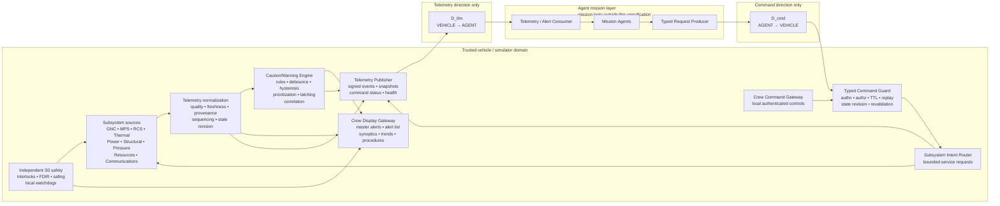
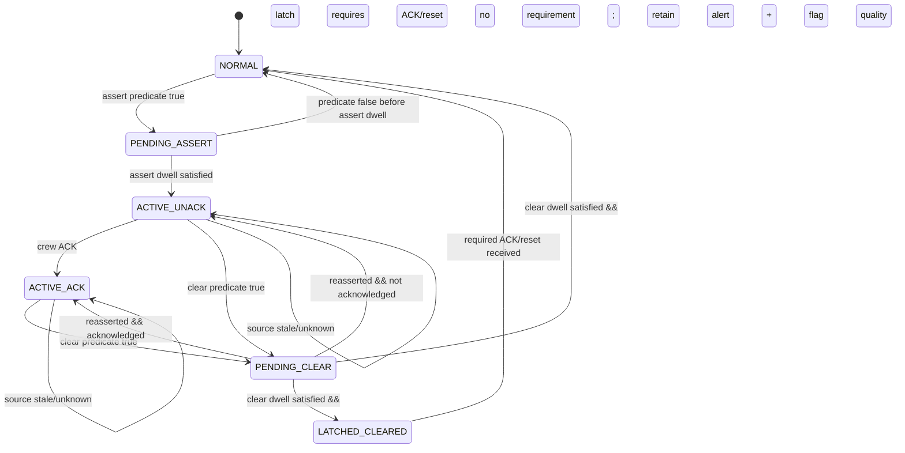

# Crew Interface and Caution/Warning Diode Specification for Executable Telemetry and Decision Outputs

## Executive summary

This report defines an implementation-ready interface between **crew displays, the caution/warning subsystem (CWS), subsystem telemetry, and an external agent mission layer**. It deliberately excludes mission planning, trajectory selection, resource scheduling, and other mission logic: agents may consume the outputs and issue bounded requests, but the trusted vehicle side retains safety-critical detection, interlocks, safing, command validation, and actuator authority. That boundary is consistent with the supplied GNC, propulsion, RCS/ACS, thermal, structural/event, communications, avionics, and resource-accounting specifications. fileciteturn0file1 fileciteturn0file2 fileciteturn0file3 fileciteturn0file4 fileciteturn0file6 fileciteturn0file7 fileciteturn0file8

The recommended architecture has **three distinct authority planes**:

1. **Subsystem safety/control plane.** GNC, propulsion, RCS, thermal, power, pressure/structural monitoring, and other trusted subsystem services own fast control, fault containment, watchdogs, hard limits, and safing. CWS does not replace them.
2. **Crew interface/CWS plane.** A trusted CWS correlates authenticated telemetry and subsystem events into Emergency, Warning, Caution, and Advisory records, manages acknowledgement/suppression/inhibition/shelving, and drives crew displays and audio. It can recommend or request a predefined safe action, but it does not directly manipulate actuators.
3. **Mission-agent plane.** Agents receive a read-only telemetry/alert projection and can submit only typed, authenticated requests through the command boundary. Mission logic is outside this specification.

This preserves the supplied diode's strongest invariants: a closed command vocabulary; service-owned credentials and safety gates; published state that can never be written back as authority; declarative/idempotent requests; bounded history; and re-evaluation of authorization and safety when an action actually takes effect. fileciteturn0file0

For a production system claiming a physical **data-diode** property, one device cannot simultaneously carry commands in one direction and telemetry in the other: NIST defines a data diode as allowing data to travel only one direction. The production architecture therefore uses independent command and telemetry one-way crossings; a shared-filesystem implementation remains useful for simulation but should be characterized as a logical diode emulation. citeturn13search4 fileciteturn0file2 fileciteturn0file5

NASA-STD-3001 Volume 2, revised in July 2026, is the primary crew-interface basis. It requires consistent crew interfaces, visible stale/missing/unavailable-data indications, prioritized Emergency/Warning/Caution/Advisory alerting, dual visual/audio coding for Emergency/Warning/Caution, alert acknowledgement and management capabilities, manual audio silence, annunciator test, and a manual emergency-response path independent of the display. citeturn8search3turn11view0turn11view2turn11view3 FAA AC 25.1322-1 provides a complementary flightcrew-alerting basis: warning and caution functions requiring immediate awareness use at least two senses; time-critical warnings need condition-specific attention cues; reliability/integrity must be commensurate with the associated safety objective; and nuisance alerts are themselves a safety concern because they increase workload and erode trust. citeturn7view1turn7view2

The resulting implementation baseline is:

| Area | Specification decision |
|---|---|
| Safety boundary | CWS is not an actuator controller; trusted subsystem/S0 safety authority remains independent |
| Production diode | Separate `D_cmd` agent→vehicle and `D_tlm` vehicle→agent |
| Local crew interface | Trusted local interface; it does not depend on either external diode |
| Runtime semantic schema | Protocol Buffers |
| Human/test projection | JSON generated from the same semantic objects |
| Integrity | SHA-256 payload digest plus deployment-approved digital signature/MAC over exact transmitted bytes; transport CRC where useful |
| Command authentication | Per-principal cryptographic identity; trusted ingress guard assigns role/authority |
| Authorization | Closed command registry + role + current vehicle state + freshness + phase/capability gates + effect-time revalidation |
| Alert levels | `EMERGENCY`, `WARNING`, `CAUTION`, `ADVISORY` |
| Alert lifecycle | Debounced assertion → active/unacknowledged → acknowledged → clear/latch; suppress/inhibit/shelve are orthogonal controls |
| Physical telemetry | Defined and owned by existing subsystem dictionaries; CWS references point IDs rather than duplicating those definitions |
| New CWS telemetry | Alert records, active counts, annunciation state, inhibition state, watchdogs, display health, decision output, command result |
| Push telemetry | Periodic state + immediate event records |
| Pull telemetry | Typed snapshot request through command path; result returned through telemetry path |
| Buffering | Priority-partitioned bounded rings plus durable safety/command/audit journal |
| Loss semantics | Sequence gaps explicit; stale/unknown data never silently become “last known good” for safety decisions |
| Decision output | `ADVISORY_ONLY`, `CREW_ACTION_REQUIRED`, or `REQUEST_SAFE_ACTION`; never direct actuation |
| Mission logic | Explicitly excluded |

No vehicle-specific hazard thresholds, pressure/temperature limits, alert dwell periods, display topology, hardware, bus, or assurance level was supplied. Those values therefore remain configuration items. Numerical timings identified below as **reference profile** are software-integration targets, not flight-qualified requirements.

## Design basis and architecture

NASA-STD-3001 requires consistent appearance and operation and explicitly requires visible indication of stale, missing, unavailable, or unknown data. It also requires positive indication of crew-initiated control and places a 50 ms maximum display-system latency on information used in manual vehicle-control or monitoring of time-critical automated flight-control tasks. citeturn11view0turn11view1 Its Display Standard requires persistent key-information areas, directly usable information, visual distinction of operational-limit violations, indication that flight software accepted a command, identification of automation state and source of control, and a standardized alert display. citeturn12search0

ARINC 661 is appropriate as an **optional display-interface implementation boundary**, not as the alerting human-factors standard: the current ARINC 661 Part 1 defines logical interfaces between cockpit display systems and user applications and emphasizes their independence, while explicitly leaving graphical “look and feel” and human-factors issues outside its scope. citeturn10search0 Thus, an aircraft implementation can map the contracts below to ARINC 661 widgets/events; a spacecraft or simulator can use another renderer without changing the CWS semantics.

For assurance, ARP4754B provides the current system-development framework and explicitly points software to DO-178C, electronic hardware to DO-254, and safety assessment to ARP4761A. ARP4761A supplies the systematic safety-assessment process. FAA AC 20-115D recognizes DO-178C for airborne software, while AC 20-152A recognizes DO-254 for airborne electronic hardware. citeturn8search10turn8search16turn8search0turn8search5 Because neither a Functional Hazard Assessment nor system failure classifications were supplied, **this report does not assign DALs**; DAL allocation is a downstream output of the applicable system safety/development process, not something that should be guessed from the phrase “caution/warning.”

For a NASA implementation, NASA-STD-8739.8B is the active basis for systematic software assurance, software safety, and IV&V throughout the software lifecycle. Simulation-derived verification evidence should additionally be governed by NASA-STD-7009B, which requires credibility considerations and program-approved acceptance criteria for models and simulations. citeturn13search0turn13search1

### Architectural boundary



The crew interface is intentionally **not dependent on the external mission-agent path**. An external diode outage must not disable local alarm generation, local crew displays, manual emergency activation, or local subsystem protection. NASA explicitly requires manual emergency-response activation independent of the display function; the proposed architecture extends that separation to the external autonomy path. citeturn11view3

The CWS is a consumer of safety-relevant evidence, not an omniscient source of vehicle truth. A commanded valve position is not evidence that the valve moved; a software command state is not proof of a physical response; an estimated propellant quantity remains an estimate. That evidence/provenance rule is already embedded throughout the supplied propulsion, RCS, GNC, thermal, structural/event, and avionics specifications and is preserved here. fileciteturn0file1 fileciteturn0file2 fileciteturn0file4 fileciteturn0file6 fileciteturn0file7 fileciteturn0file8

### Trust and information classes

Every CWS input has one of the following semantics:

| Class | Meaning | CWS treatment |
|---|---|---|
| `MEASUREMENT` | Direct or processed physical measurement | May participate in a rule if quality/freshness requirements are met |
| `DISCRETE` | Switch, contact, BIT, position, relay or hardware indication | May corroborate a physical condition |
| `ESTIMATE` | State inferred from sensor/model data | Must retain uncertainty/provenance |
| `SERVICE_STATE` | Authoritative software/controller state | Authoritative only about that software state |
| `COMMAND` | Requested or internally commanded state | Never treated as proof of physical effect |
| `FEEDBACK` | Physical/electrical actuator consequence | Preferred evidence for command-response checks |
| `MODEL` | Predicted state | Rule must identify model/configuration revision |
| `EVENT` | Trusted subsystem conclusion | May directly assert a CWS rule if the source is authorized |

The historical Space Shuttle C&W experience provides a useful design warning: message floods and extraneous messages made malfunction diagnosis more difficult, motivating task-oriented presentation and emphasis on operationally useful/root-cause information. NASA's ISHM work similarly found that combinations of alarms can make diagnosis non-trivial and that automated diagnosis may have several plausible hypotheses rather than one certain root cause. citeturn9search1turn9search0 Therefore `root_cause_id` below is **optional evidence**, never a fabricated certainty.

## Diode interface specification

### Allowed flows and directions

A literal physical diode is one-way. Consequently, production use of an external closed-loop agent requires two independent one-way crossings. citeturn13search4 The supplied communications and avionics specifications already converged on this two-crossing architecture. fileciteturn0file2 fileciteturn0file5

| Surface | Direction | Allowed content | Explicitly prohibited |
|---|---|---|---|
| `D_tlm` | Trusted vehicle → agent | Telemetry frames, alert events, active-alert snapshots, command status, capabilities, inhibit/suppress audit, health, time status | Agent requests, acknowledgements, arbitrary executable content |
| `D_cmd` | Agent → trusted vehicle | Typed command/request objects, snapshot requests, telemetry-profile requests, mission-layer bounded subsystem requests | Telemetry return traffic, arbitrary paths/URLs/code/raw bus transactions |
| Crew HMI | Local trusted bidirectional | Crew controls, acknowledgements, silence, suppress/shelve/inhibit when authorized, normal vehicle requests | Direct writes to telemetry state or actuator feedback |
| S0 safety path | Local trusted | Independent interlocks, automatic safing, emergency response | External override or disable by agent/CWS |
| Diagnostic archive | Trusted local | Signed telemetry/events/command history | Authority input to control merely because a file was modified |

The original diode's “published state is a mirror, never an input” rule remains normative. fileciteturn0file0

**Push telemetry** is the normal mode: events are published immediately and state snapshots periodically. **Pull telemetry** is supported without reversing the telemetry diode: an agent sends a typed `SnapshotRequest` over `D_cmd`; the vehicle publishes the requested snapshot, if authorized, over `D_tlm`. Local crew software may query trusted services directly because that interface is not the external diode.

### Common message envelope

Every externally visible object uses these fields:

| Field | Type | Requirement |
|---|---|---|
| `schema_major` | `uint32` | Reject unsupported major version |
| `schema_minor` | `uint32` | Backward-compatible revision |
| `message_id` | 128-bit identifier | Unique per object |
| `message_type` | enum | Closed vocabulary |
| `source_id` | bounded string/enum | Trusted producing component |
| `boot_id` | 128-bit | New value after producer restart |
| `stream_id` | bounded string/enum | Sequence-counter scope |
| `stream_seq` | `uint64` | Strict monotonic increment within `(source, boot, stream)` |
| `source_time_ns` | `uint64` | Measurement/event occurrence time |
| `publish_time_ns` | `uint64` | Trusted publication time |
| `state_revision` | `uint64` | Coherent vehicle-state revision |
| `priority` | enum | `P0…P3` |
| `quality` | enum | `GOOD`, `DEGRADED`, `STALE`, `INVALID`, `UNKNOWN`, `TEST` |
| `config_hash` | `bytes[32]` | Configuration identity |
| `payload_type` | enum | Exact payload schema |
| `payload` | typed object | Telemetry/event/request/status body |

A restart changes `boot_id`; it does not pretend the old sequence stream continued. Sequence gaps are visible. Wall-clock synchronization may aid correlation, but monotonic source time is used for dwell timers and watchdogs so that a time-correlation adjustment cannot unexpectedly satisfy or cancel a warning.

### Authentication, integrity, and authorization

The external crossing uses a two-stage integrity scheme:

1. The semantic object is serialized once into `message_bytes`.
2. `payload_sha256 = SHA-256(message_bytes)`.
3. A `SignedBlob` contains `message_bytes`, digest, key identifier, algorithm identifier, and a deployment-approved signature or MAC.
4. The receiver verifies size limits, cryptographic integrity, source authorization, digest, schema, sequence/replay status, freshness, then parses the semantic message.
5. The exact received `message_bytes` are retained for audit; security does not depend on reserializing the Protocol Buffer into an identical byte order.

Transport-level CRC/FCS may additionally detect accidental line/storage corruption, but it does not replace cryptographic authentication.

The **sender does not self-assert its role**. `principal_id`, `authority_level`, and permitted verbs are derived by the trusted ingress guard from the verified credential/key identity and trusted policy. This prevents an agent from sending `role="S0"` in its own payload.

For a state-changing command, execution requires:

\[
Execute(c)=
Authentic(c)
\land AuthorizedPrincipal(c)
\land SchemaValid(c)
\land Fresh(c)
\land NonReplay(c)
\land StateCompatible(c)
\land CapabilityAvailable(c)
\land InterlocksOK(c)
\]

and those state/interlock terms are evaluated again at **effect time**, not only when the request enters the queue. This directly carries forward the supplied diode's re-dispatch/re-authorization rule. fileciteturn0file0

The security design is intentionally compatible with OT safety principles: NIST's current final SP 800-82 Rev. 3 emphasizes that cybersecurity for systems interacting with physical processes must account for performance, reliability, and safety rather than treating security as an isolated IT concern. citeturn14search0

### Reference timing and rates

The following are **reference implementation targets**, not derived vehicle requirements:

| Function | Reference profile | Requirement semantics |
|---|---:|---|
| CWS rule scheduler | 20 Hz base tick | Event-driven source alerts bypass wait for next tick |
| CWS Emergency/Warning ingest → local display | ≤100 ms p99 | Does not include upstream hazard-detection time |
| CWS Caution ingest → local display | ≤250 ms p99 | Proposed integration target |
| Advisory ingest → local display | ≤1 s p99 | Proposed integration target |
| Alert-list heartbeat | 2 Hz | Events remain immediate |
| CWS health/watchdog telemetry | 10 Hz local, 1–2 Hz outward | Local watchdog is authoritative |
| Normal HMI synoptic data | 5–10 Hz | Source data may be faster or slower |
| Crew-control immediate feedback | ≤100 ms target | Consistent with NASA's observation that about 0.1 s feels instantaneous; exact system maximum remains task-specific. citeturn11view1 |
| Piloting/time-critical flight-control display element | Sensor→display ≤50 ms where applicable | NASA-STD-3001 requirement. citeturn11view1 |
| Agent-facing state snapshot | 10 Hz default | Adjustable under operator bandwidth ceiling |
| Alert/event export | Immediate | No periodic batching requirement for P0/P1 |
| Engineering health | 1 Hz | Event immediately on state transition |

A CWS must **not compensate for a slow telemetry link by becoming the primary fast hazard detector**. If a failure can become hazardous in 20 ms, the relevant subsystem must detect/protect it locally at an appropriate rate and publish the resulting event to CWS; the crew display cannot be the protection loop. This is consistent with the separation already established in the supplied propulsion, RCS, GNC, and thermal specifications. fileciteturn0file4 fileciteturn0file6 fileciteturn0file7 fileciteturn0file8

### Buffering and loss handling

Buffers are priority-partitioned:

| Class | Content | Persistence | Overflow behavior |
|---|---|---|---|
| `P0` | Emergency/Warning events, S0 actions, command execution outcomes, security failures | Durable journal + reserved ring | Must not be silently discarded; if reserved capacity is endangered, reject/defer non-safety commands and raise storage/telemetry degradation |
| `P1` | Caution, important mode changes | Durable recent journal | Preserve until delivered/archived; shed P3 before P1 |
| `P2` | Advisory, health summaries | Bounded ring | May coalesce repeated unchanged state; sequence gap/count remains explicit |
| `P3` | Engineering/trend samples | Bounded ring | Oldest-data overwrite allowed according to configured retention |

Required capacity is computed rather than hard-coded:

\[
N_{records}\ge
\left\lceil R_{peak}\,T_{outage}\,B_{burst}\right\rceil
\]

where `R_peak` is peak publication rate, `T_outage` is the outage interval that must be tolerated, and `B_burst` is a validated burst factor. The supplied event/telemetry specifications recommend bounded historical telemetry rather than a single latest snapshot; this report retains a **10-minute integration baseline** for the fast agent-facing ring, while final flight retention is a mission allocation. fileciteturn0file1

Loss is never disguised:

- a `stream_seq` jump sets `DATA_GAP`;
- duplicated sequence/message IDs do not duplicate an effect;
- stale data are visually marked;
- stale/invalid input cannot clear an active safety-relevant alert unless the specific certified rule explicitly defines that behavior;
- no safety authorization is satisfied by “last known good” data after its maximum age;
- after restart, a new `boot_id` prevents sequence-reset ambiguity;
- an irreversible command with an ambiguous effect returns `INDETERMINATE` and is **not automatically retried**.

## Telemetry and crew display contract

The CWS does **not redefine every subsystem telemetry point**. GNC, propulsion, RCS, thermal, structural/pressure/events, avionics/instrumentation, communications, and consumables retain their existing authoritative dictionaries, including physical units, acquisition rates, valid engineering ranges, uncertainty, and failure semantics. The CWS refers to those values by stable `point_id`. fileciteturn0file1 fileciteturn0file2 fileciteturn0file3 fileciteturn0file4 fileciteturn0file5 fileciteturn0file6 fileciteturn0file7 fileciteturn0file8

This avoids a dangerous anti-pattern in which the CWS silently changes a propulsion pressure range, GNC sample rate, or thermal unit merely for display convenience.

### New CWS and crew-interface telemetry signals

| Signal | Type | Unit | Nominal outward rate | Valid range/domain | Principal failure modes |
|---|---|---:|---:|---|---|
| `cws.alert.event` | structured event | — | event-driven | Schema-valid `AlertEvent` | Missing/duplicate event, invalid priority, bad source evidence |
| `cws.active_count` | `uint16[4]` | count | event + 2 Hz | 0…65535 each; E/W/C/A order fixed | Count disagrees with active table |
| `cws.unacknowledged_count` | `uint16` | count | event + 2 Hz | 0…65535 | Count/table mismatch |
| `cws.highest_active_priority` | enum | — | event + 2 Hz | NONE/E/W/C/A | Incorrect priority arbitration |
| `cws.audio_state` | enum | — | event + 2 Hz | SILENT/PREALERT/FULL/SILENCED/FAILED | Audio generator failure, arbitration fault |
| `cws.audio_alert_id` | 128-bit ID | — | event | Active alert or zero | References nonexistent/cleared alert |
| `cws.inhibited_count` | `uint16` | count | event + 1 Hz | 0…65535 | Inhibit audit stale |
| `cws.shelved_count` | `uint16` | count | event + 1 Hz | 0…65535 | Shelf timer failure |
| `cws.suppressed_count` | `uint16` | count | event + 1 Hz | 0…65535 | Suppression state inconsistent |
| `cws.logic_health` | enum | — | event + 1 Hz | OK/DEGRADED/FAILED/STARTING | Task failure, ruleset invalid, corruption |
| `cws.watchdog_age_ms` | `uint32` | ms | 10 Hz local; 1 Hz export | 0…watchdog timeout | Scheduler stall, clock failure |
| `cws.ruleset_revision` | `uint64` | — | on change + 0.2 Hz | Monotonic | Unknown/unauthorized ruleset |
| `cws.ruleset_hash` | `bytes[32]` | — | on change | SHA-256 value | Hash mismatch |
| `cws.decision_output` | structured event | — | event-driven | Closed `DecisionOutput` enum | Missing rationale/evidence, invalid target |
| `crew.display.<id>.health` | enum | — | event + 1 Hz | OK/DEGRADED/FAILED/TEST | Render process failure, display loss |
| `crew.display.<id>.render_latency_ms` | `float32` | ms | 2 Hz | ≥0; upper limit task-configured | Excessive/jittering latency |
| `crew.display.<id>.last_frame_age_ms` | `uint32` | ms | 2 Hz | ≥0 | Frozen display, publisher stall |
| `crew.input.last_action_status` | enum | — | event | ACCEPTED/REJECTED/PENDING/FAILED | Lost input, duplicate input |
| `crew.authority.source` | enum | — | on change + 1 Hz | CREW_MANUAL/CREW_SW/AUTONOMY/REMOTE/S0 | Source-of-control ambiguity |
| `cmd.status` | structured event | — | event-driven | Command lifecycle enum | Lost result, duplicate result, indeterminate effect |
| `security.guard_health` | enum | — | event + 1 Hz | OK/DEGRADED/FAILED | Auth verifier unavailable, replay ledger fault |
| `security.reject_count` | `uint64` | count | event + 1 Hz | ≥0 | Counter rollback |
| `time.quality` | enum | — | event + 1 Hz | SYNC/HOLDOVER/UNSYNC/INVALID | Clock source loss |
| `telemetry.gap_count` | `uint64` | count | event + 1 Hz | ≥0 | Hidden stream loss |
| `telemetry.max_source_age_ms` | `uint32` | ms | 2 Hz | ≥0 | One or more CWS inputs stale |

NASA-STD-3001 explicitly requires a visual indication for stale/missing/unavailable/unknown information; therefore quality is not merely diagnostic metadata—it is a display input. citeturn11view0turn12search0

### Alert record

Every event presented to a crew member contains at least:

| Field | Meaning |
|---|---|
| `alert_id` | Unique occurrence identifier |
| `rule_id`, `rule_revision`, `rule_hash` | Exact executable detector provenance |
| `priority` | Emergency, Warning, Caution, Advisory |
| `subpriority` | Deterministic ordering inside priority |
| `name` | Short standardized operational name |
| `system_id`, `element_id` | Responsible system/element |
| `occurred_time_ns` | First evidence-supported occurrence |
| `detected_time_ns` | CWS assertion time |
| `last_transition_time_ns` | Latest state-machine transition |
| `state` | Current lifecycle state |
| `acknowledged` | Crew-acknowledgement state |
| `suppressed` | Attention cues suppressed |
| `inhibited` | Rule out of service |
| `shelved_until_ns` | Temporary rule-disable expiry |
| `latch_policy` | NONE/CLEAR_ONLY/ACK_AND_CLEAR/MANUAL_RESET |
| `source_point_ids[]` | Telemetry/evidence inputs |
| `source_state_revision` | State snapshot used |
| `data_quality` | Worst applicable evidence quality |
| `root_cause_id` | Optional diagnosed root cause |
| `correlated_alert_ids[]` | Correlated events, not automatically causal |
| `procedure_id` | Associated malfunction procedure where applicable |
| `response_time_budget_ms` | Configuration-derived human-response budget |
| `decision_output` | Advisory/request classification |
| `explanation` | Bounded human-readable rationale |

NASA's current Display Standard requires an Alerts display to expose counts of active Emergency/Warning/Caution and unacknowledged events, and to show event priority, name/ID, timestamp, system/element, active state, annunciation state, acknowledgement, and root cause where available. It also calls for associated procedures for Emergency/Warning/Caution events. citeturn12search0

### Crew display mapping

NASA's spaceflight display standard associates Emergency and Warning with red symbology/text, Caution with yellow, and Advisory with blue; Emergency/Warning/Caution must not rely on color alone because the broader alert requirements call for distinct visual/audio annunciation. citeturn12search0turn11view2 FAA guidance likewise calls for at least two senses for warning/caution functions requiring immediate awareness. citeturn7view1

| Display element | Source signals | Update policy | Priority | Visual modality | Audio / haptic modality |
|---|---|---|---|---|---|
| **Persistent master alert strip** | `active_count`, `unacknowledged_count`, `highest_active_priority` | Event + 10 Hz redraw | E/W/C/A | E/W red; C yellow; A blue; text/icon/count always present | Highest applicable unacknowledged priority controls audio |
| **Master Emergency/Warning attention cue** | Highest active E/W | Immediate | E/W | Dedicated prominent symbol/text; flash per approved display standard | Distinct sound/voice; haptic optional |
| **Master Caution attention cue** | Highest active C | Immediate | C | Dedicated yellow cue | Distinct caution sound |
| **Alert queue** | `AlertEvent` table | Event + 10 Hz | All | Sorted priority→subpriority→time; active/unack first | None independently |
| **Alert-detail pane** | Selected `AlertEvent`, evidence references | On selection + source update | Selected alert | Condition, source quality, timestamps, rationale, root cause if available | Optional replay/test only |
| **Procedure access** | `procedure_id` | On alert/change | E/W/C | Direct link to approved malfunction procedure | None |
| **Subsystem synoptic** | Existing subsystem points + active-alert IDs | 5–10 Hz or inherited | Contextual | Affected component highlighted; quality/staleness encoded | Normally none |
| **Numeric parameter widget** | Source point + limits + quality | Inherited, max 10–20 Hz display | Contextual | Value, unit, limit markers, stale flag, C/W excursion indicator | None unless tied to alert |
| **Trend view** | Historical source data | 2–10 Hz display | Contextual | Live/history visually distinct; limit lines and event markers | None |
| **Data-quality overlay** | `quality`, `source_age_ms`, gaps | Immediate on status change | P0/P1 where safety relevant | STALE/INVALID/UNKNOWN plainly indicated; never hidden behind last valid value | Optional warning for loss of critical data |
| **Suppression/inhibit banner** | inhibited/shelved/suppressed counts | Event + 1 Hz | P1 | Persistent status and drill-down list | Periodic reminder policy |
| **Automation/authority banner** | `crew.authority.source`, subsystem automation state | On change + 2 Hz | P1 | Source of control and auto/manual state explicit | Optional transition tone |
| **Command confirmation dialog** | Command capability + hazard metadata | On user action | Hazard-dependent | Two-step confirmation for critical/irreversible/destructive actions | Optional confirmation tone |
| **Command lifecycle panel** | `cmd.status` | Event | P1/P2 | RECEIVED/ACCEPTED/EXECUTING/SUCCEEDED/FAILED/INDETERMINATE | Audio only where operationally useful |
| **CWS/display health indicator** | `logic_health`, display health, watchdogs | Event + 1 Hz | P0/P1 | Independent, conspicuous degradation indication | Independent attention cue where feasible |
| **Annunciator test page/control** | Visual/audio self-test | Crew request | Maintenance/ops | Exercises display annunciators | Exercises audio annunciators |
| **Manual emergency control** | Independent hardware/local path | Direct | E | Fixed or independently implemented emergency control | Must not depend on GUI functionality |

NASA's display standard requires system/vehicle commands to be visually distinguishable from ordinary controls and to show that a command was accepted by flight software; it also requires indication of automation state and source of control. Critical or irreversible actions require protection/confirmation. citeturn12search0turn11view1

The design intentionally avoids flooding the primary alert queue with secondary symptoms. NASA Shuttle C&W upgrade work specifically identified extraneous-message clutter as an impediment to diagnosis and moved toward operationally useful/root-cause-oriented information. citeturn9search1 The full evidence graph remains available for drill-down; it is the attention surface, not the evidence archive, that is compressed.

## Caution/warning logic and decision authority

### Alert classification

The four-class NASA spaceflight model is adopted directly. citeturn11view2turn12search0 **Exact timing thresholds are configuration-derived from hazard/task analysis**, not inferred here.

| Level | Implementation meaning | Expected CWS output |
|---|---|---|
| `EMERGENCY` | Highest-priority condition requiring immediate awareness/action or activation of an emergency response | Persistent highest-priority visual/audio cue, procedure, direct emergency-response availability |
| `WARNING` | Safety-critical abnormal condition requiring prompt crew awareness/action | Dual-coded visual/audio alert; highest-priority arbitration below Emergency |
| `CAUTION` | Abnormal condition requiring crew awareness and timely action but with greater response margin | Dual-coded caution cue and procedure where applicable |
| `ADVISORY` | Situation-awareness information not requiring the same immediate attention cues | Visual information; audio optional by approved configuration |

FAA AC 25.1322-1 independently supports the principle that alert urgency, prioritization, and presentation have to be consistent and that warning/caution functions requiring immediate awareness use multiple sensory cues. citeturn7view0turn7view1

### Alert lifecycle



**Entry/exit semantics**

| State | Entry actions | Exit condition/actions |
|---|---|---|
| `NORMAL` | No active alert; preserve prior history | Assertion predicate becomes true |
| `PENDING_ASSERT` | Start monotonic assert timer; capture evidence | Predicate clears → cancel; dwell completes → create immutable occurrence |
| `ACTIVE_UNACK` | Record event; drive visual/audio; add to unack queue; execute priority arbitration | ACK or valid clear transition |
| `ACTIVE_ACK` | Stop/modify attention cue per alert policy; keep active message and condition visible | Valid clear transition |
| `PENDING_CLEAR` | Start monotonic clear dwell; alert remains visible as active until successful completion | Reassert → active; dwell completion → normal or latched-cleared |
| `LATCHED_CLEARED` | Physical condition has cleared but alert remains recorded/present because latch requirement unsatisfied | Required ACK/reset |
| `NORMAL` after clear | Emit `CLEARED` transition with duration/evidence; retain history | New occurrence receives a new `alert_id` |

**Critical rule:** stale, missing, invalid, or unknown evidence does not silently satisfy a clear predicate. NASA requires those data conditions to be displayed explicitly; treating “sensor disappeared” as “hazard disappeared” would violate that information model. citeturn11view0

### Acknowledge, silence, suppress, shelve, and inhibit

These functions are deliberately distinct because NASA-STD-3001 distinguishes them. In particular, NASA defines suppression as temporarily preventing visual/auditory annunciation while text remains visible and the event remains logged; an inhibited out-of-service alert is no longer monitored for changes and requires controlled management, while shelving is temporary and automatically expires. NASA also requires an audit/report of inhibited alerts. citeturn11view3turn11view4

| Function | Detector running? | Event logged? | Text/status visible? | Audio/attention cue? | Return to service |
|---|---:|---:|---:|---:|---|
| `ACKNOWLEDGE` | Yes | Yes | Yes while active/latched | Stops or changes repeat annunciation per policy | N/A |
| `SILENCE_ALL_AUDIO` | Yes | Yes | Yes | Audio silenced; no change to logical alert | New alert/rearm policy is configuration-controlled |
| `SUPPRESS` | Yes | Yes | **Yes** | Visual attention cue/audio suppressed; text remains | Manual/condition-based according to approved policy |
| `SHELVE` | No CWS alert evaluation during shelf | Shelf action itself audited | Shelf state visible | None from shelved rule | **Automatic at expiry** |
| `INHIBIT` | No CWS alert evaluation | Inhibit action/status audited; CWS event not generated for the inhibited rule | Persistent inhibited-status audit | None | Manual re-enable by authorized crew/maintenance |

For engineering traceability, the underlying subsystem may still record raw sensor/event data while a CWS alert is inhibited; that diagnostic journal is separate from the CWS event stream and does not contradict the crew-alert inhibit semantics.

NASA requires a reduced initial auditory annunciation 10 dB below the final calibrated alert level to reduce startle, and provides auditory frequency and level requirements in its current human-spaceflight standard. citeturn11view2turn11view4 A NASA-human-spaceflight implementation should implement those requirements in the audio manager rather than embedding sound pressure assumptions in individual alert rules.

### Multiple-alert arbitration

The deterministic ordering key is:

```text
(priority DESC,
 subpriority DESC,
 unacknowledged before acknowledged,
 occurred_time ASC,
 alert_id ASC)
```

When several alerts occur together, all are recorded and made visible, but the audio manager gives the attention channel to the highest-priority unacknowledged alert. NASA specifically requires prioritization and says that when alerts trigger simultaneously the highest-priority alert is continuously annunciated until acknowledged, with subpriorities or combined speech as potential strategies. citeturn11view2 FAA guidance similarly calls for the most urgent alert to be presented first and warns that nuisance/false alerting can undermine correct response to a real alert. citeturn7view2

### Decision outputs

CWS output is intentionally weaker than actuation authority:

```text
NONE
ADVISORY_ONLY
CREW_ACTION_REQUIRED
REQUEST_SAFE_ACTION
```

`REQUEST_SAFE_ACTION` is an authenticated request to a separate trusted Safety/Command Executive; it does **not** bypass that executive's current interlocks. The receiving service can return `ACCEPTED`, `INHIBITED`, `REJECTED`, `EXECUTING`, `SUCCEEDED`, `FAILED`, or `INDETERMINATE`.

The external agent can use alert/decision records as mission-layer inputs, but **the alert record itself is not a permission token**. This maintains the prior subsystem rule that command acceptance is different from effect authorization. fileciteturn0file0 fileciteturn0file7 fileciteturn0file8

### Decision authority matrix

`S0` denotes independent trusted safety authority; it cannot be acquired by an agent.

| Function/action | Subsystem / S0 | CWS engine | Crew | Mission agent | Display renderer | Ground/maintenance |
|---|---|---|---|---|---|---|
| Measure physical parameter | **Authoritative source** | Read only | Read | Read projection | Read | Read |
| Declare source quality | **Yes** | May derive aggregate quality | No | No | No | Maintenance configuration only |
| Detect fast hazardous condition | **Yes** | Only if CWS timing is qualified for that rule | No | No | No | No |
| Assert crew alert | Source event or CWS rule | **Yes** | No | No | No | Test mode only |
| Assign alert priority | Configuration/safety analysis | Executes configured value | No | No | No | Controlled config process |
| Acknowledge crew alert | No | Records action | **Yes** | **No** crew acknowledgement | UI conduit only | Optional separate ground acknowledgement |
| Silence audio | No | Executes | **Yes** | No | UI conduit | Mission-specific |
| Suppress alert annunciation | No | Executes if authorized | **Yes** | Normally no | UI conduit | Maintenance/test if authorized |
| Shelve alert | No | Executes controlled timer | Authorized crew | No | No | Authorized maintenance |
| Inhibit OoSVC alert | No | Executes policy | Elevated crew authority | No | No | **Yes**, controlled maintenance |
| Disable subsystem safety interlock | **Only qualified local logic/maintenance policy** | **No** | No normal authority | **No** | No | Exceptional maintenance only |
| Manual emergency response | S0 executes | May display status | **Yes through independent path** | No | Must not be required | Mission-specific |
| Automatically safe subsystem | **Yes** | Request only unless the function is itself allocated/qualified as S0 | May request | May request bounded action | No | May request |
| Issue mission-level intent | Receives/revalidates | Advisory | According to role | **Yes, bounded vocabulary** | No | According to role |
| Send raw actuator command | Local controller only | No | Normally no | **No** | No | Test/maintenance profile only |
| Change hard alert threshold/safety limit | Controlled configuration authority | No run-time write | No | **No** | No | Controlled engineering process |
| Change display layout/look-and-feel | Controlled software/configuration process | No | User preference only where permitted | No | Executes approved definition | Maintenance/configuration |
| Override S0 rejection | **No external override** | No | No | No | No | Only through separately governed maintenance/configuration process |

NASA's Display Standard explicitly calls for source-of-control indication and for consequence information when operators attempt to override or shut down automation; this matrix turns that human-factors principle into an authorization boundary. citeturn12search0

## Executable artifacts and test vectors

### Protocol Buffer reference schema

The following is a minimal implementable schema. Projects should split it into version-controlled files and generate language bindings rather than hand-maintaining parallel structures.

```proto
syntax = "proto3";

package crewcw.v1;

enum Priority {
  PRIORITY_UNSPECIFIED = 0;
  ADVISORY = 1;
  CAUTION = 2;
  WARNING = 3;
  EMERGENCY = 4;
}

enum Quality {
  QUALITY_UNSPECIFIED = 0;
  GOOD = 1;
  DEGRADED = 2;
  STALE = 3;
  INVALID = 4;
  UNKNOWN = 5;
  TEST = 6;
}

enum AlertState {
  ALERT_STATE_UNSPECIFIED = 0;
  NORMAL = 1;
  PENDING_ASSERT = 2;
  ACTIVE_UNACK = 3;
  ACTIVE_ACK = 4;
  PENDING_CLEAR = 5;
  LATCHED_CLEARED = 6;
}

enum DecisionKind {
  DECISION_NONE = 0;
  ADVISORY_ONLY = 1;
  CREW_ACTION_REQUIRED = 2;
  REQUEST_SAFE_ACTION = 3;
}

enum CommandState {
  COMMAND_STATE_UNSPECIFIED = 0;
  RECEIVED = 1;
  ACCEPTED = 2;
  REJECTED = 3;
  QUEUED = 4;
  REVALIDATING = 5;
  EXECUTING = 6;
  SUCCEEDED = 7;
  FAILED = 8;
  EXPIRED = 9;
  INHIBITED = 10;
  CANCELLED = 11;
  INDETERMINATE = 12;
}

message EvidenceRef {
  string source_id = 1;
  string point_id = 2;
  uint64 stream_seq = 3;
  uint64 source_time_ns = 4;
  uint64 state_revision = 5;
  Quality quality = 6;
}

message TelemetrySample {
  string point_id = 1;
  uint64 source_time_ns = 2;
  Quality quality = 3;
  string unit = 4;

  oneof value {
    double f64 = 10;
    sint64 i64 = 11;
    uint64 u64 = 12;
    bool boolean = 13;
    string text = 14;
    bytes raw = 15;
  }
}

message TelemetryFrame {
  repeated TelemetrySample samples = 1;
}

message DecisionOutput {
  DecisionKind kind = 1;
  string requested_verb = 2;       // empty unless REQUEST_SAFE_ACTION
  string target_id = 3;
  string rationale_code = 4;
  repeated EvidenceRef evidence = 5;
}

message AlertEvent {
  bytes alert_id = 1;              // exactly 16 bytes
  string rule_id = 2;
  uint64 rule_revision = 3;
  bytes rule_hash_sha256 = 4;      // exactly 32 bytes
  Priority priority = 5;
  uint32 subpriority = 6;

  string name = 7;
  string system_id = 8;
  string element_id = 9;

  uint64 occurred_time_ns = 10;
  uint64 detected_time_ns = 11;
  uint64 last_transition_time_ns = 12;

  AlertState state = 13;
  bool acknowledged = 14;
  bool suppressed = 15;
  bool inhibited = 16;
  uint64 shelved_until_ns = 17;

  string procedure_id = 18;
  string root_cause_id = 19;
  Quality evidence_quality = 20;
  repeated EvidenceRef evidence = 21;
  repeated bytes correlated_alert_ids = 22;
  DecisionOutput decision = 23;
  string explanation = 24;
}

message CommandRequest {
  bytes command_id = 1;            // exactly 16 bytes
  string verb = 2;
  bytes typed_args = 3;            // verb-specific protobuf payload
  uint64 issued_time_ns = 4;
  uint64 not_before_time_ns = 5;
  uint64 expires_time_ns = 6;
  uint64 base_state_revision = 7;
}

message CommandStatus {
  bytes command_id = 1;
  CommandState state = 2;
  string reason_code = 3;
  uint64 effective_time_ns = 4;
  uint64 resulting_state_revision = 5;
}

message DiodeMessage {
  uint32 schema_major = 1;
  uint32 schema_minor = 2;
  bytes message_id = 3;            // exactly 16 bytes
  string source_id = 4;
  bytes boot_id = 5;               // exactly 16 bytes
  string stream_id = 6;
  uint64 stream_seq = 7;
  uint64 source_time_ns = 8;
  uint64 publish_time_ns = 9;
  uint64 state_revision = 10;
  Priority priority = 11;
  Quality quality = 12;
  bytes config_hash_sha256 = 13;

  oneof body {
    TelemetryFrame telemetry = 20;
    AlertEvent alert = 21;
    DecisionOutput decision = 22;
    CommandRequest command_request = 23;
    CommandStatus command_status = 24;
  }
}

/*
 * Security wrapper.
 * Signature verification covers the exact message_bytes delivered,
 * not a reserialized DiodeMessage.
 */
message SignedBlob {
  bytes message_bytes = 1;
  bytes message_sha256 = 2;        // exactly 32 bytes
  string algorithm_id = 3;        // deployment-approved profile
  string key_id = 4;
  bytes signature_or_mac = 5;
}
```

### Executable rule representation

The CWS rule package is **configuration**, not agent-supplied executable code. It is versioned, signed, statically validated, bounded in expression complexity, and loaded only through the controlled configuration process.

This example is deliberately a synthetic integration-test channel; the numeric threshold is not a spacecraft recommendation.

```json
{
  "rule_schema": "crewcw.rule.v1",
  "rule_id": "TEST.THERMAL.HIGH",
  "revision": 7,
  "enabled": true,

  "source": {
    "point_id": "sim.test.temperature",
    "required_quality": ["GOOD", "DEGRADED"],
    "max_age_ms": 500
  },

  "assert": {
    "operator": ">=",
    "value": 310.0,
    "unit": "K",
    "dwell_ms": 1000
  },

  "clear": {
    "operator": "<=",
    "value": 308.0,
    "unit": "K",
    "dwell_ms": 3000
  },

  "priority": "CAUTION",
  "subpriority": 100,
  "latch": "ACK_AND_CLEAR",

  "annunciation": {
    "visual": true,
    "audio": true,
    "procedure_id": "TEST-PROC-001"
  },

  "inhibit_policy": "OUT_OF_SERVICE_ONLY",
  "suppress_policy": "CREW_ALLOWED",
  "shelve_max_ms": 600000,

  "decision": {
    "kind": "ADVISORY_ONLY"
  }
}
```

Static rule validation MUST reject at least:

- unknown point IDs;
- unit mismatch;
- `NaN`/Infinity;
- impossible enum values;
- clear/threshold relationships inconsistent with the configured hysteresis model;
- zero/negative or excessive dwell outside configured policy;
- missing freshness requirement on safety-relevant data;
- unavailable procedure references where one is required;
- `REQUEST_SAFE_ACTION` referring to a nonexistent or unauthorized closed-vocabulary service verb;
- circular rule dependencies;
- configuration hash/signature failure.

### State-machine pseudocode

```text
function evaluate(rule, sample, now):
    assert rule.configuration_is_verified

    if rule.inhibited:
        return                  // rule intentionally out of service

    if rule.shelved_until > now:
        return

    freshness = now - sample.source_time

    if sample.quality not in rule.required_quality
       or freshness > rule.max_age:
        mark_rule_input_unknown(rule)

        // Fail-safe principle:
        // bad/missing evidence never clears an already active safety alert.
        if rule.state in {ACTIVE_UNACK, ACTIVE_ACK,
                          PENDING_CLEAR, LATCHED_CLEARED}:
            retain_current_alert()
            publish_quality_degradation()
        return

    assert_true = eval_assert_predicate(rule, sample)
    clear_true  = eval_clear_predicate(rule, sample)

    switch rule.state:

      NORMAL:
        if assert_true:
            rule.assert_start = now
            transition(PENDING_ASSERT)

      PENDING_ASSERT:
        if not assert_true:
            transition(NORMAL)
        else if now - rule.assert_start >= rule.assert_dwell:
            alert = create_new_alert_occurrence(rule, sample)
            start_annunciation(alert)
            transition(ACTIVE_UNACK)

      ACTIVE_UNACK:
        if crew_ack_received(rule.alert_id):
            update_acknowledgement()
            modify_annunciation_after_ack()
            transition(ACTIVE_ACK)
        else if clear_true:
            rule.clear_start = now
            transition(PENDING_CLEAR)

      ACTIVE_ACK:
        if clear_true:
            rule.clear_start = now
            transition(PENDING_CLEAR)

      PENDING_CLEAR:
        if assert_true:
            if alert_is_acknowledged():
                transition(ACTIVE_ACK)
            else:
                transition(ACTIVE_UNACK)

        else if not clear_true:
            // hysteresis band: condition neither clearly asserted nor clear
            keep_pending()

        else if now - rule.clear_start >= rule.clear_dwell:
            if rule.requires_ack_or_manual_reset()
               and not reset_requirements_satisfied():
                transition(LATCHED_CLEARED)
            else:
                emit_cleared_event()
                transition(NORMAL)

      LATCHED_CLEARED:
        if reset_requirements_satisfied():
            emit_cleared_event()
            transition(NORMAL)
```

### Sample telemetry/alert message

The values below are test data, not a vehicle specification.

```json
{
  "schema_major": 1,
  "schema_minor": 0,
  "message_id": "2d6b8ae8-6031-40fd-986e-8a42e10a36d3",
  "source_id": "cws-primary",
  "boot_id": "9442e010-7df5-48c0-9462-d9d39d011552",
  "stream_id": "alerts",
  "stream_seq": 381,
  "source_time_ns": 1844200000000,
  "publish_time_ns": 1844200025000,
  "state_revision": 19042,
  "priority": "CAUTION",
  "quality": "GOOD",
  "alert": {
    "alert_id": "84dd582b-0ec8-40cc-b96c-a8ffd70ca929",
    "rule_id": "TEST.THERMAL.HIGH",
    "rule_revision": 7,
    "priority": "CAUTION",
    "subpriority": 100,
    "name": "TEST TEMPERATURE HIGH",
    "system_id": "SIM_TEST",
    "element_id": "CHANNEL_A",
    "occurred_time_ns": 1844199000000,
    "detected_time_ns": 1844200000000,
    "state": "ACTIVE_UNACK",
    "acknowledged": false,
    "suppressed": false,
    "inhibited": false,
    "procedure_id": "TEST-PROC-001",
    "evidence_quality": "GOOD",
    "evidence": [
      {
        "source_id": "sim-test-source",
        "point_id": "sim.test.temperature",
        "stream_seq": 82110,
        "source_time_ns": 1844199990000,
        "state_revision": 19042,
        "quality": "GOOD"
      }
    ],
    "decision": {
      "kind": "ADVISORY_ONLY",
      "rationale_code": "TEST_THRESHOLD_DWELL"
    },
    "explanation": "Test channel exceeded configured assertion limit for the required dwell."
  }
}
```

### Verification test vectors

| Test | Stimulus | Expected state/output | Safety property demonstrated |
|---|---|---|---|
| `CW-ASSERT-01` | 309.9 K continuously | Remains `NORMAL` | No threshold false positive |
| `CW-ASSERT-02` | 310.1 K for 900 ms, then 309 K | `PENDING_ASSERT → NORMAL`; no alert occurrence | Assert debounce |
| `CW-ASSERT-03` | 310.1 K for ≥1,000 ms | `ACTIVE_UNACK`; one Caution event | Correct assertion |
| `CW-HYST-04` | Active alert then 309.0 K | Remains active/pending; not clear | Hysteresis prevents chatter |
| `CW-CLEAR-05` | Active alert then ≤308 K for ≥3 s | Clears if latch requirements satisfied | Clear dwell |
| `CW-LATCH-06` | Unack alert clears physically | `LATCHED_CLEARED`, not normal | Alert cannot disappear before required crew acknowledgement |
| `CW-ACK-07` | Crew ACK while condition remains active | `ACTIVE_ACK`; text remains; attention cue modified | ACK does not falsify condition |
| `CW-STALE-08` | Active alert; source becomes stale | Alert retained; quality set stale/unknown | Missing sensor cannot clear hazard |
| `CW-SUPPRESS-09` | Suppress an active alert | Text/event remains; audio/attention cue suppressed; event logged | Suppress ≠ inhibit |
| `CW-SHELF-10` | Shelf rule 60 s | No rule alert during shelf; automatically enabled at expiry; shelf audit present | Temporary disable is bounded |
| `CW-INHIBIT-11` | Authorized OoSVC inhibit | Rule stops monitoring/annunciation; inhibit audit persists | Controlled long-term inhibit |
| `CW-INHIBIT-12` | Mission agent attempts inhibit | Reject `NOT_AUTHORIZED` | Agent cannot remove crew protection |
| `CW-PRIORITY-13` | Caution and Warning assert together | Both listed; Warning controls master audio | Deterministic priority |
| `CW-FLOOD-14` | 100 related symptoms with one diagnosed root cause | Evidence retained; presentation groups/correlates according to configured policy | Avoid alert flooding without deleting evidence |
| `DIODE-SIG-15` | One payload byte altered | Signature/hash failure; message rejected before semantic execution | Integrity |
| `DIODE-REPLAY-16` | Valid prior command repeated | No repeated effect; status references original | Anti-replay/idempotency |
| `DIODE-TTL-17` | Correctly signed but expired request | `EXPIRED` | Authentication alone is insufficient |
| `DIODE-GAP-18` | Stream sequence jumps 44→47 | Gap counter increments; data-gap quality published | Loss is explicit |
| `DIODE-BOOT-19` | Producer restarts, seq resets to 0 | New `boot_id`; accepted as new stream, not replay | Restart disambiguation |
| `CMD-STATE-20` | Request based on stale `state_revision` | Reject/conflict or revalidate per verb policy | Optimistic concurrency |
| `CMD-EFFECT-21` | Accepted request; safety gate closes before execution | `INHIBITED`; no effect | Effect-time revalidation |
| `CMD-IRREV-22` | Irreversible effect occurs; result lost | `INDETERMINATE`; no automatic retry | Prevent duplicate irreversible action |
| `BUF-P0-23` | Engineering telemetry saturates buffer | Shed/coalesce P3; P0/P1 unaffected | Priority isolation |
| `BUF-P0-24` | P0 journal approaches exhaustion | Generate storage degradation; reject/defer non-safety work | Alert history protected |
| `WD-CWS-25` | Stop CWS scheduler | Independent watchdog declares CWS failure; S0 remains operational | CWS failure cannot defeat local protection |
| `WD-DISP-26` | Freeze primary crew display | Display-health failure; alternate/fixed emergency path remains usable | Display-independent emergency response |
| `AUTH-ROLE-27` | Agent puts `authority=S0` in payload | Ignored/rejected; trusted guard assigns actual role | Sender cannot self-escalate |
| `AUDIO-28` | Crew executes silence-all | Active alerts remain visible/logged | Audio control not alert clearing |
| `SELFTEST-29` | Crew requests annunciator test | Visual and auditory path exercised with TEST-tagged events; no real subsystem effect | Annunciator verification |

## Safety, verification, and prior-spec changes

### Fail-safe implementation requirements

FAA alerting guidance specifically calls for alert-system reliability and integrity commensurate with the associated safety objectives, and for analysis of alert-function failure in combination with the underlying system condition. It also cautions that common/cascading failures and misleading alerts must be considered. citeturn7view2 The implementation therefore needs explicit failure containment rather than treating CWS as ordinary GUI software.

| Failure or threat | Required behavior |
|---|---|
| Invalid signature/MAC | Reject before semantic execution; security audit event |
| Digest mismatch | Reject; do not attempt repair |
| Unknown schema major | Reject closed |
| Unknown command | Reject closed |
| Unknown alert priority/state in required field | Reject/mark producer faulty |
| Oversized message | Reject before unbounded allocation |
| NaN/Infinity where not explicitly allowed | Reject point/rule input |
| Stale safety input | Mark unknown/stale; cannot satisfy safety-enable or alert-clear predicate |
| Sequence rollback | Treat as replay unless accompanied by new authenticated `boot_id` |
| Duplicate command ID | Return/query prior state; never re-effect |
| Auth service unavailable | Fail closed for state-changing requests; local S0 continues |
| CWS task failure | Independent watchdog annunciates degraded/failed CWS; local S0 remains active |
| Display compositor failure | Alternate display/fixed annunciation where allocated; manual emergency control remains independent |
| Audio subsystem failure | Visual alert remains; explicit audio-system failure indication |
| Telemetry diode loss | Local crew/CWS unaffected; agents treat data as stale and stop decisions requiring freshness |
| Command diode loss | Local control/CWS unaffected; agent requests unavailable |
| Agent crash/restart | No change to trusted vehicle state merely because an agent restarted |
| CWS restart | Reconstruct active alert state from trusted inputs/journal; new `boot_id`; do not duplicate occurrence IDs |
| Buffer exhaustion | Shed lower-priority telemetry first; never silently erase active P0 conditions |
| Clock synchronization loss | Monotonic timers continue; synchronized timestamp quality marked degraded |
| Configuration corruption | Reject ruleset; remain on last verified ruleset or enter explicitly defined degraded safe configuration |
| Conflicting rules | Deterministic priority; configuration verification blocks illegal action conflicts |
| Root-cause uncertainty | Present hypotheses/correlation, not invented certainty |
| Nuisance-alert storm | Group/correlate according to validated configuration without suppressing independent safety-significant conditions |

The watchdog chain should be independent enough that the failed component is not solely responsible for reporting its own death:

```text
CWS scheduler heartbeat
        ↓
independent application supervisor
        ↓
display-health / CWS-failure annunciator
        ↓
crew

Display compositor heartbeat
        ↓
display manager / alternate indicator

External telemetry publisher heartbeat
        ↓
diode health record
        ↓
agent
```

No CWS watchdog may disable a subsystem's independent S0 protection.

### Verification and validation strategy

**System safety and allocation.** Perform functional hazard/safety assessment before finalizing alert criticality, timing budgets, independence requirements, and software/hardware assurance levels. ARP4761A supplies the systematic safety-assessment process, while ARP4754B covers system development, requirements validation, and design verification and points to DO-178C and DO-254 for implementation assurance. citeturn8search16turn8search10

**Software.** Where a civil-airborne certification basis applies, apply DO-178C through the recognized AC 20-115D means appropriate to the DAL established by system safety assessment; do not invent a DAL from this interface specification. citeturn8search0 For a NASA program, apply NASA-STD-8739.8B software assurance/software safety/IV&V requirements throughout the lifecycle. citeturn13search0

**Hardware.** If alert generation, data-diode enforcement, display processing, watchdogs, or cryptographic/security functions are implemented in custom airborne electronic hardware and are within the certification scope, DO-254/ED-80 assurance is addressed through AC 20-152A. citeturn8search5

**Crew-interface validation.** NASA's current standard requires consistent crew interfaces, explicit stale-data indication, alert prioritization, acknowledgement/suppression/inhibit mechanisms, manual audio silence and annunciator testing; Appendix F further standardizes alert content and display behavior. citeturn11view0turn11view2turn11view3turn12search0 Human-in-the-loop tests should therefore cover alert detection time, comprehension, simultaneous alerts, workload, nuisance-alert exposure, procedure access, audio masking, startle, stale data, control-source ambiguity, and degraded display/audio modes. FAA guidance reinforces testing of nuisance-alert behavior because frequent false/nuisance alerts can reduce crew confidence and increase the chance of missing a real alert. citeturn7view2

**Alert-content validation.** Use representative multi-failure and cascade scenarios, not merely one-alert-at-a-time tests. NASA's Shuttle/ISHM studies show why: combinations of symptoms can be difficult to diagnose, extraneous messages can clutter the display, and diagnosis may have several plausible hypotheses. citeturn9search0turn9search1

**Simulation credibility.** Hardware-in-the-loop, software-in-the-loop, Monte Carlo, and fault-injection evidence used to justify CWS thresholds or timing should have explicit model pedigree, verification, validation, uncertainty, and intended-use acceptance criteria. NASA-STD-7009B is the current NASA standard addressing M&S credibility for engineering use. citeturn13search1

The minimum verification matrix should include:

| Verification objective | Method | Acceptance criterion |
|---|---|---|
| Requirements traceability | Analysis/review | Every alert, display, authorization and loss-handling requirement maps to code/configuration and tests |
| Rule determinism | Unit/property test | Same ordered inputs + ruleset → identical semantic transition sequence |
| Threshold boundary behavior | Boundary-value tests | Correct at `threshold ± resolution` |
| Hysteresis/debounce | Temporal tests | No chatter or premature assertion/clear |
| Freshness enforcement | Fault injection | Stale/invalid inputs never satisfy prohibited transitions |
| Priority arbitration | Exhaustive state test | Stable deterministic ordering for all priority/subpriority combinations |
| ACK/suppress/inhibit/shelf semantics | State-machine coverage | No semantic crossover between controls |
| Watchdogs | Fault injection | Failure detected within configured watchdog budget |
| Restart recovery | Power-cycle/process kill | Active alerts/anti-replay state reconstruct safely |
| Diode directionality | Physical/logical penetration test | Prohibited reverse data path absent |
| Authentication | Negative/security test | Wrong key/identity rejected |
| Authorization | Role/state matrix test | Every forbidden role×verb combination rejected |
| Replay/duplicate handling | Security test | No duplicate effect |
| Buffer isolation | Stress test | P3 overload cannot starve P0/P1 |
| Timing | WCET/end-to-end instrumentation | All allocated deadlines met at worst-case load |
| Display latency | End-to-end measurement | Meets task-specific allocation; ≤50 ms where NASA piloting criterion applies. citeturn11view1 |
| Visual/audio independence | Failure injection | Required alert retains alternate modality on single-channel loss where safety allocation requires it |
| Manual emergency path | Physical/HIL test | Works with primary display/CWS GUI unavailable |
| Annunciator test | Crew/HIL test | Detectable failures in visual/audio paths are exposed |
| Root-cause grouping | Scenario/HIL test | Grouping reduces redundant presentation without concealing independent alerts |
| Model validity | V&V/credibility assessment | Simulator is credible for the exact test claim being made |

### Changes to the prior specifications

The following changes consolidate the uploaded subsystem specifications into one crew/CWS profile. They do **not** replace subsystem-specific physical limits or mission logic.

| Prior-spec area | Change made here | Rationale |
|---|---|---|
| Original shared `/diode` volume fileciteturn0file0 | Production profile formalized as independent `D_cmd` and `D_tlm`; shared-volume mode retained only as logical/SIL emulation | Align the architecture with the literal one-way meaning of a data diode. citeturn13search4 |
| Communications dual-diode model fileciteturn0file5 | Adopted as the common external boundary | Prevent transport acknowledgements or telemetry from becoming reverse traffic on command crossing |
| Mixed prior Protobuf/CBOR recommendations fileciteturn0file1 fileciteturn0file3 fileciteturn0file5 | One semantic Protocol Buffer model is specified here; exact serialized bytes are signed; JSON is diagnostic only | Gives software/hardware teams one typed contract without making signature validity depend on reserialization |
| Existing subsystem telemetry dictionaries fileciteturn0file1 fileciteturn0file2 fileciteturn0file3 fileciteturn0file4 fileciteturn0file6 fileciteturn0file7 fileciteturn0file8 | Physical points remain authoritative in their source dictionary; CWS stores stable evidence references | Avoids inconsistent ranges, units, rates, or quality semantics |
| Prior event concepts fileciteturn0file1 | Added explicit crew-level E/W/C/A lifecycle with ACK, latch, suppression, shelving and inhibit overlays | Makes caution/warning behavior executable rather than descriptive |
| Existing service-owned safety floor fileciteturn0file0 | Made an explicit `S0` authority above CWS, crew software, and mission agents | An alerting-system failure cannot remove the last safety layer |
| Prior agent intent model for GNC/MPS/RCS/TCS fileciteturn0file4 fileciteturn0file6 fileciteturn0file7 fileciteturn0file8 | CWS `DecisionOutput` is advisory/request only; no raw actuation path added | Preserves subsystem control and FDIR boundaries |
| Prior bounded history recommendation fileciteturn0file1 | Added priority-partitioned CWS/event buffering and a durable P0 command/safety journal | Prevents high-volume engineering traffic from starving critical alert records |
| Prior effect-time revalidation fileciteturn0file0 | Explicitly applied to all CWS-generated or agent-generated state-changing requests | An alert or prior acceptance never becomes a permanent authorization |
| Prior quality/provenance fields | Added mandatory CWS treatment of stale/unknown data and a rule that invalid data cannot silently clear a safety alert | Implements current NASA crew-interface stale-data requirements. citeturn11view0 |
| Prior crew-interface treatment | Added standard alert strip/list/detail/procedure/trend/authority/inhibit display mapping, including NASA E/W red, C yellow, A blue semantics | Makes the telemetry-to-HMI mapping implementable. citeturn12search0 |
| Prior command lifecycle | Added crew-specific ACK/silence/suppress/shelve/inhibit authority separate from mission-agent command authority | Prevents an autonomous mission client from impersonating crew acknowledgement or removing crew alerts |
| Prior health/watchdogs | Added independent CWS, display, audio, guard, and telemetry-publisher watchdog semantics | Makes CWS/display failure itself detectable without depending exclusively on the failed GUI |
| Prior root-cause/event handling | Added optional root-cause/correlation fields while preserving raw evidence | Incorporates Shuttle/ISHM lessons about clutter and uncertain diagnosis without hiding evidence. citeturn9search0turn9search1 |
| Mission layer | **No mission logic added** | Agents remain responsible for mission-layer planning/decision logic exactly as requested; this specification ends at authenticated evidence, crew alerts, bounded decision outputs, and guarded service requests |