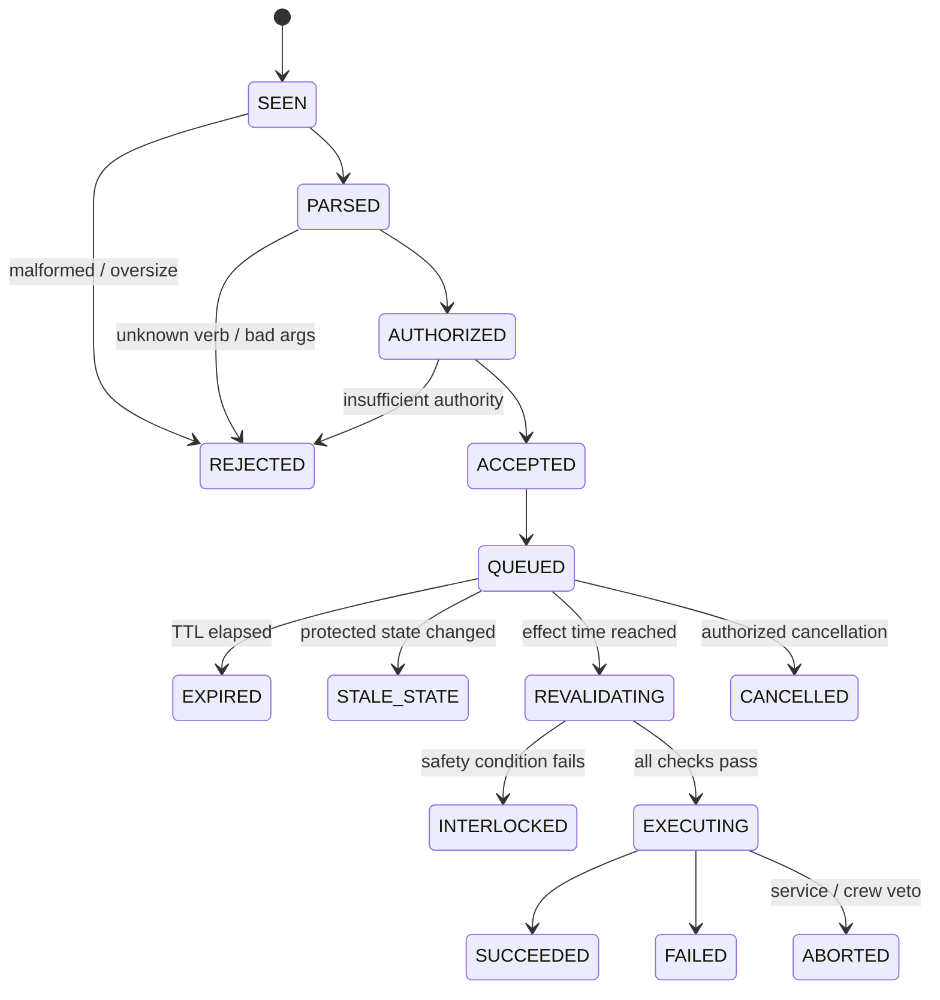
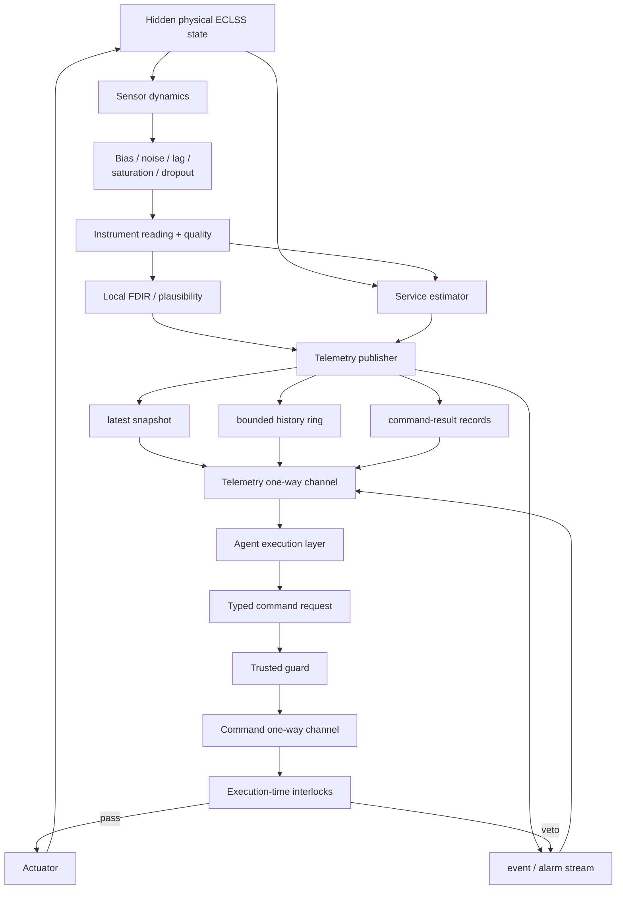

# Mapping ECLSS/Atmosphere to a Diode-Pattern Executable Telemetry and Decision Specification

## Executive summary

This report defines a reference specification for exposing a crewed-spacecraft Environmental Control and Life Support System (ECLSS), with emphasis on the atmosphere subsystem, to an agent-built mission execution layer without allowing the agents to become the authoritative safety controller. It extends the existing diode pattern from a generic closed-vocabulary service into an executable cyber-physical interface for atmosphere control: the trusted ECLSS service owns physical truth, process dynamics, hard limits, interlocks, fault state, actuator authority and the final actuation decision; agents receive telemetry and may submit bounded state-change requests. The existing diode principles—closed vocabulary, asymmetric reach, published state that is never an input, declarative/idempotent verbs, and revalidation at the moment of effect—remain the right foundation. fileciteturn0file0

The ECLSS domain is unusually important for this boundary because the atmosphere is not a set of independent gauges. NASA's current human-system standard treats pressure, humidity, temperature, ventilation, particulates, oxygen partial pressure, carbon-dioxide partial pressure and trace contaminants as an interdependent whole, and requires environmental data to support temporal trend analysis. citeturn12view0 ECSS likewise treats ECLSS as hardware **and software** performing environmental-control functions and requires project-specific specification of pressure, humidity, ventilation, ppO₂, ppCO₂, trace contaminants and related monitoring accuracy. citeturn15view0turn12view4turn12view5

The implementation recommended here has five architectural rules.

First, **fast life-protection is not delegated to agents**. Emergency pressure protection, unsafe oxygen-addition inhibits, pressure-change pause, actuator end stops, fire/toxic-event ventilation safing and other time-critical protections reside in hardware/local ECLSS control or the trusted ECLSS executor. ECSS expressly requires automated ECLSS safety functions because a degraded environment can itself make humans unable to perform the needed safety actions. citeturn19view2 NASA's current human-rating standard is explicitly concerned with system control, failure tolerance, crew survival and abort for human-rated systems. citeturn10view0

Second, a true hardware data diode is unidirectional. Therefore an external agent system that both receives ECLSS telemetry and requests ECLSS effects requires **two independently one-way channels in opposite directions**: an ECLSS→agent telemetry diode and an agent→ECLSS command diode. This is the same clarification reached in the prior EPDS specification. fileciteturn0file2 NIST defines a data diode as a device allowing data to travel only in one direction. citeturn9search0 In a software/simulation deployment, the existing shared-volume service pattern can emulate these two logical directions while retaining the stronger property that agents have no direct access to ECLSS internals. fileciteturn0file0

Third, **telemetry is evidence, not hidden physical truth**. The prior spacecraft specification's distinction between hidden truth, direct instrument observations and inferred/model-derived values should be retained. fileciteturn0file1 A biased ppCO₂ sensor, a saturated pressure transducer or a calculated scrubber-capacity estimate must not be indistinguishable from exact simulator state. Every telemetry datum therefore carries sample time, publication time, quality, provenance, engineering unit, configured range and direct-versus-estimated classification.

Fourth, the executable atmosphere specification should be **hardware-neutral**. The user has not specified vehicle hardware, mission duration or crew size. ECSS explicitly identifies mission duration, crew size, resupply and rescue feasibility as major drivers of ECLSS requirements and leaves many numerical ECLSS values project-specific. citeturn19view0 Consequently, this report fixes semantic interfaces and safety invariants but treats tank pressures, scrubber flows, bed differential pressures, oxygen-generation capacity, exact consumable quantities and actuator transit times as mission configuration. Numerical entries marked **REF** below are proposed implementation defaults, not universal NASA or ECSS requirements.

Fifth, the current NASA human-environment limits supersede the Apollo-like defaults used in the earlier simulation study when building a generic ECLSS interface. For indefinite crew exposure, NASA currently requires crew-exposed total pressure above 34.5 kPa and no more than 103 kPa, and limits the one-hour average ppCO₂ in habitable volume to 3 mmHg. citeturn18view1 The earlier 4.8–5.2 psia cabin-pressure nominal and 7.6 mmHg CO₂ caution examples were historically useful Apollo-style scenario values, but they must **not** become universal ECLSS control thresholds. fileciteturn0file1

The resulting control hierarchy is:

| Control layer | Responsibility | Typical response budget in this reference spec | Agent accessible? |
|---|---|---:|---|
| Physical/hardware protection | Relief devices, end stops, destructive-fault protection, independent emergency inhibits | Hardware dependent; fastest layer | No |
| Local ECLSS safety controller | Rapid depressurization detection, unsafe O₂-addition cutoff, commanded-pressure pause, immediate ventilation/fire safing | 20–250 ms software path **REF** | No direct command |
| Trusted ECLSS supervisor | Process sequencing, redundant-train selection, actuator validation, degraded/safe modes | 0.1–5 s | Requests only |
| Agent mission execution | Trend analysis, diagnosis, resource optimization, ordinary reconfiguration | seconds–minutes | Yes, policy bounded |
| Crew/ground authorization | Pressure-profile changes, hazardous venting, emergency trade decisions, interlock release | mission dependent | Via explicit authorization |
| Operator configuration | Limit profiles, authorization policy, immutable ceilings, keys | pre-mission/maintenance | Never agent-writable |

That hierarchy implements rather than merely documents the distinction between “agents may decide” and “agents may directly cause any state they can name.” It is also consistent with ISO's system-safety sequence of eliminating hazards where possible, minimizing them, applying controls and formally verifying the remaining controls. citeturn10view2

## Design basis, assumptions, and ECLSS decomposition

**Scope and assumptions.** This specification covers the habitable-atmosphere portion of ECLSS and the resources/process equipment directly needed to control it. Water processing, waste processing and full thermal-control-system design are outside the boundary except where they interface with oxygen generation or humidity removal. No specific spacecraft, hardware manufacturer, mission duration, cabin volume, crew size, gravity regime or atmosphere target has been assumed. Those omissions are deliberate: ECSS requires ECLSS requirements to be tailored by mission and identifies crew size, mission duration, resupply and rescue options as major design drivers. citeturn19view0

NASA's current ECLSS description groups operational functions around air revitalization, oxygen generation and water recovery; its air-revitalization description includes CO₂ removal and trace-contaminant removal, while oxygen production uses water electrolysis and can interface with CO₂ reduction through a Sabatier process. citeturn11search0 Historical ISS Node design documentation independently identifies ventilation, temperature/humidity control, atmosphere pressure control, CO₂ removal, trace-contaminant control, atmosphere monitoring and oxygen generation as distinct ECLSS functions. citeturn11search5

The reference decomposition for the agent-visible atmosphere service is therefore:

| Functional component | Required abstract elements | Primary controlled variable | Agent-visible health evidence | Principal actuator class |
|---|---|---|---|---|
| **Habitable atmosphere / compartments** | One or more isolatable gas volumes | Total P, ppO₂, ppCO₂, RH, T, contaminant concentration | Independent atmosphere sensors, pressure trends, exchange state | Indirect through all below |
| **CO₂ removal** | At least one active removal train; optional redundant/regenerable trains; bypass/isolation | ppCO₂ | inlet/outlet CO₂ where available, process flow, ΔP, temperature, estimated capacity | Train valves, blower/fan, regeneration sequence |
| **O₂ supply/generation** | Stored O₂ and/or generation abstraction, regulator, isolation, metering/injection | ppO₂ / O₂ inventory | source availability, source pressure or production health, injection flow, ppO₂ | Source isolation, generator enable/rate, injection valve/regulator |
| **Diluent/pressure control** | Diluent source, pressure regulator, repress path, controlled vent, relief protection | Total pressure and gas composition | P, dP/dt, valve position, source state | Repress/isolation/equalization/vent valves |
| **Temperature/humidity control** | Condensing heat exchanger or equivalent, water separator/condensate path, thermal interface | RH, dew point, cabin T | inlet/outlet T, RH, dew point, condensate rate, separator state | Bypass/control valve, blower, separator/pump mode |
| **Trace contaminant control** | Sorbent and/or catalytic treatment train, isolation/bypass | Species concentrations / SMAC fractions | species analyzer, generic VOC monitor, process ΔP/T, estimated capacity | Train select, heater/regeneration where applicable |
| **Particulate/microbial filtration** | Particle filter/HEPA-class function as mission requires | Airborne particulate loading | particle concentration, filter ΔP, fan impact | Fan/duct configuration; filter replacement is maintenance |
| **Ventilation / mixing** | Fans/blowers, ducts, dampers, cross-compartment ventilation | Local circulation and atmosphere homogeneity | local velocity/flow, fan speed/current, thermal/CO₂ gradients | Fan enable/speed, dampers |
| **Fire/toxic-event atmospheric response** | Detection interface plus isolation/safing actions | Prevent contaminant propagation | smoke/combustion monitors, toxic sensors, compartment status | Fan shutdown, damper closure, isolation; suppression external to this command set |
| **Atmosphere monitoring** | Redundant P/O₂/CO₂/T/RH sensors plus mission contaminant sensors | Observability | raw/direct measurements and quality | No normal physical actuator |
| **Consumable/process-resource accounting** | O₂/diluent stocks, scrubber capacity, TCC capacity, water feed where relevant | Remaining support margin | measured inventories plus inferred time-to-limit | Normally indirect |

NASA research and ISS experience support treating these as coupled processes rather than separable appliances. For example, trace contaminants can be removed incidentally by humidity-control and CO₂-removal hardware, while CO₂ captured in a removal assembly can carry contaminants downstream into a Sabatier catalyst. citeturn11search10turn11search6 This coupling matters to the executable model: “CO₂ scrubber healthy” cannot be inferred merely because cabin ppCO₂ is currently low, and a trace-contaminant event can alter the future health of another ECLSS process.

The atmosphere service should expose four distinct forms of state:

| Kind | Meaning | Example | May agent treat as exact physical truth? |
|---|---|---|---|
| `DIRECT` | An instrument's reported measurement | cabin pressure sensor A = 70.24 kPa | No; it is exact only as an instrument report |
| `DISCRETE` | A sensed or latched equipment indication | vent valve limit switch = CLOSED | No; mechanical failure can disagree |
| `ESTIMATED` | Derived from observations/model | scrubber capacity remaining = 41% | No; uncertainty required |
| `SERVICE_STATE` | Authoritative trusted-controller state | command interlock `PRESSURE_TRANSITION_ACTIVE` | Yes for control semantics, not necessarily physical state |

The separation is essential for useful fault diagnosis. The existing Apollo-style simulation specification already established that direct observations can drift, saturate or fail while inferred quantities can be wrong without any sensor itself being failed. fileciteturn0file1 NASA-STD-3001 also specifically requires atmospheric monitoring data to support temporal trend analysis, because past trends are useful both for anticipation and troubleshooting. citeturn12view0

The standards baseline for this reference interface is:

| Source | Use in this specification |
|---|---|
| NASA-STD-3001 Vol. 2, current NASA web edition | Crew atmosphere limits, continuous atmospheric recording, alerting, local/remote control, ventilation and contaminant requirements. citeturn10view3turn18view0turn18view1turn18view4 |
| ECSS-E-ST-34C | ECLSS functional decomposition, project tailoring, monitoring, contingency response, automation and verification. citeturn10view4turn19view0turn19view2 |
| NASA-STD-8719.29 | Human-rating system-safety/control/failure-tolerance context. citeturn10view0 |
| NASA-STD-8739.8B | Software assurance, software safety and IV&V baseline for safety-relevant NASA software. citeturn10view1 |
| ISO 14620-1 Edition 3 process | Hazard identification, reduction, controls, verification and residual-risk acceptance. citeturn10view2 |
| CCSDS 133.0-B-2 and 355.0-B-2 | Optional mission packetization and authenticated space-link encapsulation; not required for the internal diode itself. citeturn9search6turn9search1 |
| Existing diode, capsule and EPDS specifications | Closed vocabulary, trusted-service authority, command lifecycle, history, typed commands, dual-diode correction and authority model. fileciteturn0file0 fileciteturn0file1 fileciteturn0file2 |

## Diode interfaces and executable data contracts

The implementation should distinguish the **logical diode pattern** used in the agent simulation from a **physical unidirectional boundary** used in a higher-assurance implementation. The file-based diode remains a valid isolation pattern for the simulator: agents have no ECLSS process, network or credential access and communicate only through a bounded request surface and published results. fileciteturn0file0 A true physical data diode, however, permits only one-way transfer, so closed-loop remote control necessarily uses two independent one-way paths. citeturn9search0

```mermaid
flowchart LR
    subgraph PLANT["Trusted ECLSS / atmosphere zone"]
        PHYS["Atmosphere physics / real plant"]
        LOCAL["Local safety + FDIR"]
        EXEC["Validated command executor"]
        PUB["Telemetry / event publisher"]
        CFG["Operator-owned limits,\nkeys and policy"]
        PHYS --> LOCAL
        LOCAL --> EXEC
        EXEC --> PHYS
        PHYS --> PUB
        LOCAL --> PUB
        CFG --> LOCAL
        CFG --> EXEC
    end

    subgraph BOUNDARY["Two independent one-way boundaries"]
        TTX["Telemetry TX only"] --> TRX["Telemetry RX only"]
        CRX["Command RX only"] <-- CTX["Command TX only"]
    end

    subgraph AGENT["Agent-built mission execution layer"]
        MIRROR["Read-only telemetry mirror"]
        EST["Agent estimators / diagnosis"]
        PLAN["Planning / coordination"]
        GUARD["Trusted request guard"]
        ALOG["Agent decision log"]
        MIRROR --> EST --> PLAN --> GUARD
        EST --> ALOG
        PLAN --> ALOG
    end

    PUB --> TTX
    TRX --> MIRROR
    GUARD --> CTX
    CRX --> EXEC
```

For the shared-filesystem simulation, those same directions map cleanly onto file ownership:

| Surface | Direction | Writer | Reader | Semantics |
|---|---|---|---|---|
| `/eclss/cmd/<principal>/request.json` | Agent → ECLSS | One agent/principal | Trusted guard | Typed command requests only |
| `/eclss/results/` | ECLSS → agent | Trusted service | Agents | Command lifecycle/result records |
| `/eclss/telemetry/latest.json` | ECLSS → agent | Trusted service | Agents | Latest coherent snapshot |
| `/eclss/telemetry/history/` | ECLSS → agent | Trusted service | Agents | Bounded multirate ring |
| `/eclss/events/` | ECLSS → agent | Trusted service | Agents | Alarms, transitions, fault/event evidence |
| `/eclss/capabilities.json` | ECLSS → agent | Trusted service | Agents | Available verbs, schemas, authority requirements |
| `/eclss/schema/` | ECLSS → agent | Trusted service | Agents | Versioned machine-readable schemas |
| Operator policy/configuration | Operator → service | Operator only | Service | Hard thresholds, maximum authority, keys, mission profiles |

A crucial change from the original `console.json` design is **per-principal ingress**, rather than multiple agents rewriting the same JSON command list. The earlier multi-agent spacecraft analysis identified a lost-update race in the shared single-file model and recommended one ingress surface per host, followed by service-side merging into one authoritative queue. fileciteturn0file1 The service, not agent-provided JSON, stamps the trustworthy `principal_id`, `ingress_sequence` and maximum authority.

The following flows are prohibited by construction:

| Prohibited flow | Enforcement |
|---|---|
| Agent writes a telemetry value and thereby changes plant state | Publisher files are never read as ECLSS inputs |
| Agent changes alarm or safety thresholds | Threshold/config volume not mounted into agent environment |
| Agent submits a URL, code fragment, script, expression or filesystem path for execution | Closed command registry and typed bounded arguments only |
| Agent names an arbitrary actuator address | Targets are enumerated component IDs |
| Agent overrides service-owned hard interlocks | No such command verb exists |
| Agent changes its own authority claim | Authority stamped by trusted guard from transport identity |
| Agent causes deferred command to retain old authorization | Full authorization and interlocks re-evaluated at effect time |
| Agent obtains keys or service credentials | Keys remain exclusively in trusted guard/executor |
| Hidden/undocumented verb performs a physical effect | Hidden verbs remain inert, preserving the original diode rule. fileciteturn0file0 |

The request format should move from free-form `"verb argument"` strings to a typed envelope. A human-readable file representation is:

```json
{
  "schema": "eclss.command-request.v1",
  "request_id": "host04-000184-01",
  "base_state_revision": 88213,
  "not_before_met_ms": 55182440,
  "expires_met_ms": 55187440,
  "verb": "set_ventilation",
  "target": "CABIN_A.FAN_2",
  "args": {
    "mode": "ON",
    "speed_pct": 65.0
  },
  "rationale_code": "CO2_MIXING_MARGIN"
}
```

The trusted guard converts that into an authoritative command record:

```json
{
  "schema": "eclss.command.v1",
  "ingress_sequence": 194284,
  "command_id": "7d7bc856-2df0-4be1-9d68-5b49227be36a",
  "request_id": "host04-000184-01",
  "principal_id": "host04",
  "authority_granted": "A1",
  "issued_met_ms": 55182445,
  "not_before_met_ms": 55182440,
  "expires_met_ms": 55187440,
  "base_state_revision": 88213,
  "verb": "SET_VENTILATION",
  "target_id": 417,
  "args": {
    "mode": "ON",
    "speed_permille": 650
  },
  "policy_revision": 37,
  "integrity": {
    "algorithm_profile": "MISSION_DEFINED",
    "authenticator": "..."
  }
}
```

The `principal_id`, authority, ingress sequence and policy revision are trusted fields because the guard creates them; copying an agent's claimed identity into those fields would defeat the provenance boundary.

The command lifecycle is normative:



`ACCEPTED` means *admissible to the queue*, never *guaranteed to actuate*. This preserves the strongest reusable feature of the original diode specification: authority and safety conditions are re-evaluated when the effect would occur. fileciteturn0file0

For physical one-way links, the command frame should contain at minimum:

| Field | Purpose |
|---|---|
| Protocol/schema version | Deterministic decoder selection |
| Payload length | Bounded parser |
| Monotonic ingress sequence | Loss/reorder/replay detection |
| 128-bit command ID | Deduplication/idempotency |
| Principal ID | Authenticated origin |
| Authority class | Maximum authorized effect |
| Issue, `not_before`, expiry time | Freshness and scheduling |
| Base state revision | Optimistic concurrency |
| Verb and enumerated target | Closed executable vocabulary |
| Bounded typed arguments | No code or expression injection |
| Policy revision | Traceability to active rules |
| CRC | Accidental transmission-corruption detection |
| Cryptographic authenticator | Origin/integrity/anti-forgery |

A one-way command channel cannot depend on challenge-response. Anti-replay therefore uses persistent sequence state, command-ID deduplication and expiry. Results travel back exclusively through the independent telemetry diode. CCSDS Space Data Link Security provides standardized data-link structures for authentication and/or confidentiality when a mission carries these records across CCSDS links; it need not be the native internal ECLSS encoding. citeturn9search1 CCSDS 133.0-B-2 remains the current listed Space Packet Protocol and may be used as the mission transport wrapper. citeturn9search6

For the local file implementation, cryptographic authentication is less important than **trustworthy transport provenance**: give each agent only its own writable ingress mount, have the service infer principal identity from that mount, and use OS/container isolation to prevent cross-principal writes. Hashes still provide audit integrity, and the external audit log should be hash-chained or otherwise tamper-evident. For a distributed or physical deployment, mission-approved message authentication should be mandatory.

Telemetry should use one semantic model irrespective of JSON, Protocol Buffers or CCSDS encapsulation:

```json
{
  "schema": "eclss.telemetry.v1",
  "telemetry_seq": 8472001,
  "state_revision": 88214,
  "frame_met_ms": 55182600,
  "compartment": "CABIN_A",
  "measurements": [
    {
      "point": "atm.pressure",
      "value": 70.42,
      "unit": "kPa_abs",
      "kind": "DIRECT",
      "sensor_id": "P-CAB-A-1",
      "quality": "GOOD",
      "sample_met_ms": 55182590,
      "publish_met_ms": 55182600,
      "resolution": 0.01,
      "uncertainty_1sigma": 0.10,
      "range": [0.0, 110.0]
    },
    {
      "point": "co2.scrubber_capacity_remaining",
      "value": 41.3,
      "unit": "percent",
      "kind": "ESTIMATED",
      "quality": "GOOD",
      "sample_met_ms": 55182000,
      "model_id": "SCRUBBER_EST_V4",
      "uncertainty_1sigma": 4.5
    }
  ]
}
```

The mandatory quality vocabulary is `GOOD`, `SUSPECT`, `STALE`, `SATURATED`, `OUT_OF_RANGE`, `INVALID` and `ESTIMATED`. `SIMULATED` may additionally be used during test injection. A silently biased sensor remains `GOOD` until the service has evidence sufficient to mark it suspect; otherwise the simulator would leak hidden fault truth.

The telemetry publication path is:



NASA's requirement to continuously record pressure, humidity, temperature, ppO₂ and ppCO₂ for each isolatable habitable compartment makes bounded history—not only `latest.json`—a requirement-level design concern rather than a convenience. citeturn12view2

## Telemetry model and sensor–actuator mapping

The telemetry catalogue below intentionally separates **standards-derived limits** from **reference implementation ranges**. NASA requires a one-hour average ppCO₂ no greater than 3 mmHg and indefinite crew-exposed total pressure above 34.5 kPa and at or below 103 kPa. citeturn18view1 It requires at least 30% diluent gas where the balance is oxygen and ties oxygen exposure to its inspired-oxygen profile rather than one universal ppO₂ number. citeturn18view0 NASA also requires continuous recording and local/remote display and alerting for pressure, humidity, temperature, ppO₂ and ppCO₂. citeturn12view2

**`REF` values are proposed defaults for this agent interface, not flight requirements.** The actual instrument range and accuracy belong in the mission's versioned point dictionary, consistent with ECSS's requirement that monitoring ranges and accuracies be specified for the project. citeturn12view4turn12view5

| Telemetry field | Unit | Reference measurement range | Nominal publication | Suggested reporting precision **REF** | Alarm / executable interpretation |
|---|---:|---:|---:|---:|---|
| `atm.pressure` | kPa abs | 0–110 **REF** | 5 Hz; 10 Hz transient | 0.01 kPa | Project nominal band; crew-exposure boundary >34.5 and ≤103 kPa. citeturn18view1 |
| `atm.pressure_rate` | kPa/s | −5 to +5 **REF** | 10 Hz | 0.01 | Rapid decompression/overpressure detector; project threshold required by ECSS. citeturn12view7 |
| `atm.o2_partial_pressure` | kPa | 0–60 **REF** | 2 Hz | 0.01 | Compare with mission's NASA-STD-3001 inspired-O₂ profile; no universal hard-coded generic target. citeturn18view0 |
| `atm.o2_fraction` | % vol | 0–100 | 1 Hz | 0.01% | Cross-check ppO₂/pressure; verify ≥30% diluent constraint where applicable. citeturn18view0 |
| `atm.co2_partial_pressure` | mmHg | 0–20 **REF** | 2 Hz | 0.01 mmHg | Calculate rolling 1-h average; violation at >3 mmHg one-hour average. citeturn18view1 |
| `atm.co2_1h_mean` | mmHg | 0–20 **REF** | 0.2 Hz | 0.01 | Standards-compliance channel; alert at >3 mmHg. citeturn18view1 |
| `atm.temperature` | °C | −20–60 **REF** | 1 Hz | 0.1°C | Mission health envelope; 20–25°C is NASA's cited nominal performance rationale, not universal emergency limits. citeturn12view1 |
| `atm.relative_humidity` | % RH | 0–100 | 0.5 Hz | 0.1% | Mission limits; 30–60% is NASA's nominal performance rationale. citeturn12view1 |
| `atm.dew_point` | °C | −40–40 **REF** | 0.5 Hz | 0.1°C | Condensation-margin protection; ECSS explicitly requires dew-point range and monitoring. citeturn12view4 |
| `atm.condensation_margin` | K | −20–50 **REF** | 0.5 Hz | 0.1 K | `min_surface_temp - dew_point`; advisory when approaching zero, mission margin configurable |
| `vent.local_velocity` | m/s | 0–1.0 **REF** | 1 Hz | 0.01 | Compare against location-specific profile; NASA cites historical effective occupied-space range ~0.076–0.610 m/s. citeturn12view3 |
| `vent.exchange_flow` | L/s | project configured | 1 Hz | configuration | Compartment mixing/exchange requirement |
| `vent.fan_speed` | % rated | 0–120 **REF** | 2 Hz | 0.1% | Command/readback mismatch |
| `vent.fan_current` | A | hardware configured | 2 Hz | sensor configured | High current + low speed/flow indicates stall/obstruction |
| `co2.process_flow` | L/s | hardware configured | 1 Hz | sensor configured | Active scrubber commanded with inadequate flow |
| `co2.inlet_ppco2` | mmHg | 0–20 **REF** | 1 Hz | 0.01 | Diagnostic |
| `co2.outlet_ppco2` | mmHg | 0–20 **REF** | 1 Hz | 0.01 | Removal-performance evidence |
| `co2.bed_dp` | Pa | sensor configured | 1 Hz | ≤1% FS **REF** | Rising ΔP suggests blockage/loading |
| `co2.bed_temperature` | °C | technology configured | 1 Hz | 0.1°C | Regeneration/process-envelope check |
| `co2.capacity_remaining` | % | 0–100 | 0.1 Hz | 0.1% | `ESTIMATED`; use uncertainty and predicted breakthrough |
| `co2.time_to_limit` | s | ≥0 | 0.1 Hz | 1 s | `ESTIMATED`; planning input, not hard protection |
| `o2.source_pressure` | kPa abs | hardware configured | 1 Hz | sensor configured | No universal range because source technology is unspecified |
| `o2.generation_rate` | g/s | project configured | 1 Hz | 0.001 g/s **REF** | Compare with command and metabolic/resource balance |
| `o2.injection_flow` | g/s | project configured | 2 Hz | 0.001 g/s **REF** | Stuck valve/regulator detection |
| `o2.inventory` | kg or mol | mission configured | 0.2 Hz | mission configured | Direct or estimated; tag provenance |
| `o2.time_to_reserve` | s | ≥0 | 0.1 Hz | 10 s | `ESTIMATED`; mission reserve policy |
| `pressure.repress_flow` | g/s | hardware configured | 2 Hz | sensor configured | Cross-check pressure rate |
| `pressure.vent_flow` | g/s | hardware configured | 2 Hz | sensor configured | Uncommanded loss / vent verification |
| `humidity.condensate_rate` | g/s | hardware configured | 0.5 Hz | sensor configured | Humidity-control and blockage evidence |
| `humidity.separator_state` | enum | OFF/STARTING/RUN/FAULT | event + 1 Hz | exact | Equipment state |
| `tcc.species.<id>` | mg/m³ or ppm | species configured | analyzer-dependent, typically 0.1–1 Hz **REF** | analyzer configured | Compare with duration-dependent SMAC profile. citeturn18view6 |
| `tcc.species.<id>.smac_ratio` | dimensionless | 0–>1 | 0.1 Hz | 0.001 | `concentration / applicable_SM​​AC`; approaching-limit alert required conceptually by NASA. citeturn18view5 |
| `tcc.max_smac_ratio` | dimensionless | 0–>1 | 0.1 Hz | 0.001 | Worst currently monitored contaminant |
| `tcc.process_dp` | Pa | hardware configured | 0.5 Hz | ≤1% FS **REF** | Blockage/sorbent loading |
| `particulate.total` | mg/m³ | 0–10 **REF** | 0.1 Hz | 0.01 | NASA limit <3 mg/m³ for ordinary total dust. citeturn18view6 |
| `particulate.respirable_lt_2_5um` | mg/m³ | 0–5 **REF** | 0.1 Hz | 0.01 | NASA limit <1 mg/m³ for cited respirable fraction. citeturn18view6 |
| `filter.delta_pressure` | Pa | hardware configured | 0.2 Hz | sensor configured | Filter-loading diagnostic |
| `fire.combustion_monitor.<species>` | mission units | NASA/project profile | instrument-specific | profile-specific | Real-time fire/toxic monitoring required by NASA. citeturn18view5 |
| `atm.leak_rate_estimate` | Pa/s or g/s | project configured | 1 Hz | model configured | `ESTIMATED`; use independent P/dP/dt evidence |
| `sensor.<id>.age` | ms | 0–∞ | every frame | 1 ms | Drives `STALE` quality |
| `sensor.<id>.quality` | enum | defined vocabulary | every frame | exact | Never infer from value alone |
| `actuator.<id>.commanded_state` | enum | actuator-specific | event + 1 Hz | exact | Trusted command state |
| `actuator.<id>.sensed_state` | enum | actuator-specific | event + 1 Hz | exact | Physical/readback evidence |
| `alarm.active[]` | enum records | n/a | event-driven | exact | Separate alarm from diagnosis |

The atmosphere trend engine should retain raw samples long enough to support the time windows used by limits. A one-hour CO₂ limit, for example, requires at least one hour of ppCO₂ data at sufficient quality, and a data gap must produce `INCOMPLETE_WINDOW` rather than silently calculating a compliant average. NASA explicitly frames the CO₂ requirement as an **average one-hour** limit, not an instantaneous 3 mmHg trip point. citeturn18view1

A useful multiresolution retention profile is: ten minutes of high-rate pressure/valve/ventilation data, at least two hours of 1–2 Hz core atmosphere data, one mission phase of downsampled engineering data, and a complete externally retained event/command audit. Those retention durations are reference engineering choices; the underlying requirement is that the data support temporal trend analysis and continuous atmospheric recording. citeturn12view0turn12view2

**Sensor-to-actuator relationships** must be represented explicitly so an agent can reason about expected causal effects instead of treating commands as magic.

| Controlled effect | Primary sensors | Corroborating evidence | Permitted actuators | Important cross-couplings |
|---|---|---|---|---|
| Lower ppCO₂ | ppCO₂ cabin; inlet/outlet CO₂ | process flow, bed ΔP/T, ventilation | scrubber train select, blower, bypass/isolation, regeneration | Power, heat, contaminant carry-through, ventilation |
| Raise ppO₂ | ppO₂, total P, O₂ fraction | injection flow, source state, O₂ inventory | generator rate, source select, O₂ injection | Fire risk, total P, water feed, power |
| Lower ppO₂ | ppO₂, total P, fraction | composition model | normally dilution/controlled atmosphere procedure; **not** arbitrary venting | Pressure, DCS, fire profile |
| Restore pressure | P, dP/dt | repress flow, source pressure, leak estimate | repress/isolation/equalization valves | ppO₂, diluent fraction, DCS |
| Reduce pressure | P, dP/dt | vent flow/readback | controlled vent valve | Crew physiology, consumables, external contamination |
| Lower humidity | RH, dew point | condensate rate, HX T, separator state | humidity train, coolant/bypass, fan | Cabin temperature, water recovery |
| Increase/decrease cabin T | cabin T, RH | coolant temperatures/heat load | thermal interface valve/mode, air flow | RH, condensation, power |
| Increase mixing | local velocity, spatial ppCO₂/T gradients | fan rpm/current | fan speed, damper | Acoustic/power/thermal; can spread toxic material |
| Reduce VOC/trace contaminants | species concentrations/SMAC ratios | process ΔP/T and capacity estimate | TCC train/bypass/regeneration | Humidity affects adsorption; contaminants may poison downstream catalysts. citeturn11search6turn11search16 |
| Reduce particles | particle monitor | filter ΔP | fan/duct path; filter maintenance | More flow improves removal but raises ΔP/power |
| Contain toxic/fire release | smoke/combustion/toxic sensors | compartment sensors | fan shutdown, dampers, compartment isolation | Deliberately conflicts with normal “maximize ventilation” policy; NASA notes ventilation may need shutdown during fire/toxic releases. citeturn12view3 |

A key implementation principle follows from the last row: **decision rules must be mode-aware**. The nominal rule “low ventilation → increase fan flow” becomes actively dangerous during some toxic-release or fire conditions because it can distribute contaminants. NASA explicitly notes that ventilation may need to be shut down under those conditions. citeturn12view3

NASA requires gaseous pollutants to remain below duration-dependent Spacecraft Maximum Allowable Concentrations and cites 1-hour, 24-hour, 7-day, 30-day, 180-day and 1000-day exposure periods. citeturn18view6 Therefore contaminant telemetry should not expose one context-free `toxicity_alarm` Boolean. The executable contaminant representation should instead include:

```json
{
  "species": "NH3",
  "concentration": 1.42,
  "unit": "mg/m3",
  "sample_met_ms": 55182600,
  "quality": "GOOD",
  "exposure_integrals": {
    "1h": 0.61,
    "24h": 0.23
  },
  "applicable_limit_profile": "SMAC_REVISION_PROJECT_APPROVED",
  "max_limit_fraction": 0.61
}
```

The ratios above are illustrative. Exact SMAC values and monitored species are mission configuration; NASA requires trace VOC monitoring/alerting and allows accepted limits to come from JSC-20584 or international-partner agreements. citeturn18view5 ECSS similarly states that trace-gas monitoring lists are project dependent and that detection limit and accuracy must be specified. citeturn12view5

## Control logic, authority, state machines, and interlocks

The command set should be declarative. `set_fan_speed 60%` is preferred to `increase_fan_speed 10%`; `select_scrubber TRAIN_B` is preferred to `toggle_scrubber`. This follows the original diode requirement for idempotent, re-assertable operations when an acknowledgement can be lost after the physical effect occurred. fileciteturn0file0

The authority model extends the prior EPDS A0–A3 hierarchy with a non-commandable service layer:

| Authority | Meaning | ECLSS examples |
|---|---|---|
| **S0** | Service/hardware safety action; agents cannot possess this authority | Emergency inhibit, relief, pressure-change pause path, actuator hard limits, fire/toxic safing |
| **A0** | Observe / acknowledge only | Increase telemetry detail, acknowledge alarm, query capability |
| **A1** | Bounded reversible automatic action | Fan speed within approved range, scrubber train switch, TCC train switch, ordinary humidity-control mode |
| **A2** | Safety-significant reversible action requiring stronger policy and often pre-authorization | O₂-generation setpoint change, repressurization sequence, compartment isolation, scrubber regeneration, selected valve configuration |
| **A3** | Hazardous/mission-level human authorization | Change cabin pressure profile, deliberate atmosphere venting, major composition-profile change |
| **Forbidden** | No agent command under any authority | Disable hard overpressure protection, suppress required alarms, bypass ppO₂ fire inhibit, rewrite sensor truth, change safety limits, disable audit |

ECSS requires automated safety functions while also requiring the need for direct human operation and maintenance actions to be traded against automation. citeturn19view2 NASA requires both local and remote control of atmospheric pressure, humidity, temperature, ventilation and ppO₂, and specifically requires a crew-issued pressure-change pause with the ability subsequently to change pressure in either direction. citeturn18view4turn18view3 Consequently, “human in the loop” cannot be modeled merely as an optional ground approval flag; there must be an independent crew/local veto path.

### Executable command catalogue

| Verb | Arguments | Default authority | Agent automation | Key execution-time interlocks | Reference rate/dwell |
|---|---|---|---|---|---|
| `SET_VENTILATION` | target fan, `ON/OFF`, speed % | A1 | Yes in nominal/degraded | Toxic/fire isolation state, fan health, permitted operating band | ≤1 setpoint/s; ≥2 s mode dwell **REF** |
| `SET_DAMPER` | damper ID, position/OPEN/CLOSED | A1/A2 | Yes for ordinary balancing | Fire/toxic compartment rules, pressure differential | ≥2 s transition dwell **REF** |
| `SELECT_CO2_TRAIN` | train ID | A1 | Yes | Replacement train ready, adequate flow, no incompatible regen state | ≥30 s between train changes **REF** |
| `START_CO2_REGEN` | train ID | A2 | Conditional | Train isolated from cabin if technology requires; thermal/power/vent/reduction path ready | Project-cycle minimum |
| `STOP_CO2_REGEN` | train ID | A1 | Yes/safing | Always admissible when stop is safer | Immediate |
| `SET_TCC_TRAIN` | train ID / bypass | A1 | Yes | Selected train healthy; no event requiring isolation | ≥30 s dwell **REF** |
| `START_TCC_REGEN` | train ID | A2 | Conditional | Technology-specific temperature, vent and contamination controls | Project configured |
| `SET_HUMIDITY_MODE` | AUTO/HOLD/DEHUMIDIFY | A1 | Yes | Freeze protection, separator availability | ≤1/5 s **REF** |
| `SET_CABIN_TEMP_SETPOINT` | °C | A1 within crew envelope | Yes, bounded | Mission environmental profile, thermal capability | Setpoint step ≤0.5°C preferred; NASA requires capability to adjust ≥1°C/h. citeturn18view4 |
| `SET_O2_GENERATION_RATE` | g/s or bounded % | A2 | Conditional | ppO₂ profile, fire state, water feed, source health, power, downstream H₂ disposition | ≤1 change/5 s **REF** |
| `SELECT_O2_SOURCE` | source ID | A2 | Conditional | Source/regulator health, isolation state, fire mode | ≥5 s dwell **REF** |
| `SET_O2_INJECTION_MODE` | AUTO/HOLD/OFF | A2 | Conditional | ppO₂ upper profile, total P, composition model | 1 transition/s max **REF** |
| `REQUEST_REPRESSURIZE` | compartment, target profile | A2/A3 | Automated only under pre-approved recovery profile | Occupancy, composition, dP/dt, source margin, hatch/volume configuration | Continuous rate enforcement |
| `PAUSE_PRESSURE_CHANGE` | compartment | S0/A0 crew path | **Always** | None; safing command wins | Highest priority |
| `REVERSE_PRESSURE_CHANGE` | direction/profile | A3 / crew | Human | DCS/barotrauma profile, structural limits | Procedure controlled |
| `SET_EQUALIZATION_VALVE` | valve/state | A2 | Conditional | Compartment pressure differential, hatch configuration | Project configured |
| `REQUEST_CONTROLLED_VENT` | compartment/rate | A3 | No autonomous routine execution | Crew authorization, pressure profile, ppO₂/DCS, downstream hazard | Procedure controlled |
| `ISOLATE_COMPARTMENT` | compartment | A2/A3 | Automatic only under specifically pre-authorized fire/toxic/leak policy | Occupancy/escape state unless imminent hazard; pressure differential | Event controlled |
| `ENTER_ATMOSPHERE_SAFE_MODE` | scope | A1 | Yes | Always admissible if it only moves to predefined safer state | Immediate |
| `EXIT_ATMOSPHERE_SAFE_MODE` | scope | A2/A3 | Limited | Sustained healthy envelope, no active S0 inhibit, authorization | ≥60 s healthy dwell **REF** |
| `ACK_ALARM` | alarm ID | A0 | Yes | Does not clear cause or inhibit alert logic | Unlimited within flood controls |
| `CANCEL_COMMAND` | command ID | same authority as original or operator | Yes while queueable | Cannot reverse completed effect | Before EXECUTING |

Pressure control needs special treatment. NASA limits commanded changes over 1 psi to 13.5 psi/min, about 1.55 kPa/s, and separately requires the system to pause within 1 psi after a crew pause command and then permit increasing or decreasing pressure. citeturn18view2turn18view3 Therefore:

\[
|\dot P_{\text{commanded}}| \le 1.55\ {\rm kPa/s}
\]

is a **ceiling for applicable >1 psi transitions**, not the normal control rate. The project should configure a substantially lower ordinary ramp where practical. The pause path bypasses the general agent queue and goes directly to the trusted pressure controller; meeting the “within 1 psi” requirement must be validated using actual sensing, software latency and valve dynamics. citeturn18view3

The supervisory ECLSS state machine should be explicit:

```mermaid
stateDiagram-v2
    [*] --> NOMINAL

    NOMINAL --> DEGRADED:
        redundant train lost /
        reduced margin /
        sensor disagreement

    DEGRADED --> NOMINAL:
        healthy envelope sustained
        + recovery dwell

    NOMINAL --> PRESSURE_EMERGENCY:
        rapid depressurization /
        uncontrolled pressurization
    DEGRADED --> PRESSURE_EMERGENCY:
        rapid pressure fault

    NOMINAL --> TOXIC_FIRE:
        combustion or toxic event
    DEGRADED --> TOXIC_FIRE:
        combustion or toxic event

    NOMINAL --> ATMOSPHERE_EMERGENCY:
        ppO2 / ppCO2 / contaminant
        critical profile exceeded
    DEGRADED --> ATMOSPHERE_EMERGENCY:
        life-support margin critical

    PRESSURE_EMERGENCY --> SAFE_HOLD:
        leak isolated / pressure stabilized
    TOXIC_FIRE --> SAFE_HOLD:
        source isolated /
        atmosphere recovery underway
    ATMOSPHERE_EMERGENCY --> SAFE_HOLD:
        critical variable stabilized

    SAFE_HOLD --> DEGRADED:
        validated recovery criteria
        + A2/A3 release

    PRESSURE_EMERGENCY --> ABANDON_OR_SAFE_HAVEN:
        recovery impossible
    TOXIC_FIRE --> ABANDON_OR_SAFE_HAVEN:
        habitable environment cannot be restored
    ATMOSPHERE_EMERGENCY --> ABANDON_OR_SAFE_HAVEN:
        survival margin exhausted
```

ECSS explicitly requires nominal, degraded and emergency operating modes; where mission abort cannot ensure safe return, it requires the capability to restore at least degraded conditions without external resources, potentially by entering a safe haven. citeturn19view1 ECSS further requires detection and recovery capabilities for uncontrolled depressurization/pressurization and restoration of at least degraded atmosphere conditions, as well as fire detection, isolation, suppression and recovery. citeturn12view7

The decision policy should use **invariants first, optimization second**. The core executable rules are:

| Condition | Service-owned action | Agent action permitted | Human involvement |
|---|---|---|---|
| Pressure falls rapidly above configured leak threshold | Declare pressure emergency; inhibit incompatible commands; close safe-to-close isolation paths according to certified logic | Diagnose leak location, propose compartment/resource reconfiguration | Required for non-preauthorized major repress/abandon decisions |
| Commanded pressure transition + crew pause | Immediately halt pressure-changing actuator sequence | None required | Crew has direct veto per NASA requirement. citeturn18view3 |
| One-hour mean ppCO₂ approaches 3 mmHg | Alert and ensure available removal capacity engaged | Switch healthy scrubber, raise safe ventilation, investigate process | Human if automatic actions fail or medical contingency |
| ppCO₂ elevated locally but bulk average normal | Alert local-gradient condition | Increase mixing if no toxic/fire contraindication | Usually no |
| Fire/toxic release active | Override ordinary mixing policy; execute certified isolation/ventilation safing | Agents may diagnose and request recovery configuration | Crew/ground directs broader emergency response |
| ppO₂ rising unexpectedly | Close/inhibit O₂ addition if service safety profile requires | Investigate generator/regulator fault | Needed to change atmosphere profile |
| ppO₂ low with stable pressure | Ensure no false sensor condition; preserve fire/pressure interlocks | Request redundant source or generation-rate increase within policy | Human if outside pre-approved recovery envelope |
| Humidity high/dewpoint margin shrinking | Protect against condensation; enable available humidity removal | Optimize fan/HX mode | Usually no |
| TCC contaminant ratio approaching approved limit | Alert; engage healthy treatment path if permitted | Select TCC train, isolate suspected source | Human for compartment evacuation/isolation trade |
| Critical sensor disagreement | Mark hypothesis uncertain; block hazardous topology changes that depend on disputed value | Increase telemetry, use redundant evidence, perform bounded diagnostic actions | Escalate if no safe diagnosis |
| Agent requests action contradicting active S0 interlock | Reject as `INTERLOCKED` | May request diagnostic explanation code only | Operator cannot silently bypass; separate approved maintenance procedure needed |

The CO₂ rule deliberately keys compliance to a rolling one-hour value, because NASA's current requirement is an average one-hour ppCO₂ ≤3 mmHg and expressly leaves off-nominal CO₂ exposure limits to the program/project. citeturn18view1 An implementation should additionally maintain faster advisory/trend thresholds so a controller need not wait one hour to recognize a failing scrubber; those faster thresholds are design parameters, not NASA limits.

For O₂, the guard should evaluate the complete atmosphere profile rather than a single oxygen percentage. NASA requires at least 30% diluent gas in the cited configuration and requires inspired O₂ to satisfy its exposure table; NASA also notes the interaction between low total pressure, oxygen fraction and fire risk. citeturn18view0turn18view1 ECSS separately requires that oxygen addition not create a fire risk. citeturn12view4 Thus no generic command such as `add_oxygen 10%` should exist.

A robust O₂ command interlock is conceptually:

```text
ALLOW O2 addition only if:
    pressure sensors are usable
    AND ppO2 estimate is usable
    AND active atmosphere profile permits additional O2
    AND predicted post-actuation ppO2 remains inside profile
    AND predicted diluent fraction remains acceptable
    AND no fire/combustion inhibit is active
    AND source/regulator is healthy
    AND requested rate <= operator-owned ceiling
    AND command has not expired
    AND base state is not stale
```

The trusted service computes the prediction; an agent cannot satisfy the interlock by supplying its own predicted value.

The **veto hierarchy**, from highest to lowest, is:

`physical protection → local crew emergency/pause → S0 safety logic → operator inhibit → command policy → agent request`.

Ties always resolve toward the safer state. Cancellation of an agent command is not the same thing as a safety veto: cancellation is accepted only before an effect becomes irreversible, whereas a safety veto can stop an active multi-step procedure at defined safe interruption points.

## Failure modes, timing, logging, and test vectors

ECLSS failures are frequently **information problems as well as process problems**. A useful executable model should therefore distinguish primary hardware faults, sensor faults and system-level consequences. NASA's process-compatibility work documents that contaminants can impair ECLSS processes, while ISS Sabatier experience shows contaminants captured with CO₂ can reach and poison downstream catalytic hardware. citeturn11search6 NASA integrated ECLSS testing likewise treated CO₂ removal, trace-contaminant control and atmosphere monitoring as interacting subsystems rather than isolated units. citeturn11search19

### Failure-mode comparison

| Failure mode | Primary observables | Dangerous misleading evidence | Secondary effects | Automatic response allowed | Human/agent follow-through |
|---|---|---|---|---|---|
| CO₂ scrubber train fails off | Rising ppCO₂; poor inlet/outlet removal | Capacity estimator still optimistic | CO₂ accumulation | Start/switch healthy train A1 | Diagnose cause, resource projection |
| CO₂ sorbent breakthrough | Outlet CO₂ rises before cabin average | Fan and valves appear nominal | ppCO₂ rise | Switch train if available | Plan regeneration/replacement |
| Scrubber flow obstruction | Low flow, high ΔP | ppCO₂ may remain normal briefly | Future breakthrough, fan load | Switch/isolate train | Diagnose blockage |
| Scrubber regeneration heater stuck on | Bed temperature abnormal | Regen command may show completed | Thermal/fire/process damage | Power/regen inhibit S0 | Human maintenance/recovery |
| ppCO₂ sensor biased low | Cross-sensor disagreement, poor mass balance | Apparently “safe” CO₂ | Delayed mitigation | Mark suspect if detectable; engage removal on corroborating evidence | Agent cross-checks gradients/process |
| O₂ generator fails off | Generation rate zero, ppO₂ slowly falls | Generator command state still ON | O₂ reserve depletion | Select approved redundant source | Consumption/reserve planning |
| O₂ addition valve stuck open | Injection flow + rising ppO₂/P | Commanded state CLOSED | Hyperoxia/fire risk/overpressure | S0 upstream isolation | Human emergency recovery |
| O₂ source/regulator leak | Source inventory/pressure decline | Cabin parameters initially normal | Resource exhaustion; possible local enrichment | Isolate suspect source if certified | Locate leak / reserve plan |
| ppO₂ sensor bias | Sensor disagreement/composition residual | False high or low oxygen | Wrong source command | Block hazardous O₂ changes when unresolved | Use redundant sensors |
| Cabin leak | Negative dP/dt, repress flow demand | Single pressure sensor could fail low | Atmosphere/resource depletion | Leak mode, certified isolation | Locate/isolate, repress or safe haven |
| Pressure sensor stuck | Other P sensors and gas mass model disagree | False leak or false stability | Wrong pressure-control action | Vote/quality degradation | Diagnostic comparison |
| Repress valve stuck open | Positive dP/dt and flow despite CLOSE | Controller state says closed | Overpressure/composition shift | Upstream S0 isolation | Recovery procedure |
| Vent valve stuck open | Unexpected vent flow, pressure loss | Limit switch may falsely say closed | Rapid/deferred decompression | Upstream isolation if available | Compartment response |
| Humidity condenser loses cooling | RH/dew point rise, poor condensate | Separator may look healthy | Condensation/thermal discomfort | Alternate train/mode | Power/TCS investigation |
| Water separator blockage/failure | Low condensate removal, abnormal pressure/flow | Cabin RH changes slowly | Moisture carryover | Switch/stop equipment as designed | Maintenance |
| TCC sorbent saturation | Species trend/SMAC ratio rises | Capacity estimate may be stale | Crew toxic exposure | Engage alternate train | Identify source, exposure accounting |
| TCC catalyst poisoning | Removal efficiency deteriorates | Temperatures/flows may appear nominal | Persistent trace contaminants | Switch/isolate train | Contamination source analysis |
| Ventilation fan stall | RPM/flow low, current abnormal | Commanded ON | Local CO₂/thermal pocket | Start redundant fan if safe | Investigate obstruction/power |
| Damper stuck | Spatial gradients/flow mismatch | Commanded position differs from sensed/physical flow | Local pockets/cross-contamination | Alternative flow path | Localization |
| Toxic release | Species/combustion monitors rise | Bulk atmosphere may initially look normal | Crew exposure, cross-compartment spread | S0 ventilation/isolation profile | Source isolation / medical response |
| Fire | Fire/combustion detection | CO₂ or temp alone may lag | Toxic products, heat, pressure effects | Certified fire isolation/safing | Crew suppression/recovery |
| Filter plugging | ΔP increases, flow falls | Fan speed normal | Poor ventilation/particle removal | Fan/route management | Maintenance |
| Atmosphere sensor bus loss | Multiple `STALE/INVALID` channels | Last values look normal without timestamps | Blind control | Hold hazardous actions; safe mode | Restore sensing |
| Telemetry diode loss | Receiver sequence age grows | Agent cache may appear valid | Agent blindness only; local control must survive | Local controller continues | Agents stop speculative control |
| Command diode loss | No accepted/result records | Agent may retry | Agent cannot reconfigure | Local ECLSS continues safely | Retry idempotently after recovery |
| Power loss to one ECLSS train | Multiple equipment losses | Atmosphere changes lag | CO₂/humidity/ventilation degradation | Redundant train if available | Cross-subsystem power coordination |
| OGA water-feed loss | O₂ generation falls | Electrical side may look healthy | O₂ reserve draw | Stop/inhibit generator as required | Coordinate water/ECLSS resources |

NASA's current atmosphere requirements specifically require detection/alerting not only for ordinary atmosphere parameters but for trace VOCs, toxic combustion products and contamination events, including monitoring before, during and after an event. citeturn18view5 That is why toxic/fire faults have their own event mode rather than being represented merely as a generic `air_quality_bad` bit.

### Timing and latency requirements

NASA specifies environmental outcomes rather than generic software-loop frequencies: trend-capable monitoring, continuous recording, real-time display/alerting, ventilation sufficient to prevent local pockets, and specific pressure-change constraints. citeturn12view0turn12view2turn12view3 The rates below are therefore a **reference execution profile** chosen to meet those semantics in a simulator and to force explicit latency budgeting in a real implementation.

| Function | Reference requirement |
|---|---:|
| Simulation physics/process integration | 50 Hz / 20 ms, retaining prior capsule baseline |
| Fast pressure/dP/dt acquisition | ≥10 Hz publication; internal model/protection may run faster |
| Actuator discrete/readback | Event driven + ≥2 Hz heartbeat |
| ppO₂ / ppCO₂ core atmosphere telemetry | ≥2 Hz **REF** |
| Temperature/RH/dewpoint | 0.5–1 Hz **REF** |
| Ventilation flow/fan diagnostics | 1–2 Hz **REF** |
| Trace-contaminant analyzers | Instrument dependent; publish immediately when new valid sample exists |
| Slow capacity/inventory estimators | 0.1–0.2 Hz **REF** |
| Command ingress scan in file implementation | 10 Hz / ≤100 ms |
| Parse/auth/admission | ≤50 ms for ordinary command **REF** |
| Execution-time revalidation | ≤50 ms before actuator dispatch **REF** |
| Pressure emergency event publication | ≤250 ms from service qualification **REF** |
| Fire/toxic S0 safing dispatch | ≤250 ms from certified detection/classification **REF**, exclusive of sensor detection time and actuator mechanics |
| Ordinary ECLSS command acknowledgement | ≤500 ms admission result **REF** |
| Full telemetry frame | 2 Hz |
| Emergency/burst frame | 10 Hz selected channels |
| Command TTL: pressure/vent emergency request | 2 s **REF** |
| Command TTL: O₂/ventilation ordinary control | 5 s **REF** |
| Command TTL: scrubber/TCC reconfiguration | 30 s **REF** |
| Command TTL: humidity/thermal optimization | 60 s **REF** |

A critical implementation point is the difference between **measurement latency**, **decision latency** and **physical response latency**. A trace-gas analyzer may have a much slower measurement cycle than a pressure transducer. The telemetry field must therefore carry its actual sample time; placing two values in the same JSON frame does not imply they describe the same physical instant.

For a datum sampled at time \(t_s\), published at \(t_p\), and read by the decision layer at \(t_d\):

\[
\mathrm{sensor\_age}=t_d-t_s
\]

not merely \(t_d-t_p\). A value becomes `STALE` using a point-specific maximum age. No A2/A3 actuation should proceed when a safety-critical prerequisite is stale unless the service's certified emergency policy explicitly defines a conservative action for loss of sensing.

Pressure control has an additional non-negotiable physical constraint: for pressure changes greater than 1 psi, NASA limits total-pressure change to 13.5 psi/min, and crew pause must take effect before another 1 psi of commanded pressure change has occurred. citeturn18view2turn18view3 The hardware/software timing allocation must be validated against that **physical excursion requirement**, not merely a nominal milliseconds target.

### Logging and audit trail

Every command attempt and ECLSS event should be externally replayable. NASA software assurance requires a systematic life-cycle approach to software assurance, software safety and IV&V, while ECSS requires an ECLSS verification program at component, subassembly and assembly levels. citeturn10view1turn19view2 The audit model should therefore record more than successful commands.

Each audit record should contain:

| Audit field | Purpose |
|---|---|
| `event_seq` | Global monotonic ordering |
| `met` and trusted wall-clock correlation | Mission/event chronology |
| `transport_principal` | Trustworthy command source |
| `agent_request_id` | Correlation to agent-created artifact |
| `command_id` / verb / target / canonical args | Exact requested effect |
| `authority_requested/granted` | Policy evidence |
| `policy_revision` | Which rule set made the decision |
| `base_state_revision` | State against which request was prepared |
| `admission_state_revision` | State at acceptance |
| `execution_state_revision` | State immediately before effect |
| Interlock vector | Every required check and result |
| Terminal status/reason | Rejected/interlocked/failed/etc. |
| Actuator pre-state/post-state | Commanded result |
| Relevant sensor snapshot references | Evidence available at decision time |
| Human/crew authorization or veto reference | Provenance for HITL action |
| Software/configuration hash | Reproducibility |
| Previous-record hash | Tamper-evident log chaining |

Keep a **researcher/vehicle truth log** separate from the agent-visible audit. In simulation, the truth log should capture actual gas masses, leak coefficients, hidden failure state, true actuator state, simulated sensor biases and stochastic seeds. Agents must not be able to read those values; otherwise sensor diagnosis ceases to be an operational problem. This separation was already recommended in the prior multi-agent spacecraft specification. fileciteturn0file1

### Test vectors

ISO's system-safety framework requires hazard controls to be formally verified, and ECSS requires a coherent ECLSS verification program. citeturn10view2turn19view2 The minimum executable test campaign should include the following vectors.

| Test | Injection / request | Expected behavior |
|---|---|---|
| `ATM-NOM-001` | Nominal metabolic/load profile across configured mission phase | All controlled variables remain inside configured profile; no false emergency transitions |
| `CO2-002` | Gradual CO₂ load rise | Trend/advisory occurs; removal capacity responds; one-hour calculation correct |
| `CO2-003` | Active scrubber loses removal efficiency | Outlet/inlet evidence and cabin trend detect degradation; healthy train selected if policy permits |
| `CO2-004` | ppCO₂ sensor biased low | Service does not leak hidden bias flag; redundant/model inconsistency eventually marks sensor suspect |
| `CO2-005` | Break all samples in a 1-h averaging window | `co2_1h_mean` reports incomplete/invalid rather than falsely compliant |
| `O2-006` | Request O₂ addition with predicted profile violation | `INTERLOCKED`; zero physical addition |
| `O2-007` | O₂ valve mechanically stuck open | Independent evidence detects rising flow/ppO₂; upstream S0 isolation executes if configured |
| `O2-008` | O₂ source depleted/unavailable | Request rejected or alternate source used; no invented resource |
| `PRESS-009` | Controlled >1 psi pressure transition at maximum permitted profile | Verified rate remains ≤13.5 psi/min. citeturn18view2 |
| `PRESS-010` | Crew issues pause during pressure change | Pressure-changing sequence halts within NASA's ≤1 psi excursion requirement. citeturn18view3 |
| `PRESS-011` | Slow leak | dP/dt/leak estimator triggers degraded response before critical boundary |
| `PRESS-012` | Rapid decompression | Local S0 detection/action proceeds without waiting for agent inference |
| `PRESS-013` | Pressure sensor A stuck, B/C healthy | Sensor A becomes suspect; no false vent/repress based on A alone |
| `HUM-014` | Condensing HX degraded | RH/dewpoint/condensate trends diverge; alternate humidity path used if available |
| `VENT-015` | Fan commanded ON but rotor stalled | Commanded state, current, speed and flow disagree; healthy redundant flow selected |
| `VENT-016` | Local CO₂ pocket with otherwise normal cabin average | Spatial alarm; safe mixing action available |
| `TOX-017` | Toxic release while nominal policy calls for high ventilation | Toxic/fire mode overrides ordinary fan-increase rule; contamination not deliberately propagated |
| `TCC-018` | TCC bed saturated | Species SMAC fraction rises; alternate treatment path/alert executes |
| `PART-019` | Total dust approaches 3 mg/m³ | Correct alert and removal response; exposure logging preserved. citeturn18view6 |
| `SENS-020` | Critical atmosphere sensors become stale | A2/A3 topology/composition changes blocked unless explicit emergency fallback applies |
| `CMD-021` | Duplicate command ID | Exactly one physical effect; subsequent duplicate returns deterministic prior result |
| `CMD-022` | Old but validly authenticated command replayed | Rejected by sequence/TTL |
| `CMD-023` | Command accepted, then atmosphere changes before execution | Execution-time revalidation blocks now-unsafe action |
| `CMD-024` | Actuation occurs, acknowledgement is lost | Reissued declarative command converges safely without double increment |
| `CMD-025` | Agent attempts arbitrary path/script/URL argument | Whole command rejected before dispatch |
| `AUTH-026` | Agent claims A3 in payload but transport principal has A1 | Trusted guard limits to A1; claim ignored |
| `VETO-027` | Agent command conflicts with active crew pause/S0 inhibit | Veto wins; command terminal state `INTERLOCKED` or `ABORTED` |
| `DIODE-028` | Attempt reverse transfer through telemetry hardware diode | No command/information enters ECLSS through telemetry path |
| `DIODE-029` | Attempt reverse transfer through command hardware diode | No telemetry/secret returns to agent side on command path |
| `TLM-030` | Drop/reorder telemetry frames | Sequence gaps visible; older frame never overwrites newer state |
| `FLOOD-031` | Agent floods ordinary requests | Rate limiter preserves S0/local operation and priority command processing |
| `CRASH-032` | Executor process fails after effect but before result publication | Physical state remains authoritative; restart reconstructs command result safely |
| `POWER-033` | Loss of power to one scrubber/fan train | ECLSS transitions degraded and uses redundancy without agent becoming sole safety path |
| `COMMON-034` | Leak plus one biased pressure sensor | Conservative diagnosis and containment occur from corroborated evidence |
| `RECOV-035` | Fault oscillates around recovery threshold | Hysteresis/dwell prevents repeated train/valve chatter |
| `AUDIT-036` | Replay entire test from event log and seed | Command ordering, faults and visible telemetry reproduce deterministically in simulator |

Fuzz testing should additionally cover oversize payloads, missing mandatory fields, invalid enum values, floating-point NaNs/infinities, impossible timestamps, malformed Unicode in human-readable metadata, sequence wrap/reboot cases, conflicting commands from separate principals and restart during queued procedures. A malformed command is rejected as a whole; partial execution is prohibited, preserving the original diode's all-or-nothing malformed-batch posture. fileciteturn0file0

## Integration deltas and wrap-up

The ECLSS mapping changes several assumptions in the earlier specifications. These are intentional specification revisions rather than optional implementation suggestions.

| Prior specification | ECLSS revision | Reason |
|---|---|---|
| Free-form `"verb argument"` command strings in `console.json` | **Replace for physical-control domains with closed typed command objects** | Physical actuators require range checking, versioning, authority and deterministic parsing. fileciteturn0file0 |
| One shared agent-written command file | **Use per-principal ingress merged by the trusted service** for baseline execution | Prevents pre-intake multi-writer lost updates and gives authoritative provenance. fileciteturn0file1 |
| One conceptual “diode” service | **Clarify physical deployment as dual independently unidirectional telemetry and command paths** | A genuinely unidirectional link cannot both export telemetry and import commands. fileciteturn0file2 citeturn9search0 |
| `state.json` as latest published mirror | **Retain latest state but add multi-rate bounded history and event streams** | NASA requires continuous atmospheric recording and trend-capable data. citeturn12view0turn12view2 |
| Generic sensor values | **Every value gains sample time, quality, provenance, uncertainty/range metadata and direct/estimated classification** | Prevents hidden truth from leaking into agent inference and supports stale/sensor-fault reasoning. fileciteturn0file1 |
| Apollo-style `4.8–5.2 psia` generic cabin pressure | **Delete as generic ECLSS default** | Current NASA generic crew-exposure envelope is >34.5 kPa and ≤103 kPa; mission nominal pressure is project-specific. citeturn18view1 |
| Apollo-style CO₂ caution `>7.6 mmHg` | **Delete as generic CO₂ criterion** | Current NASA nominal requirement is one-hour average ppCO₂ ≤3 mmHg; off-nominal limits are program-specific. citeturn18view1 |
| Example O₂ supply pressure `750–950 psi` | **Remove from generic interface** | Stored-gas, cryogenic, electrolytic and other source architectures have different pressure regimes; expose sensor-declared ranges instead |
| Agent-controlled gate variables for ordinary verbs | **Safety interlocks become exclusively service-owned state** | Agent-writable variables are inappropriate as life-protection gates; this was already identified for capsule control. fileciteturn0file0 |
| Generic A0–A3 authority from EPDS | **Retain A0–A3 and add non-commandable S0 safety authority** | ECLSS needs explicit local protection and crew pressure-pause precedence. fileciteturn0file2 citeturn18view3 |
| Scheduled command allowed if valid at scheduling | **Never sufficient; all commands re-authorize and re-interlock immediately before effect** | Atmosphere conditions evolve continuously; preserves prior diode's strongest safety property. fileciteturn0file0 |
| Generic “fan on improves air quality” reasoning | **Make ventilation mode-aware** | NASA notes that fire/toxic releases can require ventilation shutdown rather than increased circulation. citeturn12view3 |
| Simple contaminant alarm | **Use species, duration-dependent limit profile and normalized SMAC exposure state** | NASA requires pollutant control against duration-dependent SMACs and monitoring of VOC/combustion/contamination events. citeturn18view5turn18view6 |
| Command result as success/failure text | **Full lifecycle: seen, parsed, authorized, accepted, queued, revalidated, executing, terminal result** | Separates admission from actual authorization-at-effect |
| No independent crew veto semantics | **Add direct pressure pause/reversal and safety veto hierarchy** | NASA explicitly requires crew pause and subsequent pressure-direction control during commanded pressure changes. citeturn18view3 |
| General audit files | **Add externally trustworthy provenance, interlock vector, state revisions, software/policy hashes and hidden-truth research log** | Required for safety verification and for separating bad decisions from bad observations. citeturn10view1turn19view2 |

The most significant normative change is therefore **not** a telemetry field. It is the location of authority. The agent-built mission execution layer may detect trends, form hypotheses, coordinate responsibilities, predict time to resource limits, select among healthy redundant trains and request bounded reconfiguration. It does **not** become the pressure regulator, oxygen fire-safety logic, rapid-decompression protector or final authority over hazardous atmosphere transitions.

For an initial implementation, the minimum viable executable ECLSS should contain one or more atmosphere compartments, two independently selectable CO₂-removal trains, an abstract O₂ source/generator, diluent/pressure control, humidity removal, TCC treatment, redundant ventilation, particle filtration, redundant core atmosphere sensors and service-owned fire/toxic/pressure inhibits. That functional inventory is consistent with NASA's operational ECLSS decomposition and historical ISS ECLSS designs. citeturn11search0turn11search5 The implementation should run physical/process state independently of agent turns, publish time-stamped multirate telemetry continuously, and preserve hidden physical truth separately from what instruments report. fileciteturn0file0 fileciteturn0file1

The executable integration contract can be summarized as:

> **Observe broadly; command narrowly; validate twice; protect locally; preserve history; never confuse an instrument reading with truth; never let an agent-writable field become a safety interlock; and never allow a delayed command to inherit authority from an earlier world state.**

That rule set aligns the diode architecture with the underlying ECLSS safety problem. NASA requires continuous, locally and remotely available atmosphere data and control for key atmosphere variables, while ECSS requires nominal/degraded/emergency ECLSS modes, contingency recovery and automated safety functions. citeturn18view4turn19view1turn19view2 The agent execution layer can therefore be genuinely useful—performing diagnosis, planning and resource management—without becoming a single point through which crew survival must pass.

Finally, this is an **implementation reference architecture, not a flight-certified ECLSS design**. Crew number, mission duration, cabin volumes, atmospheric set points, oxygen-generation capacity, storage pressures, contaminant species, SMAC revision, scrubber technology, redundancy, thermal interfaces, sensor technology, actuator timing, fault tolerance and allowable residual risks remain mission-specific inputs. ECSS explicitly requires such values to be quantified case-by-case and tailored to mission/crew conditions. citeturn19view0 Before use on flight hardware, those mission values, the complete hazard analysis, command/interlock implementation, software assurance, hardware failure tolerance and component/subassembly/system verification evidence would need to be closed under the applicable human-rating and safety program. citeturn10view0turn10view1turn10view2turn19view2