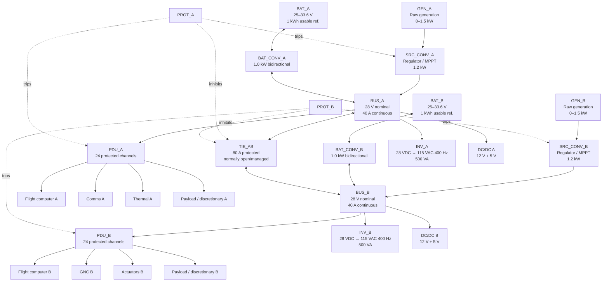
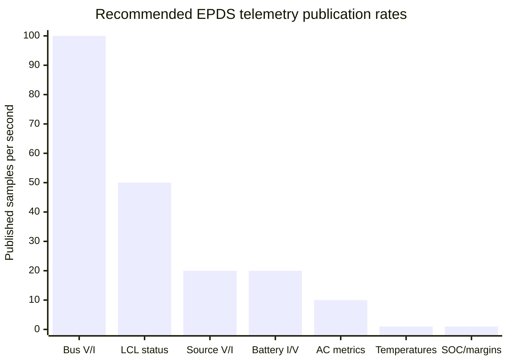
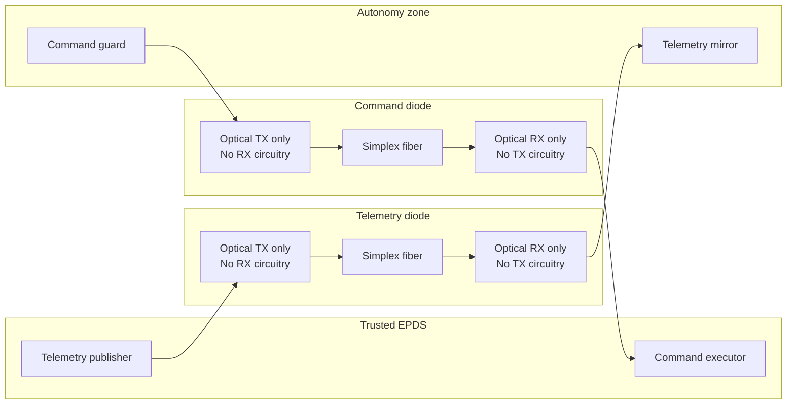
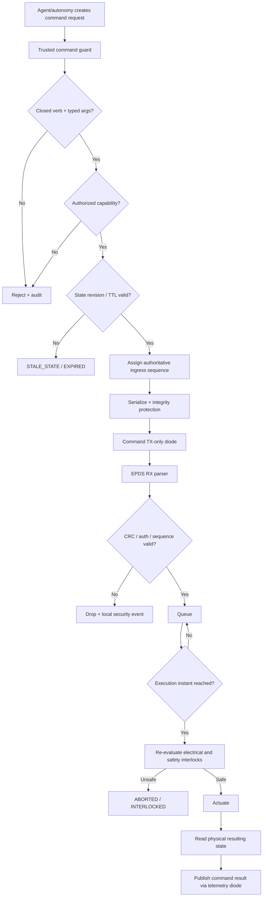
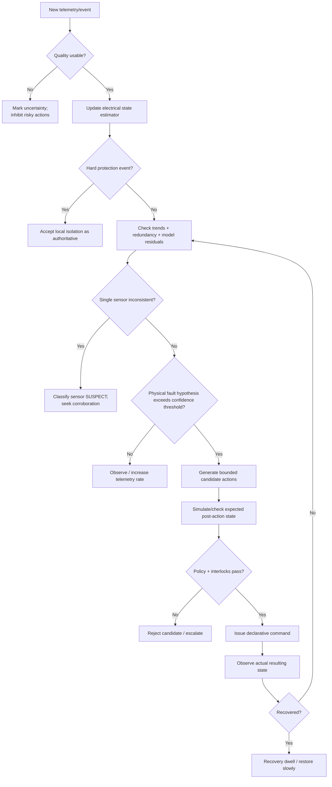
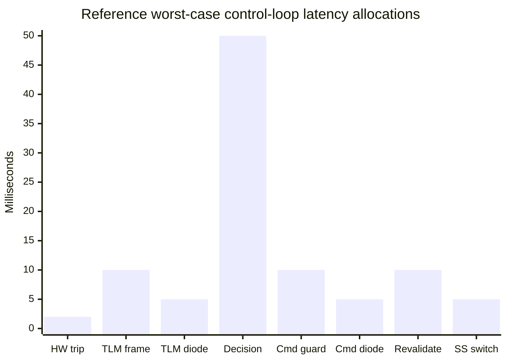

# Mapping an Electrical Power and Distribution Subsystem to a Diode-Pattern Executable Telemetry and Autonomous-Control Architecture

## Executive summary

This report defines a reference architecture for turning an Electrical Power and Distribution Subsystem (EPDS) into an **executable, telemetry-driven cyber-physical system** that can support autonomous fault detection, power management, reconfiguration, load shedding, recovery, and higher-level decision-making while preserving a diode-pattern security boundary.

The most important architectural conclusion is subtle but fundamental: **an external autonomous controller cannot both observe an EPDS and control it through one truly unidirectional boundary.** A hardware data diode is, by definition, physically incapable of returning information in the reverse direction. citeturn6search0turn6search1 Therefore, a closed-loop autonomous controller located outside the trusted EPDS zone requires either:

1. **two physically independent unidirectional paths in opposite directions**—one telemetry diode EPDS → autonomy and one command diode autonomy → EPDS, with separate protocol guards; or
2. **the autonomous decision engine inside the trusted EPDS zone**, with only telemetry exported through a single outward diode.

The first is recommended for the requester’s simulation/research architecture because it lets agents reason over exported telemetry yet still request bounded effects. It should be described accurately as a **dual-diode closed-loop architecture**, not as a single one-way security boundary. The second is preferable where the security objective truly requires that no information whatsoever return to the lower-trust control environment.

The uploaded diode specification already contains several of the right architectural primitives: a closed command vocabulary, asymmetric reach, credentials and authoritative state retained outside the agent, published state that is never treated as input, destructive/atomic command consumption, declarative/idempotent controls, explicit treatment of irreversible actions, and—most importantly—**revalidation of a requested action when it actually takes effect rather than only when it is scheduled**. fileciteturn0file1 The uploaded spacecraft-simulation analysis likewise correctly distinguishes hidden physical truth from direct instrument readings and inferred state, and recommends service-owned physics, fault state, command queues, sensor models, consumable accounting, and safety interlocks. fileciteturn0file0 Those ideas should become requirements, not merely implementation conventions.

For a spacecraft-class reference implementation, this report uses a **dual 28 VDC A/B bus architecture** with two independent generation/source channels, dual battery/storage channels, source and battery converters, a normally open or conditionally enabled bus tie, solid-state current-limiting load switches, redundant auxiliary DC/DC conversion, optional redundant 115 VAC/400 Hz inversion, priority-classed loads, and independent protection controllers. The choice of 28 V is a reference profile rather than a mission requirement: NASA historical surveys note that 28 VDC was the nominal bus voltage in many U.S. spacecraft, while modern spacecraft PMAD systems may use 12 V, 28 V, 50 V or higher depending on power level and mission architecture. citeturn7search0turn7search6 NASA also documents spacecraft power architectures in which solid-state current-limiting output switches, conversion, control, telemetry, autonomous source transfer, and load shedding coexist in the power-control unit. citeturn7search4turn7search7

**All numerical electrical values below are reference design defaults, not asserted mission requirements.** The mission power budget, source technology, eclipse profile, battery chemistry, environmental limits, radiation environment, thermal limits, grounding architecture, crew-rating status, lifetime, launch vibration, EMC environment, harness lengths, permitted single-point failures, and certification authority are unspecified. They must be resolved before a flight design is frozen.

The recommended control hierarchy deliberately keeps fast electrical protection out of the AI/autonomy loop:

| Control tier | Function | Recommended latency | Authority |
|---|---:|---:|---|
| Hardware protection | Short circuit, destructive overcurrent, catastrophic OV/UV protection | µs–5 ms | Non-bypassable |
| Local EPDS controller | Source transfer, converter protection, local FDIR | 5–100 ms | Service-owned |
| Supervisory autonomous EPDS | Load shedding, redundancy management, recovery | 100 ms–10 s | Policy-bounded |
| Mission autonomy | Energy scheduling and mission trade-offs | seconds–hours | Mission policy |
| Human/ground | Objectives, overrides, irreversible authorization | mission-dependent | Highest procedural authority |

This separation is consistent with the long history of NASA work on autonomous power-system monitoring, fault detection/isolation/recovery, redundant power processing, load scheduling, and automatic reconfiguration. citeturn8search0turn8search1turn8search4 The autonomous layer should reason over direct observations, uncertainty, sensor quality, history and model consistency rather than over a single synthesized “health” scalar; NASA model-based fault-management work similarly emphasizes reasoning from component models and detecting sensor/system failures from inconsistent observations. citeturn8search3turn8search11

The resulting architecture is:

```mermaid
flowchart LR
    subgraph PHYS["Trusted EPDS physical/control zone"]
        GENA["Generation A"] --> SRCA["Source Converter A"]
        GENB["Generation B"] --> SRCB["Source Converter B"]

        BATA["Battery A"] <--> BIDA["Bidirectional Battery Converter A"]
        BATB["Battery B"] <--> BIDB["Bidirectional Battery Converter B"]

        SRCA --> BUSA["28 V Bus A"]
        BIDA <--> BUSA
        SRCB --> BUSB["28 V Bus B"]
        BIDB <--> BUSB

        BUSA <--> TIE["Protected Bus Tie"]
        TIE <--> BUSB

        BUSA --> PDUA["PDU A / LCL-SSPC"]
        BUSB --> PDUB["PDU B / LCL-SSPC"]

        PDUA --> ES1["Essential Loads"]
        PDUA --> MS1["Mission Loads"]
        PDUB --> ES2["Essential Loads"]
        PDUB --> MS2["Mission Loads"]

        BUSA --> INVA["Inverter A"]
        BUSB --> INVB["Inverter B"]
        INVA --> ACA["115 VAC / 400 Hz A"]
        INVB --> ACB["115 VAC / 400 Hz B"]

        BUSA --> DCA["12 V / 5 V POL A"]
        BUSB --> DCB["12 V / 5 V POL B"]

        PROT["Hardwired + local protection"]
        EXEC["Command executor / interlocks"]
        TLM["Telemetry publisher"]

        PROT --> SRCA
        PROT --> SRCB
        PROT --> PDUA
        PROT --> PDUB
        EXEC --> PROT

        GENA -.sense.-> TLM
        GENB -.sense.-> TLM
        BATA -.sense.-> TLM
        BATB -.sense.-> TLM
        BUSA -.sense.-> TLM
        BUSB -.sense.-> TLM
        PDUA -.sense.-> TLM
        PDUB -.sense.-> TLM
    end

    subgraph DIODE["Dual physical diode boundary"]
        TTX["Telemetry TX only"] -->|"simplex optical"| TRX["Telemetry RX only"]
        CRX["Command RX only"] <--|"simplex optical"| CTX["Command TX only"]
    end

    subgraph AUTO["Autonomy / agent zone"]
        MIRROR["Read-only telemetry mirror"]
        FDIR["FDIR / state estimator"]
        DECIDE["Autonomous decision engine"]
        GUARD["Trusted command-policy guard"]
        LOG["Decision / audit log"]

        MIRROR --> FDIR --> DECIDE --> GUARD
        FDIR --> LOG
        DECIDE --> LOG
    end

    TLM --> TTX
    TRX --> MIRROR
    GUARD --> CTX
    CRX --> EXEC
```

The architecture should be modelled after spacecraft PMAD rather than after a generic SCADA dashboard. ECSS-E-ST-20-20C specifically addresses spacecraft main-bus distribution and protection using latching current limiters and retriggerable latching current limiters, while ECSS-E-ST-20C Rev.2 establishes broader electrical/electronic engineering requirements. citeturn4view0turn0search5 For terrestrial or microgrid variants, IEC 61850 provides a mature object model for IEDs, sampled values and protection/control information, while the newly published IEEE 1815.2-2025 profiles DNP3 for DERs using IEC 61850-derived data objects for meters, storage, inverters and DER units. citeturn3search1turn3search5turn2search0 These standards are useful semantic references, but they should not be misrepresented as spacecraft certification standards.

## Requirements, assumptions, and standards baseline

The architecture should begin by separating **program requirements** from **reference defaults**. In particular, environmental and mission power constraints remain unknown. AIAA S-122, listed by NASA as an active endorsed standard for unmanned spacecraft EPS, is explicitly concerned with robust EPS design and minimum verification/validation practices, while NASA’s Small Spacecraft state-of-the-art review emphasizes that PMAD architectures are normally customized to mission power requirements. citeturn1search0turn7search6

**Unspecified mission inputs that must remain flagged**

| Unspecified item | Why it changes the design | Current treatment |
|---|---|---|
| Continuous and peak mission power | Determines source, converter, bus and harness ratings | Reference: 2 kW continuous / 4 kW short peak |
| Mission duration | Determines storage aging, redundancy and reliability | Unknown |
| Generation technology | PV, fuel-cell, RTG, external supply require different models | Abstract `GEN_A/B` source interface |
| Eclipse/dark interval | Drives usable battery energy | Unknown |
| Battery chemistry | Changes voltage, temperature, charge limits, SOC model | Reference Li-ion only |
| Orbit / radiation | Drives parts, shielding and charging constraints | Unknown |
| Ambient/vacuum/thermal envelope | Changes cooling and derating | Unknown |
| Human-rated versus uncrewed | Changes hazard controls and certification burden | Unknown |
| Launch shock/vibration | Changes contactors, boards, sensors, packaging | Unknown |
| Grounding architecture | Controls EMC/fault-return behaviour | Must be defined early |
| Allowed single-point failures | Drives A/B independence and cross-strapping | Reference assumes essential function survives one channel failure |
| Maximum acceptable bus interruption | Determines switching/protection architecture | Reference 50 ms essential-load ride-through |
| Harness lengths/gauges | Determines voltage drop and protection coordination | Unknown |
| Power-quality limits at loads | Determines regulation and converter filtering | Reference values below |
| Required AC supply | Determines whether inverter subsystem is needed | Included but optional |
| Autonomous authority | Defines which actions software may execute | Reference four-tier model |
| Cyber classification/trust zones | Determines diode assurance level | Unknown |
| Telemetry bandwidth | Determines publication rates and compression | Reference ≤1 Mbit/s |
| Clock source/time accuracy | Affects ordering, TTL and fault reconstruction | Reference ±1 ms EPDS local |
| Maintenance interface | Common source of accidental reverse channel | Must be separately governed |

Spacecraft grounding should be treated as a system-level architecture decision rather than an equipment-by-equipment afterthought; NASA-HDBK-4001A is specifically dedicated to spacecraft electrical grounding architecture. citeturn4view2 Spacecraft charging and EMC likewise need explicit mission tailoring; ECSS maintains separate active standards for spacecraft charging and electromagnetic compatibility. citeturn0search1turn0search11

**Proposed system-level SHALL requirements**

| ID | Proposed requirement |
|---|---|
| EPDS-R-001 | The EPDS SHALL maintain power to survival-class loads after loss of any one source/converter/bus-distribution channel for failures covered by the program single-fault requirement. |
| EPDS-R-002 | Destructive electrical faults SHALL be isolated by hardware/local protection without dependence on external autonomy, the telemetry diode, the command diode, networking, or file services. |
| EPDS-R-003 | Every telemetered quantity SHALL include source/component identity, engineering unit, measurement time, publication time or sequence, quality state and validity bounds. |
| EPDS-R-004 | Direct sensor observations SHALL be distinguishable from calculated or inferred quantities such as SOC, power margin and time-to-energy-limit. |
| EPDS-R-005 | Every command SHALL belong to an enumerated closed vocabulary with bounded typed arguments. Arbitrary code, paths, network destinations, expressions and executable scripts SHALL NOT cross the command boundary. |
| EPDS-R-006 | Reversible state-setting commands SHALL be idempotent. Non-idempotent/irreversible effects SHALL be explicitly marked and separately authorized. |
| EPDS-R-007 | Every accepted command SHALL have a unique identifier, monotonic ingress sequence, issue time, expiry, authorization principal, requested execution window and applicable base-state revision. |
| EPDS-R-008 | Safety interlocks SHALL be re-evaluated immediately before actuation; acceptance or scheduling SHALL NOT guarantee execution. |
| EPDS-R-009 | Telemetry and control transmission SHALL use physically independent unidirectional paths where hardware-diode assurance is required. |
| EPDS-R-010 | Loss, corruption, delay or flooding of either diode SHALL NOT defeat local electrical protection or prevent a service-owned survival configuration. |
| EPDS-R-011 | The telemetry system SHALL preserve bounded trend history and a persistent event sequence sufficient to reconstruct fault onset and autonomous actions. |
| EPDS-R-012 | The autonomous controller SHALL inhibit aggressive reconfiguration when the observations on which a rule depends are stale, invalid or contradictory unless local survival logic explicitly overrides that inhibition. |
| EPDS-R-013 | Automatic recovery SHALL employ dwell, hysteresis and retry limits so an intermittent fault cannot cause uncontrolled switching chatter. |
| EPDS-R-014 | The service SHALL record every requested, rejected, accepted, executed, aborted and failed command independently of agent-visible state. |
| EPDS-R-015 | Fault-injection tests SHALL demonstrate that sensor failures are distinguishable from equipment failures wherever the physical instrumentation permits such discrimination. |
| EPDS-R-016 | The EPDS model and flight implementation SHALL have traceable FMEA/FMECA, requirements-verification and test evidence before autonomous controls are enabled outside simulation. |

The requirements deliberately formalize lessons already present in the requester’s diode design: published state is a mirror rather than an authority; safety-relevant state remains service-owned; commands are declarative where possible; irreversible effects are explicit; and scheduled commands are redispatched/revalidated at the time of effect. fileciteturn0file1 They also preserve the uploaded simulation design’s distinction between hidden physical truth, authoritative sensor reports and inferred values. fileciteturn0file0

The following standards and primary references form a sensible tailoring baseline.

| Reference | Role in this architecture |
|---|---|
| AIAA S-122, *Electrical Power Systems for Unmanned Spacecraft* | Spacecraft EPS design and V&V baseline; NASA lists it as active and endorsed. citeturn1search0 |
| ECSS-E-ST-20C Rev.2 | General spacecraft electrical/electronic engineering requirements. citeturn0search5 |
| ECSS-E-ST-20-20C / ECSS-E-HB-20-20A | Main-bus distribution and LCL/RLCL protection; handbook explains LCL principles and source/load interface considerations. citeturn4view0turn4view1 |
| ECSS-E-ST-20-07C Rev.2 | Spacecraft EMC requirements and verification. citeturn0search11 |
| ECSS-E-ST-20-06C Rev.1 | Spacecraft-charging assessment and mitigation where relevant. citeturn0search1 |
| NASA-HDBK-4001A | System-level spacecraft grounding architecture. citeturn4view2 |
| ECSS-Q-ST-30-02C | FMEA/FMECA is listed among active ECSS product-assurance standards. citeturn9search6 |
| ECSS-E-ST-10-02C Rev.1 | Verification strategy, implementation and evidence. citeturn9search0 |
| ECSS-E-ST-10-03C Rev.1 | Current ECSS ground-test standard for space-segment equipment/elements. citeturn9search4turn9search8 |
| GSFC-STD-7000B GEVS | Environmental verification by test/analysis for GSFC flight hardware. citeturn9search1 |
| CCSDS 133.0-B-2 | Space Packet Protocol if telemetry/control ultimately enters a CCSDS mission data system. citeturn5search6turn5search18 |
| CCSDS 132.0-B-3 / 232.0-B-4 | TM and TC data-link protocols for spacecraft link integration. citeturn5search6turn5search0 |
| IEC 61850-7-4 / 9-2 / 10 | Useful semantic, sampled-value and conformance-test patterns for power-system IEDs; primarily utility, not spacecraft, standards. citeturn3search1turn3search5turn3search0 |
| IEC TS 60255-216-1:2025 | Current protection-IED guidance covering digital inputs/outputs, GOOSE, sampled values and timing. citeturn2search6 |
| IEC 60255-26:2023 | Protection-equipment EMC test requirements. citeturn2search14 |
| IEC 62351 series | Cybersecurity family for power-system communications; the IEC catalog listed the current 2026 series in July 2026. citeturn2search18turn3search13 |
| NIST SP 800-82 Rev.3 | OT-security architecture and data-diode/unidirectional-gateway terminology. citeturn0search14turn6search0 |

For a terrestrial DER/microgrid interpretation rather than a spacecraft EPDS, IEEE 1815.2-2025 is especially relevant because it maps DER communications—including meters, inverters and batteries—to a DNP3 profile based on IEC 61850 data objects. citeturn2search0

## Reference EPDS topology and component specification

NASA describes spacecraft electrical power distribution as a common-bus system in which loads are switched using solid-state or electromechanical switching, with bus voltages and many individual load currents telemetered; NASA’s current Small Spacecraft review similarly describes PMAD/PDCU functions as conversion, load switching, voltage regulation, monitoring, fault detection and isolation. citeturn1search2turn7search6 ECSS-E-ST-20-20C specifically covers spacecraft main-bus distribution protected by LCL/RLCL devices for classes of satellites requiring single-point-failure-free designs. citeturn4view0

The reference design below is sized only to make simulation and executable telemetry concrete. It is deliberately scalable.



**Reference electrical/component catalogue**

Every figure in the following table marked “ref.” is an engineering starting point to be replaced by program requirements. Efficiencies are target efficiencies for simulation/component procurement, not minimum values claimed by ECSS or NASA.

| ID / quantity | Function | Reference electrical specification | Target efficiency | Response/protection target | Redundancy / failover |
|---|---|---|---:|---|---|
| `GEN_A`, `GEN_B` ×2 | Primary generation abstraction | 38–55 VDC normal source range; 0–1.5 kW each; 35 A max ref. | Source-dependent | Availability update <20 ms | Independent sources preferred |
| `SRC_CONV_A/B` ×2 | Source regulator / MPPT | 38–60 V input; 24–32 V regulated output; 1.2 kW; 45 A current limit | ≥94% at 25–100% rated load | Regulation transient <10 ms; hard inhibit <2 ms | A/B independently feed buses |
| `BAT_A/B` ×2 | Rechargeable storage | Ref. 8-series Li-ion equivalent, 25–33.6 V pack, ≈1 kWh usable each, 40 A continuous / 80 A 10 s | Chemistry-dependent | BMS protection <10 ms for severe electrical fault | Independent battery strings |
| `BAT_CONV_A/B` ×2 | Bidirectional storage interface | 20–36 V battery ↔ 28 V bus; ±1 kW; ±40 A bus side | ≥94% | Mode transition ≤20 ms | Each battery supports associated bus; cross-support via tie |
| `BUS_A/B` | Main distribution | 28 V nominal; 24–32 V normal operational envelope ref.; 40 A continuous each; 80 A transient 1 s | n/a | Sensed at ≥1 kHz | Split A/B |
| `TIE_AB` | Controlled bus tie | 80 A continuous ref.; reverse-current capable | >99% conduction equivalent | Solid-state <1 ms or contactor 10–30 ms | Normally open unless transfer/cross-support policy |
| `PDU_A/B` | Protected load distribution | 24 channels/PDU; channel classes 0.5, 1, 2, 5, 10 A | ≥98% excluding harness | Hard-short trip ≤2 ms; overload 10 ms–2 s by class | Loads distributed/cross-strapped by criticality |
| `LCL_xx` | Individual load protection | Current limit at 110–125% rated; hard-short criterion >200% ref. | ≥98% | Hard trip ≤2 ms; one controlled reclose if allowed | Channel fault contained |
| `INV_A/B` | Optional AC generation | 24–32 VDC → 115 VAC rms ±3%, 400 Hz ±1%; 500 VA | ≥90% | Output-valid ≤50 ms after start | One inverter can support essential AC if switched |
| `DC12_A/B` | Auxiliary DC rail | 24–32 V → 12 V ±2%; 240 W / 20 A | ≥92% | Regulation ≤10 ms | A/B |
| `DC5_A/B` | Avionics DC rail | 24–32 V → 5 V ±2%; 100 W / 20 A | ≥90% | Regulation ≤10 ms | A/B |
| `PROT_A/B` | Independent protection controller | Isolated inputs/outputs; 3.3/5 V logic domain | n/a | 100 µs–5 ms critical trip path | Independent processors; hardware comparator backup |
| `CTRL_EXEC_A/B` | Validated actuator command execution | Logic supply from essential rail | n/a | Parse/admit ≤10 ms; actuation depends on device | Active/standby or partitioned A/B |
| `V_SENSE_x` | Bus/source voltage sensing | 0–40 V bus range, isolated where required | n/a | ≥1 kHz sampling | Dual sensors on critical buses |
| `I_SENSE_x` | Current sensing | ±100 A on main buses, ±rated channel current on loads | n/a | ≥1 kHz main bus | Shunt/Hall diversity desirable |
| `T_SENSE_x` | Battery/converter temperatures | −40 to +100 °C measurement range ref. | n/a | 10 Hz | Multiple pack/power-stage locations |
| `IMD` | Insulation/ground-fault monitoring | Mission-specific DC isolation monitor | n/a | 1–10 Hz | Dedicated monitoring path |
| `DI_TLM` | EPDS→autonomy diode | Simplex fiber; application cap 1 Mbit/s ref.; physical 10–100 Mbit/s acceptable | n/a | Link latency <5 ms | Separate from command diode |
| `DI_CMD` | Autonomy→EPDS diode | Simplex fiber; ≤50 kbit/s application command cap ref. | n/a | Link latency <5 ms | Separate from telemetry diode |

NASA has demonstrated 120 VDC-to-28 VDC spacecraft power equipment consisting of multiple independent 1 kW converters, current-limiting solid-state switches, control/telemetry hardware, autonomous source sharing and load shedding, showing that this decomposition is operationally realistic even though the numerical reference sizing here is deliberately different. citeturn7search4turn7search7 NASA also documented solid-state power controllers as combining remotely controlled switching and circuit-breaker functions, including status/trip indication suitable for computer power-management interfaces. citeturn7search5

**Architecture trade**

| Architecture | Advantages | Drawbacks | Recommended use |
|---|---|---|---|
| Single 28 V bus + essential branch | Lowest complexity and simulation cost | Large common-cause domain; weak fault containment | Early software prototype only |
| **Dual 28 V A/B with protected tie** | Excellent observability, fault containment, intuitive autonomy, historically plausible | More components/state combinations | **Recommended baseline** |
| 50–120 V primary + POL conversion | Lower current/harness loss for high power | Higher insulation/charging/arc complexity; larger converter role | High-power mission after power budget known |
| Dual source + battery-on-bus unregulated | Fewer conversion stages | Wider load-input range; harder telemetry/control limits | Missions optimized for efficiency |
| AC primary distribution | Useful for specialized loads | Inverter/frequency/protection complexity | Not recommended unless mission requires AC |

Higher spacecraft distribution voltages can materially change charging and insulation considerations; NASA’s LEO charging standard explicitly targets high-voltage space power systems above 55 V in its defined LEO environment. citeturn1search18 For that reason, the 28 V baseline should not simply be scaled to 120 V without repeating the grounding, insulation, charging, arcing and protection analysis.

## Telemetry and command model

Meaningful autonomy depends less on the number of telemetry fields than on their **epistemic quality**. A field must answer: what was measured, by what sensor, when, with what quality, whether it is direct or inferred, and whether its value is still relevant to the current command state. The requester’s existing simulation design correctly makes this distinction explicit and notes that sensor readings may drift, saturate, fail or disagree rather than being identical to hidden physical truth. fileciteturn0file0 NASA’s Apollo 13 chronology is a compelling historical example: off-scale/failed oxygen indications, current transients, bus-undervoltage evidence and progressively changing source behaviour had to be interpreted together rather than through a perfect root-cause flag. citeturn7search13

The telemetry system should therefore expose **observations plus uncertainty and quality**, not `component_failed=true` whenever hidden simulation truth contains a failure.

**Mandatory data-quality codes**

| Code | Meaning | Autonomous use |
|---|---|---|
| `GOOD` | Within sensor self-test and age limits | Normal decision input |
| `SUSPECT` | Plausibility/redundancy disagreement | Use only with corroboration |
| `STALE` | Age exceeds channel-specific deadline | Do not use for new actuation |
| `SATURATED` | Sensor is at measurement limit | Treat as inequality, not actual value |
| `OUT_OF_RANGE` | Electrical value outside calibrated domain | Fault evidence but poor numeric estimate |
| `INVALID` | No usable measurement | Exclude |
| `ESTIMATED` | Model-derived quantity | Use with stated uncertainty |
| `SIMULATED` | Explicit synthetic/test value | Never confuse with flight observation |

**Component-health codes**

`NOMINAL`, `DEGRADED`, `WARNING`, `FAULT`, `ISOLATED`, `SAFE`, and `UNKNOWN` should be **conclusions** derived from observations; they should never replace raw telemetry.

The recommended channel rates intentionally separate local protection sampling from published telemetry. Protection may need kilohertz or higher local acquisition even though the autonomous layer only needs a 100 Hz bus-voltage stream.



**Telemetry catalogue and decision thresholds**

Thresholds are reference software defaults and must be replaced after the actual source, battery and load operating envelopes are established.

| Component | Telemetry | Sensor / derivation | Sample → publish | Precision target | Reference threshold / event |
|---|---|---|---|---|---|
| `GEN_A/B` | `input_voltage_v` | isolated voltage ADC | 500 Hz → 20 Hz | ±0.5%, 0.05 V | outside source-specific valid range |
| | `input_current_a` | Hall/shunt | 500 → 20 Hz | ±1%, 0.1 A | >rated or negative unexpectedly |
| | `available_power_w` | V×I/source model | 20 → 10 Hz | ±2% | <scheduled requirement |
| | `source_ready` | discrete/status | event + 10 Hz | exact | transition |
| `SRC_CONV_A/B` | `output_voltage_v` | ADC | 1 kHz →100 Hz | ±0.25%, 0.02 V | <25.5 V warn; <24.5 V shed criterion |
| | `output_current_a` | Hall/shunt | 1 kHz →100 Hz | ±0.5%, 0.05 A | >36 A warning; >44 A protection criterion |
| | `efficiency_pct` | inferred | 10 →1 Hz | ±1 point | <90% sustained |
| | `power_stage_temp_c` | RTD/thermistor | 10 →1 Hz | ±1 °C | 55 °C warn / mission-tailored |
| | `current_limit_active` | discrete | event+50 Hz | exact | immediate event |
| `BAT_A/B` | `pack_voltage_v` | battery ADC | 200 →20 Hz | ±0.25%, 0.01 V | chemistry-specific |
| | `pack_current_a` | bidirectional shunt | 500 →20 Hz | ±0.5%, 0.05 A | charge/discharge limit |
| | `cell_min_v`, `cell_max_v` | BMS channels | 10 →1 Hz | ±10 mV | chemistry-specific |
| | `temperature_max_c` | multi-point thermistors | 10 →1 Hz | ±1 °C | ref. 55 °C inhibit charge; 65 °C isolate |
| | `soc_pct` | estimator | 1 Hz | ±3% desired | 30% warn; 20% shed; 10% survival |
| | `soh_pct` | estimator | 0.1 Hz | mission model | maintenance criterion |
| | `usable_energy_wh` | estimator | 1 Hz | ±5% | reserve threshold |
| `BAT_CONV_A/B` | bus-side V/I, battery-side V/I, mode | ADC/Hall/discrete | 1 kHz →50 Hz | as above | conversion mismatch >5% |
| `BUS_A/B` | `voltage_v` | dual ADC | 2 kHz →100 Hz | ±0.2%, 0.01 V | 25.5/24.5/23.5 V tiers |
| | `current_a` | dual current sensors | 2 kHz →100 Hz | ±0.5%, 0.05 A | rating/derating threshold |
| | `dv_dt_v_s` | derived | 100 Hz | ±5% | rapid collapse trigger |
| | `power_margin_w` | derived | 10 Hz | ±5% | <100 W warn; <0 W shed |
| `TIE_AB` | state, current, ΔV | discrete/current/ADC | 1 kHz→100 Hz | 0.05 V / 0.1 A | prohibit closure if ΔV >1 V or active fault |
| `LCL/PDU channel` | load current | per-channel sensor | 200→10 Hz | ±1% | >110% rating sustained |
| | state | discrete | event +50 Hz | exact | any trip/change |
| | trip cause | local protection latch | event | enumerated | any trip |
| | retry count | executor | event | exact | second fault locks channel |
| `INV_A/B` | input V/I | ADC/current sensor | 500→20 Hz | ±1% | input fault |
| | AC rms V | isolated measurement | ≥2 kHz →10 Hz | ±1% | outside ±5% |
| | frequency_hz | period estimator | ≥2 kHz→10 Hz | ±0.1 Hz | outside configured limit |
| | output_va | derived | 10 Hz | ±2% | >rated |
| | THD_pct | spectral estimator | 1–10 Hz | ±1 point | mission requirement |
| `DC12/5` | output V/I, temp | ADC/current/temp | 500→20 Hz | ±1% | outside ±5% output |
| Critical loads | `input_current_a`, `power_good`, local temp | current/discrete/temp | 100→10 Hz | ±1% | current/state mismatch |
| Protection controller | heartbeat, trip vector, self-test | digital | event+10 Hz | exact | missing heartbeat |
| Diode interfaces | seq, frames dropped, CRC failures, age | digital counters | event+1 Hz | exact | any sustained loss / age limit |

A high-rate record need not be retained forever. A practical implementation retains approximately 10–15 minutes of 100 Hz power-bus data, 30–60 minutes of 10–20 Hz engineering data, and long-duration 1 Hz/downsampled data plus all significant events. The requester’s existing capsule design independently reached the same important conclusion: a current snapshot alone is insufficient for agents returning after a long reasoning interval to distinguish a stable quantity from a rapid trend. fileciteturn0file1

Useful **derived** telemetry should include:

\[
P_{\text{margin}}
=
\sum P_{\text{sources,usable}}
+
\sum P_{\text{battery-discharge-limit}}
-
P_{\text{active-load}}
-
P_{\text{reserve}}
\]

\[
E_{\text{margin}}
=
E_{\text{battery,usable}}
-
E_{\text{mandatory-reserve}}
\]

and, during a net energy deficit,

\[
t_{\text{energy-limit}}
=
\frac{E_{\text{margin}}}
     {P_{\text{load}}-P_{\text{generation}}}
\]

Each value must be tagged `ESTIMATED`, carry its model version and ideally expose an uncertainty bound. An autonomous controller should act on the underlying observables as well as the estimate so that a single incorrect estimator cannot silently drive a dangerous reconfiguration. NASA’s autonomous-power research explicitly combined fault diagnosis, power scheduling and hardware behaviour rather than treating scheduling as independent of physical faults. citeturn8search0turn8search9

**Command vocabulary and interlocks**

| Component | Allowed command | Interlocks before acceptance/execution | Authority |
|---|---|---|---|
| `GEN_A/B` | `set_source_enabled` | source health, no hard source fault | A1 |
| `SRC_CONV_A/B` | `set_source_mode`, `set_output_limit` | configured range; bus compatibility | A1/A2 |
| `BAT_A/B` | no direct cell-level command | BMS always authoritative | — |
| `BAT_CONV_A/B` | `set_battery_mode`, `set_charge_limit`, `set_discharge_limit` | cell V/T, BMS permits, SOC, bus state | A1 |
| Battery contactor | `set_battery_contactor OPEN/CLOSED` | precharge/ΔV, no latched pack fault | A2 |
| `BUS_A/B` | no direct command | state only | — |
| `TIE_AB` | `set_bus_tie OPEN/CLOSED` | ΔV limit, source compatibility, no short/ground fault, fault domain check | A2 |
| `PDU/LCL` | `set_load ON/OFF` | load class, available margin, retry state | A1 |
| `PDU/LCL` | `reset_load_trip` | fault disappeared, retry count, delay elapsed | A2 |
| `INV_A/B` | `set_inverter ON/OFF` | bus margin and AC transfer condition | A1 |
| AC transfer | `select_ac_source` | both sources synchronized/valid or break-before-make | A2 |
| `DC12/5` | `set_converter ON/OFF` | essential dependencies protected | A1 |
| Load groups | `shed_group`, `restore_group` | priority policy, power margin, recovery dwell | A1 |
| Protection | `clear_latched_fault` | root condition absent; policy token | A2 |
| Survival mode | `enter_survival_mode` | always admissible | A1 |
| Leave survival | `request_exit_survival` | sustained healthy envelope + authorization | A2 |
| Irreversible physical devices, if any | `arm_event`, then `execute_event` | dedicated physical/state interlocks + short-lived arm authorization | A3 |

Authority classes should be encoded, not left as documentation:

- **A0** — observe only.
- **A1** — reversible bounded autonomous control: source enable, load shed, power-mode changes.
- **A2** — topology-changing or fault-reset actions: bus tie, contactors, trip reset, survival exit.
- **A3** — one-way/irreversible actions: pyrotechnics, destructive fuse isolation, one-time latch, etc.

The command guard—not the requesting agent—should assign the authoritative principal, capability level and accepted command sequence. The agent can supply a request ID or a claimed role, but those fields are not security credentials. This directly follows the uploaded diode architecture’s principle that real credentials and authority remain on the diode/service side. fileciteturn0file1

A command has the following state progression:

`SEEN → PARSED → AUTHORIZED → ACCEPTED → QUEUED → REVALIDATED → EXECUTING → SUCCEEDED`

with terminal alternatives `REJECTED`, `EXPIRED`, `STALE_STATE`, `INTERLOCKED`, `FAILED`, `ABORTED`, and `SUPERSEDED`.

In particular, **ACCEPTED does not mean safe to execute later**. Interlocks must be rechecked at the actual execution time. That is one of the most valuable features in the existing diode design and should be considered a safety requirement. fileciteturn0file1

## One-way diode architecture, protocol, and security

NIST defines a unidirectional gateway as hardware and software in which the hardware permits data to flow from one network to another but is physically unable to send any information back to the source network; the software can replicate databases or emulate protocol endpoints. citeturn6search0 CNSSI terminology, as reproduced by NIST, similarly describes one-way transfer devices as generally hardware-enforced mechanisms, with a fiber-optic isolator as a common example. citeturn6search3

That definition gives a useful test: **an ordinary bidirectional Ethernet interface with firewall rules is not a hardware data diode**, nor is a normal two-way SFP with one logical direction administratively disabled. The reverse capability still physically exists.

For this EPDS there are three viable arrangements:

| Pattern | Information topology | Assurance | Suitability |
|---|---|---|---|
| Single outward telemetry diode | EPDS → observer only | Highest one-way integrity | Monitoring only, or autonomy located inside EPDS |
| **Dual independent diodes** | EPDS → autonomy telemetry; autonomy → EPDS bounded commands | Each link physically one-way, overall closed-loop system | **Recommended for external autonomy** |
| Filesystem/service “diode” | Requests via shared file/API to inaccessible service; service publishes results | Strong logical isolation but not necessarily hardware unidirectionality | Excellent simulation/research baseline |

The requester’s current service design belongs to the third class: the agent has no service credential or network path, submits only closed verbs, and receives service-published results/state. fileciteturn0file1 It is a sound simulation security architecture, but a flight/high-assurance implementation should not claim hardware data-diode properties unless the physical reverse path is actually absent.

**Physical enforcement**



A high-assurance implementation should employ:

| Layer | Required mechanism |
|---|---|
| Optical | Separate simplex fibers; transmit-only optic on source end, receive-only optic on destination end |
| Electronics | No populated reverse transmitter, reverse receiver or transceiver-management bridge capable of carrying application data |
| Logic | TX-only pins and RX-only pins physically constrained in FPGA/MCU design |
| Power | Isolated power domains so “management” circuitry does not become a reverse path |
| Network | No common bidirectional Ethernet switch spanning the boundary |
| Firmware | Fixed protocol parser; no dynamic URL, path, plugin or code execution |
| Maintenance | Disabled/physically controlled debug ports; maintenance network must not bypass diode assurance |
| Verification | Physical reverse-transfer test, schematic/netlist inspection and firmware negative testing |

**Command sequencing**



That final acknowledgement travels only over the **opposite telemetry diode**; there is no reverse signal on the command link.

**Reference command-wire frame**

A compact binary frame is preferable on the diode itself:

```text
+----------------------+------------------------------+
| Field                | Size / meaning               |
+----------------------+------------------------------+
| magic                | 32-bit fixed constant        |
| protocol_version     | 16-bit                       |
| message_type         | 8-bit                        |
| header_length        | 8-bit                        |
| payload_length       | 32-bit bounded               |
| ingress_sequence     | 64-bit monotonic             |
| command_id           | 128-bit UUID                 |
| issued_met_us        | 64-bit                       |
| not_before_met_us    | 64-bit                       |
| expires_met_us       | 64-bit                       |
| base_state_revision  | 64-bit                       |
| principal_id         | fixed enumerated identifier  |
| authority_class      | 8-bit A0/A1/A2/A3            |
| payload              | bounded protobuf             |
| CRC-32C              | transport corruption check   |
| authenticator        | optional/signature/MAC       |
+----------------------+------------------------------+
```

The `principal_id`, capability and sequence are added by the trusted guard; an agent-provided value is not copied blindly into an authoritative field.

If the spacecraft’s external communications system needs CCSDS interoperability, this application payload can subsequently be encapsulated in mission CCSDS packet/data-link services. CCSDS 133.0-B-2 specifies the current Space Packet Protocol; current CCSDS listings identify TM Space Data Link Protocol issue 3 and TC Space Data Link Protocol issue 4 as active recommended standards. citeturn5search6turn5search0 The internal EPDS diode does not, however, need to reproduce a space-to-ground communications stack just to gain these benefits.

**Failure semantics**

| Failure | Detection | Required behaviour |
|---|---|---|
| Telemetry diode fiber broken | sequence age/receiver loss | autonomy marks affected telemetry `STALE`; no speculative switching |
| Command diode broken | no command-result sequence / receiver link state | EPDS remains autonomously protected; request eventually expires |
| Frame bit corruption | CRC failure | discard whole frame, never partially execute |
| Duplicate command | same ID/sequence | return prior result; do not re-actuate |
| Out-of-order command | monotonic sequence check | reject or reorder only under tightly defined bounded window |
| Replayed old command | sequence + TTL + command-ID cache | reject |
| Clock disagreement | monotonic EPDS time plus expiry rules | reject ambiguous scheduled command, preserve immediate safing |
| Agent retries after lost ACK | declarative command semantics | idempotent state reassertion |
| Sender flooding | token bucket / queue partition | preserve safety commands; reject excess |
| Parser crash | watchdog / process isolation | no actuation; local EPDS continues |
| Command executor crash after actuation but before ACK | physical state readback | subsequent idempotent request converges correctly |
| Sensor value corrupted before telemetry diode | redundancy/plausibility | mark suspect if detectable; diode itself cannot repair false data |
| Diode receiver compromised | least privilege | receiver may parse but cannot bypass service-owned electrical interlocks |
| Telemetry publisher compromised | independent protection survives | autonomy may be misled; hard/local protection remains authoritative |

A one-way link does **not** by itself provide message authenticity, correct telemetry, availability or protection from a compromised permitted sender. IEC 62351 exists precisely because power-system communications need security at the protocol and authorization levels as well as network topology; IEC 62351-6 specifies security mechanisms for IEC 61850-derived protocols, and the broader 2026 series includes network/system management and role-based-access-control material. citeturn3search13turn2search18

Recommended mitigations therefore include secure/measured boot for the guards and executors, read-only firmware roots where practical, signed configuration, least privilege, bounded parsers, watchdogs, rate limits, offline-provisioned trust anchors, authenticated audit records, configuration hashes in telemetry, physical debug-port control, separate management paths, anti-replay sequence persistence, command expiration, source provenance and independent electrical interlocks.

NIST’s data-diode definition should also drive a simple security validation question: **with every software control intentionally misconfigured, is reverse application-data transmission still physically impossible?** If not, the architecture is relying on software policy rather than diode physics. citeturn6search0turn6search3

## Executable telemetry schema and autonomous decision logic

The executable model should expose enough structure that identical definitions drive the simulator, telemetry decoder, data logger, FDIR engine, UI and test harness. IEC 61850’s logical-node/data-object concept is useful inspiration for this separation of semantic identity from wire encoding, even though a spacecraft implementation need not claim IEC 61850 compliance. citeturn3search1

A valid Protocol Buffers baseline is:

```proto
syntax = "proto3";

package epds.v1;

enum Quality {
  QUALITY_UNSPECIFIED = 0;
  GOOD = 1;
  SUSPECT = 2;
  STALE = 3;
  SATURATED = 4;
  OUT_OF_RANGE = 5;
  INVALID = 6;
  ESTIMATED = 7;
  SIMULATED = 8;
}

enum Health {
  HEALTH_UNSPECIFIED = 0;
  NOMINAL = 1;
  DEGRADED = 2;
  WARNING = 3;
  FAULT = 4;
  ISOLATED = 5;
  SAFE = 6;
  UNKNOWN = 7;
}

enum CommandVerb {
  CMD_UNSPECIFIED = 0;
  SET_SOURCE_ENABLED = 1;
  SET_SOURCE_MODE = 2;
  SET_OUTPUT_LIMIT = 3;
  SET_BATTERY_MODE = 4;
  SET_CHARGE_LIMIT = 5;
  SET_DISCHARGE_LIMIT = 6;
  SET_BATTERY_CONTACTOR = 7;
  SET_BUS_TIE = 8;
  SET_LOAD = 9;
  RESET_LOAD_TRIP = 10;
  SET_INVERTER = 11;
  SELECT_AC_SOURCE = 12;
  SET_DC_CONVERTER = 13;
  SHED_GROUP = 14;
  RESTORE_GROUP = 15;
  ENTER_SURVIVAL_MODE = 16;
  REQUEST_EXIT_SURVIVAL = 17;
  CLEAR_LATCHED_FAULT = 18;
  ARM_EVENT = 19;
  EXECUTE_EVENT = 20;
}

enum CommandStatus {
  STATUS_UNSPECIFIED = 0;
  SEEN = 1;
  PARSED = 2;
  AUTHORIZED = 3;
  ACCEPTED = 4;
  QUEUED = 5;
  EXECUTING = 6;
  SUCCEEDED = 7;
  REJECTED = 8;
  EXPIRED = 9;
  STALE_STATE = 10;
  INTERLOCKED = 11;
  FAILED = 12;
  ABORTED = 13;
  SUPERSEDED = 14;
}

message Measurement {
  string point_id = 1;
  double value = 2;
  string unit = 3;
  Quality quality = 4;

  // Measurement time in the authoritative EPDS monotonic time base.
  uint64 sample_met_us = 5;

  // Optional engineering metadata.
  double resolution = 6;
  double uncertainty_1sigma = 7;
  double valid_min = 8;
  double valid_max = 9;

  // "DIRECT" or estimator/model identifier.
  string provenance = 10;
}

message Discrete {
  string point_id = 1;
  string value = 2;
  Quality quality = 3;
  uint64 sample_met_us = 4;
}

message ComponentState {
  string component_id = 1;
  Health health = 2;
  repeated Measurement analog = 3;
  repeated Discrete discrete = 4;
  repeated string active_fault_codes = 5;
  uint64 config_revision = 6;
}

message Event {
  uint64 event_seq = 1;
  uint64 met_us = 2;
  string event_code = 3;
  string component_id = 4;
  string severity = 5;
  string summary = 6;
}

message CommandResult {
  string command_id = 1;
  uint64 ingress_sequence = 2;
  CommandVerb verb = 3;
  CommandStatus status = 4;
  uint64 accepted_met_us = 5;
  uint64 executed_met_us = 6;
  string reason_code = 7;
  string resulting_component_id = 8;
  uint64 resulting_state_revision = 9;
}

message TelemetryFrame {
  uint32 schema_version = 1;
  uint64 telemetry_sequence = 2;
  uint64 state_revision = 3;
  uint64 frame_met_us = 4;

  repeated ComponentState components = 5;
  repeated Event events = 6;
  repeated CommandResult command_results = 7;

  // Hash of the active configuration/rule set.
  bytes configuration_hash = 8;
}

message CommandArgument {
  // Sorted lexicographically before serialization when the frame
  // is covered by a deterministic authenticator.
  string key = 1;
  string value = 2;
}

message CommandEnvelope {
  uint32 schema_version = 1;
  uint64 ingress_sequence = 2;
  string command_id = 3;

  uint64 issued_met_us = 4;
  uint64 not_before_met_us = 5;
  uint64 expires_met_us = 6;
  uint64 base_state_revision = 7;

  // Added by trusted guard, not trusted from agent input.
  string principal_id = 8;
  uint32 authority_class = 9;

  CommandVerb verb = 10;
  repeated CommandArgument args = 11;

  bytes policy_token = 12;
}
```

A representative JSON rendering would be:

```json
{
  "schema_version": 1,
  "telemetry_sequence": 194283,
  "state_revision": 88213,
  "frame_met_us": 55182440000,
  "components": [
    {
      "component_id": "BUS_A",
      "health": "DEGRADED",
      "analog": [
        {
          "point_id": "voltage_v",
          "value": 24.82,
          "unit": "V",
          "quality": "GOOD",
          "sample_met_us": 55182439910,
          "resolution": 0.01,
          "uncertainty_1sigma": 0.04,
          "valid_min": 0.0,
          "valid_max": 40.0,
          "provenance": "DIRECT:BUS_A_VSENSE_1"
        },
        {
          "point_id": "power_margin_w",
          "value": 72.0,
          "unit": "W",
          "quality": "ESTIMATED",
          "sample_met_us": 55182439910,
          "resolution": 1.0,
          "uncertainty_1sigma": 18.0,
          "valid_min": -2000.0,
          "valid_max": 4000.0,
          "provenance": "ESTIMATOR:POWER_BALANCE_V3"
        }
      ],
      "discrete": [
        {
          "point_id": "tie_state",
          "value": "OPEN",
          "quality": "GOOD",
          "sample_met_us": 55182439910
        }
      ],
      "active_fault_codes": ["UV_WARN"],
      "config_revision": 37
    }
  ]
}
```

The external JSON mirror may contain friendly symbolic names; the diode wire protocol should use enumerated numeric IDs and hard payload bounds wherever feasible to reduce parser complexity.

**Reference autonomous power-state machine**

```mermaid
stateDiagram-v2
    [*] --> NORMAL

    NORMAL --> DEGRADED:
        Vbus < 25.5 V for 200 ms
        or Pmargin < 100 W
        or one source lost

    DEGRADED --> SHED_P3:
        Vbus < 24.5 V for 300 ms
        or Pmargin < 0 W

    SHED_P3 --> SHED_P2:
        Vbus < 24.0 V for 200 ms
        or predicted reserve violation

    SHED_P2 --> SURVIVAL:
        Vbus < 23.5 V for 100 ms
        or both normal sources unavailable

    DEGRADED --> NORMAL:
        Vbus > 27.0 V and
        Pmargin > 250 W for 30 s

    SHED_P3 --> DEGRADED:
        Vbus > 27.0 V and
        Pmargin > 300 W for 30 s

    SHED_P2 --> SHED_P3:
        Vbus > 27.0 V and
        Pmargin > 400 W for 60 s

    SURVIVAL --> SHED_P2:
        explicit recovery permitted
        and healthy envelope for 60 s
```

`P3` should mean discretionary loads, `P2` deferrable mission loads, `P1` mission-critical loads and `P0` survival/protection/control/telemetry infrastructure.

The key point is that the state machine handles **resource configuration**, while hard protection remains independent. A local LCL does not ask the autonomous agent whether a dead short should be disconnected.

**Recommended autonomous rules**

```text
RULE UV_DEGRADED
WHEN:
    BUS_A.voltage_v is GOOD
    AND BUS_A.voltage_v < 25.5 V for >= 200 ms
THEN:
    enter DEGRADED
    inhibit new P2/P3 load starts
    verify associated healthy battery is available
    request battery discharge support if needed

RULE LOAD_SHED_P3
WHEN:
    state >= DEGRADED
    AND (
        BUS_A.voltage_v < 24.5 V for >= 300 ms
        OR system.power_margin_w < 0 for >= 500 ms
    )
THEN:
    shed all enabled P3 loads in configured sequence
    wait 500 ms
    re-evaluate physical bus measurements

RULE BUS_TIE_SUPPORT
WHEN:
    one bus source is unavailable
    AND opposite bus has power_margin_w > 500 W
    AND abs(BUS_A.voltage_v - BUS_B.voltage_v) < 1.0 V
    AND no active short/ground-fault flag exists
    AND tie current capability exceeds predicted transferred load
THEN:
    request SET_BUS_TIE(CLOSED)
ELSE:
    keep tie OPEN

RULE LOAD_FAULT_RECOVERY
WHEN:
    an LCL trips on transient/overload class
    AND local protection permits retry
    AND retry_count == 0
THEN:
    wait 5 s
    retry once

WHEN:
    same channel trips again within 60 s
THEN:
    latch ISOLATED
    do not retry autonomously

RULE LOW_SOC
WHEN:
    battery.soc_pct < 30
THEN:
    inhibit discretionary load starts

WHEN:
    battery.soc_pct < 20
THEN:
    shed P3 and selected P2 loads

WHEN:
    battery.soc_pct < 10
THEN:
    enter SURVIVAL

RULE BATTERY_OVER_TEMP
WHEN:
    battery.temperature_max_c > configured_charge_inhibit
THEN:
    prohibit charging

WHEN:
    battery.temperature_max_c > configured_isolation_limit
    AND redundant power exists
THEN:
    isolate battery

RULE TELEMETRY_UNCERTAIN
WHEN:
    critical input is STALE or INVALID
    OR redundant sensors disagree beyond configured tolerance
THEN:
    prohibit topology-expanding commands
    retain/reduce load
    rely on local protection
    declare UNKNOWN or DEGRADED rather than inventing a value
```

NASA’s early autonomous-power test beds specifically demonstrated autonomous monitoring, individual load-fault removal, redundant power-processing switching and battery charge/discharge control, while later APEX work coupled diagnosis with recovery and scheduling. citeturn8search1turn8search0 That supports a conservative architecture in which power autonomy is a combination of **hard protection + FDIR + scheduling**, rather than a monolithic decision model.

A fault-decision flow should require corroboration where time permits:



For simulation and research, the most valuable additional field is not another voltage sensor but **provenance**: the log should establish when a physical fault began, when it became measurable, when telemetry exposed it, when autonomy formed a hypothesis, when a command was requested, when it was actually executed, and what the resulting electrical state was. The uploaded research design makes essentially the same distinction and correctly separates hidden-truth logs from agent-visible telemetry. fileciteturn0file0

## Validation, fault injection, timing, and security tests

Formal verification should be planned at equipment and system level rather than treated as a final demonstration. ECSS-E-ST-10-02C Rev.1 establishes a verification process spanning equipment through overall systems, while ECSS-E-ST-10-03C Rev.1 is the current ECSS testing standard; GSFC-STD-7000B provides a NASA environmental-verification baseline for flight hardware. citeturn9search0turn9search4turn9search1 IEC 61850-10 similarly emphasizes conformance and performance testing for digital power-system communication devices, and its 2025 amendment adds/updates test procedures including sampled-value and GOOSE performance. citeturn3search0

The recommended progression is:

**Model-in-the-loop → software-in-the-loop → processor-in-the-loop → power-hardware-in-the-loop → engineering-unit testing → environmental/EMC verification → integrated mission fault campaign.**

NASA has long used actual power-distribution test beds with fault injection to assess automated diagnosis and recovery, so HIL fault campaigns are particularly well aligned with this architecture. citeturn8search0turn8search4turn8search8

**Minimum test-vector suite**

| Vector | Injection | Expected result | Pass criterion |
|---|---|---|---|
| `TV-NOM-001` | Full nominal load profile over representative mission cycle | No false shedding/trips | Zero unauthorized commands; margins match model tolerance |
| `TV-SRC-002` | Abrupt loss of `GEN_A` | Battery/source support or controlled tie transfer | Essential loads uninterrupted within specified ride-through |
| `TV-UV-003` | Ramp bus from 28 → 23 V | State progresses NORMAL→DEGRADED→shed→SURVIVAL | Every threshold/timer/hysteresis exactly reproducible |
| `TV-SC-004` | Hard short on nonessential 5 A channel | Only affected LCL trips | ≤2 ms reference trip; other bus remains stable |
| `TV-OL-005` | 120% load overload | Delayed coordinated trip | Correct inverse/delay class, no upstream trip |
| `TV-TIE-006` | Request tie closure with ΔV >1 V | Command blocked | `INTERLOCKED`, zero tie current |
| `TV-TIE-007` | Request tie into known faulted bus | Blocked | Fault containment maintained |
| `TV-BAT-008` | Battery temperature exceeds charge limit | Charging inhibited | No further positive battery current beyond settling |
| `TV-BAT-009` | SOC crosses 30/20/10% | Progressive restrictions | Correct load classes shed; P0 remains powered |
| `TV-CONV-010` | Converter output drift low | Source declared degraded, redundancy used | No uncontrolled oscillation between channels |
| `TV-LCL-011` | Transient channel fault clears before retry | One retry succeeds | Exactly one retry |
| `TV-LCL-012` | Fault persists through retry | Channel latches isolated | No third autonomous retry |
| `TV-SNS-013` | Bus voltage sensor stuck at 28.0 V during real sag | Redundant sensor/model detects inconsistency | Stuck sensor becomes `SUSPECT`; local protection still acts |
| `TV-SNS-014` | Current sensor saturates | Quality=`SATURATED` | Autonomy interprets lower/upper-bound semantics correctly |
| `TV-TLM-015` | Drop 20 consecutive telemetry frames | Critical points become stale | No topology-expanding autonomous command |
| `TV-TLM-016` | Reorder telemetry frames | Sequence detects disorder | Older state never overwrites new authoritative mirror |
| `TV-CMD-017` | Duplicate identical command ID | No duplicate physical effect | One execution, deterministic prior result returned |
| `TV-CMD-018` | Replay old valid frame | Reject | No actuation |
| `TV-CMD-019` | Command based on superseded state revision | Reject or force re-evaluation | `STALE_STATE` |
| `TV-CMD-020` | Scheduled command becomes unsafe before execution | Abort at execution | `INTERLOCKED`/`ABORTED` |
| `TV-CMD-021` | Actuation succeeds but telemetry ACK is lost | Safe idempotent retry | Final physical state correct; no double effect |
| `TV-FLOOD-022` | Command source floods guard | Safety priority preserved | Bounded CPU/memory; lower priority rejected |
| `TV-PARSE-023` | Oversize length, malformed protobuf, invalid enum | Full-frame rejection | No crash/no actuation |
| `TV-DIODE-024` | Attempt data transmission backwards through telemetry diode | No data received EPDS-side | Physical zero reverse path |
| `TV-DIODE-025` | Attempt data transmission backwards through command diode | No information reaches autonomy source side | Physical zero reverse path |
| `TV-POWER-026` | Remove diode power | EPDS protection continues | No effect on electrical safety functions |
| `TV-BOOT-027` | Corrupt command-executor firmware/configuration | Secure boot/configuration validation fails closed | No unvalidated control service |
| `TV-COMMON-028` | Simultaneous source failure + biased sensor | Conservative survival response | No action relying solely on biased sensor |
| `TV-REC-029` | Oscillating voltage around restoration threshold | No chatter | Hysteresis/dwell prevents repeated shed/restore |
| `TV-BROWN-030` | Full generation loss with known battery energy | Predicted time-to-limit tracks actual | Error inside defined estimator tolerance |

**Latency budget**

Protection should be validated against absolute worst-case latency, not average timing.

| Path | Reference allocation |
|---|---:|
| Analog fault onset → hardware comparator/LCL decision | ≤1 ms |
| Protection decision → load switch open | ≤1 ms |
| Physical event → local telemetry sample | ≤1 ms |
| Sample → published 100 Hz frame | ≤10 ms nominal |
| Telemetry diode | ≤5 ms |
| Autonomous processing for fast supervisory rule | ≤50 ms |
| Command guard admission | ≤10 ms |
| Command diode | ≤5 ms |
| Command executor revalidation | ≤10 ms |
| Solid-state load actuation | ≤5 ms |
| Mechanical contactor, where used | 10–30 ms ref. |

The resulting design keeps a severe short-circuit clearing path at roughly the millisecond tier while a supervisory action can occupy tens or hundreds of milliseconds without endangering the distribution hardware.



This is also why AI or multi-agent reasoning must never sit in the only path between an electrical short and breaker/LCL opening.

**Fault-injection methodology**

Fault injection should occur at several layers simultaneously:

| Layer | Examples |
|---|---|
| Physical model | short/open, source collapse, battery resistance increase, thermal degradation |
| Sensor | bias, noise, stuck, dropout, saturation, delay, swapped channels |
| Actuator | contactor fails open/closed, LCL fails to reset, inverter start failure |
| Data | lost/reordered/duplicated frames, sequence reset, malformed payload |
| Time | jitter, clock offset, scheduling lateness |
| Cyber | forged unauthenticated request, replay, flood, parser fuzzing |
| Autonomy | corrupted estimate, contradictory rules, stale configuration |
| Common cause | source loss plus telemetry outage; thermal fault plus overloaded redundant channel |

Monte Carlo campaigns should randomize fault timing, load state, sensor bias and observation loss while retaining deterministic seeds for replay. Pass/fail should be based on invariant properties—such as “no P0 load loses power for >X ms” or “no command executes after its TTL”—rather than only on a particular expected sequence of internal decisions.

IEC TR 61850-10-3 explicitly recommends a methodical approach to system-level functional testing where communications replace hardwired protection/control interfaces; that testing philosophy transfers well to the digital portion of this EPDS even though the application domain is different. citeturn3search14

**Security-specific validation**

The security campaign should include firmware fuzzing, protocol fuzzing, command authorization bypass attempts, loss of sequence persistence across reboot, key/configuration rollback, debugging-interface inspection, data-diode reverse-channel testing, timing-channel measurement, denial-of-service, malicious-but-valid commands, malicious telemetry, stale replay, configuration substitution and maintenance-port bypass.

The threat model must explicitly acknowledge that a command data diode protects **directionality**, not the EPDS from a fully compromised authorized command source. The service-owned safety layer and electrical interlocks therefore remain necessary even if the diode is perfectly one-way. NIST’s OT guidance addresses security in the context of safety, reliability and physical-process operation rather than treating network isolation as a complete control. citeturn0search14

## Implementation roadmap, bill of materials, and recommended reference configuration

Implementation should proceed from physics and requirements outward, not from telemetry UI inward. NASA’s fault-management lessons identify requirements, architecture, design and V&V as recurring fault-management problem areas, and emphasize that autonomous fault management becomes particularly important when communication delay limits timely ground intervention. citeturn8search16

**Prioritized roadmap**

| Priority | Deliverable | Exit criterion |
|---|---|---|
| **P0 — requirements closure** | Resolve power/load envelope, mission phases, source type, battery chemistry, environmental limits, grounding, single-fault criteria and autonomy authority | Approved EPDS requirements and hazard assumptions |
| **P0 — failure analysis** | FMEA/FMECA of every generation, conversion, storage, distribution and diode element | Every critical failure has detection, containment and recovery disposition |
| **P1 — executable electrical model** | Two-source/two-battery/two-bus network with LCLs, loads, efficiency, thermal state and conserved energy | Power balance closes numerically; faults propagate physically |
| **P1 — telemetry registry** | Machine-readable point dictionary with units/range/rate/quality/threshold/provenance | Schema automatically generates simulator publishers and decoder tests |
| **P1 — command registry** | Closed typed verbs, authority classes, interlocks and state-revision rules | No free-form executable command path exists |
| **P2 — logical diode prototype** | Existing filesystem/service diode adapted to EPDS | Agents can observe and request controls without access to EPDS internals |
| **P2 — deterministic FDIR** | Hard/local protection model and supervisory state machine | Fault vectors above pass reproducibly |
| **P2 — event/history system** | Multi-rate ring + complete researcher log | Fault onset through recovery can be reconstructed |
| **P3 — dual physical diode prototype** | TX-only/RX-only command and telemetry paths | Reverse-channel tests demonstrate hardware directionality |
| **P3 — processor/HIL EPDS** | Real controller plus programmable sources/electronic loads | Timing and interlock requirements verified in real time |
| **P3 — cybersecurity campaign** | Fuzzing, replay, flood, malformed input, rollback and maintenance-path tests | No unauthorized physical actuation |
| **P4 — mission tailoring** | Replace reference thresholds with battery/source/load qualification data | Limits trace to component/mission requirements |
| **P4 — environmental qualification** | EMC, thermal-vacuum, vibration/shock/radiation as required by mission | Formal verification evidence accepted |
| **P4 — autonomous mission trials** | Monte Carlo and representative mission scenarios | Quantified false action, missed detection, recovery and energy-margin performance |

For the simulation phase, a particularly strong technique is to preserve separate values for **hidden electrical truth**, **sensor output**, **published telemetry**, **derived estimate**, and **autonomy belief**. That enables a researcher to distinguish a bad decision from a bad instrument and a bad instrument from an actual physical fault. The requester’s existing design already proposes this separation and should retain it. fileciteturn0file0

**High-level bill of materials**

No vendor-specific flight part should be selected until radiation, environment and qualification requirements are known.

| BOM group | Qty ref. | High-level item | Reference capability |
|---|---:|---|---|
| Generation | 2 | Primary generation/source assemblies or simulator channels | ≥1.5 kW each raw ref. |
| Source conversion | 2 | Regulator/MPPT converters | ≥1.2 kW, 38–60 V→28 V |
| Storage | 2 | Independent battery strings | ≈1 kWh usable each ref. |
| Battery management | 2 | BMS/controller sets | Cell monitoring, contactor control, protection |
| Storage conversion | 2 | Bidirectional converters | ≥1 kW each |
| Main PDU | 2 | 28 V A/B distribution units | ≥40 A per bus |
| Protected outputs | 48 ref. | LCL/SSPC channels | 0.5–10 A selectable classes |
| Bus tie | 1 function / redundant control | High-current tie element | ≥80 A ref. |
| DC/DC | 4 | Redundant 12 V/5 V modules | 240 W / 100 W rails |
| AC inverter | 2 optional | 28 VDC→115 VAC/400 Hz | 500 VA each |
| Bus voltage sensing | ≥4 | Independent isolated ADC channels | 0–40 V, ≤0.25% target |
| Main current sensing | ≥4 | Hall/shunt channels | ±100 A |
| Branch current sensing | per controlled branch | Integrated or external current monitor | Sized per LCL |
| Temperature sensing | ≥12 | RTD/thermistor channels | batteries, converters, PDU |
| Isolation monitor | 1–2 | Ground/insulation monitor | architecture dependent |
| Protection processing | 2 | FPGA/MCU protection controllers | A/B independent |
| Supervisory executor | 2 | Redundant command processors | watchdog, secure boot |
| Telemetry publisher | 1–2 | Dedicated telemetry processors | read-only from plant perspective |
| Command-diode optics | 1 pair | TX-only + simplex fiber + RX-only | 10–100 Mbit/s physical |
| Telemetry-diode optics | 1 pair | TX-only + simplex fiber + RX-only | 10–100 Mbit/s physical |
| Hardware root/watchdog | ≥2 | Security/watchdog supervisors | secure config, independent reset |
| Time source | 1 primary + backup | monotonic timing source | ≤1 ms system alignment target |
| HIL source | lab | programmable DC source | generation/failure emulation |
| HIL load | lab | programmable electronic load | transient/short/load profiles |
| Data acquisition | lab | independent reference DAQ | validates embedded telemetry |

A higher-assurance implementation should also budget independent reference instrumentation for verification. Embedded telemetry should not be allowed to certify itself.

**Recommended reference configuration**

For the first executable build, the optimal balance of fidelity, autonomy and implementation effort is:

> **Dual 28 VDC A/B buses; dual source regulators; dual independently managed battery strings; normally open protected bus tie; 24 current-limited channels per bus; P0–P3 load criticality; redundant 12 V/5 V conversion; optional A/B 115 VAC/400 Hz inverters; independent hardware/local protection; 100 Hz bus telemetry with lower-rate engineering telemetry; event-driven fault records; telemetry and command sequence numbers; state revisions; explicit quality/provenance; bounded history; a closed declarative command registry; policy authorization; execution-time interlock revalidation; one-retry fault-recovery policy; and physically separate command and telemetry diodes.**

The distribution concept is directly compatible with ECSS’s spacecraft LCL/RLCL approach, while the semantic and validation layers can borrow useful patterns from IEC 61850 without forcing the spacecraft to become a utility substation. citeturn4view0turn3search1 The design also remains compatible with eventual CCSDS packaging if the same executable telemetry has to traverse a conventional spacecraft communications stack. citeturn5search6turn5search0

Most importantly, this configuration turns the EPDS from a collection of numbers into a **decision-capable state model**. Autonomous software receives enough information to distinguish loss of generation from an overloaded bus, a stuck sensor from a physical undervoltage, a transient branch fault from a persistent short, insufficient instantaneous power from insufficient remaining energy, and a safe redundancy transfer from one that would propagate the original fault.

That distinction is what makes the telemetry executable rather than merely observable—and it preserves the central security property of the requester’s diode pattern: the autonomous requester may propose bounded state changes, but the authoritative EPDS service owns physical truth, safety interlocks, timing, fault protection and the final decision to actuate. fileciteturn0file1