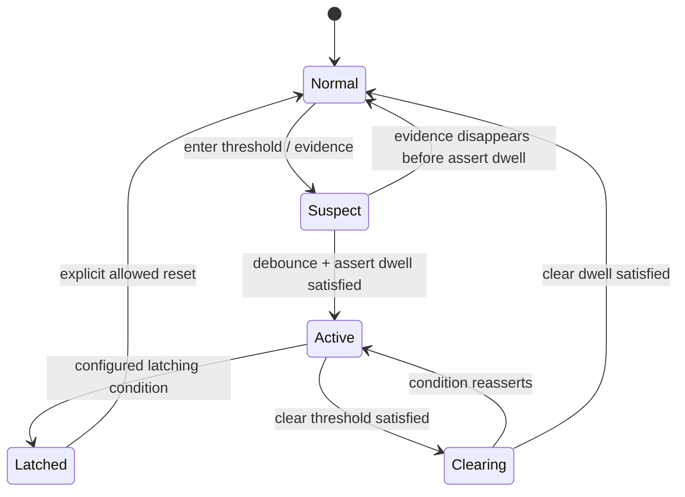
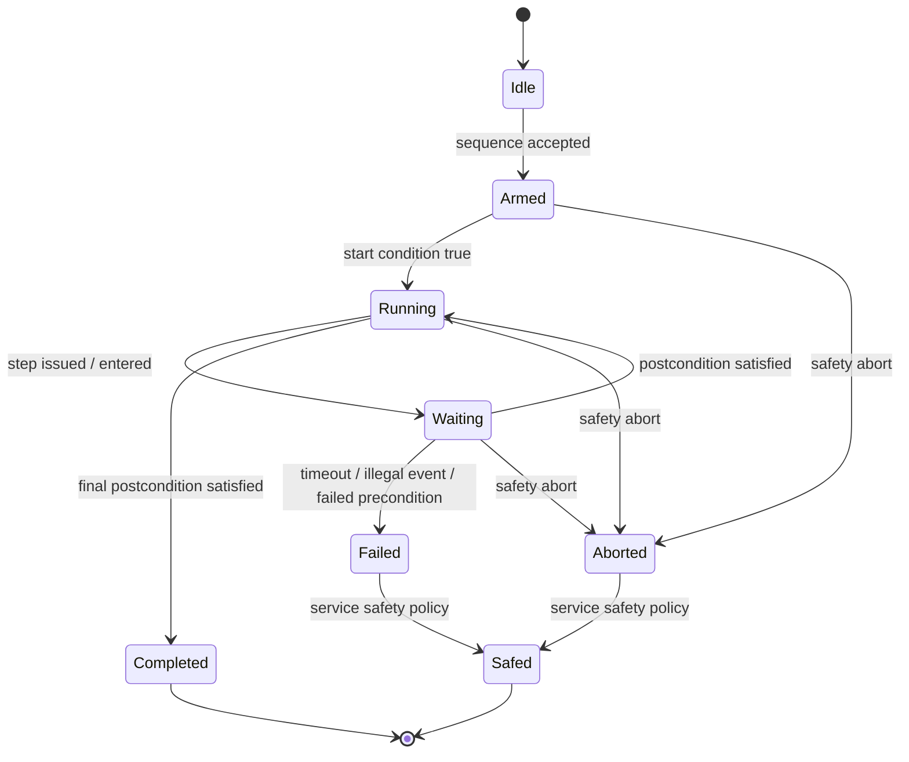
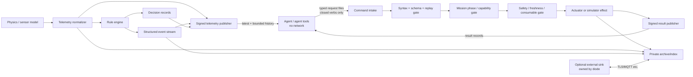

# Implementable Diode Specification for Structural, Pressure, and Sequential Events

## Executive summary

The supplied diode specification establishes the correct security primitive: an agent may request only a **closed vocabulary of effects**, has no network path or credentials, receives only service-published state/results, and cannot influence the service by rewriting published state. It also already identifies the key difference for a simulated spacecraft: state evolves independently, telemetry needs history, actuation is stateful and sometimes irreversible, safety gates must be service-owned, and scheduled actions must be re-authorized at execution time. fileciteturn0file0

This report turns those principles into an executable telemetry-and-decisioning specification for three event families:

**Structural Events** are observations or derived detections concerning mechanical load, acceleration, shock, vibration, strain, deformation, or structural-model disagreement.

**Pressure Events** are observations or derived detections concerning pressure magnitude, pressure rate, transients, leak-like behavior, relief/vent behavior, or pressure-sensor disagreement.

**Sequential Events** are observations about the progress, validity, ordering, timing, or failure of an expected sequence of states, commands, or mission events.

The recommended implementation is:

| Concern | Recommended choice |
|---|---|
| Agent ↔ diode boundary | Existing shared-filesystem diode; no agent network interface |
| Physics cadence | Independent deterministic simulation clock, baseline 200 Hz |
| Structural acquisition | 200 Hz baseline; configurable higher-rate event bursts |
| Pressure acquisition | 50 Hz baseline |
| Sequential acquisition | Event-driven plus 10 Hz state heartbeat |
| Agent-facing telemetry | 20 Hz `latest` publication + bounded 10-minute historical ring + immediate event records |
| Authoritative serialization | **Protocol Buffers** |
| Human/agent inspection | Generated JSON projection; never authoritative input |
| Event envelope | Typed event record inspired by OpenTelemetry's event/source/occurrence-vs-observation model |
| Integrity | Detached signature over the exact serialized payload; default Ed25519, pinned verifier key |
| Rule representation | Declarative rule package with **CEL predicates** plus a small, fixed temporal/state operator vocabulary |
| Decision semantics | Event-time, deterministic; hysteresis/debounce/window state owned by the decision engine |
| Local persistence | Segmented Protobuf archive + SQLite metadata/index |
| Network export, if needed | Performed only by the diode; MQTT 5 QoS 1 is the default lightweight external sink |
| Safety posture | Safety gates, abort/safing authority, consumable floors, and irreversible-operation interlocks remain diode-owned |

Protocol Buffers are recommended because they provide generated types, explicit schema evolution through numbered fields, and compact binary representation; their documentation explicitly warns against reusing field numbers and notes that serialized byte ordering is not generally canonical, so signatures in this design cover the **exact bytes emitted**, not a reserialized message. citeturn2search0turn2search1turn2search7 CEL is a strong fit for the predicate layer because it is deliberately non-Turing-complete, restricted to data/functions exposed by its host, and designed for predictable-cost repeated evaluation. citeturn5search11

The principal architectural decision is to distinguish three layers that must not be conflated:

1. **Measurements** are facts or model outputs with uncertainty and provenance.
2. **Events** are interpretations of measurements/state, with explicit rule/version/evidence and lifecycle.
3. **Decisions** are outputs recommending or requesting an effect; they do not bypass the diode's independent safety gates.

That separation prevents a detector from silently becoming an actuator. It also supports replay: the same telemetry plus the same rule package should reproduce the same semantic event/decision sequence even if the wall-clock replay happens days later. Event-time processing is preferable for this purpose because results derive from source timestamps rather than arrival timing; mature stream-processing systems use the same distinction and explicitly treat lateness and ordering as part of stream semantics. citeturn5search0turn5search8

The requirements below are a **proposed vNext diode profile**, not claims that the supplied reference already implements them. Where the existing specification is preserved or changed, the delta is called out explicitly.

## Functional requirements, assumptions, and deltas

The security and safety posture should remain recognizably the supplied diode: the agent has no service credential or network path, does not provide executable code/URLs/paths, cannot make service-published state authoritative by editing it, and cannot bypass diode-owned safety authorities. The supplied specification also requires deferred commands to be re-dispatched through normal authorization at delivery, which should remain a hard invariant. fileciteturn0file0 This is consistent with the broader treatment of cyber-physical/OT systems, where cybersecurity controls have to preserve performance, reliability, and safety rather than treating them as ordinary information systems. citeturn4search2turn4search15

**Normative functional requirements.**

| ID | Requirement |
|---|---|
| FR-DIODE-001 | The agent **MUST NOT** have a network interface capable of reaching spacecraft/simulator services or their external dependencies. |
| FR-DIODE-002 | All effects **MUST** be selected from a diode-owned registry of named verbs with typed, bounded arguments. No path, host, URL, source code, expression language, shell fragment, or dynamically loaded program may cross an actuator interface. |
| FR-DIODE-003 | Telemetry and published state **MUST NOT** be consumed by the diode as authority. Agent modification of published files must therefore be unable to alter physical/model state. |
| FR-DIODE-004 | Physics/model advancement **MUST** run independently of agent command polling. |
| FR-DIODE-005 | Every measurement, event, command result, and decision **MUST** carry a source boot identifier and monotonic sequence identifier sufficient to detect gaps, duplication, and replay. |
| FR-DIODE-006 | Event/decision processing **MUST** use source/event time for temporal semantics. Wall-clock observation time is diagnostic. |
| FR-DIODE-007 | Rules affecting safety-relevant behavior **MUST** have an immutable rule identifier, version, content hash, and test-vector set. |
| FR-DIODE-008 | Commands marked `irreversible` or `hazardous` **MUST** be validated against diode-owned state immediately before effect. Scheduling-time validation is insufficient. |
| FR-DIODE-009 | A stale telemetry snapshot **MUST NOT** satisfy a safety-critical precondition. Each such precondition must define a maximum data age. |
| FR-DIODE-010 | A decision emitted by an agent **MUST** be treated as a request, never as proof that an actuator action is safe. |
| FR-DIODE-011 | Structural, pressure, and sequential events **MUST** preserve their source evidence or references to it, rule provenance, occurrence time, observation time, severity, lifecycle state, and causal/correlation links. |
| FR-DIODE-012 | Unknown schema major versions, invalid enum values in required domains, NaN/Infinity where forbidden, excessive message sizes, signature failures, stale requests, and violated sequence constraints **MUST fail closed**. |
| FR-DIODE-013 | Published history **MUST** be bounded. Loss through ring overwrite must be explicit via sequence gaps rather than silently presented as complete history. |
| FR-DIODE-014 | Service restart **MUST** produce a new `boot_id` while preserving monotonicity inside each boot. |
| FR-DIODE-015 | Scheduled work **MUST** carry a stable `schedule_id`; duplicate delivery must not cause duplicate effects. |
| FR-DIODE-016 | Every emitted event and decision **MUST** be attributable to an exact input range and exact rule/configuration version. |

NASA's current software-safety guidance is especially relevant if this design ever becomes safety- or mission-critical: its requirements include initialization/restart into known safe states, safe state transitions, and rejection of out-of-sequence commands when such execution can cause a hazard. citeturn9search0turn9search1turn9search8 The present specification should implement those mechanisms even in simulation so that an eventual hardware integration does not require changing the conceptual model.

**Assumptions and intentionally unspecified items.** No specific sensor, spacecraft geometry, structural modal model, pressure vessel, pressure range, actuator set, operating system, CPU, storage size, flight framework, mission sequence, or regulatory jurisdiction was supplied. Therefore the numerical rates below are a **baseline simulator profile**, not sensor qualifications. Actual threshold values, allowable loads, proof/burst pressures, modal frequencies, pressure limits, safety margins, control-law stability constraints, and hazardous-command definitions remain mission configuration items and must not be inferred from this report.

The baseline execution profile is:

| Quantity | Baseline | Tolerance / interpretation |
|---|---:|---|
| Physics/model tick | 200 Hz, 5 ms | Authoritative simulation cadence |
| Structural samples | 200 Hz | May be increased per channel for shock/modal studies |
| Pressure samples | 50 Hz | Higher rate permitted for fast pneumatics |
| Sequence heartbeat | 10 Hz | Transitions emitted immediately |
| Agent-facing frame | 20 Hz, 50 ms | Latest snapshot/aggregate |
| Event publication | Immediate | Target p99 ≤25 ms after the rule's temporal condition closes |
| Command intake fallback poll | ≤20 ms | Filesystem notification may reduce average latency |
| Command request → acceptance/refusal | p99 ≤100 ms under nominal load | Does not include scheduled future execution |
| Scheduled effect timing | ±1 physics tick | Governed by internal scheduler, not agent polling |
| Shared historical ring | ≥10 minutes | Configuration may increase but not silently decrease |
| Timestamp logical error, simulation profile | 0 in simulation time | Host-wall-clock error recorded separately |
| Real-sensor timing uncertainty | Required metadata | No universal default |

A mature flight-software architecture also separates the scheduler, time service, command dispatch, telemetry, events, and health monitoring. NASA's cFS exposes software-bus, time, event, table, file, and executive services, while NASA's scheduler and stored-command applications provide deterministic timed release and absolute/relative command sequences. citeturn1search2turn1search9turn1search16turn1search0 The proposed diode is not required to adopt cFS, but those separations validate the architectural decomposition.

**Changes relative to the supplied specification.** The reference document remains the controlling source for the existing implementation. fileciteturn0file0 The proposed deltas are:

| Area | Prior specification | Proposed vNext delta |
|---|---|---|
| State publication | `state.json` principally describes permissions/budget | Keep capability/permission state separate; add typed telemetry surfaces |
| History | Network diode has no bounded telemetry history; capsule section recommends one | Make a 10-minute bounded telemetry/event ring normative |
| Command representation | `commands: ["verb argument"]` | Retain legacy strings for compatibility; add typed `requests[]` for actuation/scheduling |
| Command identity | Destructive intake yields at-most-once file handling | Add `request_id`, expiry, expected-state sequence, and private replay ledger |
| Output | Exactly one text file per command | Authoritative typed result record; text rendering is optional/non-authoritative |
| Registry | `gate`, `help`, `hidden`, `credentialed` | Add `irreversible`, `hazard_class`, typed argument schema, idempotency class, prerequisites, maximum stale-state age |
| Service loop | Five-second poll in the network diode | Independent physics clock; ≤20 ms intake latency target |
| Scheduling | Re-dispatch at delivery | Preserve unchanged and add telemetry-freshness, sequence-state, consumable, and irreversible-operation checks |
| Telemetry authenticity | No cryptographic integrity requirement | Sign authoritative binary publications |
| Sequencing | Deferred commands plus capsule discussion | Add first-class sequence/event IDs, step state, timeout and missing-event semantics |
| Event model | Free-form output/refusal | Structured event taxonomy and lifecycle |
| Decisioning | Not specified | Deterministic CEL+temporal rule engine |
| Budget naming | `used`/`limit` can be confused | Use explicit `used_this_window`, `limit_per_window`, `remaining`, `window_seconds` |
| Hidden commands | Must be inert | Unchanged |
| Published state as input | Forbidden | Unchanged |
| Agent credentials/network | Forbidden | Unchanged |
| Service-owned abort/safety floor | Required conceptually | Made executable through precondition and interlock gates |

The most consequential delta is not the wire format; it is that **telemetry now becomes a first-class, signed, sequenced data product rather than merely a `state.json` snapshot**.

## Canonical telemetry model and event taxonomy

The data model should explicitly separate source occurrence time from collector observation time. OpenTelemetry's stable log/event model makes the same distinction with `Timestamp` and `ObservedTimestamp`, and also provides normalized severity fields and resource/source attributes. citeturn2search13turn3search0 This diode profile adopts the distinction without adopting OpenTelemetry itself as the wire format.

**Canonical envelope.**

| Field | Type | Required | Semantics / units |
|---|---|---:|---|
| `schema_major` | `uint32` | yes | Breaking-schema generation |
| `schema_minor` | `uint32` | yes | Backward-compatible revision |
| `mission_id` | string ≤64 B | yes | Operator-assigned namespace |
| `source_id` | string ≤64 B | yes | Stable producing component/simulator |
| `boot_id` | 16 bytes | yes | Unique producer boot/run identifier |
| `frame_seq` | `uint64` | yes | Monotonic per `source_id + boot_id` |
| `event_time_ns` | `int64` | yes | Authoritative occurrence/model time, ns |
| `observed_time_ns` | `int64` | yes | Publication/collector wall time, ns |
| `time_basis` | enum | yes | `SIM`, `UTC`, `TAI`, `GNSS`, `PTP`, `OTHER` |
| `clock_uncertainty_ns` | `uint64` | yes | Bound on source timestamp uncertainty |
| `physics_step` | `uint64` | simulator | Authoritative model-step counter |
| `config_hash` | 32 bytes | yes | SHA-256 of active configuration |
| `model_hash` | 32 bytes | when modeled | Exact model/version identity |
| `producer_version` | string ≤64 B | yes | Build/software identity |
| `quality` | bitset/enum | yes | `GOOD`, `DEGRADED`, `STALE`, `INVALID`, etc. |
| `samples` | repeated message | telemetry | Channel data |
| `events` | repeated message | optional | Events coincident with this frame |
| `signature_ref` | string / key ID | signed surface | Identifies detached signature/key |

UUIDs may be used for externally visible identifiers; the current IETF UUID standard defines a 128-bit UUID namespace and supersedes RFC 4122. citeturn2search10 Sequence correctness, however, must never rely on UUID ordering: use explicit `uint64` counters.

**Sample fields.**

| Field | Type | Purpose |
|---|---|---|
| `channel_id` | string ≤96 B | Stable dictionary key, e.g. `struct.accel.x` |
| `channel_seq` | `uint64` | Per-channel gap/duplication detection |
| `sample_offset_ns` | `sint64` | Offset from envelope `event_time_ns` |
| `quantity` | enum | Acceleration, pressure, strain, etc. |
| `value` | `oneof {double, sint64, uint64, bool, enum}` | Typed measurement |
| `unit` | enum/string | SI representation |
| `nominal_rate_millihz` | `uint32` | Exact metadata, e.g. `200000` = 200 Hz |
| `uncertainty_abs` | double | ± uncertainty in the same unit |
| `uncertainty_rel_ppm` | `uint32` | Relative uncertainty when applicable |
| `quantization` | double | Smallest reporting increment |
| `validity` | enum | `VALID`, `STALE`, `OUT_OF_RANGE`, `SENSOR_FAULT`, `MODEL_INVALID` |
| `origin` | enum | `MEASURED`, `SIMULATED`, `DERIVED`, `ESTIMATED` |
| `derivation_id` | string | Algorithm/model identifier for derived values |
| `source_sample_seq` | repeated `uint64` | Inputs used to derive this value |

Recommended baseline channels include:

| Family | Quantities | Preferred units | Baseline rate |
|---|---|---|---:|
| Structural | linear acceleration | m/s² | 200 Hz |
| Structural | angular rate | rad/s | 200 Hz |
| Structural | strain | dimensionless or µε-labelled projection | 200 Hz |
| Structural | force/load | N | 200 Hz |
| Structural | vibration RMS / band energy | m/s² RMS or defined PSD unit | 20–50 Hz derived |
| Structural | jerk | m/s³ | 200 Hz derived |
| Pressure | absolute/gauge pressure | Pa | 50 Hz |
| Pressure | pressure rate | Pa/s | 50 Hz derived |
| Pressure | differential pressure | Pa | 50 Hz |
| Pressure | regulator/valve state | enum / boolean | on change + heartbeat |
| Sequential | mission/sequence state | enum | on change + 10 Hz |
| Sequential | current step | integer/string ID | on change + 10 Hz |
| Sequential | step elapsed time | s/ns | 10 Hz |
| Sequential | expected-next-event deadline | ns | on change |

A measurement's uncertainty fields are deliberately **data**, not global constants. There is no honest platform-neutral value for pressure-sensor accuracy, accelerometer error, structural-model uncertainty, or clock uncertainty.

**Event record.**

Every event is an immutable assertion. A later transition clears or supersedes it; history is never retroactively rewritten.

| Field | Type | Semantics |
|---|---|---|
| `event_id` | 16 bytes | Globally unique occurrence ID |
| `event_seq` | `uint64` | Per-source monotonic event sequence |
| `category` | enum | `STRUCTURAL`, `PRESSURE`, `SEQUENTIAL`, `SYSTEM`, `SECURITY` |
| `event_type` | enum/string dictionary key | Exact semantic event class |
| `severity` | enum | `INFO`, `ADVISORY`, `WARNING`, `CRITICAL`, `EMERGENCY` |
| `otel_severity_number` | `uint32` | Optional interoperability mapping |
| `lifecycle` | enum | `ASSERTED`, `ACTIVE`, `CLEARING`, `CLEARED`, `LATCHED` |
| `occurred_time_ns` | `int64` | Earliest supported occurrence time |
| `observed_time_ns` | `int64` | Detection/publication time |
| `detection_latency_ns` | `uint64` | `observed - occurred` when clocks permit |
| `rule_id` / `rule_version` | string | Detector provenance |
| `rule_hash` | 32 bytes | Exact executable rule definition |
| `evidence` | repeated reference | Source frames/channels/events |
| `confidence` | float [0,1] | Detector confidence; never a safety override |
| `sequence_id` | optional bytes/string | Mission/command sequence instance |
| `step_id` | optional string | Sequence step |
| `links` | repeated link | Causal/derived/correlation graph |
| `message` | string ≤512 B | Human summary, non-authoritative |

For interoperability, INFO/WARN/ERROR/FATAL-like severities can map to OpenTelemetry's numerical severity bands; OpenTelemetry defines increasing ranges from TRACE through FATAL, with INFO at 9–12, WARN at 13–16, ERROR at 17–20, and FATAL at 21–24. citeturn3search0 A recommended diode mapping is INFO→9, ADVISORY→12, WARNING→13, CRITICAL→19, EMERGENCY→21.

**Structural event classes.**

| Event type | Definition | Typical assertion criterion |
|---|---|---|
| `STRUCT_LOAD_LIMIT` | Load/strain/acceleration exceeds configured envelope | Threshold + dwell |
| `STRUCT_SHOCK` | Short high-amplitude transient | Peak/impulse/jerk detector |
| `STRUCT_VIBRATION_EXCESS` | Windowed RMS or spectral band energy exceeds envelope | RMS/band aggregate |
| `STRUCT_MODE_EXCITATION` | Persistent energy near a configured structural mode | Spectral detector; requires model |
| `STRUCT_RATE_OF_CHANGE` | Structural quantity changes too rapidly | Derivative threshold |
| `STRUCT_SENSOR_DISAGREEMENT` | Redundant sources disagree beyond uncertainty | Cross-sensor residual |
| `STRUCT_MODEL_RESIDUAL` | Measurement diverges from predicted model response | Residual + confidence |
| `STRUCT_INTEGRITY_SUSPECTED` | Higher-level evidence indicates possible damage | Multi-evidence rule; never inferred from a single arbitrary threshold |

**Pressure event classes.**

| Event type | Definition | Typical assertion criterion |
|---|---|---|
| `PRESSURE_HIGH` / `PRESSURE_LOW` | Pressure leaves configured envelope | Threshold + hysteresis |
| `PRESSURE_SPIKE` | Short excursion that exceeds transient limit | Peak detector |
| `PRESSURE_RATE_RISE` / `PRESSURE_RATE_FALL` | Rate exceeds configured bound | dP/dt |
| `PRESSURE_OSCILLATION` | Persistent pressure oscillation | RMS/band/window detector |
| `PRESSURE_SENSOR_DISAGREEMENT` | Redundant readings inconsistent beyond uncertainty | Residual |
| `PRESSURE_LEAK_SUSPECTED` | Pressure decay inconsistent with commanded/model state | Model-based temporal rule |
| `PRESSURE_RELIEF_ACTIVE` | Relief/vent path is open or inferred active | State/telemetry |
| `PRESSURE_RECOVERY_FAILED` | Expected return to envelope does not occur | Timeout rule |

**Sequential event classes.**

| Event type | Definition |
|---|---|
| `SEQ_STARTED` | Sequence instance entered execution |
| `SEQ_STEP_ENTERED` | A named step became current |
| `SEQ_STEP_COMPLETED` | Step postconditions satisfied |
| `SEQ_BRANCH_TAKEN` | Explicit branch transition occurred |
| `SEQ_PRECONDITION_FAILED` | Required state was false/stale/unknown |
| `SEQ_TIMEOUT` | Step failed to satisfy completion within its deadline |
| `SEQ_EXPECTED_EVENT_MISSING` | Required event did not arrive within a temporal window |
| `SEQ_OUT_OF_ORDER` | Event/command occurred before its legal predecessor |
| `SEQ_UNEXPECTED_EVENT` | Event valid in taxonomy but illegal in current sequence state |
| `SEQ_ABORTED` | Sequence terminated through abort/safety path |
| `SEQ_COMPLETED` | Terminal success state reached |

NASA's cFS Limit Checker is a useful precedent for this pattern: it monitors telemetry against predefined threshold conditions, emits events, and can initiate a relative-time command sequence when a condition is met. citeturn1search3 Stored Command similarly separates time-tagged command release from the commands themselves. citeturn1search0

**Causal links are typed.** Automatic temporal correlation must not be promoted to causality. Use only:

`DERIVED_FROM` — rule output directly derived from evidence;  
`CAUSES` — causality is asserted by an authoritative model or explicitly approved rule;  
`CORRELATED_WITH` — temporal/statistical relationship only;  
`PRECEDED_BY` — ordering only;  
`TRIGGERED_DECISION` — event contributed to a decision;  
`SUPERSEDES` — newer event replaces an earlier assertion.

A detector should default to `DERIVED_FROM` and `CORRELATED_WITH`. It should not emit `CAUSES` merely because one event preceded another.

The common event lifecycle is:



This state machine is the normative pattern for threshold-driven structural and pressure events. The different enter/clear thresholds implement hysteresis; the `Suspect` and `Clearing` dwell periods implement debounce without discarding evidence.

Sequential execution uses a separate machine:



A sequence transition is a first-class event; the system must therefore be able to reconstruct sequence history without interpreting prose logs.

## Diode interfaces, transport, and serialization

The data path preserves the existing asymmetry while adding typed telemetry and decision records.



The arrows back to the agent are publication only: the service must never read its telemetry/output files to discover its own state. That preserves the reference specification's “published state is a mirror, never an input” invariant. fileciteturn0file0

**Agent-facing filesystem surfaces.**

A concrete implementation can retain the single shared `/diode` volume for compatibility:

```text
/diode/
  console.json                 # legacy command surface
  requests.json                # typed requests, agent -> diode

  state.json                   # capability/permission mirror
  HELP.md

  telemetry/
    latest.pb
    latest.json                # generated projection
    latest.sig
    index.json
    ring/
      seg-0000.pb
      seg-0000.sig
      ...
      seg-0599.pb
      seg-0599.sig

  events/
    latest.pb
    latest.json
    index.json
    ring/
      evt-0000.pb
      ...
      evt-1023.pb

  output/
    <request-id>.result.pb
    <request-id>.result.sig
```

All authoritative publications are written to a temporary file and replaced atomically. The current Python/POSIX behavior documented for `os.replace` provides atomic replacement when successful, matching the implementation technique already described in the supplied diode spec. citeturn7search7

The **10-minute telemetry ring** uses 600 one-second segments. Each segment contains the 20 agent-facing frames for that second plus references to higher-rate event bursts. `latest.pb` continues to update every 50 ms, so low-latency readers do not wait for segment closure. A ring segment carries `segment_seq`, `slot`, `first_frame_seq`, `last_frame_seq`, `event_time_start_ns`, and `event_time_end_ns`; therefore overwrite is detectable.

**Validation gates, in order:**

1. Reject non-regular files, symlinks where not explicitly supported, oversized input, invalid UTF-8 in text fields, and forbidden filename forms.
2. Parse only the expected schema.
3. Validate major version, enum domains, ranges, lengths, finite floating-point values, and nesting limits.
4. Validate `request_id`, `issued_at`, `expires_at`, and duplicate/replay ledger.
5. Resolve the verb from the diode-owned registry.
6. Validate typed argument schema; no extra parameters for safety-relevant verbs.
7. Re-evaluate mission phase and capability gate.
8. Require telemetry/state freshness appropriate to the verb.
9. Evaluate diode-owned safety prerequisites and consumable floors.
10. For scheduled actions, repeat gates 5–9 at execution time.
11. Apply the effect.
12. Persist effect/audit state before publishing the result where feasible.
13. Publish a signed success/refusal/error result.

The order intentionally preserves the supplied rule that authority is evaluated at the **moment of effect**. fileciteturn0file0

**Replay protection.**

Telemetry identity is `(source_id, boot_id, frame_seq)`. A live consumer rejects a frame with `frame_seq <= last_seen` for the same boot except through an explicit historical-replay API. A gap produces a `TELEMETRY_SEQUENCE_GAP` system event rather than pretending continuity.

Events similarly use `(source_id, boot_id, event_seq)`. Commands add a `request_id`, validity interval, and optionally `expected_state_seq`. The diode retains a private bounded replay ledger of recently processed request IDs. For a non-idempotent or irreversible request, an already-seen ID must return the original result or a duplicate refusal; it must never cause a second effect.

Historical replay must have a separate `replay_session_id` and `replay=true`. A live actuator interface must refuse replay-tagged inputs.

**Cryptographic integrity and authentication.**

Across the local diode filesystem the main requirement is integrity/authenticity, not secrecy. The diode signs the exact authoritative Protobuf bytes and publishes a detached signature containing `algorithm`, `key_id`, `payload_sha256`, and `signature`. The verification key must be pinned in the agent image/operator configuration or anchored to an operator trust root; merely publishing an unpinned public key beside the signed file would let any writer replace both.

Key material belongs exclusively to the diode. NIST's key-management guidance emphasizes protection, inventory, access control and lifecycle management for cryptographic keys and associated metadata. citeturn4search0turn4search11 Where a diode egresses telemetry to a remote service, TLS 1.3 with authenticated peers is the default network security profile; TLS 1.3 is the current IETF protocol standard for that transport-security generation. citeturn8view2

For deployments requiring a particular regulatory cryptographic module, the signature algorithm is a compliance-profile parameter. The reference software profile should use Ed25519; a FIPS-module-constrained deployment may substitute an approved module/algorithm without altering payload semantics.

**Serialization comparison.**

| Format | Strengths | Weaknesses | Suitability |
|---|---|---|---|
| JSON | Human-readable, ubiquitous, easy for agents; RFC 3339 textual timestamps are interoperable. citeturn2search8 | Larger; number/presence semantics easier to mis-handle; signing requires exact bytes or canonicalization such as JCS. citeturn8view3 | Excellent diagnostic projection |
| CBOR | Compact, self-describing, designed for constrained/high-volume uses, and defines deterministic encoding profiles. citeturn8view0 COSE provides standardized CBOR signing/encryption structures. citeturn8view1 | Weaker generated static typing/tool familiarity than Protobuf in many application stacks | Strong alternative, especially constrained systems |
| Protobuf | Compact; generated types; explicit field numbering; strong schema-evolution tooling. citeturn2search0turn2search14 | Serialization order is not guaranteed/canonical, so reserialization must not be used for cryptographic equality. citeturn2search1 | **Recommended authoritative payload** |

**Transport comparison.**

| Transport | Delivery model | Diode-boundary fit | Recommendation |
|---|---|---|---|
| Shared filesystem + atomic replace/ring | Application-defined; sequence IDs provide explicit gap/replay handling | **Excellent:** preserves no-network agent topology | **Normative agent-facing transport** |
| MQTT 5 | Lightweight pub/sub; QoS 0, 1, and 2 provide different delivery assurance levels. citeturn0search7turn0search1 | Direct agent use would introduce a network path; acceptable only behind diode | Preferred lightweight external export |
| Kafka | Durable event log; idempotent/transactional facilities support stronger processing guarantees inside Kafka-based pipelines. citeturn7search0turn7search2 | Too heavy and network-dependent for the diode boundary | Strong backend/historical option, not boundary protocol |
| gRPC | Typed RPC with Protobuf; HTTP/2 and bidirectional streaming/auth support. citeturn7search14 | Its normal RPC topology defeats the “agent has no service network path” property | Do not expose to agent |

For MQTT external export, **QoS 1 plus application-level event IDs/deduplication** is preferred to relying on transport claims alone. MQTT specifies QoS 1 as acknowledged delivery where duplicate application delivery is possible; application IDs therefore remain necessary. citeturn0search1turn0search12

**Size and QoS limits.**

| Object | Maximum authoritative size |
|---|---:|
| Typed command request | 16 KiB |
| Command result | 32 KiB |
| Ordinary telemetry frame | 256 KiB |
| One-second telemetry segment | 2 MiB |
| Event record | 32 KiB |
| Event evidence attachment/burst | 1 MiB; larger artifacts referenced, not embedded |
| Rule definition | 64 KiB |
| Complete rule package | 1 MiB |
| String field unless specifically overridden | 4 KiB |
| Event human message | 512 B |

No unbounded map, array, recursion, or user-selected nesting is permitted. Protobuf's own implementation limits are much larger than these; its documentation recommends that applications impose explicit bounds rather than treating the format's very large maximum message size as an application limit. citeturn2search2

## Executable decision logic and rule format

A single general-purpose scripting language should **not** be accepted as a rule format. It would undermine the diode's closed-vocabulary property by moving arbitrary computation into configuration. Instead, the decision engine consists of a fixed set of state/temporal operators plus CEL only for bounded predicates.

CEL is explicitly designed as a safe, non-Turing-complete expression language that can only access data/functions made available by its host. citeturn5search11 That makes it better suited than Python/JavaScript for agent-authored predicates. OPA/Rego is also a mature declarative policy language over structured data and provides schema-aware policy checking and a test framework, but its natural abstraction is a policy query rather than an event-time stream processor. citeturn6search0turn6search2turn6search4 Flink CEP natively handles ordered patterns, temporal windows and event-time lateness, but is a much heavier execution environment than a local diode simulator requires. citeturn5search0

**Decision-engine alternatives.**

| Option | Stateless predicates | Temporal/stateful rules | Safety/auditability | Operational weight | Verdict |
|---|---:|---:|---|---|---|
| CEL + fixed temporal IR | Excellent | Excellent when state is host-owned | High: bounded language + explicit operators | Low | **Recommended** |
| OPA/Rego | Excellent | Possible with host-provided history/state | Strong policy tooling and tests. citeturn6search0turn6search4 | Moderate | Good for authorization, not primary CEP |
| Flink CEP | Good | Excellent sequence/window semantics. citeturn5search0 | Strong replay/event-time model | High | Suitable for large downstream streams |
| Hard-coded FSMs only | Excellent | Excellent | Highest determinism | Low runtime, high change cost | Use for non-configurable safety interlocks |

The diode's **safety gates should remain hard-coded or separately operator-signed configuration**, while agent-changeable analytic rules run in CEL+IR. An agent-generated decision can recommend `inhibit_burn`; only the diode-owned safety layer decides whether a burn is actually available.

**Normative primitive set.**

Stateless primitives:

`eq`, `ne`, `<`, `<=`, `>`, `>=`, `between`, `outside`, `changed`, `rising_edge`, `falling_edge`, `quality_is`, `fresh_within`, `all`, `any`, `not`.

Stateful/temporal primitives:

`for(duration)`, `debounce(count, within)`, `n_of_m(n,m)`, `hysteresis(enter,clear)`, `cooldown(duration)`, `window(duration)`, `since(event)`, `until(event)`, `missing_for(duration)`, `sequence([...], within)`, `rate`, `delta`, `join`, `latch`, `clear_on`.

Aggregates:

`min`, `max`, `mean`, `sum`, `count`, `rms`, `stddev`, `percentile`, `slope`, `integral`, `peak_to_peak`, `first`, `last`.

Spectral transforms such as FFT/band energy should be named, diode-provided transforms rather than arbitrary user functions. Their exact window, overlap, normalization, and sample requirements must be versioned.

**Threshold semantics.** A threshold without hysteresis is valid only for informational events. Any threshold capable of generating repeated operational decisions should define separate assertion and clear conditions, or explicitly opt out.

**Debounce semantics.** `for: 250ms` means the predicate must be continuously true in event time for 250 ms. `n_of_m: {n:3,m:4}` means at least three of four consecutive eligible samples satisfy it. These are different and must not be conflated.

**Data quality precedes threshold evaluation.** Rules must specify a policy for `STALE`, `INVALID`, missing, and uncertain data. A safety-relevant rule may not implicitly coerce missing data to zero or false.

**Confidence scoring.** Confidence is explanatory metadata, not authority. A deterministic default is:

\[
C = \mathrm{clamp}\left(\frac{\sum_i w_i e_i q_i}{\sum_i w_i},0,1\right)
\]

where each evidence score \(e_i\) and quality factor \(q_i\) is normalized to [0,1], and weights are part of the rule definition. For pure hard-limit events, confidence should usually be 1.0 when valid evidence satisfies the rule and should instead expose uncertainty/margin explicitly rather than inventing probabilistic precision.

**Rule format.** YAML is convenient for authoring, but it is parsed into a canonical typed IR before execution. Agents may write this declarative object; they may not define new operators.

```yaml
schema: diode.rule.v1
id: pressure.tank_a.high
version: 3

input:
  channel: pressure.tank_a
  required_quality: VALID
  max_age: 100ms

predicate:
  cel: "sample.value_pa >= 2300000.0"

state:
  assert_for: 250ms
  clear:
    cel: "sample.value_pa < 2250000.0"
  clear_for: 1s
  debounce:
    n: 3
    m: 4

emit:
  category: PRESSURE
  type: PRESSURE_HIGH
  severity: CRITICAL

confidence:
  mode: hard_limit

decision:
  type: INHIBIT_OPERATION
  target: propulsion.burn
  reason: pressure_outside_envelope
```

A sequential rule can operate over events rather than raw channels:

```yaml
schema: diode.rule.v1
id: sequence.burn.ignition_missing
version: 1

scope:
  sequence: burn_sequence

pattern:
  start:
    event_type: SEQ_STEP_ENTERED
    where:
      cel: "event.step_id == 'open_main_valve'"

  expect:
    event_type: PRESSURE_RATE_RISE
    within: 500ms

on_timeout:
  emit:
    category: SEQUENTIAL
    type: SEQ_EXPECTED_EVENT_MISSING
    severity: CRITICAL

  decision:
    type: REQUEST_ABORT
    target: burn_sequence
```

Flink's CEP design illustrates why `within`, explicit sequence patterns, lateness, and event-time order need first-class semantics instead of being hidden in ad-hoc expressions. citeturn5search0

A decision record should itself be typed:

```json
{
  "decision_id": "01993c88-52c1-7b36-97af-f08788c014b5",
  "decision_seq": 4821,
  "event_time_ns": 1789136532450000000,
  "decision_type": "INHIBIT_OPERATION",
  "target": "propulsion.burn",
  "recommended": true,
  "confidence": 1.0,
  "trigger_event_ids": [
    "01993c88-528f-78ee-8a47-78dd388ff849"
  ],
  "rule_id": "pressure.tank_a.high",
  "rule_version": 3,
  "rule_hash": "sha256:...",
  "state_seq_evaluated": 982134,
  "expires_after_ns": 500000000
}
```

The `expires_after_ns` field prevents an old decision from being treated as current authority.

**Sample authoritative Protobuf schema.**

```protobuf
syntax = "proto3";

package diode.telemetry.v1;

enum Category {
  CATEGORY_UNSPECIFIED = 0;
  STRUCTURAL = 1;
  PRESSURE = 2;
  SEQUENTIAL = 3;
  SYSTEM = 4;
  SECURITY = 5;
}

enum Severity {
  SEVERITY_UNSPECIFIED = 0;
  INFO = 1;
  ADVISORY = 2;
  WARNING = 3;
  CRITICAL = 4;
  EMERGENCY = 5;
}

enum Validity {
  VALIDITY_UNSPECIFIED = 0;
  VALID = 1;
  STALE = 2;
  OUT_OF_RANGE = 3;
  SENSOR_FAULT = 4;
  MODEL_INVALID = 5;
}

enum Origin {
  ORIGIN_UNSPECIFIED = 0;
  MEASURED = 1;
  SIMULATED = 2;
  DERIVED = 3;
  ESTIMATED = 4;
}

enum Lifecycle {
  LIFECYCLE_UNSPECIFIED = 0;
  ASSERTED = 1;
  ACTIVE = 2;
  CLEARING = 3;
  CLEARED = 4;
  LATCHED = 5;
}

message Provenance {
  string producer_version = 1;
  bytes config_sha256 = 2;
  bytes model_sha256 = 3;
}

message Sample {
  string channel_id = 1;
  uint64 channel_seq = 2;
  sint64 sample_offset_ns = 3;

  string quantity = 4;
  string unit = 5;

  oneof value {
    double f64 = 6;
    sint64 i64 = 7;
    uint64 u64 = 8;
    bool boolean = 9;
    string enum_value = 10;
  }

  uint32 nominal_rate_millihz = 11;
  double uncertainty_abs = 12;
  uint32 uncertainty_rel_ppm = 13;
  double quantization = 14;
  Validity validity = 15;
  Origin origin = 16;
  string derivation_id = 17;
  repeated uint64 source_sample_seq = 18;
}

message EventLink {
  bytes event_id = 1;
  string relation = 2; // DERIVED_FROM, CAUSES, CORRELATED_WITH, ...
  float confidence = 3;
}

message EventRecord {
  bytes event_id = 1;
  uint64 event_seq = 2;
  Category category = 3;
  string event_type = 4;
  Severity severity = 5;
  uint32 otel_severity_number = 6;
  Lifecycle lifecycle = 7;

  int64 occurred_time_ns = 8;
  int64 observed_time_ns = 9;
  uint64 detection_latency_ns = 10;

  string rule_id = 11;
  uint32 rule_version = 12;
  bytes rule_sha256 = 13;
  float confidence = 14;

  string sequence_id = 15;
  string step_id = 16;
  repeated EventLink links = 17;
  repeated string evidence_refs = 18;

  string message = 19;
}

message TelemetryFrame {
  uint32 schema_major = 1;
  uint32 schema_minor = 2;

  string mission_id = 3;
  string source_id = 4;
  bytes boot_id = 5;

  uint64 frame_seq = 6;
  int64 event_time_ns = 7;
  int64 observed_time_ns = 8;
  string time_basis = 9;
  uint64 clock_uncertainty_ns = 10;
  uint64 physics_step = 11;

  Provenance provenance = 12;
  repeated Sample samples = 13;
  repeated EventRecord events = 14;
}
```

The field numbers become part of the compatibility contract and must never be repurposed; deleted numbers should be reserved. That follows the explicit Protobuf compatibility guidance. citeturn2search0turn2search7

**JSON inspection projection.**

```json
{
  "schema": {"major": 1, "minor": 0},
  "mission_id": "capsule-sim",
  "source_id": "vehicle-01",
  "boot_id": "01993c86-b321-7c83-a27e-b692e724e3ae",
  "frame_seq": 982134,
  "event_time_ns": 1789136532450000000,
  "observed_time_ns": 1789136532458700000,
  "time_basis": "SIM",
  "clock_uncertainty_ns": 0,
  "physics_step": 3568729,

  "provenance": {
    "producer_version": "capsule-diode/1.0.0",
    "config_sha256": "3c6257...",
    "model_sha256": "9d91bb..."
  },

  "samples": [
    {
      "channel_id": "struct.accel.longitudinal",
      "channel_seq": 3568729,
      "sample_offset_ns": 0,
      "quantity": "linear_acceleration",
      "value": 18.42,
      "unit": "m/s^2",
      "nominal_rate_hz": 200.0,
      "uncertainty_abs": 0.05,
      "uncertainty_rel_ppm": 0,
      "validity": "VALID",
      "origin": "SIMULATED"
    },
    {
      "channel_id": "pressure.tank_a",
      "channel_seq": 892183,
      "sample_offset_ns": -10000000,
      "quantity": "pressure",
      "value": 2318000.0,
      "unit": "Pa",
      "nominal_rate_hz": 50.0,
      "uncertainty_abs": 1500.0,
      "validity": "VALID",
      "origin": "SIMULATED"
    }
  ],

  "events": [
    {
      "event_id": "01993c88-528f-78ee-8a47-78dd388ff849",
      "event_seq": 771,
      "category": "PRESSURE",
      "event_type": "PRESSURE_HIGH",
      "severity": "CRITICAL",
      "lifecycle": "ASSERTED",
      "occurred_time_ns": 1789136532200000000,
      "observed_time_ns": 1789136532450000000,
      "rule_id": "pressure.tank_a.high",
      "rule_version": 3,
      "confidence": 1.0,
      "evidence_refs": [
        "frame:982129-982134/channel:pressure.tank_a"
      ]
    }
  ]
}
```

The JSON is generated **from** the authoritative object after signature/validation. It must never be transformed back into authoritative Protobuf and fed into actuator decisions.

## Ingestion, storage, indexing, and query behavior

The ingestion path should be a deterministic pipeline:

`source/model → normalization → validity/units check → sequencing → in-memory channel cache → temporal rule engine → event/decision output → signed publication → archival writer`.

The ingestion stage must preserve event time independently from observation time. OpenTelemetry likewise distinguishes occurrence from observed time, and modern event-time stream processors explicitly separate event time from processing time because arrival order and machine speed otherwise influence results. citeturn3search0turn5search8

**Real-time memory state.** Maintain, per channel:

```text
last_value
last_event_time
last_channel_seq
quality
uncertainty
ring_of_recent_raw_samples
window_accumulators
active_rules
```

No rule should repeatedly parse the shared filesystem. The shared telemetry files are output products; the rule engine consumes the internal authoritative sample stream.

**Agent-facing history.** The shared ring serves epistemic recovery rather than indefinite archival:

- `latest.pb` gives current low-latency state.
- 600 one-second ring segments provide at least ten minutes of trend.
- event ring provides the most recent 1,024 event records or a larger operator-configured bound.
- `index.json` exposes `latest_frame_seq`, `oldest_frame_seq`, `latest_event_seq`, overwritten counts and slot mapping.
- sequence gaps are visible.

This directly implements the supplied capsule-spec rationale that a single snapshot leaves an agent unable to distinguish a stall from a de-energized state after a blackout. fileciteturn0file0

**Private local storage.** A platform-neutral implementation should avoid requiring Kafka, ClickHouse, or a cloud database. Use:

1. immutable rotating Protobuf segment files for bulk telemetry;
2. SQLite for event, command, segment and provenance metadata;
3. SHA-256 for per-segment integrity and linkage;
4. optional background export performed inside the diode, never by the agent.

Suggested SQLite tables:

```text
segments(
  source_id,
  boot_id,
  first_frame_seq,
  last_frame_seq,
  start_time_ns,
  end_time_ns,
  path,
  sha256,
  schema_major,
  schema_minor
)

events(
  event_id PRIMARY KEY,
  source_id,
  boot_id,
  event_seq,
  occurred_time_ns,
  observed_time_ns,
  category,
  event_type,
  severity,
  lifecycle,
  rule_id,
  rule_version,
  confidence
)

event_links(
  from_event_id,
  to_event_id,
  relation,
  confidence
)

commands(
  request_id PRIMARY KEY,
  issued_time_ns,
  execution_time_ns,
  verb,
  status,
  state_seq_checked,
  irreversible,
  schedule_id
)

decisions(
  decision_id PRIMARY KEY,
  event_time_ns,
  decision_type,
  target,
  rule_id,
  rule_version,
  state_seq_evaluated
)
```

Indexes should cover:

```sql
(source_id, occurred_time_ns)
(category, severity, occurred_time_ns)
(event_type, occurred_time_ns)
(rule_id, occurred_time_ns)
(sequence_id, step_id, occurred_time_ns)
(boot_id, event_seq)
(schedule_id)
```

Causal-graph lookups require indexes on both sides of `event_links`.

**Required query patterns.**

A conforming implementation must efficiently answer:

- latest valid value and age for a channel;
- raw/derived values for a channel over `[t0,t1]`;
- min/max/mean/RMS/slope over a time interval;
- all events of severity ≥X in an interval;
- events that caused, were derived from, or correlated with a specified event;
- complete lifecycle of one event assertion;
- all evidence used by a decision;
- complete transition history of a `sequence_id`;
- expected versus actual event order;
- command → execution result → resulting telemetry/event chain;
- frames missing from a requested interval;
- all outputs generated under a specified `rule_hash`, `model_hash`, or `config_hash`.

Those query patterns are considerably more important for diagnosis than generic full-text search.

**Backpressure.** Telemetry must never block the physics/safety loop indefinitely. When archival storage cannot keep up:

1. continue safety-critical state/rule processing;
2. emit `STORAGE_BACKPRESSURE`;
3. preserve event and decision records before ordinary raw history;
4. shed nonessential diagnostic channels according to an operator-defined priority;
5. never silently downsample a safety-relevant channel;
6. mark discontinuities explicitly.

When the shared ring is overwritten because an agent was absent too long, that is ordinary bounded-history behavior, not a service fault. When the private safety/audit store is exhausted, it is a service degradation and must generate an event.

## Verification, simulation, security, and compliance

The verification strategy should treat schema correctness, temporal semantics, event correctness, diode isolation, and safety-gate independence as separate assurance claims.

NASA's current software-assurance standard calls for systematic software assurance, software safety and IV&V across the lifecycle; for safety-critical software, associated NASA guidance includes testing safety-relevant loaded/uplinked data, rules and scripts, and stronger structural testing expectations. citeturn9search0turn9search7 Even when this implementation remains a simulation, adopting those test disciplines now is preferable to retrofitting them after an actuator interface becomes real.

**Golden test vectors.** Every rule package should ship with machine-readable vectors containing:

```text
initial state
ordered telemetry/event inputs
event timestamps
expected lifecycle transitions
expected decision outputs
expected non-events
expected final rule state
```

At minimum, vectors must cover values:

`threshold - ε`, `threshold`, `threshold + ε`, `clear_threshold - ε`, `clear_threshold`, and `clear_threshold + ε`.

For time conditions, test immediately before, exactly at, and immediately after the dwell/window boundary.

Because Protocol Buffers do not promise cross-implementation canonical serialization bytes, cross-language verification should compare decoded semantic fields rather than requiring byte-identical reserialization. Signatures verify the original bytes as published. citeturn2search1

**Representative test vectors.**

| Test | Input | Required result |
|---|---|---|
| Structural threshold bounce | Alternating around enter threshold | No ACTIVE event until debounce/dwell satisfied |
| Structural clear hysteresis | Value falls below enter but above clear | Event stays ACTIVE |
| Shock transient | One short high-jerk burst | `STRUCT_SHOCK`, no persistent load event unless independently satisfied |
| Pressure high | Valid pressure above assertion limit for dwell | ASSERTED → ACTIVE |
| Pressure recovery | Falls below clear limit for clear dwell | CLEARING → CLEARED |
| Pressure invalid | `INVALID` sample above limit | No limit assertion; data-quality event per policy |
| Missing pressure event | Sequence expects pressure rise, none occurs | `SEQ_EXPECTED_EVENT_MISSING` exactly at timeout |
| Out-of-order step | Step C arrives before required B | `SEQ_OUT_OF_ORDER`; hazardous effect refused |
| Late event | Event arrives after decision watermark | Apply configured late-data policy; no silent retroactive actuator action |
| Duplicate frame | Same `(boot_id, frame_seq)` twice | One evaluation only |
| Sequence gap | Frames N, N+2 | Explicit gap event/metric |
| Restart | New `boot_id`, sequence resets | Accepted as new epoch, not replay |
| Signature bit flip | Modified published payload | Verification failure |
| Stale command | `expires_at < now` | Refusal, no effect |
| Duplicate irreversible request | Same `request_id` twice | No second effect |
| Gate closes before schedule fires | Valid at schedule time, invalid at delivery | Refusal at delivery |
| Effect occurs, output write crashes | Restart/resubmit | Idempotent resolution or duplicate refusal; no blind repeated irreversible effect |

The last two preserve the reference diode's most important scheduling property: authority is re-evaluated at execution, not captured at scheduling. fileciteturn0file0

**Fault injection matrix.**

Inject sensor:

- stuck-at value;
- bias and gradual drift;
- excessive noise;
- transient spike;
- dropout;
- timestamp freeze;
- timestamp jump;
- sequence duplication/gap;
- disagreement between redundant sensors.

Inject infrastructure:

- full disk;
- read-only filesystem;
- truncated Protobuf;
- malformed length field;
- oversized request;
- corrupt signature;
- stale index;
- service kill between intake and effect;
- kill between effect and acknowledgement;
- scheduler overrun;
- clock rollback;
- CPU overload;
- telemetry ring overwrite;
- archive writer slowdown.

Inject rule/configuration:

- unknown channel;
- unit mismatch;
- contradictory thresholds (`clear > enter` where inappropriate);
- zero/negative temporal window;
- impossible sequence;
- cyclic dependency between derived rules;
- rule upgrade while an event is ACTIVE;
- missing rule hash;
- changed safety gate while work is pending.

A rule change while an event is ACTIVE should not silently mutate that event. Either the old rule completes the event lifecycle or the engine emits a superseding event associated with the new rule version.

**Verification metrics.**

The minimum operational dashboard should expose:

| Metric | Purpose |
|---|---|
| detector true/false positive/negative rates against simulation oracle | Event quality |
| event detection latency p50/p95/p99 | Timeliness |
| command intake/decision latency p50/p95/p99 | Control responsiveness |
| deadline misses / scheduler overruns | Determinism |
| frame/event sequence gaps | Data loss |
| duplicate/replay rejects | Replay behavior |
| signature failures | Integrity |
| stale-data rule suppressions | Freshness behavior |
| rule evaluation CPU/time | Capacity |
| ring overwrites | Agent blackout visibility |
| archive backlog | Storage health |
| `UNKNOWN`/invalid quality rate | Sensor/model quality |
| event active duration | Operational trending |
| safety-gate refusals by reason | Safety/audit behavior |
| command-effect-without-result recovery cases | Idempotency robustness |
| test coverage by rule, event class and transition | Verification completeness |

For a genuinely safety-critical deployment, verification obligations will be mission-specific and potentially much stronger. NASA-STD-8739.8B remains an active NASA standard defining software assurance, software safety, and IV&V requirements, and NASA guidance explicitly classifies software that detects/reports/takes corrective action for potentially hazardous states as potentially safety-critical. citeturn9search0turn9search7

**Security posture.** The threat model should assume the agent can be mistaken, compromised, or adversarial within its permitted filesystem surface. That means:

- malformed input is hostile;
- agent-written state is not authoritative;
- unsigned telemetry is not trusted by verifier tools;
- credentials and signing private keys never cross the boundary;
- paths/hosts/URLs/code remain forbidden actuator arguments;
- all sizes and cardinalities are bounded;
- no hidden command performs a side effect;
- command availability does not imply safety to execute;
- decision rules cannot override hard service interlocks;
- the service never resolves an agent-supplied reference into arbitrary filesystem/network access;
- audit records include refusals as well as successes.

That posture is consistent with NIST's OT guidance, which treats cyber-physical monitoring/control systems as requiring explicit consideration of reliability and safety, and with the supplied diode's closed-vocabulary/asymmetric-reach design. citeturn4search2 fileciteturn0file0

For remote exports, key management should follow an organizational cryptographic-key lifecycle, and transport credentials must remain in the diode's private environment. citeturn4search0

One safety distinction should remain absolute: **confidence is not authorization**. A `0.99` model-based leak diagnosis must not bypass a hard pressure interlock, and a low-confidence anomaly does not suppress an independently satisfied physical limit. Safety gates evaluate the underlying authoritative state and mission policy directly.

## Recommended implementable specification

The recommended vNext is therefore a **typed, signed, event-time diode** rather than a generic stream processor.

Its agent-facing transport remains the filesystem because that is the mechanism that preserves the supplied diode's strongest property: the agent has no host, socket, credential, or process endpoint it can reach. MQTT, Kafka and gRPC all solve useful messaging problems, but directly exposing any of them to the agent would weaken that topology; they belong, if used, on the diode's private side. MQTT 5 is lightweight and exposes explicit QoS levels; Kafka adds a durable event log and transactional/idempotent machinery at much greater operational cost; gRPC is deliberately an RPC/network abstraction. citeturn0search7turn7search0turn7search14

Protocol Buffers should be the authoritative representation because this subsystem benefits more from explicit typed schema evolution than from human-readable wire bytes. JSON remains the agent-friendly projection. CBOR/COSE is the strongest alternative when constrained-device code size or standardized object security matters more than generated static schemas; CBOR was explicitly designed for compact code/message size and includes deterministic-encoding rules, while COSE defines signing/encryption structures around CBOR. citeturn8view0turn8view1

The decision engine should be **CEL predicates plus an intentionally small temporal/state IR**. This produces a closed vocabulary for computation analogous to the diode's closed vocabulary for effects. CEL handles arithmetic, Boolean predicates and structured-data access; the host implements windows, hysteresis, debouncing, sequence state, latching, missing-event detection and aggregates. The rule author cannot create loops, filesystem calls, network calls, new transforms or actuator effects. CEL's non-Turing-complete, host-bounded execution model directly supports that constraint. citeturn5search11

The final implementation boundary is:

```text
AGENT-CHANGEABLE
  typed command requests
  analytic rule packages, if operator policy permits
  requested budget/reserve values that can only become more conservative

DIODE-OWNED
  physical/simulation state
  safety interlocks
  actuator registry
  hazardous/irreversible classifications
  hard consumable floors
  mission-phase truth
  abort/safing authority
  active signing keys
  replay ledger
  authoritative clock
  rule execution runtime
  historical archive

PUBLISHED BUT NEVER READ BACK AS AUTHORITY
  telemetry
  events
  decisions
  capabilities
  budgets/consumables
  command results
  HELP/documentation
```

That mapping preserves the reference diode's central invariants while giving Structural, Pressure, and Sequential Events enough structure to become executable rather than descriptive. fileciteturn0file0 It also aligns with established flight-software patterns: explicit time services and scheduling, typed telemetry/events, threshold monitoring, stored sequences, and independent safety/error handling are all established components in NASA cFS/F´-style architectures. citeturn1search0turn1search3turn1search11turn1search14

The resulting contract is simple enough to implement directly:

**measure → normalize → timestamp/sequence → validate → decide in event time → emit immutable event/decision → sign and publish → revalidate every requested effect at execution.**

The non-negotiable rule is that the last arrow into an actuator always passes through diode-owned authority. An event detector can inform that authority; an agent can request an effect; a schedule can defer an effect; none of them can inherit the authority to declare the effect safe.