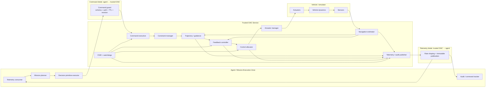
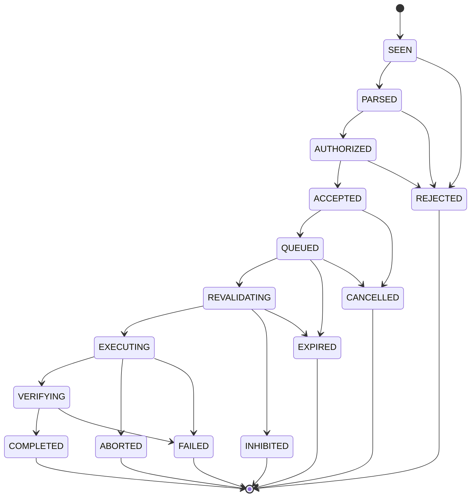
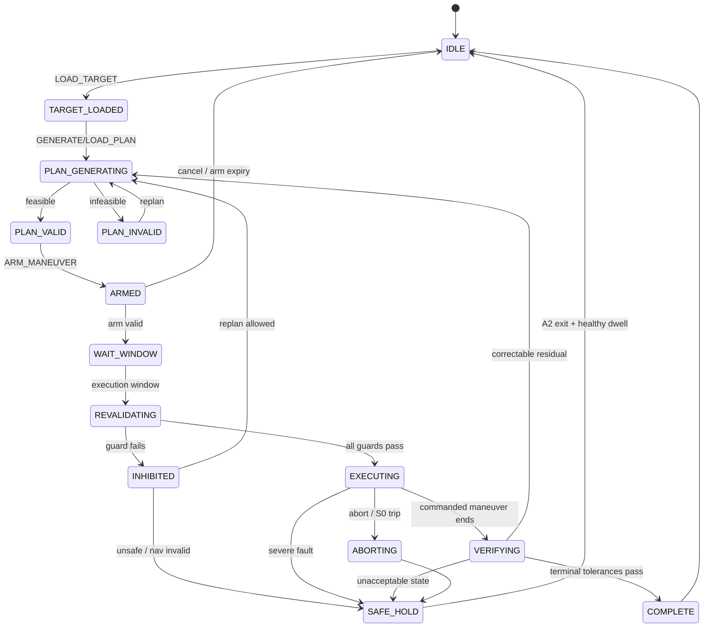
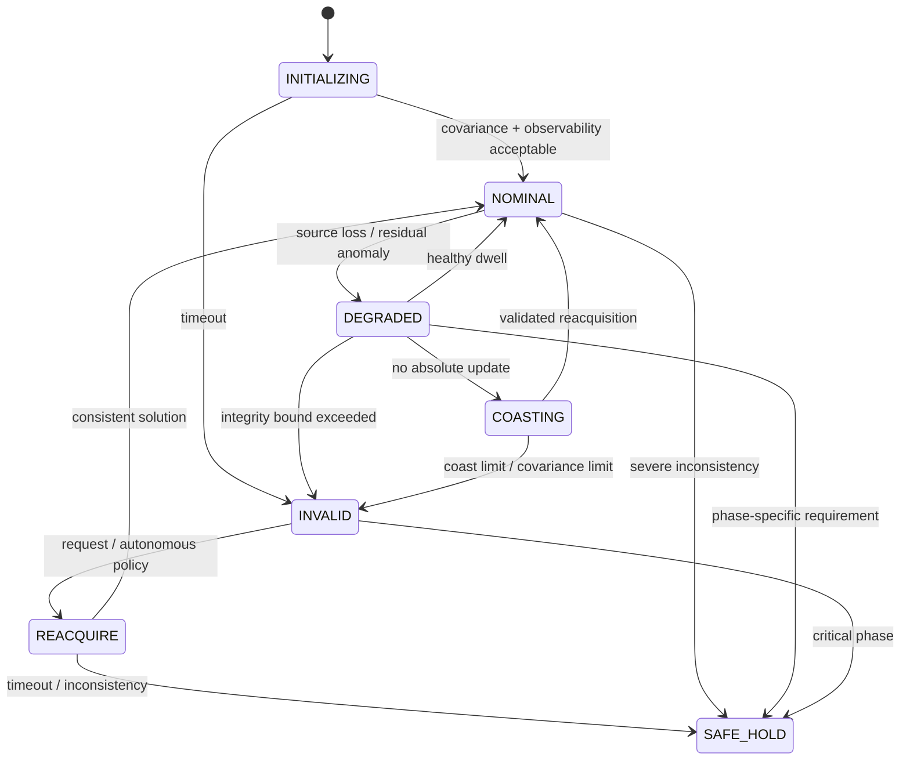
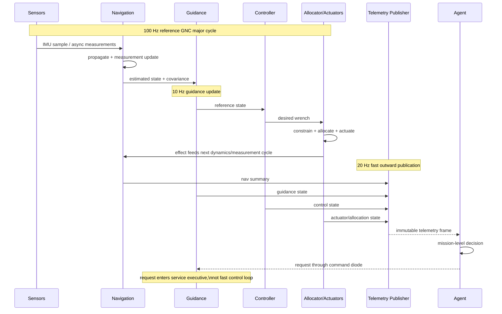
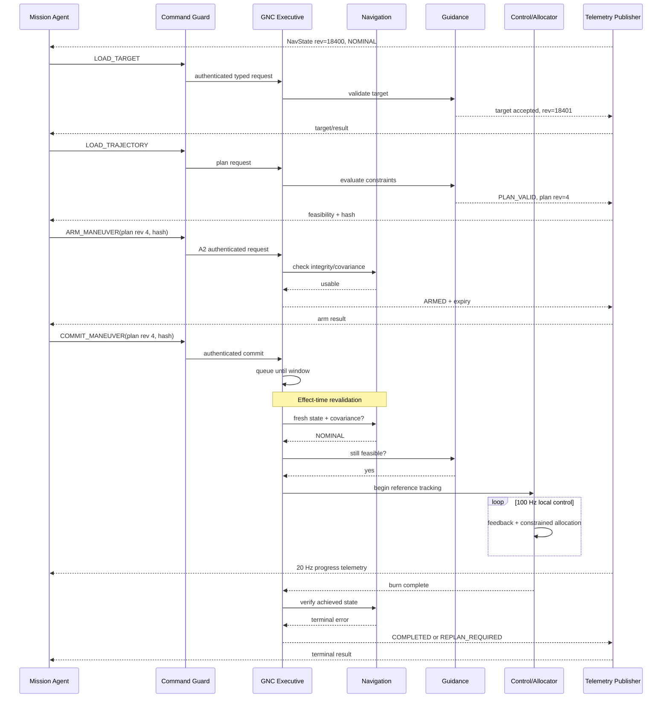

# Mapping Guidance, Navigation, and Trajectory/GNC into a Diode-Pattern Executable Mission Interface

## Executive summary

This report specifies how a Guidance, Navigation, and Trajectory / Guidance, Navigation, and Control subsystem should be exposed through the existing diode pattern so that autonomous agents can implement a **mission-execution layer** without becoming the spacecraft's safety-critical inner-loop controller.

The central architectural conclusion is:

> **Expose GNT/GNC as a stateful intent-and-evidence service, not as a remote actuator bus.**

NASA's current definition is useful here: guidance generates commands defining the desired flight path, navigation determines where the vehicle is, and control manipulates steering controls to track guidance while maintaining required pointing. NASA further distinguishes phases in which flight-path and attitude dynamics can be treated loosely from phases such as entry, descent, and landing where they are strongly coupled. citeturn11view0 NASA's May 2026 small-spacecraft survey similarly treats GNC as the integration of position determination, attitude determination, sensors, and actuators, with reaction wheels, magnetic torquers, and thrusters as common effectors. citeturn19view2

The prior diode specification already provides the right security kernel: a closed vocabulary, asymmetric reach, authoritative service-side state, declarative/idempotent commands, destructive atomic intake, bounded telemetry history, re-evaluation of authority when an action actually takes effect, and a safety/abort authority that agents cannot override. fileciteturn0file3 The prior spacecraft simulation further established a critical epistemic rule: agents should observe telemetry and instrument-derived estimates rather than hidden physical truth, and its preliminary GNC surface already included attitude quaternion, body rates, position/velocity, navigation uncertainty, IMU alignment, radar, guidance mode, state-vector loading, and navigation-source selection. fileciteturn0file0 The ECLSS and EPDS specifications then refined the pattern into **two independently one-way logical paths**, typed commands, per-principal ingress, explicit authority levels, command lifecycle records, quality/provenance metadata, anti-replay semantics, and effect-time revalidation. fileciteturn0file1 fileciteturn0file2

For GNC, those foundations need one decisive refinement: **the diode boundary must sit above the fast closed control loop**.

Agents may decide *what maneuver should occur*, *which target or trajectory should become active*, *whether a maneuver should be armed or committed*, *which navigation-source policy should be preferred*, *whether to hold or abort*, and *when a replan is required*. They should not normally send 100 Hz thruster pulses, wheel torques, gimbal deflections, or raw control-law outputs across the diode. The trusted GNC service should perform state estimation, guidance interpolation, control, allocation, actuator-limit enforcement, deadline monitoring, and fault accommodation locally. That division is consistent with NASA's experience with integrated GNC architectures and automation/sequencing: Orion's GNC work explicitly treated external interfaces, functional architecture, automation, sequencing, data-driven configuration, and fault-recovery interactions as integrated flight-software concerns. citeturn20search0turn20search1turn20search3turn20search5

The proposed logical topology is therefore:



A literal hardware data diode permits information in only one direction, so an external agent that both observes telemetry and requests effects requires **two unidirectional boundaries in opposite directions**. NIST explicitly defines a data diode as a device that permits data to travel only one way, and describes a unidirectional gateway's hardware as physically unable to return information to the source network. citeturn7search0turn7search1 If only one physical diode is permitted, then the mission-execution agent must reside on the trusted vehicle side of that diode; an external agent can only observe.

The recommended reference implementation uses:

| Layer | Reference cadence | Responsibility |
|---|---:|---|
| Local hard protection | 100–1000 Hz or hardware-driven | inhibit unsafe actuator effects, rate/current/thermal limits |
| Control + allocation | 100 Hz baseline | attitude/translation feedback and effectors |
| Navigation propagation | 100 Hz baseline | IMU propagation, covariance propagation |
| Measurement updates | asynchronous | GNSS, star tracker, radar/LiDAR, optical nav, etc. |
| Guidance | 10 Hz baseline | trajectory/reference generation and terminal guidance |
| Agent command intake | 20 Hz | ≤50 ms nominal intake opportunity |
| Fast outward telemetry | 20 Hz | state, attitude, control/allocation summaries |
| Normal navigation/guidance | 10 Hz | navigation and reference state |
| Engineering/health | 1–2 Hz | covariance, sensor health, CPU/deadlines |
| Events/results | immediate | faults, mode changes, command lifecycle |

These are **reference-profile values, not universal spacecraft requirements**. Vehicle class, phase of flight, dynamics, actuator bandwidth, sensor suite, RTOS, processor, communication budget, and required control stability margins are unspecified. NASA's own current survey shows why hard-coding one GNC configuration would be inappropriate: GNC sensing and actuation differ substantially between Earth orbit, deep space, and different spacecraft classes. citeturn19view2

The remainder of this report turns that architecture into an executable specification.

## Scope, assumptions, and architectural boundary

**Requester:** the user of this report.

**Specification status:** proposed GNT/GNC extension of the prior diode/capsule/ECLSS/EPDS reference specifications, dated September 12, 2026.

**Terminology.** This report uses **GNT** when discussing the guidance/navigation/trajectory information surface exposed to mission execution, and **GNC** for the complete onboard function including closed-loop control and actuator allocation. This distinction is intentional. Trajectory planning and maneuver intent are appropriate agent-level concepts; millisecond-scale actuator stabilization is not.

NASA describes guidance as generating the desired flight path, navigation as determining vehicle state, and control as tracking guidance through steering controls. citeturn11view0 NASA JSC's present-day GN&C capability set spans end-to-end trajectory optimization, orbit determination, attitude determination, onboard autonomous navigation, rendezvous/targeting, advanced guidance, and actuator/control design. citeturn19view1 That breadth argues for a modular contract rather than one vehicle-specific monolith.

### Assumptions and explicitly unspecified items

The following are deliberately **unspecified**, as requested:

| Item | Status | Implication for this specification |
|---|---|---|
| Vehicle type | Unspecified | No fixed mass, inertia, thrust, aerodynamic, landing, rendezvous, or orbital model is assumed. |
| Crewed/uncrewed | Unspecified | Human-command veto and manual control must be configurable; safety authority remains local either way. |
| Central body/environment | Unspecified | Gravity model, ephemeris, atmosphere, magnetic field, terrain, and rotating-frame definitions are configuration data. |
| Mission phase | Unspecified | Command availability and rate profiles are phase-dependent. |
| Actuator suite | Unspecified | Allocation supports wheels, CMGs, magnetic torquers, RCS, main engines, gimbals, aerosurfaces, or subsets. |
| Sensor suite | Unspecified | The schema supports IMU, star tracker, GNSS, radio/ranging, radar/LiDAR, optical navigation and mission-specific sensors. |
| Communication bandwidth | Unspecified | Rates below are a reference profile and must be down-selectable without changing semantics. |
| Communication latency | Unspecified | Agent decision logic may not form a stability-critical feedback loop across the diode. |
| RTOS | Unspecified | APIs are portable; deadline classes rather than OS primitives are normative. |
| Processor architecture | Unspecified | Timing limits are expressed as deadlines and measured WCET margins rather than assumed CPU utilization. |
| Time source | Unspecified | A mission monotonic timescale is mandatory; UTC/TAI/GPS correlation is separately declared. |
| Serialization | JSON + Protobuf reference | Protobuf is recommended for operational binary transport; JSON is a human-readable diagnostic representation. |
| Cryptographic suite | Mission-defined | Identity/authentication semantics are normative; specific algorithms are deployment-specific. |
| Flight-certification regime | Unspecified | Verification must be tailored to mission assurance class. NASA's current software-safety standard requires systematic software assurance, safety and IV&V across the software lifecycle. citeturn19view0 |
| Dynamics fidelity | Unspecified | Interface semantics are invariant across simple point-mass simulations and 6-DOF high-fidelity vehicles. |
| Propulsion ownership | Unspecified | Main-engine ignition may belong to propulsion; GNC then produces constrained guidance requests rather than bypassing propulsion interlocks. |
| Ground/onboard agent placement | Unspecified | Physical diode topology determines whether one or two unidirectional paths are required. |

No reference rate in this document should be interpreted as a control-design requirement for an unspecified spacecraft. In particular, the earlier capsule specification suggested a 50 Hz physics clock with 10 Hz normal fast telemetry and 50 Hz burst telemetry. fileciteturn0file0 This GNC extension makes internal rates configurable and chooses a **100 Hz reference inner-loop profile** because GNC may need finer time resolution than general spacecraft systems. The prior 50 Hz profile remains valid for slower simulation configurations.

### Trusted versus agent authority

The controlling principle is:

> **Agents choose bounded mission intent; trusted GNC decides whether, when, and how that intent becomes actuator effect.**

The trusted side owns:

- navigation filter state and covariance;
- sensor validity and residual tests;
- active reference-frame definitions;
- hard keep-out and flight-envelope limits;
- maximum force, torque, rate, acceleration, jerk, duty cycle and actuator limits;
- actuator availability/effectiveness;
- local safing and abort actions;
- command authentication and anti-replay state;
- command lifecycle and audit history;
- sequence/revision counters;
- exact actuation time;
- hard real-time watchdogs;
- FDIR;
- safety-critical mode transition guards.

Agents may never set `sensor_quality=GOOD`, decrement covariance by assertion, modify actuator feedback, overwrite command results, relax hard safety envelopes, change trusted clock state, or modify the state revision they are referencing.

This extends the prior diode rule that published state is a mirror and never an input. fileciteturn0file3 It also preserves the ECLSS/EPDS authority model in which local service protection dominates agent requests. fileciteturn0file1 fileciteturn0file2

### Information classes

Every externally visible GNC datum carries a semantic class:

| Class | Meaning | Example |
|---|---|---|
| `MEASUREMENT` | direct or processed sensor observation | star-tracker quaternion |
| `ESTIMATE` | state inferred by estimator | navigation position |
| `REFERENCE` | desired state produced by guidance | desired velocity |
| `COMMAND` | requested or computed control effect | requested body torque |
| `ACTUATOR_OUTPUT` | final service-issued setpoint | wheel torque / thruster duty |
| `FEEDBACK` | measured actuator consequence | wheel speed / gimbal angle |
| `SERVICE_STATE` | authoritative software/FDIR state | `MANEUVER_ARMED` |
| `MODEL` | computed environment/model value | predicted gravity acceleration |
| `EVENT` | discrete occurrence | navigation integrity lost |

A simulator should preserve the earlier rule that telemetry is **evidence rather than omniscient truth**. fileciteturn0file0 Thus a stuck thruster should normally emerge as a divergence between commanded actuation, sensed actuator state, acceleration, and navigation residuals—not as an agent-visible `hidden_truth.thruster_stuck=true` unless a real diagnostic would produce that indication.

### Standards baseline

The interface deliberately borrows semantic concepts rather than copying a space-link standard wholesale. CCSDS currently publishes separate recommended standards for orbit-data messages and attitude-data messages; Orbit Data Messages Issue 3 was published in May 2023, while Attitude Data Messages Issue 2 was published in January 2024. citeturn13view1turn15search1 CCSDS also maintains a standard time-code framework. citeturn15search2 These support the decision that **epoch, coordinate frame, attitude convention, covariance semantics, and metadata must never be implicit**.

For a CCSDS space link, CCSDS 355.0-B-2 defines data-link security machinery for authentication and/or confidentiality. citeturn15search0turn15search7 It is an optional outer transport for this specification, not a substitute for command-level authorization and revalidation.

NASA cFE is also a useful implementation analogue: it exposes software bus, time, event, executive, table and file services through APIs, while NASA's cFS Scheduler generates software-bus messages at predetermined configurable timing intervals. citeturn12view0turn12view1 NASA's Stored Command application supports absolute and relative time-tagged command sequences. citeturn12view2 Those are consistent with this specification's explicit scheduler and effect-time revalidation, but they do not supersede the diode boundary.

## Diode specification and executable interfaces

### Channel topology

A conforming implementation exposes these logical surfaces:

| Surface | Direction | Writer | Reader | Semantics |
|---|---|---|---|---|
| `cmd/<principal>/request` | Agent → GNC | one authenticated principal | command guard | typed requests only |
| `cmd_result` | GNC → Agent | trusted service | all authorized observers | lifecycle/result |
| `telemetry/fast` | GNC → Agent | trusted publisher | observers | attitude/control/nav fast state |
| `telemetry/nav` | GNC → Agent | trusted publisher | observers | state estimate and integrity |
| `telemetry/guidance` | GNC → Agent | trusted publisher | observers | active trajectory/reference |
| `telemetry/sensors` | GNC → Agent | trusted publisher | observers | bounded measurement summaries |
| `telemetry/actuators` | GNC → Agent | trusted publisher | observers | requested/final/measured actuator state |
| `telemetry/health` | GNC → Agent | trusted publisher | observers | estimator/control/processor health |
| `events` | GNC → Agent | trusted publisher | observers | asynchronous events |
| `capabilities` | GNC → Agent | trusted publisher | observers | current vocabulary, limits, gates |
| `history` | GNC → Agent | trusted publisher | observers | bounded ring/archive |

A file-backed implementation can realize these as directories or fixed-slot ring files. A message-bus implementation can realize them as topics. The **direction and authority semantics are normative; filesystem names are not**.

Each principal should get an independent ingress queue, carrying forward the prior spacecraft recommendation that per-host/per-principal ingress avoids shared-file lost-update races without dictating how multiple agents must organize themselves. fileciteturn0file0

### Common message envelope

Every command or telemetry record has an immutable envelope:

| Field | Type | Required | Meaning |
|---|---|---:|---|
| `schema_version` | `uint32` | yes | wire schema major/minor encoding |
| `message_type` | enum | yes | exact message class |
| `message_id` | UUID/128-bit | yes | unique publication/request identifier |
| `sequence` | `uint64` | yes | monotonic per producer/topic |
| `mission_time_ns` | `uint64` | yes | service monotonic mission time |
| `source_time_ns` | `uint64` | conditional | physical sample/effect time |
| `publish_time_ns` | `uint64` | telemetry | trusted publication time |
| `expires_time_ns` | `uint64` | commands | hard expiry |
| `state_revision` | `uint64` | yes | coherent trusted-state revision |
| `frame_revision` | `uint32` | state messages | coordinate-frame-definition revision |
| `producer_id` | fixed enum/string | yes | trusted publisher |
| `principal_id` | fixed ID | command results | guard-attested caller |
| `priority` | enum | yes | `P0`–`P5` |
| `quality` | enum | telemetry | quality at publication |
| `payload_crc` | `fixed32` | optional | accidental corruption detection |
| `auth_context` | opaque trusted metadata | deployment | verified identity/security association |

The **trusted ingress guard, not the agent, populates authoritative `principal_id`, role and authenticated authority level**.

Time must have two distinct meanings where relevant: when a sensor sampled the world and when the datum was published. This carries forward the ECLSS specification's explicit distinction between sample time and publish time. fileciteturn0file1 It also permits agents to distinguish “old but newly retransmitted” from “freshly measured.”

### Command envelope

```text
CommandRequest {
    command_id
    principal-attested identity
    authority_required
    issued_at
    not_before
    expires_at
    base_state_revision
    base_plan_revision
    deduplication_key
    command_type
    typed payload
}
```

`base_state_revision` implements optimistic concurrency: a maneuver based on state revision 18,430 must not silently execute against revision 21,012 if the command explicitly requires the earlier state.

For time-tagged commands, `not_before` means “eligible for re-evaluation after this time,” **not** “pre-authorized to execute.” The action must traverse authorization, state, phase, constraint, actuator, and FDIR checks again immediately before effect. This is the GNC form of the prior diode's most reusable safety property: authorization is re-evaluated at delivery. fileciteturn0file3 NASA's Stored Command application provides historical precedent for absolute and relative command timing, although the additional effect-time safety check here is specific to this architecture. citeturn12view2

### Command lifecycle



Each transition produces a result/event record, not merely the terminal state. This makes “request was received,” “request was authorized,” “request has become executable,” and “the physical effect succeeded” separable facts.

### Allowed mission-execution command vocabulary

The recommended closed vocabulary is:

| Command | Normal authority | Reversible? | Principal semantics |
|---|---:|---|---|
| `ENTER_SAFE_HOLD` | A1 | yes, exit controlled | Request immediate transition to trusted safe-hold logic |
| `SET_GNC_MODE` | A1/A2 | usually | Select allowed service mode |
| `SET_ATTITUDE_TARGET` | A1 | yes | Desired orientation/rate within hard envelope |
| `LOAD_TARGET` | A1 | yes | Load navigation/guidance target |
| `LOAD_TRAJECTORY` | A2 | yes until commit | Load bounded trajectory/reference segments |
| `VALIDATE_TRAJECTORY` | A1 | yes | Request trusted feasibility analysis |
| `ARM_MANEUVER` | A2 | yes until commit | Create short-lived execution arm |
| `COMMIT_MANEUVER` | A2 | effect may not be reversible | Authorize active execution of matching armed plan |
| `ABORT_MANEUVER` | A1 | n/a | Request local abort/safe transition |
| `CANCEL_PENDING` | A1 | yes if not committed | Cancel queued command |
| `SET_NAV_SOURCE_POLICY` | A1/A2 | yes | Prefer/inhibit eligible source; cannot mark bad data good |
| `LOAD_NAV_UPDATE` | A2 | yes logically, safety-significant | Submit externally determined state/covariance correction |
| `REQUEST_NAV_REACQUIRE` | A1 | yes | Trigger star/radio/GNSS/optical reacquisition procedure |
| `SET_SENSOR_MODE` | A1 | yes | Change sensor operational mode where safe |
| `SET_ACTUATOR_GROUP_STATE` | A2 | yes if hardware permits | Enable/inhibit a redundant actuator group |
| `REQUEST_MOMENTUM_DUMP` | A2 | yes until execution | Ask trusted allocator to desaturate wheels/CMGs |
| `SET_AGENT_CONSTRAINT` | A1 | yes | Tighten, never relax, operator hard envelopes |
| `SET_TELEMETRY_PROFILE` | A0/A1 | yes | Change rate/profile inside operator bandwidth ceiling |
| `ACK_EVENT` | A0 | yes | Record acknowledgement; no safety effect |
| `TEST_ACTUATOR` | A3/test only | potentially hazardous | Ground/test mode only; inhibited in normal flight |

`SET_AGENT_CONSTRAINT` follows the same monotonic-authority principle as the prior diode's “agent can lower an allowance but cannot raise the operator ceiling.” fileciteturn0file3 An agent may reserve more propellant, demand a larger keep-out distance, lower maximum maneuver acceleration, or impose a stricter covariance requirement. It may not relax service-owned hard safety minima/maxima.

Normal mission agents **do not receive**:

```text
FIRE_THRUSTER_7
SET_WHEEL_2_TORQUE_RAW
WRITE_ESTIMATOR_COVARIANCE
SET_SENSOR_VALID=true
DISABLE_NAV_INTEGRITY_MONITOR
OVERRIDE_KEEP_OUT
IGNORE_WATCHDOG
WRITE_ACTUATOR_FEEDBACK
```

Those would collapse the safety separation the diode is intended to create.

### Authority model

| Level | Owner | Typical operations |
|---|---|---|
| `S0` | trusted autonomous safety kernel | actuator inhibits, emergency safing, local abort, FDIR |
| `A0` | observer | telemetry, event acknowledgement, diagnostics |
| `A1` | normal mission execution | targets, attitude requests, safe hold, telemetry profile |
| `A2` | safety-significant operations | nav updates, arm/commit burn, actuator-group changes, exit safe hold |
| `A3` | exceptional/test/irreversible | hazardous test paths, separation-related cross-subsystem commitments |

`S0` is not obtainable by an agent. An A3 credential still does not disable `S0`.

For safety-significant cross-subsystem actions, authority should be compositional rather than transitive. A GNC `COMMIT_MANEUVER` may authorize a desired thrust profile, but propulsion remains responsible for its own valve, ignition, tank, thermal and engine interlocks. This keeps the subsystem-boundary discipline established in the prior spacecraft, ECLSS and EPDS work. fileciteturn0file0 fileciteturn0file1 fileciteturn0file2

### Failure modes at the diode boundary

| Failure | Required behavior |
|---|---|
| malformed serialization | reject entire message; no partial execution |
| unknown command/enum | reject closed |
| oversized payload | reject before parsing large dynamic structures |
| duplicate `command_id` | return prior terminal/nonterminal status; do not re-effect |
| sequence rollback | reject as replay |
| expired command | `EXPIRED` |
| future command beyond scheduling horizon | reject or bounded schedule |
| stale `base_state_revision` | `CONFLICT_STALE_STATE` |
| plan revision/hash mismatch | inhibit commit |
| invalid frame ID/revision | reject |
| non-normalized quaternion | reject or normalize only where contract explicitly permits |
| NaN/Inf | reject |
| out-of-range target | reject |
| unauthorized principal | reject without disclosing privileged details |
| command queue full | reject lower-priority work; preserve abort/safe commands |
| command diode lost | local GNC continues last valid autonomous policy or safe policy |
| telemetry diode lost | local GNC continues; agents treat data as stale and cease unsafe decisions |
| trusted service restart | reconstruct persistent command/audit/anti-replay state before accepting safety-significant commands |
| execution acknowledgement lost | idempotent re-query/reassertion must not duplicate effect |
| authentication verification unavailable | fail closed for state-changing commands |
| FDIR conflict | S0 wins |

## Telemetry contract, rates, priorities, and schemas

### Coordinate and time conventions

No vector is valid without a declared frame.

The minimum frame registry contains:

```text
frame_id
frame_revision
origin
orientation_parent
orientation_definition
epoch
central_body
rotating_or_inertial
realization/model identifier
```

Examples might include `J2000`, `ICRF`, `BODY`, `LVLH`, `TARGET_RELATIVE`, `MOON_FIXED`, or mission-defined frames, but the actual list is configuration-specific.

CCSDS Orbit Data Messages standardize exchanges of spacecraft orbit information, while CCSDS Attitude Data Messages separately standardize attitude exchange, which reinforces treating frame/attitude metadata as first-class rather than implied knowledge. citeturn13view1turn15search1

The canonical scalar conventions in this diode specification are:

- SI units internally and on the executable interface;
- metres, seconds, kilograms, radians, newtons and newton-metres;
- quaternions dimensionless;
- quaternion serialization order explicitly fixed as `[w,x,y,z]`;
- `attitude_ref_from_body` means the quaternion rotating a coordinate vector from BODY into the named reference frame;
- angular velocity explicitly identifies which frame is rotating relative to which, and the coordinates in which it is resolved;
- covariance units are documented per matrix block rather than hidden behind one generic unit;
- mission time is monotonic and cannot jump backward.

### Quality vocabulary

Every measurement or estimate includes:

```text
GOOD
SUSPECT
STALE
SATURATED
OUT_OF_RANGE
INVALID
ESTIMATED
DEGRADED
NOT_AVAILABLE
```

Quality and estimator inclusion are separate. A datum can be published as `SUSPECT` while excluded from the filter, which is diagnostically useful.

### Navigation state

Recommended `NavState` schema:

| Field | Type | Units | Baseline rate | Notes |
|---|---|---:|---:|---|
| `sample_time_ns` | `uint64` | ns MET | 10 Hz published | estimator epoch |
| `frame_id` | enum/ID | — | on change + each state | position/velocity frame |
| `frame_revision` | `uint32` | — | each state | protects changed definitions |
| `position_m[3]` | `double` | m | 10 Hz | estimated position |
| `velocity_mps[3]` | `double` | m/s | 10 Hz | estimated velocity |
| `attitude_ref_from_body_q[4]` | `double` | — | 20 Hz fast / 10 Hz nav | normalized quaternion |
| `body_rate_body_rps[3]` | `double` | rad/s | 20 Hz | BODY wrt reference, resolved in BODY |
| `accel_bias_mps2[3]` | `double` | m/s² | 2 Hz | if estimated |
| `gyro_bias_rps[3]` | `double` | rad/s | 2 Hz | if estimated |
| `pv_covariance_6x6` | `double[36]` or packed symmetric | mixed | 2–5 Hz | p/v covariance |
| `attitude_error_cov_3x3_rad2` | `double[9]` | rad² | 2–5 Hz | small-angle covariance |
| `bias_covariance` | structured | mixed | 1–2 Hz | estimator dependent |
| `solution_status` | enum | — | event + 2 Hz | nominal/degraded/coast/invalid |
| `sensor_source_mask` | bitset | — | 2 Hz | inputs accepted into solution |
| `solution_age_ms` | `uint32` | ms | 10 Hz | age of last correction |
| `innovation_nis` | `double` | — | measurement-event/2 Hz | innovation consistency metric |
| `position_3sigma_m[3]` | `double` | m | 2 Hz | convenience derived field |
| `velocity_3sigma_mps[3]` | `double` | m/s | 2 Hz | convenience |
| `attitude_3sigma_rad[3]` | `double` | rad | 2 Hz | convenience |
| `propagator_model_id` | enum/hash | — | change/0.2 Hz | gravity/environment model |
| `filter_config_revision` | `uint32` | — | change/1 Hz | estimator configuration |
| `quality` | enum | — | each | whole-solution quality |

Separating the position/velocity covariance from the attitude small-angle covariance avoids a poorly documented single matrix containing dimensions of metres, metres/second, radians, accelerometer bias, gyro bias and perhaps clock states. Internally an error-state EKF can still maintain a single 15-, 18-, or larger-state covariance.

NASA's WMAP implementation provides a direct spacecraft precedent for an onboard EKF estimating attitude and gyro-bias errors and resolving them into a spacecraft quaternion and gyro bias. citeturn16search2turn17search12

### Guidance and trajectory state

| Field | Type | Units | Rate | Meaning |
|---|---|---:|---:|---|
| `guidance_mode` | enum | — | event + 10 Hz | hold, coast, burn, rendezvous, landing, etc. |
| `mission_phase` | enum | — | event + 1 Hz | service-owned phase |
| `plan_id` | UUID | — | each | active plan |
| `plan_revision` | `uint64` | — | each | active revision |
| `plan_hash` | bytes | — | change | exact validated artifact |
| `segment_index` | `uint32` | — | 10 Hz | active segment |
| `target_id` | ID | — | change + 1 Hz | destination/object |
| `reference_frame` | ID | — | each | reference-state frame |
| `desired_position_m[3]` | double | m | 10 Hz | current trajectory reference |
| `desired_velocity_mps[3]` | double | m/s | 10 Hz | reference |
| `desired_accel_mps2[3]` | double | m/s² | 10 Hz | reference/feed-forward |
| `desired_attitude_q[4]` | double | — | 10–20 Hz | attitude reference |
| `desired_rate_rps[3]` | double | rad/s | 10–20 Hz | body-rate reference |
| `delta_v_target_mps[3]` | double | m/s | burn/event | maneuver target |
| `delta_v_remaining_mps[3]` | double | m/s | 10 Hz burn | integrated residual |
| `time_to_go_s` | double | s | 10 Hz | current guidance estimate |
| `terminal_position_error_m[3]` | double | m | 10 Hz | predicted/actual as tagged |
| `terminal_velocity_error_mps[3]` | double | m/s | 10 Hz | predicted/actual |
| `corridor_margin` | double | mission-defined SI | 10 Hz | signed safety margin |
| `constraints_active[]` | repeated enum | — | change + 2 Hz | binding constraints |
| `feasibility` | enum | — | event + 2 Hz | feasible/degraded/infeasible |
| `predicted_propellant_kg` | double | kg | 1 Hz | if model available |
| `guidance_model_revision` | `uint32` | — | change | reproducibility |

NASA's trajectory-design work treats trajectory design broadly as solving nonlinear equations or optimization problems with equality and inequality constraints, while JPL's pseudo-waypoint work applies model-predictive ideas and convexification to dynamics, control, state and trajectory constraints. citeturn17search1turn17search0 NASA JSC's current GN&C work likewise includes convex optimization and predictor-corrector guidance. citeturn19view1

### Sensor-input telemetry

The trusted service may ingest sensors faster than agents need to receive them. Publish summaries continuously and raw/burst data only when justified.

**Common measurement envelope**

| Field | Type | Meaning |
|---|---|---|
| `sensor_id` | enum/ID | immutable configured sensor |
| `sensor_type` | enum | IMU/star/GNSS/radar/LiDAR/etc. |
| `sensor_seq` | uint64 | per-sensor sequence |
| `sample_time_ns` | uint64 | actual measurement epoch |
| `receive_time_ns` | uint64 | trusted-service receive time |
| `measurement_frame` | ID | vector/reference frame |
| `quality` | enum | measurement quality |
| `used_by_estimator` | bool | whether accepted |
| `rejection_reason` | enum | NIS/range/stale/mode/etc. |
| `measurement_covariance` | typed matrix | measurement uncertainty |
| `calibration_revision` | uint32 | applied calibration |
| `latency_us` | uint32 | derived acquisition latency |

Recommended sensor payloads:

| Topic | Fields | Internal rate | Outward normal rate |
|---|---|---:|---:|
| IMU | `delta_angle_rad[3]`, `delta_velocity_mps[3]`, temperature, saturation flags | 100–1000 Hz vehicle-dependent | 10–20 Hz summary; burst raw |
| Gyro | rate, bias-corrected rate, status | 100+ Hz | 20 Hz |
| Accelerometer | specific force, saturation | 100+ Hz | 20 Hz |
| Star tracker | quaternion, confidence, stars tracked | 1–20 Hz | sensor rate |
| Sun/horizon/magnetometer | measured vector | 1–50 Hz | ≤10 Hz |
| GNSS | position, velocity, clock status, fix type | 1–20 Hz | sensor rate |
| Radio/range | range, range-rate, bearing | asynchronous | event/sample |
| Radar/LiDAR altimeter | range, range-rate, quality | 5–100 Hz phase-specific | 10–20 Hz |
| Optical navigation | LOS/vector/feature solution and covariance | 0.1–30 Hz | sample/event |
| Terrain-relative nav | relative pose/velocity/confidence | phase-specific | 10–20 Hz |

NASA's current GNC survey identifies star trackers, sun sensors, horizon sensors, magnetometers, gyros, accelerometers, GNSS, deep-space radio techniques and LiDAR among current GNC sensing technologies. citeturn19view2

### Control and actuator telemetry

Agents should be able to audit the mapping from guidance to actual effect without being able to rewrite it.

| Field | Type | Units | Rate |
|---|---|---:|---:|
| `desired_body_force_n[3]` | double | N | 20 Hz |
| `desired_body_torque_nm[3]` | double | N·m | 20 Hz |
| `allocated_body_force_n[3]` | double | N | 20 Hz |
| `allocated_body_torque_nm[3]` | double | N·m | 20 Hz |
| `allocation_residual_force_n[3]` | double | N | 20 Hz |
| `allocation_residual_torque_nm[3]` | double | N·m | 20 Hz |
| `allocation_status` | enum | — | event + 20 Hz |
| `saturation_mask` | bitset | — | event + 20 Hz |
| `actuator_available_mask` | bitset | — | event + 2 Hz |
| `command_epoch_ns` | uint64 | ns | each |
| `actuator_setpoints[]` | typed repeated | actuator-specific | 20 Hz |
| `actuator_feedback[]` | typed repeated | actuator-specific | 20 Hz |
| `effectiveness_estimate[]` | double | ratio | 1–2 Hz |
| `control_mode` | enum | — | event + 2 Hz |
| `controller_revision` | uint32 | — | change |
| `allocator_revision` | uint32 | — | change |

Typical actuator records include wheel torque/speed, CMG gimbal rates, magnetic dipole commands, thruster requested/final pulse width or duty cycle, engine throttle, and gimbal angle/rate. NASA notes, for example, that reaction wheels store angular momentum and may saturate, requiring desaturation through an external-torque actuator; redundant/skewed configurations can offer reduced control after failures. citeturn18view0

### Health/status telemetry

| Field | Type | Rate | Meaning |
|---|---|---:|---|
| `gnc_service_state` | enum | event + 2 Hz | nominal/degraded/safe/restarting |
| `nav_integrity` | enum | event + 2 Hz | solution usability |
| `guidance_health` | enum | event + 2 Hz | feasible/stale/infeasible |
| `control_health` | enum | event + 2 Hz | controller status |
| `allocation_health` | enum | event + 2 Hz | full/degraded authority |
| `deadline_miss_count` | uint64 | 1 Hz | since reset |
| `worst_cycle_us` | uint32 | 1 Hz | timing monitor |
| `current_cycle_us` | uint32 | 2 Hz | diagnostic |
| `queue_depth` | uint32 | 2 Hz | command queue |
| `telemetry_drop_count` | uint64 | 1 Hz | publisher losses |
| `sensor_fault_mask` | bitset | event + 2 Hz | isolated sensors |
| `actuator_fault_mask` | bitset | event + 2 Hz | isolated effectors |
| `clock_status` | enum | event + 1 Hz | synchronized/degraded |
| `model_validity` | enum | 1 Hz | environment-model status |
| `watchdog_status[]` | repeated | 1 Hz | per-watchdog state |
| `last_safe_action` | enum | event + 1 Hz | last S0 action |

### Message priorities and rates

| Priority | Delivery intent | Examples | Nominal publication |
|---|---|---|---:|
| **P0** | never intentionally suppressed; event/audit critical | abort, watchdog trip, nav invalid, command result | immediate + heartbeat |
| **P1** | control-operational | fast attitude, rates, desired/allocated wrench, burn progress | 20 Hz |
| **P2** | mission-execution | `NavState`, `GuidanceState`, sensor summary | 10 Hz |
| **P3** | engineering | covariance details, individual actuator status | 2–5 Hz |
| **P4** | slow health/model | CPU timing, model revisions, calibration | 0.2–2 Hz |
| **P5** | diagnostic/bulk | raw IMU burst, debug traces | explicit bounded burst |

Under bandwidth pressure, the publisher drops or decimates **P5 first and P0 last**. It must never silently decimate all classes equally.

A suitable bounded-history policy is:

- P0: persistent audit or mission-configured retention;
- P1/P2: 10–30 minutes ring;
- P3/P4: longer lower-rate ring;
- P5: short fixed-size burst buffers.

The prior capsule specification explicitly concluded that evolving vehicle state needs bounded history rather than only `state.json`, because an agent returning after a processing blackout needs to reconstruct trends. fileciteturn0file3

## Decision primitives, state machines, and GNC algorithms

### Agent-level decision primitives

The mission-execution layer should be able to construct missions from a deliberately small set of deterministic primitives:

| Primitive | Preconditions | Effect | Terminal evidence |
|---|---|---|---|
| `OBSERVE_GNC` | telemetry fresh | no effect | coherent state revision |
| `ASSERT_NAV_USABLE` | nav integrity within agent policy | no physical effect | pass/fail + margins |
| `LOAD_TARGET` | valid frame/target | creates target revision | target accepted |
| `GENERATE_PLAN` | target + usable nav | invokes trusted planner or validates uploaded plan | plan ID/hash |
| `VALIDATE_PLAN` | complete plan | evaluates hard/soft constraints | feasibility report |
| `ARM_PLAN` | validated plan + phase + authority | short-lived arm record | arm token/hash |
| `COMMIT_PLAN` | matching arm + fresh nav + valid window | schedules execution | commit result |
| `TRACK_EXECUTION` | active maneuver | no command required | progress/error telemetry |
| `HOLD` | allowed from current phase | stable hold reference | hold acquired |
| `REPLAN` | target remains valid | replace future uncommitted segments | new revision |
| `ABORT` | always requestable | invokes trusted abort policy | aborted/safe state |
| `REACQUIRE_NAV` | compatible sensor configuration | trusted reacquisition sequence | navigation result |
| `SAFE_HOLD` | always requestable | local safe-hold mode | safe state |

The word *primitive* is important: an agent should not need to synthesize actuator pulses to accomplish “perform a 2.3 m/s correction at the next valid window.” Its primitive should carry the target, time window and mission constraints. GNC owns tracking.

NASA's Orion work explicitly explored automation interfaces, mission sequencing, data-driven GN&C transitions and parameters, and automated fault recovery, making state- and sequence-based primitives a more flight-like abstraction than remote low-level actuation. citeturn20search0turn20search3turn20search5

### Maneuver state machine



Every arrow is service-side and guarded. Agent commands *request* transitions; they do not mutate the state enum.

### Navigation-integrity state machine



A high covariance can therefore be an **operational state transition**, not merely a number in telemetry.

### Translational guidance

A generic reference-tracking law for phases where translational and rotational dynamics can be treated separately is:

\[
\mathbf a_c =
\mathbf a_r
+ K_p(\mathbf r_r-\hat{\mathbf r})
+ K_v(\mathbf v_r-\hat{\mathbf v})
\]

where:

- \(\hat{\mathbf r},\hat{\mathbf v}\) are navigation estimates;
- \(\mathbf r_r,\mathbf v_r,\mathbf a_r\) are trajectory references;
- \(K_p,K_v\) are phase/configuration-specific gains.

A force-producing spacecraft can then form, schematically,

\[
\mathbf F_c
=
m\left(
\mathbf a_c-\mathbf a_{\text{environment}}
\right)
\]

subject to the vehicle's sign/frame convention and modeled gravity/aerodynamic accelerations.

This law is intentionally a **reference implementation**, not a universal interplanetary guidance algorithm. Mission plugins may instead use Lambert targeting, powered-descent guidance, rendezvous guidance, model-predictive guidance or numerical predictor-corrector algorithms. NASA currently uses and researches these families; Orion's powered-flight guidance, for example, includes options based on Lambert's time-of-flight problem alongside heritage and mission-specific guidance modes. citeturn20search6 NASA JSC also identifies numerical predictor-corrector and convex-optimization guidance among its present advanced methods. citeturn19view1

### Quintic trajectory segment

For bounded point-to-point reference generation, a useful deterministic primitive is a quintic polynomial per Cartesian degree of freedom.

Let \(s=t/T\), \(0\le s\le1\):

\[
p(s)=a_0+a_1s+a_2s^2+a_3s^3+a_4s^4+a_5s^5
\]

given boundary position, velocity and acceleration
\((p_0,v_0,\alpha_0)\) and \((p_f,v_f,\alpha_f)\):

\[
\begin{aligned}
a_0 &= p_0\\
a_1 &= Tv_0\\
a_2 &= \frac{T^2\alpha_0}{2}\\
a_3 &=10(p_f-p_0)-6Tv_0-4Tv_f
      -\frac{3}{2}T^2\alpha_0+\frac12T^2\alpha_f\\
a_4 &=15(p_0-p_f)+8Tv_0+7Tv_f
      +\frac32T^2\alpha_0-T^2\alpha_f\\
a_5 &=6(p_f-p_0)-3T(v_0+v_f)
      -\frac12T^2\alpha_0+\frac12T^2\alpha_f
\end{aligned}
\]

The service evaluates the complete segment against velocity, acceleration, jerk, pointing, keep-out and actuator-authority limits before marking it `PLAN_VALID`.

For complex orbital or proximity operations, optimization-based trajectory generation is preferable. NASA's generalized trajectory-design methodology explicitly formulates missions as nonlinear-equation or constrained-optimization problems, and JPL's pseudo-waypoint guidance demonstrates constrained model-predictive treatment for proximity maneuvers. citeturn17search1turn17search0

### Navigation filtering

For a generic nonlinear system:

\[
\mathbf x_k = f(\mathbf x_{k-1},\mathbf u_k)+\mathbf w_k
\]

\[
\mathbf z_k=h(\mathbf x_k)+\mathbf v_k
\]

an extended Kalman filter reference implementation uses:

**Propagation**

\[
\hat{\mathbf x}^{-}_k=f(\hat{\mathbf x}^{+}_{k-1},\mathbf u_k)
\]

\[
P^{-}_k=F_kP^{+}_{k-1}F_k^{T}+Q_k
\]

**Measurement residual**

\[
\boldsymbol\nu_k
=
\mathbf z_k-h(\hat{\mathbf x}^{-}_k)
\]

\[
S_k=H_kP^{-}_kH_k^T+R_k
\]

**Gain and update**

\[
K_k=P^{-}_kH_k^TS_k^{-1}
\]

\[
\hat{\mathbf x}^{+}_k
=
\hat{\mathbf x}^{-}_k+
K_k\boldsymbol\nu_k
\]

Use the numerically robust Joseph covariance update:

\[
P^{+}_k =
(I-K_kH_k)P^{-}_k(I-K_kH_k)^T
+
K_kR_kK_k^T
\]

The seminal state-space filtering formulation is R. E. Kalman's 1960 paper, *A New Approach to Linear Filtering and Prediction Problems*, which derives recursive covariance/error relationships for optimal linear filtering. citeturn10search0 For spacecraft attitude specifically, NASA's WMAP implementation used an EKF estimating attitude and gyro bias errors. citeturn16search2

For spacecraft attitude, the preferred implementation is usually an **error-state/multiplicative formulation** rather than treating quaternion components as unconstrained Euclidean states:

\[
\delta \mathbf x =
[
\delta \mathbf r,\,
\delta \mathbf v,\,
\delta\boldsymbol\theta,\,
\mathbf b_a,\,
\mathbf b_g
]^T
\]

with a small attitude correction

\[
\delta q \approx
\begin{bmatrix}
1\\
\frac12\delta\boldsymbol\theta
\end{bmatrix}
\]

applied multiplicatively according to the declared quaternion convention, followed by normalization.

Attitude may also be initialized or independently cross-checked from vector observations. NASA's Markley/Bauer work describes fast quaternion attitude determination using two vector measurements, including an optimal solution and a lower-computation TRIAD-equivalent solution. citeturn16search0

Measurement-consistency monitoring uses normalized innovation squared:

\[
\mathrm{NIS}
=
\boldsymbol\nu^T S^{-1}\boldsymbol\nu
\]

Thresholds are configurable by measurement dimension and mission-selected false-alarm probability; this specification does not prescribe a single magic threshold.

### Attitude control

Let \(q_e\) be the convention-declared quaternion error and \(\mathbf e_q\) its signed shortest-rotation vector part. A conventional reference law is:

\[
\boldsymbol\tau_c =
-K_q\mathbf e_q
-K_\omega(\boldsymbol\omega-\boldsymbol\omega_r)
+\boldsymbol\tau_{ff}
+\boldsymbol\omega\times J\boldsymbol\omega
\]

where the gyroscopic term is included when the dynamic model is appropriate.

Quaternion-feedback spacecraft controllers are well established in NASA work. NASA TM-109150 developed nonlinear quaternion and angular-rate feedback for large-angle rigid-spacecraft stabilization, and LRO's observing-mode controller uses quaternion feedback for fine pointing and large reorientations. citeturn17search3turn17search2

Again, this equation is the **default reference contract between guidance and allocation**, not a requirement that every spacecraft use this exact controller.

### Control allocation

The control allocator receives a requested wrench

\[
\mathbf w_c =
\begin{bmatrix}
\mathbf F_c\\
\boldsymbol\tau_c
\end{bmatrix}
\]

and an actuator-effectiveness matrix \(B\), so that approximately

\[
\mathbf w \approx B\mathbf u
\]

A reference constrained allocator solves:

\[
\min_{\mathbf u}
\left\|
W(B\mathbf u-\mathbf w_c)
\right\|_2^2
+
\lambda
\left\|
R(\mathbf u-\mathbf u_{prev})
\right\|_2^2
\]

subject to

\[
\mathbf u_{\min}\le\mathbf u\le\mathbf u_{\max}
\]

\[
|\mathbf u-\mathbf u_{prev}|
\le
\dot{\mathbf u}_{\max}\Delta t
\]

\[
A_{\mathrm{safe}}\mathbf u\le\mathbf b_{\mathrm{safe}}
\]

and

\[
u_i=0\quad\text{for inhibited/failed actuator }i.
\]

The objective explicitly trades desired-wrench residual against actuation cost/slew. NASA control-allocation work describes mapping desired body moments into effectors while accommodating actuator failures, degraded effectiveness and saturation, and NASA/JPL work has used quadratic programming with effort/residual costs and equality/inequality constraints for redundant actuators including spacecraft thrusters. citeturn16search4turn16search1

For on/off RCS hardware, the continuous allocator output feeds a pulse/duty-cycle realization layer enforcing minimum impulse bit, minimum on/off times, plume restrictions and valve constraints. It is that realization layer—not the agent—that chooses specific pulse timing.

### Constraint hierarchy

Every plan is checked in this order:

1. immutable physical/hardware limits;
2. trusted `S0` safety constraints;
3. mission/phase constraints;
4. cross-subsystem availability constraints;
5. operator-configured margins;
6. agent-specified additional constraints;
7. optimization preferences.

Higher layers cannot be relaxed by lower layers.

Constraint classes include:

| Class | Examples |
|---|---|
| Navigation integrity | covariance, observability, residual consistency, state age |
| Attitude | pointing cone, slew rate, body rate, keep-out angle |
| Translation | acceleration, velocity corridor, position corridor |
| Actuation | force/torque, gimbal, wheel momentum, duty cycle |
| Propulsion | Δv budget, minimum impulse, ignition count |
| Geometry | plume impingement, docking corridor, exclusion zone |
| Environment | aerodynamic load, heating, terrain clearance |
| Resources | power, thermal state, propellant reserve |
| Communications/payload | antenna/Sun/thermal pointing |
| Timing | maneuver window, sensor availability |
| Software | deadline margin, estimator/configuration validity |

Trajectory constraints should be represented as **machine-readable inequalities plus human-readable names**, not only free text.

## Safety, fault isolation, authentication, timing, and resource budgets

### Diode-enforced safety rules

The following invariants should be treated as normative:

**No remote tight-loop control.** General agents do not drive actuator loops across an uncertain-latency boundary.

**Fresh-state requirement.** Every safety-significant command declares a maximum acceptable state age and relevant base revisions.

**Effect-time revalidation.** `COMMIT_MANEUVER` does not guarantee ignition at acceptance. Navigation validity, attitude, trajectory constraints, effectors, resources, current phase and safety state are rechecked immediately before—and for long maneuvers, during—execution. This preserves the original diode's re-dispatch principle. fileciteturn0file3

**Fail-closed privilege.** Authentication, schema, frame or safety-check uncertainty rejects state-changing work.

**Safe commands remain available.** Queue pressure may not prevent `ABORT_MANEUVER` or `ENTER_SAFE_HOLD`.

**Hard safety constraints are not writable.**

**Published telemetry is not authoritative input.** Editing a telemetry mirror does not change the estimator or spacecraft.

**Navigation uncertainty is trusted state.** Agents cannot “fix” an uncertain solution by writing a smaller covariance.

**Agent-set constraints are monotonic.** They may only tighten service ceilings.

**Irreversible effects are explicit.** A maneuver that crosses a point after which restoration is impossible uses arm/commit and a short-lived matching plan identifier/hash, extending the prior diode's explicit irreversibility rule. fileciteturn0file3

**At least one abort/safe authority is inaccessible to agents.**

### Watchdogs

| Watchdog | Reference trigger | Trusted response |
|---|---|---|
| inner-loop deadline | configurable missed control deadline | freeze/revert control mode; S0 escalation |
| estimator deadline | propagation/update deadline miss | coast/degrade; exclude late update |
| navigation age | no usable correction for phase-specific time | `COASTING` → `INVALID` |
| covariance growth | phase-specific bound exceeded | inhibit maneuver / safe hold |
| innovation consistency | repeated residual failure | isolate source; degrade nav |
| quaternion norm | outside numerical bound | reject state / estimator recovery |
| guidance freshness | reference generation stale | hold last bounded reference briefly then safe |
| allocator residual | desired wrench not achievable | degraded authority event / abort if critical |
| actuator following | command-feedback discrepancy | isolate or reconfigure effector |
| wheel momentum | near saturation | request/perform configured desaturation |
| thruster stuck-on | sensed acceleration/valve mismatch | inhibit opposing logic / emergency policy |
| thruster stuck-off | commanded effect absent | reallocate |
| clock | backward jump / large correlation error | reject external timing; monotonic clock continues |
| command queue | occupancy/deadline pressure | shed low-priority requests |
| telemetry publisher | missed frame budget | retain P0/P1, shed P5/P4 |
| CPU load | execution-time margin crossed | enter reduced functionality |
| memory/history | high-water mark | bounded ring overwrite, never unbounded growth |

Reaction-wheel saturation and redundant-wheel failure handling are real GNC considerations identified in NASA's current SmallSat survey. citeturn18view0 Control allocation should therefore expose both saturation and remaining control authority rather than only actuator “healthy/unhealthy.”

### Fault isolation logic

A fault should require correlated evidence where physically possible.

For a suspected thruster fault:

```text
commanded pulse
      │
      ├── valve/current feedback?
      ├── expected angular acceleration?
      ├── expected translational acceleration?
      └── navigation innovation after maneuver?
```

A missing response at one sensor therefore produces `SUSPECT`; consistent discrepancies across actuator telemetry and vehicle acceleration may escalate to `FAILED`.

Apollo 13 is an important historical reminder that GNC faults and operational challenges are often cross-subsystem and informational: attitude had to be re-established, free-return trajectory restored, IMUs realigned, burn attitudes found, and manual GNC performed with much of the spacecraft powered down; debris and venting also interfered with nominal star sightings. citeturn20search2 That argues for preserving sensor provenance, alternative navigation-source policies and degraded modes rather than encoding one “perfect navigation” path.

### Authentication and authorization

For a file-backed simulator:

- each principal has a distinct write-only command ingress;
- filesystem/container isolation establishes source provenance;
- a trusted guard stamps the principal identity;
- the agent cannot modify the result/telemetry area;
- command IDs and monotonic sequence numbers are persisted by the guard;
- process/network credentials remain exclusively in trusted containers.

For distributed or real-spacecraft implementations:

- authenticate each command envelope or authenticated transport session;
- use persistent anti-replay sequence state;
- retain command ID deduplication across reconnect/restart;
- bind authenticated identity to allowed command/mission-phase policy;
- protect command integrity;
- use mission-approved cryptography and key management;
- where applicable, wrap the interface in CCSDS space-link security rather than inventing an incompatible link layer.

CCSDS's current data-link security standard provides structured authentication/confidentiality support for CCSDS links. citeturn15search0 It does **not** remove the need for application-level authorization such as “principal A may arm a burn but may not disable a star tracker during powered descent.”

### Timing architecture



A reference deadline budget is:

| Function | Period | Reference completion budget |
|---|---:|---:|
| actuator protection | 1–10 ms | hardware/platform-specific |
| control + allocation | 10 ms | ≤5 ms computation |
| navigation propagation | 10 ms | ≤2 ms nominal |
| asynchronous measurement update | sensor-driven | ≤5 ms normal update |
| guidance | 100 ms | ≤10 ms |
| command intake | 50 ms | ≤10 ms parser/guard |
| fast telemetry assembly | 50 ms | ≤10 ms |
| health aggregation | 500 ms | ≤50 ms |

These are engineering starting points, **not certified WCET figures**. On a chosen flight processor, WCET measurements and margins replace them.

NASA cFS provides a useful implementation pattern because its scheduler supports deterministic time-divided software-bus dispatch with configurable minor frames. citeturn12view1 The specification nevertheless remains independent of cFS, Linux, RTEMS, VxWorks or any other OS.

### Reference bandwidth and memory budget

For budgeting, assume these **illustrative encoded Protobuf sizes**:

| Message | Approx. encoded bytes | Rate | Payload throughput |
|---|---:|---:|---:|
| `FastState` | 256 B | 20 Hz | 5.1 kB/s |
| `NavState` | 480 B | 10 Hz | 4.8 kB/s |
| `GuidanceState` | 320 B | 10 Hz | 3.2 kB/s |
| `SensorSummary` | 800 B | 10 Hz | 8.0 kB/s |
| `ActuatorState` | 500 B | 20 Hz | 10.0 kB/s |
| `HealthState` | 500 B | 2 Hz | 1.0 kB/s |
| average events | 200 B | 1/s | 0.2 kB/s |

Total reference payload is about **32.3 kB/s, or 259 kbit/s**. With a 25% envelope/framing allowance, budget approximately **323 kbit/s**. A 15-minute ring at the unframed rate is roughly **28 MiB**. A JSON diagnostic representation at an illustrative 3× expansion is roughly **83 MiB** for the same 15-minute interval and approaches 1 Mbit/s with equivalent overhead. These are sizing estimates from this specification, not claimed Protobuf guarantees.

Use binary Protobuf for operational traffic and JSON for debugging/audit views where convenient. Protocol Buffers defines typed message fields and stable numeric tags; its documentation also covers field presence, unknown fields and backward-compatible schema evolution. citeturn12view3 Deleted fields should have their tag numbers reserved rather than reused, consistent with Protobuf's published evolution guidance.

### Software interface notes

Recommended internal APIs are deliberately narrow:

```text
Navigation:
  NavEstimate get_state(Epoch t)
  MeasurementResult ingest(Measurement m)
  NavIntegrity get_integrity()
  NavUpdateResult apply_external_update(NavUpdate u)

Guidance:
  PlanValidation validate(TrajectoryPlan p, NavEstimate x, Constraints c)
  GuidanceReference sample(PlanId p, Epoch t)
  AbortReference abort_policy(AbortContext c)

Control:
  WrenchCommand compute(GuidanceReference r, NavEstimate x)

Allocation:
  AllocationResult allocate(WrenchCommand w, ActuatorState a, Constraints c)

CommandExecutive:
  CommandResult submit(TrustedCommandEnvelope c)
  void revalidate_due_commands(Epoch now)

Telemetry:
  void publish_fast(CoherentSnapshot s)
  void publish_event(Event e)
```

No public API takes arbitrary executable code, URLs, filesystem paths or dynamic plugin names from an agent. That carries forward the original diode's closed-vocabulary requirement. fileciteturn0file3

## Executable examples, integration tests, and changes from prior specifications

### JSON telemetry example

The following is a coherent executable example of a navigation/guidance frame. Values are illustrative, not vehicle requirements.

```json
{
  "schema_version": 1,
  "message_type": "GNC_STATE",
  "message_id": "01K4ZD1NQVKJCC7K0FQ8VGXH6T",
  "sequence": 918244,
  "mission_time_ns": 2841732000000,
  "publish_time_ns": 2841732041800,
  "state_revision": 18430,
  "priority": "P2",
  "navigation": {
    "sample_time_ns": 2841732000000,
    "frame_id": "MOON_J2000",
    "frame_revision": 7,
    "position_m": [-182340.4, 1711023.8, 94322.1],
    "velocity_mps": [-1621.48, -182.37, 14.05],
    "attitude_ref_from_body_q_wxyz": [
      0.9987211,
      -0.0119921,
      0.0418773,
      0.0254208
    ],
    "body_rate_body_rps": [0.00082, -0.00104, 0.00031],
    "gyro_bias_rps": [0.0000042, -0.0000021, 0.0000034],
    "pv_covariance_6x6_row_major": [
      9.00, 0.30, 0.10, 0.02, 0.00, 0.00,
      0.30, 8.41, 0.20, 0.00, 0.02, 0.00,
      0.10, 0.20, 10.24, 0.00, 0.00, 0.03,
      0.02, 0.00, 0.00, 0.0025, 0.0, 0.0,
      0.00, 0.02, 0.00, 0.0, 0.0025, 0.0,
      0.00, 0.00, 0.03, 0.0, 0.0, 0.0036
    ],
    "attitude_error_cov_3x3_rad2": [
      1.0e-8, 0.0, 0.0,
      0.0, 1.2e-8, 0.0,
      0.0, 0.0, 1.1e-8
    ],
    "solution_status": "NOMINAL",
    "solution_age_ms": 42,
    "sensor_source_mask": ["IMU_A", "STAR_TRACKER_1", "RADIO_NAV"],
    "innovation_nis": 2.41,
    "quality": "GOOD"
  },
  "guidance": {
    "guidance_mode": "FINITE_BURN_TRACK",
    "mission_phase": "ORBIT_CORRECTION",
    "plan_id": "01K4ZCYFTB8D6JQ1T3TJKYYME2",
    "plan_revision": 4,
    "plan_hash_sha256":
      "e97616e0471f9fc8f15fe03ee38cce29393c6e243783f2d45710e95c09eae215",
    "segment_index": 2,
    "reference_frame": "MOON_J2000",
    "desired_position_m": [-182341.1, 1711024.0, 94322.0],
    "desired_velocity_mps": [-1621.43, -182.31, 14.04],
    "desired_accel_mps2": [0.182, -0.014, 0.001],
    "desired_attitude_q_wxyz": [
      0.9987130,
      -0.0121020,
      0.0419010,
      0.0256120
    ],
    "desired_rate_rps": [0.0008, -0.0010, 0.0003],
    "delta_v_remaining_mps": [1.62, -0.08, 0.01],
    "time_to_go_s": 8.42,
    "constraints_active": ["MAX_THRUST", "ANTENNA_POINTING"],
    "feasibility": "FEASIBLE"
  },
  "control": {
    "desired_body_force_n": [412.2, -2.4, 0.6],
    "desired_body_torque_nm": [0.41, -0.83, 0.12],
    "allocated_body_force_n": [411.9, -2.3, 0.7],
    "allocated_body_torque_nm": [0.40, -0.81, 0.12],
    "allocation_residual_force_n": [0.3, -0.1, -0.1],
    "allocation_residual_torque_nm": [0.01, -0.02, 0.0],
    "allocation_status": "FULL_AUTHORITY",
    "saturation_mask": []
  }
}
```

### JSON command example

```json
{
  "schema_version": 1,
  "command_id": "01K4ZD3FTHXSR4CGMYPJWE9JBX",
  "issued_at_ns": 2841739000000,
  "not_before_ns": 2841740000000,
  "expires_at_ns": 2841745000000,
  "base_state_revision": 18430,
  "base_plan_revision": 4,
  "command_type": "ARM_MANEUVER",
  "payload": {
    "plan_id": "01K4ZCYFTB8D6JQ1T3TJKYYME2",
    "plan_revision": 4,
    "plan_hash_sha256":
      "e97616e0471f9fc8f15fe03ee38cce29393c6e243783f2d45710e95c09eae215",
    "max_nav_position_3sigma_m": 20.0,
    "max_nav_velocity_3sigma_mps": 0.20,
    "max_attitude_error_rad": 0.017453292519943295
  }
}
```

The agent intentionally does **not** supply `principal_id:"A2_OPERATOR"`; the trusted ingress layer attaches authenticated identity/authority.

A corresponding result:

```json
{
  "schema_version": 1,
  "message_type": "COMMAND_RESULT",
  "command_id": "01K4ZD3FTHXSR4CGMYPJWE9JBX",
  "principal_id": "mission_agent_07",
  "authority_verified": "A2",
  "lifecycle_state": "ARMED",
  "mission_time_ns": 2841740038712,
  "evaluated_state_revision": 18438,
  "plan_revision": 4,
  "arm_expires_at_ns": 2841750000000,
  "result_code": "OK",
  "revalidation_required_at_commit": true
}
```

### Protobuf reference schema

```protobuf
syntax = "proto3";

package mission.gnc.v1;

message Vec3 {
  double x = 1;
  double y = 2;
  double z = 3;
}

message QuaternionWxyz {
  double w = 1;
  double x = 2;
  double y = 3;
  double z = 4;
}

enum Quality {
  QUALITY_UNSPECIFIED = 0;
  QUALITY_GOOD = 1;
  QUALITY_SUSPECT = 2;
  QUALITY_STALE = 3;
  QUALITY_SATURATED = 4;
  QUALITY_OUT_OF_RANGE = 5;
  QUALITY_INVALID = 6;
  QUALITY_ESTIMATED = 7;
  QUALITY_DEGRADED = 8;
  QUALITY_NOT_AVAILABLE = 9;
}

enum Priority {
  PRIORITY_UNSPECIFIED = 0;
  PRIORITY_P0 = 1;
  PRIORITY_P1 = 2;
  PRIORITY_P2 = 3;
  PRIORITY_P3 = 4;
  PRIORITY_P4 = 5;
  PRIORITY_P5 = 6;
}

enum NavSolutionStatus {
  NAV_STATUS_UNSPECIFIED = 0;
  NAV_INITIALIZING = 1;
  NAV_NOMINAL = 2;
  NAV_DEGRADED = 3;
  NAV_COASTING = 4;
  NAV_REACQUIRE = 5;
  NAV_INVALID = 6;
}

enum GuidanceMode {
  GUIDANCE_MODE_UNSPECIFIED = 0;
  GUIDANCE_HOLD = 1;
  GUIDANCE_COAST = 2;
  GUIDANCE_ATTITUDE_SLEW = 3;
  GUIDANCE_FINITE_BURN_TRACK = 4;
  GUIDANCE_RENDEZVOUS = 5;
  GUIDANCE_LANDING = 6;
  GUIDANCE_ABORT = 7;
  GUIDANCE_SAFE_HOLD = 8;
}

enum Feasibility {
  FEASIBILITY_UNSPECIFIED = 0;
  FEASIBLE = 1;
  FEASIBLE_DEGRADED = 2;
  INFEASIBLE = 3;
}

message Matrix3 {
  // Row-major, exactly nine values.
  repeated double value = 1;
}

message Matrix6 {
  // Row-major, exactly 36 values.
  repeated double value = 1;
}

message NavState {
  uint64 sample_time_ns = 1;
  string frame_id = 2;
  uint32 frame_revision = 3;

  Vec3 position_m = 4;
  Vec3 velocity_mps = 5;
  QuaternionWxyz attitude_ref_from_body = 6;
  Vec3 body_rate_body_rps = 7;

  optional Vec3 accel_bias_mps2 = 8;
  optional Vec3 gyro_bias_rps = 9;

  Matrix6 pv_covariance = 10;
  Matrix3 attitude_error_cov_rad2 = 11;

  NavSolutionStatus solution_status = 12;
  uint32 solution_age_ms = 13;
  repeated string accepted_sensor_id = 14;
  optional double innovation_nis = 15;
  Quality quality = 16;

  uint32 filter_config_revision = 17;
  string propagator_model_id = 18;

  reserved 19 to 24;
}

message GuidanceState {
  uint64 sample_time_ns = 1;
  GuidanceMode guidance_mode = 2;
  string mission_phase = 3;

  bytes plan_id = 4;           // 16-byte UUID/ULID-compatible identifier.
  uint64 plan_revision = 5;
  bytes plan_hash_sha256 = 6;

  uint32 segment_index = 7;
  string reference_frame = 8;

  Vec3 desired_position_m = 9;
  Vec3 desired_velocity_mps = 10;
  Vec3 desired_accel_mps2 = 11;

  QuaternionWxyz desired_attitude = 12;
  Vec3 desired_rate_rps = 13;

  optional Vec3 delta_v_target_mps = 14;
  optional Vec3 delta_v_remaining_mps = 15;
  optional double time_to_go_s = 16;

  repeated string active_constraint = 17;
  Feasibility feasibility = 18;
  uint32 guidance_model_revision = 19;

  reserved 20 to 24;
}

message ActuatorSetpoint {
  string actuator_id = 1;

  oneof value {
    double wheel_torque_nm = 2;
    double wheel_speed_rps = 3;
    double thruster_duty_fraction = 4;
    uint32 thruster_pulse_us = 5;
    double gimbal_angle_rad = 6;
    double throttle_fraction = 7;
    double magnetic_dipole_am2 = 8;
  }

  Quality quality = 9;
}

message ControlState {
  Vec3 desired_body_force_n = 1;
  Vec3 desired_body_torque_nm = 2;
  Vec3 allocated_body_force_n = 3;
  Vec3 allocated_body_torque_nm = 4;
  Vec3 allocation_residual_force_n = 5;
  Vec3 allocation_residual_torque_nm = 6;

  repeated ActuatorSetpoint actuator_setpoint = 7;
  repeated string saturated_actuator_id = 8;

  string allocation_status = 9;
  uint32 controller_revision = 10;
  uint32 allocator_revision = 11;
}

message GncTelemetryFrame {
  uint32 schema_version = 1;
  bytes message_id = 2;
  uint64 sequence = 3;
  uint64 mission_time_ns = 4;
  uint64 publish_time_ns = 5;
  uint64 state_revision = 6;
  Priority priority = 7;

  NavState navigation = 8;
  GuidanceState guidance = 9;
  ControlState control = 10;

  reserved 11 to 15;
}

message ArmManeuver {
  bytes plan_id = 1;
  uint64 plan_revision = 2;
  bytes plan_hash_sha256 = 3;

  optional double max_nav_position_3sigma_m = 4;
  optional double max_nav_velocity_3sigma_mps = 5;
  optional double max_attitude_error_rad = 6;
}

message EnterSafeHold {}

message SetAttitudeTarget {
  string reference_frame = 1;
  QuaternionWxyz attitude_ref_from_body = 2;
  optional Vec3 desired_rate_rps = 3;
}

message CommandRequest {
  uint32 schema_version = 1;
  bytes command_id = 2;

  uint64 issued_at_ns = 3;
  uint64 not_before_ns = 4;
  uint64 expires_at_ns = 5;

  uint64 base_state_revision = 6;
  optional uint64 base_plan_revision = 7;

  oneof command {
    EnterSafeHold enter_safe_hold = 20;
    SetAttitudeTarget set_attitude_target = 21;
    ArmManeuver arm_maneuver = 22;
    // Additional closed-vocabulary commands receive fixed tags.
  }

  reserved 8 to 19;
  reserved 23 to 39;
}

enum CommandLifecycle {
  COMMAND_LIFECYCLE_UNSPECIFIED = 0;
  COMMAND_SEEN = 1;
  COMMAND_PARSED = 2;
  COMMAND_AUTHORIZED = 3;
  COMMAND_ACCEPTED = 4;
  COMMAND_QUEUED = 5;
  COMMAND_REVALIDATING = 6;
  COMMAND_EXECUTING = 7;
  COMMAND_VERIFYING = 8;
  COMMAND_COMPLETED = 9;

  COMMAND_REJECTED = 10;
  COMMAND_CANCELLED = 11;
  COMMAND_EXPIRED = 12;
  COMMAND_INHIBITED = 13;
  COMMAND_ABORTED = 14;
  COMMAND_FAILED = 15;
}

message CommandResult {
  bytes command_id = 1;
  string trusted_principal_id = 2;
  string authority_verified = 3;
  CommandLifecycle lifecycle = 4;

  uint64 mission_time_ns = 5;
  uint64 evaluated_state_revision = 6;

  string result_code = 7;
  optional string public_detail = 8;

  bool revalidation_required = 9;
}
```

The schema intentionally avoids a generic `Any` command payload: a closed diode vocabulary is stronger when each reachable effect has an explicit compiled message type. It also uses `optional` where scalar presence has semantic significance, reserves unused/deleted tags, and avoids depending on map iteration ordering. These choices align with current Protocol Buffers schema/evolution mechanisms. citeturn12view3

### Nominal maneuver sequence



The key property is the gap between `COMMIT_MANEUVER` and physical effect. The service does not assume a condition checked at arm time remains valid.

### Minimum integration-test suite

| Test | Injection / action | Required result |
|---|---|---|
| schema rejection | unknown command variant | no effect; `REJECTED_SCHEMA` |
| nonfinite numeric | NaN in trajectory | reject |
| quaternion validity | norm outside configured tolerance | reject |
| frame mismatch | target in incompatible/revised frame | reject |
| duplicate command | same ID twice | one physical effect, same result identity |
| replay | old sequence with new connection | reject |
| expiry | command reaches queue after TTL | `EXPIRED` |
| stale-state concurrency | base revision behind active safety change | conflict/inhibit |
| arm/commit mismatch | different plan hash | reject |
| effect-time change | actuator fails after arm before commit | revalidation inhibits/replans |
| telemetry loss | block telemetry diode | GNC local control unaffected |
| command loss | block command diode | active local control continues safely |
| service restart | restart during queued maneuver | persistent anti-replay + safe reconstruction |
| IMU dropout | remove inertial input | estimator degrade according to observability |
| IMU bias step | inject bias | residual/covariance response; eventual isolation/degradation |
| star tracker dropout | remove absolute attitude | gyro coast; covariance growth |
| star tracker outlier | false quaternion | innovation reject; no state jump outside bounds |
| GNSS/radio outlier | position/range error | NIS gating |
| time discontinuity | external clock jumps | monotonic internal control time unaffected |
| covariance growth | prolonged coast | maneuver inhibit at configured integrity bound |
| actuator saturation | requested wrench exceeds authority | constrained allocation + residual telemetry |
| wheel saturation | momentum near limit | desaturation request/policy |
| actuator stuck-off | no measured effect | isolate/reallocate |
| actuator stuck-on | continued effect | S0 fault response |
| reduced effectiveness | 50% thrust | effectiveness estimate / allocation reconfiguration |
| allocator infeasible | insufficient remaining wrench | degraded authority/abort |
| keep-out violation | proposed trajectory crosses exclusion region | `PLAN_INVALID` |
| moving keep-out | environment changes post-arm | commit revalidation inhibits |
| guidance deadline miss | injected compute overrun | watchdog + hold/safe policy |
| nav deadline miss | delayed update task | stale/coast logic |
| CPU overload | sustained execution-time margin violation | lower-priority shedding/reduced mode |
| command flood | exceed queue/rate budget | bounded rejection; P0 safe commands preserved |
| telemetry flood | burst diagnostics | P5 shed before P0/P1 |
| terminal residual | under-burn | verification → replan, not false complete |
| Monte Carlo | dispersions/noise/model error | success/safety statistics within mission requirements |
| cross-subsystem power loss | GNC sensor/actuator bus loses power | explicit degraded topology and safe response |
| propulsion inhibit | engine unavailable at execution | GNC cannot bypass propulsion interlock |
| manual/local veto | operator/S0 veto commit | agent command inhibited |

The Orion integrated-GNC record emphasizes design/development of external interfaces and validation, and NASA's active software safety standard requires systematic assurance, safety, and IV&V. citeturn20search1turn19view0 Consequently these tests should be automated at unit, software-in-the-loop, processor-in-the-loop and hardware-in-the-loop levels as applicable, with deterministic seeds for repeatable fault scenarios.

### Changes from the prior specifications

The GNC extension is **mostly additive rather than a rewrite**.

| Prior rule/specification | Status here | GNC-specific change |
|---|---|---|
| Closed command vocabulary | **Preserved** | Commands become strongly typed maneuver/navigation primitives. |
| Agent cannot reach service internals | **Preserved** | Inner control/allocator is explicitly inside trusted side. |
| Published state is mirror, never input | **Preserved** | Critical for navigation/covariance integrity. |
| Clear-before-run / at-most-once intake | **Preserved** | Adds durable command IDs because physical effects may outlive acknowledgements. |
| Re-dispatch/revalidate deferred work | **Strengthened** | Mandatory at maneuver effect time and repeatedly during long maneuvers. |
| Declarative/idempotent commands | **Preserved** | Prefer target/plan/mode commands over increment/pulse commands. |
| Explicit irreversible operations | **Preserved** | Maneuvers use plan hash + ARM + short-lived COMMIT. |
| Service-owned abort | **Preserved/strengthened** | `S0` GNC safing cannot be delegated or disabled. |
| Capsule physics tick | **Refined** | Replaced by multirate GNC schedule; 100 Hz reference inner loop. |
| Earlier 50 Hz physics baseline | **Not removed** | Remains valid for low-dynamic simulation; not normative for GNC. |
| 10 Hz fast telemetry | **Expanded** | 20 Hz fast GNC reference plus 10 Hz nav/guidance; rates remain configurable. |
| Bounded history ring | **Preserved** | Per-priority retention classes added. |
| Per-host ingress | **Preserved** | Now per authenticated principal. |
| Hidden truth vs instrument vs estimate | **Preserved** | Explicit `MEASUREMENT`, `ESTIMATE`, `REFERENCE`, `ACTUATOR_OUTPUT`, etc. |
| ECLSS/EPDS dual-diode clarification | **Preserved** | Telemetry-out and command-in are independently unidirectional. |
| ECLSS/EPDS authority A0–A3 | **Preserved** | Adds `S0` as non-agent GNC safety authority. |
| Command lifecycle | **Extended** | Adds `REVALIDATING`, `VERIFYING`, `INHIBITED`, `ABORTED`. |
| State revision/concurrency | **Preserved** | Adds `plan_revision`, `frame_revision`, plan hash. |
| Telemetry quality vocabulary | **Preserved** | Adds estimator inclusion/rejection reason and navigation integrity. |
| CCSDS optional external framing | **Preserved** | Adds CCSDS orbit/attitude/time semantic alignment. |
| Protobuf typed wire format | **Preserved** | Avoid generic `Any`; reserve schema tags. |
| Generic actuator commands | **Restricted** | Normal agents receive mission intents, not fast raw actuator authority. |
| Simple GNC field list | **Replaced by structured contract** | Full navigation covariance, guidance reference, sensor provenance, actuator allocation and health. |

The changes are grounded in all four prior specifications: the base diode pattern, the Apollo-style spacecraft interface, the ECLSS mapping, and the EPDS mapping. fileciteturn0file3 fileciteturn0file0 fileciteturn0file1 fileciteturn0file2

The most important new rule is therefore concise:

> **The mission-execution agent may close a slow decision loop around GNC, but it must not close the spacecraft's fast stability loop across the diode.**

That leaves agents with a sufficiently rich executable surface—state estimates and uncertainty, sensor evidence, trajectory/reference state, plan feasibility, actuator authority, maneuver primitives, explicit lifecycle results and fault state—to conduct mission execution, contingency management and replanning. At the same time, the service retains exactly the authorities that cannot safely depend on an intermittently scheduled or delayed external agent: state-estimator integrity, hard constraints, real-time control, control allocation, actuator protection, watchdogs and abort.

That allocation also matches the historical direction of integrated spacecraft GNC. Orion's architecture work emphasized external interfaces, mission sequencing and evolvable automation; NASA's current GN&C practice spans trajectory optimization, navigation, autonomous onboard estimation, guidance, targeting and actuator/control integration; and modern trajectory/control-allocation methods explicitly treat constraints and degraded effectors rather than assuming a perfect actuator bus. citeturn20search1turn20search5turn19view1turn16search4

The resulting diode is therefore not merely a telemetry feed with a command socket. It is a **transactional, time-aware, uncertainty-aware mission contract**:

\[
\boxed{
\text{Evidence}
\rightarrow
\text{Agent decision}
\rightarrow
\text{bounded intent}
\rightarrow
\text{trusted revalidation}
\rightarrow
\text{local GNC}
\rightarrow
\text{physical effect}
\rightarrow
\text{verifiable evidence}
}
\]

That is the appropriate abstraction for agents to implement a mission execution layer while preserving a hard architectural floor beneath agent error, stale state, lost telemetry, conflicting plans, estimator failure, timing faults, actuator degradation, or unsafe requests.