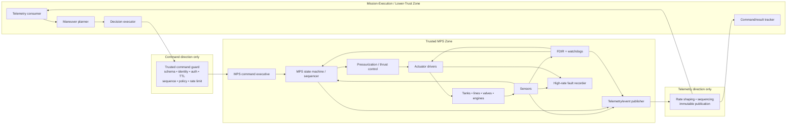
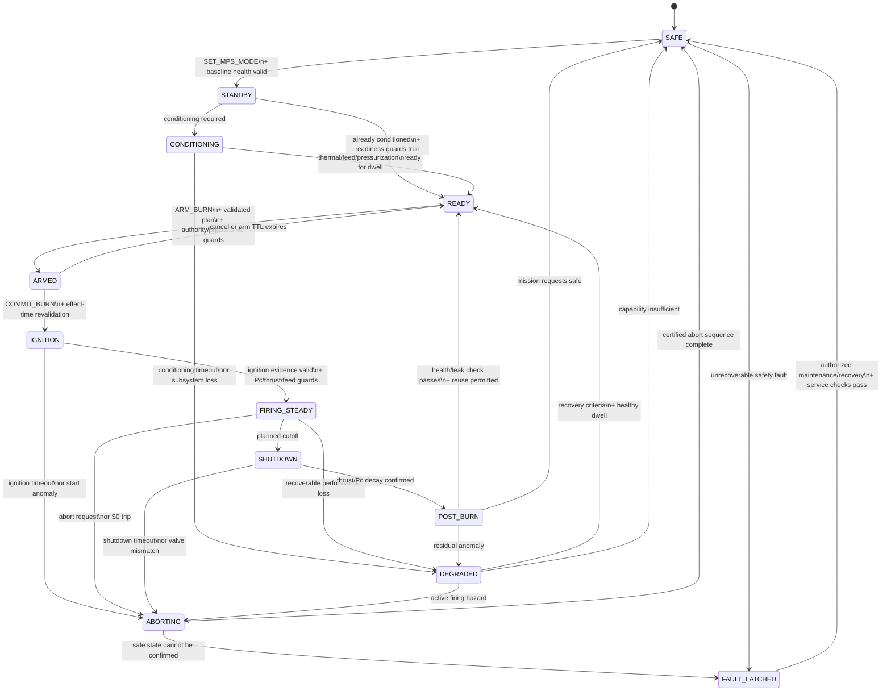

# Mapping the Main Propulsion Subsystem into a Diode-Pattern Executable Telemetry and Decision Specification

## Executive summary

This report defines an implementation-ready reference specification for exposing a spacecraft **Main Propulsion Subsystem (MPS)** to an autonomous mission-execution layer through the diode pattern. The requester is the user of this report. No spacecraft bus, engine type, mission timeline, propellant combination, crew-rating regime, or prior MPS specification has been supplied, so the design is deliberately **hardware-neutral at the interface level** and uses explicitly identified **reference implementation profile values (`RIP-REF`)** where a concrete timing, range, buffer size, or threshold is needed.

The primary architectural conclusion is:

> **Expose MPS as a stateful maneuver-intent, health-evidence, and guarded-execution service—not as a remote valve/igniter bus.**

The trusted MPS side owns fluid state, actuator sequencing, hard limits, fault detection/isolation/recovery (FDIR), ignition/shutdown sequencing, safeing, exact actuation time, command anti-replay state, high-rate fault-recorder data, and final authority over whether a requested effect occurs. The agent or mission-execution layer may load a burn, request validation, arm it, commit it, abort it, select an available redundant propulsion string, request leak checks or conditioning, and impose *stricter* resource constraints. It should not normally command individual valve coils, igniters, regulator pilots, or millisecond thruster pulses. This carries forward the existing diode requirement that agent requests be closed-vocabulary and declarative, published state never become an input, and authorization/safety be re-evaluated when an action actually takes effect. fileciteturn0file4 The GNC, ECLSS, and EPDS predecessor studies independently converged on the same stronger pattern: typed per-principal command ingress, authoritative service-side state, bounded history, explicit command lifecycle, anti-replay semantics, and effect-time revalidation. fileciteturn0file0 fileciteturn0file1 fileciteturn0file2

That separation is particularly important for propulsion. The June 22, 2026 revision of JSC-67723, a Johnson Space Center standard for control of catastrophic hazards in **human-rated** spacecraft propulsion systems, requires propulsion faults capable of leading to catastrophic events to be detectable, annunciated, supported by adequate ground data, and—where applicable—isolatable/recoverable within the required time. It also requires direct measurement of critical parameters when those measurements participate in catastrophic-hazard control, screens for off-scale and biased instrumentation, ties acquisition rate to worst-case hazard time-to-effect, and requires propulsion-firing instrumentation intended for later downlink to capture at least three samples during the minimum commandable electrical pulse width. Those are human-rated requirements rather than universal requirements for the generic orbital spacecraft assumed here, but they provide an unusually strong primary-source design basis for this interface. citeturn16search0turn12view10turn12view11 ECSS-E-ST-35C Rev.1 and ECSS-E-ST-35-01C provide the broader spacecraft-propulsion framework, covering propulsion requirements and spacecraft liquid/electric propulsion respectively. citeturn12view7turn12view8

A true hardware data diode only transfers information in one direction. Therefore an external mission-execution system that both **observes MPS telemetry and requests MPS actions** requires two independently unidirectional paths in opposite directions, unless the autonomy itself is placed inside the trusted propulsion/flight-computer zone. NIST defines a data diode as a device allowing data to travel only one direction. citeturn9search1turn9search11 The existing file-diode specification is still a useful simulation implementation of the same authority pattern, but it should not be represented as a single physical one-way device when bidirectional closed-loop information exchange exists. fileciteturn0file4

The recommended control hierarchy is:

| Layer | Responsibility | Reference timing | Externally commandable? |
|---|---|---:|---|
| Physical protection | Relief devices, mechanical stops, destructive-fault electrical protection | hardware-dependent | No |
| MPS local safety/FDIR | Uncommanded firing detection, overpressure/underpressure response, leak isolation, unsafe ignition inhibit, valve-drive protection | hazard-derived; typically ms–100 ms class **RIP-REF** | No |
| MPS sequencing/controller | Conditioning, pressurization, valve sequencing, ignition, throttle scheduling, shutdown, branch failover | 1–100 ms loops depending function **RIP-REF** | Requests only |
| Mission execution | Burn intent, timing windows, resource constraints, redundant-string selection, abort | 50 ms–minutes | Yes, bounded |
| Ground/operator | Mission authorization, overrides, maintenance/test enable, configuration | mission-dependent | Yes, through guard |
| Operator-owned configuration | safety limits, trust anchors, command authority, immutable ceilings | preflight/maintenance | Never agent-writable |

The implementation should be based around four invariants:

**First, telemetry is evidence rather than simulator omniscience.** A pressure transducer reports what the transducer senses; a propellant-remaining field is an estimate; a valve command is not proof that a valve moved. The Apollo-style predecessor study already established this direct-observation-versus-inference distinction, including a preliminary MPS surface containing chamber pressure, commanded and estimated thrust, feed pressure, pressurant pressure, propellant estimate, arm state, and accumulated ΔV. fileciteturn0file3 JSC-67723 likewise emphasizes direct critical-parameter sensing and redundant or secondary evidence because incorrect fault-protection action can itself be hazardous. citeturn12view10

**Second, acquisition and downlink rates are separate.** MPS may need hundreds or thousands of samples per second locally to recognize a valve transient or short pulse, while the normal agent telemetry feed may only carry 20–100 Hz summaries. The high-rate record remains available in an onboard bounded fault ring. The hard requirement is hazard-driven: sampling must support FDIR within the applicable worst-case time-to-effect, and engine/thruster firing evidence intended for later downlink must preserve at least three samples per minimum commandable pulse width under the JSC human-rated reference. citeturn12view10turn12view11

**Third, command acceptance is not execution authorization.** A command may pass parsing, authentication, authorization, and admission, remain queued, and later be `INHIBITED` because attitude, power, feed pressure, thermal conditions, navigation quality, vehicle configuration, or propulsion health changed before effect. NASA cFS Stored Command provides a precedent for time-tagged command release; the additional effect-time MPS revalidation is the safety invariant inherited from the diode architecture. citeturn14search3 fileciteturn0file4

**Fourth, the specification is configuration-driven.** No pressure, temperature, mixture ratio, minimum impulse bit, valve transit time, thrust, throttle range, tank capacity, or ignition timeout can legitimately be universal in the absence of an actual propulsion design. The executable specification therefore names those quantities and gives reference defaults where useful, but the selected propulsion hardware's certified limits replace all `RIP-REF` values before flight qualification. ECSS propulsion standards themselves are intended to be tailored to the project and propulsion implementation. citeturn12view7turn12view8

A conforming architecture looks like this:



The remainder of this report turns that architecture into a component dictionary, telemetry/command contract, protocol specification, state machine, timing profile, flight/ground integration design, and verification plan.

## Scope, assumptions, and standards basis

The requested decomposition strongly implies a chemical or cold-gas propulsion architecture containing propellant tanks, fluid feed paths, valves, pressurization, and engines/thrusters. The **reference point dictionary therefore assumes a generic pressure-fed chemical MPS**, while keeping the wire protocol and control architecture applicable to pump-fed or electric propulsion. For electric propulsion, the same trust and decision semantics remain; fluid-feed points are supplemented or replaced by propellant-flow-controller, power-processing-unit, discharge-voltage/current, cathode, neutralizer, and thruster-thermal telemetry. ECSS-E-ST-35-01C explicitly covers both spacecraft liquid propulsion—including cold gas—and electric propulsion, supporting this separation between common interface semantics and technology-specific point dictionaries. citeturn12view8

The supplied documents are treated as **architectural precedents, not as a prior MPS specification**. This honors the requester's assumption that no prior MPS report has been provided while still maintaining consistency with the attached diode, GNC, ECLSS, EPDS, and spacecraft-simulation work. The generic diode defines closed vocabulary, asymmetric reach, state publication, idempotent commands, operator-owned ceilings, and effect-time re-dispatch; the later subsystem studies introduce typed messages, per-principal ingress, explicit authority classes, dual logical one-way paths, quality/provenance metadata, and command lifecycle records. fileciteturn0file4 fileciteturn0file0 fileciteturn0file1 fileciteturn0file2

The following assumptions are therefore normative for this reference profile:

| Topic | Assumption | Consequence |
|---|---|---|
| Spacecraft class | Generic orbital spacecraft | No launch-vehicle, crewed, lander, deep-space, or rendezvous-specific limits are hard-coded. |
| Propulsion technology | Pressure-fed chemical is the reference point dictionary; technology remains configurable | Pump-fed/electric systems add technology-specific points without changing the diode envelope. |
| Propellant | Unspecified | Chemical compatibility, freezing, decomposition, mixture-ratio and thermal limits are mission configuration. |
| Engine count | Unspecified | All engine/thruster objects are indexed resources. |
| Throttle capability | Optional | `SET_THROTTLE` exists only where the hardware capability registry advertises it. |
| Mission timeline | None assumed | State and authority gates depend on mission phase supplied by trusted flight software, not a fixed timeline in this report. |
| Crewed status | Unspecified | JSC-67723A is used as conservative design guidance; human-rating-specific requirements must be explicitly tailored in or out. |
| Tank/feed architecture | Arbitrary isolatable sections | Every fluid segment has an object ID and, where practicable, pressure/temperature observability. |
| GNC ownership | Separate trusted subsystem | GNC supplies maneuver/attitude permission; MPS owns propulsion sequencing. |
| EPDS ownership | Separate trusted subsystem | MPS observes propulsion-power readiness but cannot falsify power health. |
| Thermal ownership | Shared/interface-dependent | Dedicated line/tank/valve heaters may be MPS-owned; vehicle thermal state remains an external constraint. |
| RTOS | Not fixed | Timing is expressed as periods, deadlines, WCET budgets, and watchdog requirements. |
| Wire encoding | Protobuf operational default; CBOR supported; JSON diagnostic | One semantic schema drives all encodings. |
| Space-link protocol | Mission-defined | CCSDS Space Packet/Data Link profiles are integration wrappers, not the internal MPS control law. |
| Security algorithms | Mission-approved profile | Authentication/authorization semantics are normative; cryptographic algorithms are deployment choices. |
| Flight assurance | Unspecified | NASA/ECSS standards are a tailoring baseline, not automatic certification. |

The primary standards and implementation references are:

| Source | Role in this specification |
|---|---|
| **ECSS-E-ST-35C Rev.1** | General propulsion-system requirements across liquid, solid, and electric propulsion; system-level tailoring basis. citeturn12view7 |
| **ECSS-E-ST-35-01C** | Spacecraft liquid/electric propulsion engineering, functions, interfaces, operations, and verification. citeturn12view8 |
| **JSC-67723 Rev. A, June 22 2026** | Conservative basis for propulsion hazard observability, FDIR, instrumentation, data rates, leak detection, and direct critical-parameter sensing. It is specifically human-rated. citeturn16search0turn12view10turn12view11 |
| **NASA-STD-5012C** | Current NASA strength/life assessment baseline relevant to liquid-fueled space propulsion engines; hardware qualification remains outside the diode itself. citeturn12view9 |
| **NASA-STD-8739.8B** | Active NASA software-assurance/software-safety/IV&V baseline, dated September 8, 2022. citeturn9search0 |
| **CCSDS 133.0-B-2** | Space Packet Protocol application packetization option; Issue 2, June 2020. citeturn18search0turn18search6 |
| **CCSDS 132.0-B-3 / 232.0-B-4** | TM and TC Space Data Link Protocols for mission downlink/uplink integration; both current Issue 3/4 publications date from October 2021, with TC corrigendum through October 2023. citeturn18search6turn17search1 |
| **CCSDS 355.0-B-2** | Data-link authentication/confidentiality framework for CCSDS TM/TC/AOS/USLP integration. citeturn17search3turn17search14 |
| **CCSDS 301.0-B-4** | Common framework for time-code representation and time interchange. citeturn17search2 |
| **NASA cFS/cFE** | Flight-software architectural analogue for software bus, scheduling, command ingest, telemetry output, stored command, tables and time services. citeturn13search4turn14search2 |
| **NASA cFS Scheduler** | Configurable deterministic time-division scheduling via predetermined Software Bus messages. citeturn14search1 |
| **RTEMS Rate Monotonic Manager** | RTOS model for periodic hard-real-time tasks and measurement of period performance. citeturn12view6 |
| **NASA CCDD** | Candidate authoritative command/telemetry dictionary tooling; supports command/telemetry data structures and JSON/EDS/XTCE import/export. citeturn13search0 |
| **RFC 8259 / RFC 8949** | JSON diagnostic interchange and CBOR compact binary interchange. citeturn9search7turn9search2 |
| **Protocol Buffers official specification** | Binary schema/wire-format implementation option; unknown fields can be skipped and field numbers require disciplined evolution. citeturn10search1turn10search2 |

Two implementation rules follow directly from those sources.

First, **critical MPS decisions should consume direct evidence whenever practical**. JSC-67723A explicitly distinguishes direct fluid-pressure, temperature, pump-speed, valve/inhibit-position measurements from indirect actuator-based inferences for hazard control. It also calls for redundant instrumentation or secondary cues where a single bad reading could drive an unsafe response. citeturn12view10 This maps naturally to the prior diode studies' distinction between `DIRECT`, `DISCRETE`, `ESTIMATED`, and `SERVICE_STATE` data. fileciteturn0file1

Second, **the MPS point dictionary is an engineering artifact, not source-code folklore**. Names, units, ranges, precision, calibration, provenance, authority, update rate, quality semantics, alarm limits, and permissible commands should be generated from one version-controlled dictionary. NASA's CCDD exists specifically to manage command and telemetry data for cFS projects and can exchange JSON, EDS, and XTCE representations. citeturn13search0

## Functional decomposition and component contracts

The point ranges and accuracies below are deliberately split into **physical configuration ranges** and **interface/reference targets**. A value such as `0…1.2 × MDP` means that the protocol must represent at least that declared engineering interval, not that operating a tank at 120% of maximum design pressure is permitted. Likewise, an accuracy marked `RIP-REF` is an interface-design starting target for simulation/prototyping, not a substitute for the selected transducer's qualification specification.

JSC-67723A's human-rated instrumentation clauses provide three useful constraints that should be inherited even for the generic reference implementation unless tailoring shows otherwise: critical hazard-control measurements should be direct where practical; FDIR must reject or specially treat off-scale/bias-corrupted signals; and each practicably isolatable propellant-delivery section should have pressure and temperature observability sufficient to support leak detection. citeturn12view10turn12view11

**Functional decomposition and component-level executable contract**

| Component | Function | Commandable controls exposed through diode | Health/status flags | Principal failure modes | Default trusted safe-state response |
|---|---|---|---|---|---|
| **Propellant tanks** | Store fuel/oxidizer/monopropellant/cold gas; provide ullage/fluid state and quantity evidence | Normally none at vessel level; `SET_TANK_BRANCH_STATE`, `REQUEST_TANK_LEAK_CHECK`, conditioning requests where supported | `NOMINAL`, `LOW_QUANTITY`, `PRESSURE_LOW/HIGH`, `TEMP_LOW/HIGH`, `LEAK_SUSPECT`, `LEAK_CONFIRMED`, `SENSOR_DISAGREE`, `ISOLATED` | leak/rupture precursor, over/underpressure, thermal excursion, quantity-estimation error, sensor bias/dropout | Stop additional pressurization when safe; isolate affected branch if architecture permits; preserve thermal survival; rely on independent relief protection for overpressure |
| **Feed system / lines / filters / check valves** | Route propellant from storage to engines; condition pressure/flow; prevent reverse flow/contamination | `SET_FEED_BRANCH`, `REQUEST_PRIME`, `REQUEST_LEAK_CHECK`; direct component actuation test-only | `FLOW_READY`, `PRESSURE_READY`, `FILTER_DP_HIGH`, `BLOCKAGE_SUSPECT`, `REVERSE_FLOW_SUSPECT`, `LEAK_SUSPECT`, `ISOLATED` | line leak/rupture, blockage, filter loading, trapped-volume overpressure, reverse flow, vapor/gas ingestion, freezing/thermal conditioning failure | Stop or inhibit firing; isolate failed branch; stop upstream supply/pressurization where appropriate; protect trapped volumes through hardware-certified means |
| **Valves** | Isolation, engine propellant control, venting, crossfeed, pressurant routing | Mission level: `SET_BRANCH_ISOLATION`; raw `OPEN_VALVE`/`CLOSE_VALVE` only maintenance/test A3 unless specifically flight-certified | `OPEN`, `CLOSED`, `TRANSITION`, `UNKNOWN`, `CMD_FEEDBACK_MISMATCH`, `STUCK_OPEN`, `STUCK_CLOSED`, `DRIVER_FAULT` | fails open/closed, slow transit, partial travel, chatter, false position indication, electrical open/short | Stop sequence; do not infer actual position from command alone; inhibit dependent ignition; isolate with independent upstream/downstream devices where available |
| **Pressurization subsystem** | Store pressurant, regulate tank/feed pressure, provide make-up pressure and relief interfaces | `SET_PRESSURIZATION_MODE(AUTO/HOLD/ISOLATE)`, `SELECT_PRESSURIZATION_STRING`, test-only regulator commands | `READY`, `REGULATING`, `PRESSURE_LOW/HIGH`, `REGULATOR_FAULT`, `LEAK_SUSPECT`, `RELIEF_EVENT`, `STRING_DEGRADED` | regulator stuck open/closed, pressurant leak, check-valve reverse flow, isolation-valve fault, depletion, overpressure | Inhibit/stop additional pressurant supply for high-pressure condition; isolate failed string; inhibit burn for insufficient pressure; hardware relief remains independent |
| **Engines / main thrusters** | Convert propellant energy into commanded impulse | `LOAD_BURN_PLAN`, `VALIDATE_BURN`, `ARM_BURN`, `COMMIT_BURN`, `ABORT_BURN`, `SET_THROTTLE` only when advertised | `AVAILABLE`, `READY`, `ARMED`, `IGNITING`, `FIRING`, `DEGRADED`, `NO_IGNITION`, `LOW_PC`, `HIGH_PC`, `UNCOMMANDED_THRUST`, `SHUTDOWN_FAILED` | ignition failure, hard/abnormal start, low/high chamber pressure, combustion instability evidence, thrust shortfall, excessive thrust, valve fault, shutdown failure, uncommanded firing | Local abort/shutdown sequence; remove ignition and thrust command; close certified isolation/control valves where safe; declare engine unavailable and prevent automatic restart until policy allows |
| **Sensors / instrumentation** | Measure pressure, temperature, flow, valve position, electrical state, vibration, etc. | Mode/calibration/test requests only; no command may set sensor health to “good” | `GOOD`, `SUSPECT`, `STALE`, `SATURATED`, `OUT_OF_RANGE`, `INVALID`, `ESTIMATED`, `CAL_DUE` | bias, drift, frozen value, noise burst, dropout, off-scale, lag, broken sensing diaphragm/interface | Exclude invalid source from hazard decisions; use redundant/disparate evidence; block hazardous transitions when required observability is lost |
| **Actuators / drive electronics** | Drive solenoids, motor valves, igniters, gimbals or throttling actuators | High-level sequencer owns normal control; `TEST_ACTUATOR` only in authorized maintenance/test mode | `READY`, `ENERGIZED`, `CURRENT_HIGH/LOW`, `POSITION_MISMATCH`, `DRIVER_FAULT`, `INHIBITED` | open/short circuit, undervoltage, overcurrent, overheated driver, jam, unintended energization | De-energize failed channel where that is fail-safe; inhibit associated propulsion path; isolate electrical driver; prevent retries beyond configured limit |
| **Electrical power interface** | Supply propulsion electronics, heaters, valves, igniters and controller | No direct EPDS topology command from MPS; MPS may request propulsion load state through EPDS interface | `POWER_READY`, `BUS_UV/OV`, `POWER_DEGRADED`, `BROWNOUT`, `BACKUP_ACTIVE` | undervoltage, loss of source, transient during valve/igniter actuation, electrical short | Inhibit ignition on insufficient power; maintain state machine deterministically through transient where possible; hand destructive electrical fault to EPDS/local protection |
| **Thermal subsystem/interfaces** | Maintain propellant, valve, regulator, line and engine temperatures within qualified envelope | `SET_MPS_CONDITIONING`, bounded heater request where MPS owns heaters | `THERMAL_READY`, `TOO_COLD`, `TOO_HOT`, `HEATER_FAULT`, `SOAK_INCOMPLETE`, `FREEZE_RISK` | failed heater, stuck heater, thermal sensor error, line freezing, propellant conditioning failure, excessive soak | Inhibit ignition/pressurization transitions outside qualified envelope; retain survival heating where permitted; isolate failed heater |
| **Structural / fluid interfaces** | Transfer thrust/loads to spacecraft; provide tank/line supports and interfaces to other vehicle systems | Normally none; diagnostic/burst-record request only | `LOAD_NOMINAL`, `VIBRATION_HIGH`, `STRAIN_HIGH`, `INTERFACE_FAULT`, `MOUNT_DEGRADED` | line/support fracture, mount overload, unexpected acceleration/vibration, interface leakage | Abort firing if a certified load/structural trip requires it; inhibit reuse pending evaluation; preserve high-rate event record |
| **Redundancy / failover manager** | Select healthy strings/engines/sensors, prevent common-mode propagation | `SELECT_PROPULSION_STRING`, `SET_ENGINE_AVAILABILITY_REQUEST`, `REQUEST_FAILOVER`; final selection trusted | `FULL_REDUNDANCY`, `DEGRADED_REDUNDANCY`, `SINGLE_STRING`, `FAILOVER_ACTIVE`, `NO_VALID_STRING` | common-cause loss, failed cross-strapping, unhealthy spare, erroneous auto-failover | Isolate failed string; fail over only after compatibility/health checks; never automatically couple a healthy path into an unresolved fault domain |

The safe state is therefore **not universally “close every valve.”** Fluid-system topology can make blind valve motion dangerous—for example by creating trapped volumes or coupling pressure domains. Safe-state actions must be defined component-by-component in the qualified MPS configuration and invoked by named service procedures such as `SAFE_ENGINE`, `ISOLATE_BRANCH_A`, or `PRESSURIZATION_HOLD`, rather than generated ad hoc by an external agent. JSC-67723A specifically treats leak detection, isolation capability, pressure/temperature observation, and inappropriate fault-protection actions as propulsion hazard concerns. citeturn12view10turn12view11

**Detailed telemetry point dictionary**

The normal and transient publication rates below distinguish **local acquisition** from **agent publication**. Local acquisition is authoritative for FDIR. Publication may be decimated only when the high-rate source remains recoverable from the fault recorder.

| Component | Telemetry point | Unit | Required representable range | Local acquisition | Normal outward publication | Accuracy / resolution target |
|---|---|---:|---|---:|---:|---|
| Propellant tank | `mps.tank.<id>.pressure_abs` | Pa | `0 … 1.2 × MDP_cfg` | 20 Hz normal; 100 Hz transient **RIP-REF** | 10 Hz | ±0.5% FS **RIP-REF** |
| | `mps.tank.<id>.temperature` | K | `T_sensor_min_cfg … T_sensor_max_cfg` | 10 Hz | 2 Hz | ±1 K **RIP-REF** |
| | `mps.tank.<id>.quantity_est` | kg | `0 … 1.05 × loaded_mass_cfg` | estimator 1–10 Hz | 1 Hz | uncertainty field mandatory; ±2–5% FS initial simulation target |
| | `mps.tank.<id>.quantity_sigma` | kg | `0 … loaded_mass_cfg` | estimator rate | 1 Hz | model-derived |
| | `mps.tank.<id>.pressure_rate` | Pa/s | signed configured range | 20 Hz | 10 Hz | derived |
| Feed section | `mps.feed.<id>.pressure_abs` | Pa | `0 … 1.2 × MDP_cfg` | 100–500 Hz while firing; 20 Hz otherwise | 20–50 Hz burn; 10 Hz coast | ±0.5% FS **RIP-REF** |
| | `mps.feed.<id>.temperature` | K | sensor-configured | 20 Hz | 5 Hz | ±1 K **RIP-REF** |
| | `mps.feed.<id>.mass_flow` | kg/s | `0 … 1.2 × max_flow_cfg` | 50–200 Hz where instrumented | 20–50 Hz | instrument-specific; provenance required |
| | `mps.feed.<id>.filter_dp` | Pa | `0 … 2 × clean_dp_limit_cfg` | 20 Hz | 5 Hz | ±1% FS **RIP-REF** |
| | `mps.feed.<id>.flow_direction` | enum | FORWARD/REVERSE/UNKNOWN | event/20 Hz | event + 2 Hz | sensor/model dependent |
| Valve | `mps.valve.<id>.commanded_state` | enum | OPEN/CLOSED/HOLD | event | event + 2 Hz | service state |
| | `mps.valve.<id>.position` | % travel | `0 … 100` | ≥10 samples per expected transit **RIP-REF** | 20–100 Hz during transit; 2 Hz static | ±1% travel **RIP-REF** |
| | `mps.valve.<id>.open_limit` / `closed_limit` | bool | 0/1 | 100–1000 Hz internal depending mechanism | event + 10 Hz during sequence | discrete |
| | `mps.valve.<id>.drive_current` | A | `0 … 1.5 × rated_current_cfg` | 500–1000 Hz during actuation | 50 Hz transition; 2 Hz idle | ±1% FS **RIP-REF** |
| | `mps.valve.<id>.transition_time` | ms | `0 … timeout_cfg` | derived/event | event | 1 ms **RIP-REF** |
| Pressurant tank | `mps.pressurant.<id>.pressure_abs` | Pa | `0 … 1.2 × MDP_cfg` | 20–100 Hz | 10 Hz | ±0.5% FS **RIP-REF** |
| Pressurization regulator | `mps.reg.<id>.outlet_pressure` | Pa | `0 … 1.2 × downstream_MDP_cfg` | 100 Hz transient | 20 Hz | ±0.5% FS **RIP-REF** |
| | `mps.reg.<id>.command/state` | enum | OFF/HOLD/REGULATING/ISOLATED | event/100 Hz | event + 5 Hz | exact service state |
| | `mps.pressurant.mass_est` | kg | `0 … loaded_mass_cfg` | 1–10 Hz estimator | 1 Hz | estimated + σ |
| | `mps.pressurant.leak_rate_est` | kg/s | signed configured range | 10 Hz | 2 Hz | estimated + confidence |
| Engine/thruster | `mps.engine.<id>.chamber_pressure` | Pa | `0 … 1.2 × Pc_max_cfg` | **≥ max(3/EPWmin, FDIR-required rate)** | 50–100 Hz during firing plus stored high-rate burst | ±1% FS **RIP-REF** |
| | `mps.engine.<id>.injector_inlet_pressure.<prop>` | Pa | `0 … 1.2 × MDP_cfg` | 200–1000 Hz firing **RIP-REF** | 50 Hz | ±0.5% FS |
| | `mps.engine.<id>.thrust_est` | N | `0 … 1.2 × Fmax_cfg` | 50–200 Hz estimator | 50 Hz | estimated + model/version/σ |
| | `mps.engine.<id>.throttle_command` | % | hardware-advertised range | control-loop rate | 20–50 Hz | service state |
| | `mps.engine.<id>.mixture_ratio_est` | dimensionless | config-specific | 10–100 Hz if calculable | 10 Hz | estimated |
| | `mps.engine.<id>.burn_time` | s | `0 … mission_cfg` | control-loop | 10 Hz | 1 ms internal **RIP-REF** |
| | `mps.engine.<id>.pulse_count` | count | uint64 | event | 1 Hz/event | exact service count |
| Sensor | `mps.sensor.<id>.value` | declared SI unit | calibration/config range | native sensor rate | topic-dependent | calibration-defined |
| | `mps.sensor.<id>.quality` | enum | fixed vocabulary | every acquisition | every publication | exact service assessment |
| | `mps.sensor.<id>.sample_age` | ms | 0…∞ | computed | every frame | 1 ms |
| | `mps.sensor.<id>.bias_est` | native unit | config-specific | estimator-dependent | 1 Hz | estimated |
| Actuator | `mps.actuator.<id>.drive_voltage` | V | `0 … 1.2 × rated_cfg` | 500 Hz transition **RIP-REF** | 20–50 Hz transition | ±1% FS |
| | `mps.actuator.<id>.drive_current` | A | `0 … 1.5 × rated_cfg` | 500–1000 Hz transition | 20–50 Hz | ±1% FS |
| | `mps.actuator.<id>.driver_temperature` | K | configured | 10 Hz | 2 Hz | ±1 K |
| Power | `mps.power.bus_voltage` | V | `0 … 1.2 × nominal_cfg` | 500–1000 Hz during firing transitions | 50 Hz firing; 10 Hz coast | ±0.5% FS |
| | `mps.power.bus_current` | A | signed/configured | 500–1000 Hz | 50 Hz/10 Hz | ±1% FS |
| | `mps.power.power_good` | bool | 0/1 | 100–1000 Hz | event + 10 Hz | discrete |
| Thermal | `mps.thermal.<node>.temperature` | K | qualified sensor range | 10–20 Hz | 1–5 Hz | ±1 K **RIP-REF** |
| | `mps.heater.<id>.command` / `current` | enum/A | config | 20–100 Hz | 2–10 Hz | ±1% current FS |
| Structural | `mps.structure.<node>.strain` | µε | qualified range | 100–2000 Hz burst as required | 1–10 Hz summary + event burst | sensor-specific |
| | `mps.structure.<node>.accel` | m/s² | qualified range | 200–2000 Hz burst | 20 Hz summary | sensor-specific |
| Redundancy | `mps.redundancy.active_string` | enum | configured IDs | event | event + 1 Hz | service state |
| | `mps.redundancy.available_mask` | bitset | configured | event/10 Hz | event + 1 Hz | service state |
| | `mps.redundancy.failover_count` | uint32 | 0…max | event | event + 1 Hz | exact |

The engine/thruster acquisition rule is deliberately formula-based. JSC-67723A states that chamber-pressure or other direct firing-characterization data intended for later downlink must capture **at least three samples during minimum commandable electrical pulse width** and separately requires data rates adequate for FDIR within worst-case hazard time-to-effect. citeturn12view10turn12view11 Thus:

\[
f_{\mathrm{engine,acq}}
\ge
\max\left(
\frac{3}{T_{\mathrm{EPW,min}}},
f_{\mathrm{FDIR,min}}
\right)
\]

For illustration, a 20 ms minimum electrical pulse width implies at least 150 samples/s for the first term; a 10 ms pulse implies at least 300 samples/s. The actual flight rate must be the greater of that and the hazard/FDIR-derived requirement.

Every telemetry value carries a **provenance class**:

| Class | Meaning | MPS example |
|---|---|---|
| `DIRECT` | direct sensor measurement | tank pressure transducer |
| `DISCRETE` | direct switch/latched indication | valve open limit switch |
| `ESTIMATED` | inferred/model-derived | remaining propellant mass |
| `SERVICE_STATE` | authoritative trusted-software state | `MPS_ARMED` |
| `COMMAND` | requested/internal setpoint | requested throttle |
| `FEEDBACK` | observed consequence of command | valve position |
| `EVENT` | discrete occurrence | `IGNITION_TIMEOUT` |
| `MODEL` | predicted value | predicted post-burn propellant |

The quality vocabulary is consistent with the earlier subsystem specifications: `GOOD`, `SUSPECT`, `STALE`, `SATURATED`, `OUT_OF_RANGE`, `INVALID`, `ESTIMATED`, and optionally `SIMULATED` during formal test injection. fileciteturn0file1 fileciteturn0file2 A hidden injected failure in a simulation should **not** automatically set telemetry to `SIMULATED` or reveal its root cause; normal agent-visible telemetry should continue to resemble real instrument evidence unless the test mode itself is intentionally visible. That preserves the experimental epistemics established in the Apollo-style predecessor design. fileciteturn0file3

## Diode architecture, trust boundary, data formats, and timing

A hardware-assured implementation uses independent one-way telemetry and command paths. A simulation may implement the same semantics with isolated filesystem surfaces or IPC, provided telemetry files/topics are never authoritative inputs and agents have no path to service credentials or internal MPS state. NIST's definition of a data diode is explicitly one-directional, so two such paths are required for an external closed-loop controller. citeturn9search1

**Logical interface surfaces**

| Surface | Direction | Trusted writer | Purpose |
|---|---|---|---|
| `mps/cmd/<principal>/request` | Agent/ground → MPS | authenticated command-side principal | Typed command request |
| `mps/cmd_result` | MPS → agent/ground | MPS command executive | Lifecycle/result record |
| `mps/telemetry/fast` | MPS → observers | MPS publisher | Feed/chamber/valve/power fast state |
| `mps/telemetry/inventory` | MPS → observers | MPS publisher | Tanks, quantity estimates, pressurant |
| `mps/telemetry/thermal` | MPS → observers | MPS publisher | Thermal conditioning |
| `mps/telemetry/health` | MPS → observers | MPS publisher | FDIR, redundancy, scheduler health |
| `mps/events` | MPS → observers | event service | Faults, state transitions, safing |
| `mps/capabilities` | MPS → observers | service/config manager | Engine capabilities, modes, ranges, authority requirements |
| `mps/history/fast` | MPS → observers | recorder | Bounded decimated trend |
| `mps/history/burst` | MPS → observers/downlink | recorder | High-rate pre/post-event data |
| `mps/schema` | MPS → observers | configuration manager | Versioned point/command definitions |

The command path must not trust identity fields supplied inside an agent payload. The trusted ingress guard authenticates the sender and stamps `principal_id`, `authority_granted`, `ingress_sequence`, security-association identifier, and policy revision. This is the same provenance correction introduced by the ECLSS/EPDS/GNC predecessor specifications. fileciteturn0file0 fileciteturn0file1 fileciteturn0file2

**Authority model**

| Class | Owner/use | Representative MPS actions |
|---|---|---|
| `S0` | local physical/software safety; unattainable by external agents | forced abort, unsafe-ignition inhibit, overpressure safeing, uncommanded-firing response |
| `A0` | observation/acknowledgement | telemetry profile within allowed ceiling, acknowledge event |
| `A1` | reversible routine mission action | conditioning request, leak check, select a pre-authorized healthy propulsion resource |
| `A2` | safety-significant mission execution | arm/commit burn, branch isolation, failover, throttle-profile activation |
| `A3` | exceptional test/maintenance/hazardous action | raw actuator test, special purge/prime procedure, low-level valve actuation where formally authorized |
| `FORBIDDEN` | no remote authority | disable hard FDIR; mark failed sensor `GOOD`; rewrite pressure/temperature; clear immutable safety limits; disable watchdog/audit |

The operator may tighten or lower the autonomy envelope at runtime, but the agent may not raise service-owned limits. This retains the original diode's `min(agent allowance, operator ceiling)` authority pattern. fileciteturn0file4

**Command comparison**

| Command | Purpose | Default authority | Idempotent? | Effect-time guards |
|---|---|---:|---|---|
| `SET_MPS_MODE(SAFE|STANDBY|CONDITIONING)` | Select non-firing operating mode | A1/A2 | Yes | current state, thermal/pressure topology |
| `SELECT_PROPULSION_STRING` | Request use of a redundant branch/string | A2 | Yes | requested string healthy, isolation-compatible, no unresolved leak |
| `SET_PRESSURIZATION_MODE` | AUTO/HOLD/ISOLATE request | A2 | Yes | tank/feed pressure, regulator health, branch topology |
| `SET_BRANCH_ISOLATION` | Isolate a named fluid branch | A2 | Yes | trapped-volume rules, valve observability, downstream engine state |
| `SET_MPS_CONDITIONING` | Request thermal/prime conditioning mode | A1 | Yes | heater/power/thermal constraints |
| `REQUEST_LEAK_CHECK` | Execute certified pressure/temperature/mass-balance check | A1 | Yes | suitable quiescent state and observability |
| `LOAD_BURN_PLAN` | Load bounded burn intent/profile | A1 | Yes by plan ID/revision | schema, engine capability, trajectory interface |
| `VALIDATE_BURN_PLAN` | Ask MPS to calculate feasibility | A1 | Yes | resource, health, propulsion constraints |
| `ARM_BURN` | Establish short-lived permission for a validated plan | A2 | Yes for same plan/hash | exact plan hash, GNC/mission phase, MPS readiness |
| `COMMIT_BURN` | Permit effect of matching armed plan | A2 | Deduplicated | arm valid, latest state/plan revision, all safety interlocks |
| `SET_THROTTLE_PROFILE` | Load bounded profile where hardware supports throttle | A2 | Yes by profile revision | engine capability, slew/range, GNC profile compatibility |
| `ABORT_BURN` | Request immediate certified abort sequence | A1; priority P0 | Yes | always admissible as a request for safer state |
| `CANCEL_PENDING` | Cancel uncommitted queued operation | authority ≥ original | Yes | not already irreversible/effecting |
| `ACK_EVENT` | Operator/agent acknowledgement | A0 | Yes | none affecting physical state |
| `TEST_ACTUATOR` | Direct test-mode component exercise | A3/test mode | command-specific | maintenance mode, physical/test interlocks, no flight conflict |

`COMMIT_BURN` is not itself “open propellant valve now.” It enables the trusted MPS sequencer to run the qualified sequence. A valve transition is subsequently generated only if the state machine's current guards remain true.

**Command lifecycle**

```text
SEEN
  → PARSED
  → AUTHENTICATED
  → AUTHORIZED
  → ACCEPTED
  → QUEUED
  → REVALIDATING
  → EXECUTING
  → VERIFYING
  → COMPLETED
```

Terminal alternatives are `REJECTED`, `REPLAYED`, `STALE_STATE`, `EXPIRED`, `INTERLOCKED`, `CANCELLED`, `ABORTED`, `FAILED`, and `SUPERSEDED`. The lifecycle explicitly separates “valid request received” from “safe physical effect occurred.”

A command receiver performs, in order:

```text
1. Bound frame length before full parse.
2. Verify transport integrity.
3. Authenticate security association / sender.
4. Verify persistent monotonic ingress sequence.
5. Deduplicate command_id.
6. Parse against exact schema version.
7. Reject unknown command type or enum.
8. Validate numeric ranges; reject NaN/Inf.
9. Stamp authoritative principal and authority.
10. Check issue/not-before/expiry time.
11. Check base_state_revision and plan revision/hash.
12. Check current command-authority policy.
13. Admit to bounded priority queue.
14. At effect time, repeat state, phase, health, authority,
    timing, GNC, EPDS, thermal and resource checks.
15. Execute only through the trusted state machine.
```

Because the physical command path may be one-way, the protocol must not depend on an online challenge-response exchange. Anti-replay is instead based on authenticated frames, a persistent monotonic ingress sequence, bounded command lifetime, command-ID deduplication, and retained security-association state. Results return on the independent telemetry path. CCSDS 355.0-B-2 can provide data-link authentication and/or confidentiality when the records are carried over CCSDS TM/TC/AOS/USLP, but link-layer security does not replace application-level command authorization or MPS interlocks. citeturn17search3turn17search14

**Reference rate limits and buffers (`RIP-REF`)**

| Resource | Reference limit |
|---|---:|
| Normal command request per principal | 10 requests/s sustained, burst 20 |
| Burn arm/commit operations | 2/s; duplicate ID not re-executed |
| P0 abort/safe commands | dedicated reserved capacity; never blocked by normal token bucket |
| Maximum command frame | 4 KiB |
| Maximum queued normal commands | 64 total |
| Reserved P0 command slots | 8 |
| Per-principal normal queue quota | 16 |
| Fast telemetry outward | 20–50 Hz normal |
| Burn telemetry outward | 50–100 Hz selected points |
| High-rate local fault ring | native acquisition; ≥60 s pre-event + ≥60 s post-event |
| Fast-history ring | ≥30 min at 20 Hz or equivalent compressed volume |
| Slow engineering history | ≥24 h at ~1 Hz |
| Persistent event/command audit | mission-defined; do not rely solely on overwrite ring |

These sizes are proposed reference defaults, not propulsion standards. Their purpose is to make overload behavior deterministic. When bandwidth/storage is constrained, slow diagnostics or redundant normal samples are reduced before P0 events, command results, or safety-critical fault evidence.

**Message envelope**

All telemetry, events and command results share an immutable envelope:

| Field | Type | Semantics |
|---|---|---|
| `schema_version` | `uint32` | Semantic/wire contract revision |
| `message_type` | enum | Telemetry/event/command/result type |
| `message_id` | 128-bit ID | Unique record identity |
| `topic_id` | enum/uint32 | Deterministic routing ID |
| `sequence` | `uint64` | Monotonic per producer/topic |
| `mission_time_ns` | `uint64` | Authoritative monotonic mission elapsed time |
| `sample_time_ns` | `uint64` | Physical measurement epoch |
| `receive_time_ns` | `uint64` | Trusted controller receive epoch |
| `publish_time_ns` | `uint64` | Telemetry publication epoch |
| `state_revision` | `uint64` | Coherent MPS state version |
| `configuration_revision` | `uint64` | Active point/limits/config revision |
| `producer_id` | fixed ID | Trusted source |
| `quality` | enum | Overall record quality |
| `payload_length` | integer | Parser bound |
| `payload_crc32c` | 32-bit | Accidental corruption detection, where used |
| `security_context` | opaque/fixed | Verified security association, outside untrusted payload |

CRC is not an authentication mechanism. Cryptographic integrity/authenticity is carried separately by the security association or the enclosing secured CCSDS data-link protocol. CCSDS 355.0-B-2 explicitly defines security-header/trailer procedures for data authentication/confidentiality at the link layer. citeturn17search3

**Protocol Buffers example**

Protocol Buffers' binary format is well suited to the operational representation because field numbers and wire types permit decoders to skip fields they do not understand, but field numbers must never be reused after schema evolution. citeturn10search1turn10search2

```proto
syntax = "proto3";
package mps.v1;

enum Quality {
  QUALITY_UNSPECIFIED = 0;
  GOOD = 1;
  SUSPECT = 2;
  STALE = 3;
  SATURATED = 4;
  OUT_OF_RANGE = 5;
  INVALID = 6;
  ESTIMATED = 7;
  SIMULATED = 8;
}

enum Provenance {
  PROVENANCE_UNSPECIFIED = 0;
  DIRECT = 1;
  DISCRETE = 2;
  ESTIMATE = 3;
  SERVICE_STATE = 4;
  COMMAND = 5;
  FEEDBACK = 6;
  MODEL = 7;
}

message Header {
  uint32 schema_version = 1;
  uint32 message_type = 2;
  bytes  message_id = 3;          // 16 bytes
  uint32 topic_id = 4;
  uint64 sequence = 5;
  uint64 mission_time_ns = 6;
  uint64 sample_time_ns = 7;
  uint64 publish_time_ns = 8;
  uint64 state_revision = 9;
  uint64 configuration_revision = 10;
  uint32 producer_id = 11;
}

message Measurement {
  uint32 point_id = 1;
  double value = 2;
  uint32 unit_id = 3;
  Quality quality = 4;
  Provenance provenance = 5;
  optional double uncertainty_1sigma = 6;
  optional double valid_min = 7;
  optional double valid_max = 8;
}

message TelemetryFrame {
  Header header = 1;
  repeated Measurement measurements = 2;
  bytes active_fault_mask = 3;
  uint32 mps_state = 4;
}

message BurnPlan {
  bytes plan_id = 1;
  uint64 plan_revision = 2;
  bytes plan_hash = 3;
  uint32 engine_id = 4;
  uint64 earliest_start_met_ns = 5;
  uint64 latest_start_met_ns = 6;
  uint64 max_duration_ns = 7;
  repeated double throttle_profile = 8;
  double reserved_propellant_kg = 9;
}

message CommandRequest {
  bytes command_id = 1;
  uint64 issued_met_ns = 2;
  uint64 not_before_met_ns = 3;
  uint64 expires_met_ns = 4;
  uint64 base_state_revision = 5;
  uint32 command_type = 6;

  oneof payload {
    BurnPlan load_burn = 20;
    bytes arm_burn = 21;
    bytes commit_burn = 22;
    uint32 abort_reason = 23;
  }
}
```

For basic scalar fields where presence matters—such as distinguishing “not supplied” from a real zero—use explicit presence semantics (`optional`, message wrapper, or Editions presence) rather than relying on an implicit zero value. Official Protobuf guidance specifically distinguishes field-presence behavior and recommends explicit presence in relevant proto3 use cases. citeturn10search6

Do not compute an authenticator by independently reserializing a parsed Protobuf and assuming the resulting bytes are canonical. Instead, authenticate the **exact transmitted wire bytes** or use a separately specified canonical representation. Protobuf documentation explicitly notes that protobuf serialization is not a canonical representation. citeturn10search3

**JSON diagnostic example**

JSON is appropriate for operator tools, files, test fixtures and human-readable mirrors, but not the recommended high-rate engine data path. RFC 8259 defines JSON as a text-based, language-independent structured-data interchange format. citeturn9search7

```json
{
  "schema": "mps.telemetry.v1",
  "sequence": 48221930,
  "mission_time_ns": 188422001250000,
  "sample_time_ns": 188422001240000,
  "publish_time_ns": 188422001251200,
  "state_revision": 922817,
  "mps_state": "FIRING_STEADY",
  "engine": "ME_1",
  "measurements": [
    {
      "point": "mps.engine.ME_1.chamber_pressure",
      "value": 937000.0,
      "unit": "Pa",
      "quality": "GOOD",
      "provenance": "DIRECT"
    },
    {
      "point": "mps.engine.ME_1.thrust_est",
      "value": 437.2,
      "unit": "N",
      "quality": "ESTIMATED",
      "provenance": "ESTIMATE",
      "uncertainty_1sigma": 5.6
    }
  ],
  "active_faults": []
}
```

**CBOR diagnostic-notation example**

CBOR is useful where constrained bandwidth or lower parsing overhead makes a compact binary representation preferable. RFC 8949 describes CBOR as a binary structured-data format designed for small code/message sizes and extensibility; its diagnostic notation is for documentation/debugging rather than the wire itself. citeturn9search2turn9search8

```text
{
  1: 1,                         / schema_version /
  2: 48221930,                  / sequence /
  3: 188422001250000,           / mission_time_ns /
  4: 922817,                    / state_revision /
  5: 7,                         / FIRING_STEADY /
  6: [
       {1: 4101, 2: 937000.0, 3: 17, 4: 1, 5: 1},
       {1: 4102, 2: 437.2,    3: 21, 4: 7, 5: 3, 6: 5.6}
     ]
}
```

The encoding is an interchangeable representation of the same semantic point dictionary; business logic must not depend on whether Protobuf, CBOR or JSON was selected.

**Timing and determinism profile**

NASA cFS Scheduler generates software-bus messages at predetermined timing intervals specifically to support deterministic time-division operation, while RTEMS exposes a Rate Monotonic Manager for periodic hard-real-time task scheduling and period statistics. These make useful implementation patterns, though neither prescribes the MPS rates below. citeturn14search1turn12view6

| Function | Reference execution/acquisition | Deadline intent |
|---|---:|---|
| Hard electrical/physical protection | hardware / dedicated local logic | independent of agent and normal scheduler |
| Engine/thruster firing evidence | `max(3/EPWmin, FDIR-derived)` | must satisfy hazard time-to-effect |
| Valve/actuator transient acquisition | 500–1000 Hz **RIP-REF** | capture actuation signature and transit |
| Fast MPS FDIR | 100–500 Hz **RIP-REF** | deadline < configured hazard response budget |
| Firing state machine | 100–200 Hz **RIP-REF** | deterministic, no dynamic allocation |
| Pressurization supervisory loop | 50–100 Hz **RIP-REF** | bounded jitter |
| Tank/feed normal monitoring | 10–20 Hz | deterministic |
| Thermal supervisory loop | 1–10 Hz | seconds-class phenomena |
| Inventory estimator | 1–10 Hz | planning, not primary hard protection |
| Command intake/guard | 20 Hz baseline | ≤50 ms intake opportunity |
| Effect-time revalidation | immediately before sequence transition | target ≤10 ms old state snapshot **RIP-REF** |
| Fast outward telemetry | 20–50 Hz | bounded latency |
| Burn outward telemetry | 50–100 Hz selected data | high-rate local source preserved |
| Slow engineering | 1–5 Hz | best effort within QoS |
| Events/results | asynchronous/immediate | P0/P1 publication |

The scheduler should be statically budgeted:

\[
WCET_i + J_i \le D_i \le T_i
\]

where \(WCET_i\) is verified worst-case execution time, \(J_i\) is allocated scheduling jitter, \(D_i\) the task deadline and \(T_i\) its period. A periodic MPS task missing its certified deadline does not “catch up” by executing multiple delayed actuation iterations without policy; it raises a timing fault and moves according to the configured safe/degraded strategy.

**Clock model**

Use at least two explicit time concepts:

1. `mission_time_ns`: monotonically increasing spacecraft/MET time used for command expiry, timeouts, debounce, dwell and sequence ordering.
2. `absolute_time`: correlated spacecraft time, UTC/TAI or mission-defined epoch, for ground correlation and operations.

Timeouts must not depend on a wall clock capable of jumping backward or forward. CCSDS 301.0-B-4 supplies standardized time-code formats for inter-system exchange, while cFS itself provides dedicated time services and uses a major timing synchronization signal in its scheduler architecture. citeturn17search2turn14search1

**QoS classes**

| QoS | Data | Required semantics |
|---|---|---|
| `P0 SAFETY` | aborts, uncommanded firing, severe leak, state-machine safety transition | reserved buffers; persist; no intentional suppression; immediate |
| `P1 EXECUTION` | firing state, Pc, valve feedback, burn progress, command lifecycle | bounded latency, sequence-gap detection, local high-rate record |
| `P2 OPERATIONS` | tanks, feed, pressurization, redundancy | normal reliable stream / bounded ring |
| `P3 ENGINEERING` | detailed thermal/electrical/calibration data | decimatable under bandwidth pressure |
| `P4 BULK` | raw burst records, diagnostics | store-and-forward, operator request |

No transport-level promise of “exactly once” should be used to justify safety. Physical effect and acknowledgement can be separated by a failure. The safe mechanism is idempotent state-setting plus `command_id` deduplication and physical-state readback—the same principle identified by the original diode specification. fileciteturn0file4

## Executable state machines and decision logic

The primary MPS state machine separates *availability*, *preparation*, *authorization*, *firing*, *shutdown*, and *post-burn verification*. An agent does not write this state. It submits commands that may satisfy one of the transition inputs; the trusted state machine alone moves the authoritative state.



The state machine is driven by named configuration parameters rather than hard-coded engineering numbers. The following table defines the normative logic and provides usable initial simulator defaults where a number is helpful.

| Transition | Guard condition | Timeout / hysteresis |
|---|---|---|
| `SAFE → STANDBY` | no unresolved S0 fault; controller/config integrity valid; required sensors available | healthy dwell `T_BASELINE_HEALTH = 2 s` **RIP-REF** |
| `STANDBY → CONDITIONING` | selected propulsion path requires heating, pressurization, priming or other preparation | procedure-specific |
| `CONDITIONING → READY` | required tank/feed temperatures in configured windows; pressure path ready; no leak suspicion; propulsion power ready; selected engine available | all readiness guards continuously true for `T_READY_DWELL = 2 s` **RIP-REF** |
| `READY → ARMED` | exact burn plan validated; `base_state_revision` acceptable; mission phase permits; GNC supplies maneuver permission/attitude capability; enough resource margin; required direct instrumentation usable | `T_ARM_TTL = 30 s` initial simulator default |
| `ARMED → IGNITION` | matching `plan_hash`; arm unexpired; command authenticated/authorized; feed/pressurant/thermal/power/valve conditions still valid; GNC burn-enable true | all guards re-read immediately before effect |
| `IGNITION → FIRING_STEADY` | direct firing evidence crosses configured start threshold and pressure/feed/thrust relationships are plausible | `T_IGNITION_MAX = engine_cfg`; no universal value |
| `IGNITION → ABORTING` | no firing confirmation by timeout, excessive Pc rise, contradictory valve/Pc evidence, uncommanded path behavior | immediate after guard assertion |
| `FIRING_STEADY → SHUTDOWN` | commanded duration/impulse target reached, GNC cutoff request, or burn plan end | normal planned transition |
| `FIRING_STEADY → ABORTING` | severe low/high pressure, uncommanded valve state, confirmed leak, unacceptable structural/load event, critical power loss, GNC safety inhibit, explicit abort | S0 path bypasses normal queue |
| `SHUTDOWN → POST_BURN` | Pc/thrust below shutdown threshold; required valves directly/indirectly confirmed in post-burn state | timeout is engine/config specific |
| `POST_BURN → READY` | leak check/mass balance acceptable; thermal state valid; engine reusable; no unresolved fault | post-burn dwell configured by hardware |
| `DEGRADED → READY` | fault cleared or safely isolated; capability model permits mission operation; observations remain healthy | clear threshold must use hysteresis/dwell |
| `ABORTING → SAFE` | certified safe configuration achieved and residual thrust/leak/pressure risks bounded | abort procedure timeout |
| any → `FAULT_LATCHED` | safety state cannot be verified, repeated unsafe state transition, controller/config integrity lost | manual/ground recovery policy |

For simulation and early integration, a useful **non-certification** chamber-pressure hysteresis profile is:

```text
pc_start_assert       = engine_cfg.pc_start_fraction
pc_steady_enter       = engine_cfg.pc_steady_low
pc_steady_exit        = engine_cfg.pc_steady_fault_low
pc_shutdown_complete  = engine_cfg.pc_shutdown_fraction
```

with an initial pressure-fed-engine simulator profile such as:

```text
pc_start_fraction      = 0.20 * Pc_commanded
pc_steady_low          = 0.90 * Pc_commanded
pc_steady_fault_low    = 0.80 * Pc_commanded
pc_shutdown_fraction   = 0.05 * Pc_nominal
steady_enter_dwell     = 100 ms
low_pc_assert_dwell    = 100 ms
shutdown_clear_dwell   = 500 ms
```

These values are **only model defaults**. A flight program replaces them with engine-development and qualification evidence. The architecture, rather than those particular percentages, is normative: the state machine uses separate assert/clear thresholds and dwell so noise near a boundary cannot cause rapid state chatter.

A generic scalar hysteresis helper is:

```text
assert_fault when:
    value < LOW_ASSERT
    continuously for ASSERT_DWELL

clear_fault when:
    value > LOW_CLEAR
    continuously for CLEAR_DWELL

require:
    LOW_CLEAR > LOW_ASSERT
```

The same shape is used for high thresholds with inequality directions reversed.

The MPS needs a second decision machine for **leak evidence**, because leak diagnosis should not be reduced to one Boolean. JSC-67723A calls for combined system-level and localized leak-detection methods and describes direct, calculated fluid-state, and inferred thermal approaches. It also calls for pressure and temperature sensing in isolatable delivery sections where practical. citeturn12view11

| Leak state | Entry evidence | Decision behavior |
|---|---|---|
| `LEAK_NOMINAL` | pressure/temperature/mass balance consistent with expected configuration | normal operation |
| `LEAK_SUSPECT` | one unexplained pressure-decay, temperature, quantity, flow, or mass-balance cue exceeds configured residual | increase local acquisition/publication; inhibit new risky topology changes |
| `LEAK_CORROBORATING` | second independent cue agrees, or direct leak detection becomes positive | prepare/isolate affected branch; reject new burn unless policy explicitly permits |
| `LEAK_CONFIRMED` | configured confidence/direct threshold reached | S0/A2 certified isolation; abort active firing if applicable |
| `LEAK_ISOLATED` | affected domain isolated and residual shows no continuing hazardous loss | maintain degraded capability; continue monitoring |
| `LEAK_UNCONTAINED` | loss continues or affected section cannot be isolated | safe mode / mission-contingency state; preserve telemetry and resource projections |

A simple estimator for a quiescent isolated gas volume may compare expected pressure evolution with measured pressure and temperature, but the service must publish it as an `ESTIMATED` result rather than pretending it is direct leak truth. A system-level mass-balance residual can likewise be formed from measured/inferred inventory changes versus expected engine/vent consumption.

The trusted command executive pseudocode is:

```text
function admit(command, transport_context):
    require frame_size <= MAX_COMMAND_SIZE
    verify_integrity(frame)
    identity = authenticate(transport_context, frame)
    require anti_replay.accept(identity, frame.ingress_sequence)
    require command_id not already effected

    cmd = strict_schema_parse(frame.payload)
    require no_unknown_command_type(cmd)
    require no_nan_inf_or_out_of_bounds(cmd)

    authority = policy.authority(identity, cmd.command_type)
    require authority >= required_authority(cmd)

    now = monotonic_mission_time()
    require cmd.issued <= now <= cmd.expires
    require now >= cmd.not_before
    require revision_policy_accepts(cmd.base_state_revision)

    authoritative_record = stamp(
        cmd,
        principal_id = identity,
        authority = authority,
        policy_revision = policy.revision
    )

    queue.insert_by_priority(authoritative_record)
    emit_result(ACCEPTED)
```

The effect path deliberately repeats safety decisions:

```text
function attempt_effect(command):
    snapshot = mps.capture_coherent_snapshot()

    if monotonic_time() > command.expires:
        terminate(EXPIRED)

    if command_requires_exact_revision(command):
        if snapshot.state_revision != command.base_state_revision:
            terminate(STALE_STATE)

    if !policy.still_authorized(command):
        terminate(REJECTED_AUTH_CHANGED)

    if !mission_phase.allows(command):
        terminate(INTERLOCKED_PHASE)

    if !gnc.permission_valid(command):
        terminate(INTERLOCKED_GNC)

    if !epds.propulsion_power_ready:
        terminate(INTERLOCKED_POWER)

    if !thermal.propulsion_envelope_valid:
        terminate(INTERLOCKED_THERMAL)

    if !mps_fdir.command_safe(command, snapshot):
        terminate(INTERLOCKED_MPS)

    state_machine.request(command)
```

And the periodic MPS control/FDIR tick is:

```text
function mps_tick():
    raw = acquire_native_rate_inputs()
    qualified = apply_calibration_range_age_and_quality(raw)

    detect_offscale_stuck_bias_and_disagreement(qualified)
    update_pressure_temperature_mass_balance_models(qualified)
    update_leak_fdir(qualified)
    update_engine_fdir(qualified)
    update_actuator_fdir(qualified)

    if hard_safety_trip():
        state_machine.request_internal(S0_ABORT)

    state_machine.step(qualified)
    actuator_sequencer.step(state_machine.output)

    fault_recorder.capture(raw, qualified, actuator_sequencer.state)
    publish_due_topics(qualified, state_machine.state)
```

JSC-67723A's requirement to screen off-scale low/high and bias/offset conditions is particularly important here: a saturated pressure channel is evidence that a value lies beyond the instrument's useful range, not permission to use the endpoint as exact truth. citeturn12view10

**Core executable decisions**

| Evidence | Decision rule | Automatic effect |
|---|---|---|
| Engine commanded off, but Pc/direct thrust evidence crosses uncommanded-firing threshold | bypass normal agent queue | execute certified S0 shutdown/isolation; P0 event |
| Ignition command issued, required valve state achieved, but Pc/thrust evidence absent by timeout | `NO_IGNITION` | abort ignition sequence; prohibit blind repeated retry beyond configured count |
| Feed pressure below ready threshold before commit | readiness false | inhibit commit |
| Feed pressure collapses during burn | severity based on configured Pc/feed/thrust relation | abort or controlled shutdown |
| Tank/feed pressure decreases unexpectedly with consumption accounted for | enter leak-suspect state | increase telemetry; prevent unsafe branch switching |
| Pressure increases in isolated volume with thermal rise | trapped-volume/overpressure suspect | invoke certified local pressure-management response; do not let external agent invent vent path |
| Valve command/position mismatch | valve state `UNKNOWN` or fault | stop dependent sequence; use redundant cues; inhibit ignition |
| One pressure sensor disagrees with redundant/disparate cues | mark suspect, not automatically failed | exclude or down-weight per FDIR; block action if required observability lost |
| Power brownout during pre-burn | readiness false | stay/return to safe standby |
| Power transient during firing | local controller decides complete/abort based on qualified policy | external agent does not run stability-critical response |
| Thermal state outside ignition envelope | readiness false | maintain conditioning; reject arm/commit |
| Selected propulsion string loses health while another is available | enter degraded/failover assessment | fail over only after topology and health checks |
| Telemetry diode lost | local MPS remains authoritative | continue/abort according to local rules; external controller ceases making new decisions from stale data |
| Command diode lost | queued validated operation follows its local validity/expiry policy | no loss of local protection |

The most important property is that **loss of the diode does not disable propulsion safety**. Local FDIR and sequencing remain autonomous.

## Flight/ground integration and operations

The MPS diode is an application-level safety and authority boundary; it should fit underneath rather than replace the spacecraft's existing command/telemetry architecture.

NASA's cFS is a reusable flight-software framework with cFE/OSAL/PSP and an ecosystem including scheduling, command ingest, telemetry output, health/safety and stored command functionality. NASA also explicitly distinguishes the open-source framework/lab components from a complete mission flight distribution, so use them as architecture and integration patterns rather than assuming a GitHub bundle is automatically flight-qualified. citeturn13search4turn13search3turn13search1

A cFS-style implementation could map the interfaces as:

```text
Ground TC / onboard agent
        ↓
mission Command Ingest
        ↓
MPS command guard
        ↓
cFE Software Bus
        ↓
MPS command executive
        ↓
MPS sequencer / local drivers

MPS sensors / FDIR / state
        ↓
MPS telemetry publisher
        ↓
cFE Software Bus
        ↓
telemetry output / packetizer
        ↓
CCSDS downlink or local telemetry diode
```

NASA's Command Ingest reference implementation describes receipt of external commands over a transport channel and forwarding to the appropriate cFE application over the Software Bus. CCDD can manage the corresponding command/telemetry dictionaries. citeturn13search2turn13search0

For the space link, an MPS application payload can be encapsulated in CCSDS Space Packets. CCSDS 133.0-B-2 is the current Space Packet Protocol Issue 2; CCSDS 132.0-B-3 and 232.0-B-4 provide TM and TC data-link protocols, respectively, while CCSDS 355.0-B-2 supplies the associated data-link security framework. citeturn18search0turn18search6turn17search1turn17search3 The internal MPS interface should not duplicate the complete RF/link protocol stack; it should expose a clean application payload that a mission packetizer can carry.

**Ground versus onboard command paths**

| Source | Path | Special handling |
|---|---|---|
| Onboard mission autonomy | local command diode/guard → MPS executive | lowest latency; same schema and authority checks |
| GNC maneuver executive | trusted subsystem-to-subsystem interface | may supply burn enable/profile references but cannot bypass MPS interlocks |
| Ground operations | ground command system → TC uplink → onboard command guard | link authentication, propagation delay, expiry window, ground role authorization |
| Crew/local operator, if applicable | dedicated qualified interface | mission/human-rating-specific priority; still not permitted to defeat physical protection through ordinary command path |
| Test/maintenance | physically/procedurally enabled A3 path | inhibited in normal flight mode |

There should be **one MPS command semantics**, not one implementation for onboard agents and a second set of ground-only “magic commands.” Ground may possess greater authorization, but the same state machine, interlocks, audit and effect-time revalidation should ultimately govern physical action.

Cross-subsystem interfaces should be explicit:

| External subsystem | Inputs consumed by MPS | Outputs supplied by MPS | Authority boundary |
|---|---|---|---|
| **GNC** | `burn_enable`, attitude error/validity, requested thrust/ΔV profile, maneuver plan ID, abort/cutoff request | thrust availability, engine capability, achieved impulse/estimated thrust, MPS state/faults | GNC specifies desired maneuver; MPS owns engine sequencing. The GNC predecessor likewise places fast control locally rather than across the diode. fileciteturn0file0 |
| **EPDS** | propulsion bus voltage/power-good, available power, load approval | projected/actual propulsion electrical load, ignition/heater requests | MPS cannot declare EPDS healthy or close power topology itself. fileciteturn0file2 |
| **Thermal** | vehicle thermal constraints/coolant availability if relevant | propulsion heat loads, heater demand, MPS component temperatures | component ownership set by ICD |
| **Avionics/time** | monotonic time, scheduler health, software-bus state | deadlines, command/result events | clock/config authority remains platform-owned |
| **Vehicle mission executive** | phase, maneuver authorization, abort policy | MPS capability and readiness | phase may constrain available command vocabulary |
| **Communications** | downlink/uplink availability | rate-profile requirements, burst file availability | MPS safety independent of link availability |

**Telemetry aggregation and reduction**

The publication system should maintain four representations simultaneously:

1. **Native acquisition data** used locally by MPS control/FDIR.
2. **High-rate bounded event recorder** preserving pre-trigger and post-trigger raw/qualified data.
3. **Operational telemetry** at 20–100 Hz for current decision-making.
4. **Reduced engineering telemetry** with lower-rate trends, statistical summaries and events for routine downlink.

Reduction algorithms may calculate `min`, `max`, `mean`, `RMS`, last value, quality counts, transition counts and configured feature metrics over a window. They must not silently replace a significant excursion with the mean. Every reduced block therefore carries:

```text
window_start
window_end
source_sample_count
valid_sample_count
min
max
mean
rms               // where meaningful
first
last
quality_summary
source_sequence_first
source_sequence_last
event_overlap
reduction_algorithm_revision
```

The JSC propulsion data-rate requirement has an important consequence: a low-rate downlink is acceptable only if the required high-rate firing evidence is still **recorded with sufficient fidelity for later downlink/reconstruction**. For minimum-pulse thruster operation, preserving fewer than the required three firing-characterization points simply because the normal telemetry stream is slow would violate that human-rated reference requirement. citeturn12view10turn12view11

Normal downlink should therefore send compact live firing telemetry while the recorder preserves the high-rate source. On anomaly, ground may request the corresponding burst record by ID.

**Operator override hierarchy**

The recommended precedence is:

```text
physical protection
    >
S0 local MPS safety / certified FDIR
    >
vehicle abort / qualified crew-safety path, if applicable
    >
operator inhibit
    >
authorized ground mission command
    >
onboard mission autonomy request
    >
routine optimization preference
```

Higher procedural authority does **not** imply the ability to disable physical protection through the ordinary operational command set. A maintenance procedure capable of changing safety configuration belongs to a separately enabled mode with distinct authorization, configuration control and audit.

Agent constraints are monotonic toward conservatism. For example, autonomy may request:

```text
minimum_propellant_reserve = 15 kg
max_throttle_allowed = 70%
disable_engine_ME2 = true
latest_burn_time = ...
```

provided those restrictions are at least as conservative as the trusted operator configuration. It may not request:

```text
minimum_propellant_reserve below operator floor
max_throttle above certified limit
ignore_feed_pressure_interlock
ignore_uncommanded_firing_detector
disable_command_expiry
```

That is the propulsion equivalent of the preceding diode specifications' rule that an agent can lower an allowance but cannot raise the trusted ceiling. fileciteturn0file4

**RTOS implementation notes**

A flight implementation should use fixed-priority or otherwise analyzable scheduling for MPS periodic tasks, bounded queues, no blocking dynamic allocation on safety-critical loops, measured WCET, deadline monitors, and watchdogs. RTEMS's Rate Monotonic Manager is expressly designed around periodic real-time tasks and provides period statistics useful for execution-time verification; NASA's cFS Scheduler provides a separate deterministic TDM model. citeturn12view6turn14search1

A reference task set is:

```text
MPS_IO_ACQUIRE        priority 1   period 1–5 ms, hardware dependent
MPS_HARD_FDIR         priority 2   period 2–10 ms
MPS_ENGINE_SEQUENCE   priority 3   period 5–10 ms
MPS_PRESS_CONTROL     priority 4   period 10–20 ms
MPS_COMMAND_EFFECT    priority 5   period 10–50 ms
MPS_ESTIMATOR         priority 6   period 100 ms–1 s
MPS_TLM_FAST          priority 7   period 20–50 ms
MPS_TLM_SLOW          priority 8   period 200 ms–1 s
MPS_LOG_FLUSH         priority 9   background/bounded
```

Those periods are a reference decomposition; the engine and hazard analysis own the real deadlines.

Every watchdog publishes at minimum:

```text
task_id
period_ns
deadline_ns
last_start_ns
last_finish_ns
last_execution_ns
worst_execution_ns
deadline_miss_count
consecutive_deadline_misses
watchdog_state
```

A nominal flight build should target **zero deadline misses** in the qualified operational envelope. A timing fault must be visible in telemetry and included in the same fault-reconstruction record as propulsion data.

## Safety, verification, monitoring, and spec deltas

NASA-STD-8739.8B requires a systematic software-assurance, software-safety, and IV&V approach over the software lifecycle; that is directly relevant because the proposed MPS executive and diode guard can initiate or inhibit real propulsion actions. citeturn9search0 JSC-67723A likewise requires verification that propulsion failure modes capable of leading to catastrophic failure can be detected, isolated and recovered within the necessary mitigation time for its human-rated scope. citeturn12view10 Consequently, this architecture should not be considered complete when its nominal burn succeeds—it must be demonstrated under sensor, actuator, timing, communications, software and configuration faults.

**Fault-injection and verification matrix**

| Test vector | Injected condition | Expected telemetry/decision | Required outcome |
|---|---|---|---|
| `TV-NOM-BURN` | nominal validated burn | READY→ARMED→IGNITION→FIRING→SHUTDOWN→POST_BURN | commanded burn completes; lifecycle and achieved impulse logged |
| `TV-STALE-STATE` | state revision changes after arm | command remains authenticated but state conflict appears | commit rejected `STALE_STATE` or revalidation procedure explicitly invoked |
| `TV-REPLAY` | resend old authenticated frame/sequence | anti-replay counter detects old sequence | no physical effect; security/audit event |
| `TV-DUPLICATE-ID` | resend same `command_id` after lost ACK | dedup cache finds prior command | prior result returned/published; no duplicate burn |
| `TV-IGN-NO-PC` | ignition sequence with no Pc rise | valve/command evidence without direct firing evidence | ignition timeout; abort; engine marked unavailable/degraded |
| `TV-UNCOMMANDED-FIRE` | Pc/thrust evidence while commanded off | direct firing evidence contradicts command | S0 shutdown/isolation independent of agent |
| `TV-PC-LOW` | Pc falls below qualified operating band in burn | persistent low-Pc guard after dwell | degraded or abort according to engine policy |
| `TV-REG-STUCK-OPEN` | regulator output rises despite hold | pressurant/downstream pressure trend | isolate pressurant path where certified; high-pressure safety action |
| `TV-VALVE-STUCK-CLOSED` | coil current present, no position movement | command/feedback mismatch | halt ignition sequence; no assumption that command equals position |
| `TV-VALVE-STUCK-OPEN` | close command, direct position remains open | shutdown discrepancy | alternate isolation/abort path; `FAULT_LATCHED` if safe state unverifiable |
| `TV-FEED-LEAK` | pressure decay in one isolatable feed section | local P/T plus mass-balance residual | LEAK_SUSPECT→CONFIRMED; branch isolation |
| `TV-SENSOR-BIAS` | pressure sensor ramps biased while redundant cue stays nominal | disagreement/innovation | biased sensor marked `SUSPECT`; no unsafe response driven by it alone |
| `TV-SENSOR-SAT` | pressure exceeds transducer range | endpoint plus `SATURATED`/`OUT_OF_RANGE` | controller treats as inequality/invalid numeric estimate, not exact endpoint |
| `TV-FILTER-BLOCK` | filter ΔP rises, downstream pressure falls | correlated feed evidence | burn inhibited or safely terminated |
| `TV-POWER-BROWNOUT` | propulsion bus dips during valve transition | power-good false, possible actuator discrepancy | local deterministic safe handling; no remote timing dependency |
| `TV-TLM-LOSS` | telemetry diode disconnected during burn | external telemetry ages to `STALE` | local MPS continues certified control; external autonomy stops new unsafe decisions |
| `TV-CMD-LOSS` | command path lost after effect but before result observed | physical state changes, requester lacks immediate ACK | dedup/idempotent retry converges without re-effect |
| `TV-CLOCK-STEP` | absolute time correlation jumps | monotonic MET remains continuous | TTL/dwell unaffected; correlation event logged |
| `TV-QUEUE-FLOOD` | low-priority principal floods requests | token bucket and quota engage | P0 abort capacity remains available |
| `TV-REBOOT-REPLAY` | MPS command guard restarts, old frame retransmitted | persistent anti-replay state restored | old command rejected |
| `TV-SCHED-OVERRUN` | FDIR/control task exceeds deadline | watchdog detects miss | timing fault/event; safe/degraded policy executed |
| `TV-FAILOVER` | active propulsion string fault with healthy spare | active string isolated; candidate evaluated | failover only after topology/health checks, not blind switchover |
| `TV-COMMON-CAUSE` | correlated sensors or both strings degraded | capability falls below assumptions | no false claim of redundancy; SAFE/degraded state |
| `TV-POST-BURN-LEAK` | slow pressure decay after shutdown | post-burn leak estimator trips | engine not returned to READY until resolved |

A test campaign should inject faults at multiple phases—before arm, between arm and commit, during ignition, at steady firing, during shutdown, and post-burn—because a fault's safe response is state-dependent.

**Safety-specific instrumentation tests**

The verification program should explicitly show that:

- `OFF_SCALE_LOW`, `OFF_SCALE_HIGH`, frozen, noisy, biased and stale inputs cannot silently become valid control evidence.
- A critical valve command and valve-position feedback can disagree without software simply trusting the command.
- At least one independent cue exists for any hazard-critical measurement where the selected design requires redundancy or secondary evidence.
- Leak detection sensitivity and time-to-detect are sufficient for the hazard response time of the selected architecture.
- Engine/thruster acquisition meets both the hazard-derived FDIR requirement and the applicable minimum-pulse sampling requirement.
- Command authentication, anti-replay, expiry and state revision survive power cycling where required.
- Safety behavior is invariant to loss of normal telemetry or external mission-autonomy service.

Those items directly reflect the instrumentation/FDIR concerns in JSC-67723A's human-rated propulsion guidance. citeturn12view10turn12view11

**Monitoring KPIs**

| KPI | Definition | Reference acceptance objective |
|---|---|---|
| `fdir_detection_latency_p99` | fault onset → FDIR declaration | less than hazard-analysis detection allocation |
| `safing_latency_p99` | FDIR declaration → verified safe actuation | less than remaining time-to-effect margin |
| `effect_revalidation_age_max` | age of coherent snapshot used at irreversible/critical transition | ≤10 ms **RIP-REF**, or tighter hardware-derived value |
| `critical_sensor_freshness_pct` | fraction of required hazard-control samples inside freshness deadline | 100% in nominal verification |
| `pc_pulse_capture_compliance` | minimum samples captured per min commandable pulse | ≥3 under applicable JSC reference rule |
| `telemetry_sequence_gap_rate` | missing outward records / expected | tracked by QoS class; P0 event loss not acceptable by design |
| `fault_recorder_capture_pct` | qualifying anomaly events with complete pre/post burst | 100% verification objective |
| `false_trip_rate` | safety trips with no modeled/physical triggering fault | mission safety/reliability allocation |
| `missed_detection_rate` | injected detectable faults not detected | zero for verification cases in credited hazard controls |
| `command_admission_latency_p99` | receive → accepted/rejected result | ≤50 ms **RIP-REF** |
| `command_replay_rejection_pct` | replay test frames rejected | 100% |
| `dedup_reexecution_count` | physical duplicate effects from repeated IDs | 0 |
| `queue_high_watermark` | maximum queue utilization | alert before reserved P0 capacity threatened |
| `deadline_miss_count` | periodic-task deadline misses | 0 nominal |
| `valve_cmd_feedback_mismatch_count` | commanded transitions not verified | event/audit metric |
| `state_transition_guard_violation_count` | attempted transition without all guards | 0 physical transitions; attempts logged |
| `configuration_hash_mismatch_count` | inconsistent point/rule/config artifacts | 0 |

**Logging requirements**

Every flight or simulation run must retain enough evidence to reconstruct *what the system believed and why it acted*, rather than only the final physical state. At minimum retain:

| Log class | Required content |
|---|---|
| Command ingress | exact received bytes/hash, ingress sequence, authenticated principal, security context, receive time |
| Command lifecycle | every state transition from `SEEN` through terminal result with reason code |
| State-machine log | previous/new state, triggering event, evaluated guards, configuration revision |
| Safety log | FDIR rule, direct/estimated evidence used, thresholds, dwell, outcome |
| Sensor-quality log | range/stale/bias/disagreement transitions and excluded inputs |
| Actuation log | desired state, driver command, command time, direct feedback, verification result |
| Timing log | task start/finish/deadline, misses, watchdog trips |
| Configuration log | software version, point dictionary hash, limits/rules hash, propulsion configuration ID |
| Time-correlation log | MET-to-absolute-time correlation changes |
| Telemetry-loss log | missing sequence ranges, decimation/drop reasons |
| Fault-recorder index | trigger, pre/post time bounds, source sample rates, file/hash |
| Test-only log | fault-injection truth and seed—kept outside ordinary agent-visible telemetry unless test protocol requires visibility |

For research simulations, the **hidden fault truth** belongs in a researcher-side record, not automatically in the agent telemetry. That retains the predecessor simulator's distinction between physical truth, direct observations and inferred state. fileciteturn0file3

**Changes relative to the architectural predecessor specifications**

Because no previous MPS-specific report was supplied, these are the assumed deltas relative to the attached generic diode, spacecraft, GNC, ECLSS and EPDS materials:

| Change | Prior-pattern assumption | MPS specification change |
|---|---|---|
| Physical diode semantics | Generic file diode allowed request/result exchange over shared volume | Explicitly distinguishes logical/file diode from hardware diode; external closed loop uses two independent one-way paths. |
| Ingress | Original generic diode used a shared `console.json` command list | MPS adopts per-principal typed ingress and service-stamped identity, matching later subsystem work. fileciteturn0file4 fileciteturn0file2 |
| Command syntax | Free-form `verb argument` | Bounded typed schema with enumerated command types and payloads |
| Actuation level | Earlier Apollo simulation exposed verbs such as engine arm/start/stop/throttle | MPS elevates normal automation to plan/arm/commit/abort and keeps raw valve/igniter control test-only. fileciteturn0file3 |
| State observation | Latest state plus generic bounded history | Adds native-rate propulsion fault recorder, event-triggered pre/post bursts, normal multirate telemetry |
| Epistemic model | Direct versus inferred telemetry already present | Formal `DIRECT/DISCRETE/ESTIMATE/SERVICE_STATE/COMMAND/FEEDBACK` provenance for every point |
| Firing telemetry | Earlier simulation used roughly 10 Hz propulsion publication | Local acquisition becomes hazard/EPW-derived; normal publication is explicitly separate from native acquisition. fileciteturn0file3 |
| Command authorization | Generic gates and operator ceilings | Persistent authenticated principal, A0–A3 authority, S0 unattainable safety authority, anti-replay sequence |
| Scheduling | Existing diode re-dispatched scheduled work at effect | Preserved and strengthened into complete effect-time revalidation of MPS/GNC/EPDS/thermal/mission state. fileciteturn0file4 |
| Instrument quality | Earlier subsystem reports defined quality enums | Adds propulsion-specific off-scale/bias/stuck/disagreement FDIR consistent with JSC-67723A. citeturn12view10 |
| Leak detection | Generic fault evidence | Explicit leak sub-state machine using localized and system-level evidence, consistent with the JSC propulsion reference. citeturn12view11 |
| Cross-subsystem safety | Predecessor reports each owned their local safety | MPS explicitly consumes trusted GNC burn permission, EPDS power readiness, thermal constraints and mission phase but cannot overwrite those subsystems' state |
| Command result | Per-command result files in original diode | Structured lifecycle/result topic with persistent command IDs and state revisions |
| Data dictionary | Implicit code/config definitions | One version-controlled point/command dictionary, preferably generated through CCDD/EDS/XTCE-compatible tooling. citeturn13search0 |
| Serialization | JSON-centric original interface | Protobuf reference operational encoding, CBOR compact alternative, JSON diagnostic mirror |
| Time | Basic scheduler delay | Dedicated monotonic MET for control/TTL plus separately correlated absolute time using CCSDS-compatible representation |
| RTOS behavior | Service polling loop | Explicit periodic-task periods, deadlines, WCET, watchdogs and deterministic scheduler integration |
| Verification | Generic safety rationale | Defined fault-injection matrix, timing tests, anti-replay tests, burst-recorder verification and safety KPIs |

The resulting **minimum conformance rules** for an executable MPS diode specification are therefore:

1. A state-changing external message cannot directly write MPS state; it can only request a registered command.
2. Every safety-significant command is authenticated, authorized, sequence-checked, deduplicated, bounded in time, and revalidated immediately before effect.
3. The final valve/engine action is produced by the trusted MPS sequencer, not by an external agent constructing actuator pulses.
4. Critical MPS telemetry distinguishes direct measurement, discrete feedback, estimates and service state.
5. Every telemetry record identifies engineering units, time, sequence, quality, point/configuration revision and source.
6. Native acquisition rates are derived from hazard response requirements; minimum-pulse engine/thruster data preserves the applicable firing evidence requirement rather than being determined by downlink bandwidth.
7. Every practicably isolatable feed section is represented as an observable object with pressure/temperature evidence in the reference architecture.
8. Loss of either diode does not defeat local propulsion protection.
9. The system keeps bounded trend history plus a high-rate propulsion fault recorder.
10. P0 safety commands/events have reserved queue and bandwidth resources.
11. Software timing is treated as a safety property with deterministic scheduling, measured WCET and watchdog evidence.
12. Ground, onboard autonomy and test interfaces converge on the same trusted MPS state machine rather than possessing independent bypass paths.
13. `S0` safety authority cannot be acquired by an agent.
14. Hard safety limits, configuration hashes, authentication trust anchors, FDIR thresholds and anti-replay state are never agent-writable.
15. A propulsion action is not declared successful until its relevant physical consequences have been verified through direct or appropriately qualified evidence.

Those rules preserve the strongest property of the existing diode architecture—**the agent may decide what mission effect it wants, but the trusted service decides whether that effect is still safe and valid at the instant it would become physical**—while adding the propulsion-specific observability, timing, firing evidence, leak detection, sequencing, redundancy, and fault reconstruction needed for an executable MPS interface. fileciteturn0file4 citeturn12view10turn12view11