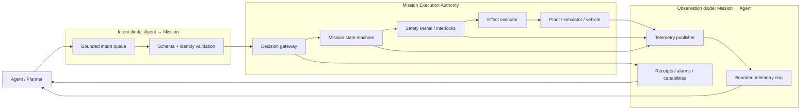
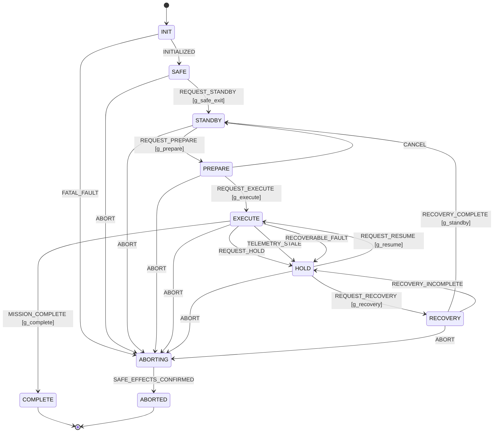
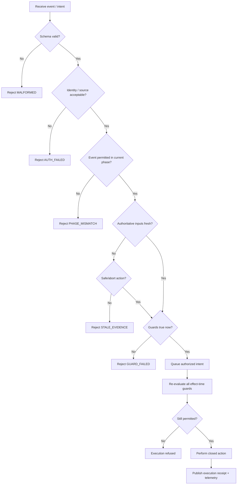
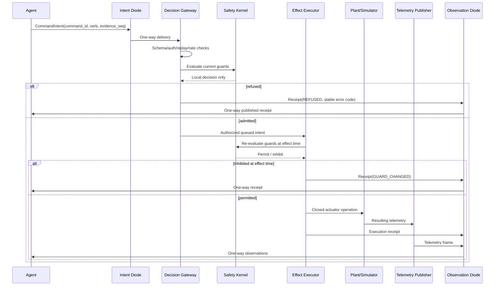

# Mission Configuration / Phase to Executable Telemetry and Diode-Safe Decision Interface

## Executive summary

This report specifies a domain-neutral execution boundary that converts mission configuration and phase logic into an executable telemetry-and-decision interface suitable for autonomous or agent-driven mission software. The design assumes that agents may reason freely but **must not acquire direct access to mission credentials, actuator buses, arbitrary code execution, network endpoints, safety interlocks, or writable authoritative state**.

The most important architectural conclusion is that a genuinely unidirectional boundary cannot simultaneously carry commands toward the mission and acknowledgements or telemetry back to the agent. NIST defines a data diode as a device allowing data to travel only in one direction. Therefore an executable mission interface that needs both requests and observations should be implemented as **two independently constrained one-way channels**:

1. **Intent diode, Agent → Mission:** carries only closed-vocabulary command intents.
2. **Observation diode, Mission → Agent:** carries telemetry, receipts, published capabilities, alarms, and history.

These may share a host in low-assurance simulation, but they must remain logically independent; for high assurance, the directionality should be enforced by separate hardware or independently mediated interfaces. TLS, DTLS, signatures, and MACs provide authentication/integrity but do **not** themselves create unidirectionality. NIST's OT guidance treats cyber-physical systems as requiring security designs that simultaneously account for performance, reliability, and safety, making fail-secure behavior and physical/logical segmentation especially relevant here. citeturn0search0turn3search0turn4view1

The user-supplied diode reference provides a strong starting pattern: closed verbs rather than agent-supplied code or targets; asymmetric reach; published state that is never accepted as authoritative input; destructive atomic intake; declarative/idempotent commands; server-owned safety gates; re-evaluation of scheduled commands at the moment of effect; and bounded telemetry history for stateful simulated vehicles. Those properties are retained here and formalized into an execution contract. fileciteturn0file0

The proposed architecture is:



The mission executor, not the agent, is the final authority. Agent requests are **intents**, never direct actuator commands. Every effect is authorized again immediately before execution against current mission phase, authoritative telemetry freshness, consumable limits, interlocks, and safety state. A command scheduled while permitted must therefore fail if conditions cease to be valid before execution. That reproduces the most reusable safety property in the supplied diode design: **authority is evaluated at the moment of effect, not merely when the request was created.** fileciteturn0file0

For serialization, this report recommends a common semantic schema with three profiles:

| Profile | Recommended role | Security treatment |
|---|---|---|
| Protobuf | Internal executable API, high-rate telemetry | Signed/MACed envelope or protected transport |
| Deterministic CBOR | Compact one-way diode wire format | COSE_Sign1 or COSE_Mac0 |
| I-JSON | Human inspection, test fixtures, low-rate debug | Never bypass executable validation |

CBOR is an Internet Standard designed for compact encoding, deterministic CBOR gives a stable representation suitable for signatures, and COSE defines signing/MAC structures for CBOR. Protocol Buffers provides evolvable numbered fields but requires that field numbers never be reused. I-JSON restricts JSON to improve interoperability, including UTF-8, duplicate-name prohibition, and safer numeric expectations. citeturn10search3turn1search10turn7search0turn7search1turn7search5

Where IP transport exists, new protocols using TLS should require TLS 1.3; as of September 2026, RFC 9846 is the current TLS 1.3 specification and obsoletes RFC 8446, while RFC 9852 updates current best practice to require TLS 1.3 for new TLS-based protocols. DTLS 1.3 remains applicable to datagram transports, but its security properties explicitly differ with respect to ordering/non-replay behavior, so application-level sequence and replay checks remain required. citeturn1search2turn1search9turn1search8

The remainder of the report defines the assumptions, inventories, formal state machine, telemetry messages, diode contracts, decisions, test vectors, invariants, and code-level implementation profile.

## Assumptions and architectural principles

### Explicit assumptions and unspecified mission properties

No mission domain was specified. The word *mission* therefore means a generic cyber-physical or simulated mission that progresses through phases and may perform consequential actions. Spacecraft terminology is used occasionally because the supplied diode specification motivates a simulated capsule, but nothing below depends on orbital flight. CCSDS standards are therefore treated as an **optional interoperability profile**, not as requirements for all deployments. CCSDS currently maintains the Space Packet Protocol, TM Space Data Link Protocol, Unified Space Data Link Protocol, and Space Data Link Security Protocol as active recommendations applicable to space communications. citeturn2search3turn2search1turn2search4

| Property | Assumption for this specification | Must be resolved by deployment |
|---|---|---|
| Mission type | Unspecified; generic cyber-physical or simulation mission | Space, aviation, robotics, industrial, scientific, etc. |
| Number of agents | One or more untrusted/semi-trusted planners | Identity and arbitration rules |
| Number of controlled subsystems | Tens to hundreds of telemetry points; bounded command vocabulary | Exact scale |
| Hard real-time requirement | **Not assumed** | Deadline, jitter and scheduler analysis |
| Baseline decision latency | 100–500 ms for phase decisions | Mission-specific |
| Fast control loops | Outside agent loop | Must remain onboard/local to safety controller |
| Telemetry production | 1–100 Hz depending class | Sensor-specific |
| Command rate | Low to moderate; bounded | Mission-specific |
| Safety criticality | Potentially safety-critical, but assurance level unspecified | Hazard analysis required |
| Human approval | Not assumed | Identify actions requiring operator concurrence |
| Communications reliability | Loss, duplication, reordering, temporary blackout assumed | Quantify channel BER/outage profile |
| Clocks | Clocks may drift; local monotonic clocks always preferred | Time-sync mechanism |
| Network availability | Not assumed across physical diode | Decide filesystem, serial, optical, UDP, etc. |
| Confidentiality | Secondary to integrity/availability in baseline | Classification/privacy assessment |
| Physical adversary | Not assumed in baseline | Add tamper/physical protections if required |
| Byzantine sensors | Some faulty or compromised telemetry possible | Sensor independence/fusion model |
| Agent trust | Agent input is untrusted for safety authorization | Identity may be known without granting authority |
| Mission executor trust | Trusted computing base | Assurance/certification target |
| Irreversible actions | May exist | Explicitly classify per verb |
| Consumables | Generic stocks such as energy/propellant/time margin may exist | Define units and depletion models |

NIST SP 800-82 Rev. 3 is the current final NIST OT security guide; NIST's project page lists Revision 4 only as pre-draft activity as of 2026. Its emphasis on security together with performance, reliability and safety is the appropriate generic model for a mission executor interacting with a physical process. citeturn3search0turn3search8

### Trust and authority model

The interface SHALL distinguish **identity**, **data trust**, and **authority**. They are not interchangeable.

| Trust level | Meaning | Examples | May directly authorize effects? |
|---|---|---|---|
| T0 | Untrusted input | Agent argument, free text, requested deadline | No |
| T1 | Structurally validated | Schema-valid intent, parsed configuration | No |
| T2 | Authenticated source data | Signed sensor/gateway telemetry | Only as input to guards |
| T3 | Safety-authoritative derived state | Safety kernel phase, abort latch, interlock summary | Yes, through predefined policy only |

The agent may possess an identity credential whose sole purpose is attribution. That credential SHALL NOT be an actuator credential or a capability that bypasses mission gates.

A mission action is authorized only by:

\[
Authorize(i,t) =
Schema(i)
\land IdentityAllowed(i)
\land VerbAvailable(i)
\land PhaseGuard(i,t)
\land FreshEvidence(i,t)
\land ResourceGuard(i,t)
\land SafetyGuard(i,t)
\land DeadlineValid(i,t)
\]

For irreversible actions, the generic profile adds:

\[
Authorize_{irr} = Authorize \land IrreversiblePermit \land ConfirmationPolicy
\]

`IrreversiblePermit` is controlled by the trusted mission/safety service, never by an agent-editable telemetry file or request variable.

### Directionality requirement

A **strict physical data diode** SHALL have no reverse signalling path on the same channel. Acknowledgements, protocol negotiation and challenge-response authentication therefore cannot be assumed on a strict one-way leg.

Consequently:

- Transport security that requires bidirectional handshakes belongs either on a bidirectional network **before/after** the diode or in a logical-diode deployment.
- A physical one-way leg should use pre-provisioned verification material and self-contained authenticated messages.
- Mission→Agent telemetry can be signed with a mission private key while agents receive only the corresponding public verification key.
- Agent→Mission requests can be signed by low-privilege agent identity keys, while the mission service retains all effect authorization.
- Replay rejection must be an application feature based on epochs/session IDs and sequence numbers.

TLS 1.3 establishes an authenticated secure channel between communicating peers; it presupposes a bidirectional handshake and a reliable ordered stream. It therefore protects a transport but does not prove diode directionality. RFC 9846 now defines TLS 1.3; RFC 9852 states that new TLS-based protocols must require TLS 1.3. citeturn1search2turn1search9

DTLS 1.3 preserves datagram semantics and adds explicit sequence mechanisms, but the RFC notes that its guarantees differ from TLS regarding order protection/non-replayability. If Connection IDs are used, RFC 9853, published in March 2026, updates DTLS 1.3 with a return-routability mechanism. The mission protocol SHALL still maintain its own command replay ledger. citeturn0search2turn1search0

### Security principles carried from the reference diode

The following are normative requirements for this specification and directly generalize the uploaded diode pattern. fileciteturn0file0

**Closed vocabulary.** Agents SHALL submit a verb plus strongly typed bounded arguments. They SHALL NOT submit executable code, expressions, shell fragments, URLs, filesystem paths, plugin names, hostnames, SQL, or arbitrary workflow programs.

**Published state is a mirror.** Telemetry exported to the agent SHALL never be read back as authoritative mission state.

**Service-owned safety.** Any gate protecting vehicle/process integrity SHALL exist inside trusted mission execution or safety state, not in agent-writable configuration.

**Effect-time authorization.** Scheduled, queued and delayed commands SHALL be fully revalidated immediately before effect.

**Declarative commands.** Prefer `set_mode(STANDBY)` to `toggle_mode()` and `set_target(0.25)` to `increment_target(+0.1)`. Declarative actions are safer after acknowledgement loss.

**Bounded history.** Stateful missions SHALL export a bounded telemetry history or ring so an agent returning after a blackout can distinguish state evolution from a static snapshot.

**Abort authority remains outside the agent.** Safety logic SHALL be able to hold, inhibit or abort independently of agent intent.

## Inventory and executable data model

### Mission phase inventory

The domain-neutral phase subsystem consists of the following categories.

| Element | Required representation | Notes |
|---|---|---|
| State | Stable enum + state entry sequence | Never use display text as identifier |
| Transition | `(source,event,guard,target,actions)` | Deterministic priority |
| External trigger | Typed event | Sensor, operator, agent, clock |
| Internal trigger | Trusted event | Safety kernel, watchdog |
| Timer | Monotonic deadline | No wall-clock-only safety timer |
| Guard | Side-effect-free Boolean predicate | Uses authoritative local data |
| Entry action | Closed internal operation | Must be bounded |
| Exit action | Closed internal operation | Must be bounded |
| Transition action | Closed internal operation | No arbitrary callback supplied by agent |
| Abort | Dominant safety transition | May be latched |
| Hold | Reversible pause | Distinct from abort |
| Recovery | Explicit state/substate | Never implicit retry loop |
| Contingency | Predefined alternate transition | Triggered by explicit fault class |
| Completion | Terminal mission condition | Distinguish success from abort |
| Timeout | Named event | Carries timer ID |
| Inhibit/interlock | Safety-authoritative condition | Never agent-settable |
| Capability | Published currently allowed verbs | Mirror only |
| Irreversibility | Per-verb metadata | Published to agent |
| Resource budget | Remaining/rate/reserve values | Service-owned authoritative values |

SCXML is a useful formal reference model because it defines states, transitions, events, conditions, entry/exit actions and run-to-completion semantics. It also states that expressions used as transition conditions should be side-effect-free in its data-model requirements. The proposed machine below uses those concepts without requiring XML or an SCXML runtime. citeturn6search0

### Telemetry inventory

The executable interface should export raw or subsystem telemetry only when necessary. Decisions should preferably consume a small set of **derived safety quantities** in addition to detailed engineering telemetry.

A baseline profile follows. Rates are proposed engineering defaults, not universal mission requirements.

| Field | Type / units | Nominal rate | Maximum decision age | Priority | Trust |
|---|---|---:|---:|---|---|
| `meta.boot_id` | 128-bit opaque ID | Every frame | N/A | P0 | T3 |
| `meta.seq` | uint64 | Every frame | N/A | P0 | T3 |
| `meta.source_mono_ns` | ns | Every frame | N/A | P0 | T3 |
| `mission.phase` | enum | 10 Hz + event | 250 ms | P0 | T3 |
| `mission.phase_entry_seq` | uint64 | 10 Hz + event | 250 ms | P0 | T3 |
| `safety.abort_latched` | bool | 20 Hz + event | 100 ms | P0 | T3 |
| `safety.interlocks_ok` | bool | 20 Hz | 100 ms | P0 | T3 |
| `safety.inhibit_mask` | uint64 bitset | 20 Hz + event | 100 ms | P0 | T3 |
| `health.overall` | 0.0–1.0 | 10 Hz | 500 ms | P0 | T3 |
| `health.confidence` | 0.0–1.0 | 10 Hz | 500 ms | P0 | T3 |
| `control.error_norm` | 0.0–1.0 normalized | 20 Hz | 250 ms | P0 | T2/T3 |
| `control.stable` | bool | 20 Hz | 250 ms | P0 | T3 |
| `power.reserve_pct` | 0–100 % | 2 Hz | 2 s | P1 | T2 |
| `power.bus_voltage_v` | V, mission range | 10 Hz | 1 s | P1 | T2 |
| `thermal.min_margin_k` | K above limit | 2 Hz | 2 s | P1 | T2/T3 |
| `resource.primary_remaining` | mission-defined SI unit | 1 Hz | 5 s | P1 | T2 |
| `resource.reserve_fraction` | 0.0–1.0 | 1 Hz | 5 s | P1 | T3 |
| `comms.last_input_age_ms` | ms | 1 Hz | 2 s | P2 | T3 |
| `executor.queue_depth` | count | 2 Hz | 2 s | P2 | T3 |
| `executor.last_command_id` | 128-bit ID | Event | N/A | P1 | T3 |
| `executor.last_result` | enum | Event | N/A | P1 | T3 |
| `diode.rx_replay_rejects` | count | 1 Hz | 10 s | P1 | T3 |
| `diode.rx_auth_failures` | count | 1 Hz | 10 s | P1 | T3 |
| `diode.telemetry_drop_count` | count | 1 Hz | 10 s | P2 | T3 |
| `diode.last_sequence_gap` | count | Event | N/A | P1 | T3 |

For a spacecraft-specific adaptation, CCSDS 133.0-B-2 can carry application packets, while CCSDS 132.0-B-3 or USLP can supply link-layer carriage and CCSDS 355.0-B-2 can supply space data-link authentication/confidentiality where that architecture is applicable. The internal agent/decision schema need not expose CCSDS framing directly. citeturn2search3turn2search1turn2search4

### Command, acknowledgement and receipt inventory

A command interface SHALL distinguish four concepts:

| Object | Direction | Meaning |
|---|---|---|
| Intent | Agent → Mission | Requested outcome |
| Intake receipt | Mission → Agent | Request parsed/rejected/queued |
| Execution receipt | Mission → Agent | Effect performed/refused/failed |
| Telemetry evidence | Mission → Agent | Independent observation of resulting state |

An acknowledgement is **not evidence that the physical effect occurred**. The agent should verify resulting state through independent telemetry when the effect is observable.

Recommended command classes:

| Class | Examples | Default treatment |
|---|---|---|
| SAFE | `request_abort`, `request_hold` | Highest priority |
| MODE | `request_phase PREPARE` | Strong guards |
| SETPOINT | `set_target 0.25` | Bounds + phase guard |
| SCHEDULE | `schedule intent at T` | Full effect-time revalidation |
| CONFIG | `set_mission_option X` | Only mutable options |
| DIAGNOSTIC | `request_snapshot` | No physical effect |
| IRREVERSIBLE | `release`, `stage`, `fire_one_shot` | Additional trusted permit |

### Decision-point inventory

The generic mission execution layer contains at least these decisions:

1. Whether the system may leave `SAFE`.
2. Whether preparation may begin.
3. Whether execution may start.
4. Whether execution may continue.
5. Whether a hold is required.
6. Whether execution may resume.
7. Whether contingency/recovery may start.
8. Whether an irreversible action may fire.
9. Whether the mission is complete.
10. Whether an abort must override all other transitions.

The machine should expose **why a decision was denied** through stable public error codes, while keeping sensitive implementation details in operator-only logs.

## Formal mission state machine

### Formal definition

Define the mission executor as:

\[
M = (S,E,G,A,\delta,s_0,F)
\]

where:

- \(S\): finite set of mission states.
- \(E\): typed events.
- \(G\): side-effect-free guards evaluated against authoritative mission state.
- \(A\): closed set of trusted actions.
- \(\delta\): ordered transition relation.
- \(s_0=\text{INIT}\).
- \(F=\{\text{COMPLETE},\text{ABORTED}\}\).

Recommended top-level states are:

\[
S =
\{
INIT,\ SAFE,\ STANDBY,\ PREPARE,\ EXECUTE,\ HOLD,\ RECOVERY,\ COMPLETE,\ ABORTING,\ ABORTED
\}
\]

`SAFE` describes an operational configuration from which a mission may later proceed. `ABORTED` describes a terminal mission outcome. This distinction prevents a post-abort platform safe configuration from accidentally being interpreted as authorization to restart the same mission.

### Statechart



The transition executor SHALL use run-to-completion behavior for each event: once a transition begins, competing external events wait until exit actions, transition actions and entry actions finish, except that an independently implemented safety interrupt may assert an emergency inhibit. SCXML provides a standardized example of run-to-completion state-machine semantics and defines the ordering of exit, transition and entry actions. citeturn6search0

### Event definitions

| Event | Origin | Trusted? | Payload |
|---|---|---|---|
| `INITIALIZED` | executor | Yes | startup checks |
| `REQUEST_STANDBY` | agent/operator | No | command ID |
| `REQUEST_PREPARE` | agent/operator | No | evidence seq |
| `REQUEST_EXECUTE` | agent/operator | No | evidence seq |
| `REQUEST_HOLD` | any authorized source | Conditional | reason |
| `REQUEST_RESUME` | agent/operator | No | evidence seq |
| `REQUEST_RECOVERY` | agent/operator | No | recovery mode |
| `ABORT` | safety kernel/operator/agent | Varies | reason |
| `TELEMETRY_STALE` | safety kernel | Yes | field group |
| `RECOVERABLE_FAULT` | FDIR/safety | Yes | fault code |
| `FATAL_FAULT` | FDIR/safety | Yes | fault code |
| `TIMEOUT` | executor | Yes | timer ID |
| `MISSION_COMPLETE` | executor | Yes | completion evidence |
| `SAFE_EFFECTS_CONFIRMED` | safety kernel | Yes | status |

### Guard definitions

Recommended generic guards are:

```text
g_safe_exit :=
    NOT abort_latched
    AND interlocks_ok
    AND telemetry_core_valid

g_prepare :=
    phase == STANDBY
    AND health.overall >= PREPARE_HEALTH_MIN
    AND health.confidence >= PREPARE_CONFIDENCE_MIN
    AND power.reserve_pct >= PREPARE_POWER_MIN
    AND thermal.min_margin_k >= PREPARE_THERMAL_MARGIN
    AND core_fresh
    AND NOT abort_latched

g_execute :=
    phase == PREPARE
    AND health.overall >= EXEC_HEALTH_MIN
    AND health.confidence >= EXEC_CONFIDENCE_MIN
    AND control.stable
    AND resource.reserve_fraction >= EXEC_RESOURCE_MIN
    AND all_required_interlocks
    AND all_required_fields_fresh
    AND NOT abort_latched

g_resume :=
    phase == HOLD
    AND hold_cause_cleared
    AND g_execute_equivalent_current_conditions

g_complete :=
    mission_objectives_satisfied
    AND completion_confirmation_valid
```

A typical generic baseline might use `PREPARE_CONFIDENCE_MIN = 0.995` and `EXEC_CONFIDENCE_MIN = 0.999`, but these are **configuration examples, not universal safety values**. Confidence must be meaningfully calibrated by the mission's estimation subsystem; a nominal value generated by arbitrary software is not a safety argument.

### Transition table

| Source | Event | Guard | Target | Actions |
|---|---|---|---|---|
| INIT | INITIALIZED | startup checks pass | SAFE | publish capabilities |
| INIT | FATAL_FAULT | always | ABORTING | inhibit effects |
| SAFE | REQUEST_STANDBY | `g_safe_exit` | STANDBY | initialize mission context |
| STANDBY | REQUEST_PREPARE | `g_prepare` | PREPARE | arm reversible resources |
| PREPARE | REQUEST_EXECUTE | `g_execute` | EXECUTE | enable execution envelope |
| PREPARE | CANCEL | true | STANDBY | disarm |
| EXECUTE | REQUEST_HOLD | true | HOLD | freeze/cancel nonessential work |
| EXECUTE | TELEMETRY_STALE | safety policy | HOLD | inhibit stale-dependent effects |
| EXECUTE | RECOVERABLE_FAULT | classified recoverable | HOLD | publish fault |
| HOLD | REQUEST_RESUME | `g_resume` | EXECUTE | restore permitted effects |
| HOLD | REQUEST_RECOVERY | `g_recovery` | RECOVERY | execute bounded recovery plan |
| RECOVERY | RECOVERY_COMPLETE | `g_standby` | STANDBY | clear nonlatched fault |
| EXECUTE | MISSION_COMPLETE | `g_complete` | COMPLETE | safe completion actions |
| any nonterminal | ABORT | true | ABORTING | cancel queues; apply safe actions |
| ABORTING | SAFE_EFFECTS_CONFIRMED | required safe effects observed | ABORTED | latch terminal result |

### Event processing flow



This explicit second guard evaluation is a direct formalization of the supplied reference diode's requirement that deferred work be re-dispatched and re-gated at delivery. fileciteturn0file0

## Telemetry schemas and wire formats

### Common semantic telemetry envelope

Every executable telemetry frame SHALL have these common fields:

| Field | Type | Validation |
|---|---|---|
| `schema_major` | uint16 | Unknown major → reject |
| `schema_minor` | uint16 | Newer minor accepted only under compatibility rules |
| `mission_id` | bounded string/bytes | 1–32 bytes |
| `source_id` | enum | Known source only |
| `boot_id` | 16 bytes | Changes on authoritative publisher restart |
| `seq` | uint64 | Strictly increasing per `(source_id,boot_id)` |
| `source_mono_ns` | uint64 | Nondecreasing |
| `source_time_utc` | timestamp, optional | Diagnostic/correlation |
| `priority` | enum | P0–P3 |
| `quality` | enum | GOOD/DEGRADED/INVALID/UNKNOWN |
| `payload_type` | enum/oneof | Known executable payload |
| `payload` | typed object | Schema validated |
| `auth_context` | protected envelope | Not copied from untrusted payload |

For interoperable textual timestamps, RFC 3339 defines an Internet timestamp profile with an explicit relation to UTC. Safety timeout calculations should nevertheless use monotonic clocks rather than civil time. citeturn6search1

### Protobuf executable contract

The following is a directly implementable baseline.

```proto
syntax = "proto3";

package mission.exec.v1;

import "google/protobuf/timestamp.proto";

enum Priority {
  PRIORITY_UNSPECIFIED = 0;
  PRIORITY_P0_SAFETY   = 1;
  PRIORITY_P1_CONTROL  = 2;
  PRIORITY_P2_STATUS   = 3;
  PRIORITY_P3_BULK     = 4;
}

enum Quality {
  QUALITY_UNSPECIFIED = 0;
  QUALITY_GOOD        = 1;
  QUALITY_DEGRADED    = 2;
  QUALITY_INVALID     = 3;
  QUALITY_UNKNOWN     = 4;
}

enum MissionPhase {
  PHASE_UNSPECIFIED = 0;
  PHASE_INIT        = 1;
  PHASE_SAFE        = 2;
  PHASE_STANDBY     = 3;
  PHASE_PREPARE     = 4;
  PHASE_EXECUTE     = 5;
  PHASE_HOLD        = 6;
  PHASE_RECOVERY    = 7;
  PHASE_COMPLETE    = 8;
  PHASE_ABORTING    = 9;
  PHASE_ABORTED     = 10;
}

message SafetyStatus {
  bool abort_latched = 1;
  bool interlocks_ok = 2;
  uint64 inhibit_mask = 3;
  double health = 4;                  // [0.0, 1.0]
  double confidence = 5;              // [0.0, 1.0]
  bool control_stable = 6;
  double control_error_norm = 7;      // [0.0, 1.0]
}

message ResourceStatus {
  double power_reserve_pct = 1;       // [0.0, 100.0]
  double thermal_min_margin_k = 2;
  double primary_remaining = 3;       // mission-defined SI unit
  double reserve_fraction = 4;        // [0.0, 1.0]
}

message DiodeHealth {
  uint64 replay_rejects = 1;
  uint64 auth_failures = 2;
  uint64 telemetry_drops = 3;
  uint32 command_queue_depth = 4;
}

message TelemetryFrame {
  uint32 schema_major = 1;
  uint32 schema_minor = 2;
  string mission_id = 3;
  uint32 source_id = 4;
  bytes boot_id = 5;                  // exactly 16 bytes
  uint64 seq = 6;
  uint64 source_mono_ns = 7;
  google.protobuf.Timestamp source_time_utc = 8;
  Priority priority = 9;
  Quality quality = 10;

  MissionPhase phase = 11;
  uint64 phase_entry_seq = 12;
  SafetyStatus safety = 13;
  ResourceStatus resources = 14;
  DiodeHealth diode = 15;

  reserved 16 to 31;
}

message CommandIntent {
  uint32 schema_major = 1;
  uint32 schema_minor = 2;
  bytes command_id = 3;               // exactly 16 bytes
  string producer_id = 4;
  uint64 producer_seq = 5;

  string verb = 6;                    // registry lookup only
  bytes argument_blob = 7;            // typed by verb, max bounded
  MissionPhase expected_phase = 8;
  uint64 evidence_frame_seq = 9;

  uint32 max_queue_delay_ms = 10;
  bool request_execution_receipt = 11;

  reserved 12 to 31;
}
```

Protocol Buffer field numbers form part of the binary wire contract; the official Protobuf guidance says not to change or reuse existing field numbers and recommends reserving deleted numbers. Old parsers can generally ignore newly added fields under compatible binary changes, making Protobuf useful for a versioned mission interface. citeturn7search0turn7search1

`argument_blob` above is **not arbitrary serialization**. Each `verb` MUST map to one exact compiled message type, for example:

```proto
message SetTargetArgs {
  uint32 target_id = 1;
  double normalized_value = 2;  // [0.0, 1.0]
}

message ScheduleArgs {
  uint64 mission_mono_deadline_ns = 1;
  CommandIntent inner_intent = 2;
}
```

Do not dispatch by dynamic class name. The registry contains a static decoder:

```text
"set_target"      -> SetTargetArgs
"request_hold"    -> EmptyArgs
"request_abort"   -> AbortArgs
"request_execute" -> RequestExecuteArgs
```

### JSON profile

JSON is appropriate for developer tools, fixtures and low-rate boundary files. For strict interoperability, use UTF-8, prohibit duplicate member names, and avoid relying on integers outside the range exactly representable by common binary64 JSON implementations unless encoded as strings. Those are requirements/recommendations of I-JSON. citeturn7search5

Example telemetry:

```json
{
  "schema_major": 1,
  "schema_minor": 2,
  "mission_id": "mission-alpha",
  "source_id": 1,
  "boot_id": "d2f0e80c66c94644962be281099ac65b",
  "seq": "481992",
  "source_mono_ns": "817233094221",
  "source_time_utc": "2026-09-12T05:03:27.119Z",
  "priority": "P0",
  "quality": "GOOD",
  "phase": "PREPARE",
  "phase_entry_seq": "481201",
  "safety": {
    "abort_latched": false,
    "interlocks_ok": true,
    "inhibit_mask": "0",
    "health": 0.9987,
    "confidence": 0.9996,
    "control_stable": true,
    "control_error_norm": 0.013
  },
  "resources": {
    "power_reserve_pct": 76.2,
    "thermal_min_margin_k": 13.4,
    "primary_remaining": 812.7,
    "reserve_fraction": 0.63
  }
}
```

Because JSON implementations differ in 64-bit integer handling, sequence and nanosecond fields are strings in this JSON profile even though they are native integers in Protobuf/CBOR. I-JSON explicitly warns against assuming exact processing beyond the common 53-bit integer range. citeturn7search5

An executable JSON Schema subset:

```json
{
  "$schema": "https://json-schema.org/draft/2020-12/schema",
  "$id": "urn:mission:telemetry:v1",
  "type": "object",
  "additionalProperties": false,
  "required": [
    "schema_major",
    "schema_minor",
    "mission_id",
    "source_id",
    "boot_id",
    "seq",
    "source_mono_ns",
    "priority",
    "quality",
    "phase",
    "safety"
  ],
  "properties": {
    "schema_major": {
      "const": 1
    },
    "schema_minor": {
      "type": "integer",
      "minimum": 0,
      "maximum": 65535
    },
    "mission_id": {
      "type": "string",
      "minLength": 1,
      "maxLength": 32,
      "pattern": "^[A-Za-z0-9._-]+$"
    },
    "source_id": {
      "type": "integer",
      "minimum": 1,
      "maximum": 65535
    },
    "boot_id": {
      "type": "string",
      "pattern": "^[0-9a-f]{32}$"
    },
    "seq": {
      "type": "string",
      "pattern": "^(0|[1-9][0-9]{0,19})$"
    },
    "source_mono_ns": {
      "type": "string",
      "pattern": "^(0|[1-9][0-9]{0,19})$"
    },
    "priority": {
      "enum": ["P0", "P1", "P2", "P3"]
    },
    "quality": {
      "enum": ["GOOD", "DEGRADED", "INVALID", "UNKNOWN"]
    },
    "phase": {
      "enum": [
        "INIT",
        "SAFE",
        "STANDBY",
        "PREPARE",
        "EXECUTE",
        "HOLD",
        "RECOVERY",
        "COMPLETE",
        "ABORTING",
        "ABORTED"
      ]
    },
    "safety": {
      "type": "object",
      "additionalProperties": false,
      "required": [
        "abort_latched",
        "interlocks_ok",
        "health",
        "confidence",
        "control_stable",
        "control_error_norm"
      ],
      "properties": {
        "abort_latched": {"type": "boolean"},
        "interlocks_ok": {"type": "boolean"},
        "inhibit_mask": {
          "type": "string",
          "pattern": "^(0|[1-9][0-9]{0,19})$"
        },
        "health": {
          "type": "number",
          "minimum": 0.0,
          "maximum": 1.0
        },
        "confidence": {
          "type": "number",
          "minimum": 0.0,
          "maximum": 1.0
        },
        "control_stable": {"type": "boolean"},
        "control_error_norm": {
          "type": "number",
          "minimum": 0.0,
          "maximum": 1.0
        }
      }
    }
  }
}
```

JSON Schema's currently published version is 2020-12, and its validation vocabulary is specifically intended to assert structural constraints on JSON instances. citeturn11search0turn11search4

### CBOR/COSE profile

For an actual one-way binary diode, deterministic CBOR plus COSE is the preferred profile in this report.

CBOR is standardized as RFC 8949 / STD 94 and defines deterministic encoding requirements, including definite lengths and deterministic map ordering. COSE provides signing, MAC and encryption structures over CBOR; its own encoding rules build on deterministic CBOR requirements. citeturn10search3turn4view5

Suggested CDDL:

```cddl
telemetry-frame = {
  1: 1,                         ; schema_major
  2: uint .le 65535,            ; schema_minor
  3: tstr .size (1..32),        ; mission_id
  4: uint .le 65535,            ; source_id
  5: bstr .size 16,             ; boot_id
  6: uint,                      ; seq
  7: uint,                      ; source_mono_ns
  8: 1..4,                      ; priority
  9: 1..4,                      ; quality
  10: 1..10,                    ; mission phase
  11: uint,                     ; phase_entry_seq
  12: safety-status,
  ? 13: resource-status,
  ? 14: diode-health
}

safety-status = {
  1: bool,                      ; abort_latched
  2: bool,                      ; interlocks_ok
  3: uint,                      ; inhibit_mask
  4: float .ge 0.0 .le 1.0,    ; health
  5: float .ge 0.0 .le 1.0,    ; confidence
  6: bool,                      ; control_stable
  7: float .ge 0.0 .le 1.0     ; control_error_norm
}
```

CDDL is standardized in RFC 8610, with its grammar subsequently updated by RFC 9682. citeturn10search7turn10search6

The transmitted object should be conceptually:

```text
COSE_Sign1(
    protected = {
        algorithm,
        key_id,
        content_type = "application/mission-telemetry+cbor"
    },
    payload = deterministic_cbor(telemetry_frame),
    signature = ...
)
```

The verifier SHALL reject:

- an unsupported algorithm;
- an unknown key identifier;
- duplicate CBOR map keys;
- non-deterministic encoding where the profile requires determinism;
- invalid signature/MAC;
- unexpected content type;
- oversized envelope;
- malformed CDDL instance;
- unsupported schema major version;
- replayed or regressed sequence numbers.

COSE explicitly prohibits generating or processing maps with duplicate labels in its protected structures, which aligns well with strict mission parsing. citeturn1search10

## Diode interface specification

### Channel architecture

The normative interface is:

```text
CHANNEL C1: intent
Direction: Agent → Mission
Content: authenticated, bounded command intents only
No telemetry
No credentials returned
No arbitrary destinations

CHANNEL C2: observation
Direction: Mission → Agent
Content: telemetry, capability publication, receipts, alarms
No mission-authoritative input

OPTIONAL C3: operator safety
Direction: Independent operator/safety authority → Mission
Content: abort/inhibit/recovery authorization
Not exposed to agent
```

The separation is intentionally stronger than ordinary RPC. NIST SP 800-53 treats managed interfaces, boundary protection and component isolation as fundamental communications-protection mechanisms; NIST SP 800-82 further adapts those concerns to OT environments where safety and availability constraints matter. citeturn4view1turn3search0

### Assurance tiers

| Tier | Implementation | Security claim |
|---|---|---|
| D0 | Two directories on one unrestricted process | Testing only; no diode claim |
| D1 | Separate processes, Unix identities, ACLs, mount namespaces | Logical directional enforcement |
| D2 | Separate VMs/containers and independent mediated queues | Stronger logical separation |
| D3 | Separate NICs/interfaces with one-way gateway policy | Network-enforced direction |
| D4 | Hardware unidirectional transmitter/receiver | Physical one-way enforcement |

A shared filesystem like the supplied reference design is a useful simulation of asymmetric authority, but because a filesystem and host normally remain physically bidirectional it is properly described as a **logical diode architecture**, not proof of hardware one-way flow. The supplied specification itself relies on process/network/container separation and narrowly defined filesystem surfaces. fileciteturn0file0

### Filesystem mailbox profile

For a simulation implementation:

```text
/mission-intent/
    inbox/              agent writes; mission reads
    processing/         mission only
    rejected/           mission only; not agent-readable

/mission-observation/
    frames/
        0000.cbor
        ...
        1023.cbor       bounded ring
    latest.cbor
    receipts/
    capabilities.cbor
    health.cbor
```

Permissions:

```text
agent:
    WRITE intent/inbox
    READ observation/*
    NO ACCESS processing/
    NO ACCESS mission runtime/config/credentials

mission:
    READ+DELETE intent/inbox
    READ+WRITE processing/
    WRITE observation/*
```

A file is committed with:

```text
write temp file
fsync(temp)
atomic rename(temp, final)
```

The mission reader SHALL never execute partially written content.

For command consumption, there are two defensible semantics:

**At-most-once dispatch:** move/clear before execution. A crash may lose an intent, but it cannot automatically replay a consequential action.

**Durable idempotent dispatch:** persist request ID in an execution ledger before actuation and make downstream effects idempotent. This is preferable when command loss is unacceptable.

Exactly-once physical effects cannot be guaranteed merely by a message queue if the executor can crash between performing an effect and recording its completion. Therefore the actuator-facing operation itself should use an idempotency key or declarative final state wherever possible.

### Message queues and buffering

Recommended defaults:

| Queue | Capacity | Overflow policy |
|---|---:|---|
| P0 command | 16 reserved slots | Never displaced by lower priority |
| P1 command | 64 | Reject newest with `QUEUE_FULL` |
| P2/P3 command | 128 | Reject/throttle |
| P0 telemetry | 256 | Drop oldest only after alarm |
| P1 telemetry | 1024 | Drop oldest |
| P2/P3 telemetry | bounded ring | Sample/coalesce/drop |

A queue SHALL NOT let a flood of diagnostics prevent abort or safety traffic from being accepted.

Suggested rate limits:

| Intent class | Sustained | Burst |
|---|---:|---:|
| Abort/hold | 10/s | 10 |
| Phase transitions | 2/s | 4 |
| Reversible setpoints | 20/s | 20 |
| Scheduling | 2/s | 4 |
| Diagnostics | 1/s | 5 |

These are starting limits, not control-loop specifications. High-bandwidth real-time control belongs behind the mission boundary rather than in an agent request loop.

### Replay protection

Each authenticated producer maintains:

```text
producer identity
producer epoch/session
monotonic sequence number
command_id
durable accepted/rejected ledger
```

For telemetry:

```text
replay_key = (source_id, boot_id, seq)
```

Acceptance rule:

```text
signature_valid
AND boot_id currently accepted
AND seq > last_seq[source_id, boot_id]
AND seq - last_seq <= configured_gap_policy
```

For command intents:

```text
command_id unseen
AND producer_seq > producer_high_water
AND request not expired
AND producer identity active
```

The ledger should survive executor restart if replay could cause a dangerous repeated effect.

TLS 1.3 explicitly warns that early/0-RTT data lacks normal cross-connection non-replay guarantees. For mission commands, **0-RTT SHALL NOT be used for consequential effects**. This remains prudent under current TLS 1.3 because RFC 9846 continues to document weaker replay properties for early data. citeturn1search2

### Authentication and integrity

Recommended mechanisms by deployment:

| Boundary | Mechanism |
|---|---|
| Physical one-way telemetry | COSE_Sign1, public-key verification |
| Physical one-way command | COSE_Sign1 or COSE_Mac0 with provisioned keys |
| Logical local filesystem | Signature/MAC + OS ACLs |
| Reliable IP stream | TLS 1.3 + application replay IDs |
| Datagram IP | DTLS 1.3 + application sequence window |
| Space link | CCSDS SDLS where applicable |

COSE supports message-level authentication independent of bidirectional transport. TLS 1.3 provides confidentiality, peer authentication and integrity for stream transports; DTLS 1.3 adapts comparable protections to datagrams but preserves loss/reordering semantics. CCSDS SDLS supplies security headers/trailers and procedures for authentication and/or confidentiality at applicable CCSDS data links. citeturn4view5turn1search2turn1search8turn2search4

### Capability publication

`capabilities` is Mission→Agent only:

```json
{
  "schema_major": 1,
  "phase": "PREPARE",
  "verbs": [
    {
      "name": "request_execute",
      "available": true,
      "irreversible": false,
      "args_schema": "RequestExecuteArgs/v1"
    },
    {
      "name": "request_abort",
      "available": true,
      "irreversible": false,
      "args_schema": "AbortArgs/v1"
    },
    {
      "name": "release_primary",
      "available": false,
      "irreversible": true,
      "args_schema": "ReleasePrimaryArgs/v1"
    }
  ]
}
```

The agent MAY use this to decide what to request. The mission service MUST NOT rely on it as authorization and MUST calculate actual availability again when the request arrives and immediately before execution.

### Sequence diagram



The dashed/return arrows inside the trusted mission boundary are not crossings of the diode. No response ever travels backward over the intent channel.

### API contract

A command SHALL include:

```text
command_id
producer_id
producer_seq
verb
typed arguments
expected_phase
optional evidence_frame_seq
maximum permitted queue delay
schema version
authentication envelope
```

It SHALL NOT include:

```text
hostname
IP address
URL
filesystem path
module/library name
code
expression language
shell fragment
SQL
arbitrary callback
credential
raw actuator-bus frame
```

### Stable error contract

```text
OK
MALFORMED
SCHEMA_UNSUPPORTED
AUTH_FAILED
SOURCE_DISABLED
REPLAY
EXPIRED
RATE_LIMITED
QUEUE_FULL
VERB_UNKNOWN
VERB_UNAVAILABLE
ARG_RANGE
PHASE_MISMATCH
EVIDENCE_UNKNOWN
STALE_EVIDENCE
CONFIDENCE_LOW
RESOURCE_INSUFFICIENT
SAFETY_INTERLOCK
ABORT_LATCHED
GUARD_FAILED
GUARD_CHANGED
EXECUTION_FAILED
INTERNAL_ERROR
```

Receipt example:

```json
{
  "schema_major": 1,
  "command_id": "93cc6f7f43e841de9e0eb92419f746f8",
  "status": "REFUSED",
  "error": "GUARD_CHANGED",
  "public_reason": "execution conditions no longer permit this action",
  "mission_phase": "HOLD",
  "receipt_seq": "114421",
  "source_mono_ns": "817255019322"
}
```

Internal stack traces, filesystem locations, secrets, key IDs not intended for agents, memory addresses, internal hostnames and detailed interlock wiring SHALL NOT appear in public receipts.

### Failure modes

| Failure | Required behavior |
|---|---|
| Intent diode unavailable | No new agent effects; autonomous safety continues |
| Observation diode unavailable | Agent becomes blind; non-safe actions eventually refuse |
| Mission executor restart | New `boot_id`; replay ledger recovered |
| Telemetry publisher restart | New source epoch; discontinuity alarm |
| Agent restart | New producer session or continued persisted sequence |
| Queue full | Preserve safety-priority capacity |
| Signature failure | Drop/refuse; increment counter |
| Unknown schema major | Refuse |
| Invalid telemetry | Do not substitute zero/default as valid data |
| Clock disagreement | Use local monotonic timing for safety |
| Sequence gap | Mark data continuity degraded |
| State publication corrupted | Signature/validation failure; never ingest as state |
| Delayed scheduled action | Recheck deadline and all guards |
| Ack lost after effect | Agent reconciles through telemetry/idempotent reassertion |
| Agent floods requests | Rate-limit without starving safety work |
| Safety kernel unavailable | Fail secure: inhibit hazardous effects |

NIST's firmware-resiliency guidance frames resilience in terms of protection, detection and secure recovery from unauthorized changes. That same structure is useful for the trusted mission gateway: protect safety-authoritative state, detect invalid behavior, and recover into a known-safe condition. citeturn3search2

## Decision mapping, safety and verification

### Decision-to-telemetry matrix

The exact numeric thresholds are configuration data owned by the mission authority. The generic mapping is:

| Decision | Required telemetry | Max freshness | Confidence | Allowed outputs |
|---|---|---:|---:|---|
| Leave SAFE | phase, abort latch, interlocks, core telemetry validity | 500 ms | ≥0.995 | `request_standby` |
| Enter PREPARE | health, resources, thermal, power, interlocks | 1 s core / 2 s slow | ≥0.995 | `request_prepare` |
| Enter EXECUTE | phase, health, control stability, resources, interlocks | 250 ms core | ≥0.999 | `request_execute` |
| Continue EXECUTE | health, control, abort, relevant sensor group | 100–500 ms | ≥ configured min | continue only |
| Hold | any unsafe/stale prerequisite | event/100 ms | N/A | `request_hold` or automatic HOLD |
| Resume | prior fault cleared + full execute guards | 250 ms | ≥0.999 | `request_resume` |
| Start recovery | fault classification, resources, recovery preconditions | 500 ms | ≥0.995 | named recovery verb |
| Irreversible action | dedicated interlock, phase, health, geometry/control, resource margin | 100 ms or hazard-defined | ≥0.999 plus trusted permit | exact irreversible verb only |
| Complete | mission objective state, safe terminal conditions | mission-defined | ≥0.999 where applicable | complete |
| Abort | abort request/fatal fault/interlock violation | immediate | no minimum for trusted fatal trigger | abort only |

A crucial implementation detail is that `evidence_frame_seq` is informational evidence, **not a way for the agent to freeze authorization at an earlier safe moment**.

For example:

```text
Agent observes frame 5000:
    phase=PREPARE
    interlocks_ok=true

Agent sends:
    request_execute(evidence_frame_seq=5000)

At command arrival:
    current internal frame=5030
    interlocks_ok=false

Result:
    SAFETY_INTERLOCK
```

The gateway SHALL use current authoritative state, not the historical frame claimed by the agent.

### Freshness calculation

Within the trusted executor:

```text
age_ns =
    executor_monotonic_now -
    telemetry_local_acquisition_monotonic_ns
```

Do not base safety freshness solely on agent-reported timestamps.

Exported telemetry includes source time so agents can detect probable staleness, but the **mission authority's freshness calculation is final**.

Each guard declares dependencies:

```yaml
request_execute:
  requires:
    mission.phase:
      max_age_ms: 250
    safety.abort_latched:
      max_age_ms: 100
    safety.interlocks_ok:
      max_age_ms: 100
    health.overall:
      max_age_ms: 500
    health.confidence:
      max_age_ms: 500
    control.stable:
      max_age_ms: 250
    resources.reserve_fraction:
      max_age_ms: 2000
```

This dependency manifest should be machine-readable and generate both runtime checks and verification tests.

### Safety invariants

The following invariants are the core verification targets.

**Invariant A — vocabulary closure**

\[
ExecutedEffect \Rightarrow verb \in Registry
\]

No unregistered agent input can cause an effect.

**Invariant B — no direct agent authority**

\[
AgentRequest \not\Rightarrow ActuatorEffect
\]

There is always a trusted authorization step between them.

**Invariant C — effect-time validation**

\[
Effect(i,t) \Rightarrow Guards(i,t)=true
\]

A request being valid at admission time is insufficient.

**Invariant D — stale-dependent effects are prohibited**

\[
RequiredTelemetryStale \Rightarrow
\neg HazardousEffect
\]

Safe/abort transitions may be exempt.

**Invariant E — abort dominance**

\[
AbortLatched \Rightarrow
\forall a \in HazardousActions:\ \neg Permit(a)
\]

**Invariant F — published state is nonauthoritative**

\[
AgentWrite(TelemetryMirror) \not\Rightarrow Change(MissionState)
\]

**Invariant G — sequence anti-replay**

For one `(producer, epoch)`:

\[
Accepted(seq_n) \Rightarrow seq_n > highwater
\]

**Invariant H — resource floor**

\[
Effect \Rightarrow RemainingAfterEffect \ge SafetyReserve
\]

for any action subject to a mandatory reserve.

**Invariant I — irreversible actions need explicit classification**

\[
Irreversible(a) \Rightarrow
Registry[a].irreversible = true
\land TrustedPermit(a)
\]

**Invariant J — terminal abort cannot silently reset**

\[
MissionState=ABORTED \Rightarrow
MissionState\neq EXECUTE
\]

without creation of a new mission/session authorized outside the normal agent interface.

### Monitoring telemetry for diode/security failure

Publish counters, never secrets:

```text
rx_frames_total
rx_bytes_total
rx_schema_rejects
rx_auth_failures
rx_replay_rejects
rx_rate_limited
rx_queue_rejects
rx_unknown_verbs
rx_phase_mismatches
effect_guard_changed
telemetry_frames_total
telemetry_drops
telemetry_sequence_gaps
telemetry_sign_failures_internal
last_valid_intent_mono_ns
last_valid_telemetry_mono_ns
command_queue_high_water
safety_inhibit_count
abort_count
```

A diode breach monitor should alarm on impossible flow characteristics, for example:

```text
Intent interface receives a telemetry response        -> architectural violation
Observation interface receives writable command data  -> architectural violation
Agent can open mission service TCP connection          -> isolation violation
Agent can read mission credential file                 -> credential boundary violation
Mission reads exported telemetry mirror as input       -> state authority violation
```

NIST SP 800-53's control catalog includes communications protection, integrity, auditing and monitoring families; these counters provide concrete evidence for implementing those classes of controls around the mission boundary. citeturn4view1

### Verification matrix and test vectors

NASA's current software engineering guidance requires hazardous software requirements to be verified through testing, and its software assurance material treats safety planning and verification as explicit engineering work rather than assumptions about correct code. citeturn8search4turn8search7

| Test | Input / setup | Expected result |
|---|---|---|
| TV-A valid transition | Valid signed `request_prepare`; all guards true | Accepted; state → PREPARE |
| TV-B wrong phase | `request_execute` while STANDBY | `PHASE_MISMATCH`; no effect |
| TV-C stale critical telemetry | Interlock frame older than max age | `STALE_EVIDENCE`; hold/inhibit |
| TV-D low confidence | Health confidence 0.90 with 0.999 requirement | `CONFIDENCE_LOW` |
| TV-E abort latch | Any hazardous request with abort latched | `ABORT_LATCHED` |
| TV-F exact replay | Same producer epoch and sequence twice | First handled; second `REPLAY` |
| TV-G sequence regression | high-water 500, receive 499 | `REPLAY` |
| TV-H duplicate command ID | New producer seq but previous command ID | `REPLAY`/duplicate receipt |
| TV-I bad signature | Flip one payload bit | `AUTH_FAILED`; no parse-to-effect |
| TV-J oversized packet | Envelope > configured max | `MALFORMED`; bounded processing |
| TV-K malformed batch | One invalid command in atomic batch | Entire batch refused if batch atomicity selected |
| TV-L scheduled guard change | Valid schedule; interlock trips before effect | `GUARD_CHANGED`; no effect |
| TV-M queue saturation | Fill P2 queue, then send P0 abort | Abort accepted in reserved P0 capacity |
| TV-N lost execution receipt | Execute action but suppress C2 receipt | Agent determines state via telemetry; no blind imperative retry |
| TV-O telemetry ring overrun | Agent absent > ring depth | Sequence gap visible; no fabricated continuity |
| TV-P unknown major | `schema_major=2` on v1 executor | `SCHEMA_UNSUPPORTED` |
| TV-Q additive minor field | v1-compatible extra Protobuf field | Old consumer ignores as allowed |
| TV-R exported-state tampering | Agent edits local copied telemetry | Mission behavior unchanged |
| TV-S command-path outage | Disconnect C1 | Autonomous safety and current safe control continue |
| TV-T telemetry outage | Disconnect C2 | Agent sees stale data; subsequent hazardous requests fail locally in gateway |
| TV-U restart/replay | Executor restart then replay old authenticated intent | Rejected using durable ledger/epoch policy |
| TV-V hidden/unlisted verb | Guess a nonexistent/hidden effectful verb | No physical effect |
| TV-W irreversible without permit | Request correct irreversible verb but permit false | `SAFETY_INTERLOCK` |
| TV-X effect-time sensor failure | Sensor valid at enqueue, invalid at execution | No effect |
| TV-Y duplicate JSON member | Duplicate `phase` field | Reject |
| TV-Z nonfinite numeric | NaN/Infinity in required finite quantity | Reject |

### Simulation scenarios

Verification should combine unit tests with mission-level simulation.

**Nominal mission.** INIT → SAFE → STANDBY → PREPARE → EXECUTE → COMPLETE while continuously checking all invariants.

**Communications blackout.** Stop observation delivery, allow the physical simulation to evolve, then restore telemetry. Verify that the ring exposes discontinuity and that agents do not infer a flat state during the blackout.

**Sensor stale-at-boundary.** Freeze one telemetry source while leaving all other values apparently healthy. Verify the dependent decision fails due to age, not value.

**Race between request and inhibit.** Admit an action and trip an interlock before execution. Expected result: `GUARD_CHANGED`.

**Crash between effect and receipt.** Execute an idempotent command, crash before publishing the receipt, restart and resend. Verify no duplicate physical transition.

**Resource exhaustion.** Repeatedly request resource-consuming work and verify the service-owned reserve floor wins over agent requests.

**Clock jump.** Move UTC time backward/forward while leaving monotonic clock valid. Safety timers must remain correct.

**Sequence attack.** Mix old signed frames, duplicates, very large forward jumps and cross-session frames.

**Queue attack.** Flood diagnostics while injecting a safety event. Safety processing latency must remain within its requirement.

**Telemetry forgery.** Alter health to `1.0` after signing. Authentication must fail.

**State-mirror attack.** Modify exported `phase=EXECUTE` while actual state is SAFE. Subsequent intent must still be evaluated against SAFE.

## Implementation guidance and standards basis

### Command registry

The registry is the security boundary between natural-language/agent reasoning and executable effects.

```python
from dataclasses import dataclass
from enum import Enum
from typing import Callable, Any

class Risk(Enum):
    SAFE = "safe"
    REVERSIBLE = "reversible"
    IRREVERSIBLE = "irreversible"

@dataclass(frozen=True)
class VerbSpec:
    name: str
    decoder: Callable[[bytes], Any]
    guard_name: str
    risk: Risk
    max_payload_bytes: int
    max_queue_delay_ms: int
    rate_class: str

VERBS = {
    "request_hold": VerbSpec(
        name="request_hold",
        decoder=parse_hold_args,
        guard_name="guard_hold",
        risk=Risk.SAFE,
        max_payload_bytes=128,
        max_queue_delay_ms=100,
        rate_class="safety",
    ),
    "request_execute": VerbSpec(
        name="request_execute",
        decoder=parse_execute_args,
        guard_name="guard_execute",
        risk=Risk.REVERSIBLE,
        max_payload_bytes=256,
        max_queue_delay_ms=500,
        rate_class="phase",
    ),
    "release_primary": VerbSpec(
        name="release_primary",
        decoder=parse_release_args,
        guard_name="guard_release_primary",
        risk=Risk.IRREVERSIBLE,
        max_payload_bytes=128,
        max_queue_delay_ms=100,
        rate_class="irreversible",
    ),
}
```

There is deliberately no:

```python
eval(...)
exec(...)
importlib.import_module(agent_value)
subprocess.run(agent_value)
open(agent_path)
requests.get(agent_url)
```

in the dispatch path.

### Strict parser pipeline

Recommended processing order:

```python
def accept_intent(raw_envelope: bytes, ctx: GatewayContext) -> Receipt:
    # Hard limit before expensive cryptography or decoding.
    if len(raw_envelope) > ctx.max_envelope_bytes:
        return Receipt.refused("MALFORMED")

    # Authenticate the envelope and obtain the authenticated payload.
    verified = ctx.authenticator.verify(raw_envelope)
    if verified is None:
        ctx.metrics.auth_failures += 1
        return Receipt.refused("AUTH_FAILED")

    # Parse using a bounded, non-dynamic schema.
    try:
        intent = CommandIntent.FromString(verified.payload)
    except Exception:
        return Receipt.refused("MALFORMED")

    if intent.schema_major != SUPPORTED_MAJOR:
        return Receipt.refused("SCHEMA_UNSUPPORTED")

    if len(intent.command_id) != 16:
        return Receipt.refused("MALFORMED")

    # Replay checks precede business logic.
    if ctx.replay.seen_command(intent.command_id):
        return Receipt.refused("REPLAY")

    if not ctx.replay.sequence_is_new(
        intent.producer_id,
        verified.session_id,
        intent.producer_seq,
    ):
        return Receipt.refused("REPLAY")

    spec = VERBS.get(intent.verb)
    if spec is None:
        return Receipt.refused("VERB_UNKNOWN")

    if len(intent.argument_blob) > spec.max_payload_bytes:
        return Receipt.refused("ARG_RANGE")

    try:
        args = spec.decoder(intent.argument_blob)
    except ValidationError:
        return Receipt.refused("ARG_RANGE")

    if not ctx.rate_limit.allow(intent.producer_id, spec.rate_class):
        return Receipt.refused("RATE_LIMITED")

    # Admission-time safety evaluation.
    decision = ctx.policy.evaluate(
        verb=spec,
        args=args,
        expected_phase=intent.expected_phase,
        evidence_seq=intent.evidence_frame_seq,
        now_mono_ns=ctx.clock.monotonic_ns(),
    )

    if not decision.allowed:
        return Receipt.refused(decision.public_error)

    # Commit replay state before enqueueing consequential work.
    ctx.replay.commit(intent)

    ctx.queue.enqueue(
        AuthorizedIntent(
            command_id=intent.command_id,
            verb=spec.name,
            args=args,
            admitted_phase=ctx.state.phase,
            admitted_mono_ns=ctx.clock.monotonic_ns(),
            expires_mono_ns=(
                ctx.clock.monotonic_ns()
                + min(
                    intent.max_queue_delay_ms,
                    spec.max_queue_delay_ms
                ) * 1_000_000
            ),
        )
    )

    return Receipt.accepted()
```

### Effect-time execution

```python
def execute_authorized(item: AuthorizedIntent, ctx: ExecutorContext) -> Receipt:
    now = ctx.clock.monotonic_ns()

    if now > item.expires_mono_ns:
        return Receipt.refused("EXPIRED")

    spec = VERBS[item.verb]

    # This is mandatory even though admission already succeeded.
    decision = ctx.policy.evaluate_current(
        verb=spec,
        args=item.args,
        now_mono_ns=now,
    )

    if not decision.allowed:
        ctx.metrics.effect_guard_changed += 1
        return Receipt.refused("GUARD_CHANGED")

    if spec.risk is Risk.IRREVERSIBLE:
        if not ctx.safety.irreversible_permit(spec.name):
            return Receipt.refused("SAFETY_INTERLOCK")

    try:
        result = ctx.effects.apply_declarative(
            command_id=item.command_id,
            verb=spec.name,
            args=item.args,
        )
    except EffectFailure:
        return Receipt.failed("EXECUTION_FAILED")

    return Receipt.executed(result.effect_id)
```

The `effects` API should be smaller still:

```text
set_mode(mode)
set_target(target_id, value)
hold()
abort(reason)
perform_named_one_shot(action_id, command_id)
```

No generic `write_register(address,value)` should cross the agent boundary unless raw register access is itself the explicitly reviewed mission interface.

### State-machine executor

```python
@dataclass(frozen=True)
class Transition:
    source: Phase
    event: EventType
    guard: Callable[["Context", "Event"], bool]
    target: Phase
    action: Callable[["Context", "Event"], None]


TRANSITIONS = (
    Transition(
        Phase.SAFE,
        EventType.REQUEST_STANDBY,
        guard_safe_exit,
        Phase.STANDBY,
        enter_standby,
    ),
    Transition(
        Phase.STANDBY,
        EventType.REQUEST_PREPARE,
        guard_prepare,
        Phase.PREPARE,
        enter_prepare,
    ),
    Transition(
        Phase.PREPARE,
        EventType.REQUEST_EXECUTE,
        guard_execute,
        Phase.EXECUTE,
        enter_execute,
    ),
)


def process_event(ctx: Context, event: Event) -> TransitionResult:
    # Abort has explicit dominance.
    if event.type is EventType.ABORT and ctx.phase not in TERMINAL_PHASES:
        inhibit_hazardous_effects(ctx)
        ctx.phase = Phase.ABORTING
        publish_phase_change(ctx)
        return TransitionResult.TAKEN

    candidates = [
        t for t in TRANSITIONS
        if t.source == ctx.phase and t.event == event.type
    ]

    # Configuration validation should guarantee <=1 enabled transition
    # for a given state/event unless priority is explicitly declared.
    for transition in candidates:
        if transition.guard(ctx, event):
            old = ctx.phase
            run_exit_action(old, ctx)
            transition.action(ctx, event)
            ctx.phase = transition.target
            run_entry_action(ctx.phase, ctx)
            publish_phase_change(ctx)
            return TransitionResult.TAKEN

    return TransitionResult.REFUSED
```

At startup, statically verify that:

```text
every nonterminal state is reachable
every transition target exists
every timer has a cancellation/expiry policy
every irreversible action is explicitly marked
every effect verb has a guard
every guard declares telemetry dependencies
no hazardous verb is enabled in ABORTED
ABORT is defined from every required nonterminal state
all public errors are from the stable enum
```

### Schema/version strategy

Use:

```text
schema_major:
    compatibility-breaking semantic contract

schema_minor:
    additive compatible changes

producer software version:
    diagnostic only

mission configuration version:
    identifies thresholds and phase configuration

state-machine definition hash:
    cryptographic digest of loaded mission machine
```

Protobuf evolution rules SHALL include:

```text
Never reuse a field number.
Reserve deleted field numbers.
Do not silently reinterpret the units of an existing field.
Do not change field meaning while keeping the same tag.
Add a new field for a new semantic.
Do not make zero mean a safety-critical valid condition unless explicitly intended.
```

Those rules align with Protobuf's official compatibility guidance, particularly its prohibition on field-number reuse. citeturn7search0turn7search1

For JSON, unknown properties in an executable command SHOULD be rejected unless the schema explicitly marks an extension location. For telemetry, compatibility rules may permit unknown additive fields after the authenticated message is validated.

### Safety-oriented C/C++ implementation

Where the trusted executor is implemented in C or C++ for a safety-critical target, a project may adopt MISRA C:2023/MISRA C++ guidance as part of its coding-standard and static-analysis regime. MISRA continues to publish guidance and addenda for MISRA C:2023, including mappings to security-related language guidance. The precise compliance scheme should be chosen by the safety assurance process rather than assumed solely from the mission interface design. citeturn12search0turn12search1

Regardless of language, the trusted implementation should prohibit:

```text
unbounded recursion in the execution path
unbounded queue growth
unchecked integer conversions
implicit unit conversions
NaN/Infinity for safety quantities unless explicitly modeled
dynamic loading selected by agent input
agent-controlled allocation sizes above hard limits
agent-controlled filesystem locations
agent-controlled network destinations
silent exception swallowing
fall-through-to-allow behavior
```

### Standards and source basis

| Source | Application to this specification |
|---|---|
| NIST SP 800-82 Rev. 3 | OT/cyber-physical security, safety/reliability context |
| NIST data-diode definition | Precise one-direction meaning |
| NIST SP 800-53 Rev. 5 / Release 5.2.0 | Boundary, communications, integrity, monitoring control framework |
| NIST SP 800-193 | Protect/detect/recover resilience pattern |
| RFC 9846 | Current TLS 1.3 specification |
| RFC 9852 / BCP 195 | New TLS protocols require TLS 1.3 |
| RFC 9147 + RFC 9853 | DTLS 1.3 and current CID return-routability update |
| RFC 8949 | CBOR and deterministic encoding |
| RFC 9052 | COSE signing/MAC/encryption structures |
| RFC 8610 + RFC 9682 | CDDL schema notation and updated grammar |
| RFC 7493 | Interoperable JSON restrictions |
| RFC 3339 | Text timestamp representation |
| Protocol Buffers official specification/guides | Evolvable binary telemetry contract |
| W3C SCXML | State/event/guard/action semantics and run-to-completion model |
| CCSDS 133.0-B-2 | Optional spacecraft packet profile |
| CCSDS 132.0-B-3 / 732.1-B-3 | Optional spacecraft data-link profiles |
| CCSDS 355.0-B-2 | Optional spacecraft data-link security |
| NASA software safety guidance | Hazard-linked verification/testing discipline |
| User diode reference | Closed vocabulary, asymmetric authority, re-gating, mirror-only published state |

NIST defines a data diode as an appliance/device allowing data only in one direction; SP 800-82 Rev. 3 is the current final OT security guide. citeturn0search0turn3search0 NIST SP 800-53 remains the broad federal security-control catalog and was issued a Release 5.2.0 update in August 2025. citeturn4view1

For secure transports, RFC 9846, published in July 2026, is now the current TLS 1.3 RFC and formally obsoletes RFC 8446; RFC 9852 simultaneously makes TLS 1.3 mandatory for new protocols that choose TLS. citeturn1search2turn1search9 DTLS 1.3 remains specified by RFC 9147 and was updated in 2026 by RFC 9853 for return-routability handling associated with Connection IDs. citeturn1search8turn1search0

For binary message security, CBOR is Internet Standard STD 94, deterministic CBOR supports stable protected representations, and COSE specifies structures for authentication/signing over CBOR messages. citeturn10search3turn1search10 CDDL is the standardized notation for describing CBOR/JSON data structures, with its grammar updated by RFC 9682. citeturn10search7turn10search6

For spacecraft deployments specifically, CCSDS currently lists Space Packet Protocol 133.0-B-2, TM Space Data Link Protocol 132.0-B-3, Unified Space Data Link Protocol 732.1-B-3 and Space Data Link Security Protocol 355.0-B-2 among its active Recommended Standards. SDLS provides a structured link-layer mechanism for applying authentication and/or confidentiality to CCSDS links. citeturn2search3turn2search1turn2search4

The resulting implementation boundary can be summarized in one executable rule:

```text
Agent:
    may observe authenticated published state
    may request named, bounded outcomes
    may never define the mechanism of effect

Mission gateway:
    parses
    authenticates
    rate-limits
    checks replay
    maps the verb to compiled code
    evaluates authoritative guards
    queues the request

Effect executor:
    re-evaluates every safety-relevant condition
    immediately before effect
    performs only a closed, typed action

Safety kernel:
    can inhibit or abort independently

Observation diode:
    publishes what actually happened
    but is never read back as mission authority
```

That division preserves the core property of the supplied reference diode—**the agent can drive a deliberately exposed vocabulary without obtaining the authority, credentials, addressing capability, or execution substrate behind it**—while adding the formal state, freshness, telemetry, replay, safety and verification machinery required for a mission execution layer. fileciteturn0file0