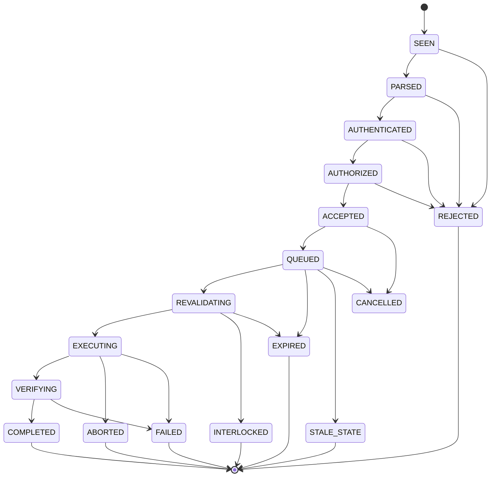
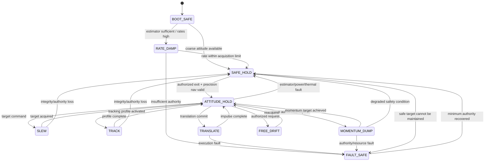
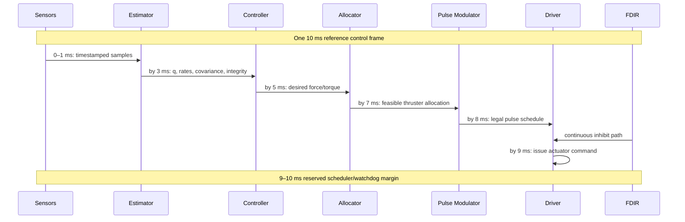
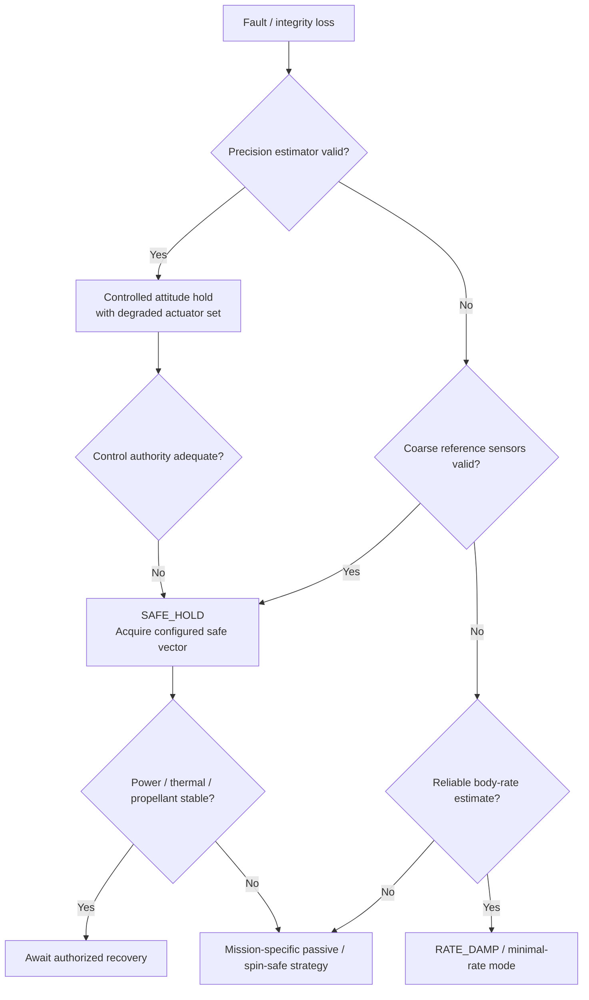

# Reaction Control System and Attitude Control Subsystem as a Diode-Pattern Executable Telemetry and Autonomous-Control Specification

## Executive summary

This report defines an implementation-oriented reference specification for mapping a spacecraft **Reaction Control System / Attitude Control Subsystem (RCS/ACS)** into the requester's existing diode-pattern mission architecture. The objective is to let autonomous agents observe spacecraft attitude-control evidence, request bounded spacecraft effects, diagnose failures, and execute mission-level decisions **without placing an external agent inside the stability-critical or propulsion-safety-critical feedback loop**.

The principal architectural conclusion is:

> **Expose RCS/ACS as a trusted attitude-and-wrench execution service, not as a remote thruster-firing bus.**

This separation is consistent with ECSS's AOCS baseline, which treats attitude estimation, guidance, attitude control, orbit control, navigation where applicable, and acquisition/maintenance of a safe attitude as system functions. NASA examples show RCS thrusters being used for three-axis attitude control, translation, detumble, small trajectory corrections, and reaction-wheel desaturation. citeturn8search6turn11search3turn11search6

The RCS/ACS trusted side should therefore own the attitude estimator, control loops, thruster allocation, minimum-pulse enforcement, valve-drive timing, hard actuator limits, plume/keep-out constraints, momentum-management execution, FDIR, safe-hold transitions, exact actuation time, and the authoritative record of what actually fired. The mission-execution layer should request **effects**—hold this attitude, slew to this target, produce this bounded translation, unload wheel momentum, enter safe hold, isolate this failed propulsion group—not individual millisecond valve pulses during normal flight.

This extends, rather than replaces, the supplied architecture. The original diode specification requires a closed command vocabulary, asymmetric reach, service-owned credentials and safety authority, published state that is never accepted back as authoritative input, declarative/idempotent commands where possible, and revalidation when a scheduled action actually takes effect. fileciteturn0file5 The supplied GNC mapping independently places the diode above the fast closed control loop and assigns state estimation, feedback control, allocation, actuator limiting, watchdogs, and FDIR to trusted GNC. fileciteturn0file1 The supplied propulsion mapping similarly makes command acceptance distinct from execution authorization, adds persistent anti-replay state and high-rate fault recording, and keeps exact actuator sequencing inside the propulsion service. fileciteturn0file0

The proposed control hierarchy is:

| Layer | Primary responsibility | Proposed reference timing | Externally agent-commandable? |
|---|---|---:|---|
| Physical/driver protection | Driver overcurrent, hardware inhibits, valve electrical protection, independent pressure protection | µs–ms, hardware dependent | No |
| Local RCS safety and FDIR | Stuck-on detection, no-response detection, unsafe-fire inhibit, isolation | 1–20 ms class where hazard analysis requires it | No |
| Attitude estimator/control/allocation | State estimation, torque/force control, thruster selection, pulse generation | 100 Hz baseline `RIP-REF` | No direct inner-loop commands |
| ACS mode manager | Slew, hold, rate damping, translation, wheel unloading, safe hold | 10–100 Hz | Requests only |
| Mission-execution autonomy | Select targets, request translations/desaturation, react to degraded capability | 20 Hz command intake; seconds-to-minutes planning | Yes, bounded |
| Ground/crew authority | Mission authorization, exceptional recovery, maintenance/test | Mission dependent | Yes, guarded |
| Immutable safety/configuration | hard limits, key material, actuator geometry, forbidden plume zones | Configuration/maintenance | Never agent-writable |

`RIP-REF` denotes a **reference implementation profile**, not a universal spacecraft requirement. Spacecraft mass and inertia, RCS propellant, tank/feed architecture, thruster type and thrust, minimum impulse bit, valve latency, wheel capacity, plume constraints, thermal limits, sensor suite, required pointing performance, and mission phase are all unspecified and must be supplied by implementers. ECSS propulsion standards explicitly cover liquid—including cold-gas—and electric spacecraft propulsion and are intended to be tailored to the project. citeturn11search0turn11search4

A true data diode permits information in one direction only. Consequently, an external autonomy system that both receives RCS telemetry and issues RCS requests requires **two independently unidirectional paths in opposite directions**, or else the autonomous decision engine must reside inside the trusted spacecraft zone. This dual-path conclusion is an architectural inference from the NIST definition of a data diode as a one-direction device and its description of hardware-enforced one-way transfer mechanisms. citeturn10search1turn10search14

```mermaid
flowchart LR
    subgraph AUTO["Mission-execution / agent zone"]
        OBS["Telemetry consumer"]
        DIAG["Diagnosis / state assessment"]
        PLAN["Mission decision logic"]
        TRACK["Command/result tracker"]
        OBS --> DIAG --> PLAN
    end

    subgraph CMD["Command direction only"]
        GUARD["Trusted ingress guard\nschema • identity • MAC/signature\nTTL • sequence • policy • rate limit"]
    end

    subgraph RCS["Trusted RCS / ACS zone"]
        CE["Command executive"]
        MODE["ACS mode manager"]
        EST["Attitude estimator"]
        CTRL["Attitude / translation controller"]
        ALLOC["Thruster / actuator allocator"]
        PWM["Pulse modulator"]
        DRIVER["Valve / actuator drivers"]
        PLANT["Thrusters • wheels • vehicle"]
        FDIR["FDIR + watchdogs"]
        PUB["Telemetry / event publisher"]
        REC["High-rate fault recorder"]

        CE --> MODE --> CTRL --> ALLOC --> PWM --> DRIVER --> PLANT
        PLANT --> EST
        EST --> CTRL
        EST --> FDIR
        DRIVER --> FDIR
        PLANT --> FDIR
        FDIR --> MODE
        FDIR --> ALLOC
        EST --> PUB
        MODE --> PUB
        ALLOC --> PUB
        DRIVER --> PUB
        FDIR --> PUB
        EST --> REC
        DRIVER --> REC
    end

    subgraph TLM["Telemetry direction only"]
        SHAPER["Sequencing • rate shaping\nimmutable publication"]
    end

    PLAN --> GUARD --> CE
    PUB --> SHAPER --> OBS
    SHAPER --> TRACK
```



The core implementation invariants are:

1. **Telemetry is evidence, not simulator omniscience.** A commanded valve state is not proof of thrust; a pressure-switch indication is not proof of correct impulse; propellant remaining is normally an estimate. This is already a foundational rule in the supplied Apollo-style simulation. fileciteturn0file4
2. **External agents never close the stability-critical loop.** The control and allocation loop continues correctly if either diode is lost. This matches the supplied GNC architecture. fileciteturn0file1
3. **Acceptance is not authorization to actuate later.** Every scheduled attitude maneuver, translation, momentum dump, or isolation action is revalidated against current state immediately before effect. fileciteturn0file5
4. **Minimum impulse, valve timing, and thruster nonlinearities are hardware configuration.** NASA's Voyager testing, for example, found a particular 0.2-lbf thruster configuration reliable at 4 ms but unreliable at shorter widths; that is evidence that minimum usable pulse width is thruster-specific, not a universal 4 ms rule. citeturn8search1turn8search15
5. **Failure accommodation is local.** A lost or degraded thruster causes the allocator to recompute available control authority before an agent decides what the mission should do next.

## Scope, standards, assumptions, and changes

This specification treats **RCS/ACS** as the spacecraft function that combines attitude-control logic with thruster-based actuation and, when present, reaction-wheel momentum management. The same contract can accommodate a thruster-only spacecraft, a reaction-wheel spacecraft using RCS only for momentum unloading, or a hybrid system. NASA spacecraft provide examples of all of these patterns: Cassini used RCS for slews, three-axis control, reaction-wheel unloading, and orbit-trim functions; NEA Scout combined reaction wheels and cold-gas RCS; and LRO included thruster-based momentum management and safe-attitude modes. citeturn11search18turn11search15turn1search7

The Space Shuttle RCS is a useful historical confirmation that an RCS can be responsible for both precise attitude control and three-axis translation; it is not used here as a hardware template. citeturn11search6

**Standards and primary-source basis**

| Source | Use in this specification |
|---|---|
| **ECSS-E-ST-60-30C** | AOCS functional baseline: estimation, guidance, control, orbit functions, emergency safe-attitude acquisition and recovery. citeturn8search6 |
| **ECSS-E-ST-35C Rev.1 / ECSS-E-ST-35-01C** | Propulsion engineering, interfaces, operation and verification; liquid/cold-gas/electric propulsion applicability. citeturn11search4turn11search0 |
| **JSC-67723 Rev. A, June 22, 2026** | Conservative human-rated propulsion hazard-control reference. It is specifically a human-spaceflight standard and is not automatically applicable to an unspecified vehicle. citeturn12search0 |
| **ECSS-E-ST-70-41C PUS** | Telecommand/telemetry packet-service semantics for spacecraft monitoring and control; mission tailoring remains required. citeturn9search1 |
| **CCSDS 232.0-B-4** | TC Space Data Link Protocol option for mission command transport. citeturn9search2turn9search8 |
| **CCSDS 355.0-B-2** | Data-link authentication/confidentiality framework for CCSDS links. citeturn9search0 |
| **CCSDS 301.0-B-4** | Common spacecraft time-code framework. citeturn12search5 |
| **NASA-STD-8739.8B** | Software assurance, safety and IV&V basis for software that controls or mitigates hazards. citeturn12search10turn12search1 |
| **NASA cFS** | Implementation analogue for command ingest, telemetry, scheduling, stored commands, limit checking and health/safety services; NASA explicitly states the open bundle is a starting point and mission V&V remains the mission's responsibility. citeturn10search0 |
| **NASA CCDD** | Candidate authoritative command/telemetry dictionary tooling; supports telemetry structures and command definitions and import/export including JSON, EDS and XTCE. citeturn10search4 |

**Unspecified inputs to be filled by implementers**

| Configuration item | Required before qualification | Why it matters |
|---|---|---|
| Spacecraft wet/dry mass | Unknown | Translation acceleration and propellant prediction |
| Inertia tensor and uncertainty | Unknown | Attitude gains, achievable angular acceleration, allocator |
| Center of mass versus propellant state | Unknown | Thruster torque-arm matrix and translation coupling |
| Thruster count and geometry | Unknown | Control-authority matrix and failure tolerance |
| Thruster technology | Unknown | Minimum pulse width, ignition dynamics, duty cycle, thermal model |
| Nominal thrust and dispersion | Unknown | Allocation, pulse modulation, impulse prediction |
| Minimum impulse bit | Unknown | Deadband and quantizer design |
| Minimum on/off time | Unknown | Pulse generator legality |
| Valve opening/closing latency | Unknown | FDIR and timing budgets |
| Feed/tank architecture | Unknown | Isolation commands and leak rules |
| Propellant | Unknown | Resource model, thermal limits, contamination/plume rules |
| Number/type of reaction wheels or CMGs | Unknown | Desaturation and degraded-mode logic |
| Wheel momentum/speed limits | Unknown | Dump thresholds |
| Sensor complement | Unknown | Estimator and safe-mode fallback |
| Pointing/rate requirements | Unknown | Controller gains/deadbands |
| Flexible modes | Unknown | Filters/notches and control bandwidth |
| Plume impingement constraints | Unknown | Thruster exclusion masks |
| Docked/deployed configurations | Unknown | Geometry, inertia and forbidden jets |
| Thermal firing limits | Unknown | Duty-cycle protection |
| Electrical peak/average load | Unknown | EPDS interface |
| Mission phases | Unknown | Mode/command availability |
| Crewed status | Unknown | Human-rating/crew-command requirements |
| Link bandwidth and delay | Unknown | Telemetry profile only; must not determine loop stability |

All threshold tables below therefore distinguish **configuration variables** from `RIP-REF` starting values.

**Required RCS/ACS functions**

The implementation should support the following functional classes. ECSS explicitly includes emergency safe-attitude acquisition/maintenance in the AOCS domain; NASA missions additionally demonstrate detumble, three-axis attitude control, translation/trajectory correction, and wheel desaturation. citeturn8search6turn11search3turn11search6

| Function | Trusted implementation responsibility | Agent-level request |
|---|---|---|
| Rate damping / detumble | Estimate angular rate and pulse opposing torques | `ENTER_RATE_DAMP` |
| Safe hold | Acquire configured power/thermal/communications-safe attitude with degraded sensing if necessary | `ENTER_SAFE_HOLD` |
| Inertial attitude hold | Maintain quaternion/rate target | `SET_ATTITUDE_TARGET` |
| Reference tracking | Follow time-varying attitude/rate profile | `LOAD_ATTITUDE_PROFILE`, then arm/activate |
| Slew/acquisition | Generate rate-limited trajectory to target | `SLEW_TO_ATTITUDE` |
| Free drift | Suppress normal attitude firings while retaining hard safing | `SET_RCS_MODE(FREE_DRIFT)` |
| Three-axis translation | Produce requested bounded force/impulse while minimizing attitude disturbance | `REQUEST_TRANSLATION` |
| Combined translation/attitude | Generate desired six-degree-of-freedom wrench where feasible | Normally trusted GNC internal interface |
| Reaction-wheel desaturation | Generate external torque while minimizing translational ΔV and propellant | `REQUEST_MOMENTUM_DUMP` |
| Main-engine burn support | Hold burn attitude/counter disturbance through trusted GNC/MPS coordination | Cross-subsystem service request |
| Propellant conservation | Select deadband, jet set and pulse strategy from approved profiles | Select pre-certified profile only |
| Fault accommodation | Isolate failed thrusters/sensors, recompute authority, enter degraded modes | Mission may approve/reject mission consequences; local safety does not wait |
| Test/calibration | Controlled pulse/actuator test | A3/test authority only |

Reaction-wheel unloading can produce non-negligible translation. Cassini operations explicitly modeled hydrazine usage and the ΔV associated with wheel-bias/unload events; therefore the RCS service should report predicted and realized dump impulse to navigation rather than treating momentum unloading as attitude-only activity. citeturn11search16

**Changes from the supplied predecessor specifications**

No standalone prior **RCS/ACS diode specification** was supplied. The earlier Apollo-style spacecraft analysis did, however, expose a preliminary RCS interface consisting of mode, quad feed pressure, thruster valve and pressure-switch indications, propellant remaining, total impulse and deadband, together with verbs such as `set_rcs_mode`, `set_attitude_target`, `set_deadband`, `set_rcs_quad`, and `isolate_rcs_manifold`. fileciteturn0file4 The broader GNC and MPS reports provide the stronger lifecycle, authority and safety patterns that this document adopts. fileciteturn0file1 fileciteturn0file0

The substantive changes are:

| Earlier surface | This specification |
|---|---|
| Small RCS status surface | Full point dictionary covering estimator, control, allocator, thrusters, feed system, propellant, power and thermal evidence |
| Generic mode commands | Typed commands with authority, state revision, expiry, idempotency and lifecycle |
| Per-thruster valve/pressure indications | Explicit commanded state, driver electrical evidence, physical response evidence, pulse counts/on-time and model residuals |
| Simple deadband field | Signed/versioned controller profile with operator-owned minima/maxima |
| RCS quad enable/isolate | Health-aware group/string isolation plus automatic allocator recomputation |
| No explicit actuator allocation contract | Six-degree-of-freedom wrench matrix and achievable-wrench telemetry |
| No explicit high-rate recorder | Pre/post-trigger fault ring |
| No standalone pulse semantics | Minimum-on/off, residual-impulse accumulation and quantization rules |
| File-diode concept | Explicit distinction between logical file diode and two physical one-way paths |
| External “RCS commands” could imply low-level control | Normal agents command intent; direct thruster pulses are A3 test-only |
| Basic fault examples | Executable FDIR rules with corroboration and recovery state machine |

## Functional architecture and telemetry contract

The telemetry architecture should preserve the distinction already established in the requester's previous subsystem specifications: **sample time is not publish time; direct sensor evidence is not an estimate; service state is authoritative about software state but not necessarily about physical reality.** fileciteturn0file0 fileciteturn0file1

Each value carries one of these provenance classes:

| Class | Meaning | RCS example |
|---|---|---|
| `DIRECT` | Physical sensor measurement | Feed pressure transducer |
| `DISCRETE` | Limit switch/pressure switch/driver bit | Thruster-valve feedback |
| `ESTIMATED` | State inferred from model/measurements | Remaining propellant mass |
| `SERVICE_STATE` | Authoritative trusted software state | `SAFE_HOLD` active |
| `COMMAND` | Requested/internal control target | Desired body torque |
| `ALLOCATED` | Allocator result | Thruster-7 requested impulse |
| `FEEDBACK` | Observed actuator consequence | Measured coil current |
| `MODEL` | Predicted physical quantity | Expected angular acceleration |
| `EVENT` | Discrete occurrence | `THRUSTER_NO_RESPONSE` |

The common quality vocabulary is:

`GOOD`, `SUSPECT`, `STALE`, `SATURATED`, `OUT_OF_RANGE`, `INVALID`, `ESTIMATED`, `DEGRADED`, `NOT_AVAILABLE`, and `TEST_INJECTED`.

A hidden simulation fault should not set `SUSPECT` merely because the simulator knows the component is broken. Quality changes only when the modeled instrumentation or trusted diagnostic logic has evidence. This preserves the experimental epistemics of the supplied Apollo-style design. fileciteturn0file4

**Reference telemetry catalogue**

Rates marked `RIP-REF` are starting profiles, not mission requirements. Local acquisition can be substantially faster than outward publication. The RCS controller and FDIR consume the local stream; agents receive rate-shaped state.

| Telemetry | Type / sensor | Unit | Local acquisition `RIP-REF` | Outward rate `RIP-REF` | Representation / precision target | Key status |
|---|---|---:|---:|---:|---|---|
| `acs.attitude_ref_from_body_q[4]` | Estimator | dimensionless | 100 Hz | 20 Hz | float64; normalized | `GOOD/DEGRADED/INVALID` |
| `acs.body_rate_body[3]` | Gyro/filter | rad/s | 100–1000 Hz | 20–50 Hz | float64; report ≤1e-6 rad/s increment where sensor supports it | saturation, gyro validity |
| `acs.attitude_error[3]` | Derived | rad | 100 Hz | 20 Hz | float64 | settled/out-of-band |
| `acs.rate_error[3]` | Derived | rad/s | 100 Hz | 20 Hz | float64 | control error |
| `acs.attitude_covariance[3x3]` | Estimator | rad² | estimator rate | 2–10 Hz | float64 | integrity |
| `acs.gyro_bias[3]` | Estimator | rad/s | estimator rate | 2 Hz | float64 | estimate + covariance |
| `acs.nav_sensor.<id>.measurement` | Star/Sun/horizon/etc. | sensor-specific | native | native–10 Hz | float64 | quality/use/rejection |
| `acs.mode` | Service state | enum | event | event + 2 Hz | exact | active mode |
| `acs.target_q[4]` | Reference | dimensionless | 100 Hz | 10 Hz | float64 | target revision |
| `acs.desired_body_torque[3]` | Controller | N·m | 100 Hz | 20 Hz | float64 | pre-allocation demand |
| `acs.allocated_body_torque[3]` | Allocator | N·m | 100 Hz | 20 Hz | float64 | achieved request |
| `acs.desired_body_force[3]` | Controller | N | 100 Hz | 20 Hz | float64 | translation demand |
| `acs.allocated_body_force[3]` | Allocator | N | 100 Hz | 20 Hz | float64 | achieved force |
| `acs.allocation_residual[6]` | Allocator | N / N·m | 100 Hz | 20 Hz | float64 | infeasibility evidence |
| `acs.control_authority_margin[6]` | Model | normalized | 10–100 Hz | 5 Hz | float32 | degraded-axis warning |
| `rcs.thruster.<id>.commanded` | Service/driver | bool | each control frame | event + 20 Hz | exact | pulse requested |
| `rcs.thruster.<id>.pulse_width_commanded` | Service | µs | each pulse | each pulse/batched | uint32 | minimum-pulse check |
| `rcs.thruster.<id>.pulse_width_effective` | Derived/feedback | µs | each pulse | event/batched | uint32 | execution evidence |
| `rcs.thruster.<id>.valve_feedback` | Discrete | enum/bool | 100–1000 Hz during firing | event + ≤100 Hz burst | exact | mismatch |
| `rcs.thruster.<id>.coil_current` | Current sensor | A | 500–2000 Hz during pulse | 20 Hz summary + burst | ≤0.5–1% FS accuracy target | electrical response |
| `rcs.thruster.<id>.chamber_or_switch` | Pressure/switch where available | Pa/bool | pulse-resolving | event + burst | sensor-specific | thrust evidence |
| `rcs.thruster.<id>.impulse_est` | Model | N·s | each pulse | event/20 Hz aggregate | float64 + uncertainty | estimated impulse |
| `rcs.thruster.<id>.on_time_total` | Service accumulator | s | pulse event | 1 Hz | uint64 µs internally | wear/resource |
| `rcs.thruster.<id>.pulse_count` | Service accumulator | count | event | 1 Hz/event | uint64 | exact count |
| `rcs.thruster.<id>.health` | FDIR conclusion | enum | event | event + 2 Hz | exact | fault state |
| `rcs.feed.<id>.pressure_abs` | Pressure sensor | Pa | 20–100 Hz | 10 Hz | ±0.5% FS target | low/high/leak |
| `rcs.feed.<id>.temperature` | Temperature sensor | K | 10–20 Hz | 2 Hz | 0.1 K reporting; ±1 K target | thermal readiness |
| `rcs.tank.<id>.pressure_abs` | Pressure sensor | Pa | 10–20 Hz | 2–10 Hz | ±0.5% FS target | resource/pressurization |
| `rcs.propellant.mass_est` | Estimator | kg | 1–10 Hz | 1 Hz | mission-defined; uncertainty mandatory | reserve state |
| `rcs.propellant.mass_sigma` | Estimator | kg | estimator rate | 1 Hz | float64 | uncertainty |
| `rcs.total_impulse_est` | Integrator/model | N·s | each pulse | 1 Hz | float64 | resource trend |
| `rw.<id>.speed` | Tachometer | rad/s | 50–200 Hz | 10–20 Hz | sensor-specific | saturation |
| `rw.<id>.momentum` | Derived | N·m·s | 50–100 Hz | 10 Hz | float64 | dump trigger |
| `rw.total_momentum_body[3]` | Derived | N·m·s | 50–100 Hz | 10 Hz | float64 | desaturation demand |
| `rcs.power.bus_voltage` | EPDS/direct interface | V | 100–1000 Hz locally | 10–20 Hz | ±0.5% FS target | firing readiness |
| `rcs.power.driver_current` | Electrical | A | 500–2000 Hz transient | 20 Hz + burst | ±1% FS target | driver fault |
| `rcs.thermal.<id>.temperature` | Temperature sensor | K | 5–20 Hz | 1–2 Hz | 0.1 K reporting | hot/cold inhibit |
| `rcs.command_queue_depth` | Service state | count | scheduler | 2 Hz | integer | overload |
| `rcs.deadline_miss_count` | Scheduler | count | each frame | 1 Hz/event | uint64 | real-time health |
| `rcs.last_safe_action` | FDIR state | enum | event | event + 1 Hz | exact | audit |

NASA attitude-estimation work provides a strong precedent for a quaternion-based EKF that estimates attitude and gyro biases; WMAP's flight estimator used precisely that pattern. NASA work on quaternion filtering also explains why three-component local attitude-error states are commonly combined with a globally nonsingular quaternion representation. citeturn8search0turn8search3turn8search4

A degraded estimator should not be hard-wired to require gyros. LRO demonstrated an operational recovery in which star-tracker quaternion differentiation and a complementary-filter rate estimate were used after an inertial-measurement problem, eventually permitting EKF operation without the normal gyro source. This supports designing a configurable **sensor fallback ladder**, although the specific algorithm must be vehicle-qualified. citeturn8search12

**Pulse-resolution acquisition rule**

Where a sensor is intended to establish that a short RCS pulse physically occurred, local sample rate must resolve the minimum legal pulse rather than merely match the normal outward telemetry cadence. The supplied MPS analysis derives the conservative rule:

\[
f_{\text{pulse evidence}}
\ge
\max \left(
\frac{3}{T_{\min,\mathrm{cmd}}},
f_{\mathrm{FDIR-required}}
\right)
\]

based on its propulsion-hazard source analysis. fileciteturn0file0

For this RCS specification, the equation is adopted as a **reference instrumentation rule**, while the actual hazard analysis may demand still faster sampling. A 20 ms minimum pulse would therefore imply at least 150 samples/s for pulse characterization; a 10 ms pulse implies 300 samples/s. The actual minimum pulse remains hardware-specific, as illustrated by the Voyager short-pulse qualification program. citeturn8search1

**Core telemetry message schemas**

`RcsFastState`:

| Field | Wire type | Unit | Required |
|---|---|---:|---:|
| `sample_time_ns` | uint64 | mission-time ns | yes |
| `state_revision` | uint64 | — | yes |
| `mode` | enum | — | yes |
| `frame_id` | uint32/enum | — | yes |
| `attitude_q[4]` | fixed64 | — | yes |
| `body_rate[3]` | fixed64 | rad/s | yes |
| `attitude_error[3]` | fixed64 | rad | yes |
| `rate_error[3]` | fixed64 | rad/s | yes |
| `desired_force[3]` | fixed64 | N | yes |
| `desired_torque[3]` | fixed64 | N·m | yes |
| `allocated_force[3]` | fixed64 | N | yes |
| `allocated_torque[3]` | fixed64 | N·m | yes |
| `allocation_residual[6]` | fixed64 | mixed | yes |
| `thruster_active_mask` | bitset | — | yes |
| `thruster_available_mask` | bitset | — | yes |
| `sensor_valid_mask` | bitset | — | yes |
| `quality` | enum | — | yes |

`ThrusterStatus`:

| Field | Wire type | Meaning |
|---|---|---|
| `thruster_id` | uint32 | Immutable dictionary ID |
| `group_id` | uint32 | Quad/string/manifold membership |
| `command_state` | enum | OFF/FIRING/INHIBITED/TEST |
| `valve_feedback` | enum | CLOSED/OPEN/TRANSITION/UNKNOWN |
| `coil_current_a` | float32/64 | Driver current |
| `response_sensor` | typed oneof | Chamber pressure, pressure switch, flow or equivalent |
| `last_cmd_pulse_us` | uint32 | Requested pulse |
| `last_effective_pulse_us` | uint32 | Estimated/observed effective pulse |
| `last_impulse_ns` | float64 | Estimated N·s |
| `pulse_count` | uint64 | Lifetime/session count |
| `cumulative_on_us` | uint64 | Accumulated command time |
| `temperature_k` | float32 | Thruster/valve temperature if instrumented |
| `health` | enum | Current FDIR conclusion |
| `quality_mask` | bitset | Source quality |
| `fault_latch_mask` | bitset | Latched diagnoses |

`RcsResourceState`:

| Field | Unit | Semantics |
|---|---:|---|
| `feed_pressure_pa[]` | Pa | Direct sensors |
| `tank_pressure_pa[]` | Pa | Direct sensors |
| `feed_temperature_k[]` | K | Direct sensors |
| `propellant_mass_est_kg` | kg | Estimated |
| `propellant_mass_sigma_kg` | kg | Uncertainty |
| `total_impulse_ns` | N·s | Integrated estimate |
| `predicted_remaining_impulse_ns` | N·s | Model estimate |
| `reserve_margin_kg` | kg | `estimate - service_owned_reserve` |
| `wheel_momentum_body[3]` | N·m·s | If wheels present |
| `power_ready` | bool | Attested EPDS interface state |
| `thermal_ready` | bool | Attested thermal interface state |

The point dictionary—not source-code constants—should define IDs, engineering units, ranges, accuracy/uncertainty, update periods, FDIR limits, authority requirements, and conversion/calibration metadata. NASA CCDD is explicitly intended to manage command and telemetry structures and can exchange JSON, EDS, and XTCE representations. citeturn10search4

## Command and diode communication specification

The mission layer should see a **closed, typed vocabulary**. ECSS PUS explicitly treats telemetry and telecommand packets as the means for remote spacecraft monitoring and control while leaving mission-specific operational protection to mission design; therefore PUS/CCSDS are useful encapsulation standards but do not replace the local RCS safety guard. citeturn9search1

**Authority classes**

| Authority | Meaning | RCS/ACS examples |
|---|---|---|
| `S0` | Local safety authority, never granted externally | forced shutdown, stuck-on mitigation, hard plume inhibit, safe-hold entry |
| `A0` | Observe/acknowledge | telemetry profile, acknowledge event |
| `A1` | Routine reversible control | attitude target, rate damp, free drift, safe-hold request |
| `A2` | Safety/mission-significant control | translation, momentum dump, group isolation, redundant-string selection |
| `A3` | Exceptional test/maintenance | direct test pulse, controller-profile activation after independent authorization |
| `FORBIDDEN` | Not remotely expressible | disable FDIR, rewrite sensors, exceed minimum pulse constraints, modify hard limits or keys |

NASA software-safety guidance requires known safe states, safe transitions among predefined states, and rejection of hazardous out-of-sequence commands for safety-/mission-critical software. That supports making command sequencing and mode validity executable, rather than leaving them as operator prose. citeturn12search1turn12search4

**External command vocabulary**

| Command | Arguments | Default priority | Authority | Idempotency / execution guard |
|---|---|---:|---:|---|
| `ENTER_SAFE_HOLD` | optional approved safe-target ID | P0 | A1 | Reassertable; always admissible as safer-state request |
| `ABORT_RCS_ACTIVITY` | scope enum | P0 | A1 | Cancels current translation/dump/slew if safely abortable |
| `ENTER_RATE_DAMP` | approved profile ID | P1 | A1 | Reassertable |
| `SET_RCS_MODE` | `ATT_HOLD`, `TRACK`, `FREE_DRIFT`, etc. | P2 | A1/A2 | Transition guards |
| `SET_ATTITUDE_TARGET` | frame, quaternion, optional rate, tolerance profile | P2 | A1 | Replaces target revision |
| `LOAD_ATTITUDE_PROFILE` | bounded waypoints/time tags/profile hash | P3 | A1/A2 | Load only; no execution |
| `ARM_ATTITUDE_PROFILE` | profile ID/hash, execution window | P2 | A2 | Short-lived arm |
| `COMMIT_ATTITUDE_PROFILE` | matching armed ID/hash | P2 | A2 | Full effect-time revalidation |
| `REQUEST_TRANSLATION` | frame, desired Δv or impulse vector, window, attitude policy, max resource | P2 | A2 | Trusted controller determines pulses |
| `REQUEST_MOMENTUM_DUMP` | target wheel momentum/vector, limits, window | P2 | A2 | Requires healthy RCS/resource margin |
| `CANCEL_PENDING` | command/plan ID | P1 | ≥ original action policy | No effect if irreversible action already occurred |
| `SET_THRUSTER_GROUP_STATE` | group, ENABLE/INHIBIT | P1 | A2 | Cannot re-enable latched unsafe group without recovery checks |
| `ISOLATE_RCS_BRANCH` | branch ID | P1 | A2 | Fluid-topology guard |
| `SELECT_RCS_STRING` | redundant string ID | P1 | A2 | Health/topology revalidation |
| `RESET_LATCHED_FAULT` | fault ID/recovery token | P1 | A2 | Root condition must be absent |
| `SET_CONTROL_PROFILE` | preloaded signed profile ID | P3 | A2/A3 | No arbitrary gain values in ordinary flight |
| `SET_TELEMETRY_PROFILE` | approved profile ID | P4 | A0/A1 | Bounded by operator ceiling |
| `ACK_EVENT` | event ID | P4 | A0 | Audit only |
| `TEST_THRUSTER` | thruster ID, certified test pulse/profile | P1 | A3/test mode | Flight-inhibited except explicitly authorized maintenance/calibration |

Normal mission agents **do not receive** verbs equivalent to:

```text
OPEN_VALVE_7
FIRE_THRUSTER_7_FOR_ARBITRARY_MICROSECONDS
DISABLE_STUCK_ON_MONITOR
SET_SENSOR_GOOD
WRITE_BODY_RATE
WRITE_PROP_MASS
OVERRIDE_PLUME_KEEP_OUT
SET_MINIMUM_PULSE_WIDTH
CLEAR_FAULT_WITHOUT_RECOVERY_CHECK
WRITE_CONTROLLER_GAIN
DISABLE_WATCHDOG
```

This directly carries forward the original diode rule that the agent supplies names and bounded arguments rather than code, paths, URLs, or an arbitrary executable program. fileciteturn0file5

**Command lifecycle**



An `ACCEPTED` attitude maneuver therefore means “valid request admitted to the trusted queue,” **not** “thrusters are guaranteed to fire.” Revalidation immediately before effect is inherited from the original diode and the supplied GNC/MPS designs. fileciteturn0file5 fileciteturn0file1 fileciteturn0file0

**Command schema**

| Field | Type | Purpose |
|---|---|---|
| `schema_version` | uint32 | Decoder/schema selection |
| `command_id` | 128-bit | Global deduplication identifier |
| `ingress_sequence` | uint64 | Persistent monotonic anti-replay counter |
| `principal_id` | trusted ID | Added/verified by ingress guard |
| `authority_granted` | enum | Guard-attested maximum authority |
| `priority` | enum P0–P5 | Queue scheduling |
| `issued_time_ns` | uint64 | Freshness |
| `not_before_ns` | uint64 | Earliest revalidation time |
| `expires_time_ns` | uint64 | Hard TTL |
| `base_state_revision` | uint64 | Optimistic concurrency |
| `base_config_revision` | uint32 | Protects against geometry/profile changes |
| `command_type` | enum | Closed verb |
| `payload` | typed `oneof` | Bounded command-specific arguments |
| `deduplication_key` | optional bytes | Idempotent plan/reassertion identity |
| `rationale_code` | enum | Audit aid; never authorization |
| `policy_revision` | trusted uint32 | Active guard policy |
| `auth_context` | trusted metadata | Security association/key/signature profile |

The **guard**, not the agent's serialized payload, supplies authoritative principal identity and granted authority.

**Local non-CCSDS framing profile**

For a file diode, shared-memory transport, serial link, or other local deployment, the following proposed record format is simple and deterministic:

| Field | Size | Encoding |
|---|---:|---|
| Magic | 4 B | ASCII `RCS1` |
| Header version | 2 B | unsigned big-endian |
| Flags | 2 B | bitset |
| Payload length | 4 B | unsigned big-endian |
| Message class | 2 B | command/telemetry/event/result |
| Source/topic ID | 2 B | dictionary ID |
| Priority | 1 B | P0–P5 |
| Reserved | 1 B | zero |
| Sequence | 8 B | unsigned big-endian |
| Mission time | 8 B | ns |
| State revision | 8 B | unsigned |
| Message ID | 16 B | UUID/opaque 128-bit |
| Payload | bounded | Protobuf/EDS-derived binary payload |
| CRC-32C | 4 B | accidental-corruption check over header+payload |
| Authentication trailer | 16–64 B | mission-selected MAC/signature when required |

CRC-32C is **not** an authentication mechanism. Cryptographic origin/integrity is separately provided by the mission security association. On a CCSDS space link, the application record can instead be carried in CCSDS packets/TC frames and protected by a mission-tailored SDLS profile; CCSDS 355.0-B-2 explicitly provides data-link authentication and/or confidentiality machinery for CCSDS link protocols. citeturn9search0

The semantic schema should have **one source of truth**. A practical arrangement is:

```text
CCDD / EDS / mission point dictionary
              │
              ├── generated Protobuf/typed application bindings
              ├── JSON diagnostic representation
              ├── CCSDS packet mapping
              ├── ground dictionary
              └── test-vector generator
```

NASA CCDD is specifically built around maintaining command and telemetry definitions centrally, while CCSDS Space Packet/PUS concepts can serve as mission-link encapsulation rather than becoming the RCS control law. citeturn10search4turn9search1

**One-way paths and buffers**

| Path | Direction | Content allowed | Content forbidden |
|---|---|---|---|
| Command diode | Agent/ground → trusted RCS | Signed typed command requests | Telemetry, command acknowledgements, dynamic code, paths/URLs |
| Telemetry diode | Trusted RCS → observers | Telemetry, events, schemas, capabilities, command results | Anything interpreted as actuator authority |
| Internal GNC/RCS interface | Trusted → trusted | Desired wrench, attitude references, actuator availability | External network payloads without guard |
| Internal RCS/propulsion interface | Trusted → trusted | pressure/thermal/propellant readiness and isolation states | Agent-authored “sensor truth” |
| Configuration channel | Maintenance/operator only | signed point dictionaries, geometry, gains, hard limits | Ordinary agent write access |

A physical implementation should not use a bidirectional Ethernet interface and simply call firewall policy a “data diode.” NIST's terminology describes one-way transfer as normally hardware-enforced and gives fiber-optic isolation as a representative mechanism. citeturn10search14

**Reference buffering and rate policy**

| Resource | `RIP-REF` |
|---|---:|
| Per-principal command queue | 64 commands |
| Reserved P0/P1 safety slots | 8 commands independent of normal queue |
| Maximum external state-changing command rate | 10/s/principal sustained, 20/s short burst |
| Command-intake scheduling opportunity | 20 Hz |
| Fast telemetry | 20 Hz normal |
| Engineering telemetry | 1–10 Hz |
| Event publication | immediate at next publisher opportunity |
| High-rate transient ring | 10 s pre-trigger + 30 s post-trigger |
| Fast normal-history ring | ≥15 min |
| Event/audit records | persistent mission-configured retention |
| Telemetry application ceiling | mission-defined; 1 Mbit/s reference simulation ceiling |
| Command application ceiling | 50 kbit/s reference; expected actual use far below |

Under telemetry congestion, diagnostic bulk data is shed first; command results, safe-mode transitions, actuator faults, state revisions, estimator integrity and resource-critical events have highest retention priority. Command flooding must never evict the reserved abort/safe-hold capacity.

Because a one-way command channel cannot depend on a challenge-response exchange, anti-replay is based on persistent sequence state, unique command IDs, bounded TTL, authenticated origin, and idempotent semantics. Results return only over the telemetry path.

```mermaid
sequenceDiagram
    participant A as Mission Agent
    participant G as Command Guard
    participant R as RCS Command Executive
    participant C as ACS Controller/FDIR
    participant T as Telemetry Publisher

    A->>G: REQUEST_TRANSLATION(id, state_rev, vector, window)
    G->>G: Authenticate + sequence + TTL + authority
    G->>R: Trusted typed request
    R-->>T: ACCEPTED / QUEUED
    T-->>A: CommandResult over telemetry diode

    Note over R,C: Execution window arrives
    R->>C: Revalidate current state
    C->>C: estimator + pressure + thermal + power + allocation checks

    alt guards pass
        C->>C: Generate desired wrench / pulses
        C-->>T: EXECUTING
        T-->>A: Status/event
        C->>C: Verify response
        C-->>T: COMPLETED + realized impulse
        T-->>A: Result + telemetry
    else guard fails
        C-->>T: INTERLOCKED(reason)
        T-->>A: Result; no actuation
    end
```

## Control logic, state machines, and timing

The recommended RCS/ACS control architecture consists of four nested layers:

\[
\text{sensor fusion}
\rightarrow
\text{attitude/translation control}
\rightarrow
\text{actuator allocation}
\rightarrow
\text{pulse generation}
\]

The outer mission-execution layer supplies targets and constraints but does not participate in the stability loop.

**Attitude estimation**

The baseline normal estimator should be a **multiplicative/error-state EKF or equivalent qualified attitude estimator**, with a unit quaternion as global attitude and a three-component local attitude-error state. Gyro bias should be estimated where required. This is a recommendation rather than a universal standards requirement; NASA flight and analysis experience provides strong precedent for quaternion/EKF architectures. citeturn8search0turn8search4

A reference state is:

\[
x =
\begin{bmatrix}
\delta\theta &
b_g &
\text{optional additional states}
\end{bmatrix}^{T}
\]

with global quaternion \(q\) propagated separately. Sensor-update acceptance should use explicit residual/innovation tests, data age, sensor health, frame validity and covariance—not a Boolean “sensor okay” asserted externally.

A fallback hierarchy might be:

```text
NORMAL_ME KF:
    gyro + star tracker / precision vector sensors

DEGRADED_ATT:
    surviving gyro + one or more coarse reference sensors

GYRO_DEGRADED:
    star-tracker differentiation / complementary-rate estimator
    if qualified for the spacecraft

SAFE_COARSE:
    Sun / Earth / mission-safe vectors + rate damping

LAST-RESORT:
    predefined spin/rate-damp or passive-safe strategy
    if supported by vehicle design
```

LRO's gyroless recovery demonstrates that such fallback estimation can be practical, but its exact implementation is mission-specific. citeturn8search12

**Quaternion feedback**

For an attitude target \(q_d\), define an error quaternion:

\[
q_e = q_d^{-1}\otimes q
\]

and choose the sign giving the shortest rotation. For small/moderate error,

\[
e_\theta =
2\,\operatorname{sign}(q_{e,w})\,q_{e,v}.
\]

A suitable continuous desired-torque law is:

\[
\tau_d =
-K_p e_\theta
-K_d(\omega-\omega_d)
-K_i z
+\tau_{ff},
\]

with

\[
\dot z=e_\theta .
\]

The integral term is optional and should have anti-windup and mode-dependent limits. Gain scheduling is required where inertia or flexible-body properties change materially. A pulse-based RCS does not actually apply this continuous torque; the desired torque is passed to an allocator/modulator.

A classical PID is therefore one legitimate controller family rather than a mandated algorithm. NASA's EO-1 pulsed-plasma-thruster experiment, for example, developed a thruster-specific PID attitude-control law and later demonstrated pulsed thruster attitude control on orbit. citeturn8search16turn8search17

For conventional on/off RCS thrusters, **phase-plane/deadband control** may be preferable. NASA work specifically on on-orbit RCS control discusses phase-plane design, jet selection, filters and automaneuver logic and emphasizes the nonlinear character of on/off thruster control. citeturn11search17

Accordingly, the executable controller interface should support approved profiles such as:

```text
QUATERNION_PD
QUATERNION_PID
PHASE_PLANE
RATE_DAMP
SAFE_VECTOR
HYBRID_WHEEL_RCS
```

but ordinary agents select signed/qualified profile IDs rather than modifying gains directly.

**Deadband and hysteresis**

For a single-axis phase-plane implementation, an illustrative switching variable is:

\[
s = \omega_e + k_p \theta_e
\]

with separate fire and release boundaries:

\[
|s| > h_\text{fire}
\Rightarrow \text{request corrective torque}
\]

\[
|s| < h_\text{release},
\qquad
h_\text{release}<h_\text{fire}
\Rightarrow \text{stop corrective torque}.
\]

The hysteresis prevents chatter; the actual boundaries must derive from pointing requirements, sensor noise, impulse bit, disturbance torque and valve life.

**Actuator allocation**

For thruster \(i\), define unit thrust direction \(d_i\), force magnitude \(F_i\), and lever arm from current center of mass \(r_i\). Its ideal six-degree-of-freedom wrench column is:

\[
b_i=
\begin{bmatrix}
F_i d_i\\[4pt]
r_i\times F_i d_i
\end{bmatrix}.
\]

For all thrusters:

\[
B =
\begin{bmatrix}
b_1 & b_2 & \cdots & b_n
\end{bmatrix},
\qquad
w_d=
\begin{bmatrix}
F_d\\
\tau_d
\end{bmatrix}.
\]

The allocator solves a constrained problem such as:

\[
\min_u
\left\|
W(Bu-w_d)
\right\|_2^2
+
\lambda_p C_\text{prop}(u)
+
\lambda_s C_\text{switch}(u)
+
\lambda_\Delta C_\text{cross-coupling}(u)
\]

subject to:

\[
0\le u_i\le u_{i,\max},
\]

plus availability, plume, minimum pulse, duty-cycle, thermal, minimum-off-time, simultaneous-fire and structural constraints.

NASA has long examined allocation strategies that map desired three-axis force and torque into multiple thrusters, including optimization-based approaches. citeturn11search2 Modern NASA RCS work likewise treats jet-selection feasibility as an important part of on/off thruster attitude control. citeturn11search17

The allocator must explicitly publish:

```text
desired_wrench
achieved_wrench
residual_wrench
active_constraints
available_thruster_mask
selected_thruster_mask
control_authority_margin
allocation_status
```

so the mission layer can distinguish “target not reached because guidance changed” from “target is physically unachievable with the current actuators.”

**Translation control**

A translation request is **not** synonymous with firing one labeled jet. The agent specifies:

```text
frame
desired Δv OR desired total impulse
execution window
attitude policy:
    HOLD_CURRENT
    HOLD_TARGET
    ALLOW_BOUNDED_ROTATION
maximum propellant/impulse
maximum attitude error
maximum duration
```

The trusted service converts the request to force and torque objectives and selects legal combinations. The Space Shuttle RCS's historical mission included three-axis translation as well as attitude control, demonstrating why the actuator model should be a coupled force/torque allocation rather than three independent rotational axes. citeturn11search6

**Momentum desaturation**

For wheel angular momentum \(H_w\), a dump controller requests external torque approximately opposite the excess momentum:

\[
\tau_\text{dump}
=
-K_H(H_w-H_\text{target})
\]

subject to attitude-error and translation constraints. RCS allocation should minimize undesired translational impulse where mission geometry permits. Cassini operations explicitly accounted for the ΔV and propellant generated by RCS wheel-bias events. citeturn11search16

No universal percentage of wheel capacity should be encoded into software. A practical `RIP-REF` commissioning profile might initially use:

| Condition | Reference only |
|---|---:|
| Momentum advisory | 80% of configured limit |
| Autonomous dump request | 90% |
| Critical margin / inhibit aggressive slews | 95% |

Those numbers must be replaced by wheel, mission and control analyses before qualification.

**Thruster pulse generation**

The pulse generator is the last trusted software layer before the driver.

For each selected thruster, define:

- \(T_f\): modulation frame;
- \(t_{\min,on}\): minimum qualified firing time;
- \(t_{\min,off}\): minimum qualified off time;
- \(t_{\max,on}\): thermal/duty maximum;
- \(I_{\min}\): minimum qualified impulse bit;
- \(\Delta t_q\): timer quantization;
- \(r_i\): residual unexecuted impulse accumulator.

For a requested impulse \(I_i^\*\):

\[
I_{i,\text{acc}}
=
I_i^\* + r_i.
\]

If \(I_{i,\text{acc}}\) is below the qualified firing threshold, it remains in the residual accumulator rather than generating an illegally short pulse. Otherwise:

\[
t_i
=
\operatorname{quantize}
\left(
\frac{I_{i,\text{acc}}}{F_{i,\text{effective}}},
\Delta t_q
\right)
\]

subject to:

\[
t_i \ge t_{\min,on}.
\]

The post-command residual becomes:

\[
r_i \leftarrow
I_{i,\text{acc}}
-
\hat I_i(t_i).
\]

This pulse-density/residual approach preserves long-term average control effort without creating pulses below the hardware's qualified minimum. The importance of enforcing a hardware-specific minimum is demonstrated by Voyager short-pulse tests, where the relationship between electrical pulse width and delivered impulse became strongly nonlinear below the previously standard pulse width. citeturn8search1turn8search15

Pulse modulation may be PWM, pulse-frequency modulation, a PWPF-style modulator, or phase-plane event firing. The wire protocol should not bake one algorithm into the command interface.

**Mode state machine**



`FAULT_SAFE` does not mean “fire nothing.” Depending on spacecraft design, a passive no-fire state may be less safe than rate damping or Sun acquisition. ECSS explicitly places safe-attitude acquisition and maintenance in the AOCS requirements baseline. citeturn8search6 LRO's Sun Safe mode is an operational example of a safe attitude chosen for spacecraft power/thermal reasons. citeturn1search7

**Reference timing budget**

The following profile assumes a 100 Hz control frame and is intentionally consistent with the previously supplied GNC specification. fileciteturn0file1 It is an engineering starting point only.

| Stage | Deadline from frame start `RIP-REF` |
|---|---:|
| Sensor data latched/timestamp checked | 1.0 ms |
| Estimator propagation/update complete | 3.0 ms |
| Mode/constraint evaluation | 4.0 ms |
| Attitude/translation controller | 5.0 ms |
| Actuator allocation | 7.0 ms |
| Pulse quantization/interlocks | 8.0 ms |
| Driver command deposited | 9.0 ms |
| Frame slack/watchdog point | 10.0 ms |

Physical valve opening and thrust buildup are separate hardware-configured quantities and must appear in the timing model.



The external diode is deliberately outside that budget. With a 20 Hz command-ingest cadence, ordinary agent requests have a nominal ≤50 ms intake opportunity before local scheduling, but a 50 ms external delay cannot destabilize attitude control because the local controller continues independently.

NASA cFS Scheduler demonstrates the general flight-software pattern of generating software-bus activity at predetermined configurable timing intervals, while Stored Command provides absolute and relative time-tagged command sequences. These are implementation analogues; RCS effect-time safety checks remain additional requirements of this design. citeturn10search13turn10search7

## Fault management, safe modes, and subsystem integration

FDIR should distinguish **evidence**, **hypothesis**, **isolation**, and **recovery**. NASA's Cassini thruster-leakage work is a direct precedent for model-based thruster fault monitoring, while other NASA work describes comparing measured behavior against healthy and fault hypotheses to isolate intermittent thruster failures. citeturn11search3turn11search10

A single discrepant pressure switch must not automatically condemn a thruster. The requester's own Apollo-oriented design explicitly called out a pressure-switch failure as a case where acceleration and propellant evidence can show that the thruster actually worked. fileciteturn0file4

**FDIR rules**

| Fault candidate | Detection evidence | Isolation rule | Automatic response | Telemetry trigger |
|---|---|---|---|---|
| **Thruster no-response / stuck closed** | Commanded legal pulse + electrical drive evidence, but no response sensor and/or expected angular acceleration | Require configured corroboration over one or more qualifying pulses | Mark `SUSPECT`, then `FAILED_OFF`; remove from allocator | Immediate fault + pre/post burst |
| **Low thrust** | Realized angular/linear impulse systematically below model | Residual persists beyond dispersion envelope | Derate effectiveness; allocator recalculates; isolate if severe | Residual crossing and effectiveness update |
| **Stuck on** | Command OFF but thrust/flow/acceleration evidence persists past close timeout | Corroborate with valve/coil/pressure/dynamics where available | S0 isolate upstream branch or execute certified shutdown; safe hold | P0 event, high-rate burst |
| **Leakage** | Pressure/mass decay or anomalous disturbance consistent with leakage while commanded off | Thermal-corrected leak model + secondary evidence | Isolate branch if safe; declare resource loss; safe mode if authority threatened | Leak-suspect and confirmed events |
| **Valve feedback mismatch** | Command and sensed state disagree past transit time | Driver current + position/pressure evidence | Inhibit dependent thrusters; isolate as appropriate | Event |
| **Driver open circuit** | Commanded drive, low/no current | Electrical limits | Disable channel, substitute thruster | Event |
| **Driver short/overcurrent** | Current exceeds configured envelope | Independent electrical protection | De-energize/isolate immediately | P0/P1 event |
| **Feed pressure low** | Direct pressure below firing-ready limit | Multiple sensors or model plausibility where available | Inhibit affected group, re-evaluate alternate string | Threshold crossing |
| **Feed pressure high** | Direct pressure above configured safe/operational band | Reject sensor bias where possible | Local propulsion safe procedure | P0/P1 |
| **Propellant reserve reached** | Estimated mass minus uncertainty/reserve below configured margin | Model + tank/feed evidence | Restrict discretionary translations/dumps | Reserve event |
| **Gyro failure** | self-test, saturation, disagreement, innovation residual | Cross-sensor consistency | isolate sensor; switch estimator profile | Event + estimator transition |
| **Star/sun sensor failure** | invalid/stale/residual reject | sensor redundancy | degraded estimator or safe mode | Event |
| **Estimator divergence** | covariance/integrity/innovation tests fail | multiple source checks | reject precision modes; safe-hold estimator | P0/P1 |
| **Reaction-wheel saturation** | momentum/speed approaches configured limit | wheel telemetry | request/schedule dump or inhibit high-momentum maneuver | threshold event |
| **Momentum dump failed** | wheel momentum not decreasing as predicted | thrust evidence + attitude residual | abort dump; recompute or safe hold | event |
| **Allocation infeasible** | desired wrench outside available set | deterministic allocator result | degrade maneuver, refuse translation or enter safe hold | immediate |
| **Attitude divergence** | error/rate grows outside allowed envelope | exclude commanded slew transient | abort maneuver; rate damp/safe hold | P0/P1 |
| **RCS thermal limit** | thruster/valve temp or duty model exceeds limit | direct/model evidence | enforce cooldown/alternate jets | threshold |
| **Power unsuitable** | EPDS readiness false, voltage/current transient | attested power interface | inhibit ignition except separately qualified emergency path | event |
| **Command-watchdog failure** | internal scheduler/deadline misses | scheduler health | restart affected partition or safe transition | immediate |
| **Telemetry diode loss** | observer sees missing sequence/age | external observation | local RCS unchanged; agents stop issuing stale-state-dependent actions | external event when recovered |
| **Command diode loss** | ingress heartbeat absent where used | local service | continue current safe policy; no dependency on external agent | health event |

NASA's cFS Limit Checker is an implementation precedent for monitoring telemetry against predefined limits, emitting events, and optionally initiating predefined relative-time sequences. It is a useful pattern for threshold plumbing, although the RCS FDIR logic here should include model and corroboration rules rather than only scalar threshold checks. citeturn10search2

**Reference decision thresholds**

Absolute thresholds belong in configuration. A generic implementation can nevertheless make threshold semantics executable:

```text
sensor_stale:
    sample_age > AGE_MAX(sensor_id)

attitude_integrity_lost:
    estimator_quality == INVALID
    OR covariance_metric > COV_MAX(mode)
    OR residual_monitor == FAILED

thruster_no_response:
    pulse_width >= VERIFY_PULSE_MIN(thruster)
    AND driver_evidence == TRUE
    AND response_evidence == FALSE
    AFTER IGNITION_RESPONSE_MAX + SENSOR_LATENCY_MARGIN

thruster_stuck_on:
    command == OFF
    AND thrust_evidence == TRUE
    AFTER VALVE_CLOSE_MAX + SENSOR_LATENCY_MARGIN

wheel_dump_required:
    |H_w| >= H_DUMP_TRIGGER(profile)

allocation_infeasible:
    weighted_residual > WRENCH_RESIDUAL_MAX(mode)
    OR required_axis_authority < AUTHORITY_MIN(mode)

safe_hold_required:
    estimator_integrity_lost
    OR critical_control_authority_lost
    OR uncontrolled_rate
    OR S0 propulsion/power/thermal request
```

For estimator residual tests, a statistically defined normalized-innovation test is preferable to a magic absolute number. A reference profile can use a configured chi-square gate and require persistence for \(N\) samples before isolating a sensor, while allowing immediate rejection of physically impossible or stale measurements.

Hysteresis and dwell are mandatory where threshold chatter would repeatedly switch thrusters, sensor sets, or modes.

**Safe-mode ladder**



The actual safe target is configuration data:

```text
SAFE_TARGET:
    SUN_SAFE
    EARTH_SAFE
    COMM_SAFE
    INERTIAL_SAFE
    SPIN_SAFE
    mission-defined vector combination
```

No generic specification can say that Sun pointing is always safe. LRO's Sun Safe mode provides one spacecraft-specific example, not a universal prescription. citeturn1search7

**Autonomous mission-execution rules**

The agent layer can implement rules such as:

| Observation | Permitted agent decision | Trusted service still decides |
|---|---|---|
| Wheel momentum exceeds `dump_request` | Request momentum dump at an eligible mission window | Exact thrusters/pulses, current safety |
| One thruster isolated but full 3-axis authority remains | Continue mission under degraded policy | Allocation |
| Translation request infeasible with current mask | Replan Δv/time/attitude or abandon operation | Never “force” an infeasible jet combination |
| Propellant below mission reserve | Suppress discretionary RCS activities | Service-owned hard reserve remains independent |
| Precision estimator degraded | Request safe hold/reacquisition | Immediate local safing need not await request |
| Thermal duty near limit | Postpone slew/translation | Hard thermal inhibit |
| Telemetry stale | Stop issuing state-dependent maneuvers | Local control continues |
| Command result `INTERLOCKED` | Diagnose current constraints/replan | Do not resubmit blindly at high rate |

The agent can always impose **stricter** limits—for example, reserving more RCS propellant or lowering allowable body rate—but cannot loosen operator/service-owned ceilings. This preserves the requester's existing `min(agent allowance, operator ceiling)` pattern. fileciteturn0file5

**Integration with the mission/GNC layer**

Where a separate GNC service exists, the recommended boundary is:

```text
Mission agent
    ↓ high-level intent
GNC guidance / navigation
    ↓ desired attitude / desired 6-DOF wrench
RCS/ACS controller + allocator
    ↓ certified pulse commands
RCS actuator/propulsion hardware
```

This avoids having both GNC and an external agent independently command thrusters. The supplied GNC specification already assigns feedback control and allocation to the trusted GNC side; a real implementation may therefore instantiate this RCS component as a lower-level trusted service called by GNC rather than exposing every RCS command externally. fileciteturn0file1

RCS publishes back:

- actuator availability;
- achieved versus desired wrench;
- realized impulse/ΔV;
- attitude-control residuals;
- propellant usage;
- momentum-dump impulse;
- control-authority margin;
- degraded-axis status.

GNC/navigation then incorporates actual RCS impulse into state propagation and maneuver accounting.

**Integration with main propulsion**

Main-engine burns typically require attitude stabilization and may compete with RCS feed/power/resources. The MPS service should request a named `BURN_ATTITUDE_SUPPORT` policy rather than manipulating RCS valves. Conversely, RCS must observe trusted MPS states such as `MAIN_BURN_ACTIVE`, firing keep-out rules, feed interaction, and resource conflicts. The supplied MPS specification already uses validate/arm/commit semantics and effect-time revalidation, which should be compositionally preserved. fileciteturn0file0

Cross-subsystem authorization is **not transitive**:

```text
GNC authorization for maneuver
    ≠ permission to bypass RCS interlocks

RCS readiness
    ≠ permission to ignite main propulsion

MPS burn commit
    ≠ permission to violate RCS plume/thermal constraints
```

**Integration with electrical power**

RCS/ACS consumes:

```text
power_ready
bus_voltage
driver_power_available
essential_bus_status
power_policy_revision
```

and publishes:

```text
predicted_valve/driver peak load
current firing load
driver fault
conditioning/heater requirement
```

Fast electrical protection remains EPDS-owned. The supplied EPDS architecture similarly keeps destructive electrical protection local and separates mission autonomy from sub-100-ms protection. fileciteturn0file3

A low-bus-voltage condition can inhibit ordinary firings if valve behavior becomes uncertifiable at that voltage; any emergency firing permitted under degraded power must be explicitly qualified rather than inferred by the agent.

**Integration with thermal control**

Thermal supplies:

```text
thruster_temperature
valve_temperature
line_temperature
heater_state
thermal_ready
cooldown_remaining
```

RCS supplies:

```text
firing duty prediction
actual pulse/on-time history
estimated heat load
thermal_limit_active
```

The pulse allocator must treat thermal duty as a hard constraint and rotate among equivalent thrusters where this is both useful and certified.

**Integration with propellant management**

Propellant management owns or supplies:

- tank/feed pressure;
- feed temperature;
- branch isolation;
- quantity estimate and uncertainty;
- leak status;
- pressurization readiness;
- resource reserve.

RCS owns the mapping from desired attitude/translation effect into expected pulse consumption and updates realized pulse/on-time records. The MPS predecessor's telemetry-evidence principle and direct-versus-estimated distinction should be reused rather than creating a separate incompatible RCS resource model. fileciteturn0file0

## Implementation handoff, verification, and references

The following is the condensed **handoff specification** that can be given directly to agents or engineers implementing mission execution.

**Specification identifier:** `RCS-DIODE-REF-1.0`

**Service contract**

```text
SERVICE:
    RCS_ACS

TRUST:
    Trusted RCS owns:
        attitude estimator
        controller
        actuator geometry
        thruster allocation
        pulse generation
        hard limits
        FDIR
        safe modes
        exact actuation timing
        command anti-replay state
        telemetry truth-source logic

    Mission agent owns:
        mission objectives
        high-level targets
        maneuver requests
        resource preferences stricter than hard limits
        replanning after command results

    Mission agent shall NOT own:
        raw valve control
        minimum pulse rules
        hard controller gains
        FDIR disable
        sensor health truth
        actuator feedback
        hard safety thresholds
```

**Mandatory logical topics**

```text
rcs/cmd/<principal>/request
rcs/command_result

rcs/telemetry/fast
rcs/telemetry/thrusters
rcs/telemetry/resources
rcs/telemetry/estimator
rcs/telemetry/health

rcs/events
rcs/capabilities
rcs/schema
rcs/history/fast
rcs/history/burst
```

**Mandatory command processing**

```text
on command frame:

    1. Reject frame if length exceeds configured maximum.
    2. Verify framing CRC.
    3. Verify cryptographic origin/integrity where required.
    4. Resolve transport-attested principal.
    5. Reject sequence rollback/replay.
    6. Deduplicate command_id.
    7. Parse only registered schema/version.
    8. Reject unknown enum/field combinations that alter semantics.
    9. Reject NaN/Inf and non-normalized attitude commands.
   10. Validate units/frame/time.
   11. Check authority.
   12. Check issue/not_before/expiry.
   13. Check base_state_revision where required.
   14. Perform admission checks.
   15. Record ACCEPTED or terminal refusal.
   16. Queue in bounded priority queue.
   17. At effect time, repeat state/authority/interlock checks.
   18. Execute only through trusted mode/controller/allocator.
   19. Verify physical response.
   20. Publish command lifecycle and physical evidence separately.
```

**Mandatory state/telemetry behavior**

```text
- Every telemetry record has:
    schema version
    sequence
    sample time
    publish time
    state revision
    producer/source ID
    quality
    provenance

- Missing sequence numbers are visible.
- Old measurements retain their original sample times.
- A republished old value is never made "fresh" by changing sample time.
- Estimated quantities identify model revision and uncertainty.
- Commanded thruster state is separate from observed response.
- Mode changes and fault transitions are event records.
- History is bounded but sufficient for trend reconstruction.
- Published telemetry is never accepted as an RCS control input.
```

**Mandatory control/FDIR behavior**

```text
- Local attitude control continues without either diode.
- External command latency is outside the stability loop.
- Every desired wrench passes through allocator constraints.
- Every pulse obeys qualified minimum-on/minimum-off rules.
- Faulted thrusters are removed from allocation automatically.
- Allocator recomputes achievable wrench after availability changes.
- Safe-state authority outranks all external commands.
- Loss of precision navigation prevents modes that require it.
- Direct test firing is disabled outside explicit A3/test state.
- Scheduled commands are revalidated immediately before effect.
- No agent command can disable the watchdog, FDIR, or hard plume limits.
```

**Priority semantics**

| Priority | Meaning | Examples |
|---|---|---|
| `P0` | Immediate safe action; reserved queue capacity | `ENTER_SAFE_HOLD`, `ABORT_RCS_ACTIVITY`, local S0 events |
| `P1` | Fault containment/recovery | isolate branch, disable failed group |
| `P2` | Time-critical mission control | committed translation, momentum dump, slew |
| `P3` | Ordinary control/config selection | target/profile/mode |
| `P4` | Telemetry/admin | telemetry profile, acknowledgement |
| `P5` | Diagnostic bulk/test | engineering dumps |

P0/P1 processing may preempt lower-priority queued work, but physical sequences already past an irreversible transition must complete or follow a certified abort path rather than being interrupted at an arbitrary instruction boundary.

**Command-result schema**

| Field | Meaning |
|---|---|
| `command_id` | Original request |
| `principal_id` | Trusted identity |
| `lifecycle_state` | `SEEN…COMPLETED` or terminal alternative |
| `reason_code` | Machine-readable result |
| `reason_detail` | Bounded human-readable detail |
| `accepted_state_revision` | State at admission |
| `execution_state_revision` | State at revalidation/effect |
| `execution_time_ns` | Actual start |
| `completion_time_ns` | Actual completion |
| `affected_resource_mask` | Thrusters/groups/modes |
| `requested_effect` | Normalized intent |
| `realized_effect` | Measured/estimated effect |
| `realized_effect_sigma` | Uncertainty |
| `fault/event_refs[]` | Related events |
| `policy_revision` | Guard configuration |
| `controller_revision` | Flight-control implementation |
| `allocator_revision` | Allocation implementation |

That explicit separation between requested and realized effect is essential for autonomous mission execution: a command can be syntactically valid, accepted, executed, and still underperform physically.

**Verification matrix**

| Verification objective | Minimum evidence |
|---|---|
| Control stability | Linear/nonlinear analysis plus high-fidelity Monte Carlo over mass/inertia/actuator dispersions |
| Minimum pulse correctness | Thruster-specific qualification data/HIL showing all generated pulses legal |
| Allocation correctness | Exhaustive or property-based actuator-mask tests, including single/multiple failures |
| Safe-state reachability | State-machine analysis and test from every operational mode |
| FDIR coverage | FMEA/FMECA trace from failure mode → evidence → detection → isolation → recovery |
| Sensor-fault discrimination | Fault injection for bias, drift, stuck, saturation, dropout, timing faults |
| Thruster-fault discrimination | stuck off, stuck on, low thrust, leakage, valve mismatch, driver faults |
| Timing | WCET and end-to-end deadline measurement under worst credible load |
| Queue behavior | Flood tests proving P0/P1 capacity remains available |
| Anti-replay | restart, duplicate, rollback, reordered and expired-frame tests |
| Parser hardening | malformed, truncated, oversized, invalid-enum, NaN/Inf and fuzz tests |
| Data-diode assurance | Physical reverse-path inspection/test where hardware diode claims are made |
| Telemetry epistemics | Tests proving hidden simulator truth does not leak into uninstrumented fields |
| Effect-time revalidation | State changes after scheduling but before execution cause correct inhibit |
| Recovery | Power-cycle/restart reconstructs persistent anti-replay, command and fault state |
| Audit completeness | Every request and every actual actuator effect traceable by IDs/revisions |
| Cross-subsystem behavior | Integrated GNC–RCS–MPS–EPDS–thermal–propellant HIL scenarios |

ECSS maintains an FMEA/FMECA standard for systematic failure analysis, and NASA's active software-assurance standard classifies software as safety-critical when it controls, mitigates, detects or responds to hazardous states. Those make the RCS controller/FDIR an obvious candidate for formal safety-software treatment whenever the project's hazard analysis makes propulsion or attitude control safety-critical. citeturn8search18turn12search1turn12search3

NASA-STD-8739.8B also calls for systematic software assurance, safety and IV&V over the lifecycle. The open-source cFS bundle can supply useful architectural components and test analogues, but NASA itself cautions that it is not a fully verified flight distribution and that mission-specific verification remains the mission's responsibility. citeturn12search10turn10search0

**Acceptance scenarios for autonomous execution**

A conforming implementation should at minimum pass these end-to-end scenarios:

| Scenario | Required result |
|---|---|
| Valid attitude target, healthy RCS | Acquire target and publish settling evidence |
| Duplicate target command after acknowledgement loss | No duplicate physical maneuver beyond what the declarative target requires |
| Scheduled translation becomes unsafe before effect | `INTERLOCKED`; zero new pulse execution |
| One thruster fails off during hold | Detect/degrade/isolate; allocator preserves control where feasible |
| Thruster remains on after OFF command | Local S0 response without waiting for agent |
| False pressure-switch failure | Do not condemn healthy thruster solely from one disagreeing discrete if other evidence establishes response |
| Wheel momentum high | Publish threshold event; accept bounded dump request; report dump ΔV |
| Two failures eliminate one rotational axis | `CONTROL_AUTHORITY_LOW/LOST`, refuse incompatible maneuver, transition to qualified degraded/safe mode |
| Gyro lost but alternate attitude/rate estimation remains available | Transition to configured degraded estimator rather than exposing hidden truth |
| Both command and telemetry paths lost | Local attitude/safe-state controller continues independently |
| Command diode flooded | P0 safe request remains admissible |
| Replayed `TEST_THRUSTER` packet | Rejected without physical effect |
| Agent edits outward telemetry file/topic | No change in trusted state |
| Agent requests pulse below minimum impulse bit | Impossible through ordinary vocabulary; A3 test guard rejects unqualified width |
| Propellant falls below service hard reserve | Discretionary translation/dump interlocked regardless of agent's requested allowance |

**Primary reference set**

The most directly applicable official references are ECSS-E-ST-60-30C for AOCS functional requirements, ECSS-E-ST-35-01C and ECSS-E-ST-35C Rev.1 for propulsion engineering, ECSS-E-ST-70-41C for telecommand/telemetry service semantics, and CCSDS 232.0-B-4, 355.0-B-2 and 301.0-B-4 for space-link command transport, data-link security and time representation. citeturn8search6turn11search0turn11search4turn9search1turn9search2turn9search0turn12search5

For control implementation, NASA's WMAP quaternion/EKF work provides a flight example of attitude-plus-gyro-bias estimation; NASA RCS research covers nonlinear on/off phase-plane control and jet selection; EO-1 demonstrated thruster PID control; Voyager short-pulse testing illustrates why minimum impulse behavior must be hardware-qualified; Cassini provides operational precedents for leakage monitoring and wheel-unload impulse accounting. citeturn8search0turn11search17turn8search16turn8search1turn11search3turn11search16

For executable mission software, NASA cFS supplies scheduling, stored-command, limit-checking and telemetry/command architectural precedents, while CCDD supplies a practical central command/telemetry dictionary. These should be treated as implementation building blocks, not substitutes for project-specific safety and verification. citeturn10search0turn10search13turn10search7turn10search2turn10search4

The resulting boundary is deliberately narrow: **mission agents decide what attitude/translation/resource outcome they need; the trusted RCS/ACS service decides whether that outcome is currently permissible and exactly how qualified actuators produce it.** That preserves the central diode invariant—effect-time authority remains outside the agent—while providing enough telemetry, history, lifecycle state, allocation evidence and fault semantics for agents to perform meaningful autonomous spacecraft operations. fileciteturn0file5