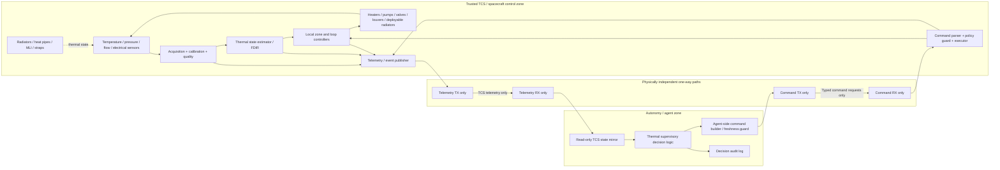
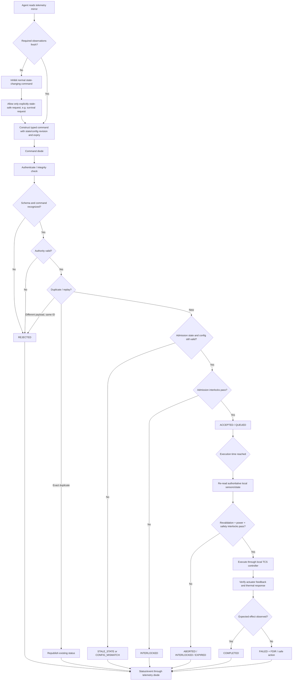
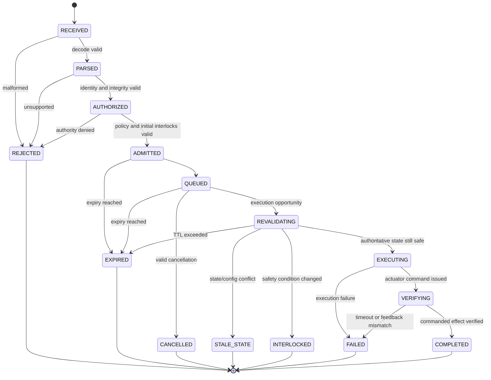
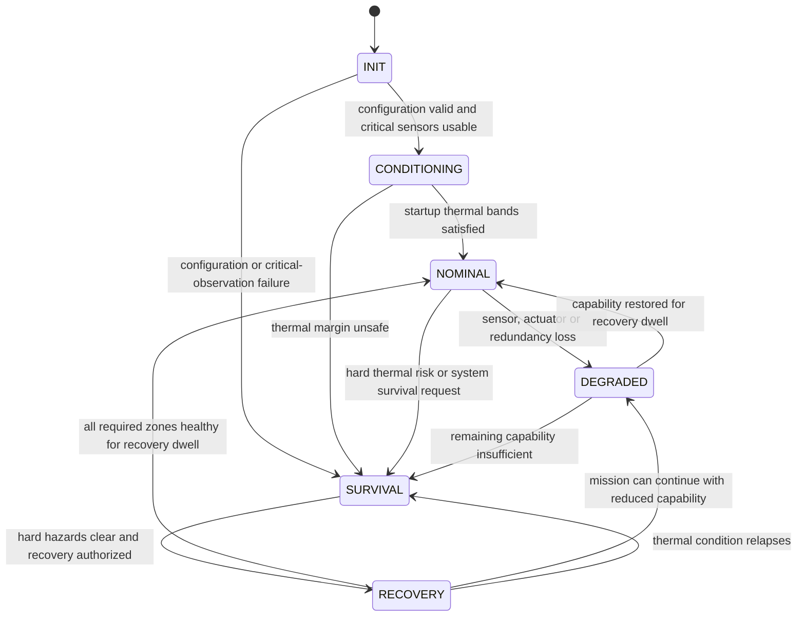

# Mapping a Spacecraft Thermal Control Subsystem into an Executable Telemetry and Diode-Spec Decision Layer

## Executive summary

This report defines a mission-agnostic reference specification for converting a spacecraft Thermal Control Subsystem (TCS) into an **executable telemetry, autonomous-decision, and bounded-command layer** suitable for software agents while preserving the diode-pattern architecture established by the requester’s prior subsystem specifications.

The spacecraft, mission, orbit, payload, thermal architecture, environmental design cases, operating and survival temperature limits, radiator area, heat loads, heater power, pump topology, thermal-fluid properties, mass allocation, volume allocation, telemetry bandwidth, redundancy allocation, and reliability targets are **UNSPECIFIED**. They therefore must not be replaced with generic spacecraft numbers. ECSS-E-ST-31C explicitly requires mission-phase TCS performance, minimum and maximum design temperatures, margins, temperature gradients and stability, heat flux/storage/lift, electrical-power allocation, telemetry/telecommand allocation, and mass allocation to be supplied or agreed at system level; it also requires lifecycle budgets for mass, size, power, energy, TM/TC channels and operations. citeturn13view0turn13view1turn13view3

The resulting execution architecture should have **three distinct control layers**:

1. **Local TCS safety and regulation**, inside the trusted spacecraft/TCS boundary, owns sensor acquisition, calibration, heater deadbands, pump/valve sequencing, actuator protection, thermal FDIR, and any timing whose violation can damage hardware.
2. **Supervisory autonomous TCS logic** reasons over zones, margins, trends, redundancy and resource budgets and requests bounded thermal effects such as “warm this zone using certified profile 3” or “transition loop B to standby pump.” It does not directly pulse relays or synthesize arbitrary pump PWM.
3. **External mission/agent logic** consumes a read-only telemetry mirror and can submit only typed, policy-bounded commands through the command diode.

That control split is consistent with the requester’s communications, RCS/ACS, main-propulsion, GNC, ECLSS and EPDS predecessor specifications, which place fast or safety-critical loops on the trusted/service side, separate observed state from commanded state, use closed typed command vocabularies, and revalidate effects at execution time rather than treating prior command acceptance as permanent authorization. fileciteturn0file0 fileciteturn0file1 fileciteturn0file2 fileciteturn0file3 fileciteturn0file4 fileciteturn0file5

A **single true hardware data diode cannot support an external closed control loop**: by definition, a data diode permits information in only one direction. An external agent that both observes TCS telemetry and influences the TCS therefore requires **two physically independent unidirectional paths**: telemetry TCS→agent and command agent→TCS. This is a dual-diode control architecture, not a one-way information boundary. If the actual security requirement forbids any influence from the lower-trust agent environment back into TCS, the autonomous controller must instead reside inside the trusted TCS domain and only an outward telemetry diode should cross the boundary. citeturn23search0turn23search1

The primary spacecraft thermal baseline for this report is ECSS-E-ST-31C. It requires TCS telemetry for temperatures and, where applicable, pressures, flow rates, voltages, currents and switch states; it also requires identification of all TCS telecommand channels and agreement of software functions such as heater control laws and temperature-sensor calibration. Its detailed-design requirements explicitly cover passive versus active thermal control, single- and two-phase loops, radiators, heaters, active surfaces, active-component control logic, temperature monitoring, startup, nominal, survival, transition/recovery modes, redundancy and FDIR. citeturn14view0turn14view1

The implementation defined here therefore treats a TCS not as a collection of heater switches but as a **typed thermal graph**:

> `ThermalNode → ThermalZone → SensorEvidence → LocalController → ThermalActuator/TransportPath → ResultingState`

Each controlled zone owns mode-dependent threshold profiles, sensor-voting rules, allowable actuators, power/energy limits, timing constraints, redundancy policies and cross-subsystem interlocks. Passive devices such as ordinary radiators, MLI, thermal straps and constant-conductance heat pipes are represented as observable/configured thermal assets but have no fictitious command interface. NASA and ECSS thermal-control references recognize heaters, heat pipes, radiators, louvers, fluid loops, insulation and related devices as thermal-control technologies; ECSS has separate active handbooks for heat pipes, radiators, electrical heating, louvers and fluid loops. citeturn19view0turn18search0turn18search1turn18search4

The principal flight-safety rule is:

> **No numeric temperature threshold, heater limit, pump timing, pressure/flow criterion, power limit, mass allocation or redundancy assumption in the execution software may silently default to an invented “typical spacecraft” value.**

A safety-relevant zone that lacks its mission-approved threshold/profile data is `UNCONFIGURED`, not “nominal.” It may be monitored, but autonomous state-changing control is inhibited except for independently qualified local hardware protection or an explicitly certified fallback profile.

The message model below uses typed, versioned objects with source identity, sequence number, sample and publication times, configuration revision, state revision, quality/provenance and bounded values. CCSDS Space Packets and the TM/TC data-link protocols are appropriate outer mission transports; CCSDS Time Code Formats provide the mission time representation; ECSS Packet Utilization Standard services can carry monitoring/control reports where the mission uses PUS. ECSS explicitly treats PUS as a menu requiring mission tailoring rather than a mandatory all-services implementation. citeturn16search2turn16search3turn15search1turn15search0turn9search2

The recommended final authority hierarchy is:

| Authority | Function | May be overridden by external agent? |
|---|---|---:|
| `S0` | Hardwired thermostat, overcurrent, motor protection, local thermal emergency protection | **No** |
| `A0` | Observation and telemetry requests | N/A |
| `A1` | Reversible bounded thermal-effect requests using certified profiles | Yes, subject to TCS interlocks |
| `A2` | Redundancy/topology changes, pump/valve selection, fault reset, bounded direct mode changes | Only with elevated authority |
| `A3` | Maintenance/test, direct actuator exercise, calibration/configuration operations | Ground/test authorization only |
| Mission safety authority | Changes to certified thermal envelopes or irreversible configuration | Outside normal agent vocabulary |

This authority partition is a proposed TCS specialization of the requester’s prior diode-pattern control model rather than an ECSS-defined authority classification. fileciteturn0file1 fileciteturn0file2 fileciteturn0file5

## Design basis and extracted TCS requirements

ECSS-E-ST-31C is unusually useful for an executable interface specification because it explicitly links physical thermal engineering to telemetry, telecommand, software, budgets, reliability and operational modes. It requires the TCS design to cover all mission phases through end of operating life, use hot and cold dimensioning design cases, obtain minimum and maximum design temperatures and acceptance/qualification margins from the system authority, and specify temperature gradient, stability, uniformity, heat flux, heat storage, heat lift, electrical power, TM/TC and mass requirements. citeturn13view0turn13view1

The underlying thermal model is inherently dynamic. NASA’s current Small Spacecraft thermal-control review expresses spacecraft thermal balance in terms of absorbed solar/planetary energy, internal heat generation, stored heat and radiated heat; ECSS likewise requires hot/cold mission design cases and accounts for environmental loads, boundary temperatures, heat fluxes and interface conductance. Consequently, the decision layer needs trends and thermal-state history rather than only instantaneous temperature limits. citeturn19view0turn13view6

For a lumped executable thermal node, the implementation can use the generic relationship

\[
C_i\frac{dT_i}{dt}
=
Q_{internal,i}
+
Q_{external,i}
+
Q_{heater,i}
+
Q_{transport,in,i}
-
Q_{transport,out,i}
-
Q_{reject,i}
\]

where the physical model can be as simple or sophisticated as the mission requires. **None of the terms above is assumed known merely because a temperature is telemetered.** Heat load, available rejection and time-to-limit are therefore tagged `ESTIMATED` unless directly instrumented.

The extracted requirements and their status are:

| Area | Requirement extracted for the executable specification | Mission value/status |
|---|---|---|
| Spacecraft and mission | TCS must cover all applicable mission phases through operating lifetime. citeturn13view0 | **UNSPECIFIED** |
| Orbital/environmental cases | Applicable orbit, eclipse, orientation, external heat sources, moving geometry and hot/cold design cases must drive the TCS design. citeturn13view0turn13view1 | **UNSPECIFIED** |
| Unit operating temperature limits | Minimum/maximum allowable operating temperatures for each protected item must come from the system/unit authority. ECSS distinguishes these from design, predicted, acceptance and qualification ranges. citeturn14view2 | **UNSPECIFIED** |
| Non-operating/survival limits | Mission/unit specific. | **UNSPECIFIED** |
| Minimum switch-on temperatures | ECSS defines a minimum switch-on/startup temperature concept for equipment. citeturn14view2 | **UNSPECIFIED** |
| Thermal margins | Acceptance and qualification margins are system-authority inputs rather than universal constants. citeturn13view1turn14view2 | **UNSPECIFIED** |
| Temperature gradient | Must be specified as a TCS performance parameter. citeturn13view1 | **UNSPECIFIED** |
| Temperature stability | Must be specified. citeturn13view1 | **UNSPECIFIED** |
| Temperature uniformity | Must be specified. citeturn13view1 | **UNSPECIFIED** |
| Heat flux/load budget | Must cover relevant environmental/internal loads and boundary heat fluxes. citeturn13view1turn13view6 | **UNSPECIFIED** |
| Heat rejection/radiator capacity | Required by thermal design but no spacecraft/radiator sizing is supplied here. | **UNSPECIFIED** |
| Heat storage | TCS performance specification must address heat storage where relevant. citeturn13view1 | **UNSPECIFIED** |
| Heat lift/cooling capacity | Must be specified where active cooling is used. citeturn13view1 | **UNSPECIFIED** |
| Heater/cooler electrical power | TCS must specify peak and average power and duty cycle of electrical TCS items. citeturn13view2 | **UNSPECIFIED** |
| TCS energy budget | ECSS requires an energy budget across lifecycle; eclipse heater-energy constraints are specifically relevant to thermal-balance verification. citeturn13view3turn13view5 | **UNSPECIFIED** |
| Mass | TCS mass allocation/budget required. citeturn13view1turn13view3 | **UNSPECIFIED** |
| Size/volume | ECSS requires a size budget and requires thermal hardware layout/forbidden zones to be controlled. citeturn13view2turn13view3 | **UNSPECIFIED** |
| Radiator keep-out/view constraints | Thermal hardware layout can include unobstructed radiation-to-space and radiator-deployment constraints. citeturn13view2 | **UNSPECIFIED** |
| TM/TC channels/bandwidth | Accuracy, measurement rate, uplink/downlink frequency, onboard/ground handling and override capability are system-level allocations. citeturn14view0 | **UNSPECIFIED** |
| Reliability | System allocates a TCS reliability figure; TCS demonstrates compliance. citeturn13view4 | **UNSPECIFIED** |
| Redundancy | Redundancy may satisfy reliability requirements; TCS must meet applicable system single-point-failure requirements. citeturn13view4 | Architecture/coverage **UNSPECIFIED** |
| Lifetime/degradation | TCS must cover total lifetime and account for environment-driven degradation of materials/properties. citeturn13view3turn13view4 | **UNSPECIFIED** |
| Propulsion thermal interface | Thruster plume heating and post-firing heat soak are TCS inputs; thermally unacceptable operation requires system-level coordination. citeturn13view2 | **UNSPECIFIED** |
| GNC/attitude thermal interface | Attitude restrictions affecting thermal design are system-level requirements. citeturn14view0 | **UNSPECIFIED** |
| ECLSS interface | TCS must conform to ECLS/ECLSS requirements where applicable. citeturn13view3 | Crewed/uncrewed status **UNSPECIFIED** |

A crucial implementation consequence is that **qualification temperature limits are not autonomous operating targets**. ECSS distinguishes calculated, predicted, design, acceptance and qualification temperature concepts and states that the calculated range plus uncertainty is limited to the design range. The decision layer should therefore carry these concepts as separate configuration fields rather than collapsing them into one `temperature_limit`. citeturn14view2

A useful minimum `ThermalZonePolicy` configuration object is therefore:

| Field | Meaning | Requirement |
|---|---|---|
| `zone_id` | Stable zone identifier | Mandatory |
| `profile_id` | Certified mission/mode profile | Mandatory |
| `operating_min_mK`, `operating_max_mK` | Unit operating envelope | Mission supplied |
| `nonop_min_mK`, `nonop_max_mK` | Non-operating/survival envelope | Mission supplied |
| `minimum_switch_on_mK` | Lowest permissible equipment activation temperature | Mission supplied where applicable |
| `design_low_mK`, `design_high_mK` | TCS design limits | Mission supplied |
| `warn_low_mK`, `warn_high_mK` | Autonomous warning thresholds | Mission supplied |
| `hard_low_mK`, `hard_high_mK` | Local thermal-safing thresholds | Mission supplied |
| `heat_on_mK`, `heat_off_mK` | Heater hysteresis pair | Mission supplied |
| `cool_off_mK`, `cool_on_mK` | Cooling hysteresis pair | Mission supplied |
| `sensor_disagreement_mK` | Maximum normal redundant-sensor spread | Mission supplied |
| `max_sample_age_ms` | Maximum observation age for normal decisions | Mission supplied |
| `min_heater_on_ms`, `min_heater_off_ms` | Anti-chatter/minimum-cycle constraints | Mission supplied |
| `recovery_dwell_ms` | Continuous healthy period before recovery | Mission supplied |
| `max_heater_power_mW` | Zone electrical allocation | Mission supplied |
| `max_heater_energy_mJ` | Energy allocation over applicable interval | Mission supplied |
| `priority_class` | Thermal criticality | Mission supplied |
| `fallback_profile_id` | Qualified degraded/survival policy | Mandatory for safety-critical zones |
| `allowed_actuator_ids[]` | Actuators this zone controller may use | Mandatory |
| `required_sensor_ids[]` | Control/monitoring inputs | Mandatory |

For a conventional zone using mutually exclusive heating and cooling, the configuration linter should normally require:

\[
T_{hard,low}
<
T_{warn,low}
\le
T_{heat,on}
<
T_{heat,off}
<
T_{cool,off}
<
T_{cool,on}
\le
T_{warn,high}
<
T_{hard,high}.
\]

That ordering is a **proposed software-safety invariant**, not an ECSS-prescribed numerical relationship. Specialized systems that deliberately use simultaneous cooling plus trim heating may override the non-overlap rule only through an explicitly identified certified profile.

The build/configuration process should fail closed when a safety-relevant zone is missing one of its required limits. `NULL` must not resolve to zero kelvin, zero watts, a manufacturer nominal value, or a generic default.

## Component, telemetry, and command inventory

ECSS requires the thermal ICD to identify locations of heaters, thermostats, flight/test sensors, temperature reference points and thermal-fluid interfaces, and to define electrical interfaces including heater, pump, temperature-sensor and Peltier wiring as well as control thresholds and alarm settings. citeturn13view6 NASA Goddard’s T2D2 facility explicitly supports thermocouples, thermistors, platinum resistance thermometers and diode temperature sensors, demonstrating the principal temperature-sensor families that the execution layer should be able to model without assuming one particular mission technology. citeturn22search0

All accuracy values and actual flight sample rates below are **UNSPECIFIED unless identified as `RIP-REF`**, where `RIP-REF` denotes a recommended software/simulation integration profile from this report, not a flight requirement. ECSS itself makes measurement accuracy and measurement frequency system-level TM/TC requirements. citeturn14view0

**Sensor and observation model**

| Sensor/observation | Representative locations | Required telemetry | Flight accuracy/range | RIP-REF local sample → exported rate |
|---|---|---|---|---:|
| Thermistor | Battery/module surfaces, electronics baseplates, heater-controlled zones, fluid line/cold-plate locations | `temperature`, resistance/raw ADC, calibration ID, quality | **UNSPECIFIED** | 2 Hz → 1 Hz; 10 Hz fault burst |
| PRT/RTD | Precision-controlled equipment, radiator/loop inlet/outlet, reference nodes | `temperature`, resistance/raw ADC, excitation status | **UNSPECIFIED** | 2 Hz → 1 Hz |
| Thermocouple | High-temperature/TPS areas, wide-range structures, test instrumentation | `temperature`, raw EMF, cold-junction/calibration state | **UNSPECIFIED** | Mission specific; 2–10 Hz starting profile |
| Semiconductor/diode temperature sensor | Cryogenic or precision electronics applications where selected | `temperature`, raw measurement, excitation status | **UNSPECIFIED** | Mission specific |
| Mechanical/electronic thermostat | Survival heater or independent local heater cutoff | contact state, trip/set-reset state, continuity | Threshold tolerance **UNSPECIFIED** | Event + 1 Hz state |
| Pressure transducer | Pumped-loop suction/discharge, accumulator, two-phase loop where instrumentation permits | absolute/differential pressure, quality | **UNSPECIFIED** | 20 Hz → 5 Hz |
| Flow meter | Mechanically pumped loop, branch flow path | mass or volumetric flow, direction, quality | **UNSPECIFIED** | 20 Hz → 5 Hz |
| Pump tachometer | Pump shaft/motor | speed, lock/stall indication | **UNSPECIFIED** | 20 Hz → 5 Hz |
| Current/voltage measurement | Heater bank, pump, TEC, cryocooler, motorized louver/valve | voltage, current, calculated electrical power | **UNSPECIFIED** | 10–100 Hz local protection → 2–10 Hz export |
| Valve position/end switch | Isolation, bypass, mixing or flow-control valve | commanded/actual position, open/closed end states | **UNSPECIFIED** | 10 Hz motion → event + 1 Hz |
| Louver position | Actuated louver only | blade/actuator angle, end switches, motor current | **UNSPECIFIED** | 5–10 Hz motion → 1 Hz |
| Radiator mechanism position | Deployable radiator only | angle/position, latch/limit switches | **UNSPECIFIED** | 10 Hz motion → event + 1 Hz |
| Heat-flux sensor | Optional TPS/high-heat-flux instrumentation | heat flux, sensor temperature, quality | **UNSPECIFIED** | Mission specific |
| Derived temperature gradient | Paired temperature channels | ΔT and sensor IDs | Derived | 1 Hz |
| Derived thermal trend | Zone temperature history | `dT/dt`, fit window, confidence | Derived | 1 Hz |
| Derived heat-rejection margin | Thermal model + loop/radiator observations | available/required heat rejection | Model accuracy **UNSPECIFIED** | 0.2–1 Hz |
| Derived time-to-limit | Temperature, slope/model, applicable threshold | seconds to hot/cold threshold, uncertainty | Estimated | 0.2–1 Hz |

ECSS explicitly identifies temperature, pressure, flow, voltage, current and switch-state telemetry for TCS monitoring. citeturn14view0 For TPS/entry instrumentation, NASA’s MEDLI2 is an example of a system using thermocouples, heat-flux sensors and pressure transducers, but this report does not infer that ordinary orbital TCS designs need heat-flux sensors. citeturn22search7

Every temperature sensor should be mapped to a **temperature reference point or thermal node**, not merely to an electrical channel. A sensor dictionary entry therefore needs `thermal_node_id`, `zone_id`, physical-location identifier, sensor technology, calibration revision, uncertainty/accuracy metadata and the component whose thermal state it is intended to represent. ECSS requires heater, thermostat, sensor and reference-point locations to be identified in the thermal ICD. citeturn13view6

**Actuator and passive-asset interfaces**

| Element | Physical role | Required telemetry | Trusted local actuator interface | Normal diode-level command |
|---|---|---|---|---|
| Resistive heater bank | Adds thermal energy | state, duty/power, V/I, thermostat state, relay feedback, accumulated energy | `set_enable`, bounded duty/power or local control setpoint | `REQUEST_ZONE_WARMUP`, `SET_ZONE_PROFILE`, `SET_HEATER_MODE=AUTO/OFF`; direct forced-ON only A2/A3 |
| Survival heater/thermostat | Independent cold protection | thermostat state, heater current, availability | Usually independent/local | External agent may not defeat `S0` protection |
| Thermal louver, passive | Changes effective radiative rejection with temperature | optional temperature/position observation | None | **No command** |
| Thermal louver, actuated | Modulates effective radiator emission | commanded/actual position, motor current, temperature | bounded position or `AUTO` | `SET_LOUVER_MODE`, certified position/profile |
| Mechanical pump | Circulates single-phase coolant | state, RPM, current, inlet/outlet pressure, ΔP, flow, motor temperature | start/stop/speed/ramp | `REQUEST_LOOP_COOLING`, `SELECT_PUMP_STRING`, profile selection |
| Isolation valve | Opens/closes branch | command/feedback position, current, travel time | set open/closed | `SELECT_FLOW_PATH` / topology request |
| Proportional/mixing valve | Regulates branch/bypass | position, inlet/outlet conditions | bounded position/local PID | certified loop/profile request rather than arbitrary percentage |
| Fixed radiator | Radiates heat to space | surface/root temperatures, sink/environment state, rejection estimate | None | **No command** |
| Deployable radiator | Changes available radiation area/view | temperatures, deployment position, latches | deploy/stow if architecture permits | `SET_RADIATOR_CONFIGURATION`, normally A2 |
| Constant-conductance heat pipe | Passive heat transport | evaporator/condenser temperatures, inferred ΔT/transport health | None | **No command** |
| Variable-conductance heat pipe | Variable heat transport | evaporator/condenser/reservoir temperatures and relevant pressure/state | reservoir heater/valve where fitted | certified conductance/profile request |
| Loop heat pipe / capillary loop | Two-phase passive/capillary transport | temperatures, pressures if instrumented, startup status | reservoir heater/TEC/flow-control device if installed | `REQUEST_LHP_START`, `SET_THERMAL_PROFILE` only if actual hardware supports it |
| Thermoelectric cooler | Local heat pumping | hot/cold temperatures, current, voltage, heat-lift estimate | bounded current/power | `REQUEST_LOCAL_COOLING` |
| Cryocooler | Low-temperature active refrigeration | stage temperatures, drive state, current/power, vibration/health as applicable | start/stop/stage drive through dedicated controller | profile/start request, mission specific |
| MLI/coating | Passive heat-transfer control | generally indirect temperature/performance evidence | None | **No command** |
| Thermal strap/interface | Passive conductive coupling | endpoint temperatures, inferred ΔT | None | **No command** |
| PCM/thermal storage | Stores thermal energy | temperature/state-of-charge estimate if modeled | Usually none | **No command**, unless mission hardware includes active controls |

NASA’s 2026 thermal-control review describes electrical-resistance heaters, radiators, thermal louvers and pumped fluid loops and notes that heaters are commonly controlled by thermostats or temperature sensors; it defines a pumped fluid loop as a pump circulating liquid through heat exchangers and a heat sink, typically a radiator. citeturn20view0turn20view1turn20view2 ECSS’s active thermal handbook explicitly includes separate parts for heat pipes, radiators, electrical heating, louvers and fluid loops, while ECSS-E-ST-31-02C Rev.1 covers qualification/acceptance of two-phase heat-transport equipment and expressly does **not** cover mechanically pump-driven loops. citeturn17search1turn17search20turn18search4

The distinction between **passive asset** and **actuator** is important for agents. An ordinary heat pipe must never acquire a fictitious `SET_HEAT_PIPE_FLOW` command simply because an AI interface prefers every component to be controllable. A constant-conductance heat pipe is, by ECSS definition, a heat pipe with fixed thermal conductance at a given saturation temperature; its health is inferred principally from endpoint behavior rather than commanded flow. citeturn17search14

Likewise, the external decision layer should normally command **effects and certified profiles rather than electrical primitives**. A request such as

`REQUEST_ZONE_WARMUP(zone=BATTERY_A, profile=COLD_SOAK_RECOVERY)`

allows the trusted TCS to choose an available heater bank, respect relay dwell, power allocation, sensor quality and thermal interlocks. An external `SET_HEATER_PWM=73.6%` bypasses those responsibilities and should be reserved, if present at all, for A3 integration/test authority. This follows the same architectural principle used by the uploaded propulsion and GNC specifications: agents request bounded outcomes while service-owned controllers retain fast actuation and safety sequencing. fileciteturn0file2 fileciteturn0file3

## Telemetry data contract and implementation schemas

ECSS-E-ST-31C requires TCS TM/TC to identify relevant temperatures, pressures, flow rates, voltages, currents and switch states; the system-level allocation may include accuracy, measurement frequency, uplink/downlink frequency, data handling and override capability. citeturn14view0 That requirement should be implemented as a **data dictionary plus versioned telemetry envelopes**, not as anonymous floating-point values.

The semantic data contract should be independent of its outer mission transport. Where a CCSDS stack is used, the application objects below can be carried in CCSDS Space Packets, with the applicable TM and TC Space Data Link Protocols providing the corresponding links. CCSDS 133.0-B-2 is the active Space Packet Protocol; CCSDS 132.0-B-3 covers TM data link and CCSDS 232.0-B-4 the TC data link. citeturn16search2turn16search3turn15search1 ECSS-E-ST-70-41C can provide the spacecraft packet-utilization/service layer when a mission adopts PUS. citeturn9search2

**Proposed wire representation.** The canonical diode object should use deterministic binary serialization; deterministic CBOR is a suitable default consistent with the requester’s predecessor communications specification, while JSON is retained only as a diagnostic/test projection. fileciteturn0file0 The message semantics below do not depend on that encoding choice.

**Time model.** Every message carries both `sample_time` and `publish_time`. `sample_time` says when the physical quantity was observed; `publish_time` says when the record was assembled. Using only packet receipt time can make a delayed measurement appear fresh. CCSDS 301.0-B-4 provides the common CCSDS framework for time-code data and can be used for the flight encoding. citeturn15search0 The actual epoch, time scale, leap-second handling and correlation accuracy are **UNSPECIFIED** and must be fixed in the mission ICD.

The requester’s prior ECLSS and GNC specifications already establish the useful pattern of preserving measurement time, publication time, provenance and quality rather than collapsing all values into a synthetic “state.” This report carries that rule into TCS. fileciteturn0file3 fileciteturn0file4

**Canonical units**

| Quantity | Canonical execution unit | Presentation unit allowed |
|---|---|---|
| Absolute temperature | kelvin, `K` | °C may be rendered by UI |
| Temperature difference | kelvin, `K` | °C difference |
| Pressure | `Pa` | kPa/bar display only |
| Mass flow | `kg/s` | g/s display only |
| Volumetric flow | `m³/s` where used | Mission display units |
| Heat/power | `W` | mW/kW display |
| Energy | `J` | Wh display permitted but not canonical |
| Voltage | `V` | — |
| Current | `A` | — |
| Angle | `rad` | degrees display |
| Time interval | `s` internally; integer µs timestamps | — |
| Temperature rate | `K/s` | K/min presentation |
| Heat flux | `W/m²` | — |

The execution layer should use **fixed-point integer encoding wherever practical**. For example, an absolute temperature dictionary entry may specify `sint32` with scale `0.001 K/count`; raw `294150` therefore represents `294.150 K`. Invalid measurements are not encoded using magic temperatures such as `-999°C`; validity is carried independently.

**Point dictionary schema**

| Field | Type | Range/constraint | Meaning |
|---|---|---|---|
| `point_id` | `uint32` | 1…4,294,967,295 | Immutable telemetry point ID |
| `canonical_name` | bounded ASCII/UTF-8 string | ≤64 bytes, dictionary only | Human-readable name |
| `component_id` | `uint32` | Registered ID | Physical/logical component |
| `thermal_node_id` | `uint32` | Registered ID | Thermal model/reference point |
| `zone_id` | `uint16` | 0…65,535 | Control zone |
| `encoding` | `uint8 enum` | `S32,U32,S64,U64,BOOL,ENUM` | Raw encoding |
| `scale_num` | `sint64` | nonzero | Scale numerator |
| `scale_den` | `uint64` | >0 | Scale denominator |
| `offset_num` | `sint64` | any | Offset numerator |
| `unit_code` | `uint16` | dictionary enum | Canonical engineering unit |
| `valid_min_raw` | encoded type | mission configured | Sensor/calibration domain |
| `valid_max_raw` | encoded type | mission configured | Sensor/calibration domain |
| `max_age_ms` | `uint32` | 1…4,294,967,295 | Freshness limit |
| `accuracy_raw` | `uint32` or absent | mission supplied | Stated sensor accuracy/uncertainty |
| `calibration_id` | `uint32` | revision-controlled | Calibration conversion |
| `provenance_default` | `uint8 enum` | Direct/derived/estimated/state | Data semantics |
| `criticality` | `uint8` | 0…3 | Decision importance |

Engineering conversion is:

\[
x_{eng}=x_{raw}\frac{scale_{num}}{scale_{den}}+offset.
\]

The dictionary is configuration-controlled; telemetry includes `config_revision`, so a recorded value can always be decoded against the correct scaling/calibration set.

**Common telemetry envelope**

| Field | Type | Range | Rule |
|---|---|---|---|
| `schema_version` | `uint16` | 1…65,535 | Current implementation starts at `1` |
| `message_type` | `uint8 enum` | Registered | `POINT_BATCH`, `EVENT`, `COMMAND_STATUS`, `SNAPSHOT`, `FAULT_RECORD` |
| `source_id` | `uint16` | Registered | Trusted producer |
| `boot_id` | 16-byte value | Any | Changes after producer restart |
| `sequence` | `uint64` | Monotonic per `boot_id` | Detect gaps/duplicates |
| `sample_time_us` | `uint64` | Mission-time domain | Base observation time |
| `publish_time_us` | `uint64` | ≥ sample time except documented clock uncertainty | Packet construction time |
| `state_revision` | `uint64` | Monotonic | Authoritative TCS state revision |
| `config_revision` | `uint32` | Monotonic/config ID | Identifies point/policy dictionary |
| `payload_count` | `uint16` | 0…65,535 | Number of payload records |
| `time_quality` | `uint8` | enum | `LOCKED`, `HOLDOVER`, `UNCERTAIN`, `INVALID` |

**Telemetry point record**

| Field | Type | Constraint |
|---|---|---|
| `point_id` | `uint32` | Must exist in `config_revision` dictionary |
| `sample_offset_us` | `sint32` | Added to envelope sample time |
| `value` | dictionary-selected scalar | No sentinel invalid value |
| `quality_class` | `uint8` | `GOOD`, `SUSPECT`, `STALE`, `INVALID` |
| `quality_flags` | `uint32 bitmask` | Flags below |
| `provenance` | `uint8` | `DIRECT`, `DERIVED`, `ESTIMATED`, `COMMAND_ECHO`, `SIMULATED` |
| `uncertainty_raw` | optional `uint32` | Uses dictionary point scale |

Recommended `quality_flags` are:

| Bit | Flag | Autonomous treatment |
|---:|---|---|
| 0 | `SATURATED` | Treat value as bound, not exact |
| 1 | `OUT_OF_CAL_RANGE` | Do not use for precise regulation |
| 2 | `OPEN_CIRCUIT` | Sensor invalid unless sensor model says otherwise |
| 3 | `SHORT_CIRCUIT` | Sensor invalid |
| 4 | `STUCK_SUSPECTED` | Require corroboration |
| 5 | `REDUNDANCY_DISAGREE` | Enter degraded voting policy |
| 6 | `CALIBRATION_INVALID` | Exclude from control |
| 7 | `TIME_UNCERTAIN` | Do not use for derivative/time-critical logic |
| 8 | `ESTIMATED` | Model-derived, not direct evidence |
| 9 | `TEST_INJECTED` | Test data; prohibited as live flight evidence unless test mode |
| 10 | `TRANSPORT_GAP` | Samples were lost |
| 11 | `OVERFLOW` | Invalid numeric conversion |
| 12 | `SELF_TEST_FAIL` | Degrade sensor/component |
| 13 | `FROZEN_VALUE` | Source has stopped updating |
| 14–31 | Reserved | Must decode as unknown, not fatal |

`GOOD` is intentionally not a bit: quality class and flags are separate so a point cannot simultaneously claim `GOOD` and `INVALID`.

**Sampling and aggregation profile**

The rates below are integration defaults, not flight requirements:

| Channel class | Local processing | Nominal exported telemetry | Event behavior |
|---|---:|---:|---|
| Zone/unit temperature | 2 Hz | 1 Hz | 10 Hz burst on warning/transition |
| Precision temperature loop | Mission controller rate | 1–5 Hz | Preserve extremes |
| Heater V/I/state | 10 Hz | 2 Hz | Immediate state/fault event |
| Pump flow/pressure/RPM/current | 20 Hz | 5 Hz | 20 Hz burst during startup/fault |
| Valve/louver mechanism | 10 Hz while moving | 1 Hz steady | Immediate transition events |
| Radiator/heat-pipe endpoint temperatures | 2 Hz | 1 Hz | 5 Hz on anomaly |
| Thermal-budget/model estimates | 1 Hz | 0.2–1 Hz | Immediate margin alarm |
| Passive configuration | On change | On change | Configuration event |

An exported aggregation window should contain `last`, `min`, `max`, `mean`, `sample_count` and, where useful, `slope`. **A mean must never erase an excursion**: limit monitoring uses the raw/local extrema, not only the average. ECSS thermal-balance testing likewise evaluates temperatures, levels, gradients, differences and variations rather than merely one average value. citeturn13view5

A practical trend estimator can expose:

\[
\dot{T}_{fit},\qquad
t_{high}
=
\frac{T_{high}-T}{\dot T}
\quad(\dot T>0),
\]

and the analogous cold-limit estimate for negative slope. `time_to_limit` is always tagged `ESTIMATED`; a model prediction cannot silently replace a direct hard-limit comparator.

**Command envelope**

| Field | Type | Range/constraint |
|---|---|---|
| `schema_version` | `uint16` | Current `1` |
| `command_id` | 16-byte UUID-like value | Unique for semantic request |
| `command_seq` | `uint64` | Monotonic for authenticated sender/session |
| `issued_time_us` | `uint64` | Required |
| `not_before_us` | `uint64` | ≥ issue time |
| `expires_time_us` | `uint64` | > `not_before`; bounded by command policy |
| `base_state_revision` | `uint64` | State on which requester reasoned |
| `base_config_revision` | `uint32` | Policy/config on which requester reasoned |
| `command_code` | `uint16 enum` | Closed vocabulary |
| `target_id` | `uint32` | Registered zone/component/loop |
| `profile_id` | `uint16` | Pre-certified profile or zero if N/A |
| `max_duration_ms` | `uint32` | Bounded by command class |
| `max_energy_mJ` | `uint64` | Required for bounded heating where applicable |
| `reason_code` | `uint16` | Enumerated decision rationale |
| `payload` | command-specific fixed schema | No arbitrary scripts, code, URLs or paths |

The requester’s predecessor diode specifications already establish the principle that credentials and authoritative state remain on the trusted/service side rather than being supplied as self-asserted fields by an agent. fileciteturn0file0 fileciteturn0file5 Accordingly, `requested_authority` may be informative, but **actual authority is assigned by the trusted ingress guard**.

Recommended external command vocabulary:

| Code | Command | Normal authority | Semantics |
|---:|---|---|---|
| `0x0101` | `ENTER_THERMAL_SURVIVAL` | A1 | Move to certified survival policy; always admissible unless physically impossible |
| `0x0102` | `REQUEST_EXIT_SURVIVAL` | A2 | Request recovery; never directly forces nominal |
| `0x0110` | `SET_TCS_PROFILE` | A1/A2 | Select approved thermal profile |
| `0x0120` | `REQUEST_ZONE_WARMUP` | A1 | Request bounded warming |
| `0x0121` | `REQUEST_ZONE_COOLING` | A1 | Request bounded cooling |
| `0x0130` | `SELECT_PUMP_STRING` | A2 | Change primary/standby pump |
| `0x0131` | `SET_LOOP_MODE` | A1/A2 | `AUTO`, `STANDBY`, `OFF`, certified mode |
| `0x0140` | `SELECT_FLOW_PATH` | A2 | Select pre-defined valve topology |
| `0x0150` | `SET_LOUVER_MODE` | A1/A2 | `AUTO` or approved bounded state |
| `0x0160` | `SET_RADIATOR_CONFIGURATION` | A2 | Deploy/stow/select approved radiator state |
| `0x0170` | `RESET_LATCHED_TCS_FAULT` | A2 | Reset only after fault-clear revalidation |
| `0x0180` | `SET_TELEMETRY_PROFILE` | A1 | Change publication rate within bandwidth policy |
| `0x0190` | `CANCEL_PENDING_COMMAND` | A1/A2 | Cancel command if effect has not become non-cancellable |
| `0x01F0` | `ACTUATOR_TEST` | A3 | Bounded maintenance/integration test |

**Command-status schema**

| Field | Type | Meaning |
|---|---|---|
| `command_id` | 16 bytes | Correlation |
| `command_seq` | `uint64` | Sender sequence |
| `status` | `uint8 enum` | Lifecycle state |
| `reason_code` | `uint16` | Success/rejection/fault reason |
| `event_time_us` | `uint64` | Status transition time |
| `accepted_state_revision` | `uint64` | State at admission |
| `execution_state_revision` | `uint64` | State at effect-time revalidation |
| `post_state_revision` | `uint64` | State after effect/verification |
| `executor_id` | `uint16` | Trusted execution instance |
| `evidence_event_id` | `uint64` | Links actuator/sensor evidence |

Terminal reason codes should at least distinguish `MALFORMED`, `AUTH_FAILURE`, `UNSUPPORTED`, `ARGUMENT_OUT_OF_RANGE`, `STALE_STATE`, `CONFIG_MISMATCH`, `EXPIRED`, `INTERLOCKED`, `POWER_DENIED`, `SENSOR_INVALID`, `REDUNDANCY_LOST`, `ACTUATOR_TIMEOUT`, `FEEDBACK_MISMATCH`, `WATCHDOG`, `DUPLICATE_MISMATCH` and `INTERNAL_FAILURE`.

**Error-handling rules**

| Condition | Required behavior |
|---|---|
| Authentication/integrity failure | Drop object; increment protected counter; emit security event if possible |
| Unknown schema major version | Reject; do not guess layout |
| Unknown telemetry `point_id` | Preserve sequence processing; mark/report unknown point; never reinterpret |
| Value outside calibrated range | Preserve raw value, set `OUT_OF_CAL_RANGE`; do not silently clamp |
| Missing calibration | Mark `INVALID`; no control use |
| Duplicate telemetry sequence | Ignore duplicate for state accumulation |
| Telemetry sequence gap | Set transport-gap/event; do not invent intermediate values |
| Time regression | Set `TIME_UNCERTAIN`; exclude from derivatives until re-established |
| Stale observation | Exclude from new external decision; local control continues with local fresh data |
| Duplicate command with identical hash | Do not re-execute; return/re-publish existing lifecycle status |
| Duplicate `command_id` with different body | Reject as `DUPLICATE_MISMATCH`; security event |
| Expired command | `EXPIRED`; never actuate |
| State/config revision changed | Revalidate or return `STALE_STATE`/`CONFIG_MISMATCH` |
| Partial actuator feedback | Remain `VERIFYING` until timeout or certified partial-success rule |

**Example diagnostic telemetry projection**  
The following JSON is a human-readable projection of the binary object; its numbers are examples of serialization, not flight operating limits.

```json
{
  "schema_version": 1,
  "message_type": "POINT_BATCH",
  "source_id": 257,
  "boot_id": "8b87de4305d54f4f8c2d51c9272a718a",
  "sequence": 884201,
  "sample_time_us": 456789123000,
  "publish_time_us": 456789143000,
  "state_revision": 21911,
  "config_revision": 43,
  "time_quality": "LOCKED",
  "points": [
    {
      "point_id": 10021,
      "sample_offset_us": 0,
      "value": 294150,
      "quality_class": "GOOD",
      "quality_flags": [],
      "provenance": "DIRECT"
    },
    {
      "point_id": 20031,
      "sample_offset_us": -5000,
      "value": 1250,
      "quality_class": "GOOD",
      "quality_flags": [],
      "provenance": "DIRECT"
    },
    {
      "point_id": 50007,
      "sample_offset_us": 0,
      "value": 420,
      "quality_class": "GOOD",
      "quality_flags": ["ESTIMATED"],
      "provenance": "ESTIMATED"
    }
  ]
}
```

For example, the corresponding configuration dictionary could define point `10021` as temperature in `0.001 K/count`, point `20031` as heater current in `0.001 A/count`, and point `50007` as estimated time-to-limit in seconds.

**Example bounded command**

```json
{
  "schema_version": 1,
  "command_id": "2f954c3a0f024566ab22f52513274d75",
  "command_seq": 717,
  "issued_time_us": 456790000000,
  "not_before_us": 456790000000,
  "expires_time_us": 456790030000,
  "base_state_revision": 21911,
  "base_config_revision": 43,
  "command_code": "REQUEST_ZONE_WARMUP",
  "target_id": 12,
  "profile_id": 3,
  "max_duration_ms": 600000,
  "max_energy_mJ": 7200000,
  "reason_code": "COLD_MARGIN_DECLINING"
}
```

The numerical duration/energy values above demonstrate field encoding only; the actual allowed maximums are **UNSPECIFIED** and must be supplied by the spacecraft thermal/power budgets.

**Example status**

```json
{
  "command_id": "2f954c3a0f024566ab22f52513274d75",
  "command_seq": 717,
  "status": "COMPLETED",
  "reason_code": "TARGET_BAND_REACHED",
  "event_time_us": 456912331000,
  "accepted_state_revision": 21911,
  "execution_state_revision": 21914,
  "post_state_revision": 22102,
  "executor_id": 2,
  "evidence_event_id": 9900441
}
```

NASA’s CCDD project is an immediately relevant implementation tool because it is specifically intended to manage cFS command/telemetry data structures and supports data in JSON, EDS and XTCE-related forms; NASA cFS in turn includes scheduler, housekeeping, health-and-safety, limit-checking and stored-command capabilities. These are useful implementation patterns, not requirements of this TCS specification. citeturn9search10turn9search6 CCSDS also now publishes an Electronic Data Sheet dictionary-of-terms practice aimed at defining interfaces offered by flight sensors, actuators and software components. citeturn24search4

## Diode architecture and autonomous decision logic

A dual-diode implementation should make the directionality physically and semantically obvious. The telemetry receiver contains no command parser; the command receiver contains no general-purpose telemetry-query mechanism. Command results return only as ordinary outbound telemetry. A NIST data diode is physically one-way, and this architecture preserves that property separately in each direction. citeturn23search0turn23search1



The dual-diode approach is also the closest TCS mapping to the architecture already used in the uploaded communications, GNC, ECLSS and EPDS work. fileciteturn0file0 fileciteturn0file3 fileciteturn0file4 fileciteturn0file5

The complete command control flow is:



The most important transition is `ACCEPTED → REVALIDATING`: **admission is not execution authorization**. The state may have changed while a command was queued. That principle is inherited directly from the requester’s propulsion, communications, GNC, ECLSS and EPDS specifications. fileciteturn0file0 fileciteturn0file2 fileciteturn0file3 fileciteturn0file4 fileciteturn0file5

The corresponding command object state machine is:



ECSS specifically requires the TCS detailed design to identify startup, nominal, survival, thermal-transition and recovery operations and operational measures for failure detection/correction. citeturn14view1 A corresponding subsystem mode state machine is:



**Temperature decision logic**

No flight thresholds can be provided without the spacecraft specification. The executable logic is nevertheless explicit:

```text
1. Acquire all sensors required by the active ThermalZonePolicy.
2. Exclude INVALID or expired observations.
3. Detect redundancy disagreement before averaging/voting.
4. Form:
      T_cold = lowest credible temperature relevant to cold protection
      T_hot  = highest credible temperature relevant to hot protection
      T_ctrl = policy-selected voted/median/control temperature
5. Evaluate hard thermal protection before normal control.
6. Evaluate warning and trend/time-to-limit logic.
7. Apply heater/cooling hysteresis and minimum dwell.
8. Apply power, actuator, topology and cross-subsystem interlocks.
9. Re-check the same authoritative conditions immediately before actuation.
10. Verify both actuator feedback and, on a thermal-time-scale, direction of response.
```

For heating:

\[
\text{heater\_request} =
\begin{cases}
ON, & T_{ctrl}\le T_{heat,on}\\
OFF, & T_{ctrl}\ge T_{heat,off}\\
\text{retain prior state}, & \text{otherwise}
\end{cases}
\]

with

\[
T_{heat,on}<T_{heat,off}.
\]

For active cooling:

\[
\text{cooling\_request} =
\begin{cases}
ON, & T_{ctrl}\ge T_{cool,on}\\
OFF, & T_{ctrl}\le T_{cool,off}\\
\text{retain prior state}, & \text{otherwise}
\end{cases}
\]

with

\[
T_{cool,off}<T_{cool,on}.
\]

Thus hysteresis is part of the configuration itself, not a hidden software constant.

**Hard-limit behavior**

| Condition | Mandatory decision-layer reaction |
|---|---|
| `T_hot >= hard_high` | Inhibit nonessential heat addition; invoke certified maximum-safe rejection/cooling action; emit `THERMAL_HIGH_CRITICAL`; request system load/attitude mitigation where interfaces permit |
| `T_cold <= hard_low` | Inhibit nonessential cooling; invoke certified survival heating; emit `THERMAL_LOW_CRITICAL` |
| Both hot and cold hard evidence simultaneously from supposedly same zone | Treat primarily as sensor/topology inconsistency; do **not** blindly command heating and cooling simultaneously |
| No credible control sensor | Enter degraded/survival sensor policy; normal external setpoint/profile changes inhibited |
| One sensor remains from redundant set | Mark degraded and follow mission-defined single-sensor policy |
| Redundant sensors disagree beyond `sensor_disagreement` | Set `REDUNDANCY_DISAGREE`; use conservative safety evidence and initiate sensor FDIR |
| Estimated time-to-limit below configured preemption interval | Preemptively transition to higher protection state, subject to estimator confidence and direct evidence |
| Temperature valid but older than `max_sample_age` | Stale for new supervisory decisions |

A useful voting principle is to avoid letting arithmetic averaging hide a dangerous extreme. For a cold-protection decision, the minimum credible sensor is relevant evidence; for hot protection, the maximum credible sensor is relevant evidence. A mission may instead use certified two-out-of-three, weighted estimators or model-based voting. The voting algorithm is therefore a configuration item rather than a universal spacecraft rule.

**Safety interlocks**

The trusted executor should evaluate at least:

| Interlock | Enforcement |
|---|---|
| Thermal hard limits | `S0`; cannot be bypassed by A1/A2 |
| Sensor freshness/quality | Reject normal actuation if required evidence unusable |
| Heater electrical allocation | Predicted active heater power must fit current EPDS allocation/reserve |
| Heater energy budget | Bounded by profile/eclipse/mission-energy allocation |
| Heater stuck-on evidence | Disable upstream controllable switch where architecture permits; isolate bank |
| Pump fluid availability | Pump start inhibited when dry-run is unsafe |
| Pump suction/discharge constraints | Mission-specific range check |
| Minimum two-phase startup conditions | Enforce certified startup requirements |
| Valve topology | Reject combinations that create forbidden path, blocked pump or unsafe isolation |
| Differential-pressure constraint | Mission-specific valve movement interlock |
| Louver/radiator keep-out | Mechanism movement permitted only within mechanical/attitude configuration |
| Minimum equipment switch-on temperature | Publish/integrate `thermal_start_eligible=false` below approved startup temperature |
| Redundancy state | Prevent command that consumes last survival path unless authority/policy explicitly permits |
| Power-system survival/load-shed | EPDS survival constraints outrank normal TCS optimization |
| Propulsion thermal inhibit | TCS exposes predicted/observed thermal readiness for firing sequence integration |
| Control watchdog | Failure transfers to local fallback or survival control |

ECSS specifically calls out minimum startup power of two-phase loops and pump dry-run capability as examples of operational constraints that belong in the TCS ICD. citeturn13view6 It also requires heater/pump electrical interfaces and regulation thresholds to be defined. citeturn13view6

**Priority arbitration**

The execution layer should use an explicit partial order rather than “last command wins”:

| Priority | Class | Examples |
|---:|---|---|
| `P0` | Physical protection | Thermostat cutoff, overcurrent, motor protection, hard thermal trip |
| `P1` | Spacecraft/crew/survival thermal protection | Survival heaters, critical loop cooling, freeze/overheat avoidance |
| `P2` | Mission-critical thermal availability | Thermally condition avionics, propulsion, batteries or critical payload according to spacecraft allocation |
| `P3` | Nominal mission thermal regulation | Normal setpoints, instrument thermal conditioning |
| `P4` | Optimization | Energy savings, preferred pump/louver configuration, telemetry-rate requests |

Actual assignment of components to `P1…P4` is **UNSPECIFIED**.

Conflicts resolve according to the following rules:

1. `S0/P0` always wins.
2. A safe-state transition preempts nominal commands.
3. A command cannot defeat the thermal protection of another higher-criticality zone merely because it was issued later.
4. Simultaneous commands competing for heater/cooling power are admitted against an authoritative resource budget.
5. Power allocation is rechecked at execution time.
6. Commands for redundant paths are serialized if simultaneous transition would temporarily eliminate redundancy.
7. Ordinary agents cannot change threshold values; they select versioned, pre-certified profiles.
8. Direct actuator tests are mutually exclusive with normal autonomous ownership unless the relevant zone has explicitly entered a test/maintenance state.

This last rule is particularly important for agent safety: **the model that reasons about the spacecraft must not also be able to rewrite the limits by which its reasoning is constrained.**

## Sequencing, watchdogs, failure handling, and validation

Thermal systems often evolve more slowly than propulsion or attitude loops, but their **electrical and mechanical actuators still require deterministic local sequencing**. Command latency therefore should not be conflated with thermal response time. Heater relay faults, pump stalls and valve-transition faults are detected by local actuator feedback, while confirmation that a temperature has moved into a desired band may take much longer.

No universal times can be stated because the actual hardware is unspecified. Every safety-relevant actuator must instead have an explicit mission configuration containing transition deadlines, minimum on/off times, allowable duty cycle, feedback criteria and no-progress timeout.

**Reference command sequences**

| Action | Reference execution sequence | Mission-specific values required |
|---|---|---|
| Zone warmup | Revalidate temperature → verify usable sensors → check power/energy allocation → select available heater bank → verify relay/current response → maintain local hysteresis/dwell → monitor temperature trend → stop at profile target or safety/energy limit → verify heater off | Thresholds, heater W, energy cap, relay timeout, min cycle, no-progress time |
| Zone cooling | Revalidate hot evidence → verify radiator/sink/loop availability → check power → configure path → establish cooling device → verify flow/thermal response → regulate locally → recover after hysteresis/dwell | Cooling capacity, pressures, flow, timing, setpoints |
| Pump startup | Confirm fluid/path state → configure required valves/bypass → verify positions → command start at certified startup state → verify RPM/current/pressure/flow → ramp to profile → declare running only after all mandatory feedback | Startup speed/ramp, min flow, pressure bounds, timeout |
| Pump switchover | Start/establish standby path according to certified sequence → verify healthy flow → transfer load/path → stop/isolate failed path → verify redundancy state | Exact topology and overlap/break requirements |
| Pump stop | Reduce load if required → transition valves/bypass → ramp/stop → verify zero/expected flow and electrical state | Stop sequence |
| Valve change | Verify allowable differential pressure/topology → command → monitor travel → verify end/position → timeout as fault | ΔP limit, travel time |
| Louver command | Verify control mode and mechanical/thermal constraints → drive → monitor current/position → stop/hold → verify | Angle/position limits and travel time |
| Deployable radiator | Verify keep-out, attitude and mechanism state → command deployment → monitor intermediate states → verify latch/end state → update thermal model | Mission mechanism sequence |
| Two-phase-loop startup | Verify component temperatures/start conditions → apply certified startup heater/TEC/valve sequence if required → monitor onset of transport → verify evaporator/condenser behavior → declare active | Entire startup envelope is mission specific |
| Survival transition | Cancel/supersede lower-priority optimization → apply survival actuator profile → protect energy reserve → publish mode/event → remain autonomous even if external diode links fail | Survival profile |
| Recovery | Require hard hazards clear → verify sufficient sensors/redundancy/power → enter recovery profile → continuously satisfy conditions for dwell → return nominal or degraded | Recovery dwell/criteria |

ECSS requires TCS operations for startup, nominal, survival and thermal transition/recovery to be defined, and identifies two-phase minimum startup power and pump dry-run behavior as operational constraints requiring specification. citeturn14view1turn13view6

**Watchdogs**

| Watchdog | Trigger | Required response |
|---|---|---|
| Control-task watchdog | Local control task misses configured deadline | Transfer to redundant controller or certified local survival mode |
| Critical-sensor freshness | No valid observation inside `max_age` | Mark stale; degrade voting; inhibit dependent normal commands |
| Telemetry-publisher heartbeat | Publication stops | Local TCS unaffected; external agent enters no-control-on-stale-state policy |
| Command-receiver watchdog | Ingress task stops | Local TCS autonomous control continues |
| Actuator-start watchdog | Command issued, no expected electrical/mechanical feedback | Abort/revert/isolate as certified |
| Heater-current watchdog | Commanded state and measured current inconsistent | `HEATER_OPEN`, `HEATER_STUCK_ON` or power-path fault classification |
| Pump establishment watchdog | RPM/flow/pressure not established in allowed interval | Stop/isolate or transition redundant pump |
| Valve travel watchdog | Position fails to converge | Mark valve failed; prohibit dependent topology |
| Thermal no-progress watchdog | Actuator works electrically but temperature trend fails to respond | Suspect detached heater, lost thermal path, loop failure or sensor fault |
| Max continuous-on watchdog | Heater/cooler active beyond policy bound | Stop or escalate according to certified policy |
| Energy-budget watchdog | Accumulated thermal-control energy reaches cap | Shed lower-priority thermal demand / request higher-level power decision |
| Recovery watchdog | Zone leaves healthy band during dwell | Return to degraded/survival; restart dwell |
| Command TTL | Execution has not begun before expiry | `EXPIRED`, never actuate late |
| State-revision watchdog | Relevant state changes while queued | Force revalidation |
| Time-correlation watchdog | Clock quality drops below allowed class | Disable derivative/absolute-time-dependent commands as required |

A diode failure must itself have deterministic semantics. Loss of **telemetry diode** means the external agent no longer has trustworthy state and therefore stops issuing normal state-changing commands; the trusted TCS continues local autonomous regulation. A pre-authorized `ENTER_THERMAL_SURVIVAL` request may remain admissible under stale external telemetry because it requests a safer certified mode, but the local TCS still revalidates whether and how it can implement it. Loss of **command diode** simply removes external supervisory influence; it must not stop heater regulation or local FDIR.

**Failure-mode and mitigation matrix**

| Failure hypothesis | Detection evidence | Required mitigation / bounded response |
|---|---|---|
| Temperature sensor open/short | Electrical diagnostic, implausible raw value, redundant disagreement | Mark sensor invalid; remove from voting; use remaining qualified sensor set |
| Temperature bias/drift | Redundant spread, model inconsistency, long-term calibration residual | Mark suspect; conservative voting; maintenance event |
| Sensor stuck value | No noise/change despite expected thermal transient or source heartbeat failure | `FROZEN_VALUE`; exclude after confirmed |
| All control sensors lost in zone | All invalid/stale | Enter certified sensor-loss fallback/survival; inhibit ordinary setpoint commands |
| Heater open circuit | ON command with no expected current | Mark heater unavailable; switch redundant bank if available |
| Heater stuck ON/welded switch | OFF command but current persists and/or temperature rises | Remove upstream controllable power where available; inhibit competing actions; high-priority thermal fault |
| Heater detached/poor thermal coupling | Electrical power correct but expected temperature response absent | Disable after no-progress criterion; declare degraded thermal path |
| Pump fails to start | No RPM/flow/ΔP response | Stop command; isolate if required; try standby pump within retry policy |
| Pump stalls after start | RPM collapses/current abnormal/flow lost | Stop/isolate; transition redundant path |
| Unsafe dry-run condition | Fluid/pressure evidence violates certified pump startup envelope | Inhibit start; ECSS requires dry-run capability/constraints to be identified. citeturn13view6 |
| Fluid loop leak/loss | Pressure trend, inventory/flow mismatch, inability to establish flow | Isolate affected branch where possible; reduce loop demand; survival transition |
| Valve stuck | Command/position mismatch after travel timeout | Freeze topology model to observed state; prohibit dependent commands |
| Valve sensor failed | Position evidence inconsistent/invalid | Use independent limit switches/flow evidence if certified; otherwise inhibit topology change |
| Louver jam | Position/current mismatch and thermal-response mismatch | Mark unavailable; use heaters/other rejection path if available |
| Radiator deployment failure | Limit-switch/position failure | Use stowed-state thermal model; reduce heat load; survival/degraded operation |
| Heat-pipe/loop transport degradation | Abnormal evaporator-condenser ΔT versus heat load/model | Mark transport path degraded; reduce heat input / use alternate path |
| Two-phase startup failure | Expected thermal transport not established after certified startup sequence | Terminate/retry per qualified limit; avoid indefinite startup heating |
| Insulation/coating degradation | Persistent model bias or temperatures inconsistent with calibrated environment | Update estimator only through authorized model/config process; operational mitigation |
| Controller software hang | Local watchdog | Reset/fail over to survival controller |
| Configuration corruption | Signature/hash/config revision failure | Reject config; boot certified fallback |
| Command replay | Duplicate ID/sequence | Do not re-execute |
| Queued stale command | `base_state_revision` no longer current | Revalidate and normally `STALE_STATE` |
| Telemetry corruption | Integrity/frame failure | Drop object; preserve prior state only until it becomes stale |
| Time synchronization failure | clock-quality flag/regression | Disable trend/time-critical external decisions as policy dictates |
| Power allocation collapse | EPDS limit/allocation telemetry | Preserve only thermal loads permitted by cross-subsystem survival policy |

ECSS-E-ST-31-02C Rev.1 is the active ECSS qualification/acceptance standard for spacecraft two-phase heat-transport equipment; pressurized thermal hardware such as heat pipes, pumps, lines and valves also falls under applicable pressurized-hardware structural-verification considerations. citeturn17search1turn17search6 NASA’s ST8 thermal-loop work is one primary-source example of multi-evaporator/multi-condenser loop-heat-pipe transport with controlled thermal interfaces, illustrating why such hardware should be represented as a transport subsystem rather than as a generic “cooler.” citeturn9search12

**Executable validation vectors**

These tests are written against configuration symbols, so the same test suite can be instantiated with the eventual mission values without embedding fictitious flight thresholds.

| Test ID | Stimulus | Expected result |
|---|---|---|
| `TV-TCS-001` | `T_ctrl = heat_on - ε`, all interlocks valid | Heater effect request becomes active |
| `TV-TCS-002` | While heating, `heat_on < T_ctrl < heat_off` | Heater retains prior ON state; no chatter |
| `TV-TCS-003` | While heating, `T_ctrl >= heat_off` | Heater transitions OFF subject to min-on rule |
| `TV-TCS-004` | Temperature oscillates entirely inside heater hysteresis | No repeated relay cycling |
| `TV-TCS-005` | `T_hot >= hard_high` while external agent commands warmup | Warmup rejected/interlocked; high-temperature protection wins |
| `TV-TCS-006` | `T_cold <= hard_low` while agent requests cooling | Cooling request rejected; survival cold logic wins |
| `TV-TCS-007` | Three sensors agree, then one deviates beyond `sensor_disagreement` | `REDUNDANCY_DISAGREE`; faulty/suspect branch isolated by voting policy |
| `TV-TCS-008` | Only one of three sensors remains good | Zone `DEGRADED`; normal commands permitted only if single-sensor policy allows |
| `TV-TCS-009` | All required zone sensors older than `max_age` | Normal external commands inhibited; local fallback remains active |
| `TV-TCS-010` | Heater commanded OFF but current remains above off-current criterion | `HEATER_STUCK_ON`; upstream isolation/safe action |
| `TV-TCS-011` | Heater current correct but no expected positive `dT/dt` before no-progress timeout | `THERMAL_NO_PROGRESS`; heater/thermal-path fault |
| `TV-TCS-012` | Pump start with forbidden dry-run condition | Start blocked before actuator command |
| `TV-TCS-013` | Pump start; RPM achieved but flow below minimum | Startup fails; pump stopped or alternate path invoked |
| `TV-TCS-014` | Valve reaches neither commanded position nor limit switch by timeout | Command `FAILED`; path marked unavailable |
| `TV-TCS-015` | Agent submits command based on state `N`; system advances to `N+3` before execution | Effect-time revalidation; `STALE_STATE` or safe replan |
| `TV-TCS-016` | Identical `command_id` and payload delivered twice | One physical effect only; second delivery returns existing status |
| `TV-TCS-017` | Same `command_id`, altered payload | `DUPLICATE_MISMATCH`; no actuation |
| `TV-TCS-018` | Command arrives after `expires_time` | `EXPIRED`; no late actuation |
| `TV-TCS-019` | Telemetry diode fails | Local TCS unchanged; agent inhibits normal commands when mirror becomes stale |
| `TV-TCS-020` | Command diode fails | TCS remains in autonomous local regulation; no fault-induced actuator changes |
| `TV-TCS-021` | Local controller heartbeat stops | Watchdog transfers to certified fallback/survival |
| `TV-TCS-022` | New heater request exceeds authoritative EPDS TCS allocation | Reject/defer lower-priority request; protect reserved thermal loads |
| `TV-TCS-023` | Primary pump fault with healthy standby path | Execute configured switchover; never declare recovered before flow/pressure verification |
| `TV-TCS-024` | Standby pump also unavailable | Enter degraded/survival; no endless retry loop |
| `TV-TCS-025` | Recovery conditions become healthy for less than `recovery_dwell` then relapse | Remain/return survival; dwell resets |
| `TV-TCS-026` | Time jumps backward | `TIME_UNCERTAIN`; derivative/time-tag-dependent decisions inhibited |
| `TV-TCS-027` | Invalid calibration revision for temperature point | Point `INVALID`; never substitute raw ADC as kelvin |
| `TV-TCS-028` | Telemetry batch misses several samples | `TRANSPORT_GAP`; min/max aggregation does not fabricate extrema |
| `TV-TCS-029` | Cooling and heating requests simultaneously target same ordinary zone | Arbitration rejects incompatible pair; local controller owns one coherent mode |
| `TV-TCS-030` | Agent attempts unregistered command/actuator ID | Parsing/admission rejection; no side effect |

Thermal-software verification should be combined with physical thermal verification, not substituted for it. ECSS requires thermal analytical modeling and thermal testing; for radiative/conductive systems its thermal-balance test is intended to validate the thermal model, demonstrate design suitability and hardware performance, and examine sensitivity to parameter changes. The standard calls for two distinct steady-state cases and a transient case for dynamically sensitive items, and considers resource limits such as heater power and eclipse battery energy in test success. citeturn13view4turn13view5

The validation campaign should therefore include:

| Verification layer | Required evidence |
|---|---|
| Schema/unit tests | Encode/decode boundaries, integer scaling, enum exhaustion, unknown-field/version behavior |
| Property tests | Hysteresis invariants, priority invariants, no actuation on invalid evidence, duplicate-command idempotence |
| State-machine tests | Every transition and prohibited transition |
| SIL simulation | Hot/cold mission cases, eclipse/load profiles, sensor and actuator fault injection |
| Model-in-the-loop | Thermal-network model coupled to actual decision service |
| HIL | Real controller/relay/pump/valve electronics where applicable |
| Fault injection | Sensor open/short/bias/stuck, actuator stuck, timing, corruption, power denial, sequence gaps |
| Thermal balance/TVAC | Correlation of temperatures, gradients, actuator power and model predictions |
| Recovery testing | Nominal→degraded→survival→recovery transitions |
| Long-duration test | Heater cycling, watchdogs, memory/sequence rollover, slow thermal drift |
| Security/diode testing | Prove physical directionality, malformed-input containment, authorization and replay handling |

NASA-STD-8739.8B is currently active and defines NASA requirements for systematic software assurance, software safety and IV&V through the software lifecycle; this decision layer should be treated accordingly when it can cause safety-relevant thermal actuation. citeturn9search3

## Prior-spec changes and implementation baseline

There is **no standalone prior TCS specification among the six uploaded predecessor documents**. Consequently, prior TCS-specific values—temperature limits, heater ratings, radiator sizing, thermal-zone definitions, sensor accuracies, sampling rates, pump characteristics, valve timings, thermal-control algorithms and TCS command IDs—are **UNSPECIFIED**. This report does not infer them from the communications, propulsion, GNC, ECLSS or power specifications.

It does, however, deliberately harmonize TCS with the execution conventions established there. The communications specification supplies the closed command vocabulary and dual one-way communication pattern; RCS/ACS and GNC place external autonomy above fast control loops; propulsion emphasizes service-owned sequence timing and execution-time revalidation; ECLSS emphasizes observation quality/provenance and bounded environmental control; EPDS formalizes local hard protection, state revision, command lifecycle and authority separation. fileciteturn0file0 fileciteturn0file1 fileciteturn0file2 fileciteturn0file3 fileciteturn0file4 fileciteturn0file5

The changes/additions introduced for TCS are:

| Area | Prior cross-subsystem pattern | TCS-specific addition/change |
|---|---|---|
| Control ownership | Trusted service retains fast/safety loops | Heater hysteresis, pump/valve sequencing and thermal FDIR explicitly service-owned |
| Physical model | Service owns authoritative physical state | Adds thermal nodes, zones, transport paths, heat rejection/storage and temperature-reference points |
| Telemetry provenance | Direct vs inferred state retained | Adds calculated thermal gradient, `dT/dt`, thermal margin and time-to-limit provenance |
| Limits | Typed bounded controls | Separates operating, startup, design, warning, hard, acceptance and qualification concepts |
| Hysteresis | Used where subsystem needs it | Mandatory paired heat/cool thresholds and minimum dwell for regulated zones |
| Passive hardware | Not central in previous subsystems | Explicit non-commandable radiator, MLI, thermal strap and CCHP objects |
| Active hardware | Effect-oriented control | Adds heater banks, pumps, valves, louvers, deployable radiators, TEC/cryocooler options |
| Redundancy | Service-owned FDIR | Adds redundant temperature voting and thermal-path/pump-string availability |
| Resource arbitration | Power specification already exposes authoritative allocation | TCS commands consume explicit heater/cooler power and energy allocations |
| Cross-subsystem interaction | Existing subsystem services retain authority | TCS exports thermal readiness/inhibit requests; it does not seize GNC/propulsion/EPDS actuators |
| Diode semantics | Telemetry out, bounded command in | Command results travel only through telemetry diode; no reverse ACK path |
| Validation | SIL/HIL/fault injection pattern | Adds ECSS thermal-balance/TVAC correlation and thermal no-progress testing |

The primary-source baseline to freeze alongside the implementation should be:

| Source | Use in this specification |
|---|---|
| **ECSS-E-ST-31C, Thermal control** | Primary TCS mission, performance, interfaces, budgets, telemetry/control, reliability, operational-mode and verification requirements. citeturn10search0turn14view0turn14view1 |
| **ECSS-E-ST-31-02C Rev.1** | Qualification/acceptance baseline for two-phase heat-transport equipment; does not cover mechanical pump-driven loops. citeturn17search1 |
| **ECSS-E-HB-31-01 Parts 8, 9, 11, 12, 13** | Supporting engineering guidance for heat pipes, radiators, electrical heating, louvers and fluid loops. citeturn17search20turn18search0turn18search1turn18search4 |
| **NASA State-of-the-Art of Small Spacecraft Technology, Thermal Control, May 2026** | Current NASA component taxonomy and descriptions of heaters, louvers, radiators and fluid loops; used for architecture context, not universal flight limits. citeturn19view0turn20view0turn20view1 |
| **CCSDS 133.0-B-2** | Space Packet Protocol mapping. citeturn16search2 |
| **CCSDS 132.0-B-3** | TM Space Data Link Protocol. citeturn16search3 |
| **CCSDS 232.0-B-4 + Corr.1** | TC Space Data Link Protocol. citeturn15search1turn15search9 |
| **CCSDS 301.0-B-4** | Time-code representation/correlation basis. citeturn15search0 |
| **CCSDS 355.0-B-2** | Space-link authentication/confidentiality integration where applicable; it defines security header/trailer procedures for CCSDS links. citeturn15search2 |
| **ECSS-E-ST-70-41C** | PUS telemetry/telecommand services and packet structure where selected by the mission. citeturn9search2 |
| **NASA-STD-8739.8B** | Software assurance, software safety and IV&V baseline. citeturn9search3 |
| **NIST SP 800-82 Rev.3 data-diode definition** | Precise meaning of physical one-way boundary and justification for separate telemetry and command diodes. citeturn23search0turn23search2 |

The executable implementation should ultimately consist of five configuration-controlled artifacts:

| Artifact | Contents | Flight rule |
|---|---|---|
| `tcs_components` | Sensors, actuators, passive thermal assets, physical interfaces | IDs immutable after qualification baseline |
| `tcs_points` | Telemetry dictionary, units, scaling, calibration, location, quality rules | No undocumented engineering conversions |
| `tcs_profiles` | Mission/mode-specific thermal thresholds, hysteresis, power limits, redundancy and timing | No safety-critical `NULL` values |
| `tcs_commands` | Closed command vocabulary, arguments, authority, interlocks, timeout and verification rules | No arbitrary executable payload |
| `tcs_fault_policy` | FDIR transitions, retry counts, fallback paths, survival/recovery rules | Local protection has authority over external agents |

A configuration linter should refuse a flight-capable build whenever a safety-critical controlled zone lacks a thermal limit, freshness bound, actuator feedback policy, maximum actuation duration/energy where applicable, fallback behavior, or configuration revision. It should likewise reject duplicate telemetry IDs, dimensional-unit mismatches, heater thresholds with inverted hysteresis, impossible recovery bands, direct commands to passive hardware, unresolved actuator dependencies, and normal commands capable of overriding `S0` interlocks.

The final executable contract is therefore:

> **Agents observe evidence, not hidden thermal truth; request bounded thermal effects, not uncontrolled actuator primitives; operate only on fresh, versioned state; and never outrank local thermal protection. Every effect is revalidated against authoritative sensor, power, redundancy, topology and configuration state at the moment it is applied.**

That rule aligns the TCS with the requester’s existing diode-pattern subsystem architecture while adding the features unique to thermal control: thermal-node provenance, hot/cold envelope semantics, hysteresis, slow-state trend estimation, heater energy accounting, passive heat-transport assets, active-loop sequencing and ECSS thermal-balance verification. fileciteturn0file0 fileciteturn0file2 fileciteturn0file3 fileciteturn0file4 fileciteturn0file5